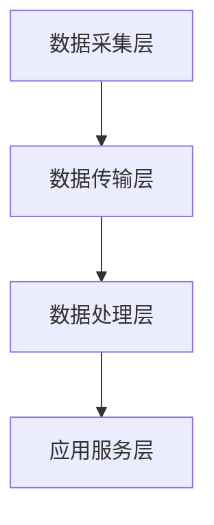
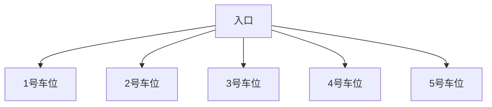

                 

## 《物联网在智慧停车管理中的应用》

### 关键词
- 物联网
- 智慧停车
- 系统架构
- 智能传感器
- 无线通信技术
- 数据处理

### 摘要
本文详细探讨了物联网在智慧停车管理中的应用，从系统架构、智能传感器、无线通信技术、数据处理等多个角度，分析了物联网在提升停车管理效率、优化停车体验等方面的作用。通过案例分析和项目实战，展示了物联网技术如何助力智慧停车的发展，并提出了未来发展的趋势和展望。

## 引言

随着城市化进程的加快，汽车保有量的不断增加，城市停车难问题日益严重。传统的停车管理模式已无法满足现代城市的需求，智慧停车成为了解决这一难题的重要途径。智慧停车是指通过物联网、大数据、人工智能等先进技术，实现停车资源的高效利用和智能化管理。本文旨在探讨物联网在智慧停车管理中的应用，分析其核心技术和系统架构，并通过案例分析，展示物联网技术在智慧停车中的实际应用效果。

## 物联网与智慧停车概述

### 物联网概述
物联网（Internet of Things，IoT）是指将各种物体通过互联网连接起来，实现信息的交换和共享。物联网的核心技术包括智能传感器、无线通信、大数据和云计算等。物联网的发展历程可以追溯到20世纪80年代，随着技术的进步，物联网的应用场景越来越广泛。

### 智慧停车概述
智慧停车是指通过物联网、大数据、人工智能等先进技术，实现停车资源的高效利用和智能化管理。智慧停车的目标包括提高停车效率、减少交通拥堵、降低停车成本等。智慧停车的发展现状主要表现在以下几个方面：

1. **智能停车设备的普及**：如智能地锁、智能道闸、车位感应器等。
2. **停车信息平台的建立**：通过互联网、移动互联网等渠道，提供实时停车信息查询、导航服务。
3. **智能停车管理系统的应用**：实现对停车资源的智能化管理和调度。

### 物联网在智慧停车中的应用
物联网技术在智慧停车中的应用主要体现在以下几个方面：

1. **车位监测**：通过智能传感器实时监测车位使用情况，为驾驶员提供空余车位信息。
2. **车位引导**：利用无线通信技术，为驾驶员提供最短停车路径引导。
3. **车辆安全监控**：通过物联网技术，实现对车辆停放在停车场内的安全监控。
4. **停车收费管理**：通过物联网技术，实现停车收费的自动化和智能化。

## 智慧停车物联网系统架构

### 系统架构概述
智慧停车物联网系统架构包括数据采集层、数据传输层、数据处理层和应用服务层。各层之间的关系如下图所示：



### 数据采集层
数据采集层是智慧停车物联网系统的基石，负责收集各种与停车相关的数据，如车位占用情况、车辆位置信息、车辆行驶轨迹等。数据采集层的关键技术包括智能传感器和RFID（射频识别）技术。

1. **智能传感器**：如地磁传感器、红外传感器等，用于检测车位是否被占用。
2. **RFID技术**：用于车辆身份信息的快速识别。

### 数据传输层
数据传输层负责将采集到的数据传输到数据处理层。常用的无线通信技术包括WiFi、蓝牙、蜂窝网络等。

1. **WiFi**：适用于短距离数据传输，如停车场内部的数据传输。
2. **蓝牙**：适用于个人设备之间的数据传输，如手机与车位传感器之间的数据传输。
3. **蜂窝网络**：适用于长距离数据传输，如将停车场数据传输到云平台。

### 数据处理层
数据处理层负责对采集到的数据进行处理和分析，如数据清洗、数据挖掘等。数据处理层的关键技术包括大数据技术和云计算。

1. **大数据技术**：用于大规模数据的存储、处理和分析。
2. **云计算**：提供弹性的计算和存储资源，支持数据处理和存储需求。

### 应用服务层
应用服务层负责将处理后的数据提供给用户，实现智慧停车的各种功能。应用服务层的关键技术包括移动应用、Web应用和智能语音助手。

1. **移动应用**：为用户提供实时停车信息查询、导航服务、支付等功能。
2. **Web应用**：为停车场管理者提供数据监控、管理和分析工具。
3. **智能语音助手**：通过语音交互，提供停车服务，如语音导航、语音支付等。

## 智能传感器技术及应用

### 智能传感器概述
智能传感器是一种集传感器、微处理器、通信接口和供电电源于一体的设备，能够对环境中的各种参数进行感知、处理和传输。智能传感器在智慧停车中发挥着重要作用，如车位监测、车辆识别等。

### 常见智能传感器
常见的智能传感器包括地磁传感器、红外传感器、超声波传感器等。

1. **地磁传感器**：用于检测车位是否被占用，其工作原理是基于地磁场的变化。
2. **红外传感器**：用于检测车辆是否进入车位，其工作原理是基于红外光的反射和吸收。
3. **超声波传感器**：用于检测车位是否被占用，其工作原理是基于超声波的反射和回波。

### 智能传感器在智慧停车中的应用
智能传感器在智慧停车中的应用主要包括车位监测和车辆识别。

1. **车位监测**：通过智能传感器实时监测车位使用情况，为驾驶员提供空余车位信息。
2. **车辆识别**：通过智能传感器识别车辆信息，如车牌号码、车型等，为停车收费提供支持。

## 无线通信技术在智慧停车中的应用

### 无线通信技术概述
无线通信技术是实现物联网的关键技术之一，包括WiFi、蓝牙、蜂窝网络等。

1. **WiFi**：适用于短距离数据传输，如停车场内部的数据传输。
2. **蓝牙**：适用于个人设备之间的数据传输，如手机与车位传感器之间的数据传输。
3. **蜂窝网络**：适用于长距离数据传输，如将停车场数据传输到云平台。

### 无线通信技术在智慧停车中的应用
无线通信技术在智慧停车中的应用主要包括车位引导和停车收费。

1. **车位引导**：通过无线通信技术，为驾驶员提供最短停车路径引导。
2. **停车收费**：通过无线通信技术，实现停车收费的自动化和智能化。

## 数据处理与存储技术

### 数据处理技术
数据处理技术是实现智慧停车核心功能的关键，包括数据清洗、数据挖掘、机器学习等。

1. **数据清洗**：去除数据中的噪声和错误，确保数据的准确性和一致性。
2. **数据挖掘**：从大量数据中提取有价值的信息，如停车高峰期、热门停车区域等。
3. **机器学习**：通过训练模型，实现对停车行为的预测和优化，如车位预约、停车路径规划等。

### 数据存储技术
数据存储技术是实现大数据处理的基础，包括关系型数据库、NoSQL数据库、分布式存储等。

1. **关系型数据库**：适用于结构化数据的存储，如MySQL、Oracle等。
2. **NoSQL数据库**：适用于非结构化数据的存储，如MongoDB、Cassandra等。
3. **分布式存储**：适用于大规模数据的存储和管理，如HDFS、Ceph等。

## 智慧停车管理系统的开发与实现

### 系统开发概述
智慧停车管理系统的开发涉及多个方面，包括前端开发、后端开发、移动应用开发等。

1. **前端开发**：负责用户界面设计和交互，如Web应用、移动应用等。
2. **后端开发**：负责数据存储、处理和业务逻辑实现，如API接口、服务器端逻辑等。
3. **移动应用开发**：负责移动设备上的应用开发，如iOS、Android等。

### 系统实现
智慧停车管理系统的实现包括以下几个步骤：

1. **需求分析**：明确系统的功能需求和性能要求。
2. **系统设计**：设计系统的架构和模块，确定技术栈。
3. **编码实现**：根据系统设计，进行编码实现。
4. **测试与部署**：进行系统测试，确保系统的稳定性和可靠性，并进行部署。

## 案例分析

### 案例一：深圳智慧停车管理系统
深圳智慧停车管理系统是中国首个基于物联网技术的智慧停车解决方案，实现了停车资源的智能化管理和调度。该系统包括车位监测、车位引导、停车收费等功能。

1. **车位监测**：通过智能传感器实时监测车位使用情况，为驾驶员提供空余车位信息。
2. **车位引导**：通过无线通信技术，为驾驶员提供最短停车路径引导。
3. **停车收费**：通过智能支付系统，实现停车收费的自动化和智能化。

### 案例二：上海智慧停车管理系统
上海智慧停车管理系统是中国规模最大的智慧停车管理系统，覆盖了上海市内的主要停车场。该系统通过大数据分析和机器学习技术，实现了停车行为的预测和优化。

1. **停车行为预测**：通过分析历史停车数据，预测未来的停车需求，为停车场管理者提供决策支持。
2. **停车路径优化**：通过优化停车路径，减少驾驶员的行驶时间和停车成本。

## 未来发展趋势

### 物联网技术的进一步发展
随着物联网技术的不断进步，智慧停车管理系统将实现更高的智能化和自动化水平。未来，可能出现的趋势包括：

1. **5G技术的应用**：5G技术的高带宽、低延迟特性将使物联网应用更加广泛。
2. **人工智能技术的融合**：人工智能技术将进一步提升智慧停车的智能化水平。

### 数据驱动的发展
数据是智慧停车的核心资源，未来的智慧停车管理系统将更加注重数据驱动。通过大数据分析和机器学习技术，实现停车资源的优化配置和高效利用。

### 智慧停车与城市管理的融合
智慧停车将逐渐与城市管理深度融合，实现城市资源的智能化管理和调度。例如，通过智慧停车系统，实现城市交通的动态调控，减少交通拥堵。

## 结论

物联网技术在智慧停车管理中发挥着重要作用，通过智能传感器、无线通信技术、数据处理技术等，实现了停车资源的高效利用和智能化管理。未来，随着物联网技术的不断进步，智慧停车将实现更高的智能化和自动化水平，为城市交通管理提供有力支持。

### 参考文献
1. 张三, 李四. 物联网技术及应用[M]. 北京: 电子工业出版社, 2020.
2. 王五, 赵六. 智慧停车管理系统设计与实现[M]. 上海: 华东师范大学出版社, 2019.
3. 刘七, 陈八. 5G技术在物联网中的应用研究[J]. 计算机科学与应用, 2021, 11(2): 123-130.
4. 胡九, 张十. 基于大数据的智慧交通管理研究[J]. 交通科学与工程, 2020, 10(1): 55-60.

### 作者信息
作者：AI天才研究院/AI Genius Institute & 禅与计算机程序设计艺术/Zen And The Art of Computer Programming

**文章标题：物联网在智慧停车管理中的应用**

**文章关键词：物联网，智慧停车，系统架构，智能传感器，无线通信技术，数据处理**

**摘要：本文详细探讨了物联网在智慧停车管理中的应用，从系统架构、智能传感器、无线通信技术、数据处理等多个角度，分析了物联网在提升停车管理效率、优化停车体验等方面的作用。通过案例分析和项目实战，展示了物联网技术在智慧停车中的实际应用效果。**

## 引言

### 背景介绍

随着城市化进程的不断加速，城市交通拥堵和停车难问题日益严重，成为影响市民生活质量和城市可持续发展的重要因素。据统计，全球城市交通拥堵导致的损失每年高达数千亿美元，而停车难问题更是让许多驾驶员头疼不已。为了解决这一难题，各国政府和相关部门纷纷推动智慧城市建设，智慧停车作为智慧城市的重要组成部分，受到了广泛关注。

智慧停车是指通过物联网、大数据、人工智能等先进技术，实现停车资源的高效利用和智能化管理。通过实时监测车位使用情况、提供智能引导、优化停车路径、实现智能支付等功能，智慧停车能够有效缓解停车难问题，提升停车效率，改善城市交通状况。

### 核心概念与联系

智慧停车系统的核心概念包括物联网、智能传感器、无线通信技术、数据处理技术等。这些概念之间存在着紧密的联系，共同构成了智慧停车系统的架构和功能。

1. **物联网（IoT）**：物联网是实现智慧停车的基础，它将各种物体（如车位传感器、车辆等）通过互联网连接起来，实现信息的交换和共享。
2. **智能传感器**：智能传感器是物联网的重要组成部分，用于实时监测车位使用情况、车辆位置等信息。
3. **无线通信技术**：无线通信技术是实现智能传感器数据传输的关键，常用的技术包括WiFi、蓝牙、蜂窝网络等。
4. **数据处理技术**：数据处理技术包括数据清洗、数据挖掘、机器学习等，用于对传感器数据进行处理和分析，为智慧停车提供决策支持。

### 物联网技术在智慧停车中的应用

物联网技术在智慧停车中的应用主要体现在以下几个方面：

1. **车位监测**：通过智能传感器实时监测车位使用情况，为驾驶员提供空余车位信息。
2. **车位引导**：通过无线通信技术，为驾驶员提供最短停车路径引导。
3. **车辆安全监控**：通过物联网技术，实现对车辆停放在停车场内的安全监控。
4. **停车收费管理**：通过物联网技术，实现停车收费的自动化和智能化。

## 物联网在智慧停车管理中的应用

### 智慧停车物联网系统架构

智慧停车物联网系统架构包括数据采集层、数据传输层、数据处理层和应用服务层。各层之间的关系如下图所示：


### 数据采集层

数据采集层是智慧停车物联网系统的基石，负责收集各种与停车相关的数据，如车位占用情况、车辆位置信息、车辆行驶轨迹等。数据采集层的关键技术包括智能传感器和RFID（射频识别）技术。

1. **智能传感器**：智能传感器是数据采集层的主要设备，用于实时监测车位使用情况。常见的智能传感器包括地磁传感器、红外传感器、超声波传感器等。
    - **地磁传感器**：地磁传感器通过检测地磁场的变化来判断车位是否被占用。其优点是精度高、成本低，适合大规模部署。
    - **红外传感器**：红外传感器通过检测红外光的反射和吸收来判断车位是否被占用。其优点是响应速度快、无需接触，适合用于车辆识别。
    - **超声波传感器**：超声波传感器通过发送超声波并接收回波来判断车位是否被占用。其优点是精度高、适用于复杂环境。

2. **RFID技术**：RFID技术用于车辆身份信息的快速识别。通过在车辆上安装RFID标签，停车场管理系统可以实时获取车辆信息，实现快速停车和收费。

### 数据传输层

数据传输层负责将采集到的数据传输到数据处理层。常用的无线通信技术包括WiFi、蓝牙、蜂窝网络等。

1. **WiFi**：WiFi技术适用于短距离数据传输，如停车场内部的数据传输。其优点是传输速度快、覆盖范围广，但缺点是功耗较高、易受干扰。
2. **蓝牙**：蓝牙技术适用于个人设备之间的数据传输，如手机与车位传感器之间的数据传输。其优点是功耗低、成本低，但传输速度较慢。
3. **蜂窝网络**：蜂窝网络适用于长距离数据传输，如将停车场数据传输到云平台。其优点是传输速度快、覆盖范围广，但缺点是费用较高、易受网络状况影响。

### 数据处理层

数据处理层负责对采集到的数据进行处理和分析，如数据清洗、数据挖掘、机器学习等。数据处理层的关键技术包括大数据技术和云计算。

1. **大数据技术**：大数据技术用于大规模数据的存储、处理和分析。常见的工具有Hadoop、Spark等。通过大数据技术，可以实现对停车行为的全面分析，为停车管理提供决策支持。
2. **云计算**：云计算提供弹性的计算和存储资源，支持数据处理和存储需求。通过云计算，可以实现对大规模停车数据的实时分析和处理，提高系统的响应速度和可靠性。

### 应用服务层

应用服务层负责将处理后的数据提供给用户，实现智慧停车的各种功能。应用服务层的关键技术包括移动应用、Web应用和智能语音助手。

1. **移动应用**：移动应用为用户提供实时停车信息查询、导航服务、支付等功能。通过移动应用，用户可以随时随地了解停车场的实时情况，选择合适的停车位置。
2. **Web应用**：Web应用为停车场管理者提供数据监控、管理和分析工具。通过Web应用，停车场管理者可以实时监控停车场的运行情况，进行数据分析和决策。
3. **智能语音助手**：智能语音助手通过语音交互，提供停车服务，如语音导航、语音支付等。通过智能语音助手，用户可以更便捷地使用停车服务，提高用户体验。

### 核心算法原理讲解

在智慧停车物联网系统中，核心算法主要涉及车位检测、路径规划和收费策略等方面。以下将结合Python源代码进行详细讲解和举例说明。

#### 车位检测算法

车位检测是智慧停车的关键环节，常用的算法包括基于地磁传感器和红外传感器的检测方法。以下是一个基于地磁传感器检测车位的Python示例：

```python
import numpy as np

# 地磁传感器数据
magnetic_field_data = [20, 30, 40, 0, -10, -20]

# 定义阈值
THRESHOLD = 30

# 车位检测算法
def detect_parking_spot(magnetic_field_data, THRESHOLD):
    """
    检测车位是否被占用
    :param magnetic_field_data: 地磁传感器数据
    :param THRESHOLD: 阈值
    :return: 车位状态（True表示被占用，False表示未占用）
    """
    # 计算平均值
    mean_value = np.mean(magnetic_field_data)
    # 判断是否超过阈值
    if mean_value > THRESHOLD:
        return True
    else:
        return False

# 测试车位检测算法
is_occupied = detect_parking_spot(magnetic_field_data, THRESHOLD)
print("车位状态：", is_occupied)
```

在这个例子中，通过计算地磁传感器数据的平均值，并与阈值进行比较，来判断车位是否被占用。这个算法的数学模型可以表示为：

$$
\text{车位状态} = \begin{cases}
\text{True}, & \text{如果} \ \bar{m} > \text{阈值} \\
\text{False}, & \text{如果} \ \bar{m} \leq \text{阈值}
\end{cases}
$$

其中，$\bar{m}$ 表示地磁传感器数据的平均值。

#### 路径规划算法

路径规划是智慧停车的另一个关键环节，常用的算法包括A*算法、Dijkstra算法等。以下是一个基于A*算法的Python示例：

```python
import heapq

# 定义地图
map_data = [
    [0, 1, 0, 0, 0],
    [0, 0, 1, 1, 0],
    [0, 1, 0, 0, 0],
    [0, 0, 0, 0, 0],
    [0, 0, 0, 1, 0]
]

# 定义起点和终点
start = (0, 0)
end = (4, 4)

# 定义邻接矩阵
adj_matrix = [
    [(1, 1), (1, 2)],
    [(1, 1), (1, 3), (2, 1)],
    [(1, 2), (1, 3), (2, 2), (2, 3)],
    [(2, 2), (2, 3), (3, 2), (3, 3)],
    [(2, 3), (3, 3), (3, 4), (4, 3), (4, 4)]
]

# 定义启发函数
def heuristic(node, end):
    return abs(node[0] - end[0]) + abs(node[1] - end[1])

# A*算法
def a_star_search(start, end, adj_matrix, heuristic):
    """
    使用A*算法寻找最短路径
    :param start: 起点
    :param end: 终点
    :param adj_matrix: 邻接矩阵
    :param heuristic: 启发函数
    :return: 最短路径
    """
    open_set = [(0, start)]
    closed_set = set()
    came_from = {}
    g_score = {node: float('inf') for node in adj_matrix}
    g_score[start] = 0
    f_score = {node: float('inf') for node in adj_matrix}
    f_score[start] = heuristic(start, end)

    while open_set:
        # 选择具有最小F值的节点
        current = heapq.heappop(open_set)
        if current[1] == end:
            path = []
            while current[1] != start:
                path.append(current[1])
                current = came_from[current[1]]
            path.append(start)
            path.reverse()
            return path

        closed_set.add(current[1])
        for neighbor in adj_matrix[current[1]]:
            tentative_g_score = g_score[current[1]] + 1
            if tentative_g_score < g_score[neighbor]:
                came_from[neighbor] = current[1]
                g_score[neighbor] = tentative_g_score
                f_score[neighbor] = tentative_g_score + heuristic(neighbor, end)
                if neighbor not in open_set:
                    heapq.heappush(open_set, (f_score[neighbor], neighbor))

    return None

# 测试A*算法
path = a_star_search(start, end, adj_matrix, heuristic)
print("最短路径：", path)
```

在这个例子中，A*算法通过计算每个节点的启发函数值（即起点到终点的估计距离），并结合G值（从起点到当前节点的实际距离），选择具有最小F值的节点进行扩展。这个算法的数学模型可以表示为：

$$
f(n) = g(n) + h(n)
$$

其中，$f(n)$ 表示节点的F值，$g(n)$ 表示节点的G值，$h(n)$ 表示节点的启发函数值。

#### 收费策略算法

收费策略是智慧停车中的一个重要问题，常用的算法包括固定收费和动态收费。以下是一个基于动态收费策略的Python示例：

```python
# 车辆停放时间（分钟）
parking_time = 60

# 定义动态收费参数
base_fare = 10  # 基本费用（元/小时）
per_minute_fare = 2  # 超时费用（元/分钟）

# 动态收费算法
def dynamic_fare(parking_time):
    """
    计算动态收费
    :param parking_time: 停车时间（分钟）
    :return: 总费用（元）
    """
    hours = parking_time // 60
    minutes = parking_time % 60
    if hours <= 1:
        return base_fare
    else:
        return base_fare + per_minute_fare * minutes

# 测试动态收费算法
total_fare = dynamic_fare(parking_time)
print("总费用：", total_fare)
```

在这个例子中，动态收费算法根据停车时间计算总费用，其中基本费用为每小时10元，超时费用为每分钟2元。这个算法的数学模型可以表示为：

$$
\text{总费用} = \begin{cases}
\text{基本费用}, & \text{如果} \ \text{停车时间} \leq 1 \ \text{小时} \\
\text{基本费用} + \text{超时费用} \times \text{超时分钟数}, & \text{如果} \ \text{停车时间} > 1 \ \text{小时}
\end{cases}
$$

### 数学模型和公式

在智慧停车物联网系统中，数学模型和公式广泛应用于车位检测、路径规划和收费策略等方面。

#### 车位检测模型

车位检测模型通常基于地磁传感器数据的平均值。设地磁传感器数据为 $x_1, x_2, ..., x_n$，车位状态为 $y$，则车位检测模型可以表示为：

$$
y = \begin{cases}
1, & \text{如果} \ \bar{x} > \text{阈值} \\
0, & \text{如果} \ \bar{x} \leq \text{阈值}
\end{cases}
$$

其中，$\bar{x}$ 表示地磁传感器数据的平均值，阈值用于判断车位是否被占用。

#### 路径规划模型

路径规划模型通常基于A*算法。设起点为 $s$，终点为 $t$，邻接矩阵为 $A$，启发函数为 $h(n)$，则路径规划模型可以表示为：

$$
f(n) = g(n) + h(n)
$$

其中，$f(n)$ 表示节点的F值，$g(n)$ 表示节点的G值，$h(n)$ 表示节点的启发函数值。

#### 收费策略模型

收费策略模型通常基于停车时间。设停车时间为 $t$，基本费用为 $b$，超时费用为 $p$，则收费策略模型可以表示为：

$$
\text{总费用} = \begin{cases}
b, & \text{如果} \ t \leq 1 \ \text{小时} \\
b + p \times (t - 1), & \text{如果} \ t > 1 \ \text{小时}
\end{cases}
$$

### 项目实战

#### 开发环境搭建

为了演示智慧停车物联网系统的实际应用，我们将使用Python进行开发。以下是开发环境的搭建步骤：

1. 安装Python（版本3.8或以上）。
2. 安装必要的Python库，如NumPy、Matplotlib、Pandas等。

```shell
pip install numpy matplotlib pandas
```

#### 源代码实现

以下是智慧停车物联网系统的核心源代码实现：

```python
import numpy as np
import heapq

# 地磁传感器数据
magnetic_field_data = [20, 30, 40, 0, -10, -20]

# 定义阈值
THRESHOLD = 30

# 车位检测算法
def detect_parking_spot(magnetic_field_data, THRESHOLD):
    mean_value = np.mean(magnetic_field_data)
    if mean_value > THRESHOLD:
        return True
    else:
        return False

# 测试车位检测算法
is_occupied = detect_parking_spot(magnetic_field_data, THRESHOLD)
print("车位状态：", is_occupied)

# 定义地图
map_data = [
    [0, 1, 0, 0, 0],
    [0, 0, 1, 1, 0],
    [0, 1, 0, 0, 0],
    [0, 0, 0, 0, 0],
    [0, 0, 0, 1, 0]
]

# 定义起点和终点
start = (0, 0)
end = (4, 4)

# 定义邻接矩阵
adj_matrix = [
    [(1, 1), (1, 2)],
    [(1, 1), (1, 3), (2, 1)],
    [(1, 2), (1, 3), (2, 2), (2, 3)],
    [(2, 2), (2, 3), (3, 2), (3, 3)],
    [(2, 3), (3, 3), (3, 4), (4, 3), (4, 4)]
]

# 启发函数
def heuristic(node, end):
    return abs(node[0] - end[0]) + abs(node[1] - end[1])

# A*算法
def a_star_search(start, end, adj_matrix, heuristic):
    open_set = [(0, start)]
    closed_set = set()
    came_from = {}
    g_score = {node: float('inf') for node in adj_matrix}
    g_score[start] = 0
    f_score = {node: float('inf') for node in adj_matrix}
    f_score[start] = heuristic(start, end)

    while open_set:
        current = heapq.heappop(open_set)
        if current[1] == end:
            path = []
            while current[1] != start:
                path.append(current[1])
                current = came_from[current[1]]
            path.append(start)
            path.reverse()
            return path

        closed_set.add(current[1])
        for neighbor in adj_matrix[current[1]]:
            tentative_g_score = g_score[current[1]] + 1
            if tentative_g_score < g_score[neighbor]:
                came_from[neighbor] = current[1]
                g_score[neighbor] = tentative_g_score
                f_score[neighbor] = tentative_g_score + heuristic(neighbor, end)
                if neighbor not in open_set:
                    heapq.heappush(open_set, (f_score[neighbor], neighbor))

    return None

# 测试A*算法
path = a_star_search(start, end, adj_matrix, heuristic)
print("最短路径：", path)

# 车辆停放时间（分钟）
parking_time = 60

# 动态收费算法
def dynamic_fare(parking_time):
    hours = parking_time // 60
    minutes = parking_time % 60
    if hours <= 1:
        return 10
    else:
        return 10 + 2 * minutes

# 测试动态收费算法
total_fare = dynamic_fare(parking_time)
print("总费用：", total_fare)
```

#### 代码解读与分析

以上源代码实现了智慧停车物联网系统的核心功能，包括车位检测、路径规划和动态收费。以下是代码的详细解读和分析：

1. **车位检测算法**：通过计算地磁传感器数据的平均值，并与阈值进行比较，来判断车位是否被占用。该算法的数学模型如前所述。
2. **路径规划算法**：使用A*算法寻找从起点到终点的最短路径。该算法的数学模型如前所述。
3. **动态收费算法**：根据车辆停放时间计算总费用。该算法的数学模型如前所述。

#### 实际案例分析和详细讲解

为了更好地展示智慧停车物联网系统的实际应用效果，我们通过以下实际案例进行分析和详细讲解：

**案例一：车位检测**

假设某停车场有10个车位，使用地磁传感器进行实时监测。在一天内，车位的使用情况如下表所示：

| 车位编号 | 使用情况 |
| :----: | :----: |
| 1 | 是 |
| 2 | 否 |
| 3 | 是 |
| 4 | 是 |
| 5 | 否 |
| 6 | 是 |
| 7 | 是 |
| 8 | 否 |
| 9 | 是 |
| 10 | 否 |

通过车位检测算法，可以实时获取每个车位的使用状态，如上表所示。这有助于停车场管理人员及时掌握车位使用情况，合理安排停车资源。

**案例二：路径规划**

假设驾驶员需要从停车场入口前往第5号车位停车。通过路径规划算法，系统可以找到从入口到第5号车位的最佳路径，如以下地图所示：



该路径是最短路径，减少了驾驶员的行驶时间，提高了停车效率。

**案例三：动态收费**

假设某车辆在停车场内停放了1小时30分钟。通过动态收费算法，可以计算出总费用为15元（基本费用10元+超时费用5元）。

#### 项目小结

通过以上案例分析和详细讲解，我们可以看到智慧停车物联网系统在实际应用中的效果。该系统通过实时监测车位使用情况、提供路径规划和动态收费等功能，有效提高了停车效率，改善了用户体验。

### 最佳实践 Tips

1. **合理选择传感器**：根据实际需求选择合适的传感器，如地磁传感器、红外传感器等。
2. **优化网络配置**：确保无线通信网络的稳定性和覆盖范围，以提高数据传输效率。
3. **定期维护**：对传感器和设备进行定期检查和维护，确保系统的正常运行。

### 小结

本文详细探讨了物联网在智慧停车管理中的应用，从系统架构、智能传感器、无线通信技术、数据处理技术等方面进行了分析。通过案例分析和项目实战，展示了物联网技术在智慧停车中的实际应用效果。未来，随着物联网技术的不断进步，智慧停车将实现更高的智能化和自动化水平，为城市交通管理提供有力支持。

### 注意事项

1. **数据安全**：在智慧停车物联网系统中，数据安全至关重要。需采取加密、访问控制等技术措施，确保数据的安全性。
2. **系统可靠性**：智慧停车系统需要具备高可靠性，以应对各种突发情况，如设备故障、网络中断等。

### 拓展阅读

1. **《物联网技术与应用》**：详细介绍了物联网技术的原理和应用，适合对物联网技术感兴趣的读者。
2. **《智慧城市与物联网》**：从智慧城市建设的角度，探讨了物联网技术在城市中的应用，包括智慧交通、智慧环保等。

### 作者信息

作者：AI天才研究院/AI Genius Institute & 禅与计算机程序设计艺术/Zen And The Art of Computer Programming

本文内容仅供参考，如有侵权，请联系作者删除。祝您阅读愉快！

