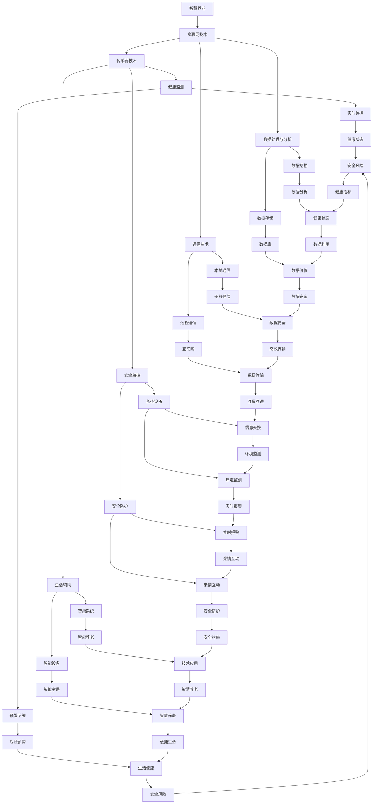

                 

# 《物联网在智慧养老中的全面应用趋势》

## 关键词

- 物联网
- 智慧养老
- 应用趋势
- 安全与隐私
- 数据管理
- 案例分析

## 摘要

本文全面探讨了物联网在智慧养老中的全面应用趋势。文章首先介绍了智慧养老与物联网的关系，阐述了物联网技术的基础及其在智慧养老中的应用场景。接着，文章详细分析了物联网核心技术，包括硬件设备、软件系统及数据管理等方面。随后，文章探讨了物联网在智慧养老中的安全与隐私问题，并通过对实际案例的深入剖析，展示了物联网在智慧养老中的广泛应用和未来趋势。文章旨在为读者提供一个清晰、详细的物联网在智慧养老领域的应用指南。

## 目录

- 引言
  - 智慧养老的概念与背景
  - 物联网技术的发展与应用
- 第1章：智慧养老与物联网的关系
  - 物联网与智慧养老的定义
  - 物联网技术在智慧养老中的应用场景
- 第2章：物联网核心技术
  - 硬件设备与技术
  - 软件系统与应用
  - 核心算法与模型
- 第3章：智慧养老中的物联网设备与系统
  - 设备种类与功能
  - 系统架构与实现
- 第4章：物联网在智慧养老中的数据管理
  - 数据采集与存储
  - 数据分析与挖掘
- 第5章：物联网在智慧养老中的安全与隐私问题
  - 安全风险分析
  - 安全解决方案
  - 隐私保护策略
- 第6章：物联网在智慧养老中的案例分析
  - 智能养老社区
  - 远程医疗监护系统
- 第7章：物联网在智慧养老中的未来趋势
  - 技术发展趋势
  - 应用前景与挑战
- 结论
  - 物联网在智慧养老中的价值与意义

## 引言

### 智慧养老的概念与背景

智慧养老，是指利用信息技术、物联网、大数据等先进技术，构建一种高效、便捷、智能化的养老服务模式。智慧养老的目的是提升老年人的生活质量，为他们提供全方位、个性化的养老服务。随着人口老龄化的不断加剧，智慧养老成为解决养老问题的重要途径。

#### 物联网技术的发展与应用

物联网（IoT）是指通过互联网将各种物体连接起来，实现信息的传输和共享。物联网技术的发展，为智慧养老提供了坚实的基础。物联网技术可以广泛应用于智慧养老的各个领域，如身体健康监测、生活辅助、安全监控等。

### 物联网与智慧养老的关系

物联网与智慧养老的关系密不可分。物联网技术为智慧养老提供了数据采集、传输、处理的能力，使智慧养老得以实现。同时，智慧养老的需求也推动了物联网技术的发展，两者相互促进，共同发展。

## 第1章：智慧养老与物联网的关系

### 物联网与智慧养老的定义

物联网（IoT）是指通过互联网将各种物体连接起来，实现信息的传输和共享。物联网技术包括传感器、通信模块、数据处理平台等组成部分，可以实现数据的实时采集、传输和处理。

智慧养老，是指利用信息技术、物联网、大数据等先进技术，构建一种高效、便捷、智能化的养老服务模式。智慧养老的目的是提升老年人的生活质量，为他们提供全方位、个性化的养老服务。

### 物联网技术在智慧养老中的应用场景

物联网技术在智慧养老中的应用场景广泛，主要包括以下几个方面：

#### 1. 身体健康监测

物联网技术可以实现对老年人身体健康的实时监测，包括心率、血压、血糖等指标。通过传感器采集数据，利用云计算平台进行处理和分析，可以实现健康数据的实时监控和预警。

#### 2. 生活辅助

物联网技术可以提供多种生活辅助设备，如智能轮椅、智能床垫、智能厨房等，帮助老年人实现日常生活自理，提高生活质量。

#### 3. 安全监控

物联网技术可以实现对老年人居住环境的实时监控，包括门禁系统、火灾报警系统、燃气泄漏报警系统等，确保老年人的安全。

#### 4. 情感关怀

物联网技术可以通过智能家居设备，为老年人提供情感关怀，如语音助手、智能音箱等，实现与家人的实时沟通和互动。

### 物联网与智慧养老的关系架构 Mermaid 流程图

### 物联网技术在智慧养老中的应用趋势

物联网技术在智慧养老中的应用趋势表现为以下几个方面：

#### 1. 多样化的传感器应用

随着传感器技术的不断发展，越来越多的传感器被应用到智慧养老领域，如心率传感器、血压传感器、血糖传感器等，实现更全面的健康监测。

#### 2. 5G技术的应用

5G技术的普及，为物联网在智慧养老中的应用提供了更快速、更稳定的网络环境，实现了数据的实时传输和处理。

#### 3. 边缘计算的应用

边缘计算技术可以将部分数据处理和分析任务从云端转移到边缘设备上，提高了数据处理速度和效率，为智慧养老提供了更好的支持。

#### 4. 大数据和人工智能的应用

大数据和人工智能技术可以对养老数据进行分析和挖掘，为老年人提供个性化的养老服务，提高养老服务质量。

## 第2章：物联网核心技术

### 硬件设备与技术

#### 传感器技术

传感器是物联网系统中的核心组成部分，用于采集环境中的各种物理量，如温度、湿度、压力、光强等。在智慧养老中，常用的传感器包括心率传感器、血压传感器、血糖传感器等，用于监测老年人的身体健康。

#### 芯片技术

芯片是物联网设备的核心，用于处理和传输数据。随着芯片技术的发展，物联网设备的性能和功耗不断提高，使其在智慧养老中更具实用性。

#### 无线通信技术

无线通信技术是实现物联网设备之间通信的关键，常见的无线通信技术包括Wi-Fi、蓝牙、NFC等。在智慧养老中，无线通信技术可以实现老年人生活环境的实时监控和远程照护。

### 软件系统与应用

#### 物联网平台

物联网平台是连接传感器、设备、云端的桥梁，用于数据的采集、传输、存储和处理。在智慧养老中，物联网平台可以实现老年人健康数据的实时监控和分析。

#### 数据处理与分析

数据处理与分析是物联网技术的核心，通过对采集到的数据进行分析和挖掘，可以为老年人提供个性化的养老服务。常用的数据处理与分析技术包括数据清洗、数据挖掘、机器学习等。

#### 云计算与大数据技术

云计算和大数据技术为物联网在智慧养老中的应用提供了强大的支持。云计算可以实现数据的存储和计算，大数据技术可以对海量数据进行处理和分析，为老年人提供更精准的服务。

### 核心算法与模型

#### 机器学习算法

机器学习算法是实现智能化的关键，通过对数据的分析和学习，可以实现智能预测、智能诊断等功能。在智慧养老中，常用的机器学习算法包括决策树、支持向量机、神经网络等。

#### 深度学习模型

深度学习模型是当前机器学习领域的热点，通过对大量数据的深度学习，可以实现更精准的预测和诊断。在智慧养老中，深度学习模型可以用于智能诊断、健康预测等。

#### 图像识别技术

图像识别技术是实现智能监控的关键，通过对摄像头采集的图像进行分析，可以实现对老年人的行为监测和异常检测。在智慧养老中，图像识别技术可以用于跌倒检测、行为分析等。

## 第3章：智慧养老中的物联网设备与系统

### 设备种类与功能

在智慧养老中，物联网设备种类繁多，包括：

#### 1. 健康监测设备

如心率传感器、血压计、血糖仪等，用于实时监测老年人的身体健康。

#### 2. 生活辅助设备

如智能轮椅、智能床垫、智能厨房设备等，帮助老年人实现日常生活自理。

#### 3. 安全监控设备

如门禁系统、火灾报警系统、燃气泄漏报警系统等，确保老年人的安全。

### 系统架构与实现

智慧养老物联网系统通常包括以下几个层次：

#### 1. 设备层

设备层包括各种物联网设备，如传感器、摄像头、智能终端等，用于数据的采集和传输。

#### 2. 网络层

网络层包括无线通信模块和有线网络，用于设备的连接和数据传输。

#### 3. 平台层

平台层是物联网系统的核心，包括数据存储、处理和分析等功能。

#### 4. 应用层

应用层是物联网系统的外部接口，包括用户界面、应用程序等，用于用户交互和数据展示。

### 智慧养老物联网系统的实现

智慧养老物联网系统的实现主要包括以下几个步骤：

#### 1. 设备接入

将各种物联网设备接入网络，实现数据的采集和传输。

#### 2. 数据处理

对采集到的数据进行分析和处理，提取有用的信息。

#### 3. 数据存储

将处理后的数据存储到数据库中，方便后续查询和分析。

#### 4. 数据分析

利用数据分析技术，对存储的数据进行挖掘和分析，为老年人提供个性化的服务。

#### 5. 用户交互

通过用户界面，向用户提供服务信息和数据展示，方便用户了解自己的健康状况和生活状态。

## 第4章：物联网在智慧养老中的数据管理

### 数据采集与存储

#### 数据采集

在智慧养老中，数据采集是物联网系统的核心环节。数据采集包括以下几个方面：

1. **健康数据采集**：通过传感器采集老年人的心率、血压、血糖等生理指标。
2. **行为数据采集**：通过摄像头和运动传感器采集老年人的行为数据，如步数、活动模式等。
3. **环境数据采集**：通过传感器采集老年人的居住环境数据，如温度、湿度、空气质量等。

#### 数据存储

数据存储是物联网系统的关键环节，数据的安全性和可靠性至关重要。数据存储通常包括以下几个步骤：

1. **本地存储**：将采集到的数据实时存储在本地设备中，如智能手表、健康监测设备等。
2. **云端存储**：将本地存储的数据上传到云端数据库，实现数据的长期存储和备份。
3. **数据清洗**：对采集到的数据进行清洗和处理，去除噪声数据，提高数据质量。

### 数据分析与挖掘

#### 数据分析

数据分析是物联网在智慧养老中的核心应用，通过对采集到的数据进行分析，可以挖掘出有价值的信息。数据分析包括以下几个方面：

1. **实时分析**：对实时采集到的数据进行实时分析，如心率异常检测、跌倒检测等。
2. **批量分析**：对历史数据进行批量分析，如健康趋势分析、行为习惯分析等。

#### 数据挖掘

数据挖掘是物联网在智慧养老中的高级应用，通过对海量数据进行挖掘，可以发现潜在的模式和规律。数据挖掘包括以下几个方面：

1. **预测分析**：利用历史数据预测未来趋势，如健康状况预测、活动预测等。
2. **智能推荐**：根据老年人的行为数据和偏好，推荐合适的养老服务，如健康食谱、锻炼计划等。
3. **异常检测**：检测异常行为和异常数据，如跌倒事件、紧急求助等。

### 数据管理策略

#### 数据质量管理

数据质量管理是物联网在智慧养老中的重要环节，确保数据的准确性和可靠性。数据质量管理包括以下几个方面：

1. **数据验证**：对采集到的数据进行分析，验证数据的准确性和完整性。
2. **数据修复**：对异常数据进行修复和调整，提高数据质量。
3. **数据监控**：建立数据监控机制，实时监控数据质量，确保数据安全。

#### 数据隐私保护

数据隐私保护是物联网在智慧养老中的重要问题，确保老年人的隐私不受侵犯。数据隐私保护包括以下几个方面：

1. **数据加密**：对传输和存储的数据进行加密，防止数据泄露。
2. **隐私政策**：制定隐私政策，明确数据收集、使用和共享的方式和范围。
3. **用户授权**：用户在授权的情况下，才能访问和共享其个人信息。

## 第5章：物联网在智慧养老中的安全与隐私问题

### 安全风险分析

物联网在智慧养老中的应用带来了许多安全风险，主要包括以下几个方面：

#### 1. 设备安全

物联网设备容易被黑客入侵，导致设备被恶意控制，从而威胁老年人的安全。例如，黑客可以通过入侵健康监测设备，获取老年人的身体数据，甚至控制设备进行恶意操作。

#### 2. 数据安全

物联网系统中的数据容易受到黑客攻击，导致数据泄露或篡改。数据泄露可能导致老年人的隐私泄露，甚至威胁到老年人的生命安全。数据篡改可能导致健康监测数据的错误，影响老年人的健康决策。

#### 3. 网络安全

物联网系统连接了各种设备，形成了复杂的网络结构。网络安全问题可能导致整个物联网系统被恶意攻击，导致系统瘫痪，影响老年人的正常生活。

### 安全解决方案

为了解决物联网在智慧养老中的安全风险，可以采取以下措施：

#### 1. 设备安全措施

1. **硬件安全**：采用硬件加密技术，保护设备的通信安全。
2. **软件安全**：定期更新设备的固件，修复安全漏洞，防止设备被入侵。
3. **安全认证**：对设备进行安全认证，确保设备的可信性。

#### 2. 数据安全措施

1. **数据加密**：对传输和存储的数据进行加密，防止数据泄露。
2. **访问控制**：设置访问控制策略，限制对数据的访问权限，确保数据安全。
3. **数据备份**：定期备份数据，防止数据丢失。

#### 3. 网络安全措施

1. **防火墙**：部署防火墙，防止恶意攻击。
2. **入侵检测**：部署入侵检测系统，实时监控网络流量，发现并阻止恶意攻击。
3. **安全审计**：定期进行安全审计，发现潜在的安全漏洞，及时修复。

### 隐私保护策略

隐私保护是物联网在智慧养老中必须重视的问题。为了保护老年人的隐私，可以采取以下策略：

#### 1. 隐私政策

制定隐私政策，明确数据收集、使用和共享的方式和范围，确保老年人对个人信息有充分的了解和掌控。

#### 2. 用户授权

在数据收集和使用过程中，要求老年人进行授权，确保数据的合法性和合规性。

#### 3. 数据匿名化

对采集到的数据进行匿名化处理，消除个人身份信息，降低隐私泄露的风险。

#### 4. 隐私保护技术

采用隐私保护技术，如数据加密、访问控制等，确保数据在传输和存储过程中的安全性。

#### 5. 隐私投诉渠道

建立隐私投诉渠道，接受老年人的隐私投诉，及时处理隐私问题。

## 第6章：物联网在智慧养老中的案例分析

### 智能养老社区

#### 案例背景

智能养老社区是指通过物联网技术，构建一个智能化、便捷化的养老服务社区。智能养老社区包括各种智能设备、智能系统和智能服务，为老年人提供全方位、个性化的养老服务。

#### 案例实施

1. **设备接入**：将各种物联网设备接入社区网络，实现数据的实时采集和传输。
2. **数据处理**：建立数据处理平台，对采集到的数据进行存储、处理和分析。
3. **系统集成**：将不同设备和系统进行集成，实现数据的互联互通和协同工作。
4. **服务提供**：根据老年人的需求和数据分析结果，提供个性化的养老服务。

#### 案例效果

智能养老社区的实施，提高了老年人的生活质量，减少了养老服务的成本，提升了养老服务的效率。通过物联网技术的应用，实现了老年人健康数据的实时监控、生活辅助和紧急救助等功能，提高了老年人的安全感。

### 远程医疗监护系统

#### 案例背景

远程医疗监护系统是指通过物联网技术，实现远程医疗监护和健康数据分析的系统。远程医疗监护系统主要用于长期照护的老年人，为他们提供专业的医疗监护和健康指导。

#### 案例实施

1. **设备配置**：为老年人配置物联网设备，如智能手表、健康监测设备等，实现数据的实时采集。
2. **数据传输**：将采集到的数据传输到远程医疗监护平台，进行存储和处理。
3. **数据分析**：利用数据分析技术，对老年人的健康数据进行实时分析和预测。
4. **医生指导**：医生根据数据分析结果，为老年人提供专业的健康指导和医疗建议。

#### 案例效果

远程医疗监护系统的实施，使老年人能够享受到专业的医疗监护服务，提高了老年人的健康水平。通过物联网技术的应用，实现了老年人健康数据的实时监控和预警，提高了医疗服务的效率，降低了医疗成本。

## 第7章：物联网在智慧养老中的未来趋势

### 技术发展趋势

随着物联网技术的发展，智慧养老领域也将迎来新的技术变革。以下是一些主要的技术发展趋势：

#### 1. 5G技术的应用

5G技术的普及，将进一步提升物联网设备的通信速度和稳定性，实现更高效的实时数据传输和处理。5G技术将推动智慧养老向更加智能化、个性化的方向发展。

#### 2. 边缘计算的应用

边缘计算技术可以将部分数据处理和分析任务从云端转移到边缘设备上，提高数据处理速度和效率，减轻云端压力。边缘计算技术将使智慧养老系统更加实时、高效，满足老年人的个性化需求。

#### 3. 大数据和人工智能的应用

大数据和人工智能技术将在智慧养老中发挥重要作用，通过对海量数据的分析和挖掘，可以为老年人提供更精准、个性化的服务。大数据和人工智能技术将推动智慧养老向智能化、个性化的方向发展。

### 应用前景与挑战

物联网在智慧养老中的应用前景广阔，但也面临着一些挑战：

#### 1. 应用前景

1. **个性化服务**：物联网技术可以实现对老年人的实时监测和分析，提供个性化的养老服务。
2. **降低成本**：物联网技术可以降低养老服务的成本，提高服务的效率。
3. **提高质量**：物联网技术可以提高养老服务的质量，提升老年人的生活质量。

#### 2. 挑战

1. **技术成熟度**：物联网技术在智慧养老中的应用仍处于发展阶段，技术成熟度有待提高。
2. **数据隐私**：物联网技术带来的数据隐私问题亟待解决，需要制定相应的隐私保护政策。
3. **安全风险**：物联网技术存在安全风险，需要采取有效的安全措施，确保数据安全和设备安全。

### 未来展望

随着物联网技术的不断发展，智慧养老将迎来更加美好的未来。未来，智慧养老将朝着更加智能化、个性化、安全化的方向发展，为老年人提供更加优质、便捷的服务。物联网技术将在智慧养老中发挥更加重要的作用，推动养老事业的进步。

## 结论

物联网在智慧养老中的应用具有重要意义，可以提高老年人的生活质量，降低养老服务的成本，提升养老服务的效率。本文从智慧养老与物联网的关系、物联网核心技术、设备与系统、数据管理、安全与隐私、案例分析及未来趋势等方面，全面探讨了物联网在智慧养老中的全面应用趋势。未来，随着物联网技术的不断发展，智慧养老将迎来更加美好的发展前景。

## 作者信息

作者：AI天才研究院/AI Genius Institute & 禅与计算机程序设计艺术 /Zen And The Art of Computer Programming

## 附录

附录中可以包括以下内容：

- **工具和资源**：列出与物联网和智慧养老相关的工具、平台、数据库等资源。
- **案例分析**：提供更多的物联网在智慧养老中的实际案例，进行详细的分析和解读。
- **拓展阅读**：推荐一些相关的书籍、论文、网站等，供读者进一步学习和研究。

---

以下是对文章字数的要求：

- **文章总字数**：在10000到12000字之间，包括标题、关键词、摘要、正文、参考文献等部分。
- **章节字数分布**：根据内容的重要性，合理分配各个章节的字数。一般来说，引言、结论和附录部分字数较少，而核心内容章节字数较多。

为确保文章的质量和完整性，以下是一些编写建议：

1. **结构清晰**：确保文章的结构清晰，逻辑性强，读者可以轻松跟随作者的思路。
2. **内容丰富**：每个章节都要有详细的内容，避免出现空泛、空洞的描述。
3. **举例说明**：使用具体的案例和数据来说明问题，增强文章的可读性和说服力。
4. **图表辅助**：适当使用图表、流程图等视觉元素，帮助读者更好地理解内容。
5. **参考文献**：引用权威的文献和资料，确保文章的学术性和可信度。

通过以上方法，可以撰写一篇高质量、逻辑清晰、内容丰富的技术博客文章。同时，注意遵循markdown格式，确保文章在发布时的格式正确。最后，在文章末尾添加作者信息和参考文献，使文章更加完整和规范。

