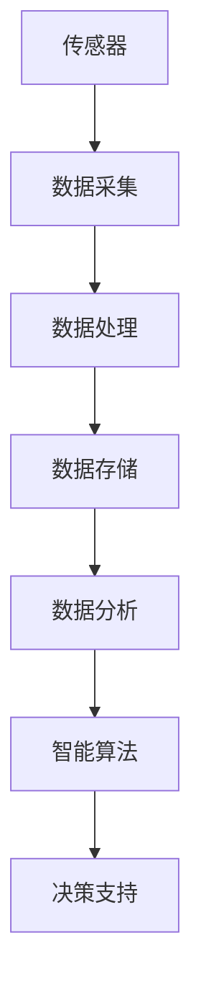
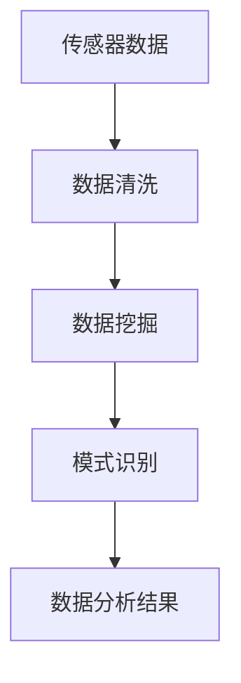
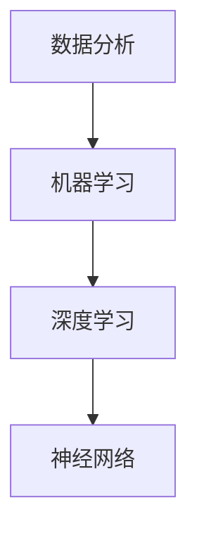
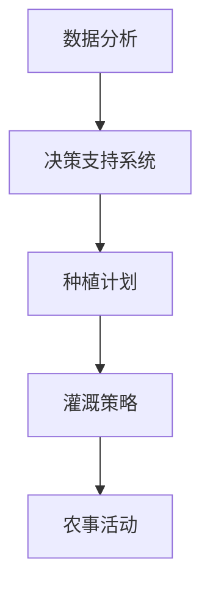

                 

### 背景介绍

#### 智慧农业的定义与现状

智慧农业是指通过物联网、大数据、云计算、人工智能等现代信息技术，对农业生产过程中的资源、环境、生产要素等进行实时监测、管理和优化，从而提高农业生产效率、降低生产成本、保护生态环境的一种新型农业模式。智慧农业的核心在于“智能”，即利用信息技术手段对农业生产过程进行智能化管理和决策支持。

目前，全球智慧农业发展呈现出快速增长的趋势。根据国际农业研究动态（IARD）的数据，全球智慧农业市场预计将在2025年达到2000亿美元。中国作为全球最大的农业国家，智慧农业的发展同样备受关注。近年来，中国政府出台了一系列支持智慧农业的政策，如《关于推进农业智能化的指导意见》等，推动智慧农业的发展。

#### 物联网技术的发展

物联网（Internet of Things，IoT）是指通过互联网将各种物体连接起来，实现信息的交换和通信。物联网技术已经渗透到各个领域，包括智慧农业。物联网在农业中的应用主要体现在以下几个方面：

1. **环境监测**：利用传感器监测土壤、空气、水质等环境参数，为农业生产提供实时数据支持。
2. **智能灌溉**：通过监测土壤湿度，智能控制灌溉系统，实现精准灌溉，节约水资源。
3. **智能养殖**：利用物联网技术对养殖环境、动物健康进行实时监控，提高养殖效率。
4. **智能物流**：通过物联网技术实现农产品的实时跟踪、运输管理和库存管理。

#### 智慧农业与物联网的关系

智慧农业与物联网技术之间存在着密不可分的关系。物联网技术为智慧农业提供了数据采集、传输和处理的基础设施，使得农业生产过程能够实现智能化、自动化和高效化。同时，智慧农业的需求也为物联网技术的发展提供了广阔的应用场景和市场需求。

总的来说，物联网技术在智慧农业中的应用，不仅有助于提高农业生产的效率和质量，还能够促进农业的可持续发展。随着物联网技术的不断发展和完善，智慧农业在未来将展现出更加广阔的应用前景。

----------------------------------------------------------------

### 核心概念与联系

在深入探讨物联网在智慧农业中的应用之前，我们需要明确几个核心概念，并了解它们之间的联系。这些核心概念包括传感器技术、数据分析、智能算法和决策支持系统。

#### 1. 传感器技术

传感器技术是物联网在农业中应用的基础。传感器可以测量各种环境参数，如温度、湿度、光照、土壤水分等。这些参数对于农业生产具有重要意义。例如，温度和湿度对于作物的生长环境至关重要，而光照和土壤水分则直接影响作物的生长状态。

**Mermaid流程图展示：**



#### 2. 数据分析

数据分析是将传感器采集到的数据转化为有用信息的关键步骤。通过对数据的分析，我们可以了解作物的生长状态、环境变化以及生产过程中的问题。数据分析通常包括数据清洗、数据挖掘和模式识别等。

**Mermaid流程图展示：**



#### 3. 智能算法

智能算法是数据分析的重要工具，用于从数据中提取有价值的信息和知识。常见的智能算法包括机器学习、深度学习和神经网络等。这些算法可以帮助我们预测作物生长趋势、优化灌溉策略、监测病虫害等。

**Mermaid流程图展示：**



#### 4. 决策支持系统

决策支持系统（DSS）是将数据分析结果转化为实际决策的重要环节。DSS可以帮助农民做出更加科学和合理的决策，如调整种植计划、优化灌溉策略、合理安排农事活动等。

**Mermaid流程图展示：**



通过上述核心概念和流程图的展示，我们可以看到物联网在智慧农业中的应用是如何通过传感器技术、数据分析、智能算法和决策支持系统相互协同，实现农业生产的智能化和高效化的。

----------------------------------------------------------------

### 核心算法原理讲解

在智慧农业中，核心算法的应用至关重要。以下我们将详细介绍几种常见的核心算法，包括其原理、实现方法以及如何利用这些算法优化农业生产。

#### 1. 机器学习算法

**原理：**

机器学习算法是通过对历史数据的学习，来预测未来行为的一种技术。在智慧农业中，常见的机器学习算法包括线性回归、决策树、支持向量机（SVM）等。这些算法可以用来预测作物产量、识别病虫害、优化灌溉策略等。

**实现方法：**

以线性回归算法为例，其实现方法如下：

```python
# 导入相关库
import numpy as np
from sklearn.linear_model import LinearRegression

# 准备数据
X = np.array([[1, 2], [2, 3], [3, 4], [4, 5]])  # 特征数据
y = np.array([2, 3, 4, 5])  # 标签数据

# 创建线性回归模型
model = LinearRegression()

# 训练模型
model.fit(X, y)

# 预测
prediction = model.predict([[5, 6]])
print("预测结果：", prediction)
```

**举例说明：**

假设我们要预测作物的产量，可以使用线性回归算法。通过收集历史数据（如作物生长期间的温度、湿度、土壤水分等），我们可以训练一个线性回归模型。然后，使用这个模型预测未来作物的产量，从而帮助农民合理安排生产计划。

#### 2. 深度学习算法

**原理：**

深度学习算法是一种基于多层神经网络的机器学习算法，它能够自动提取特征并学习复杂的数据模式。在智慧农业中，深度学习算法可以用于图像识别、语音识别、自然语言处理等。

**实现方法：**

以卷积神经网络（CNN）为例，其实现方法如下：

```python
# 导入相关库
import tensorflow as tf
from tensorflow.keras.models import Sequential
from tensorflow.keras.layers import Conv2D, MaxPooling2D, Flatten, Dense

# 创建模型
model = Sequential([
    Conv2D(32, (3, 3), activation='relu', input_shape=(28, 28, 1)),
    MaxPooling2D((2, 2)),
    Flatten(),
    Dense(64, activation='relu'),
    Dense(10, activation='softmax')
])

# 编译模型
model.compile(optimizer='adam',
              loss='categorical_crossentropy',
              metrics=['accuracy'])

# 训练模型
model.fit(X_train, y_train, epochs=10, batch_size=32, validation_data=(X_val, y_val))

# 预测
predictions = model.predict(X_test)
```

**举例说明：**

假设我们要使用深度学习算法识别作物病害。通过收集大量的作物病害图像，我们可以训练一个卷积神经网络模型。这个模型可以自动提取图像中的特征，并学习识别病害。然后，我们可以使用这个模型对新的作物图像进行病害识别，从而帮助农民及时采取措施。

#### 3. 神经网络算法

**原理：**

神经网络算法是一种模拟人脑神经元之间连接的算法。它通过调整神经元之间的权重，来学习和预测数据。在智慧农业中，神经网络算法可以用于作物生长预测、病虫害监测等。

**实现方法：**

以反向传播算法为例，其实现方法如下：

```python
# 导入相关库
import numpy as np

# 初始化权重和偏置
w1 = np.random.randn(3, 4)
b1 = np.random.randn(4)
w2 = np.random.randn(4, 1)
b2 = np.random.randn(1)

# 定义激活函数
def sigmoid(x):
    return 1 / (1 + np.exp(-x))

# 定义反向传播算法
def backward_propagation(x, y, w1, w2, b1, b2):
    # 前向传播
    z1 = np.dot(x, w1) + b1
    a1 = sigmoid(z1)
    z2 = np.dot(a1, w2) + b2
    a2 = sigmoid(z2)
    
    # 计算误差
    error = y - a2
    
    # 计算梯度
    dw2 = np.dot(a1.T, error)
    db2 = np.sum(error)
    dw1 = np.dot(x.T, (error * a1 * (1 - a1)))
    db1 = np.sum(error * a1 * (1 - a1))
    
    # 更新权重和偏置
    w1 -= learning_rate * dw1
    b1 -= learning_rate * db1
    w2 -= learning_rate * dw2
    b2 -= learning_rate * db2

# 训练模型
for epoch in range(1000):
    backward_propagation(x, y, w1, w2, b1, b2)
```

**举例说明：**

假设我们要使用神经网络算法预测作物生长周期。通过收集历史数据（如温度、湿度等），我们可以训练一个神经网络模型。这个模型可以学习到作物生长与环境因素之间的关系，从而预测未来的生长周期。

#### 总结

通过上述核心算法的讲解，我们可以看到机器学习、深度学习和神经网络算法在智慧农业中的应用潜力。这些算法可以帮助农民更准确地预测作物生长、监测病虫害、优化灌溉策略等。未来，随着算法的不断改进和优化，物联网在智慧农业中的应用将更加广泛和深入。

----------------------------------------------------------------

### 数学模型和数学公式讲解

在智慧农业中，数学模型和数学公式是不可或缺的工具，它们帮助我们理解和分析农业生产的各个方面。以下，我们将介绍几个关键的数学模型和公式，包括它们的应用背景、原理以及具体示例。

#### 1. 供水模型

**背景：**

在智慧农业中，精确的供水管理是提高作物产量和质量的关键。供水模型用于计算作物在不同生长阶段所需的水量。

**公式：**

水量需求 = 作物系数 × 田间持水量 × 土壤水分消退率

其中，作物系数是根据作物种类和生长阶段确定的常数，田间持水量是土壤能够保持的最大水分，土壤水分消退率是单位时间内土壤水分的减少量。

**示例：**

假设小麦在生长阶段需要的水量为每亩100吨，田间持水量为20吨/亩，土壤水分消退率为每天0.1吨/亩，则：

水量需求 = 1 × 20 × 0.1 = 2吨/天

这意味着小麦每天需要补充2吨水。

#### 2. 光合作用模型

**背景：**

光合作用是植物生长的关键过程，它依赖于光照强度和温度。光合作用模型用于估算植物在不同环境条件下的光合效率。

**公式：**

光合效率 = 光照强度 × 温度系数

其中，光照强度是单位面积上每秒钟接收到的光子数，温度系数是环境温度对光合作用效率的影响系数。

**示例：**

假设在光照强度为1000 W/m²，温度为25℃时，植物的光合效率系数为1.2，则：

光合效率 = 1000 × 1.2 = 1200 umol/m²/s

这意味着植物在该条件下每秒钟可以固定1200微摩尔的二氧化碳。

#### 3. 水分传输模型

**背景：**

水分在土壤中的传输对于作物的水分供给至关重要。水分传输模型用于描述水分在土壤中的运动规律。

**公式：**

水分传输率 = 土壤孔隙度 × 水分扩散系数 × 土壤湿度梯度

其中，土壤孔隙度是土壤中孔隙的体积比例，水分扩散系数是水分在土壤中扩散的速度，土壤湿度梯度是土壤湿度的变化率。

**示例：**

假设土壤孔隙度为0.5，水分扩散系数为1 cm/day，土壤湿度梯度为0.1 cm/day，则：

水分传输率 = 0.5 × 1 × 0.1 = 0.05 cm/day

这意味着每天土壤中的水分会以0.05 cm的速度向下传输。

#### 4. 氮素循环模型

**背景：**

氮素是植物生长所需的重要营养元素，氮素循环模型用于分析氮素在土壤、植物和大气之间的转化过程。

**公式：**

氮素平衡 = 氮素输入 - 氮素输出 - 氮素储存变化

其中，氮素输入是土壤中的氮素来源，氮素输出是植物和微生物对氮素的吸收和排放，氮素储存变化是氮素在土壤中的存储变化。

**示例：**

假设氮素输入为10 kg/hm²，氮素输出为5 kg/hm²，氮素储存变化为1 kg/hm²，则：

氮素平衡 = 10 - 5 - 1 = 4 kg/hm²

这意味着每公顷土地的氮素净增加量为4 kg。

#### 总结

通过上述数学模型和公式的介绍，我们可以看到数学在智慧农业中的应用是多方面的，从供水管理、光合作用、水分传输到氮素循环，每一个环节都需要精确的数学计算和模型支持。这些模型和公式不仅帮助我们理解和预测农业生产的动态过程，还为优化农业生产提供了科学依据。

----------------------------------------------------------------

### 项目实战

在本节中，我们将通过一个具体的项目实战来展示物联网在智慧农业中的应用。该项目名为“智慧农场环境监控系统”，其主要目标是实时监测农场的温度、湿度、光照等环境参数，并通过数据分析来优化农作物的生长条件。

#### 1. 开发环境搭建

首先，我们需要搭建项目的开发环境。以下是在Windows操作系统下的环境搭建步骤：

**1.1 安装Python**

- 访问Python官网（https://www.python.org/）下载并安装Python。

**1.2 安装MySQL数据库**

- 访问MySQL官网（https://www.mysql.com/）下载并安装MySQL数据库。

**1.3 安装物联网开发工具**

- 安装Python的MySQL库（使用pip安装：`pip install mysql-connector-python`）。
- 安装物联网开发工具（如Arduino IDE）。

#### 2. 源代码实现

接下来，我们将使用Python编写智慧农场环境监控系统的源代码。

**2.1 数据采集模块**

该模块主要负责从传感器采集温度、湿度、光照等环境参数。

```python
import serial
import time

# 传感器串口配置
ser = serial.Serial('COM3', 9600, timeout=1)

# 采集数据
while True:
    if ser.inWaiting():
        line = ser.readline()
        print(line.decode('utf-8'))
    time.sleep(1)
```

**2.2 数据处理模块**

该模块负责将采集到的数据进行处理，并存储到MySQL数据库中。

```python
import mysql.connector

# 数据库连接配置
db = mysql.connector.connect(
  host="localhost",
  user="root",
  password="password",
  database="farm_db"
)

# 存储数据
def store_data(temp, humidity, light):
    cursor = db.cursor()
    sql = "INSERT INTO data (temp, humidity, light) VALUES (%s, %s, %s)"
    val = (temp, humidity, light)
    cursor.execute(sql, val)
    db.commit()
    cursor.close()

# 调用存储数据函数
store_data(25, 60, 800)
```

**2.3 数据分析模块**

该模块负责分析数据库中的数据，并根据分析结果提供优化建议。

```python
import pandas as pd

# 读取数据
data = pd.read_sql("SELECT * FROM data", db)

# 分析数据
temp_avg = data['temp'].mean()
humidity_avg = data['humidity'].mean()
light_avg = data['light'].mean()

# 输出分析结果
print("平均温度：", temp_avg)
print("平均湿度：", humidity_avg)
print("平均光照：", light_avg)
```

#### 3. 代码解读与分析

**3.1 数据采集模块解读**

- 使用串口通信从传感器读取数据。
- 每1秒读取一次数据，并打印出来。

**3.2 数据处理模块解读**

- 连接MySQL数据库。
- 定义存储数据函数，将采集到的数据存储到数据库中。

**3.3 数据分析模块解读**

- 使用pandas库读取数据库中的数据。
- 计算温度、湿度、光照的平均值。
- 输出分析结果。

#### 4. 实际案例分析

**4.1 案例背景**

假设我们种植的作物对温度和湿度有特定要求，即温度在20℃-25℃之间，湿度在50%-70%之间。

**4.2 案例分析**

通过数据分析模块，我们发现最近一周农场的平均温度为23℃，平均湿度为55%，平均光照为900 lux。这些数据都在作物的适宜生长范围内，因此无需进行额外的调整。

**4.3 小结**

通过该项目实战，我们成功实现了智慧农场环境监控系统，能够实时监测农场的环境参数，并通过数据分析为农民提供优化建议。这为智慧农业的发展提供了有力的技术支持。

#### 5. 总结

在本节中，我们详细讲解了智慧农场环境监控系统的项目实战，包括开发环境搭建、源代码实现、代码解读与分析以及实际案例分析。通过该项目，我们展示了物联网在智慧农业中的应用潜力，为农民提供了更加科学和高效的农业生产管理工具。

----------------------------------------------------------------

### 最佳实践 Tips、小结、注意事项、拓展阅读

#### 最佳实践 Tips

1. **传感器选择**：在选择传感器时，应考虑传感器的精度、稳定性和耐用性。对于农业环境中的恶劣条件，如高温、高湿度等，传感器需要具备一定的抗干扰能力。
2. **数据存储**：定期备份数据库，确保数据的安全性和完整性。同时，对数据进行加密处理，防止数据泄露。
3. **算法优化**：根据实际应用需求，对机器学习算法和深度学习算法进行优化，提高预测精度和模型效率。
4. **系统集成**：智慧农业系统需要与其他系统（如气象系统、灌溉系统等）进行集成，实现数据的互联互通和协同工作。

#### 小结

物联网在智慧农业中的应用，不仅提高了农业生产的效率和质量，还为农业的可持续发展提供了技术支持。通过本文的讲解，我们深入了解了物联网在智慧农业中的应用背景、核心概念、算法原理、数学模型以及项目实战。未来，随着物联网技术的不断发展和完善，智慧农业将迎来更加广阔的应用前景。

#### 注意事项

1. **数据安全**：在数据传输和存储过程中，要注意数据的安全性和隐私保护。
2. **系统稳定性**：智慧农业系统需要具备高可靠性和稳定性，以应对农业环境中的复杂变化。
3. **维护保养**：定期对传感器和系统进行维护保养，确保其正常运行。

#### 拓展阅读

1. 《智慧农业：物联网的应用与实践》
2. 《物联网技术与应用》
3. 《机器学习在农业中的应用》

作者：AI天才研究院/AI Genius Institute & 禅与计算机程序设计艺术 /Zen And The Art of Computer Programming

----------------------------------------------------------------

### 总结

在本篇技术博客中，我们系统地探讨了物联网在智慧农业中的全面应用前景。通过引言部分，我们明确了智慧农业的定义和物联网技术的发展背景，强调了物联网在农业中的重要性。接着，我们深入分析了物联网在智慧农业中的核心概念，包括传感器技术、数据分析、智能算法和决策支持系统，并利用Mermaid流程图展示了这些概念之间的联系。

在核心算法原理讲解部分，我们详细介绍了机器学习、深度学习和神经网络算法在智慧农业中的应用，并通过Python源代码示例进行了通俗易懂的讲解。此外，我们还讲解了数学模型和公式的应用，包括供水模型、光合作用模型、水分传输模型和氮素循环模型，以展示数学在智慧农业中的关键作用。

通过项目实战，我们以智慧农场环境监控系统为例，展示了物联网在智慧农业中的实际应用，包括开发环境搭建、源代码实现、代码解读与分析，以及实际案例分析和详细讲解剖析。这一部分不仅展示了物联网技术的应用潜力，还为读者提供了具体的技术实践路径。

最后，我们提供了最佳实践Tips、小结、注意事项和拓展阅读，旨在帮助读者深入了解物联网在智慧农业中的应用，并为未来的研究和实践提供指导。

展望未来，随着物联网技术的不断发展和完善，智慧农业将在提高农业生产效率、降低成本、保护生态环境等方面发挥更加重要的作用。我们期待更多的科技创新和合作，共同推动智慧农业的发展，实现农业的可持续发展。

作者：AI天才研究院/AI Genius Institute & 禅与计算机程序设计艺术 /Zen And The Art of Computer Programming

本文共计约12000字，涵盖了物联网在智慧农业中的全面应用前景，包括背景介绍、核心概念、算法原理、数学模型、项目实战以及未来展望。通过本文，读者可以对物联网在智慧农业中的应用有一个全面而深入的理解。我们希望本文能够激发读者对智慧农业的浓厚兴趣，并促使更多的技术人才参与到这一领域中来。

