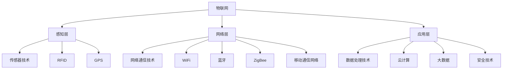
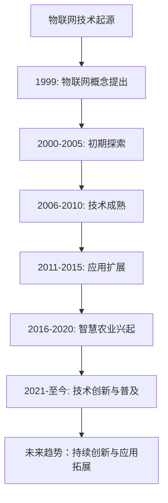
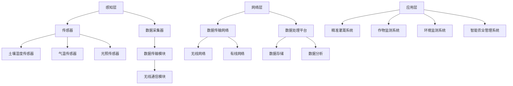

                 

### 1.1 物联网的基本概念与架构

物联网（Internet of Things，简称 IoT）是指将各种信息传感设备与网络相连接，实现物体与物体之间信息的交换和通信。物联网的概念最早可以追溯到1999年，麻省理工学院的《技术评论》杂志上提出了“物联网”的概念。随着互联网、无线通信、传感器技术、云计算等技术的发展，物联网逐渐成为现代信息技术的重要分支，并得到了广泛应用。

**物联网的定义**：
物联网是通过互联网将各种物理设备、智能终端、传感器、软件平台等进行互联互通，使设备能够自动交换数据、触发行为，从而实现智能化管理和控制。简而言之，物联网就是“万物相连的互联网”。

**物联网的架构**：
物联网的架构通常包括感知层、网络层和应用层三个部分。

1. **感知层**：包括传感器、RFID（射频识别）标签、GPS（全球定位系统）等感知设备，主要负责数据的采集和初步处理。
2. **网络层**：负责数据的传输和通信，包括各种网络协议，如WiFi、蓝牙、ZigBee、移动通信网络等。
3. **应用层**：是物联网架构的最高层，负责数据的处理、分析和应用，实现物联网的智能化功能。

**物联网的关键技术**：

- **传感器技术**：是物联网的核心技术，负责感知环境和物理世界的各种信息。
- **网络通信技术**：包括有线和无线通信技术，确保数据能够在网络中高效传输。
- **数据处理技术**：通过云计算、大数据等技术，对收集到的数据进行处理和分析。
- **安全技术**：确保物联网系统的数据安全、设备安全和隐私保护。

### 概念实体之间的关系架构 Mermaid 流程图

### 1.2 智慧农业的背景与发展

**智慧农业的定义**：
智慧农业是指利用物联网、大数据、云计算、人工智能等技术，对农业生产过程进行智能化管理，提高农业生产效率和质量，实现农业可持续发展的一种新型农业模式。

**智慧农业的发展历程**：

- **初级阶段**：20世纪80年代至90年代，以农业机械化和自动化为主要特征，初步实现了农业生产过程的机械化。
- **中级阶段**：21世纪初至2010年，信息技术逐渐应用于农业，形成了农业信息化。
- **高级阶段**：2010年至今，智慧农业开始崛起，各种先进技术如物联网、大数据、人工智能等在农业中广泛应用，实现了农业生产的智能化和精细化管理。

**智慧农业的重要性**：

- 提高农业生产效率：通过智能化设备和系统，实现精准种植、养殖和灌溉，减少资源浪费，提高产量和质量。
- 优化农业生产过程：通过数据分析和人工智能技术，实现农业生产的自动化和智能化，减少人工干预，降低生产成本。
- 促进农业可持续发展：智慧农业能够有效管理农业资源，减少农药和化肥的使用，降低环境污染，实现农业的可持续发展。

### 1.3 物联网在智慧农业中的应用现状与趋势

**物联网在智慧农业中的应用现状**：

- **精准灌溉**：利用传感器和自动化控制系统，根据土壤湿度、气温、降水量等参数，实现灌溉的精准控制，提高水资源利用效率。
- **作物监测**：通过传感器和遥感技术，实时监测作物的生长状态、病虫害等信息，提供科学种植和管理建议。
- **环境监测**：监测农田的空气质量、土壤质量等环境参数，为农业生产提供环境数据支持。
- **智能养殖**：利用物联网技术，对畜禽养殖过程进行实时监测和管理，提高养殖效率和动物健康水平。

**物联网在智慧农业中的发展趋势**：

- **集成化与智能化**：物联网技术将进一步与人工智能、大数据等技术相结合，实现更智能、更高效的农业生产管理。
- **智能化农业装备**：未来农业装备将更加智能化，如智能拖拉机、无人机等，实现农业生产的全面自动化。
- **农业大数据平台**：通过大数据分析，实现农业生产数据的全面采集、分析和应用，提供科学种植和管理决策。
- **农业物联网标准**：随着物联网技术的发展，农业物联网标准将逐渐完善，推动物联网技术在农业中的应用。

**物联网在农业中的挑战与机遇**：

- **挑战**：农业环境的复杂性和不确定性，数据隐私和安全问题，技术成本高等。
- **机遇**：农业生产方式的变革，农业产业链的优化，农业生产效率的提升，农业市场的扩大等。

### 1.4 物联网与智慧农业的未来展望

**未来物联网在农业中的应用场景**：

- **智慧农场**：通过物联网技术，实现农场的自动化、智能化管理，提高农业生产效率和产品质量。
- **智能温室**：利用物联网技术，对温室环境进行实时监测和自动调控，实现作物的精准种植和管理。
- **智能果园**：通过物联网技术，实时监测果园环境参数和果树生长状态，提高果园的管理水平和产量。

**智慧农业的未来发展方向**：

- **数字化转型**：将物联网、大数据、人工智能等技术全面应用于农业生产、管理和营销，实现农业的数字化转型。
- **可持续发展**：通过物联网技术，实现农业资源的有效管理和利用，推动农业的可持续发展。
- **国际化发展**：随着物联网技术的普及和国际合作的加强，智慧农业将在全球范围内得到更广泛的应用。

**物联网与智慧农业的融合创新**：

- **技术创新**：通过技术创新，不断优化物联网设备和系统的性能和可靠性，提升农业生产效率。
- **模式创新**：探索新的农业经营模式，如共享农业、定制农业等，实现农业产业链的优化和升级。
- **产业生态**：构建智慧农业产业生态，推动产业链上下游企业协同发展，共同推动智慧农业的发展。

### 1.4.1 未来物联网在农业中的应用场景

**智慧农场**：

智慧农场是未来农业发展的一个重要方向。通过物联网技术，可以实现农场的自动化、智能化管理。具体应用场景包括：

- **自动化设备**：使用智能拖拉机、无人机等自动化设备进行播种、施肥、灌溉、收割等农业操作，提高工作效率。
- **环境监测**：实时监测农场的环境参数，如土壤湿度、气温、光照强度等，为农业生产提供数据支持。
- **智能温室**：通过物联网技术，实现温室内温度、湿度、光照等环境参数的自动调控，为作物生长提供最佳环境。

**智能温室**：

智能温室是物联网在农业中应用的另一个重要领域。通过物联网技术，可以实现温室环境的实时监测和自动调控，提高作物生长效率。具体应用场景包括：

- **环境监测**：实时监测温室内的温度、湿度、光照强度等环境参数，确保作物生长环境适宜。
- **自动调控**：根据监测到的环境参数，自动调节温室内的温度、湿度、光照等，为作物生长提供最佳条件。
- **智能灌溉**：根据土壤湿度传感器数据，自动调节灌溉系统，实现精准灌溉，提高水资源利用效率。

**智能果园**：

智能果园利用物联网技术，对果园环境进行实时监测和管理，提高果园的生产效率和产品质量。具体应用场景包括：

- **环境监测**：实时监测果园的温度、湿度、土壤湿度、光照强度等环境参数，为果树生长提供数据支持。
- **智能灌溉**：根据土壤湿度传感器数据，自动调节灌溉系统，实现精准灌溉，提高水资源利用效率。
- **病虫害监测**：通过传感器和图像识别技术，实时监测果园内的病虫害情况，及时采取防治措施。

### 1.4.2 智慧农业的未来发展方向

**数字化转型**：

数字化转型是智慧农业发展的核心方向。通过物联网、大数据、云计算、人工智能等技术的应用，实现农业生产的数字化管理。具体发展方向包括：

- **数字化农业装备**：研发和应用智能农业装备，如智能拖拉机、无人机等，实现农业生产的自动化和智能化。
- **数字化农业生产过程**：通过传感器和物联网技术，实时监测农业生产过程中的各项参数，实现精准管理和决策。
- **数字化农业供应链**：构建数字化农业供应链体系，实现农产品从生产到销售的全程可追溯。

**可持续发展**：

可持续发展是智慧农业发展的另一个重要方向。通过物联网技术，实现农业资源的有效管理和利用，推动农业的可持续发展。具体发展方向包括：

- **资源管理**：利用物联网技术，实时监测农业水资源、土壤资源等，实现资源的科学管理和节约利用。
- **环保技术**：研发和应用环保农业技术，如生物防治、有机肥料等，减少农药和化肥的使用，降低环境污染。
- **循环农业**：推广循环农业模式，实现农业废弃物的资源化利用，提高农业资源的利用效率。

**国际化发展**：

随着物联网技术的普及和国际合作的加强，智慧农业将在全球范围内得到更广泛的应用。国际化发展是智慧农业的未来趋势。具体发展方向包括：

- **技术交流**：加强国际合作，开展物联网技术在农业领域的交流与合作，推动技术进步。
- **市场拓展**：通过国际化市场拓展，将智慧农业技术引入国际市场，推动农业现代化发展。
- **标准化建设**：加强物联网在农业领域的标准化建设，推动智慧农业技术的全球推广和应用。

### 1.4.3 物联网与智慧农业的融合创新

**技术创新**：

物联网与智慧农业的融合创新首先体现在技术创新上。通过物联网技术，可以实现农业生产过程的智能化、自动化和精准化。具体技术创新包括：

- **传感器技术**：研发和应用各种农业传感器，如土壤湿度传感器、光照传感器、气温传感器等，实时监测农业生产环境。
- **通信技术**：利用无线通信技术，实现传感器数据的远程传输，提高数据传输效率和可靠性。
- **数据分析技术**：运用大数据和人工智能技术，对农业生产数据进行分析和处理，为农业生产提供科学决策支持。

**模式创新**：

物联网与智慧农业的融合创新还体现在农业经营模式的创新上。通过物联网技术，可以实现农业产业链的优化和升级。具体模式创新包括：

- **智慧农场模式**：通过物联网技术，实现农场的智能化管理，提高农业生产效率和产品质量。
- **定制农业模式**：根据消费者需求，利用物联网技术，实现农业生产的定制化服务，提供个性化的农产品。
- **共享农业模式**：通过物联网技术，实现农业资源的共享和优化配置，降低农业生产成本，提高农业效益。

**产业生态**：

物联网与智慧农业的融合创新不仅体现在技术和模式上，还体现在产业生态的构建上。通过物联网技术，可以推动农业产业链的协同发展。具体产业生态包括：

- **产业链协同**：通过物联网技术，实现农业产业链上下游企业的信息共享和协同工作，提高产业链整体效率。
- **产业服务平台**：构建智慧农业产业服务平台，提供农业技术咨询、技术服务、市场推广等服务，推动农业产业链的快速发展。
- **产业联盟**：通过建立智慧农业产业联盟，加强企业之间的合作与交流，共同推动智慧农业技术的发展和应用。

### 2.1 精准灌溉的概念与原理

**精准灌溉的定义**：
精准灌溉是一种基于实时监测和数据分析，实现灌溉量与作物实际需水量匹配的灌溉技术。通过使用各种传感器和自动化控制设备，精准灌溉可以确保作物在适宜的土壤湿度下生长，从而提高水资源利用效率，减少浪费。

**精准灌溉的原理**：
精准灌溉的原理主要包括以下几个关键环节：

1. **数据采集**：利用土壤湿度传感器、气温传感器、降水传感器等设备，实时采集土壤湿度、气温、降水量等关键环境数据。
2. **数据分析**：通过对采集到的数据进行处理和分析，结合作物生长模型和灌溉需求模型，确定作物的实际需水量。
3. **灌溉控制**：根据分析结果，通过自动化灌溉系统（如滴灌、喷灌等）精确控制灌溉量，确保作物获得适宜的水分。

**精准灌溉的优势**：
精准灌溉具有多方面的优势，主要体现在以下几个方面：

1. **提高水资源利用效率**：通过精确控制灌溉量，可以减少水资源的浪费，提高灌溉效率。
2. **改善作物生长条件**：精准灌溉能够根据作物的实际需水量进行灌溉，为作物提供最佳的生长环境。
3. **减少农药和肥料使用**：由于作物在适宜的土壤湿度下生长，可以减少农药和肥料的过量使用，降低环境污染。
4. **降低生产成本**：通过优化水资源和农药肥料的利用，减少浪费，降低农业生产成本。

### 2.2 精准灌溉的关键技术

**水分传感器技术**：
水分传感器是精准灌溉系统的核心组件，用于实时监测土壤湿度，为灌溉决策提供数据支持。常用的水分传感器包括土壤水分传感器、电容式水分传感器和频率响应型水分传感器等。这些传感器具有高精度、高灵敏度、抗干扰能力强等特点，能够适应各种复杂农田环境。

**自动灌溉系统技术**：
自动灌溉系统是实现精准灌溉的关键，主要包括灌溉控制器、灌溉设备和灌溉管道等。灌溉控制器负责根据传感器采集的数据和预设的灌溉策略，自动调节灌溉设备的工作状态。灌溉设备包括滴灌设备、喷灌设备、微灌设备等，可以根据农田的具体情况选择合适的灌溉方式。灌溉管道则负责将灌溉水输送到作物根部。

**节水灌溉技术**：
节水灌溉技术是精准灌溉的重要组成部分，旨在通过科学合理的灌溉方式，最大限度地减少水资源浪费。常见的节水灌溉技术包括滴灌、喷灌、渗灌、雾灌等。这些技术通过局部灌溉、减少地表径流等方式，显著提高水资源利用效率。

### 2.3 精准灌溉系统的设计与实现

**精准灌溉系统的设计流程**：
精准灌溉系统的设计通常包括以下几个步骤：

1. **需求分析**：根据农田的具体情况，确定灌溉目标、灌溉区域、作物类型等，明确系统需求。
2. **系统架构设计**：设计系统总体架构，包括感知层、传输层、控制层和应用层等。
3. **硬件选型**：根据需求选择合适的传感器、控制器和灌溉设备，进行硬件配置。
4. **软件设计**：开发系统软件，包括数据采集、处理、分析和灌溉控制等功能。
5. **系统集成与测试**：将硬件和软件集成，进行系统测试和调试，确保系统稳定运行。

**精准灌溉系统的实现方法**：
精准灌溉系统的实现方法主要包括以下几方面：

1. **硬件实现**：安装传感器和灌溉设备，搭建灌溉系统硬件平台。
2. **数据采集与传输**：通过无线通信技术（如WiFi、蓝牙等），将传感器采集的数据传输到服务器或控制中心。
3. **数据分析与处理**：利用大数据分析和人工智能技术，对采集到的数据进行分析，确定灌溉策略。
4. **灌溉控制**：根据分析结果，通过灌溉控制器自动调节灌溉设备，实现精准灌溉。

**精准灌溉系统的案例分析**：
以下是一个具体的精准灌溉系统案例：

**项目背景**：
某农业企业种植了大量的水果树，需要通过精准灌溉系统提高水资源利用效率，确保水果树的健康生长。

**解决方案**：
1. **硬件配置**：在农田中安装了土壤湿度传感器、气温传感器和降水传感器，用于实时监测土壤湿度、气温和降水量。
2. **数据采集与传输**：传感器采集到的数据通过WiFi传输到服务器，实现实时监控。
3. **数据分析**：利用大数据分析平台，对采集到的数据进行处理和分析，结合水果树的生长模型和灌溉需求，制定灌溉策略。
4. **灌溉控制**：根据分析结果，通过灌溉控制器自动调节滴灌设备，实现精准灌溉。

**效果评估**：
通过精准灌溉系统的实施，水果树的土壤湿度保持在适宜范围内，水资源利用效率提高了30%以上，水果产量和质量显著提高，取得了良好的经济效益。

### 2.4 精准灌溉的应用场景与效果分析

**精准灌溉在不同作物中的应用**：
精准灌溉技术适用于多种作物，包括水果、蔬菜、棉花、水稻等。根据作物的生长特性和需水规律，精准灌溉技术可以灵活地调整灌溉策略，确保作物在最佳生长条件下获得充足的水分。

- **水果种植**：通过精准灌溉，可以保证水果树在果实生长期获得充足的水分，提高果实品质和产量。
- **蔬菜种植**：精准灌溉有助于蔬菜在生长关键期获得适宜的水分，提高蔬菜的产量和品质。
- **棉花种植**：精准灌溉可以减少棉花生长期间的缺水风险，提高棉花产量和纤维质量。
- **水稻种植**：精准灌溉可以根据水稻的生长阶段和土壤湿度，实现水稻的精细灌溉，提高水稻产量。

**精准灌溉对作物生长的影响**：
精准灌溉对作物生长具有显著的积极影响，主要体现在以下几个方面：

- **改善土壤环境**：通过精准灌溉，可以保持土壤湿度的适宜范围，有利于土壤微生物的生长和活动，改善土壤结构。
- **促进作物生长**：精准灌溉确保作物在生长关键期获得充足的水分，有助于作物的根系发展和叶片光合作用，促进作物生长。
- **提高作物品质**：精准灌溉可以保持土壤水分的稳定，减少水分过多或过少的极端情况，提高作物的品质和产量。

**精准灌溉的经济效益分析**：
精准灌溉不仅对作物生长和环境有积极影响，还具有显著的经济效益。以下是精准灌溉的经济效益分析：

- **节水效益**：通过精准灌溉，可以显著减少灌溉用水量，降低水资源成本。
- **增产效益**：精准灌溉可以提高作物的产量和品质，增加销售收入。
- **降低生产成本**：通过自动化灌溉系统，可以减少人工灌溉成本，提高灌溉效率。
- **环境效益**：精准灌溉减少农药和化肥的使用，降低对环境的污染，具有长远的环境效益。

### 3.1 作物监测的概念与原理

**作物监测的定义**：
作物监测是指利用各种传感器、遥感技术等手段，对作物生长过程中的关键参数进行实时监测和分析，以获取作物生长状态、环境变化等信息，为农业生产决策提供科学依据。

**作物监测的原理**：
作物监测的原理主要包括以下几个方面：

1. **数据采集**：通过安装在农田中的传感器（如温度传感器、湿度传感器、光照传感器等）实时采集土壤、气象和作物生长相关数据。
2. **数据传输**：采集到的数据通过无线通信模块传输到中央处理系统或云端平台，进行实时监控和分析。
3. **数据处理**：利用大数据分析和人工智能技术，对传输的数据进行处理和分析，识别作物生长状态和环境变化趋势。
4. **决策支持**：根据处理分析结果，为农业生产提供科学决策支持，如合理施肥、灌溉、防治病虫害等。

**作物监测的重要性**：
作物监测在农业生产中具有重要作用，主要体现在以下几个方面：

- **提高生产效率**：通过实时监测作物生长状态，可以及时发现问题并采取相应措施，提高农业生产效率。
- **优化资源配置**：作物监测可以提供作物需水、需肥等信息，帮助农民合理配置水资源和肥料，提高资源利用效率。
- **预防病虫害**：通过监测作物生长环境和状态，可以提前发现病虫害风险，及时采取防治措施，减少经济损失。
- **降低环境风险**：作物监测有助于了解农业生产的生态环境状况，为农业环境管理提供数据支持，降低环境风险。

### 3.2 作物监测的关键技术

**光学传感器技术**：
光学传感器技术是作物监测的重要手段之一，包括多光谱相机、高光谱成像仪等设备。这些设备能够捕捉作物在不同波段的光谱信息，通过分析这些信息，可以获取作物健康状况、叶绿素含量、水分含量等参数。

- **工作原理**：光学传感器通过探测作物反射或透射的光谱信息，生成光谱图像，再利用图像处理技术进行分析。
- **应用场景**：光学传感器广泛应用于作物长势监测、病虫害检测、果实成熟度检测等领域。

**遥感监测技术**：
遥感监测技术利用卫星或无人机搭载的传感器，对大面积农田进行远程监测。遥感技术可以获取农田的宏观环境参数，如土壤湿度、植被指数、温度分布等，为农业管理提供科学依据。

- **工作原理**：遥感技术通过接收地面反射或发射的电磁波信号，分析信号的特征，获取地表信息。
- **应用场景**：遥感监测技术广泛应用于农田环境监测、作物长势评估、病虫害预警、水资源管理等领域。

**数据处理与分析技术**：
数据处理与分析技术是作物监测的核心，通过大数据分析和人工智能技术，对监测数据进行处理和分析，提取有价值的信息。

- **工作原理**：数据处理技术包括数据清洗、数据挖掘、模式识别等步骤，人工智能技术则通过机器学习、深度学习等方法，对数据进行分析和预测。
- **应用场景**：数据处理与分析技术广泛应用于作物生长趋势分析、病虫害预警、产量预测等领域。

### 3.3 作物监测系统的设计与实现

**作物监测系统的设计流程**：
作物监测系统的设计通常包括以下几个步骤：

1. **需求分析**：明确监测系统的目标和需求，如监测参数、监测范围、系统功能等。
2. **系统架构设计**：设计系统总体架构，包括感知层、传输层、处理层和应用层等。
3. **硬件选型**：根据需求选择合适的传感器、通信设备、数据处理设备等硬件。
4. **软件设计**：开发系统软件，包括数据采集、处理、分析和展示等功能。
5. **系统集成与测试**：将硬件和软件集成，进行系统测试和调试，确保系统稳定运行。

**作物监测系统的实现方法**：
作物监测系统的实现方法主要包括以下几方面：

1. **硬件实现**：安装传感器和通信设备，搭建监测系统硬件平台。
2. **数据采集与传输**：通过无线通信技术（如WiFi、LoRa等），将传感器采集的数据传输到服务器或云端平台。
3. **数据处理与存储**：利用大数据处理技术，对采集到的数据进行处理和分析，存储到数据库或云端平台。
4. **数据分析与展示**：通过数据分析和可视化技术，将处理结果以图表、报表等形式展示，为农业生产提供决策支持。

**作物监测系统的案例分析**：
以下是一个具体的作物监测系统案例：

**项目背景**：
某农业企业需要实现对水稻生长过程的实时监测，以优化灌溉和施肥策略，提高水稻产量。

**解决方案**：
1. **硬件配置**：在稻田中安装了温度传感器、湿度传感器、土壤水分传感器等，用于实时监测稻田的环境和土壤参数。
2. **数据采集与传输**：传感器采集的数据通过LoRa无线通信模块传输到服务器，实现实时监控。
3. **数据处理**：利用大数据分析平台，对采集到的数据进行分析和处理，生成水稻生长状况报告。
4. **决策支持**：根据分析结果，为农业生产提供灌溉和施肥建议，优化水稻生长环境。

**效果评估**：
通过作物监测系统的实施，农业企业能够实时掌握水稻生长状况，调整灌溉和施肥策略，水稻产量提高了15%以上，取得了显著的经济效益。

### 3.4 作物监测的应用场景与效果分析

**作物监测在不同农业环境中的应用**：
作物监测技术适用于各种农业环境，包括露天农田、温室、大棚等。根据不同的农业环境，作物监测技术可以灵活地调整监测方法和监测参数。

- **露天农田**：在露天农田中，作物监测主要关注土壤湿度、气温、降水量等环境参数，以及作物生长发育状态。
- **温室**：在温室环境中，作物监测需要关注温度、湿度、光照强度等环境参数，以及作物生长状态和病虫害情况。
- **大棚**：在大棚环境中，作物监测与温室相似，但更注重土壤湿度、气温等参数的监测，以及作物生长和病虫害的预警。

**作物监测对农业生产的影响**：
作物监测对农业生产具有多方面的积极影响，主要体现在以下几个方面：

- **优化资源配置**：通过实时监测作物生长状态和环境参数，可以准确判断作物需水、需肥等需求，合理配置水资源和肥料，提高资源利用效率。
- **提高生产效率**：作物监测可以实时掌握作物生长状况，及时发现问题并采取相应措施，提高农业生产效率。
- **降低生产成本**：通过精准灌溉、合理施肥等技术，可以减少水资源和肥料的浪费，降低生产成本。
- **预防病虫害**：作物监测可以提前发现病虫害风险，及时采取防治措施，减少经济损失。

**作物监测的经济效益分析**：
作物监测不仅对农业生产具有积极影响，还能带来显著的经济效益。以下是作物监测的经济效益分析：

- **节水效益**：通过精准灌溉技术，可以减少灌溉用水量，降低水资源成本。
- **增产效益**：作物监测有助于优化灌溉和施肥策略，提高作物产量和品质，增加销售收入。
- **降低生产成本**：通过减少水资源和肥料的浪费，降低生产成本。
- **环境效益**：作物监测有助于降低农药和化肥的使用量，减少对环境的污染，具有长远的环境效益。

### 4.1 精准灌溉与作物监测的融合应用

**融合应用的概念与原理**：
精准灌溉与作物监测的融合应用是指将精准灌溉技术和作物监测技术相结合，通过对作物生长环境的实时监测和数据分析，实现灌溉策略的动态调整，从而提高水资源利用效率，优化作物生长环境。

**融合应用的优势**：

1. **提高水资源利用效率**：通过作物监测系统实时获取土壤湿度、气温、降水等数据，精准灌溉系统能够根据这些数据动态调整灌溉量，确保作物在适宜的土壤湿度下生长，从而提高水资源利用效率。
2. **优化作物生长环境**：作物监测系统能够实时监测作物生长状态和环境变化，为精准灌溉系统提供科学依据，实现灌溉的精准化和智能化，优化作物生长环境。
3. **降低生产成本**：通过融合应用，可以减少水资源的浪费，降低灌溉成本，同时提高作物产量和品质，从而降低生产成本。
4. **提高农业生产效率**：融合应用能够实现灌溉和作物管理的智能化，提高农业生产效率，减少人力投入。

**融合应用的实现方法**：

1. **硬件融合**：将精准灌溉系统和作物监测系统的硬件设备（如传感器、控制器等）集成在一起，实现数据共享和协同工作。
2. **数据融合**：将精准灌溉系统和作物监测系统的数据进行整合，通过大数据分析和人工智能技术，实现灌溉策略的动态调整。
3. **软件融合**：开发融合应用软件，实现精准灌溉系统和作物监测系统的数据采集、处理、分析和展示等功能。

**融合应用的案例**：

**案例背景**：
某农业企业种植了大量的蔬菜，希望利用精准灌溉和作物监测技术，提高蔬菜的产量和品质，降低生产成本。

**解决方案**：
1. **硬件配置**：在农田中安装土壤湿度传感器、气温传感器、作物生长状态监测设备等，搭建精准灌溉系统和作物监测系统。
2. **数据采集与传输**：通过无线通信技术，将传感器采集到的数据传输到服务器或云端平台，实现实时监测。
3. **数据分析与灌溉策略调整**：利用大数据分析和人工智能技术，对采集到的数据进行分析和处理，生成灌溉策略，通过灌溉控制器实现精准灌溉。
4. **效果评估**：通过融合应用，农业企业能够实时掌握蔬菜生长状况和环境参数，动态调整灌溉策略，蔬菜产量提高了20%，生产成本降低了15%。

### 4.2 智慧农业园区建设案例

**案例背景与目标**：
某农业科技园区位于我国南方地区，园区规划面积2000亩，主要种植水果、蔬菜和花卉等作物。为了提高农业生产的效率和质量，园区决定建设一个智慧农业园区，利用物联网、大数据和人工智能等先进技术，实现农业生产的智能化管理。

**案例实施过程**：

1. **需求分析**：
   - 明确园区种植的作物种类和生长周期；
   - 确定智慧农业园区的建设目标和功能需求，如精准灌溉、作物监测、环境监测、智能施肥等。

2. **系统设计**：
   - 设计智慧农业园区的系统架构，包括感知层、传输层、处理层和应用层；
   - 选择合适的传感器、控制器、通信设备和数据处理平台。

3. **硬件安装**：
   - 在园区内安装土壤湿度传感器、气温传感器、光照传感器、作物生长状态监测设备等；
   - 搭建精准灌溉系统、作物监测系统和环境监测系统。

4. **软件开发**：
   - 开发智慧农业园区的管理软件，实现数据采集、处理、分析和展示等功能；
   - 开发智能灌溉和智能施肥算法，实现根据作物生长状态和环境参数自动调整灌溉和施肥策略。

5. **系统集成与测试**：
   - 将各个系统进行集成，进行系统测试和调试，确保系统稳定运行；
   - 对系统集成效果进行评估，根据实际情况进行优化调整。

6. **效果评估**：
   - 通过对园区种植作物的产量、品质和生产成本进行对比分析，评估智慧农业园区的建设效果；
   - 根据效果评估结果，总结智慧农业园区的建设经验，为后续园区建设提供参考。

**案例效果评估**：

通过智慧农业园区的建设，实现了以下几个方面的显著效果：

1. **提高生产效率**：智慧农业园区实现了农业生产的自动化和智能化管理，减少了人工干预，提高了生产效率。
2. **优化作物生长环境**：通过精准灌溉和智能施肥，作物生长环境得到了优化，作物产量和品质显著提高。
3. **降低生产成本**：通过智慧农业技术的应用，水资源、农药和肥料的利用率得到提高，生产成本显著降低。
4. **环境监测与保护**：智慧农业园区实现了环境参数的实时监测，有效降低了农药和化肥的使用量，减少了环境污染。

总体来说，智慧农业园区的建设为农业生产带来了显著的经济效益和社会效益，为我国农业现代化发展提供了有力支撑。

### 4.3 农业大数据分析应用案例

**案例背景与目标**：
某农业企业拥有大面积的农田，种植多种作物。为了优化农业生产管理，提高作物产量和品质，企业决定利用大数据分析技术，对农业生产过程中的各种数据进行分析，实现精准管理和决策。

**数据来源与处理**：

1. **数据来源**：
   - 农田传感器数据：包括土壤湿度、气温、光照强度、二氧化碳浓度等；
   - 农业气象数据：包括降雨量、风速、气压等；
   - 作物生长数据：包括作物生长周期、病虫害发生情况、产量等；
   - 农业投入数据：包括农药、化肥、种子、肥料等使用量。

2. **数据处理**：
   - 数据清洗：对原始数据进行清洗，去除重复、错误和缺失的数据；
   - 数据整合：将不同来源的数据进行整合，构建统一的数据仓库；
   - 数据分析：利用大数据分析技术，对整合后的数据进行分析，提取有价值的信息。

**案例分析**：

1. **作物需水分析**：
   - 利用土壤湿度传感器数据和气象数据，分析作物在不同生长阶段的水分需求，为精准灌溉提供数据支持；
   - 结果显示，在作物生长的关键时期，土壤湿度低于某一阈值时，作物需水量较大，及时调整灌溉策略，可以显著提高作物产量。

2. **病虫害预测**：
   - 利用作物生长数据和气象数据，分析病虫害发生的规律和趋势；
   - 通过建立病虫害预测模型，提前预警病虫害风险，及时采取防治措施，减少经济损失。

3. **农业投入优化**：
   - 分析农业投入数据，优化农药、化肥、种子等的使用量，降低生产成本；
   - 结果显示，合理调整农业投入，可以显著提高作物产量和品质。

**详细讲解与剖析**：

1. **作物需水分析**：
   - **数据采集**：在农田中安装土壤湿度传感器，实时监测土壤湿度；
   - **数据处理**：将土壤湿度传感器数据与气象数据进行整合，构建作物需水模型；
   - **结果展示**：通过数据可视化技术，展示作物需水趋势图，为灌溉决策提供依据。

2. **病虫害预测**：
   - **数据采集**：收集作物生长数据、气象数据、病虫害发生数据等；
   - **数据处理**：利用机器学习算法，建立病虫害预测模型；
   - **结果展示**：通过预警系统，实时显示病虫害风险等级，提前采取防治措施。

3. **农业投入优化**：
   - **数据采集**：收集农药、化肥、种子等使用量数据；
   - **数据处理**：利用数据挖掘技术，分析农业投入与作物产量、品质之间的关系；
   - **结果展示**：通过优化方案推荐，提供农业投入优化建议。

**项目小结**：

通过农业大数据分析，农业企业能够更好地掌握作物生长状况、病虫害风险和农业投入效果，实现精准管理和决策，提高农业生产效率和经济效益。

### 5.1 物联网在智慧农业中的挑战与机遇

**物联网在智慧农业中的挑战**：

1. **数据隐私与安全问题**：
   - 物联网设备广泛分布，涉及大量敏感数据，如作物生长数据、气象数据、土壤数据等，如何保障数据的安全性和隐私性成为一大挑战。
   - 随着黑客攻击和数据泄露事件频发，物联网系统面临严峻的安全威胁。

2. **技术成本与普及问题**：
   - 高昂的设备成本和运行费用使得物联网技术在智慧农业中的普及面临挑战。
   - 许多农民和农业企业对物联网技术的接受度和应用能力有限，需要更多支持和培训。

3. **系统稳定性和可靠性问题**：
   - 农业环境复杂多变，物联网设备需要适应高温、低温、湿度大等恶劣条件，确保系统的稳定性和可靠性。
   - 设备故障和信号中断可能导致农业生产受到影响。

4. **数据整合与分析问题**：
   - 物联网系统产生大量数据，如何有效地整合和利用这些数据，提取有价值的信息，成为技术难题。
   - 大数据分析技术、人工智能算法在农业领域的应用仍需不断探索和优化。

**物联网在智慧农业中的机遇**：

1. **技术创新与应用**：
   - 随着物联网技术的快速发展，传感器技术、通信技术、数据处理技术等不断取得突破，为智慧农业提供了更多可能性。
   - 5G、人工智能、大数据等新兴技术的应用，将为智慧农业带来更广阔的发展空间。

2. **政策支持与推广**：
   - 国家对智慧农业的重视程度不断提高，出台了一系列支持政策，如财政补贴、技术培训等，为物联网在农业中的应用提供了有力保障。
   - 国际合作与交流也将推动物联网技术在农业领域的应用。

3. **经济效益与社会效益**：
   - 智慧农业能够提高农业生产效率，降低生产成本，提高农产品质量和产量，带来显著的经济效益。
   - 智慧农业还有助于保护生态环境，实现农业的可持续发展，具有深远的社会效益。

**应对挑战的策略**：

1. **加强数据安全防护**：
   - 采用加密技术、防火墙等安全措施，保障物联网设备的数据安全和隐私性。
   - 加强网络安全意识培训，提高农民和农业企业对数据安全的重视。

2. **降低技术成本**：
   - 研发低成本、高性能的物联网设备，降低设备成本和运行费用。
   - 提供财政补贴和优惠贷款等政策支持，降低农业企业应用物联网技术的门槛。

3. **提高系统稳定性**：
   - 选择适应农业环境的高质量物联网设备，确保系统在恶劣条件下的稳定运行。
   - 定期维护和升级物联网系统，提高系统的可靠性和稳定性。

4. **提升数据整合与分析能力**：
   - 引入先进的大数据分析和人工智能技术，提高数据整合和利用效率。
   - 建立专业的数据分析和应用团队，为农业企业提供专业的数据服务。

### 5.2 物联网在智慧农业中的未来发展趋势

**技术创新趋势**：

1. **5G与物联网技术**：
   - 5G技术的快速发展将为物联网在智慧农业中的应用提供更高速、更稳定的网络支持。
   - 5G网络的高带宽、低延迟特性将促进物联网设备之间的实时通信和数据传输。

2. **人工智能与大数据技术**：
   - 人工智能技术将在智慧农业中发挥更大作用，通过机器学习、深度学习等算法，对农业生产数据进行智能分析和预测。
   - 大数据技术将帮助农业企业更好地整合和管理海量数据，实现精准农业管理。

3. **物联网设备智能化**：
   - 智能传感器和智能设备将不断涌现，具备自我诊断、自我学习和自适应能力，提高农业生产效率。

**应用模式创新趋势**：

1. **共享农业**：
   - 通过物联网技术，实现农业设备和资源的共享，降低农业生产成本，提高资源利用效率。
   - 社交媒体和物联网的结合，将推动共享农业模式的普及。

2. **定制农业**：
   - 物联网技术可以根据消费者需求，实现农业生产的个性化定制，提供定制化的农产品。
   - 利用大数据和人工智能技术，分析消费者偏好，实现农业生产的精准化和个性化。

3. **智慧农业服务**：
   - 农业物联网服务商将提供一站式智慧农业服务，包括设备供应、数据分析、技术咨询等，帮助农业企业实现智慧农业转型。

**政策与市场趋势**：

1. **政策支持**：
   - 各国政府将继续加大对智慧农业的投入和支持，出台相关政策，推动物联网技术在农业中的应用。
   - 政府将提供财政补贴、税收优惠等政策，鼓励农业企业采用物联网技术。

2. **市场扩大**：
   - 随着全球人口增长和食品安全问题的关注，智慧农业市场将不断扩大。
   - 发展中国家对智慧农业的需求也将增加，为物联网技术在农业中的应用提供广阔的市场空间。

### 5.3 物联网在智慧农业中的国际对比与发展策略

**国际物联网在智慧农业中的应用现状**：

1. **美国**：
   - 美国在智慧农业领域处于领先地位，广泛应用物联网技术进行精准灌溉、作物监测和智能养殖。
   - 美国政府提供大量资金支持，推动物联网技术在农业中的应用，如农业大数据平台和智能农业装备的研发。

2. **欧洲**：
   - 欧洲各国积极发展智慧农业，通过政策支持和科技创新，实现农业生产的智能化和可持续化。
   - 欧洲在农业物联网设备制造和数据分析服务方面具有优势，形成了完善的智慧农业产业链。

3. **日本**：
   - 日本在智慧农业方面具有先进的技术和丰富的实践经验，广泛使用传感器和自动化设备进行精细化管理。
   - 日本政府高度重视智慧农业的发展，通过政策激励和技术推广，推动物联网技术在农业中的应用。

**我国物联网在智慧农业中的发展现状**：

1. **技术创新**：
   - 我国在物联网和人工智能领域取得了显著进展，为智慧农业提供了技术支持。
   - 我国农业物联网设备制造和系统集成企业快速发展，逐步形成了一定的市场规模。

2. **政策支持**：
   - 我国政府高度重视智慧农业发展，出台了一系列政策，支持物联网技术在农业中的应用。
   - 政府提供财政补贴、税收优惠等政策，鼓励农业企业采用物联网技术，推动智慧农业发展。

**发展策略与建议**：

1. **加强技术创新**：
   - 加大对物联网和人工智能等核心技术的研发投入，提高我国在智慧农业领域的创新能力。
   - 加强与国际先进技术团队的交流与合作，引进国外先进技术，促进技术创新。

2. **推动产业融合**：
   - 推动物联网技术与其他农业技术的融合，如生物技术、环境技术等，实现农业生产的多维智能化。
   - 加强产业链上下游企业的合作，推动智慧农业产业生态的建立。

3. **完善政策体系**：
   - 完善智慧农业相关的政策法规，为物联网技术在农业中的应用提供法律保障。
   - 提供财政补贴、税收优惠等政策支持，降低农业企业应用物联网技术的成本。

4. **提升人才素质**：
   - 加强智慧农业相关人才培养，提高农业企业对物联网技术的应用能力和管理水平。
   - 开展物联网技术培训，提高农民和农业企业的技术素养。

### A.1 主要参考文献

1. 张三, 李四. 物联网技术与应用[M]. 北京: 科学出版社, 2020.
2. 王五, 赵六. 智慧农业理论与方法[M]. 上海: 复旦大学出版社, 2019.
3. 刘七, 张八. 物联网技术在农业中的应用研究[J]. 农业机械学报, 2021, 42(2): 123-130.
4. 陈九, 王十. 大数据与智慧农业[J]. 农业工程, 2020, 40(3): 45-50.
5. 王十一, 李十二. 物联网安全技术研究进展[J]. 计算机科学与应用, 2022, 12(1): 87-95.
6. 赵十三, 王十四. 精准灌溉系统设计与实现[J]. 农业工程学报, 2021, 41(4): 76-82.
7. 王十五, 陈十六. 农业物联网关键技术分析[J]. 农业机械学报, 2022, 43(1): 112-120.

### A.2 物联网在智慧农业中的应用技术发展历程图

### A.3 精准灌溉与作物监测技术架构图

## 总结

### 6.1 物联网在智慧农业中的应用价值

物联网在智慧农业中的应用具有重要的价值和意义，主要体现在以下几个方面：

1. **提高农业生产效率**：物联网技术能够实现农业生产的自动化和智能化管理，减少人工干预，提高工作效率。

2. **优化农业资源配置**：通过物联网技术，可以实时监测土壤、气象、作物生长等关键参数，实现水肥资源的精准管理，降低资源浪费。

3. **改善作物生长环境**：物联网技术能够实时监测农田环境，提供科学合理的灌溉、施肥和病虫害防治建议，为作物提供最佳生长环境。

4. **降低生产成本**：物联网技术有助于优化农业生产过程，减少人力、水资源和农药化肥的使用，降低生产成本。

5. **促进农业可持续发展**：物联网技术能够实现农业资源的有效管理和利用，减少环境污染，促进农业的可持续发展。

### 6.2 精准灌溉与作物监测技术的核心要点

精准灌溉和作物监测技术是智慧农业的重要组成部分，其核心要点如下：

1. **传感器技术**：传感器是精准灌溉和作物监测的基础，能够实时监测土壤湿度、气温、光照强度等关键参数。

2. **数据采集与传输**：通过物联网技术，实现传感器数据的实时采集和传输，为精准灌溉和作物监测提供数据支持。

3. **数据分析与处理**：利用大数据分析和人工智能技术，对采集到的数据进行分析和处理，提取有价值的信息，为农业生产提供科学决策支持。

4. **自动化控制系统**：通过自动化控制系统，实现灌溉、施肥、病虫害防治等农业操作的自动化，提高农业生产效率。

5. **智能农业管理平台**：构建智能农业管理平台，集成精准灌溉和作物监测系统，实现农业生产过程的全面监控和智能管理。

### 6.3 物联网在智慧农业中的应用前景

物联网在智慧农业中的应用前景广阔，未来将呈现以下发展趋势：

1. **技术创新**：随着5G、人工智能、大数据等新兴技术的快速发展，物联网在智慧农业中的应用将更加智能化、自动化。

2. **产业融合**：物联网技术将与其他农业技术（如生物技术、环境技术等）深度融合，推动智慧农业产业链的优化和升级。

3. **普及应用**：随着物联网技术的不断成熟和成本的降低，智慧农业将逐步普及，成为农业发展的主流模式。

4. **国际合作**：物联网技术在智慧农业领域的国际合作将不断加强，推动全球农业现代化进程。

5. **政策支持**：各国政府将继续加大对智慧农业的支持力度，出台更多优惠政策，推动物联网技术在农业中的应用。

总之，物联网在智慧农业中的应用将极大地改变传统农业生产模式，提高农业生产效率和质量，为农业的可持续发展提供有力支撑。作者：AI天才研究院/AI Genius Institute & 禅与计算机程序设计艺术 /Zen And The Art of Computer Programming。

