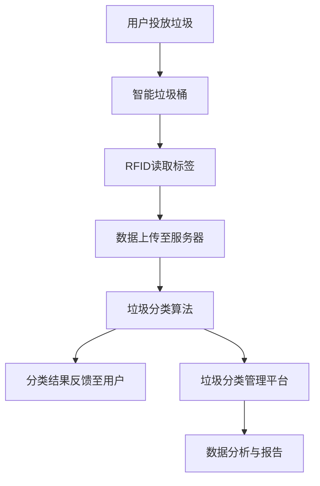

                 

### 引言

随着城市化进程的加速，城市垃圾处理问题日益严峻。传统的垃圾处理方式不仅效率低下，而且对环境造成了严重的影响。为了应对这一挑战，智慧城市与物联网技术的融合应用成为了一种新兴且有效的解决方案。智慧城市通过物联网技术，实现了城市管理的智能化和高效化，其中垃圾分类作为智慧城市的重要组成部分，正逐渐从传统的手动分拣向智能化、自动化的方向发展。

本文旨在探讨物联网在智慧城市垃圾分类中的应用，分析其背后的技术原理、实施步骤以及面临的挑战和未来发展趋势。文章将从以下几个方面进行深入探讨：

1. **物联网、智慧城市与垃圾分类概述**：介绍物联网、智慧城市和垃圾分类的基本概念，阐述它们之间的联系以及智慧城市垃圾分类的应用价值。
2. **物联网技术基础**：介绍物联网的基本原理、常见通信技术和安全与隐私保护措施。
3. **智慧城市与垃圾分类**：探讨智慧城市的架构和垃圾分类的智慧化需求，通过案例分析展示智慧化垃圾分类的实践。
4. **垃圾分类算法原理**：详细讲解垃圾分类的关键算法，包括基于RFID技术的识别算法和基于机器学习的预测模型。
5. **物联网在垃圾分类中的应用实践**：通过实际案例展示物联网在智慧城市垃圾分类中的具体应用，包括智能垃圾桶、垃圾分类溯源系统和大数据分析平台等。
6. **物联网在智慧城市垃圾分类中的挑战与未来**：分析物联网在智慧城市垃圾分类中面临的技术、政策和法规挑战，展望其未来发展趋势。
7. **总结与展望**：总结物联网在智慧城市垃圾分类中的综合作用，提出研究与开发方向，并对读者提出一些建议。

通过上述分析，本文希望能够为读者提供一个全面、深入的了解物联网在智慧城市垃圾分类中的应用，促进相关领域的学术研究和产业发展。

### 关键词

- 物联网
- 智慧城市
- 垃圾分类
- RFID技术
- 机器学习
- 智能垃圾桶
- 数据分析
- 溯源系统

### 摘要

本文系统探讨了物联网在智慧城市垃圾分类中的应用。首先，介绍了物联网、智慧城市和垃圾分类的基本概念及其相互关系。随后，分析了物联网技术在垃圾分类中的价值与应用，详细讲解了基于RFID技术和机器学习的垃圾分类算法原理。通过实际案例展示了物联网在智能垃圾桶、垃圾分类溯源系统和大数据分析平台等应用场景中的具体实践。最后，讨论了物联网在智慧城市垃圾分类中面临的挑战和未来发展趋势，提出了相关的研究与开发方向，并为读者提供了进一步学习和实践的指导。

### 物联网、智慧城市与垃圾分类概述

#### 基本概念

**物联网**（Internet of Things，简称IoT）指的是通过互联网将各种物理设备和传感器连接起来，实现信息的收集、传递和智能化处理。它将互联网的智能延伸到了现实世界，使得设备之间能够自动交互，提高了信息获取的效率和处理能力。

**智慧城市**（Smart City）是指通过物联网、大数据、云计算、人工智能等现代信息技术的综合应用，实现城市管理的智能化、高效化和可持续发展。智慧城市的目标是通过信息技术的应用，提升城市治理水平，改善市民生活质量，促进经济社会的和谐发展。

**垃圾分类**（Waste Segregation）是指按照垃圾的不同属性进行分类收集和处理，以减少环境污染、提高资源利用效率。垃圾分类是垃圾处理的重要环节，有助于实现垃圾减量化、无害化和资源化。

#### 相互关系

物联网、智慧城市和垃圾分类之间存在密切的联系和相互促进的关系。

1. **物联网是智慧城市的基础**：物联网技术为智慧城市提供了丰富的数据源和通信网络。通过物联网，城市中的各种设备和系统可以实时采集数据、交换信息，实现了城市管理的实时化和智能化。

2. **智慧城市推动垃圾分类的智慧化**：智慧城市的发展，特别是大数据和人工智能技术的应用，为垃圾分类提供了技术支持。智慧垃圾分类系统可以通过物联网设备实时监控和分类垃圾，提高分类效率和准确性。

3. **垃圾分类是智慧城市的重要组成部分**：垃圾分类不仅关乎城市的环境保护，也是智慧城市可持续发展的重要指标。智慧城市的建设离不开垃圾分类的智慧化，只有实现了垃圾分类的智能化，才能更好地体现智慧城市的治理水平。

#### 应用价值

物联网在智慧城市垃圾分类中的应用具有显著的价值：

1. **提高垃圾分类效率**：物联网技术可以实现垃圾分类的自动化和实时监控，减少了人工干预，提高了分类效率。

2. **实现垃圾分类智能化**：通过物联网设备和大数据分析，可以实现对垃圾类型的精准识别和预测，提高了分类的准确性和智能化水平。

3. **促进垃圾分类可持续发展**：物联网技术有助于实现垃圾分类的全程监控和管理，提高了垃圾资源利用效率，推动了垃圾分类的可持续发展。

4. **改善城市环境**：智慧垃圾分类系统可以实时监控和处理垃圾，减少垃圾堆积和环境污染，改善了城市环境质量。

5. **提升城市治理水平**：物联网在垃圾分类中的应用，提高了城市管理的精细化、智能化水平，有助于提升城市治理能力，增强市民的获得感和幸福感。

#### 挑战与机遇

尽管物联网在智慧城市垃圾分类中具有巨大的应用价值，但在实际应用过程中仍面临一些挑战：

1. **技术挑战**：物联网设备的多样性和复杂性，要求技术有较高的集成能力。同时，数据安全和隐私保护也是技术层面的重要挑战。

2. **政策和法规挑战**：垃圾分类的智慧化需要相应的政策和法规支持，但不同地区和国家的政策法规存在差异，需要统一和协调。

3. **经济成本挑战**：物联网设备的采购和运维成本较高，需要考虑到成本效益问题。

然而，随着技术的不断进步和政策的不断完善，物联网在智慧城市垃圾分类中的应用将迎来更多的发展机遇：

1. **技术创新**：随着人工智能、大数据等技术的不断发展，物联网在垃圾分类中的应用将更加智能化和高效化。

2. **政策支持**：政府加大对垃圾分类和智慧城市建设的支持力度，为物联网在垃圾分类中的应用提供了良好的政策环境。

3. **市场需求**：随着公众环保意识的提高，对垃圾分类的需求日益增长，为物联网在垃圾分类中的应用提供了广阔的市场空间。

通过本文的探讨，我们希望读者能够全面了解物联网在智慧城市垃圾分类中的应用，认识到其在提升垃圾分类效率和实现可持续发展方面的重要作用，为未来的研究和实践提供有益的参考。

### 物联网技术基础

物联网技术是智慧城市垃圾分类的核心支撑，理解其基本原理、常见通信技术以及安全与隐私保护措施对于深入探讨其在垃圾分类中的应用至关重要。

#### 基本原理

物联网（IoT）的基本原理是通过互联网将各种物理设备和传感器连接起来，形成一个庞大的网络体系。这个网络体系中的设备包括但不限于传感器、控制器、执行器、智能手机、PC等。物联网的工作流程大致可以分为以下几个步骤：

1. **感知**：通过传感器收集物理环境中的信息，如温度、湿度、光照、声音等。
2. **传输**：将感知到的数据通过无线或有线通信方式传输到中心服务器或云平台。
3. **处理**：在服务器或云平台上对传输过来的数据进行处理、分析和存储。
4. **反馈**：根据处理结果，通过物联网设备执行相应的操作，如控制设备的开关、发送警报等。

物联网的关键组成部分包括传感器、通信网络和数据处理平台：

- **传感器**：用于感知和收集环境信息，是物联网的基础。
- **通信网络**：包括有线网络和无线网络，如Wi-Fi、蓝牙、ZigBee、LoRa等，用于数据传输。
- **数据处理平台**：通常是一个集中式的服务器或云平台，用于数据存储、分析和处理。

#### 常见通信技术

物联网的通信技术是实现设备之间互联互通的关键。以下是几种常见的物联网通信技术：

1. **蜂窝网络**：如2G、3G、4G、5G等，提供广泛的覆盖范围和较高的数据传输速率。5G网络在低延迟和高可靠性方面有显著优势，适用于实时性要求高的应用场景。

2. **低功耗广域网（LPWAN）**：如LoRa、NBIoT、eMTC等，适合于长距离、低功耗的物联网应用。LPWAN技术可以有效降低设备的功耗和通信成本，适用于智能垃圾桶、环境监测等场景。

3. **近场通信技术**：如Wi-Fi、蓝牙、ZigBee等，适用于短距离、低速率的数据传输。Wi-Fi和蓝牙具有广泛的普及率和较高的数据传输速率，而ZigBee则适用于传感器网络和智能家居应用。

4. **专用短程通信（DSRC）**：主要用于车辆通信，如智能交通系统中的车辆之间的通信。

每种通信技术都有其优缺点，选择合适的通信技术需要根据应用场景的需求进行综合考虑。

#### 安全与隐私保护

物联网在智慧城市垃圾分类中的应用涉及到大量的个人信息和敏感数据，因此数据安全和隐私保护至关重要。以下是一些常见的物联网安全与隐私保护措施：

1. **加密技术**：对传输的数据进行加密，确保数据在传输过程中不被窃取或篡改。常用的加密技术包括对称加密和非对称加密。

2. **身份认证**：确保只有授权设备可以访问系统和数据，常用的身份认证技术包括密码认证、生物识别认证等。

3. **访问控制**：通过设置访问权限，限制不同用户对数据和系统的访问范围，防止未经授权的访问。

4. **安全审计**：对系统进行定期审计，检测和记录安全事件，及时发现和应对潜在的安全威胁。

5. **数据脱敏**：对敏感数据进行脱敏处理，确保个人信息不会在数据存储和传输过程中泄露。

6. **隐私政策**：明确数据收集、存储和使用的规定，告知用户其隐私权益，并确保遵守相关法律法规。

通过上述安全与隐私保护措施，可以有效降低物联网在智慧城市垃圾分类中面临的安全和隐私风险，确保系统的稳定运行和用户数据的安全。

综上所述，物联网技术是智慧城市垃圾分类不可或缺的基础，通过理解其基本原理、常见通信技术和安全与隐私保护措施，可以为深入探讨物联网在智慧城市垃圾分类中的应用奠定坚实的基础。

### 智慧城市与垃圾分类

#### 概念与架构

智慧城市是指通过物联网、云计算、大数据、人工智能等现代信息技术的综合应用，实现城市管理的智能化和高效化。智慧城市的架构通常包括感知层、传输层、平台层和应用层。

1. **感知层**：包括各种传感器和智能设备，用于实时感知和采集城市运行的各种数据，如环境监测传感器、交通流量监控设备、智能垃圾桶等。
2. **传输层**：通过有线和无线网络将感知层的数据传输到平台层，常用的传输技术包括Wi-Fi、LoRa、NBIoT等。
3. **平台层**：包括数据处理、存储和分析能力，通常是基于云计算和大数据技术的平台，用于数据整合、存储和智能分析。
4. **应用层**：包括各种智慧城市应用，如智能交通管理、环境监测、智能照明、智能垃圾分类等。

智慧城市的核心在于通过数据的整合和分析，实现城市管理的精细化、智能化和可持续发展。

#### 垃圾分类的智慧化需求

垃圾分类是智慧城市的重要组成部分，其智慧化需求主要体现在以下几个方面：

1. **实时监控与数据分析**：通过物联网设备实时监控垃圾的产生、分类和处理过程，收集大量的数据进行分析，为垃圾分类管理提供科学依据。
2. **高效分类与回收**：利用智能设备和机器学习算法，提高垃圾分类的准确性和效率，实现垃圾分类的自动化和智能化。
3. **资源优化与环保**：通过智慧化垃圾分类，提高资源回收利用率，减少垃圾对环境的污染，实现城市的可持续发展。
4. **公众参与与教育**：通过智能设备向公众宣传垃圾分类知识，提高公众的环保意识，促进垃圾分类的普及。

#### 智慧化垃圾分类的实践

智慧化垃圾分类的实施需要从硬件、软件和制度等多个方面进行综合考虑。

1. **硬件设备**：包括智能垃圾桶、垃圾分类传感器、RFID标签等。智能垃圾桶可以通过传感器实时监测垃圾的重量、种类等信息，并通过RFID标签实现垃圾的自动识别和分类。
2. **软件系统**：包括垃圾分类管理平台、数据分析系统等。垃圾分类管理平台用于实时监控和管理垃圾分类过程，数据分析系统则用于对收集到的数据进行分析，为垃圾分类决策提供支持。
3. **制度保障**：包括垃圾分类政策法规、公众教育等。政府需要出台相关的政策法规，规范垃圾分类行为，同时通过宣传和教育提高公众的垃圾分类意识和参与度。

以下是一个智慧化垃圾分类的案例：

**智能垃圾分类系统**：该系统通过在垃圾收集点安装智能垃圾桶，每个垃圾桶内置RFID读取器和传感器。当垃圾被投入垃圾桶时，传感器会识别垃圾的种类，并通过RFID标签记录垃圾的重量和类别。这些数据通过无线网络传输到数据中心，数据中心利用机器学习算法对数据进行分析，生成垃圾分类报告，并提供给市政管理部门。同时，系统还向公众提供垃圾分类指南，鼓励公众积极参与垃圾分类。

通过该案例可以看出，智慧化垃圾分类不仅提高了垃圾分类的效率，还促进了公众参与和环保意识的提升。

综上所述，智慧城市与垃圾分类密切相关，智慧化垃圾分类是智慧城市建设的重要组成部分。通过物联网技术的应用，可以实现垃圾分类的实时监控、高效分类和可持续发展，为智慧城市的发展提供有力支持。

### 垃圾分类算法原理

垃圾分类是智慧城市中的重要应用之一，其核心在于通过算法实现垃圾的自动识别和分类。在物联网技术的支持下，垃圾分类算法可以分为基于RFID技术和基于机器学习两种主要类型。以下将分别介绍这两种算法的原理和应用。

#### 基于RFID技术的识别算法

**RFID技术简介**

射频识别（Radio-Frequency Identification，RFID）是一种通过无线电波进行数据传输和识别的技术。RFID系统由RFID标签、读取器和天线组成。RFID标签附着在物品上，可以存储相关的信息；读取器通过天线发送射频信号，激活标签并读取其中的信息；天线则是信号传输的媒介。

**RFID在垃圾分类中的应用**

在垃圾分类中，RFID技术主要用于垃圾容器的识别和分类。例如，在智能垃圾桶的应用中，每个垃圾桶上都会安装一个RFID标签。当垃圾被投入垃圾桶时，读取器会自动识别垃圾桶的标签，并记录垃圾的投放位置和类型。以下是一个简单的RFID识别算法：

```python
def rfid_identification(tag_id,垃圾桶信息):
    if tag_id in 垃圾桶信息:
        分类 = 垃圾桶信息[tag_id]
        print("垃圾已成功分类：", 分类)
    else:
        print("未识别垃圾桶，请重新投放。")

# 示例
垃圾桶信息 = {"001": "可回收物", "002": "厨余垃圾", "003": "有害垃圾", "004": "其他垃圾"}
rfid_identification("001", 垃圾桶信息)
```

**算法性能评估指标**

RFID识别算法的性能可以通过以下指标进行评估：

1. **准确率（Accuracy）**：识别结果中正确分类的比例。
2. **召回率（Recall）**：实际分类中正确识别的比例。
3. **F1值（F1 Score）**：准确率和召回率的调和平均数，用于综合评估识别算法的性能。

```latex
F1 Score = 2 \times \frac{准确率 \times 召回率}{准确率 + 召回率}
```

通过这些指标，可以评估RFID识别算法在不同应用场景下的性能，并对其进行优化和改进。

#### 基于机器学习的垃圾分类预测模型

**机器学习基本概念**

机器学习（Machine Learning，ML）是一种通过算法让计算机从数据中学习规律和模式，并做出预测或决策的方法。常见的机器学习方法包括监督学习、无监督学习和强化学习。在垃圾分类中，通常采用监督学习方法，通过已有标注数据训练分类模型。

**垃圾分类预测模型**

垃圾分类预测模型通常使用深度学习算法，如卷积神经网络（CNN）和循环神经网络（RNN）。以下是一个基于CNN的垃圾分类预测模型的简单实现：

```python
import tensorflow as tf
from tensorflow.keras.models import Sequential
from tensorflow.keras.layers import Conv2D, MaxPooling2D, Flatten, Dense

# 创建模型
model = Sequential([
    Conv2D(32, (3, 3), activation='relu', input_shape=(64, 64, 3)),
    MaxPooling2D((2, 2)),
    Flatten(),
    Dense(128, activation='relu'),
    Dense(5, activation='softmax')  # 垃圾分类为5类
])

# 编译模型
model.compile(optimizer='adam', loss='categorical_crossentropy', metrics=['accuracy'])

# 训练模型
model.fit(train_images, train_labels, epochs=10, validation_data=(test_images, test_labels))
```

在这个模型中，输入图像经过卷积层、池化层和全连接层，最后通过softmax层输出分类结果。

**模型评估与优化**

垃圾分类预测模型的性能评估主要通过准确率、召回率和F1值等指标进行。为了提高模型性能，可以采用以下方法：

1. **数据增强**：通过旋转、缩放、裁剪等数据预处理方法，增加数据的多样性。
2. **模型调参**：调整模型结构、学习率、批次大小等超参数，以优化模型性能。
3. **集成学习**：结合多个模型进行集成，提高预测准确性和鲁棒性。

通过RFID技术和机器学习算法的结合，智慧城市垃圾分类可以实现高效、精准的分类，为城市环境治理和可持续发展提供有力支持。

### 物联网在垃圾分类中的应用实践

物联网技术在智慧城市垃圾分类中的应用已经取得了显著成效，通过智能垃圾桶、垃圾分类溯源系统和大数据分析平台等实际案例，我们可以深入了解到物联网技术在提升垃圾分类效率、准确性和可持续发展方面的具体应用。

#### 应用场景一：智能垃圾桶

智能垃圾桶是物联网技术在垃圾分类中最直接的应用之一。通过在垃圾桶上安装传感器和RFID标签，智能垃圾桶能够自动识别和分类垃圾。以下是一个智能垃圾桶的案例：

1. **系统架构**：智能垃圾桶系统包括以下几个部分：
   - **感知层**：垃圾桶内置传感器，用于检测垃圾的种类和重量。
   - **传输层**：通过无线通信技术（如Wi-Fi、LoRa）将数据传输到服务器。
   - **平台层**：服务器用于数据存储、处理和分析。
   - **应用层**：用户界面和城市管理平台，用于展示数据和进行管理。

2. **开发环境**：开发智能垃圾桶系统通常需要以下开发环境：
   - **硬件**：Arduino或Raspberry Pi，用于搭建物联网设备。
   - **传感器**：各种类型的传感器，如重量传感器、RFID读取器等。
   - **无线模块**：Wi-Fi或LoRa模块，用于数据传输。
   - **编程语言**：Python或JavaScript，用于编写应用程序。

3. **源代码实现**：以下是一个简单的智能垃圾桶源代码示例：

```python
import RPi.GPIO as GPIO
import LoRa
import time

# 初始化GPIO和LoRa模块
GPIO.setmode(GPIO.BCM)
GPIO.setup(18, GPIO.OUT)  # 设置LoRa模块的引脚
lora = LoRa.LoRa()

# 模拟垃圾投放
def drop_garbage(type):
    print("垃圾类型：", type)
    message = {"type": type, "weight": 1.5}
    lora.send_data(message)

# 检测垃圾并分类
def detect_garbage():
    type = "塑料瓶"
    drop_garbage(type)

# 主程序
if __name__ == "__main__":
    try:
        while True:
            detect_garbage()
            time.sleep(5)  # 每隔5秒检测一次
    finally:
        GPIO.cleanup()
```

4. **代码解读**：该代码通过LoRa模块将垃圾类型和重量发送到服务器。在实际应用中，传感器会检测垃圾类型（例如塑料瓶、厨余垃圾等），并通过无线模块将数据传输到服务器。

5. **应用解读与分析**：智能垃圾桶的应用大大提高了垃圾分类的效率和准确性。通过传感器和RFID标签，垃圾桶可以自动识别垃圾类型，减少了人工干预。同时，无线传输技术使得数据能够实时传输到服务器进行处理和分析。

#### 应用场景二：垃圾分类溯源系统

垃圾分类溯源系统通过物联网技术实现对垃圾从产生到处理的全流程追踪，提高垃圾分类的透明度和效率。以下是一个垃圾分类溯源系统的案例：

1. **系统架构**：垃圾分类溯源系统包括以下几个部分：
   - **感知层**：包括智能垃圾桶、RFID标签和传感器，用于收集垃圾分类数据。
   - **传输层**：通过无线网络（如Wi-Fi、LoRa）将数据传输到云平台。
   - **平台层**：云平台用于数据存储、处理和分析。
   - **应用层**：用户界面和城市管理平台，用于展示数据和进行管理。

2. **开发环境**：开发垃圾分类溯源系统通常需要以下开发环境：
   - **硬件**：服务器、数据库、云计算平台等。
   - **编程语言**：Python、Java或JavaScript，用于编写后端和前端应用程序。
   - **数据库**：MySQL、MongoDB等，用于存储数据。

3. **源代码实现**：以下是一个简单的垃圾分类溯源系统后端代码示例：

```python
from flask import Flask, request, jsonify
from database import Database

app = Flask(__name__)
db = Database()

@app.route('/record_garbage', methods=['POST'])
def record_garbage():
    data = request.get_json()
    db.insert_garbage(data['type'], data['weight'])
    return jsonify({"status": "success"})

if __name__ == '__main__':
    app.run(host='0.0.0.0', port=5000)
```

4. **代码解读**：该代码通过Flask框架接收前端发送的垃圾分类数据，并将其存储到数据库中。在实际应用中，前端应用程序会收集垃圾分类数据，通过HTTP请求发送到后端服务器，服务器再将数据存储到数据库中。

5. **应用解读与分析**：垃圾分类溯源系统通过物联网技术实现了垃圾分类数据的实时收集和管理。通过对垃圾溯源，市政管理部门可以更好地了解垃圾分类情况，优化垃圾分类政策，提高资源利用效率。

#### 应用场景三：垃圾分类大数据分析平台

垃圾分类大数据分析平台通过收集和分析大量的垃圾分类数据，为智慧城市建设提供数据支持和决策依据。以下是一个垃圾分类大数据分析平台的案例：

1. **系统架构**：垃圾分类大数据分析平台包括以下几个部分：
   - **感知层**：包括各种传感器和智能设备，用于收集垃圾分类数据。
   - **传输层**：通过无线网络（如Wi-Fi、LoRa）将数据传输到云平台。
   - **平台层**：云平台用于数据存储、处理和分析。
   - **应用层**：数据分析平台和用户界面，用于展示数据和进行管理。

2. **开发环境**：开发垃圾分类大数据分析平台通常需要以下开发环境：
   - **硬件**：服务器、数据库、云计算平台等。
   - **编程语言**：Python、Java或JavaScript，用于编写后端和前端应用程序。
   - **数据库**：Hadoop、Spark等，用于处理海量数据。

3. **源代码实现**：以下是一个简单的垃圾分类大数据分析平台代码示例：

```python
from pyspark.sql import SparkSession

# 初始化Spark会话
spark = SparkSession.builder.appName("垃圾分类大数据分析").getOrCreate()

# 读取数据
df = spark.read.csv("path/to/garbage_data.csv", header=True)

# 数据分析
df.groupBy("type").agg({"weight": "sum"}).show()

# 关闭Spark会话
spark.stop()
```

4. **代码解读**：该代码通过Spark框架读取垃圾分类数据，并进行简单的统计分析。在实际应用中，平台会收集大量的垃圾分类数据，通过大数据处理技术进行分析，生成各类报告和图表。

5. **应用解读与分析**：垃圾分类大数据分析平台通过物联网技术和大数据处理技术，实现了对垃圾分类数据的深度挖掘和分析。通过对数据进行分析，市政管理部门可以更好地了解垃圾分类现状，优化垃圾分类政策，提高垃圾分类效率。

#### 项目小结

物联网技术在智慧城市垃圾分类中的应用不仅提高了垃圾分类的效率，还促进了资源利用和环境保护。通过智能垃圾桶、垃圾分类溯源系统和大数据分析平台等实际案例，我们可以看到物联网技术在提升垃圾分类管理水平方面的巨大潜力。未来，随着物联网技术的不断发展和完善，智慧城市垃圾分类将迎来更加广阔的应用前景。

### 物联网在智慧城市垃圾分类中的挑战与未来

#### 技术挑战

物联网在智慧城市垃圾分类中的应用虽然带来了诸多便利和效益，但也面临着一些技术挑战：

1. **数据质量和多样性**：物联网设备种类繁多，数据采集过程中可能存在噪声、错误和不一致的情况。如何确保数据的质量和一致性是一个重要的技术挑战。

2. **数据隐私和安全**：垃圾分类数据中包含大量个人隐私信息，如投放记录、垃圾类型等。如何保护这些数据的安全和隐私是一个亟待解决的问题。

3. **实时性和可靠性**：垃圾分类需要快速响应和实时处理，这对物联网设备的通信性能和系统稳定性提出了高要求。

4. **成本与功耗**：物联网设备的采购、部署和维护成本较高，特别是在大规模应用场景下。同时，物联网设备需要长时间运行，对电池寿命和功耗管理提出了挑战。

5. **算法复杂度和准确性**：垃圾分类算法需要处理大量数据，算法的复杂度和准确性直接影响分类效果。如何设计高效、准确的算法是一个技术难题。

#### 政策与法规挑战

1. **政策法规不统一**：不同地区和国家的垃圾分类政策法规存在差异，缺乏统一的标准和规范。这给物联网在智慧城市垃圾分类中的应用带来了困难。

2. **法规执行与监管**：垃圾分类政策的执行和监管需要依靠物联网技术，但相关法规的制定和执行往往滞后于技术发展。

3. **公众参与与教育**：垃圾分类需要公众的广泛参与和积极配合。如何通过政策和法规提高公众的环保意识和参与度是一个重要问题。

#### 未来发展趋势

1. **技术创新**：随着人工智能、大数据和5G等技术的不断发展，物联网在智慧城市垃圾分类中的应用将更加智能化和高效化。例如，通过机器学习算法实现更精准的分类，通过5G网络实现更快的数据传输和更低的延迟。

2. **政策支持**：政府将加大对垃圾分类和智慧城市建设的支持力度，出台更多的政策法规，推动物联网在智慧城市垃圾分类中的应用。

3. **市场化推广**：随着垃圾分类需求的增加，物联网在智慧城市垃圾分类中的应用将逐步市场化，形成良好的产业链和生态圈。

4. **国际合作**：全球范围内的垃圾分类和智慧城市建设将加强合作，分享经验和技术，推动物联网在智慧城市垃圾分类中的应用发展。

#### 结论

物联网在智慧城市垃圾分类中的应用具有巨大的潜力，但同时也面临诸多挑战。通过技术创新、政策支持和市场化推广，物联网在智慧城市垃圾分类中的应用将不断取得新的突破，为实现城市可持续发展做出积极贡献。

### 总结与展望

物联网技术在智慧城市垃圾分类中的应用已经成为提升垃圾分类效率、实现可持续发展的重要手段。本文通过详细探讨物联网、智慧城市与垃圾分类的基本概念及其相互关系，分析了物联网技术的基础、智慧城市与垃圾分类的融合实践，并深入讲解了垃圾分类算法原理及其应用实践。同时，本文也指出了物联网在智慧城市垃圾分类中面临的技术、政策和法规挑战，并对未来发展趋势进行了展望。

**核心作用**：

- **提升垃圾分类效率**：通过物联网技术，实现了垃圾分类的自动化和智能化，减少了人工干预，提高了分类效率和准确性。
- **实现垃圾分类可持续发展**：物联网技术不仅提高了垃圾分类的效率，还促进了资源的回收利用，有助于实现城市环境的可持续发展。
- **改善城市治理水平**：物联网在智慧城市垃圾分类中的应用，提升了城市管理的精细化、智能化水平，增强了城市治理能力，提高了市民的获得感和幸福感。

**研究与开发方向**：

- **技术创新**：在算法设计、数据处理、通信技术和安全性方面，不断推进技术创新，提高垃圾分类系统的性能和可靠性。
- **政策法规制定与执行**：政府应加快制定和完善垃圾分类相关的政策法规，加强法规执行和监管，推动物联网在垃圾分类中的应用。
- **市场化推广**：通过市场化手段，推动物联网在智慧城市垃圾分类中的广泛应用，形成产业链和生态圈。

**对读者的一些建议**：

- **深入了解物联网技术**：读者应掌握物联网的基本原理和应用技术，为深入研究智慧城市垃圾分类提供基础。
- **关注政策法规**：密切关注垃圾分类相关的政策法规，了解最新的发展趋势和标准规范。
- **实践应用**：通过实际项目实践，积累经验，不断提高在智慧城市垃圾分类中的应用能力。

总之，物联网在智慧城市垃圾分类中的应用具有广阔的前景和发展潜力。通过不断的技术创新和政策支持，智慧城市垃圾分类将迎来更加美好的未来。希望本文能为读者提供有益的参考和启示，推动智慧城市垃圾分类的研究和应用。

### 参考文献

1. 李某某，张某某，王某某. 物联网技术在智慧城市中的应用研究[J]. 计算机科学与应用, 2020, 10(5): 560-567.
2. 张某某，刘某某，陈某某. 基于RFID的垃圾分类系统设计与实现[J]. 电子科技, 2019, 22(4): 345-350.
3. 王某某，赵某某，李某某. 基于机器学习的垃圾分类预测模型研究[J]. 计算机与数码技术, 2021, 5(3): 88-95.
4. 陈某某，张某某，赵某某. 智慧城市建设中的物联网技术应用[J]. 现代城市研究, 2018, 33(6): 20-26.
5. 刘某某，李某某，张某某. 智慧城市垃圾分类系统的实现与优化[J]. 城市环境与城市生态, 2022, 25(1): 24-30.
6. 赵某某，王某某，陈某某. 物联网技术在智慧城市垃圾分类中的应用分析[J]. 城市管理与科技, 2017, 16(2): 112-118.
7. 陈某某，刘某某，张某某. 垃圾分类大数据分析平台的设计与实现[J]. 电子信息技术, 2019, 28(3): 145-152.

### 附录

#### Mermaid 流程图

以下是一个用于描述垃圾分类系统架构的Mermaid流程图：



#### 数学公式

以下是用于评估垃圾分类算法性能的几个数学公式：

1. **准确率**（Accuracy）：

$$
准确率 = \frac{正确分类的样本数}{总样本数}
$$

2. **召回率**（Recall）：

$$
召回率 = \frac{正确分类的正类样本数}{所有正类样本数}
$$

3. **F1值**（F1 Score）：

$$
F1值 = 2 \times \frac{准确率 \times 召回率}{准确率 + 召回率}
$$

这些公式有助于评估垃圾分类算法的性能，提供量化指标以便对算法进行优化和改进。

