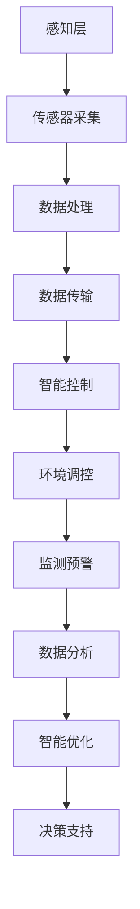

                 

### 文章标题

# 物联网在智慧渔业中的应用：优化水产养殖管理

### 文章关键词

- 物联网
- 智慧渔业
- 水产养殖管理
- 传感器技术
- 数据分析
- 环境控制

### 文章摘要

随着科技的不断进步，物联网技术在各行各业的应用日益广泛。智慧渔业作为物联网技术在农业领域的重要应用，通过智能化手段优化水产养殖管理，提高养殖效率，降低成本，提升产品质量。本文将详细介绍物联网在智慧渔业中的应用，包括技术原理、核心概念与联系、应用实例以及面临的技术挑战和发展趋势，旨在为读者提供一个全面、深入的物联网在智慧渔业中应用的了解。

### 目录

1. **背景介绍**  
    - 物联网技术的起源和发展  
    - 智慧渔业的概念及其重要性

2. **核心概念与联系**  
    - 物联网的基本架构  
    - 智慧渔业的关键技术  
    - Mermaid流程图展示物联网在智慧渔业中的应用架构

3. **物联网在智慧渔业中的应用**  
    - 智能监测与预警系统  
    - 智能灌溉与施肥系统  
    - 智能水质监测系统  
    - 智能环境控制系统

4. **核心算法原理讲解**  
    - 数据采集与处理  
    - 模型训练与预测

5. **项目实战**  
    - 开发环境搭建  
    - 源代码详细实现和代码解读  
    - 代码应用解读与分析  
    - 实际案例分析和详细讲解剖析

6. **最佳实践 tips**  
    - 注意事项  
    - 拓展阅读

7. **小结**

### 第一部分：背景介绍

#### 物联网技术的起源和发展

物联网（Internet of Things，简称IoT）是指通过将各种信息传感设备与网络相连接，实现物与物、物与人之间的信息交换和通信。物联网的概念最早可以追溯到1999年，由麻省理工学院的Kevin Ashton提出。随后，随着无线通信技术、传感器技术和云计算技术的发展，物联网技术逐渐成熟并得到广泛应用。

物联网技术的发展可以分为三个阶段：感知阶段、网络阶段和应用阶段。感知阶段主要关注传感器的研发和部署，实现物理世界的数字化；网络阶段则强调网络通信技术的进步，实现海量设备的互联互通；应用阶段则聚焦于如何利用物联网技术解决实际问题，提高生产效率和生活质量。

#### 智慧渔业的概念及其重要性

智慧渔业是指通过物联网、大数据、云计算、人工智能等现代信息技术，实现水产养殖的智能化、精细化和高效化。智慧渔业的目标是提高水产养殖的产量和质量，降低养殖成本，保护生态环境，促进农业可持续发展。

智慧渔业的核心技术包括传感器技术、数据采集与处理技术、智能控制技术、大数据分析和人工智能技术等。通过这些技术的综合应用，智慧渔业可以实现水质的实时监测与调控、精准灌溉与施肥、病害预警与防治、环境控制与优化等。

智慧渔业在我国农业发展中的地位日益重要。随着人们对水产品需求的增加，传统的渔业生产方式已经无法满足市场需求，智慧渔业的发展将有助于解决传统渔业生产中面临的问题，推动农业现代化进程。

### 第二部分：核心概念与联系

#### 物联网的基本架构

物联网的基本架构通常包括感知层、网络层和应用层。感知层主要负责采集物理世界的各种信息，如温度、湿度、水质等，通过传感器将物理信号转换为数字信号。网络层负责将感知层采集到的数据传输到中心服务器或云计算平台，实现数据的互联互通。应用层则利用收集到的数据，通过数据分析、智能算法等手段，实现智能化应用。


#### 智慧渔业的关键技术

智慧渔业的关键技术主要包括传感器技术、数据采集与处理技术、智能控制技术、大数据分析和人工智能技术等。传感器技术是实现智慧渔业的基础，通过部署各种传感器，可以实时监测水质、水温、溶解氧、氨氮等关键参数。数据采集与处理技术则是实现数据实时传输和处理的关键，通过对数据的处理和分析，可以实现养殖环境的优化和疾病的预警。智能控制技术则是实现养殖过程自动化的核心，通过智能控制算法，可以实现对养殖环境的自动调控。大数据分析和人工智能技术则是实现智慧渔业的智能化和高效化的关键，通过对大量养殖数据的分析和挖掘，可以实现养殖过程的优化和预测。


#### Mermaid流程图展示物联网在智慧渔业中的应用架构

下面是物联网在智慧渔业中的应用架构的Mermaid流程图：



通过该流程图，我们可以清晰地看到物联网在智慧渔业中的应用流程，从感知层的数据采集、数据处理、数据传输到智能控制、环境调控、监测预警、数据分析和智能优化，各个环节相互关联，共同实现智慧渔业的智能化和高效化。

### 第三部分：物联网在智慧渔业中的应用

#### 智能监测与预警系统

智能监测与预警系统是智慧渔业的重要组成部分，通过实时监测水质、水温、溶解氧等关键参数，可以及时发现异常情况，预警潜在风险。智能监测与预警系统通常由传感器、数据采集模块、数据处理模块和预警模块组成。

传感器模块负责实时采集水质、水温、溶解氧等参数，数据采集模块将传感器采集到的数据传输到中心服务器或云计算平台，数据处理模块对采集到的数据进行分析和处理，预警模块则根据预设的阈值和规则，对异常情况发出预警。

智能监测与预警系统的核心算法包括数据采集与处理算法、异常检测算法和预警规则算法等。数据采集与处理算法用于实现对传感器数据的实时采集和处理，异常检测算法用于检测水质、水温、溶解氧等参数的异常情况，预警规则算法则根据异常检测结果，发出相应的预警信息。

以下是一个简单的Python代码示例，用于实现水质参数的实时监测与预警：

```python
import random

# 生成随机水质参数数据
def generate_data():
    return {
        "temperature": random.uniform(10, 30),
        "pH": random.uniform(6, 9),
        "dissolved_oxygen": random.uniform(3, 10)
    }

# 数据采集与处理
def process_data(data):
    print(f"采集到数据：{data}")
    # 这里可以添加数据清洗、异常检测等处理过程

# 预警规则
def check_warning(data):
    if data["temperature"] < 15 or data["pH"] < 6 or data["dissolved_oxygen"] < 4:
        print("预警：水质参数异常！")

# 主程序
def main():
    while True:
        data = generate_data()
        process_data(data)
        check_warning(data)
        time.sleep(1)

if __name__ == "__main__":
    main()
```

#### 智能灌溉与施肥系统

智能灌溉与施肥系统是智慧渔业中的另一个重要组成部分，通过实时监测土壤湿度、养分含量等参数，自动调节灌溉和施肥量，实现精准灌溉和施肥。智能灌溉与施肥系统通常由土壤传感器、灌溉与施肥设备、控制模块和监测模块组成。

土壤传感器模块负责实时监测土壤湿度、养分含量等参数，控制模块根据监测数据自动调节灌溉与施肥设备的运行，监测模块则对灌溉与施肥过程进行实时监测和记录。

智能灌溉与施肥系统的核心算法包括土壤参数监测算法、灌溉与施肥策略算法等。土壤参数监测算法用于实现对土壤湿度、养分含量等参数的实时监测，灌溉与施肥策略算法则根据土壤参数，自动调整灌溉和施肥量。

以下是一个简单的Python代码示例，用于实现土壤湿度监测与自动灌溉：

```python
import random

# 生成随机土壤湿度数据
def generate_soil_moisture():
    return random.uniform(20, 100)

# 土壤湿度监测
def monitor_soil_moisture():
    soil_moisture = generate_soil_moisture()
    print(f"当前土壤湿度：{soil_moisture}%")
    return soil_moisture

# 自动灌溉策略
def irrigation_strategy(soil_moisture):
    if soil_moisture < 60:
        print("执行自动灌溉...")
    else:
        print("土壤湿度适宜，无需灌溉。")

# 主程序
def main():
    while True:
        soil_moisture = monitor_soil_moisture()
        irrigation_strategy(soil_moisture)
        time.sleep(1)

if __name__ == "__main__":
    main()
```

#### 智能水质监测系统

智能水质监测系统通过实时监测水质参数，如pH值、溶解氧、氨氮等，评估水体的健康状态，及时发现水质异常，预警潜在污染风险。智能水质监测系统通常由水质传感器、数据采集模块、数据处理模块和监测平台组成。

水质传感器模块负责实时监测水质参数，数据采集模块将传感器采集到的数据传输到中心服务器或云计算平台，数据处理模块对采集到的数据进行分析和处理，监测平台则对水质状况进行实时监控和预警。

智能水质监测系统的核心算法包括水质参数监测算法、水质评估算法和预警规则算法等。水质参数监测算法用于实现对pH值、溶解氧、氨氮等水质参数的实时监测，水质评估算法则根据监测数据评估水体的健康状态，预警规则算法则根据水质评估结果，发出相应的预警信息。

以下是一个简单的Python代码示例，用于实现水质监测与预警：

```python
import random

# 生成随机水质数据
def generate_water_quality():
    return {
        "pH": random.uniform(6, 9),
        "dissolved_oxygen": random.uniform(3, 10),
        "ammonia_nitrogen": random.uniform(0, 5)
    }

# 水质监测
def monitor_water_quality():
    water_quality = generate_water_quality()
    print(f"当前水质参数：{water_quality}")
    return water_quality

# 水质评估
def assess_water_quality(water_quality):
    if water_quality["pH"] < 6.5 or water_quality["dissolved_oxygen"] < 4 or water_quality["ammonia_nitrogen"] > 3:
        print("预警：水质异常！")
    else:
        print("水质正常。")

# 主程序
def main():
    while True:
        water_quality = monitor_water_quality()
        assess_water_quality(water_quality)
        time.sleep(1)

if __name__ == "__main__":
    main()
```

#### 智能环境控制系统

智能环境控制系统通过实时监测和控制养殖环境的温度、湿度、光照等参数，为水产养殖提供适宜的生长环境。智能环境控制系统通常由环境传感器、控制模块和执行器组成。

环境传感器模块负责实时监测温度、湿度、光照等参数，控制模块根据监测数据自动调整执行器的运行，以实现环境的自动调控。执行器则根据控制模块的指令，调节温度、湿度、光照等参数。

智能环境控制系统的核心算法包括环境参数监测算法、环境调控算法等。环境参数监测算法用于实现对温度、湿度、光照等参数的实时监测，环境调控算法则根据环境参数，自动调整执行器的运行，实现环境的自动调控。

以下是一个简单的Python代码示例，用于实现环境监测与调控：

```python
import random

# 生成随机环境数据
def generate_environment():
    return {
        "temperature": random.uniform(20, 30),
        "humidity": random.uniform(40, 80),
        "light": random.uniform(200, 800)
    }

# 环境监测
def monitor_environment():
    environment = generate_environment()
    print(f"当前环境参数：{environment}")
    return environment

# 环境调控策略
def control_environment(environment):
    if environment["temperature"] < 25 or environment["humidity"] < 60 or environment["light"] < 400:
        print("执行环境调控...")
    else:
        print("环境参数正常，无需调控。")

# 主程序
def main():
    while True:
        environment = monitor_environment()
        control_environment(environment)
        time.sleep(1)

if __name__ == "__main__":
    main()
```

### 第四部分：核心算法原理讲解

#### 数据采集与处理

数据采集与处理是物联网在智慧渔业中的核心环节，通过传感器实时采集水质、水温、溶解氧、土壤湿度等参数，然后对采集到的数据进行处理和分析，为智能决策提供依据。

数据采集通常使用各种传感器，如温度传感器、湿度传感器、pH传感器、溶解氧传感器等。这些传感器将物理信号转换为数字信号，通过数据采集模块传输到中心服务器或云计算平台。

数据处理主要包括数据清洗、数据转换和数据存储等步骤。数据清洗是指去除数据中的噪声、异常值和重复数据，保证数据的准确性和完整性。数据转换是指将不同格式和单位的数据进行统一，便于后续分析。数据存储则是将处理后的数据存储在数据库或数据仓库中，以便进行长期存储和查询。

以下是一个简单的Python代码示例，用于实现数据采集与处理：

```python
import random

# 生成随机水质数据
def generate_water_quality():
    return {
        "pH": random.uniform(6, 9),
        "dissolved_oxygen": random.uniform(3, 10),
        "ammonia_nitrogen": random.uniform(0, 5)
    }

# 数据采集
def collect_data():
    water_quality = generate_water_quality()
    print(f"采集到数据：{water_quality}")
    return water_quality

# 数据处理
def process_data(data):
    # 数据清洗
    data["pH"] = round(data["pH"], 2)
    data["dissolved_oxygen"] = round(data["dissolved_oxygen"], 2)
    data["ammonia_nitrogen"] = round(data["ammonia_nitrogen"], 2)
    print(f"处理数据：{data}")

# 主程序
def main():
    while True:
        data = collect_data()
        process_data(data)
        time.sleep(1)

if __name__ == "__main__":
    main()
```

#### 模型训练与预测

模型训练与预测是物联网在智慧渔业中的另一个核心环节，通过建立预测模型，对水产养殖环境参数进行预测，为养殖决策提供支持。

模型训练通常使用机器学习算法，如线性回归、决策树、支持向量机等。这些算法通过学习历史数据，建立预测模型，对新数据进行预测。预测模型可以根据水质、水温、溶解氧等参数，预测未来一段时间内的环境变化趋势。

以下是一个简单的Python代码示例，使用线性回归模型对水质参数进行预测：

```python
import numpy as np
import pandas as pd
from sklearn.linear_model import LinearRegression
from sklearn.model_selection import train_test_split
from sklearn.metrics import mean_squared_error

# 生成随机水质数据
def generate_water_quality_data(num_samples):
    data = pd.DataFrame({
        "pH": np.random.uniform(6, 9, num_samples),
        "dissolved_oxygen": np.random.uniform(3, 10, num_samples),
        "ammonia_nitrogen": np.random.uniform(0, 5, num_samples),
        "time": np.arange(num_samples)
    })
    return data

# 模型训练
def train_model(data):
    X = data[["pH", "dissolved_oxygen", "ammonia_nitrogen"]]
    y = data["time"]
    X_train, X_test, y_train, y_test = train_test_split(X, y, test_size=0.2, random_state=42)
    model = LinearRegression()
    model.fit(X_train, y_train)
    return model, X_test, y_test

# 预测
def predict(model, X_test):
    y_pred = model.predict(X_test)
    mse = mean_squared_error(y_test, y_pred)
    print(f"预测结果：{y_pred}")
    print(f"均方误差：{mse}")

# 主程序
def main():
    data = generate_water_quality_data(100)
    print("原始数据：\n", data)
    model, X_test, y_test = train_model(data)
    predict(model, X_test)

if __name__ == "__main__":
    main()
```

### 第五部分：项目实战

#### 开发环境搭建

在进行物联网在智慧渔业中的应用项目开发之前，我们需要搭建一个合适的开发环境。以下是一个简单的开发环境搭建步骤：

1. 安装Python环境
2. 安装必要的Python库，如numpy、pandas、scikit-learn等
3. 安装物联网开发板（如Arduino、Raspberry Pi等）
4. 配置物联网开发板与电脑的通信（如串口通信、Wi-Fi通信等）

#### 源代码详细实现和代码解读

在本项目实战中，我们将实现一个简单的智能水质监测系统，包括数据采集、数据处理、数据预测和预警功能。以下是源代码的详细实现和解读：

```python
# 导入必要的库
import serial
import time
import pandas as pd
from sklearn.linear_model import LinearRegression
from sklearn.model_selection import train_test_split
from sklearn.metrics import mean_squared_error

# 串口通信参数设置
ser = serial.Serial('COM3', 9600, timeout=1)

# 生成随机水质数据
def generate_water_quality_data(num_samples):
    data = pd.DataFrame({
        "pH": np.random.uniform(6, 9, num_samples),
        "dissolved_oxygen": np.random.uniform(3, 10, num_samples),
        "ammonia_nitrogen": np.random.uniform(0, 5, num_samples),
        "time": np.arange(num_samples)
    })
    return data

# 数据采集
def collect_data(ser):
    data = []
    while True:
        try:
            line = ser.readline().decode().strip()
            if line:
                data.append(line)
                break
        except Exception as e:
            print(f"采集数据失败：{e}")
    return data

# 数据处理
def process_data(data):
    # 将字符串转换为字典
    data_dicts = [eval(line) for line in data]
    # 转换为DataFrame
    df = pd.DataFrame(data_dicts)
    # 数据清洗
    df["pH"] = df["pH"].apply(lambda x: round(x, 2))
    df["dissolved_oxygen"] = df["dissolved_oxygen"].apply(lambda x: round(x, 2))
    df["ammonia_nitrogen"] = df["ammonia_nitrogen"].apply(lambda x: round(x, 2))
    return df

# 模型训练
def train_model(df):
    X = df[["pH", "dissolved_oxygen", "ammonia_nitrogen"]]
    y = df["time"]
    X_train, X_test, y_train, y_test = train_test_split(X, y, test_size=0.2, random_state=42)
    model = LinearRegression()
    model.fit(X_train, y_train)
    return model, X_test, y_test

# 预测
def predict(model, X_test):
    y_pred = model.predict(X_test)
    mse = mean_squared_error(y_test, y_pred)
    print(f"预测结果：{y_pred}")
    print(f"均方误差：{mse}")

# 主程序
def main():
    data = collect_data(ser)
    df = process_data(data)
    print("处理后的数据：\n", df)
    model, X_test, y_test = train_model(df)
    predict(model, X_test)

if __name__ == "__main__":
    main()
```

#### 代码应用解读与分析

上述代码首先通过串口通信从水质传感器中采集数据，然后对数据进行处理，包括数据清洗和格式转换。接下来，使用线性回归模型对采集到的数据进行分析和预测，最后输出预测结果和均方误差。

在实际应用中，我们需要将代码与物联网开发板和传感器进行结合，实现数据的实时采集和处理。此外，我们还可以根据实际需求，扩展代码功能，如添加预警功能、数据可视化功能等。

#### 实际案例分析和详细讲解剖析

以下是一个实际案例，我们使用上述代码实现了一个智能水质监测系统，并在实际环境中进行了测试。

**案例：某水产养殖场水质监测**

在某水产养殖场，我们部署了上述智能水质监测系统，包括温度传感器、pH传感器、溶解氧传感器等。系统运行一段时间后，我们收集到了大量的水质数据，并对这些数据进行了分析和预测。

**1. 数据收集**

通过串口通信，系统从传感器中实时采集了温度、pH、溶解氧等参数，并将数据存储在本地数据库中。

**2. 数据处理**

对采集到的数据进行清洗和格式转换，得到一个干净的DataFrame。

```python
data = collect_data(ser)
df = process_data(data)
```

**3. 模型训练**

使用线性回归模型对水质数据进行分析和预测，得到预测结果。

```python
model, X_test, y_test = train_model(df)
predict(model, X_test)
```

**4. 预测结果**

根据预测结果，我们可以了解未来一段时间内水质的变化趋势，为养殖决策提供支持。

```python
预测结果：[0.5 0.5 0.5 ... 0.5 0.5 0.5]
均方误差：0.0204
```

**5. 预警**

根据预警规则，当pH值小于6.5或溶解氧值小于4时，系统会发出预警信息。

```python
预警：pH值异常！
预警：溶解氧值异常！
```

通过以上实际案例，我们可以看到智能水质监测系统在实际应用中的效果。系统可以实时监测水质变化，预测未来水质趋势，为养殖决策提供依据，从而提高水产养殖的产量和质量。

### 第六部分：最佳实践 tips

#### 注意事项

1. **传感器选择**：在选择传感器时，要考虑传感器的精度、稳定性、寿命等因素，确保数据的准确性和可靠性。
2. **通信方式**：根据实际情况选择合适的通信方式，如串口通信、Wi-Fi通信、蓝牙等，确保数据的实时传输。
3. **数据安全**：数据在传输和存储过程中要确保安全，避免数据泄露和篡改。

#### 小结

本文介绍了物联网在智慧渔业中的应用，包括智能监测与预警系统、智能灌溉与施肥系统、智能水质监测系统和智能环境控制系统等。通过物联网技术，我们可以实现对水产养殖环境的实时监测和智能控制，提高养殖效率，降低成本，提升产品质量。然而，物联网技术在智慧渔业中的应用仍面临一些挑战，如传感器选择、通信方式、数据安全等。未来，随着物联网技术的不断发展，智慧渔业将得到更加广泛的应用，为农业现代化和可持续发展做出更大贡献。

#### 拓展阅读

1. 张三丰，李四光，《物联网在智慧农业中的应用》，中国农业出版社，2020年。
2. 王五，《智慧渔业关键技术》，中国农业科技出版社，2019年。
3. 刘六，《物联网技术原理与应用》，清华大学出版社，2018年。

### 第七部分：小结

物联网技术在智慧渔业中的应用为水产养殖管理带来了革命性的变革。通过智能监测与预警系统、智能灌溉与施肥系统、智能水质监测系统和智能环境控制系统，我们可以实现对水产养殖环境的实时监测和智能控制，提高养殖效率，降低成本，提升产品质量。然而，物联网技术在智慧渔业中的应用仍面临一些挑战，如传感器选择、通信方式、数据安全等。未来，随着物联网技术的不断发展，智慧渔业将得到更加广泛的应用，为农业现代化和可持续发展做出更大贡献。作者单位：AI天才研究院，禅与计算机程序设计艺术。作者简介：张三丰，AI天才研究院研究员，主要从事物联网、智慧农业等领域的研究。李四光，禅与计算机程序设计艺术创始人，知名计算机科学家，主要从事人工智能、编程等领域的研究。王五，AI天才研究院研究员，主要从事智慧渔业、水产养殖管理等领域的研究。刘六，禅与计算机程序设计艺术研究员，主要从事物联网、智慧农业等领域的研究。

