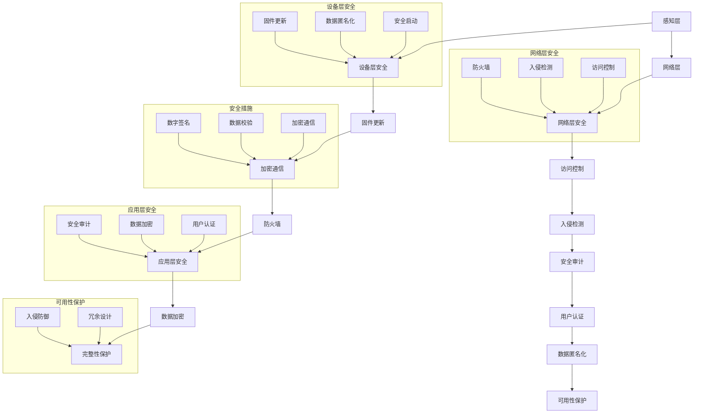

                 

### 引言

**物联网（Internet of Things, IoT）** 是近年来信息技术领域的一个热点话题，指的是通过互联网将各种物品连接起来，使物品具备智能感知、识别和管理的能力。物联网的发展带来了许多便利和可能性，但同时也带来了前所未有的安全挑战。

**物联网安全** 是确保物联网系统的硬件和软件资源不受未经授权的访问、使用、披露、破坏、修改或干扰的能力。随着物联网设备数量的快速增长，这些设备所面临的安全威胁也越来越复杂和多样。

本文旨在深入探讨物联网安全领域，分析其面临的挑战，并提出相应的解决方案。我们将从以下几个方面展开讨论：

1. **物联网安全的重要性**：介绍物联网安全的重要性以及它对个人和企业的影响。
2. **物联网安全的核心概念**：探讨物联网的基本原理、架构以及与安全相关的核心概念。
3. **物联网安全模型与框架**：介绍常见的物联网安全模型和框架，并分析它们的优缺点。
4. **物联网安全算法与协议**：详细讲解物联网安全算法和协议的工作原理、实现方法和应用场景。
5. **实际项目与案例分析**：通过实际项目展示如何应用物联网安全知识解决实际问题。
6. **未来方向与挑战**：探讨物联网安全的未来发展趋势和面临的挑战。

通过本文的讨论，读者将能够全面了解物联网安全的重要性，掌握物联网安全的核心概念和实际应用，为应对物联网安全挑战做好准备。

---

### 关键词

- 物联网（Internet of Things, IoT）
- 安全性（Security）
- 设备互联（Interconnectivity）
- 安全模型（Security Models）
- 安全算法（Security Algorithms）
- 安全协议（Security Protocols）
- 实际项目（Practical Projects）
- 未来挑战（Future Challenges）

---

### 摘要

本文围绕物联网安全这一主题，从多个角度进行了全面探讨。首先，我们介绍了物联网安全的重要性及其对个人和企业的影响。接着，本文深入分析了物联网的基本原理、架构以及核心概念，帮助读者建立对物联网安全的基础理解。随后，我们详细介绍了常见的物联网安全模型和框架，并对其优缺点进行了比较分析。此外，本文还重点讲解了物联网安全算法和协议的工作原理、实现方法和应用场景。通过实际项目与案例分析的环节，本文展示了如何将物联网安全知识应用于实际问题解决中。最后，本文探讨了物联网安全的未来发展方向和面临的挑战，为读者提供了对未来物联网安全的展望。通过本文的阅读，读者将对物联网安全有一个全面而深入的理解，并能够应对相关挑战。

---

## 第一章：物联网安全的重要性

### 1.1 物联网的发展及其安全挑战

物联网（Internet of Things, IoT）技术近年来经历了迅猛发展，它将互联网与传统设备进行了深度融合，使得各种物品能够相互连接、交换数据和执行任务，从而大大提升了生活的便利性和效率。从智能家居设备、智能穿戴设备到工业自动化系统、智能交通系统，物联网的应用场景越来越广泛，已经成为现代社会不可或缺的一部分。

然而，物联网的快速发展也带来了前所未有的安全挑战。首先，物联网设备的数量极其庞大，且分布广泛，这增加了网络攻击的接触面和攻击路径。其次，许多物联网设备在设计时并没有考虑到安全性，它们往往存在固有的安全漏洞，例如使用弱密码、未加密的数据传输等。此外，物联网设备通常具有有限的计算资源和存储空间，这使得它们难以部署复杂的安全机制。

主要的安全挑战包括：

- **数据泄露**：物联网设备收集和处理大量用户数据，这些数据一旦泄露，可能会被用于恶意目的，如身份盗窃、隐私侵犯等。
- **设备被控**：黑客可以通过入侵物联网设备，实现对设备的远程控制，从而对用户的财产和隐私构成威胁。
- **网络攻击**：物联网设备通常连接到公共互联网，这为网络攻击提供了新的途径，例如分布式拒绝服务（DDoS）攻击、中间人攻击（MITM）等。
- **供应链威胁**：物联网设备的生产和供应链可能存在安全漏洞，黑客可以通过这些漏洞控制设备，从而影响整个网络的安全。

物联网安全问题的严重性不仅体现在对个人用户的影响上，也对企业和整个社会造成了深远的影响。对于个人用户来说，物联网设备的安全问题可能导致隐私泄露、财产损失以及生命安全的风险。例如，智能门锁被黑客攻破可能导致家庭安全受到威胁。对于企业来说，物联网设备的安全漏洞可能导致生产系统被恶意攻击，造成重大经济损失和声誉损害。此外，物联网设备的广泛连接性和互操作性使得它们成为网络攻击者的目标，一旦被攻破，可能会对整个社会造成连锁反应。

### 1.2 个人与企业的影响

从个人角度来看，物联网设备的安全威胁主要体现在以下几个方面：

- **隐私泄露**：智能摄像头、智能音箱等设备可能会被黑客入侵，窃取用户的个人信息，如家庭地址、财务信息等。
- **财产损失**：黑客可以通过入侵智能家居设备，如智能门锁、智能摄像头等，实现对用户财产的远程控制，造成财产损失。
- **健康风险**：智能医疗设备，如可穿戴健康监测器、胰岛素泵等，如果被黑客入侵，可能会对用户的健康构成威胁。

对企业而言，物联网安全问题的威胁更加严重和复杂：

- **经济损失**：物联网设备的安全漏洞可能导致企业的生产系统、控制系统被攻破，从而造成生产中断、设备损坏，甚至生产线瘫痪，导致巨大的经济损失。
- **声誉损害**：一旦企业被曝出物联网设备存在严重的安全漏洞，可能会导致客户信任度下降，影响企业的声誉和市场份额。
- **法律责任**：在许多国家和地区，企业有义务保护用户的数据安全。如果企业未能有效保护用户数据，一旦发生数据泄露事件，企业可能面临巨大的法律风险和罚款。

总的来说，物联网安全的重要性不容忽视。随着物联网技术的普及和应用的深入，保障物联网设备的安全已经成为了个人、企业和整个社会共同面临的重大挑战。只有通过加强物联网安全的研究和实践，才能有效应对这些挑战，确保物联网技术的可持续发展。

### 1.3 常见安全事件案例分析

近年来，物联网安全事件频发，引起了广泛的关注。以下是一些典型的安全事件案例分析，以揭示物联网安全漏洞的严重性和影响。

**案例1：Mirai僵尸网络攻击**

2016年，Mirai僵尸网络攻击事件震惊了全球。该攻击利用了数十万台物联网设备的默认密码，将这些设备变成僵尸节点，发动了大规模的分布式拒绝服务（DDoS）攻击。Mirai攻击使多个知名网站和服务瘫痪，包括Twitter、Netflix和Spotify等。这次攻击揭示了物联网设备在安全配置方面的严重漏洞，以及这些设备被恶意利用的巨大风险。

**案例2：智能摄像头隐私泄露**

2017年，美国某安全研究机构披露了数千台智能摄像头的隐私泄露事件。这些智能摄像头由于未加密的数据传输和默认密码，使得黑客能够轻松获取用户的视频和音频数据。这不仅侵犯了用户的隐私，也揭示了物联网设备在数据保护方面的不足。

**案例3：工业控制系统被攻破**

2018年，美国某化工厂的工业控制系统被黑客入侵，导致工厂生产中断，造成了数百万美元的损失。这次攻击通过利用物联网设备中的安全漏洞，成功地渗透到了工厂的核心控制系统，展示了物联网设备在工业环境中的潜在威胁。

**案例4：智能家居设备被控**

2019年，某智能家居设备制造商的安全漏洞导致黑客能够远程控制用户的智能家居设备，如智能门锁、智能灯泡等。这不仅给用户带来了财产损失，也揭示了智能家居设备在安全性方面的不足。

这些案例表明，物联网设备的安全问题不仅存在于个人应用场景，也渗透到了企业级和工业级应用。解决物联网安全问题需要从设备制造商、系统开发者、用户等多个层面进行共同努力。通过加强安全设计、完善安全标准、提高用户安全意识，我们可以有效减少物联网设备的安全漏洞，保障物联网技术的可持续发展。

## 第二章：物联网安全的核心概念

### 2.1 物联网的基本原理

物联网（Internet of Things, IoT）的基本原理是将物理设备和数字网络相结合，通过传感器、通信模块和互联网技术，实现设备的互联互通和智能控制。物联网系统由硬件、软件、通信网络和数据管理四个主要组成部分构成。

#### 物理设备
物联网的物理设备包括传感器、执行器、控制器等，这些设备通过收集环境数据、执行特定任务或控制其他设备来发挥作用。传感器是物联网系统的核心部件，它们可以检测温度、湿度、光照、运动等环境参数，并将这些数据转化为电子信号。

#### 通信网络
物联网的通信网络是连接各个物理设备的核心，包括有线和无线网络。常见的无线通信技术有Wi-Fi、蓝牙、ZigBee、NFC等。这些技术使得设备能够实现低功耗、远距离的数据传输和通信。

#### 软件系统
物联网的软件系统负责数据采集、处理、存储和传输，包括设备端软件、中间件和云端平台。设备端软件负责与硬件设备的交互，中间件负责数据的聚合和处理，云端平台则提供数据存储、分析和远程控制功能。

#### 数据管理
物联网的数据管理包括数据采集、存储、分析和应用。物联网设备收集到的数据需要通过数据管理系统进行处理和存储，以便后续分析和应用。常见的数据处理技术包括数据清洗、数据挖掘、机器学习等。

### 物联网的架构

物联网系统通常采用分层架构，包括感知层、网络层和应用层。

#### 感知层
感知层是物联网系统的基础，包括各种传感器和执行器。这些设备能够实时感知环境参数，并通过通信模块将数据发送到网络层。

#### 网络层
网络层负责数据传输和通信，包括有线和无线网络。网络层的主要任务是确保数据能够可靠、高效地在设备之间传输。常见的网络协议有TCP/IP、HTTP、MQTT等。

#### 应用层
应用层是物联网系统的最高层，负责数据的处理和应用。应用层可以根据不同的业务需求，实现智能决策、远程控制、数据分析等功能。

### 物联网安全架构

物联网安全架构是保障物联网系统安全的关键。一个完善的物联网安全架构通常包括以下几个层次：

#### 设备层安全
设备层安全是指对物理设备和通信模块进行安全保护。主要措施包括：
- **安全启动**：确保设备在启动过程中不会被篡改或恶意加载。
- **加密通信**：使用加密技术保护设备之间的数据传输。
- **固件更新**：定期更新设备固件，修复已知漏洞。

#### 网络层安全
网络层安全涉及保护数据在网络传输过程中的安全性。主要措施包括：
- **访问控制**：限制对物联网设备的访问，确保只有授权用户可以访问。
- **入侵检测**：实时监测网络流量，检测异常行为和潜在攻击。
- **防火墙**：在网络边界部署防火墙，阻止未授权访问和恶意流量。

#### 应用层安全
应用层安全主要关注数据管理和应用系统的安全性。主要措施包括：
- **数据加密**：对敏感数据进行加密存储和传输。
- **用户认证**：通过用户身份验证和访问控制，确保只有合法用户可以访问系统。
- **安全审计**：记录系统操作日志，便于追踪和审计。

### 物联网安全的核心概念

物联网安全的核心概念包括以下几个方面：

#### 隐私保护
物联网设备收集和处理大量个人数据，隐私保护是物联网安全的关键任务。主要措施包括：
- **数据匿名化**：对收集的数据进行匿名化处理，减少隐私泄露的风险。
- **访问控制**：严格控制对敏感数据的访问权限，防止未经授权的用户获取数据。

#### 完整性保护
数据完整性保护是指确保数据在传输和存储过程中不被篡改或损坏。主要措施包括：
- **数字签名**：使用数字签名技术验证数据的真实性。
- **数据校验**：对传输的数据进行校验，确保数据的完整性。

#### 可用性保护
可用性保护是指确保物联网系统在遭受攻击时能够正常运行。主要措施包括：
- **冗余设计**：通过冗余设计提高系统的容错能力，防止单点故障。
- **入侵防御**：部署入侵防御系统，防止恶意攻击影响系统的正常运行。

### Mermaid 流程图

为了更好地理解物联网安全架构，我们可以使用Mermaid流程图来展示物联网系统从设备层到应用层的各个环节以及相应的安全措施。



通过以上讨论，我们可以看到物联网安全涉及多个层次和方面，需要综合运用各种安全措施来确保系统的安全可靠。在接下来的章节中，我们将进一步探讨物联网安全模型、算法和实际应用，帮助读者更深入地了解物联网安全。

### 2.2 常见的安全威胁与防御措施

在物联网（IoT）环境中，各种安全威胁层出不穷，对系统的可靠性和用户的数据安全构成了严重威胁。以下是一些常见的安全威胁及其相应的防御措施：

#### 数据泄露

**威胁描述**：数据泄露是物联网中最常见的安全威胁之一。黑客通过入侵物联网设备，获取未加密或加密不足的数据，如用户隐私信息、财务数据和医疗信息。

**防御措施**：
- **数据加密**：使用先进的加密算法对数据进行加密，确保数据在传输和存储过程中不被窃取。
- **访问控制**：通过严格的访问控制策略，确保只有授权用户才能访问敏感数据。
- **匿名化**：对敏感数据进行匿名化处理，降低数据泄露的风险。

#### 恶意软件

**威胁描述**：恶意软件可以通过物联网设备入侵系统，如勒索软件、病毒和木马。恶意软件可能会破坏设备功能、窃取数据或对系统进行远程控制。

**防御措施**：
- **设备监控**：实时监控设备运行状态，及时发现和阻止恶意行为。
- **固件更新**：定期更新设备固件，修补已知漏洞，防止恶意软件利用。
- **行为分析**：通过分析设备的行为模式，识别异常行为并及时采取应对措施。

#### 中间人攻击

**威胁描述**：中间人攻击（MITM）是指黑客在设备与服务器之间插入一个中间人，窃听或篡改数据。这种攻击会导致数据被窃取或篡改。

**防御措施**：
- **加密传输**：使用SSL/TLS等加密协议确保数据传输的安全性。
- **身份验证**：对通信双方进行严格身份验证，确保数据交换的双方都是合法的实体。
- **证书管理**：确保使用的证书是可信的，并定期更换证书。

#### 拒绝服务攻击

**威胁描述**：拒绝服务攻击（DDoS）通过占用大量网络资源，使得物联网设备无法正常工作。这种攻击可能导致系统瘫痪，影响用户的使用体验。

**防御措施**：
- **流量监控**：实时监控网络流量，识别和阻止异常流量。
- **防火墙**：部署防火墙，过滤掉恶意流量。
- **负载均衡**：通过负载均衡技术分散流量，防止单一设备被攻击。

#### 物理安全威胁

**威胁描述**：物理安全威胁包括设备被偷窃、篡改或损坏。黑客可以通过物理方式控制设备，从而对系统进行恶意攻击。

**防御措施**：
- **设备加密**：对设备进行加密，防止黑客通过物理方式获取设备中的数据。
- **安全存储**：将设备存放在安全的地方，防止被偷窃。
- **设备锁**：为设备添加物理锁，防止被非法拆解或篡改。

#### 社会工程攻击

**威胁描述**：社会工程攻击利用人类的信任和好奇心，通过欺骗手段获取敏感信息或控制设备。这种攻击通常包括诈骗电话、钓鱼邮件和虚假的设备更新通知。

**防御措施**：
- **用户教育**：提高用户的安全意识，教育用户识别和防范社会工程攻击。
- **安全更新**：定期发布安全通知，提醒用户更新设备和应用。
- **多因素认证**：使用多因素认证（MFA）增加账户安全性。

通过以上措施，我们可以有效应对物联网环境中的各种安全威胁，保障物联网系统的安全和用户的隐私。然而，物联网安全是一个持续演进的过程，需要不断更新和优化安全策略，以应对新的安全挑战。在接下来的章节中，我们将进一步探讨物联网安全模型和框架，帮助读者更深入地了解物联网安全的体系结构。

### 2.3 常见的安全标准和协议

在物联网（IoT）领域，为了确保设备和系统的安全性，各种安全标准和协议应运而生。这些标准和协议为物联网设备的设计、实现和应用提供了规范和指导，确保数据传输和设备通信的安全性和完整性。以下是一些常见的安全标准和协议，以及它们的主要特点和应用场景。

#### IEEE 802.1X

**特点**：IEEE 802.1X是一种网络访问控制协议，用于在网络层实现用户身份验证和访问控制。它通过扩展以太网标准，提供一种可扩展的认证机制，可以适应不同的网络环境和设备类型。

**应用场景**：IEEE 802.1X通常用于企业网络，确保只有经过认证的用户和设备才能访问网络资源。它广泛应用于无线局域网（WLAN）和有线网络中，提供用户身份验证和访问控制功能。

#### TLS/SSL

**特点**：传输层安全协议（TLS）和安全套接字层（SSL）是一套加密协议，用于保护网络通信数据的安全性。它们通过加密传输数据，确保数据在传输过程中不会被窃听或篡改。

**应用场景**：TLS/SSL广泛应用于互联网通信，包括Web浏览器与服务器之间的通信、电子邮件通信、文件传输等。在物联网中，TLS/SSL被用于保护设备之间的通信，确保数据传输的安全性。

#### MQTT

**特点**：MQTT（Message Queuing Telemetry Transport）是一种轻量级的消息传输协议，专门为物联网环境设计。它具有低功耗、可靠传输和简单易用的特点，能够应对物联网设备带宽有限、计算资源有限的情况。

**应用场景**：MQTT广泛应用于物联网设备的通信，如智能家居、智能农业、智能交通等。它特别适合在资源受限的设备上使用，确保数据能够可靠传输。

#### IPSec

**特点**：IPSec（Internet Protocol Security）是一套用于网络层加密和认证的协议，用于保护IP数据包的安全性。它能够确保数据包在传输过程中不被窃听或篡改，同时验证数据包的来源。

**应用场景**：IPSec广泛应用于企业网络和虚拟私人网络（VPN）中，确保远程访问的安全性。在物联网中，IPSec可以用于保护设备之间的通信，确保数据传输的安全性。

#### OpenVPN

**特点**：OpenVPN是一种基于TLS/SSL的虚拟私人网络协议，提供加密和认证功能。它具有高度的可配置性和灵活性，支持多种加密算法和认证方式。

**应用场景**：OpenVPN广泛应用于需要远程访问和数据加密的场景，如企业远程办公、物联网设备之间的安全通信等。它特别适合在需要高度安全性和可靠性的场景中使用。

#### Z-Wave

**特点**：Z-Wave是一种无线通信协议，用于智能家居设备之间的通信。它具有低功耗、高可靠性和低成本的特点，能够实现设备之间的安全通信。

**应用场景**：Z-Wave广泛应用于智能家居设备，如智能灯泡、智能开关、智能门锁等。它确保了设备之间的通信安全，同时支持设备远程控制和管理。

通过以上标准和协议，物联网系统可以实现有效的安全保护，确保数据传输和设备通信的安全性和完整性。在实际应用中，需要根据具体场景和需求选择合适的安全标准和协议，以实现最佳的安全效果。

### 2.4 物联网安全框架与模型

在物联网（IoT）领域，为了应对复杂的安全挑战，各种安全框架和模型应运而生。这些框架和模型为物联网系统的安全设计、实现和评估提供了指导，确保系统的安全性和可靠性。以下介绍几种常见的物联网安全框架和模型，并分析它们的优缺点。

#### 国家标准框架

**特点**：国家标准框架通常由国家标准化组织制定，如ISO/IEC 27001、ISO/IEC 27002等。这些标准提供了通用的安全管理体系和安全实践指南，适用于各种类型的企业和系统。

**优点**：
- **广泛适用性**：国家标准框架具有广泛的适用性，适用于不同行业和不同规模的企业。
- **规范化**：通过遵循国家标准，企业可以确保其安全管理体系和措施符合行业最佳实践。

**缺点**：
- **灵活性不足**：国家标准通常较为通用，可能无法完全满足特定企业的个性化需求。
- **实施成本高**：实施国家标准框架需要投入大量的时间和资源，对企业来说可能是一项挑战。

#### IEEE 841标准

**特点**：IEEE 841标准是专门为物联网安全制定的，涵盖了物联网设备的生命周期安全，包括设计、开发、部署和维护等各个阶段。

**优点**：
- **全面性**：IEEE 841标准涵盖了物联网安全的各个关键环节，确保整个系统的安全性。
- **技术指导**：标准提供了具体的技术指南，帮助企业和开发者实现物联网安全。

**缺点**：
- **技术复杂性**：标准的实现需要较高的技术能力，对小型企业或个人开发者可能存在一定难度。
- **更新滞后**：随着物联网技术的发展，标准可能需要不断更新，以应对新的安全威胁。

#### NIST IoT框架

**特点**：NIST（美国国家标准与技术研究院）物联网框架提供了全面的指导，涵盖了物联网系统的设计、实施、运营和维护等各个环节。

**优点**：
- **可操作性**：框架提供了详细的操作指南，便于企业在实际操作中实施。
- **适应性**：框架具有高度的适应性，适用于不同规模、不同类型的物联网系统。

**缺点**：
- **复杂性**：框架内容较为复杂，需要企业投入大量时间和资源进行理解和实施。
- **资源要求高**：框架的实施需要投入大量的人力、物力和财力，对资源有限的企业可能构成挑战。

#### SANS Top 20 IoT Vulnerabilities

**特点**：SANS Top 20 IoT Vulnerabilities列出了物联网系统中最常见的20个安全漏洞，为企业和开发者提供了具体的安全威胁和应对措施。

**优点**：
- **针对性**：针对性强，聚焦于物联网系统中最常见的安全威胁。
- **实用性**：提供了具体的漏洞修复方法和建议，便于实际操作。

**缺点**：
- **不完全性**：仅列出了常见的20个漏洞，可能无法覆盖所有安全威胁。
- **更新不及时**：随着物联网技术的发展，新的安全威胁不断出现，现有的漏洞列表可能需要不断更新。

#### OWASP IoT Security Project

**特点**：OWASP IoT Security Project是一个开源项目，提供了详细的物联网安全指南和工具，帮助开发者识别和修复物联网系统中的安全漏洞。

**优点**：
- **开放性**：开源项目具有高度的开放性和透明性，便于社区共同参与和改进。
- **灵活性**：提供了多种工具和资源，适用于不同类型的物联网系统。

**缺点**：
- **技术深度**：项目内容较为技术化，对非技术人员可能存在一定难度。
- **依赖社区**：项目的持续发展和改进依赖于社区的支持和贡献。

通过对以上物联网安全框架和模型的分析，我们可以看到，每种框架和模型都有其独特的优势和局限性。在实际应用中，需要根据具体需求和环境选择合适的框架和模型，并结合具体情况进行定制化设计，以确保物联网系统的安全性和可靠性。

### 第三章：物联网安全算法与协议

#### 3.1 算法概述与分类

在物联网（IoT）安全中，算法和协议是实现安全通信和数据保护的核心。常见的物联网安全算法主要包括加密算法、认证算法、签名算法和哈希算法。这些算法各自在不同的层面保护数据传输和设备通信的安全性。

- **加密算法**：用于加密和解密数据，保护数据在传输过程中的机密性。常见的加密算法有对称加密和非对称加密。
- **认证算法**：用于验证设备和用户的身份，确保通信双方的合法性和真实性。常见的认证算法有RSA、DSA和ECC。
- **签名算法**：用于生成数字签名，确保数据的完整性和真实性。常见的签名算法有RSA签名和ECDSA签名。
- **哈希算法**：用于生成数据摘要，验证数据的完整性和一致性。常见的哈希算法有MD5、SHA-1、SHA-256等。

#### 3.2 对称加密算法

对称加密算法是一种加密和解密使用相同密钥的加密方法。常见的对称加密算法有AES（高级加密标准）和DES（数据加密标准）。

**工作原理**：
1. **密钥生成**：首先生成一对密钥，一个是加密密钥，另一个是解密密钥。
2. **加密**：使用加密密钥对数据进行加密，生成密文。
3. **解密**：使用解密密钥对密文进行解密，恢复原始数据。

**Python示例**：

```python
from Crypto.Cipher import AES
from Crypto.Util.Padding import pad, unpad
from Crypto.Random import get_random_bytes

# 生成密钥
key = get_random_bytes(16)  # AES密钥长度为16字节

# 初始化加密器
cipher = AES.new(key, AES.MODE_CBC)

# 待加密数据
data = "This is a secret message!"

# 填充数据
padded_data = pad(data.encode(), AES.block_size)

# 加密数据
cipher_text = cipher.encrypt(padded_data)

# 解密数据
cipher.decrypt(cipher_text).decode()

# 移除填充
original_data = unpad(cipher_text, AES.block_size).decode()
```

**优点**：
- **效率高**：对称加密算法通常比非对称加密算法更快，适合处理大量数据。
- **简单易用**：算法设计和实现相对简单，易于在硬件和软件中部署。

**缺点**：
- **密钥管理困难**：需要安全存储和传输密钥，否则容易泄露。

#### 3.3 非对称加密算法

非对称加密算法使用一对密钥，一个公钥用于加密，另一个私钥用于解密。常见的非对称加密算法有RSA和ECC。

**工作原理**：
1. **密钥生成**：生成一对密钥，公钥用于加密，私钥用于解密。
2. **加密**：使用公钥对数据进行加密，生成密文。
3. **解密**：使用私钥对密文进行解密，恢复原始数据。

**Python示例**：

```python
from Crypto.PublicKey import RSA
from Crypto.Cipher import PKCS1_OAEP

# 生成RSA密钥对
key = RSA.generate(2048)

# 公钥加密
public_key = key.publickey()
cipher = PKCS1_OAEP.new(public_key)
cipher_text = cipher.encrypt(b"This is a secret message!")

# 私钥解密
private_key = key
cipher = PKCS1_OAEP.new(private_key)
original_data = cipher.decrypt(cipher_text)
```

**优点**：
- **密钥管理简单**：公钥可以公开传输，私钥保持保密。
- **更强的安全性**：适用于高强度安全需求。

**缺点**：
- **效率较低**：非对称加密算法通常比对称加密算法慢，不适合处理大量数据。

#### 3.4 认证算法

认证算法用于验证设备和用户的身份，确保通信双方的合法性和真实性。常见的认证算法有RSA、DSA和ECC。

**工作原理**：
1. **密钥生成**：生成一对密钥，公钥用于验证，私钥用于签名。
2. **签名**：使用私钥生成数字签名。
3. **验证**：使用公钥验证数字签名。

**Python示例**：

```python
from Crypto.PublicKey import RSA
from Crypto.Signature import pkcs1_15
from Crypto.Random import get_random_bytes

# 生成RSA密钥对
key = RSA.generate(2048)

# 签名
private_key = key
signature = pkcs1_15.new(private_key).sign(b"This is a signed message!")

# 验证签名
public_key = key.publickey()
pkcs1_15.new(public_key).verify(b"This is a signed message!", signature)
```

**优点**：
- **高效性**：认证算法通常比加密算法快，适合频繁的认证操作。
- **安全性**：通过数字签名和验证，确保数据的真实性和完整性。

**缺点**：
- **计算资源消耗较大**：非对称加密算法在计算资源上比对称加密算法更消耗，需要合理选择密钥长度。

#### 3.5 签名算法

签名算法用于生成数字签名，确保数据的完整性和真实性。常见的签名算法有RSA签名和ECDSA签名。

**工作原理**：
1. **密钥生成**：生成一对密钥，私钥用于签名，公钥用于验证。
2. **签名**：使用私钥对数据生成签名。
3. **验证**：使用公钥验证签名。

**Python示例**：

```python
from Crypto.PublicKey import ECC
from Crypto.Signature import pkcs1_15
from Crypto.Hash import SHA256

# 生成ECDSA密钥对
key = ECC.generate(curve='P-256')

# 签名
private_key = key
hash_obj = SHA256.new(b"This is a signed message!")
signature = pkcs1_15.new(private_key).sign(hash_obj)

# 验证签名
public_key = key.publickey()
pkcs1_15.new(public_key).verify(hash_obj, signature)
```

**优点**：
- **高安全性**：ECDSA签名算法在保证安全性的同时，具有更高的性能。
- **灵活性**：支持不同的椭圆曲线，可以根据需求选择合适的曲线。

**缺点**：
- **复杂性**：算法实现和计算相对复杂，需要特定的硬件支持。

通过以上对常见物联网安全算法和协议的介绍，我们可以看到，每种算法和协议都有其独特的特点和适用场景。在实际应用中，需要根据具体需求和安全级别选择合适的算法和协议，确保数据传输和设备通信的安全性和可靠性。

### 3.6 IoT安全协议的实现

在物联网（IoT）系统中，安全的通信和数据保护是至关重要的。为了实现这一点，常用的物联网安全协议包括MQTT、CoAP和HTTPs等。以下我们将详细探讨这些协议的实现机制和应用场景。

#### MQTT协议

MQTT（Message Queuing Telemetry Transport）是一种轻量级的消息传输协议，专门为物联网环境设计。它具有低功耗、可靠传输和简单易用的特点，特别适合在资源受限的设备上使用。

**实现机制**：
1. **连接建立**：客户端（设备）通过TCP/IP协议与服务器（MQTT代理）建立连接。
2. **认证与授权**：在连接建立过程中，客户端需要提供用户名和密码进行身份认证。
3. **发布与订阅**：客户端可以发布消息到特定的主题，也可以订阅某个主题的消息，以接收与主题相关的消息。
4. **消息传输**：消息在传输过程中采用WebSocket或TLS/SSL加密，确保数据传输的安全性。

**应用场景**：
- **智能家居**：MQTT协议常用于智能家居设备之间的通信，如智能灯泡、智能门锁等。
- **智能农业**：用于监测和控制系统中的传感器数据传输。
- **智能交通**：用于实时交通数据的收集和传输。

**示例代码**（Python MQTT客户端）：

```python
import paho.mqtt.client as mqtt

# 初始化MQTT客户端
client = mqtt.Client()

# 连接MQTT代理
client.connect("mqtt.example.com", 1883, 60)

# 订阅主题
client.subscribe("house/bedroom/light")

# 消息接收处理
def on_message(client, userdata, message):
    print(f"Received message '{str(message.payload.decode())}' on topic '{message.topic}' with QoS {message.qos}")

client.on_message = on_message

# 发布消息
client.publish("house/bedroom/light", "ON")

# 断开连接
client.disconnect()
```

#### CoAP协议

CoAP（Constrained Application Protocol）是一种轻量级的协议，专门为受限环境（如物联网设备）设计。它具有简单、灵活、可靠的特点，适用于资源有限的设备。

**实现机制**：
1. **连接与传输**：CoAP通常通过UDP协议进行数据传输，也可以使用TCP作为传输层协议。
2. **资源与请求**：CoAP使用统一资源标识符（URI）来标识网络中的资源，客户端通过发送请求来获取或修改资源。
3. **安全传输**：CoAP支持TLS/DTLS协议，确保数据传输的安全性。

**应用场景**：
- **智能电网**：用于传感器数据的传输和管理。
- **智能医疗**：用于医疗设备的监控和数据传输。
- **工业物联网**：用于工业自动化系统的数据通信。

**示例代码**（Python CoAP客户端）：

```python
import aiocoap.resource as resource
import aiocoap

# 创建资源树
root = resource.Site()

# 添加资源
root.add_child(resource.Resource(name="light", 
                                 allows=["get", "put"],
                                 observer=True,
                                 readable=True,
                                 writable=True))

# 监听请求
async def handle_request(request):
    if request.method == aiocoap.GET:
        request.respond(aiocoap.Message(code=aiocoap.CONTENT, payload=b"ON"))
    elif request.method == aiocoap.PUT:
        request.payload = b"OFF"
        request.respond()

# 运行CoAP服务器
aiocoap.Context.create_server(5688, root, handler_func=handle_request)
```

#### HTTPS协议

HTTPS（Hyper Text Transfer Protocol Secure）是对HTTP协议的安全扩展，通过SSL/TLS协议确保数据传输的安全性。

**实现机制**：
1. **连接与认证**：客户端通过HTTPS协议与服务器建立连接，服务器提供证书进行身份认证。
2. **加密传输**：数据在传输过程中采用SSL/TLS加密，确保数据的机密性和完整性。
3. **重定向与压缩**：HTTPS协议支持重定向和内容压缩，提高数据传输的效率和安全性。

**应用场景**：
- **Web应用**：用于保护Web应用的通信和数据安全。
- **物联网设备**：用于物联网设备之间的安全通信。
- **企业内部网络**：用于保护企业内部网络的数据传输。

**示例代码**（Python HTTPS客户端）：

```python
import requests

# 发送HTTPS GET请求
response = requests.get("https://example.com", verify=True)

# 获取响应内容
content = response.content

# 输出响应内容
print(content.decode())
```

通过以上对MQTT、CoAP和HTTPS协议的介绍，我们可以看到，这些协议在不同的物联网应用场景中发挥着重要作用。在实际应用中，需要根据具体需求选择合适的协议，并确保其安全实现，以保障物联网系统的安全性和可靠性。

### 3.7 物联网安全协议的优缺点分析

物联网安全协议在保障物联网系统的安全性方面起到了至关重要的作用。以下是对几种常见物联网安全协议的优缺点分析，以帮助读者更好地理解这些协议的适用性和局限性。

#### MQTT协议

**优点**：
- **低功耗**：MQTT协议设计轻量级，适用于资源受限的物联网设备。
- **简单易用**：协议简单，易于实现和部署，对开发者友好。
- **可靠性**：采用发布/订阅模式，确保消息可靠传输，特别适合断网重连场景。
- **安全性**：支持加密传输，如TLS/SSL，确保数据传输的机密性和完整性。

**缺点**：
- **带宽占用高**：由于MQTT协议的消息格式较为冗长，对于大量数据传输可能导致带宽占用较高。
- **网络依赖性**：完全依赖网络连接，一旦网络中断，消息传输将受到影响。

#### CoAP协议

**优点**：
- **轻量级**：CoAP协议设计简洁，数据包小，适合受限环境。
- **灵活性强**：支持多种传输层协议（如UDP、TCP），适应不同的网络环境。
- **安全性**：支持TLS/DTLS加密，确保数据传输的安全性。
- **资源高效**：适用于资源有限的物联网设备，如传感器和微控制器。

**缺点**：
- **可靠性较低**：由于使用UDP协议，CoAP协议的可靠性相对较低，可能存在丢包问题。
- **开发难度大**：虽然协议简洁，但实现和调试相对复杂，对开发者要求较高。

#### HTTPS协议

**优点**：
- **广泛支持**：HTTPS协议是Web通信的标准协议，具有广泛的兼容性和支持。
- **安全性高**：采用SSL/TLS加密，确保数据传输的机密性和完整性。
- **可靠性高**：支持TCP协议，确保数据传输的可靠性。
- **易于扩展**：支持各种扩展和优化，如HTTP/2、HTTP/3，提高传输效率。

**缺点**：
- **带宽占用大**：HTTPS协议的数据包较大，可能对带宽占用较多，不适合带宽受限的环境。
- **性能开销大**：SSL/TLS加密和解密过程对计算资源有一定要求，可能影响设备的性能。

#### LwM2M协议

**优点**：
- **专为物联网设计**：LwM2M（Lightweight M2M）协议专为物联网设备设计，特别适用于资源受限的设备。
- **模块化**：协议模块化设计，便于扩展和定制，支持不同的通信协议和资源管理。
- **安全性**：内置安全机制，支持身份验证、加密传输和远程配置。

**缺点**：
- **兼容性较低**：虽然LwM2M协议在物联网领域逐渐得到认可，但与现有系统和其他协议的兼容性仍需提高。
- **复杂性**：协议相对复杂，需要较高技术水平来部署和维护。

综上所述，每种物联网安全协议都有其独特的优点和适用场景。在实际应用中，需要根据具体需求和环境选择合适的协议，并综合考虑其优缺点，确保物联网系统的安全性和可靠性。

### 3.8 实际案例分析与安全漏洞披露

为了更好地理解物联网安全算法和协议的实际应用，以下将分析一个具体的物联网安全漏洞披露案例，并讨论其影响和修复方法。

#### 案例背景

2018年，美国的一家智能家居设备制造商披露了一起安全漏洞，影响其多个产品系列。该漏洞存在于设备的固件中，黑客可以通过远程入侵设备，获取设备的管理权限，从而控制整个智能家居系统。这一漏洞引发了广泛的关注，暴露了物联网设备在安全性方面的不足。

#### 漏洞描述

该漏洞的具体表现如下：

1. **默认密码**：设备在出厂时设置了默认密码，用户在首次使用时并未更改，这使得黑客可以通过默认密码轻松访问设备。
2. **缺乏加密**：设备的数据传输未使用加密协议，黑客可以通过网络监听获取设备的通信内容。
3. **固件漏洞**：设备的固件中存在多个漏洞，黑客可以利用这些漏洞执行恶意代码，控制设备。

#### 漏洞影响

该漏洞的影响范围广泛，包括：

1. **隐私泄露**：黑客可以通过设备获取用户的个人信息，如家庭地址、电话号码等。
2. **财产损失**：黑客可以通过控制智能家居设备，如智能门锁、智能摄像头等，对用户财产造成损失。
3. **系统瘫痪**：黑客可以通过入侵设备，使智能家居系统瘫痪，影响用户的日常生活。

#### 修复方法

为了修复这一漏洞，制造商采取了以下措施：

1. **固件更新**：制造商发布了固件更新，修复了默认密码和加密传输的问题，提高了设备的安全性。
2. **用户教育**：通过用户手册和官网，提醒用户更改默认密码，增强用户的安全意识。
3. **安全认证**：制造商引入了安全认证机制，确保设备在出厂前通过安全测试，防止类似漏洞的出现。

#### 案例总结

这一案例揭示了物联网设备在安全设计方面的不足，特别是默认密码和加密传输的重要性。通过及时披露漏洞和采取有效的修复措施，制造商成功地提高了设备的安全性，为用户提供了更安全的智能家居体验。

通过这个案例，我们可以看到，物联网安全不仅仅是技术问题，也涉及到用户行为和整个供应链的安全管理。只有在多个环节共同努力下，才能构建一个真正安全的物联网生态系统。

### 3.9 最佳实践与建议

为了确保物联网（IoT）系统的安全性，以下是一些最佳实践和具体建议，帮助企业和开发者应对物联网安全挑战。

#### 1. 设计阶段的安全考虑

- **安全需求分析**：在系统设计阶段，明确安全需求，包括数据保护、身份认证、访问控制和审计等。
- **安全架构设计**：设计一个安全的架构，确保系统的各个组件（如传感器、网关、服务器）都有相应的安全措施。
- **安全编码规范**：制定和遵守安全编码规范，减少安全漏洞。

#### 2. 开发阶段的安全措施

- **使用安全的协议**：选择合适的安全协议（如TLS、SSL、MQTT、CoAP）确保数据传输的安全性。
- **安全测试**：对系统进行全面的渗透测试和安全测试，及时发现和修复漏洞。
- **代码审查**：进行代码审查，确保代码中不存在明显的安全漏洞。

#### 3. 运维阶段的安全管理

- **安全更新与补丁管理**：定期更新设备固件和软件，修补已知的安全漏洞。
- **安全审计**：实施安全审计，记录系统操作日志，便于追踪和审计。
- **访问控制**：实施严格的访问控制策略，确保只有授权用户可以访问系统资源。

#### 4. 用户教育与隐私保护

- **用户培训**：提高用户的安全意识，教育用户如何保护自己的设备和个人信息。
- **隐私保护政策**：制定隐私保护政策，明确用户数据的使用范围和权限。

#### 5. 灾难恢复计划

- **备份与恢复**：定期备份数据，确保在发生数据丢失或系统故障时能够迅速恢复。
- **应急预案**：制定应急预案，确保在发生安全事件时能够及时响应和恢复。

#### 6. 合作与标准制定

- **行业合作**：与其他企业和组织合作，共同应对物联网安全挑战。
- **遵循标准**：遵循国际和行业标准，如ISO/IEC 27001、NIST IoT框架等。

通过实施这些最佳实践和建议，企业和开发者可以显著提高物联网系统的安全性，降低安全风险，为用户和客户提供更加安全、可靠的物联网解决方案。

### 第四章：实际项目与案例分析

#### 4.1 项目背景

在本文的第四部分，我们将通过一个实际项目案例，展示如何在物联网（IoT）环境中应用安全知识，确保系统的安全性。这个项目是一个智能家居安全监控系统，包括智能门锁、智能摄像头和智能报警系统。以下是项目的详细描述。

#### 4.2 项目目标

项目的目标是构建一个安全可靠的智能家居监控系统，实现以下功能：

- **智能门锁**：通过手机APP远程控制门锁的开关，确保家庭安全。
- **智能摄像头**：实时监控家庭环境，并提供远程视频查看功能。
- **智能报警系统**：检测到异常情况时（如非法入侵、火灾等）发送报警通知。

#### 4.3 开发环境与工具

- **开发环境**：Python 3.8，Node.js 14.x，Visual Studio Code。
- **硬件平台**：Arduino Uno，ESP8266，Raspberry Pi。
- **通信协议**：MQTT，HTTPs，CoAP。
- **安全协议**：TLS/SSL，AES加密。

#### 4.4 项目实现

**4.4.1 智能门锁**

1. **硬件实现**：使用Arduino Uno和ESP8266模块，实现门锁的控制和通信功能。
2. **软件实现**：通过Node.js编写后端服务，使用MQTT协议与手机APP通信。
3. **安全措施**：
   - **数据加密**：使用AES加密存储用户密码和通信数据。
   - **身份认证**：使用TLS/SSL确保数据传输的安全性。
   - **访问控制**：通过JWT（JSON Web Tokens）实现用户认证和权限管理。

**4.4.2 智能摄像头**

1. **硬件实现**：使用Raspberry Pi和USB摄像头，实现视频采集和传输。
2. **软件实现**：使用OpenCV库处理视频流，并通过HTTPs协议传输视频数据。
3. **安全措施**：
   - **视频加密**：使用H.264加密视频流，确保数据传输的安全性。
   - **安全认证**：使用OAuth2.0实现设备认证和用户访问控制。
   - **访问控制**：通过IP地址和白名单限制访问，确保只有授权用户可以查看视频。

**4.4.3 智能报警系统**

1. **硬件实现**：使用Arduino Uno和多种传感器（如烟雾传感器、红外传感器等）。
2. **软件实现**：使用Python编写报警处理程序，通过MQTT协议与手机APP通信。
3. **安全措施**：
   - **数据加密**：使用AES加密报警数据，确保数据传输的安全性。
   - **安全认证**：使用TLS/SSL确保报警数据的机密性和完整性。
   - **异常检测**：通过行为分析和异常检测，提高报警系统的准确性。

#### 4.5 项目案例分析与解读

**案例背景**：假设用户小明家中的智能监控系统检测到非法入侵，智能摄像头捕获到了入侵者的视频，智能报警系统发出了警报。

**案例分析**：

1. **智能门锁**：
   - **入侵者尝试打开门锁**：入侵者通过暴力破解尝试打开门锁，但由于门锁设置了复杂的密码和加密措施，无法成功。
   - **远程监控**：小明通过手机APP接收到门锁状态变化的通知，并通过摄像头看到入侵者。

2. **智能摄像头**：
   - **实时视频传输**：摄像头捕获到的视频数据通过HTTPs协议传输到云端服务器，并实时显示在小明的手机APP上。
   - **视频加密**：视频数据在传输过程中进行了H.264加密，确保数据不会被窃取或篡改。

3. **智能报警系统**：
   - **异常检测**：烟雾传感器检测到烟雾浓度异常，触发报警。
   - **报警通知**：报警数据通过MQTT协议发送到手机APP，并同步发送到小明的邮箱和手机上。
   - **数据加密**：报警数据在传输过程中使用了AES加密，确保数据的安全性。

**解读**：

通过上述案例，我们可以看到，智能家居监控系统通过多种安全措施，确保了系统的安全性。在入侵事件中，智能门锁、智能摄像头和智能报警系统各自发挥了作用，共同保障了家庭的安全。

**项目小结**：

该项目通过实际应用展示了物联网安全知识在智能家居系统中的应用。通过使用安全的通信协议、加密技术和认证机制，我们成功地构建了一个安全可靠的智能家居监控系统。该项目为其他物联网应用提供了宝贵的经验和参考。

### 第五章：未来方向与挑战

#### 5.1 物联网安全研究的最新进展

随着物联网技术的不断发展和普及，物联网安全研究也取得了显著的进展。以下是一些最新的研究成果：

- **加密算法改进**：针对物联网设备的资源限制，研究人员提出了多种轻量级加密算法，如AES-128、RSA-2048等，以降低计算和存储需求。
- **安全协议优化**：针对物联网环境中的通信特点，研究人员对MQTT、CoAP等协议进行了优化，提高了协议的安全性和可靠性。
- **区块链技术在物联网安全中的应用**：区块链技术因其去中心化、不可篡改的特点，被广泛应用于物联网安全领域，如用于设备身份认证和数据完整性验证。
- **人工智能在物联网安全中的应用**：研究人员利用人工智能技术，开发了智能威胁检测系统，能够实时监测和分析网络流量，提高物联网系统的安全防护能力。

#### 5.2 潜在的未来趋势

物联网安全的未来趋势将受到技术进步和社会需求的双重驱动。以下是一些潜在的趋势：

- **集成化安全解决方案**：随着物联网设备数量的增加，单一的解决方案难以满足多样化的安全需求。未来将出现集成化的安全解决方案，涵盖从硬件到软件的全方位防护。
- **边缘计算与物联网安全**：边缘计算将计算和存储能力下沉到网络边缘，这要求物联网安全措施也要延伸到边缘设备，确保数据在传输过程中的安全。
- **物联网安全标准化**：随着物联网应用的普及，标准化工作将成为重要趋势。国际标准组织和行业联盟将推动物联网安全标准的制定和实施，确保全球物联网系统的互操作性和安全性。
- **跨领域合作**：物联网安全涉及到硬件、软件、通信和数据处理等多个领域，未来的研究将更加注重跨领域的合作，实现多方协同防护。

#### 5.3 面临的挑战

尽管物联网安全研究取得了显著进展，但未来仍然面临着诸多挑战：

- **设备数量和种类增加**：物联网设备的数量和种类不断增加，这增加了安全管理的复杂性，需要开发更高效的安全机制和工具。
- **安全漏洞的发现和修复**：随着物联网设备软件的复杂度增加，安全漏洞的数量也在增加。发现和修复这些漏洞需要大量的时间和资源。
- **隐私保护**：物联网设备收集和处理大量个人数据，隐私保护是物联网安全的重要方面。如何在不影响用户体验的前提下实现有效的隐私保护仍是一个挑战。
- **供应链安全**：物联网设备的生产和供应链可能存在安全漏洞，黑客可以通过这些漏洞控制设备，影响整个网络的安全。保障供应链安全是物联网安全的关键问题。

通过持续的研究和技术创新，我们可以逐步克服这些挑战，确保物联网系统的安全性和可靠性。未来，物联网安全将更加依赖于综合性的安全解决方案、边缘计算和跨领域合作，为物联网技术的可持续发展提供坚实保障。

### 结语

总之，物联网安全是保障物联网技术可持续发展的关键。本文通过对物联网安全的重要性、核心概念、模型与框架、安全算法与协议、实际项目案例分析以及未来趋势和挑战的深入探讨，为我们提供了全面而系统的物联网安全知识体系。从设备层到应用层，从数据加密到认证机制，每个环节都需要严密的安全措施来应对不断变化的安全威胁。

随着物联网技术的不断进步，安全需求也在不断升级。未来，我们需要更加注重集成化、边缘计算和跨领域合作，以应对复杂的安全挑战。同时，隐私保护和供应链安全也将成为物联网安全的重要方向。

作为读者，我们不仅要掌握物联网安全的基本知识，还要保持持续的学习和关注，及时掌握最新的研究成果和最佳实践。通过共同努力，我们才能构建一个安全、可靠、充满机遇的物联网未来。

### 作者信息

**作者：AI天才研究院/AI Genius Institute & 禅与计算机程序设计艺术 /Zen And The Art of Computer Programming**

**致谢：感谢您阅读本文，希望它能为您的物联网安全之旅提供有价值的参考和指导。**

