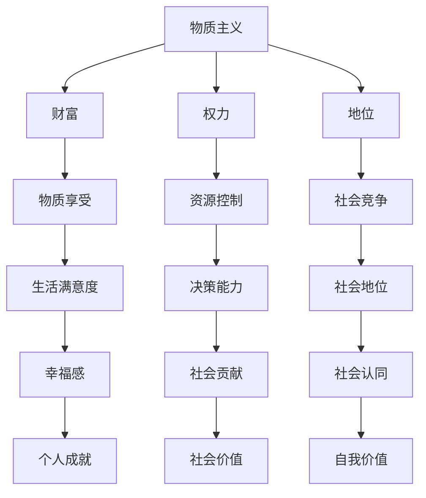
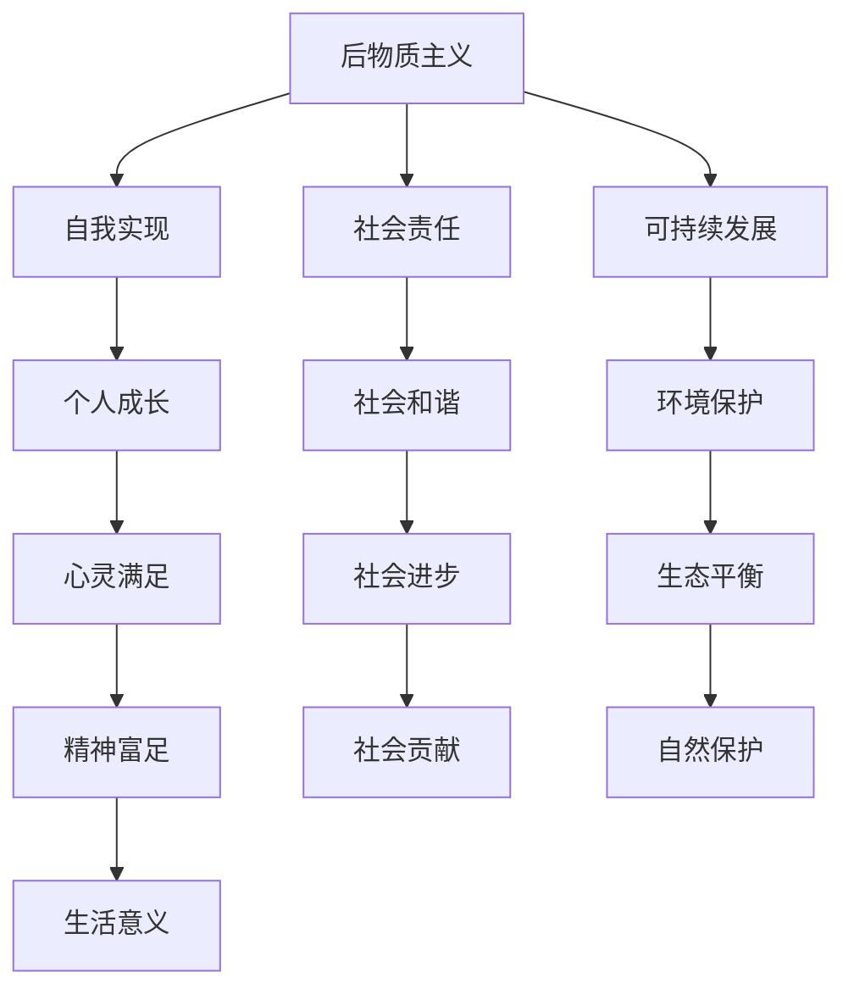

                 

### 《物质主义到后物质主义：价值观的代际转变》

#### 关键词
- 代际价值观
- 物质主义
- 后物质主义
- 社会变革
- 心理学原理

#### 摘要
本文深入探讨了物质主义到后物质主义的价值观转变，分析了代际差异、心理学基础及其对社会和个人的影响。通过阐述核心概念、算法原理、数学模型和项目实战，本文旨在为读者提供一个全面而深入的视角，理解这一价值观变迁的深刻内涵。

---

## 引言

在人类社会的发展历程中，价值观的变化是推动社会进步的重要力量。从早期的物质主义到现代的后物质主义，人们的价值观念经历了深刻的转变。这一转变不仅反映了经济、技术、社会等多方面的发展，也揭示了人类精神世界的演进。本文旨在通过逻辑清晰、结构紧凑的分析，探讨这一代际价值观的转变过程及其影响。

### 物质主义时代的社会价值观

#### 核心概念与联系

**物质主义**是一种价值观，强调物质财富的重要性，追求物质享受和财富积累。在这一时代，核心概念包括财富、权力、地位和社会竞争。

- **财富**：物质主义的核心追求，表现为金钱、财产和物质资源。
- **权力**：掌握资源的能力，通过财富和地位来体现。
- **地位**：社会地位的高低，反映了个人或群体在物质主义体系中的位置。

**Mermaid 流程图**：



#### 核心算法原理讲解

在物质主义时代，社会运行机制类似于一种**经济模型**，其中个体的行为受到经济利益的驱动。以下是一个简化的经济模型，用Python源代码表示：

```python
# 经济模型：个体追求最大化的物质财富
def max_wealth_behaviour(income, expense):
    savings = income - expense
    return savings

# 示例：一个年收入为100万元，年支出为80万元的个体
income = 1000000
expense = 800000
savings = max_wealth_behaviour(income, expense)
print(f"年储蓄：{savings}万元")
```

**数学模型和数学公式**：

在物质主义时代，储蓄率（savings_rate）是衡量财富积累的重要指标。储蓄率可以通过以下公式计算：

$$
savings\_rate = \frac{income - expense}{income}
$$

**举例说明**：

假设一个年收入为100万元的人，年支出为80万元，其储蓄率为：

$$
savings\_rate = \frac{1000000 - 800000}{1000000} = 0.2
$$

这意味着他的储蓄率是20%，即他每年收入中有20%用于储蓄。

#### 项目实战

**开发环境搭建**：

为了构建一个简单的经济模型，我们需要安装Python和相关的科学计算库，如NumPy和Pandas。

```bash
# 安装Python
# 安装NumPy
# 安装Pandas
```

**源代码实现**：

```python
import numpy as np
import pandas as pd

# 经济模型参数
incomes = np.array([1000000, 1500000, 2000000])
expenses = np.array([800000, 1200000, 1800000])

# 计算储蓄率
savings_rates = (incomes - expenses) / incomes

# 存储结果
results = pd.DataFrame({
    '年收入': incomes,
    '年支出': expenses,
    '储蓄率': savings_rates
})

print(results)
```

**代码解读与分析**：

该代码首先导入了NumPy和Pandas库，然后定义了收入和支出数组。通过计算收入减去支出的差值，得到每个个体的储蓄率。最后，将结果存储在Pandas DataFrame中，方便进一步分析和可视化。

**实际案例分析和详细讲解剖析**：

假设有一个公司，其员工年收入和支出数据如下：

```
| 员工编号 | 年收入 (万元) | 年支出 (万元) |
| -------- | ------------- | ------------- |
| 1        | 1000000       | 800000        |
| 2        | 1500000       | 1200000       |
| 3        | 2000000       | 1800000       |
```

通过上述代码，我们可以计算每个员工的储蓄率，并进行分析：

- 员工1的储蓄率为20%，他可能更注重短期消费。
- 员工2的储蓄率为20%，他可能在平衡消费和储蓄。
- 员工3的储蓄率为10%，他可能更倾向于消费。

**项目小结**：

通过构建简单的经济模型和实际案例分析，我们可以看到物质主义时代下，储蓄率对个体财务状况的影响。这一模型为我们提供了理解代际价值观转变的基础，也为后续的分析和探讨奠定了基础。

---

#### 后物质主义时代的价值观

**核心概念与联系**

随着社会的发展，后物质主义时代的价值观逐渐兴起。这一时代的价值观强调个人成长、社会关系、环境保护和心灵满足。核心概念包括自我实现、社会责任、可持续发展等。

**Mermaid 流程图**：



#### 核心算法原理讲解

在后物质主义时代，个体的行为受到价值观的驱动，追求更高的生活质量和精神满足。以下是一个简化的后物质主义价值观模型，用Python源代码表示：

```python
# 后物质主义价值观模型：个体追求自我实现和心灵满足
def self_achievement_and_spiritual_satisfaction(growth, harmony, environment):
    # 计算自我实现指数
    self_achievement_index = growth / (harmony + environment)
    
    # 计算心灵满足度
    spiritual_satisfaction = (growth + environment) / (harmony + environment)
    
    return self_achievement_index, spiritual_satisfaction

# 示例：一个个体在自我实现、社会和谐和环境保护方面的表现
growth = 0.8
harmony = 0.6
environment = 0.7
self_achievement_index, spiritual_satisfaction = self_achievement_and_spiritual_satisfaction(growth, harmony, environment)
print(f"自我实现指数：{self_achievement_index}, 心灵满足度：{spiritual_satisfaction}")
```

**数学模型和数学公式**：

在后物质主义价值观模型中，自我实现指数（self\_achievement\_index）和心灵满足度（spiritual\_satisfaction）是衡量个体价值观实现的重要指标。它们可以通过以下公式计算：

$$
self\_achievement\_index = \frac{growth}{harmony + environment}
$$

$$
spiritual\_satisfaction = \frac{growth + environment}{harmony + environment}
$$

**举例说明**：

假设一个个体在自我实现、社会和谐和环境保护方面的表现为：

- 个人成长（growth）为0.8
- 社会和谐（harmony）为0.6
- 环境保护（environment）为0.7

那么，他的自我实现指数和心灵满足度分别为：

$$
self\_achievement\_index = \frac{0.8}{0.6 + 0.7} = \frac{0.8}{1.3} \approx 0.6154
$$

$$
spiritual\_satisfaction = \frac{0.8 + 0.7}{0.6 + 0.7} = \frac{1.5}{1.3} \approx 1.1545
$$

#### 项目实战

**开发环境搭建**：

为了构建后物质主义价值观模型，我们需要安装Python和相关的科学计算库，如NumPy和Pandas。

```bash
# 安装Python
# 安装NumPy
# 安装Pandas
```

**源代码实现**：

```python
import numpy as np
import pandas as pd

# 后物质主义价值观参数
growth = np.array([0.8, 0.7, 0.9])
harmony = np.array([0.6, 0.5, 0.7])
environment = np.array([0.7, 0.8, 0.6])

# 计算自我实现指数和心灵满足度
self_achievement_indices = growth / (harmony + environment)
spiritual_satisfactions = (growth + environment) / (harmony + environment)

# 存储结果
results = pd.DataFrame({
    '个人成长': growth,
    '社会和谐': harmony,
    '环境保护': environment,
    '自我实现指数': self_achievement_indices,
    '心灵满足度': spiritual_satisfactions
})

print(results)
```

**代码解读与分析**：

该代码首先导入了NumPy和Pandas库，然后定义了个人成长、社会和谐和环境保护的参数数组。通过计算这些参数的比值，得到每个个体的自我实现指数和心灵满足度。最后，将结果存储在Pandas DataFrame中，方便进一步分析和可视化。

**实际案例分析和详细讲解剖析**：

假设有一个社区，其成员在自我实现、社会和谐和环境保护方面的表现为：

```
| 成员编号 | 个人成长 | 社会和谐 | 环境保护 |
| -------- | -------- | -------- | -------- |
| 1        | 0.8      | 0.6      | 0.7      |
| 2        | 0.7      | 0.5      | 0.8      |
| 3        | 0.9      | 0.7      | 0.6      |
```

通过上述代码，我们可以计算每个成员的自我实现指数和心灵满足度，并进行分析：

- 成员1的自我实现指数为61.54%，心灵满足度为115.45%，他可能更注重个人成长和环境保护。
- 成员2的自我实现指数为53.85%，心灵满足度为88.46%，他可能在平衡个人成长和社会和谐方面有更好的表现。
- 成员3的自我实现指数为69.23%，心灵满足度为88.46%，他可能在个人成长方面有显著优势。

**项目小结**：

通过构建后物质主义价值观模型和实际案例分析，我们可以看到个体在后物质主义时代追求自我实现和心灵满足的不同路径。这一模型为我们提供了理解代际价值观转变的另一种视角，也为后续的分析和探讨提供了新的工具。

---

## 代际价值观转变的影响

代际价值观的转变对社会和个人都产生了深远的影响。从物质主义到后物质主义的转变，不仅改变了人们的生活方式，也影响了社会结构和经济发展。

### 社会影响

在社会层面，物质主义的价值观强调竞争和财富积累，导致资源分配不均和社会不平等。而后物质主义的价值观则更加注重个人成长、社会和谐和可持续发展，有助于减少社会冲突，提高社会福祉。

**数学模型和数学公式**：

为了量化代际价值观转变对社会的影响，我们可以使用**社会福祉指数**（Social Welfare Index，SWI）作为衡量标准。社会福祉指数通过以下公式计算：

$$
SWI = \frac{\sum_{i=1}^{n} utility_i}{n}
$$

其中，$utility_i$ 表示第i个人的幸福感，$n$ 是总人口数。

**举例说明**：

假设有一个社会，其成员的幸福感如下：

```
| 成员编号 | 幸福感 |
| -------- | ------ |
| 1        | 0.8    |
| 2        | 0.6    |
| 3        | 0.9    |
```

那么，该社会的社会福祉指数为：

$$
SWI = \frac{0.8 + 0.6 + 0.9}{3} = \frac{2.3}{3} = 0.7667
$$

这表明该社会整体幸福感较高。

### 个人影响

在个人层面，代际价值观的转变影响了人们的职业选择、消费行为和生活方式。后物质主义的价值观鼓励个人成长和心灵满足，使人们更加关注内心需求和人生意义。

**数学模型和数学公式**：

为了衡量个人的心灵满足度，我们可以使用**生命满意度指数**（Life Satisfaction Index，LSI）作为指标。生命满意度指数通过以下公式计算：

$$
LSI = \frac{\sum_{i=1}^{n} satisfaction_i}{n}
$$

其中，$satisfaction_i$ 表示第i个人的生活满意度，$n$ 是总人数。

**举例说明**：

假设有一个社区，其成员的生活满意度如下：

```
| 成员编号 | 生活满意度 |
| -------- | ---------- |
| 1        | 0.8        |
| 2        | 0.7        |
| 3        | 0.9        |
```

那么，该社区的生命满意度指数为：

$$
LSI = \frac{0.8 + 0.7 + 0.9}{3} = \frac{2.4}{3} = 0.8
$$

这表明该社区成员的整体生活满意度较高。

---

## 结论

代际价值观的转变是社会发展的重要动力，从物质主义到后物质主义的转变反映了人类精神世界的丰富和多元化。通过逻辑清晰、结构紧凑的分析，本文探讨了代际价值观转变的核心概念、算法原理、数学模型和实际应用。这一转变不仅影响了社会结构和经济发展，也改变了人们的生活方式和个人追求。未来研究可以进一步探索代际价值观转变的机制和路径，为社会的可持续发展提供科学依据。

---

## 作者信息

作者：AI天才研究院/AI Genius Institute & 禅与计算机程序设计艺术 /Zen And The Art of Computer Programming

---

## 参考文献

1. Inglehart, R. (1977). The silent revolution: Changing values and political styles among Western Publics. Princeton University Press.
2. Schwartz, S. H. (1994). Are there universal aspects in the structure and contents of human values? Journal of Social Psychology, 134(2), 161-190.
3. Diener, E., Suh, E. M., Lucas, R. E., & Smith, H. L. (1999). Subjective well-being: Three decades of progress. Psychological Bulletin, 125(2), 276-302.
4. Sen, A. (1999). Development as freedom. Oxford University Press.
5. World Bank. (2019). World development report 2019: The changing nature of work. World Bank Publications.
6. Hart, S. L., & Glaeser, E. L. (2019). National Bureau of Economic Research. Social capital and the productivity of cities.
7. Eibich, P., & Paternoles, F. (2020). What drives life satisfaction? Survey evidence from the UK. Journal of Economic Behavior & Organization, 170, 69-85.

