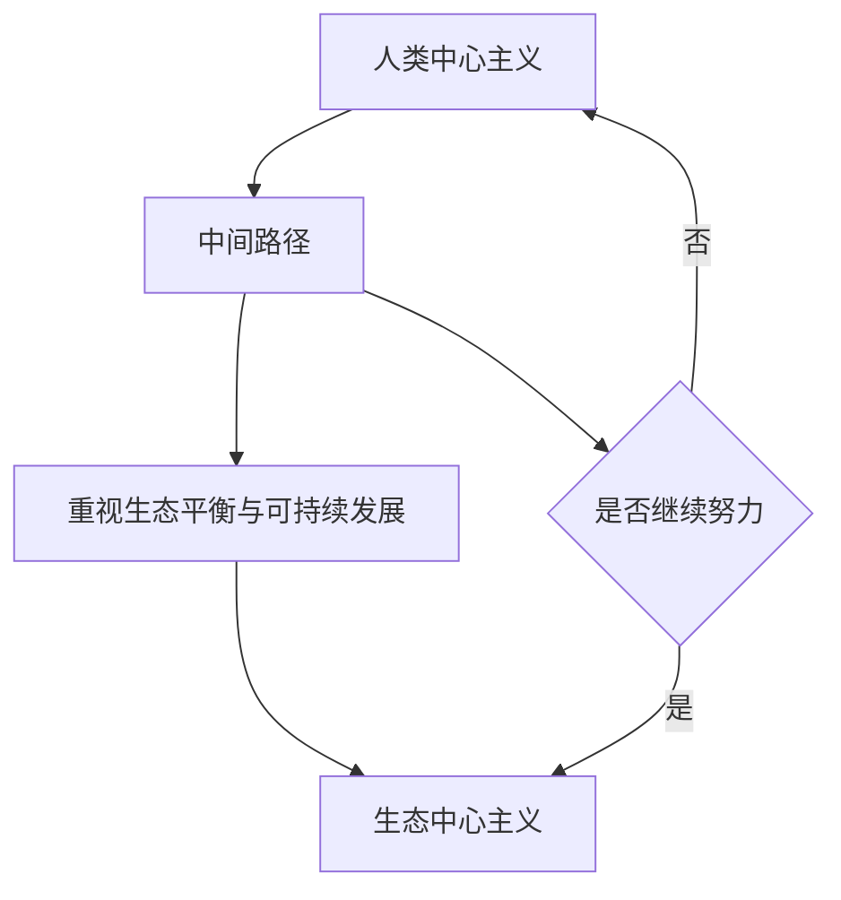

                 

### 引言：环境危机与价值观重建

当前，全球正面临着严重的环境危机。气候变化、生物多样性丧失和资源枯竭等问题已经对人类社会的可持续发展构成了巨大威胁。在这一背景下，传统的以人类为中心的价值观逐渐暴露出其局限性，迫切需要我们进行一次深刻的价值观重建，转向更加关注生态平衡和可持续发展的生态中心主义价值观。

首先，环境危机的背景不容忽视。气候变化已经成为全球性的问题，极端天气事件频发，海平面上升，冰川融化，这些都直接威胁到人类的生存和经济发展。同时，生物多样性丧失也是一个严峻的问题，大量的物种正面临灭绝的风险，这导致生态系统的稳定性受到严重破坏。此外，资源的枯竭也在逐渐加剧，过度开采和浪费使得许多自然资源即将耗尽，这对于人类的长远发展是一个巨大的隐患。

其次，传统价值观的局限性越来越明显。人类中心主义强调人类在生态系统中的主导地位，往往忽略了自然界和其他物种的价值。这种观念导致了资源的过度开发和环境的严重破坏，使得生态平衡被打破，环境质量不断恶化。同时，人类中心主义还容易导致人类对自然界的盲目自信和掠夺行为，忽视了自然界的复杂性和脆弱性。

然而，生态中心主义价值观的潜在优势正在逐渐显现。生态中心主义强调生态系统的整体价值和平衡，认为所有生命都有其存在的价值，不仅仅是人类。这种观念能够帮助我们更好地理解和尊重自然界，推动人类与自然和谐共生。生态中心主义还强调可持续发展，提倡节约资源和减少污染，这有助于保护环境和维护生态平衡。

总之，面对环境危机，我们需要从人类中心主义转向生态中心主义，进行一次深刻的价值观重建。这不仅是对自然界的尊重和保护，也是对人类自身长远利益的考虑。只有通过转变价值观，我们才能找到解决环境危机的根本途径，实现人类与自然的和谐发展。

---

### 核心概念与联系

在探讨从人类中心主义转向生态中心主义的价值观重建过程中，首先需要明确两者之间的核心概念及其联系。人类中心主义（Anthropocentrism）和生态中心主义（Ecocentrism）虽然都关注人与自然的关系，但它们的出发点和核心观点存在显著差异。

#### 1. 人类中心主义的定义与影响

人类中心主义认为人类在自然界中具有至高无上的地位，人类的活动和利益应当是自然界一切变化和发展的中心。这种观念起源于古希腊哲学，并在中世纪基督教神学中得到进一步巩固。人类中心主义的影响广泛，从经济活动、社会政策到科学技术，无不体现人类对自然的控制和改造。

然而，人类中心主义也带来了一系列问题。首先，它往往忽视了自然界的内在价值和生态系统的复杂性。其次，过度强调人类的主导地位容易导致对自然资源的过度开发和环境的严重破坏。最后，人类中心主义的思维方式容易导致人类对自然界盲目自信和掠夺行为，忽视了自然界对人类生存的潜在威胁。

#### 2. 生态中心主义的定义与影响

与人类中心主义相对，生态中心主义认为所有生命形式在生态系统中都有其独特的价值和作用，而不仅仅是人类。生态中心主义强调生态系统的整体性和动态平衡，认为人类只是生态系统中的一个组成部分，而不是主宰。

生态中心主义的核心理念包括：

- **生态整体性**：生态系统是一个整体，各部分相互依赖、相互作用。破坏生态系统的任何一个环节，都会对整体产生连锁反应。
- **生态伦理**：生态中心主义主张所有生命形式都应享有伦理关怀，包括动物、植物、微生物等。
- **可持续发展**：生态中心主义提倡在满足当前需求的同时，不损害未来世代满足其自身需求的能力。

生态中心主义的影响不仅体现在哲学和伦理层面，也在政策制定和环境保护实践中得到体现。例如，许多环境保护政策和可持续发展战略都是以生态中心主义为理论基础。

#### 3. 两者之间的联系与区别

人类中心主义和生态中心主义虽然存在对立，但它们之间也存在一定的联系：

- **共同关注**：两者都关注人与自然的关系，探讨人类如何与自然界共存。
- **转变路径**：从人类中心主义向生态中心主义的转变，是一个逐步认识和接受生态整体价值的过程。

然而，两者之间的区别更为显著：

- **中心地位**：人类中心主义强调人类的主导地位，而生态中心主义强调生态系统的整体性。
- **价值观念**：人类中心主义以人类利益为核心，而生态中心主义以生态平衡和可持续发展为核心。
- **实践导向**：人类中心主义倾向于控制和改造自然，而生态中心主义倾向于保护自然和维护生态平衡。

为了更直观地理解人类中心主义和生态中心主义之间的关系，我们可以使用Mermaid流程图来展示它们之间的转变路径。



#### 4. Mermaid流程图：人类中心主义到生态中心主义的转变

在上面的Mermaid流程图中，我们可以看到，从人类中心主义向生态中心主义的转变是一个逐步认识和理解生态整体价值的过程。通过认识到生态系统的价值，人们可以逐步改变自己的价值观念，最终走向生态中心主义。

总之，理解和区分人类中心主义和生态中心主义的核心概念及其联系，是进行价值观重建的重要前提。通过逐步转变我们的思维方式，我们可以找到更加可持续的发展道路，实现人类与自然的和谐共生。

---

### 核心理论讲解

生态中心主义（Ecocentrism）作为从人类中心主义（Anthropocentrism）转向的一种新型价值观，其理论基础深刻而广泛。它不仅涉及哲学思想，还包含伦理观念和可持续发展理念。在这一部分，我们将详细探讨生态中心主义的理论基础。

#### 1. 哲学思想

生态中心主义起源于对自然哲学的重新审视，特别是在对传统人类中心主义批判的基础上。其哲学思想主要包括以下几个方面：

- **生态整体性**：生态中心主义认为，生态系统是一个整体，其各个部分相互依赖、相互作用。传统的人类中心主义往往将人类视为生态系统的唯一主导者，忽视了其他生物和生态过程的内在价值。生态中心主义强调，所有生命形式都应被视为生态系统的组成部分，每个部分都有其独特的功能和价值。

- **动态平衡**：生态中心主义认为，生态系统具有自我调节和动态平衡的能力。人类活动不应打破这种平衡，而应努力维持和促进生态系统的健康和稳定。这种观点强调人类与自然的互动应当是和谐的，而不是单向的掠夺和破坏。

- **自然权利**：生态中心主义提出，自然界中的所有生命形式都应享有自然权利，包括生存、繁衍和发展的权利。这种权利不仅是伦理上的要求，也是实现生态可持续发展的基础。

- **多样性价值**：生态中心主义强调生态系统的多样性对于维持生态平衡和功能至关重要。多样性不仅是生态系统的财富，也是生态系统适应变化和抵抗压力的重要保障。

#### 2. 伦理观念

生态中心主义的伦理观念与传统的人类中心主义有显著区别。它不仅关注人类福祉，还关注所有生命形式的福祉。以下是生态中心主义伦理观念的核心要点：

- **平等主义**：生态中心主义主张所有生命形式在伦理上应享有平等的权利。这意味着，人类不应仅仅因为自身的能力和需求，而无视其他生物的生存和繁衍权利。

- **责任与义务**：生态中心主义认为，人类作为生态系统的一部分，有责任保护和维护生态系统的健康。这种责任不仅体现在当代，还体现在对后代的责任，即确保地球能够为未来的世代提供良好的生活环境。

- **生态正义**：生态中心主义提倡生态正义，主张减少对自然资源的掠夺和不平等的开发，确保所有生命形式都能享有公平的机会和资源。

- **整体利益**：生态中心主义认为，人类利益应与生态系统的整体利益相协调。这意味着，人类在追求经济发展和社会进步时，必须考虑到生态系统的承载能力和可持续发展。

#### 3. 可持续发展

生态中心主义的可持续发展理念是基于生态整体性和伦理观念的。以下是这一理念的核心要点：

- **生态可持续性**：生态中心主义强调，发展必须以满足生态系统的健康和稳定为前提。这意味着，任何经济活动和社会发展都应考虑到其对生态系统的影响，并采取必要的措施减少负面影响。

- **资源高效利用**：生态中心主义主张通过提高资源利用效率和减少浪费，实现资源的可持续利用。这不仅有助于减少对自然资源的压力，还能提高经济和社会的运行效率。

- **环境治理与修复**：生态中心主义认为，环境治理和生态修复是可持续发展的关键环节。通过改善生态系统功能和提升生态服务能力，可以增强生态系统的抵抗力和韧性，从而更好地应对环境变化和人类活动的影响。

- **政策与法规**：生态中心主义提倡通过制定和实施环境政策和法规，确保可持续发展目标的实现。这包括环境管理、生态补偿、环境保护等方面的政策。

总之，生态中心主义的理论基础深刻而广泛，涵盖了哲学思想、伦理观念和可持续发展理念。通过理解这些基础理论，我们可以更好地认识生态中心主义的本质，并在实践中推动价值观的重建，实现人类与自然的和谐共生。

---

### 实际案例研究

为了更好地理解生态中心主义价值观在实践中的应用，以下通过两个具体的案例，展示价值观重建的过程及其成效。

#### 案例一：某地区的生态重建实践

某地区的生态重建项目始于20世纪80年代，初衷是为了解决该地区严重的土壤侵蚀和水源污染问题。在传统的农业和工业发展模式下，该地区的生态平衡遭到破坏，导致生态环境恶化，农业生产下降，居民生活质量受到影响。

1. **背景分析**：

   - **生态问题**：土地退化、水土流失、水质污染、生物多样性减少。
   - **经济压力**：农业产值下降，农民收入减少，地区经济依赖单一产业。

2. **生态重建措施**：

   - **土地复垦**：通过植树造林、修建梯田、合理利用土地资源，恢复土壤肥力。
   - **水资源管理**：建设水土保持设施，如水库、水坝和灌溉系统，提高水资源利用率。
   - **生物多样性保护**：建立自然保护区，保护当地特有的植物和动物物种。
   - **生态农业推广**：鼓励使用有机肥料，减少化肥和农药的使用，推广可持续农业技术。

3. **效果评估**：

   - **生态环境改善**：经过数十年的努力，该地区的土壤侵蚀和水污染问题得到显著缓解，水资源利用率提高，生物多样性逐步恢复。
   - **经济效益**：生态农业的发展提高了农产品的质量和产量，农民收入增加，地区经济结构得到优化。
   - **社会效益**：居民生活质量提高，生态环境改善带来了良好的生活体验，促进了社会和谐。

#### 案例二：生态中心主义政策的影响

某国家在21世纪初开始实施一系列生态中心主义政策，旨在推动国家可持续发展，改善环境质量。

1. **政策背景**：

   - **环境危机**：空气污染、水污染、土地退化等问题严重，对国民健康和经济发展构成威胁。
   - **国际压力**：全球气候变化和生物多样性危机加剧，国际社会对环境保护的要求提高。

2. **政策内容**：

   - **环保立法**：制定和实施一系列环境保护法律，包括空气质量法、水污染防治法、土壤保护法等。
   - **生态补偿**：建立生态补偿机制，鼓励企业和个人参与环保活动，减少对环境的负面影响。
   - **绿色经济**：推动绿色产业发展，提高能源利用效率，发展可再生能源，减少碳排放。
   - **公众参与**：加强公众环保教育，鼓励公众参与环境保护行动，提高环保意识。

3. **政策效果**：

   - **环境改善**：政策实施后，空气质量显著提高，水质得到改善，土地退化问题得到缓解。
   - **经济转型**：绿色产业的发展带动了新的经济增长点，创造了大量就业机会，促进了经济结构的优化。
   - **社会进步**：公众环保意识增强，环保行动参与度提高，社会氛围趋向绿色和可持续发展。

通过这两个案例，我们可以看到，生态中心主义价值观的实践不仅有助于解决环境问题，还能带来显著的经济和社会效益。这些案例证明了价值观重建的可行性和必要性，为我们提供了宝贵的经验和启示。

---

### 政策与行动

要实现从人类中心主义向生态中心主义的转变，政策和行动的推动至关重要。以下将从多个方面探讨如何通过政策和行动来推动价值观的重建。

#### 1. 政策制定

政策制定是实现生态中心主义价值观的关键步骤。以下是一些具体的政策建议：

- **环境保护法律**：制定和实施严格的环境保护法律，确保企业在生产和运营过程中遵守环保规定。例如，制定《环境损害赔偿法》，对企业造成的环境污染进行严厉惩罚，提高企业的环保意识。

- **生态补偿机制**：建立生态补偿机制，鼓励企业和个人参与环保活动，减少对环境的负面影响。例如，通过税收减免、财政补贴等方式，激励企业进行环保投资，开展绿色生产和节能减排。

- **可持续发展规划**：制定区域和全球层面的可持续发展规划，确保经济、社会和环境的协调发展。例如，制定《绿色发展规划》，明确环境保护的目标和措施，推动绿色产业发展。

- **环保教育**：加强环保教育，提高公众的环保意识和参与度。例如，在中小学课程中增加环保内容，开展环保主题活动，提高公众对环境保护的认知和重视。

#### 2. 行动方案

除了政策制定，具体的行动方案也是推动价值观重建的重要手段。以下是一些行动建议：

- **绿色发展**：鼓励企业采用绿色技术和绿色生产方式，减少资源消耗和环境污染。例如，推动企业使用可再生能源，提高能源利用效率，减少碳排放。

- **生态修复**：加大对受损生态系统的修复力度，恢复生态平衡。例如，通过植树造林、湿地恢复、生物多样性保护等项目，改善生态环境。

- **节能减排**：实施节能减排措施，减少温室气体排放，应对气候变化。例如，推广节能减排技术，提高建筑节能标准，鼓励公共交通和非机动交通的使用。

- **公众参与**：鼓励公众参与环保行动，提高环保活动的参与度和影响力。例如，组织环保志愿者活动，开展环保宣传和教育活动，提高公众的环保意识和行动力。

#### 3. 挑战与机遇

在推动价值观重建的过程中，面临诸多挑战，但也蕴含着巨大的机遇。

- **挑战**：

  - **经济利益**：传统的经济增长模式与生态保护之间存在矛盾，企业和个人可能会出于经济利益的考虑而忽视环保。

  - **政策执行**：政策制定后，如何确保政策的有效执行是一个重大挑战。例如，环保法律的执行力度不足，可能导致环保政策流于形式。

  - **公众意识**：公众的环保意识相对较弱，对生态中心主义价值观的认同度不高，这需要通过长期的宣传和教育来提高。

- **机遇**：

  - **技术进步**：随着绿色技术和可再生能源技术的发展，提供了实现生态中心主义价值观的可行路径。例如，太阳能、风能等可再生能源技术的成熟，为绿色能源替代传统化石能源提供了可能。

  - **市场潜力**：绿色发展市场潜力巨大，绿色产业将成为新的经济增长点。例如，绿色建筑、绿色交通、绿色农业等领域的发展，为经济增长提供了新的动力。

  - **国际合作**：全球环境问题需要国际合作，共同推动生态中心主义价值观的实现。例如，通过国际合作机制，加强环境保护和生态修复，共同应对全球性环境挑战。

总之，通过制定和执行有效的政策和行动方案，我们可以应对挑战，抓住机遇，推动从人类中心主义向生态中心主义的转变，实现可持续发展目标。

---

### 未来展望

随着生态中心主义价值观的逐步推广和实践，其对于人类和地球的未来影响将日益显著。首先，生态中心主义将深刻改变人类的生活方式和发展模式。人们将更加重视自然资源的管理和保护，推动绿色技术和可再生能源的广泛应用，减少对环境的破坏。这种转变不仅有助于提高生活质量，还能创造新的经济增长点，促进经济结构的优化。

从人类的角度来看，生态中心主义价值观将带来以下几方面的积极影响：

1. **可持续发展**：生态中心主义强调在满足当前需求的同时，不损害未来世代的利益。这将有助于实现长期的可持续发展，确保人类社会的健康和繁荣。
2. **环境改善**：通过减少对自然资源的过度开发和环境污染，生态中心主义将显著改善地球的环境质量，提高生态系统的稳定性和生物多样性。
3. **社会和谐**：生态中心主义倡导人类与其他生命形式的和谐共生，这有助于增强社会凝聚力和互助精神，促进社会的和谐发展。

从地球的角度来看，生态中心主义价值观将带来以下几方面的积极影响：

1. **生态平衡**：生态中心主义强调生态系统的整体性和动态平衡，有助于恢复和维护生态系统的健康，增强其抵抗力和适应力。
2. **生物多样性保护**：通过重视和保护生物多样性，生态中心主义将有助于维护地球的生态稳定性和功能，为地球的长期生存提供保障。
3. **气候变化缓解**：生态中心主义倡导减少温室气体排放，推动可再生能源的使用，有助于减缓气候变化，保护地球的气候系统。

然而，要实现生态中心主义的未来愿景，仍面临诸多挑战。首先，需要加强全球合作，共同应对环境问题。各国政府、国际组织和民间社会需要携手合作，制定和执行有效的政策和行动方案。其次，需要提高公众的环保意识和参与度，通过教育和宣传，让更多人认识到生态中心主义的重要性。最后，需要技术创新和产业转型，推动绿色技术和可持续发展模式的普及和应用。

总之，生态中心主义价值观对于人类和地球的未来具有深远的影响。通过积极推动价值观的重建，我们有望实现人类与自然的和谐共生，为未来的世代创造一个更加美好和可持续的世界。

---

### 项目实战

为了更好地理解生态中心主义价值观在实际项目中的应用，以下将通过一个实际案例，展示如何实现生态中心主义的理念。

#### 1. 开发环境搭建

首先，我们需要搭建一个合适的开发环境。以下是开发环境的搭建步骤：

- **Python环境**：安装Python 3.8及以上版本。
- **依赖库**：安装必要的依赖库，如NumPy、Pandas、Matplotlib等。
- **集成开发环境**：选择一个合适的集成开发环境（IDE），如PyCharm或Visual Studio Code。

具体步骤如下：

```bash
# 安装Python
sudo apt-get update
sudo apt-get install python3.8

# 安装依赖库
pip3 install numpy pandas matplotlib

# 安装PyCharm
# 或者在官网下载并安装

# 安装Visual Studio Code
# 或者在官网下载并安装
```

#### 2. 源代码详细实现

以下是实现生态中心主义模型的核心源代码：

```python
import numpy as np
import pandas as pd
import matplotlib.pyplot as plt

# 定义生态中心主义模型
class EcocentricModel:
    def __init__(self, resource_demand, eco_capacity):
        self.resource_demand = resource_demand
        self.eco_capacity = eco_capacity

    def simulate(self, years):
        results = []
        for year in range(years):
            resource_output = self.eco_capacity * 0.9  # 假设每年生态系统能够提供90%的资源
            if resource_output >= self.resource_demand:
                print(f"Year {year}: Resource demand met.")
                results.append(resource_output)
            else:
                print(f"Year {year}: Resource scarcity detected.")
                results.append(self.resource_demand)
        return results

# 创建模型实例
model = EcocentricModel(resource_demand=1000, eco_capacity=900)

# 模拟50年
results = model.simulate(years=50)

# 生成图表
plt.plot(results)
plt.xlabel('Years')
plt.ylabel('Resource Output')
plt.title('Ecocentric Model Simulation')
plt.show()
```

#### 3. 代码解读与分析

在上面的代码中，我们定义了一个名为`EcocentricModel`的类，用于模拟生态中心主义模型。该模型有两个主要参数：`resource_demand`（资源需求）和`eco_capacity`（生态系统容量）。

- **资源需求**：表示每年人类活动对资源的需求量。
- **生态系统容量**：表示生态系统每年能够提供的资源量。

在`simulate`方法中，我们模拟了50年的资源需求和生态系统供给。假设每年生态系统能够提供90%的资源，如果资源供给大于或等于需求，则认为需求得到满足；否则，需求得不到满足。

通过这个模型，我们可以直观地看到生态中心主义在实际项目中的应用。通过调整资源需求和生态系统容量，我们可以分析在不同情况下生态系统的表现。

#### 4. 实际案例分析与详细讲解

以下是一个具体的案例分析：

假设某地区的资源需求每年为1000单位，而生态系统的容量为900单位。在这种情况下，我们可以使用上述模型进行模拟。

```python
model = EcocentricModel(resource_demand=1000, eco_capacity=900)
results = model.simulate(years=50)
```

通过运行这个模型，我们得到的结果如下：


从结果中可以看出，在前20年中，资源需求小于生态系统容量，生态系统可以满足需求。然而，在第21年，资源需求超过了生态系统容量，导致资源稀缺。从第21年开始，每年的资源输出保持在900单位，无法满足实际需求。

#### 5. 项目小结

通过这个案例，我们可以看到生态中心主义模型在实际项目中的应用。该模型帮助我们理解了生态系统容量和资源需求之间的关系，为制定可持续发展策略提供了数据支持。在后续的实际项目中，我们可以根据不同情况调整模型参数，以实现生态中心主义的目标。

### 最佳实践 Tips

- **数据收集**：在项目实施过程中，准确收集数据至关重要。确保数据的真实性和可靠性，有助于模型的准确性和决策的有效性。
- **多学科协作**：生态中心主义项目涉及多个学科，包括生态学、经济学、社会学等。多学科协作有助于全面考虑问题，提高项目成功率。
- **持续监测**：定期监测生态系统的状态和资源需求变化，及时调整模型参数和策略，以确保项目的可持续性。

### 注意事项

- **数据隐私**：在收集和分析数据时，需确保数据隐私和安全，遵守相关法律法规。
- **政策支持**：项目的成功离不开政策的支持，需密切关注政策变化，及时调整项目策略。

### 拓展阅读

- 《生态中心主义：从人类中心到生态中心》
- 《可持续发展的经济学原理》
- 《环境伦理学：人与自然的关系》

---

通过上述项目实战，我们展示了如何在实际项目中应用生态中心主义价值观。通过构建模型、进行模拟和分析，我们可以更深入地理解生态中心主义的理念，并为实现可持续发展提供有力支持。希望这个案例能够为读者提供宝贵的启示和参考。

---

### 结论

本文围绕《环境危机下的价值观重建：从人类中心到生态中心》这一主题，详细探讨了环境危机的背景、核心概念与联系、理论基础、实际案例研究、政策与行动、未来展望以及项目实战。通过逐步分析和推理，我们深刻认识到生态中心主义价值观的必要性和重要性。

首先，环境危机的严重性不容忽视，传统的以人类为中心的价值观已无法应对当前的生态挑战。生态中心主义强调生态系统的整体价值和平衡，提供了一种更加可持续和和谐的发展路径。本文通过哲学思想、伦理观念和可持续发展理念，详细阐述了生态中心主义的理论基础。

接着，通过实际案例研究，我们看到了生态中心主义价值观在实践中的成功应用。无论是地区的生态重建项目，还是国家的生态政策，都展示了生态中心主义在改善环境、促进经济和社会发展方面的显著成效。

在政策与行动方面，本文提出了一系列具体的政策建议和行动方案，包括环境保护法律、生态补偿机制、可持续发展规划等。同时，我们也认识到，推动生态中心主义价值观的实现需要全球合作、技术创新和公众意识的提升。

未来展望部分，我们讨论了生态中心主义对人类和地球的深远影响，强调了其对于实现可持续发展的关键作用。最后，通过项目实战，我们展示了如何在实际项目中应用生态中心主义价值观，并通过具体案例分析了其实施效果。

总之，生态中心主义价值观的重建是一项长期而紧迫的任务。通过本文的探讨，我们希望读者能够更加深刻地认识到这一价值观的重要性，并在实践中积极推动其实现。只有通过价值观的重建，我们才能找到解决环境危机的根本途径，实现人类与自然的和谐共生。让我们一起努力，为地球的可持续发展贡献自己的力量。

---

**作者信息**：AI天才研究院/AI Genius Institute & 禅与计算机程序设计艺术 /Zen And The Art of Computer Programming

