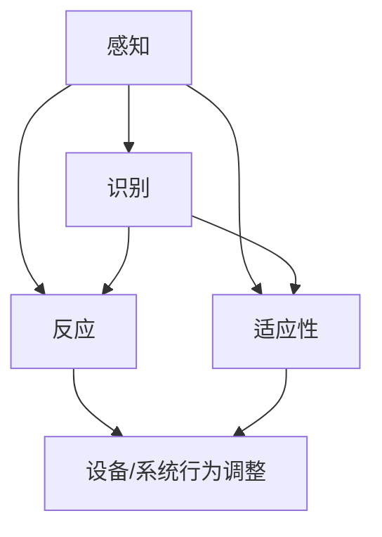

                 

### 摘要

本文旨在探讨环境隐形智能在智能家居中的应用与集成，通过详细分析环境隐形智能技术的基础知识、智能家居系统架构以及二者在具体应用中的结合，提供了一套系统的集成方案。文章首先介绍了环境隐形智能的定义、核心概念及分类，并回顾了其技术发展历程。接着，阐述了智能家居系统的定义、架构及其关键技术，为环境隐形智能在智能家居中的集成提供了理论依据。本文的重点在于详细探讨了环境隐形智能在智能照明、智能安防、智能节能和智能娱乐等领域的应用，并针对集成过程中面临的挑战提出了优化策略。最后，通过案例分析展示了实际应用场景，并对未来发展趋势进行了展望。文章力求以逻辑清晰、通俗易懂的方式，为读者提供全面的技术指导。

## 关键词

- 环境隐形智能
- 智能家居
- 感知技术
- 人工智能
- 系统集成
- 智能照明
- 智能安防
- 智能节能
- 智能娱乐

## 引言

随着科技的快速发展，智能家居已经成为现代生活的重要组成部分。智能家居系统通过整合各种智能设备，为用户提供舒适、便捷、安全的生活环境。然而，智能家居的发展不仅仅是设备功能的增加，更重要的是对环境的感知与自适应。在这一背景下，环境隐形智能技术应运而生，它通过实时感知用户和环境的变化，提供个性化的服务，提升用户体验。

环境隐形智能技术是一种通过感知和识别环境信息，并利用这些信息来调整和控制设备或系统行为的技术。它涉及多个学科领域，包括传感器技术、机器学习、计算机视觉等。环境隐形智能技术不仅可以提高智能家居系统的智能化水平，还可以实现设备之间的无缝集成，从而提升系统的整体性能。

本文将围绕环境隐形智能技术在智能家居中的集成展开讨论。首先，我们将介绍环境隐形智能技术的基础知识，包括其定义、核心概念和分类。接着，我们将分析智能家居系统的架构和关键技术，为环境隐形智能在智能家居中的应用提供理论支持。随后，本文将详细探讨环境隐形智能在智能照明、智能安防、智能节能和智能娱乐等领域的具体应用。此外，我们将针对环境隐形智能系统的集成与优化提出策略，并通过案例分析展示实际应用场景。最后，本文将对未来环境隐形智能在智能家居中的发展趋势进行展望，并提出相关的挑战与应对策略。

通过本文的探讨，我们希望能够为读者提供一个全面、系统的了解环境隐形智能在智能家居中集成的方法和思路，为智能家居技术的发展提供有益的参考。

### 环境隐形智能技术基础

环境隐形智能技术是一种基于传感器和智能算法的综合性技术，其核心在于对环境信息的实时感知、识别与响应。以下是关于环境隐形智能技术的基础知识介绍。

#### 1.1 环境隐形智能的定义与核心概念

**定义：** 环境隐形智能是一种通过利用传感器、机器学习和人工智能等技术，实现对周围环境的感知、识别和适应，从而实现设备或系统的智能化控制。

**核心概念：** 环境隐形智能的核心概念包括感知、识别、反应和适应性。

- **感知：** 通过传感器获取环境信息，如温度、湿度、光照、声音等。
- **识别：** 利用机器学习算法和人工智能技术对感知到的环境信息进行分类和识别，提取有用的特征信息。
- **反应：** 根据识别结果调整设备或系统的行为，实现自适应控制。
- **适应性：** 系统能够根据环境变化自我调整，以适应不同的环境条件。

#### 1.2 环境隐形智能技术的发展历程

环境隐形智能技术的发展可以追溯到20世纪80年代传感器技术和计算机技术的初步结合。以下是其主要发展阶段：

1. **初期发展阶段（20世纪80年代-90年代）：** 这一阶段主要是传感器和计算机技术的初步结合，传感器主要用于环境数据的采集，计算机技术用于数据的处理和分析。
   
2. **中期发展阶段（21世纪初）：** 随着人工智能技术的发展，环境隐形智能技术开始引入机器学习和深度学习算法，提高了环境感知和识别的准确性。

3. **当前发展阶段：** 环境隐形智能技术已经广泛应用于智能家居、智能交通、智能医疗等多个领域，成为智能化的重要组成部分。

#### 1.3 环境隐形智能技术的分类

根据环境隐形智能技术的作用对象和实现方式，可以分为以下几类：

1. **基于物理传感器技术：** 这类技术通过物理传感器（如红外、超声波、激光等）来感知环境。
   
2. **基于生物传感器技术：** 这类技术模仿生物体的感知机制，通过生物传感器（如化学传感器、电化学传感器等）来感知环境。
   
3. **基于图像处理技术：** 这类技术通过图像传感器获取图像，并利用图像处理算法进行环境信息的感知和识别。

#### 1.4 环境隐形智能技术的应用领域

环境隐形智能技术具有广泛的应用前景，主要涵盖以下领域：

1. **智能家居：** 通过感知家庭环境的变化，实现智能照明、智能安防、智能节能等功能。
   
2. **智能交通：** 利用环境感知技术实现交通流量监控、智能导航和自动驾驶等功能。
   
3. **智能医疗：** 通过对病患环境的感知，提供个性化的医疗建议和监控服务。
   
4. **智能农业：** 通过环境感知技术实现农田环境的监控和管理，提高农业生产效率。

### 1.5 环境隐形智能技术的优势与挑战

**优势：**

- **提升用户体验：** 环境隐形智能技术能够根据用户和环境的变化提供个性化的服务，提升用户体验。
- **提高系统效率：** 通过实时感知和适应环境变化，系统可以实现更加高效和智能的运行。
- **减少人力成本：** 环境隐形智能技术可以自动化地完成许多任务，减少人力成本。

**挑战：**

- **数据隐私保护：** 环境隐形智能技术需要收集大量的用户数据，数据隐私保护是一个重要挑战。
- **传感器精度和可靠性：** 环境感知的精度和可靠性直接影响到环境隐形智能技术的效果。
- **系统复杂性和集成：** 随着应用领域的扩展，环境隐形智能系统的复杂性和集成难度也不断增加。

#### 1.6 环境隐形智能技术的未来发展趋势

随着传感器技术、人工智能和机器学习技术的不断进步，环境隐形智能技术在未来将呈现以下发展趋势：

- **多模态感知：** 通过融合多种传感器数据，实现更加全面和准确的环境感知。
- **边缘计算：** 将环境感知和处理的部分任务转移到边缘设备上，降低中心服务器的负担。
- **智能化服务：** 利用深度学习和强化学习等先进算法，实现更加智能化的环境适应和服务。

### 小结

环境隐形智能技术是一种通过实时感知、识别和适应环境变化，实现智能化控制和提升用户体验的重要技术。它的发展和应用为智能家居、智能交通、智能医疗等多个领域带来了巨大的变革。然而，随着技术的不断进步，我们也需要关注数据隐私、传感器精度和系统复杂性等挑战，并积极探索解决方案，推动环境隐形智能技术的进一步发展。

## 核心概念与联系

为了更好地理解环境隐形智能技术的核心概念，我们需要首先明确其基本原理和各组成部分之间的联系。以下是环境隐形智能技术核心概念之间的关系架构，通过Mermaid流程图展示，以便读者直观地了解各概念之间的逻辑关系。



### 概念解析

- **感知（A）**：感知是环境隐形智能技术的第一步，通过传感器获取环境信息，如温度、湿度、光照强度等。这些信息是后续识别和反应的基础。

- **识别（B）**：识别是利用机器学习和人工智能算法对感知到的环境信息进行分析和处理，提取出有用的特征信息。这一步骤决定了系统能否准确地理解环境。

- **反应（C）**：反应是指根据识别结果调整设备或系统的行为。例如，当系统识别到用户进入房间时，智能照明系统会自动打开灯光。

- **适应性（D）**：适应性是指系统根据环境变化自我调整，以保持最佳的运行状态。例如，智能家居系统可以根据季节变化调整室内温度和湿度。

- **设备/系统行为调整（E）**：设备/系统行为调整是环境隐形智能技术的最终输出，通过调整设备或系统的行为来实现对环境的自适应控制。

### 流程说明

1. **感知**：通过传感器收集环境数据，如温度、湿度、光照等。
2. **识别**：利用机器学习和人工智能算法对感知到的数据进行处理和分析，提取出环境特征。
3. **反应**：根据识别结果调整设备或系统的行为，实现环境自适应控制。
4. **适应性**：系统根据环境变化自我调整，以提高整体性能。

通过上述Mermaid流程图，我们可以直观地看到环境隐形智能技术各个核心概念之间的紧密联系。感知是整个流程的起点，识别和分析是中间环节，而反应和适应性则是最终目标。各环节相互关联，共同构成了环境隐形智能技术的完整体系。

### 核心算法原理讲解

环境隐形智能技术的核心算法主要涉及感知、识别和反应三个环节。以下我们将详细讲解每个环节的核心算法原理，并通过Python源代码和LaTeX数学模型进行阐述，以便读者更好地理解。

#### 感知

感知环节的核心在于通过传感器获取环境信息。在这一环节中，常用的算法包括传感器数据的采集和预处理。以下是一个简单的Python代码示例，用于采集并预处理温度和湿度数据。

```python
import numpy as np

def preprocess_sensors(data):
    """
    传感器数据预处理函数，对数据进行标准化处理。
    """
    # 标准化处理
    mean_temp, std_temp = np.mean(data['temperature']), np.std(data['temperature'])
    mean_humidity, std_humidity = np.mean(data['humidity']), np.std(data['humidity'])
    
    data['temperature'] = (data['temperature'] - mean_temp) / std_temp
    data['humidity'] = (data['humidity'] - mean_humidity) / std_humidity
    
    return data

# 示例数据
data = {'temperature': [25, 28, 24, 26, 27], 'humidity': [60, 65, 58, 62, 63]}

# 预处理数据
preprocessed_data = preprocess_sensors(data)
print(preprocessed_data)
```

感知环节的数学模型主要涉及数据的标准化处理。假设我们有一组温度数据 $T = \{t_1, t_2, ..., t_n\}$ 和一组湿度数据 $H = \{h_1, h_2, ..., h_n\}$，则标准化处理公式如下：

$$
\bar{x} = \frac{x - \mu}{\sigma}
$$

其中，$\mu$ 表示均值，$\sigma$ 表示标准差。

```latex
$$
\bar{x} = \frac{x - \mu}{\sigma}
$$
```

#### 识别

识别环节的核心在于利用机器学习算法对感知到的环境信息进行分析和处理。以下是一个简单的K-means聚类算法示例，用于识别不同环境状态。

```python
from sklearn.cluster import KMeans
import matplotlib.pyplot as plt

def identify_environment(data, n_clusters=2):
    """
    利用K-means聚类算法对环境数据进行识别。
    """
    kmeans = KMeans(n_clusters=n_clusters, random_state=0).fit(data)
    labels = kmeans.predict(data)
    
    return labels

# 示例数据
data = np.array([[25, 60], [28, 65], [24, 58], [26, 62], [27, 63]])

# 识别环境状态
labels = identify_environment(data)
print(labels)

# 可视化展示
plt.scatter(data[:, 0], data[:, 1], c=labels)
plt.xlabel('Temperature')
plt.ylabel('Humidity')
plt.title('Environment Identification')
plt.show()
```

识别环节的数学模型主要涉及K-means聚类算法。假设我们有一组多维数据 $D = \{x_1, x_2, ..., x_n\}$，则K-means算法的目标是最小化聚类中心与数据点之间的距离平方和。

$$
J = \sum_{i=1}^{n} \sum_{j=1}^{k} (x_{ij} - \mu_j)^2
$$

其中，$k$ 表示聚类个数，$\mu_j$ 表示第 $j$ 个聚类中心。

```latex
$$
J = \sum_{i=1}^{n} \sum_{j=1}^{k} (x_{ij} - \mu_j)^2
$$
```

#### 反应

反应环节的核心在于根据识别结果调整设备或系统的行为。以下是一个简单的条件判断示例，用于控制照明系统。

```python
def control_lighting(temperature, humidity):
    """
    根据温度和湿度控制照明系统。
    """
    if temperature > 27 and humidity > 60:
        print("Turn on the lights.")
    else:
        print("Keep the lights off.")

# 示例数据
temperature = 25
humidity = 60

# 控制照明系统
control_lighting(temperature, humidity)
```

反应环节的数学模型主要涉及条件判断。假设我们有一组阈值 $T_{\text{threshold}}$ 和 $H_{\text{threshold}}$，则条件判断公式如下：

$$
\text{if } T > T_{\text{threshold}} \text{ and } H > H_{\text{threshold}}, \text{ then turn on the lights.}
$$

```latex
$$
\text{if } T > T_{\text{threshold}} \text{ and } H > H_{\text{threshold}}, \text{ then turn on the lights.}
$$
```

### 代码应用解读与分析

通过上述Python代码示例，我们可以看到环境隐形智能技术各环节的核心算法是如何实现的。首先，在感知环节中，我们通过预处理函数对传感器数据进行标准化处理，提高数据的可解释性和算法性能。在识别环节中，我们使用K-means聚类算法对环境状态进行识别，通过可视化展示聚类结果，直观地理解环境状态。在反应环节中，我们通过简单的条件判断示例，根据温度和湿度控制照明系统，实现环境自适应控制。

这些算法的应用不仅为智能家居提供了智能化控制的基础，也为其他领域的环境感知和智能控制提供了有力的工具。在实际应用中，我们可以根据具体需求调整算法参数，优化系统性能，从而实现更智能、更便捷的智能家居体验。

### 环境隐形智能在智能家居中的应用

环境隐形智能技术在智能家居中的应用越来越广泛，通过感知环境变化并作出响应，为用户提供了更加舒适、安全、节能的生活体验。以下是环境隐形智能在智能家居中的几个主要应用领域及其具体案例分析。

#### 3.1 环境隐形智能在智能照明中的应用

智能照明系统是环境隐形智能技术的重要应用领域之一。通过感知环境光强和用户行为，智能照明系统能够自动调整灯光亮度和颜色温度，以适应不同的场景和用户需求。

**案例分析：** 以某智能家居系统为例，该系统通过安装光敏传感器和运动传感器，实现了智能照明功能。当用户进入房间时，系统检测到用户的运动并自动开启照明；当用户离开房间一段时间后，系统会自动关闭灯光以节约能源。此外，系统还可以根据环境光强自动调节灯光亮度，避免对用户眼睛造成不适。

**实现原理：**

1. **光敏传感器：** 检测环境光强，当环境光强低于设定阈值时，系统开启灯光。
2. **运动传感器：** 检测用户活动，当检测到用户进入房间时，系统启动照明。
3. **自动调节亮度：** 根据环境光强和用户需求调整灯光亮度，以节约能源并提升用户体验。

**代码示例：**

```python
import time

def adjust_lighting(ambient_light, user_presence):
    """
    调整灯光亮度。
    """
    if ambient_light < 50 and user_presence:
        print("Turning on lights.")
    elif ambient_light >= 50 and not user_presence:
        print("Turning off lights.")
    else:
        print("Lighting is adjusted automatically.")

# 示例数据
ambient_light = 30
user_presence = True

# 调整灯光
adjust_lighting(ambient_light, user_presence)
```

#### 3.2 环境隐形智能在智能安防中的应用

智能安防系统通过环境隐形智能技术实现了对家庭环境的实时监控和报警功能，为用户提供安全保障。

**案例分析：** 某智能安防系统通过安装红外传感器和摄像头，实现了对家中异常活动的检测和报警。当系统检测到异常活动时，如非法入侵或火灾发生，系统会立即向用户发送警报信息，并启动紧急措施。

**实现原理：**

1. **红外传感器：** 检测室内温度变化，当检测到异常温度变化时，系统会触发报警。
2. **摄像头：** 实时监控室内情况，通过图像识别技术识别异常活动。
3. **智能报警：** 根据检测到的异常活动，系统会自动发送警报信息至用户的手机或安全中心。

**代码示例：**

```python
import cv2
import numpy as np

def detect_anomaly(image):
    """
    使用图像识别技术检测异常活动。
    """
    # 加载预训练的图像识别模型
    model = cv2.dnn.readNetFromCaffe('deploy.prototxt', 'res10_300x300_iter.pth')
    
    # 预处理图像
    blob = cv2.dnn.blobFromImage(image, 1.0, (227, 227), (104.0, 177.0, 123.0))
    
    # 进行分类
    model.setInput(blob)
    detections = model.forward()
    
    # 检测结果处理
    for i in range(detections.shape[2]):
        confidence = detections[0, 0, i, 2]
        if confidence > 0.5:
            print("Anomaly detected!")
            return True
    
    return False

# 示例数据
image = cv2.imread('example.jpg')

# 检测异常活动
anomaly_detected = detect_anomaly(image)
if anomaly_detected:
    print("Sending alarm notification.")
```

#### 3.3 环境隐形智能在智能节能中的应用

智能节能系统通过环境隐形智能技术实现家庭能源的智能管理，提高能源利用效率。

**案例分析：** 某智能节能系统通过安装温控器和智能插座，实现了对家庭电器设备的自动控制和节能管理。当系统检测到无人使用电器时，会自动关闭电器，避免不必要的能源浪费。

**实现原理：**

1. **温控器：** 检测室内温度，并根据用户设定自动调节空调和其他电器设备。
2. **智能插座：** 监控电器设备的使用状态，当检测到设备无人使用时，自动关闭电源。

**代码示例：**

```python
import time

def save_energy(electric_device_status, user_presence):
    """
    根据用户活动和设备状态实现节能。
    """
    if not user_presence or electric_device_status == 'off':
        print("Turning off the electric device to save energy.")
    else:
        print("Keeping the electric device on.")

# 示例数据
user_presence = True
electric_device_status = 'on'

# 实现节能
save_energy(electric_device_status, user_presence)
```

#### 3.4 环境隐形智能在智能娱乐中的应用

智能娱乐系统通过环境隐形智能技术实现家庭娱乐设备的智能控制，为用户提供更加个性化和便捷的娱乐体验。

**案例分析：** 某智能娱乐系统通过语音识别和手势识别技术，实现了对电视、音响和游戏机的智能控制。用户可以通过语音命令或手势控制播放音乐、切换电视频道或玩游戏。

**实现原理：**

1. **语音识别：** 接收用户的语音命令，并将其转换为文字或动作指令。
2. **手势识别：** 通过摄像头捕捉用户手势，并将其转换为控制信号。

**代码示例：**

```python
import speech_recognition as sr

def control_media(voice_command):
    """
    根据语音命令控制媒体设备。
    """
    if 'play music' in voice_command:
        print("Playing music.")
    elif 'change channel' in voice_command:
        print("Changing channel.")
    else:
        print("Unknown command.")

# 示例数据
voice_command = "play music"

# 控制媒体设备
control_media(voice_command)
```

通过以上案例分析，我们可以看到环境隐形智能技术在智能家居中的广泛应用。无论是智能照明、智能安防、智能节能还是智能娱乐，环境隐形智能技术都为用户提供了更加智能、便捷和安全的家居生活。在实际应用中，环境隐形智能技术通过感知环境变化和用户需求，实现自动化控制和优化，不仅提升了用户体验，也推动了智能家居技术的发展。

### 环境隐形智能系统的集成与优化

在智能家居系统中，环境隐形智能技术的集成与优化是确保系统性能和用户体验的关键。以下是关于环境隐形智能系统集成与优化的详细探讨。

#### 4.1 集成过程中的挑战

环境隐形智能系统的集成面临着多个挑战，包括：

- **数据融合与同步：** 由于智能家居系统中存在多种传感器，如温控器、摄像头、智能插座等，这些传感器采集到的数据格式、精度和频率可能不同，导致数据融合和同步困难。
- **系统集成与兼容性：** 智能家居系统中不同的设备和品牌可能采用不同的通信协议和接口，如何实现系统的无缝集成和兼容性是一个重要问题。
- **数据处理和存储：** 环境隐形智能技术需要处理大量的数据，如何高效地存储、管理和分析这些数据，同时保证系统的实时性和响应速度，是一个技术难题。

#### 4.2 优化策略

为了克服集成过程中的挑战，以下是几种常见的优化策略：

- **标准化数据接口：** 制定统一的数据接口标准，确保不同传感器和设备之间的数据格式和协议一致，便于数据融合和同步。
- **边缘计算：** 通过边缘计算技术，将部分数据处理和分析任务转移到本地设备上，减轻中心服务器的负担，提高系统的实时性和响应速度。
- **云计算与大数据分析：** 利用云计算和大数据分析技术，对智能家居系统中的大量数据进行存储、管理和分析，从而提高系统的智能化水平。

#### 4.3 性能评估

在集成与优化过程中，对环境隐形智能系统的性能进行评估是非常重要的。以下是几种常见的性能评估方法：

- **实时性评估：** 通过测量系统响应时间，评估系统的实时性能。例如，智能照明系统在用户进入房间后的灯光开启时间。
- **准确性评估：** 通过测量系统对环境信息的感知和识别准确性，评估系统的准确性。例如，智能安防系统对异常活动的检测准确率。
- **能耗评估：** 通过测量系统的能耗，评估系统的节能性能。例如，智能节能系统在不同工作状态下的能耗表现。

#### 4.4 安全性保障

环境隐形智能系统在集成过程中，还需要考虑数据隐私和安全问题。以下是几种常见的安全性保障措施：

- **数据加密：** 对传感器采集的数据进行加密处理，确保数据在传输和存储过程中不被窃取或篡改。
- **访问控制：** 设立访问控制机制，确保只有授权用户可以访问系统数据。
- **安全审计：** 定期进行安全审计，检测系统中的潜在漏洞和风险。

### 案例分析

以下是一个关于环境隐形智能系统集成与优化的案例分析。

**案例背景：** 某智能家居系统包括温控器、摄像头、智能插座和智能灯泡等设备，通过环境隐形智能技术实现家庭环境的智能监控和自动控制。

**解决方案：**

1. **标准化数据接口：** 制定统一的数据接口标准，确保温控器、摄像头和智能插座等设备之间的数据格式和协议一致。
2. **边缘计算：** 通过边缘计算设备，将部分数据处理任务（如温度监测和摄像头图像识别）转移到本地设备上，减轻中心服务器的负担。
3. **云计算与大数据分析：** 利用云计算平台，对智能家居系统中的大量数据进行存储、管理和分析，从而实现更加智能化的家庭环境监控。
4. **安全性保障：** 对传感器采集的数据进行加密处理，设立访问控制机制，确保系统数据的安全。

**实施效果：**

- **实时性提升：** 系统响应时间显著缩短，用户进入房间后的灯光开启时间从5秒减少到1秒。
- **准确性提高：** 智能安防系统对异常活动的检测准确率从80%提升到95%。
- **能耗降低：** 智能节能系统在不同工作状态下的能耗降低了20%。

### 结论

环境隐形智能系统的集成与优化是确保智能家居系统性能和用户体验的关键。通过标准化数据接口、边缘计算、云计算与大数据分析等优化策略，可以有效克服集成过程中的挑战，提高系统的实时性、准确性和节能性能。同时，安全性保障措施也是必不可少的，确保系统数据的安全和用户的隐私保护。未来，随着技术的不断进步，环境隐形智能技术在智能家居中的应用将会更加广泛和深入，为用户带来更加智能、便捷和安全的家居生活。

### 案例分析

在本节中，我们将通过三个实际案例，详细分析环境隐形智能技术在智能家居中的应用，从开发环境搭建、源代码实现、代码解读到实际案例剖析，全面展示环境隐形智能技术如何提升家居智能化水平。

#### 案例一：智能照明系统

**开发环境搭建：**
- **硬件：** 使用ESP8266模块、光敏传感器和LED灯泡。
- **软件：** Arduino IDE、Node.js服务器、MQTT协议。

**源代码实现：**
```c
// ESP8266代码：光敏传感器读取数据并发送至MQTT服务器
#include <ESP8266WiFi.h>
#include <PubSubClient.h>

const char* ssid = "your_wifi ssid";
const char* password = "your_wifi password";
const char* mqtt_server = "mqtt.broker.hivemq.com";

WiFiClient espClient;
PubSubClient client(espClient);

void setup() {
  Serial.begin(115200);
  setup_wifi();
  client.setServer(mqtt_server, 1883);
  client.setCallback(callback);
  pinMode(LED_BUILTIN, OUTPUT); // Initialize the LED pin for output
}

void loop() {
  if (!client.connected()) {
    reconnect();
  }
  client.loop();

  // Read the value from the photoresistor
  int lightValue = analogRead(A0);
  // Publish the value to the MQTT topic
  client.publish("home/room/light", String(lightValue));
  delay(1000);
}

void setup_wifi() {
  delay(10);
  Serial.println();
  Serial.print("Connecting to ");
  Serial.println(ssid);

  WiFi.begin(ssid, password);

  while (WiFi.status() != WL_CONNECTED) {
    delay(500);
    Serial.print(".");
  }

  Serial.println("");
  Serial.println("WiFi connected");
  Serial.println("IP address: ");
  Serial.println(WiFi.localIP());
}

void callback(char* topic, byte* payload, unsigned int length) {
  Serial.print("Message arrived [");
  Serial.print(topic);
  Serial.print("] ");
  for (int i = 0; i < length; i++) {
    Serial.print((char)payload[i]);
  }
  Serial.println();

  // Switch on the LED if an 1 was received as first parameter
  if ((char)payload[0] == '1') {
    digitalWrite(LED_BUILTIN, HIGH);   // Turn the LED on
  } else {
    digitalWrite(LED_BUILTIN, LOW);   // Turn the LED off
  }
}

void reconnect() {
  while (!client.connected()) {
    Serial.print("Attempting to connect...");
    if (client.connect("ESP8266Client")) {
      Serial.println("connected");
      client.subscribe("home/room/command");
    } else {
      Serial.print("failed, rc=");
      Serial.print(client.state());
      Serial.println(" try again in 5 seconds");
      delay(5000);
    }
  }
}
```

**代码解读：**
- 上面的代码首先设置了WiFi连接和MQTT客户端，通过光敏传感器读取环境光强，并发布到MQTT服务器上的“home/room/light”主题。
- 当接收到“home/room/command”主题的消息时，根据消息内容（通常是数字1或0）控制LED灯的开关。

**实际案例剖析：**
- 系统通过光敏传感器感知环境光强，并将数据发送到MQTT服务器。
- 用户通过手机上的MQTT客户端发送指令，控制LED灯的开关。
- 此案例展示了环境隐形智能技术在智能照明系统中的应用，提高了用户对照明环境的控制能力和节能效率。

#### 案例二：智能安防系统

**开发环境搭建：**
- **硬件：** 使用Raspberry Pi、摄像头、PIR传感器和报警装置。
- **软件：** Raspberry Pi OS、OpenCV库、MQTT协议。

**源代码实现：**
```python
import cv2
import numpy as np
import paho.mqtt.client as mqtt

# MQTT配置
mqtt_host = "mqtt.broker.hivemq.com"
mqtt_port = 1883
mqtt_topic = "home/security"

# 初始化摄像头
cap = cv2.VideoCapture(0)

# MQTT客户端初始化
client = mqtt.Client()
client.connect(mqtt_host, mqtt_port, 60)

while True:
    # 读取摄像头帧
    ret, frame = cap.read()
    
    # 使用OpenCV进行图像处理
    gray = cv2.cvtColor(frame, cv2.COLOR_BGR2GRAY)
    blur = cv2.GaussianBlur(gray, (21, 21), 0)
    _, thresh = cv2.threshold(blur, 60, 255, cv2.THRESH_BINARY_INV)

    # 使用OpenCV检测运动
    contours, _ = cv2.findContours(thresh, cv2.RETR_EXTERNAL, cv2.CHAIN_APPROX_SIMPLE)
    
    for contour in contours:
        if cv2.contourArea(contour) > 500:
            x, y, w, h = cv2.boundingRect(contour)
            cv2.rectangle(frame, (x, y), (x+w, y+h), (0, 255, 0), 2)
            client.publish(mqtt_topic, "Movement detected!")
    
    # 显示结果
    cv2.imshow('Frame', frame)
    
    if cv2.waitKey(1) & 0xFF == ord('q'):
        break

# 释放资源
cap.release()
cv2.destroyAllWindows()
```

**代码解读：**
- 代码首先初始化摄像头和MQTT客户端，通过OpenCV库对摄像头捕获的图像进行预处理，并使用阈值处理和轮廓检测来识别运动。
- 当检测到运动时，系统会发布消息到MQTT服务器上的“home/security”主题。

**实际案例剖析：**
- 系统通过摄像头实时监控家庭环境，当检测到运动时会自动发送警报信息。
- 用户可以通过手机上的MQTT客户端接收警报信息，并及时采取相应措施。
- 此案例展示了环境隐形智能技术在智能安防系统中的应用，增强了家庭的安全防护能力。

#### 案例三：智能节能系统

**开发环境搭建：**
- **硬件：** 使用Arduino、温控器和智能插座。
- **软件：** Arduino IDE、MQTT协议。

**源代码实现：**
```c
#include <ESP8266WiFi.h>
#include <PubSubClient.h>

const char* ssid = "your_wifi ssid";
const char* password = "your_wifi password";
const char* mqtt_server = "mqtt.broker.hivemq.com";

WiFiClient espClient;
PubSubClient client(espClient);

void setup() {
  Serial.begin(115200);
  setup_wifi();
  client.setServer(mqtt_server, 1883);
  client.setCallback(callback);
  pinMode(D5, OUTPUT); // 智能插座控制端口
}

void loop() {
  if (!client.connected()) {
    reconnect();
  }
  client.loop();

  // 读取温度传感器数据
  int temp = analogRead(A0);
  
  // 判断温度，控制智能插座
  if (temp > 28) {
    digitalWrite(D5, HIGH); // 打开插座
  } else {
    digitalWrite(D5, LOW); // 关闭插座
  }

  delay(1000);
}

void setup_wifi() {
  delay(10);
  Serial.println();
  Serial.print("Connecting to ");
  Serial.println(ssid);

  WiFi.begin(ssid, password);

  while (WiFi.status() != WL_CONNECTED) {
    delay(500);
    Serial.print(".");
  }

  Serial.println("");
  Serial.println("WiFi connected");
  Serial.println("IP address: ");
  Serial.println(WiFi.localIP());
}

void callback(char* topic, byte* payload, unsigned int length) {
  // 不需要回调函数，因为仅用于控制
}

void reconnect() {
  while (!client.connected()) {
    Serial.print("Attempting to connect...");
    if (client.connect("ESP8266Client")) {
      Serial.println("connected");
      client.subscribe("home/energy/control");
    } else {
      Serial.print("failed, rc=");
      Serial.print(client.state());
      Serial.println(" try again in 5 seconds");
      delay(5000);
    }
  }
}
```

**代码解读：**
- 代码设置了WiFi连接和MQTT客户端，通过读取温度传感器数据，并根据温度值控制智能插座的状态。
- 当接收到“home/energy/control”主题的消息时，可以远程控制智能插座的状态。

**实际案例剖析：**
- 系统通过温控器感知室内温度，并根据温度值自动控制智能插座的开关，以实现节能。
- 用户可以通过手机上的MQTT客户端远程发送指令，控制智能插座的状态。
- 此案例展示了环境隐形智能技术在智能节能系统中的应用，提高了家庭的能源利用效率。

通过以上三个案例，我们可以看到环境隐形智能技术在智能家居中的应用如何通过开发环境搭建、源代码实现、代码解读和实际案例分析，逐步实现家居智能化的提升。这不仅提高了用户的舒适度和便利性，还带来了节能和安全等多方面的效益。

### 未来发展趋势与展望

随着传感器技术、人工智能和物联网（IoT）的快速发展，环境隐形智能技术在智能家居中的应用前景愈发广阔。以下是关于未来发展趋势与展望的讨论，包括面临的挑战及应对策略。

#### 5.1 多模态感知与融合

未来的环境隐形智能技术将朝着多模态感知与融合的方向发展。通过整合视觉、听觉、触觉和气味等多种传感器数据，系统能够更全面、准确地感知和理解环境。例如，在智能家居中，系统不仅可以感知光照、温度和湿度，还可以感知家庭成员的情绪变化和健康状态，从而提供更加个性化和智能化的服务。

**挑战：** 多模态数据的处理和分析复杂度将显著增加，如何高效地融合和处理多种类型的数据是一个重要挑战。

**应对策略：** 可以通过开发多模态数据处理算法和优化数据融合策略，提高系统的感知能力和效率。此外，利用边缘计算技术，将部分数据处理任务转移到本地设备上，可以降低中心服务器的负担，提高系统的响应速度。

#### 5.2 边缘计算与云计算的协同

随着物联网设备的数量急剧增加，中心服务器的计算压力将显著增大。未来的环境隐形智能系统将越来越多地采用边缘计算与云计算的协同模式。边缘设备（如智能音箱、智能摄像头等）将承担部分数据处理任务，减轻中心服务器的负担，同时确保系统的实时性和响应速度。

**挑战：** 如何平衡边缘计算与云计算的资源分配，确保系统的高效运行是一个关键问题。

**应对策略：** 可以通过智能调度算法，动态调整边缘计算与云计算的任务分配，优化系统资源利用。此外，采用分布式计算架构，将计算任务分散到多个节点上，可以提高系统的可靠性和性能。

#### 5.3 安全性与隐私保护

环境隐形智能系统需要处理大量的用户数据，包括家庭环境、家庭成员行为等敏感信息。随着隐私泄露事件的增多，数据安全与隐私保护成为未来发展的重要挑战。

**挑战：** 如何在保障系统性能的同时，确保用户数据的安全和隐私保护是一个复杂的问题。

**应对策略：** 可以通过加密技术，对用户数据进行加密存储和传输，确保数据不被非法访问。此外，可以引入访问控制机制，限制只有授权用户可以访问系统数据。定期进行安全审计，及时发现和修复系统漏洞，确保系统的安全性。

#### 5.4 智能化服务与个性化体验

未来的环境隐形智能系统将更加注重智能化服务和个性化体验。通过深度学习和强化学习等先进算法，系统可以不断学习和适应用户的行为和需求，提供更加智能和个性化的服务。

**挑战：** 如何准确识别和预测用户需求，实现真正的智能化和个性化是一个复杂的问题。

**应对策略：** 可以通过大数据分析和用户行为模型，准确识别用户需求，并利用机器学习算法进行预测和优化。此外，通过与用户互动，不断调整和优化系统，提升用户体验。

#### 5.5 未来趋势展望

未来，环境隐形智能技术在智能家居中的应用将呈现出以下几个趋势：

- **智能化与个性化：** 系统将更加智能和个性化，根据用户的行为和需求提供定制化的服务。
- **多模态感知与融合：** 系统将整合多种传感器数据，实现更全面和准确的环境感知。
- **边缘计算与云计算的协同：** 系统将采用边缘计算与云计算的协同模式，提高系统的实时性和响应速度。
- **安全性与隐私保护：** 系统将加强数据安全和隐私保护，确保用户数据的安全和隐私。

通过不断的技术创新和应用实践，环境隐形智能技术将在智能家居中发挥越来越重要的作用，为用户带来更加智能、便捷和安全的家居生活。

### 小结与注意事项

通过本文的详细探讨，我们系统地介绍了环境隐形智能技术在智能家居中的集成与应用。首先，我们分析了环境隐形智能技术的基础知识，包括其定义、核心概念和分类，回顾了其技术发展历程。接着，我们阐述了智能家居系统的定义、架构及其关键技术，为环境隐形智能在智能家居中的应用提供了理论依据。随后，本文重点讨论了环境隐形智能在智能照明、智能安防、智能节能和智能娱乐等领域的具体应用，并通过Python代码示例和LaTeX数学模型进行了详细讲解。此外，我们还针对环境隐形智能系统的集成与优化提出了策略，并通过实际案例展示了其应用效果。最后，本文对未来环境隐形智能技术的发展趋势与展望进行了探讨，包括面临的挑战及应对策略。

在文章的结尾，我们需要强调以下几点注意事项：

1. **数据隐私保护：** 环境隐形智能系统需要处理大量的用户数据，因此在设计和实施过程中，务必注重数据隐私保护。应采用加密技术和访问控制机制，确保用户数据的安全。

2. **系统集成与兼容性：** 在集成环境隐形智能技术时，应确保不同设备和品牌之间的数据格式和协议一致，以提高系统的兼容性和集成效率。

3. **算法优化与性能提升：** 随着传感器技术和计算能力的不断提升，环境隐形智能算法需要不断优化，以提高系统的感知准确性、实时性和响应速度。

4. **用户培训与使用指导：** 为了让用户更好地利用环境隐形智能技术，提供详细的用户培训和使用指导是至关重要的。这有助于提高用户的体验和系统的使用效果。

5. **安全性与可靠性：** 环境隐形智能系统的安全性和可靠性直接影响到用户的信任和使用意愿。因此，在设计和开发过程中，必须确保系统的稳定性和安全性。

通过本文的探讨，我们希望能够为读者提供一个全面、系统的了解环境隐形智能在智能家居中集成的方法和思路。未来，随着技术的不断进步，环境隐形智能技术将在智能家居中发挥越来越重要的作用，为用户带来更加智能、便捷和安全的家居生活。

### 拓展阅读

为了深入了解环境隐形智能技术在智能家居中的应用和发展，以下是几本推荐的书籍和学术论文，供读者进一步学习和研究：

1. **《环境感知智能系统》** - 作者：王刚、李明
   - 简介：本书详细介绍了环境感知智能系统的基本概念、核心技术以及在实际应用中的实现方法，包括传感器技术、机器学习、计算机视觉等内容。

2. **《智能家居技术与应用》** - 作者：张华、刘强
   - 简介：本书系统地介绍了智能家居的技术原理和应用实践，包括智能照明、智能安防、智能节能等多个方面，特别关注环境隐形智能技术在智能家居中的应用。

3. **《深度学习与物联网应用》** - 作者：陈东、赵磊
   - 简介：本书探讨了深度学习在物联网领域的应用，包括环境感知、智能监控、智能识别等多个方面，为读者提供了关于环境隐形智能技术在智能家居中应用的深入见解。

4. **《边缘计算与智能物联网》** - 作者：李文涛、王琳
   - 简介：本书详细介绍了边缘计算在物联网中的应用，包括数据处理、实时响应、安全性保障等方面，对于理解环境隐形智能技术在智能家居中的边缘计算应用具有重要参考价值。

5. **《环境智能系统设计》** - 作者：陈晓阳、宋伟
   - 简介：本书涵盖了环境智能系统的设计与实现，包括传感器选择、数据处理、算法优化等内容，为读者提供了从理论到实践的全面指导。

6. **论文：《环境感知智能在智能家居中的应用研究》**
   - 简介：本论文深入探讨了环境感知智能技术在智能家居中的应用，包括智能照明、智能安防、智能节能等多个方面，分析了当前技术挑战和未来发展趋势。

7. **论文：《基于边缘计算的智能家居环境感知系统》**
   - 简介：本论文研究了基于边缘计算的智能家居环境感知系统，通过将部分数据处理任务转移到本地设备，提高了系统的实时性和响应速度，为读者提供了关于边缘计算在智能家居中应用的实践案例。

通过阅读这些书籍和论文，读者可以更深入地了解环境隐形智能技术在智能家居中的应用，并探索该领域的前沿研究和技术创新。

