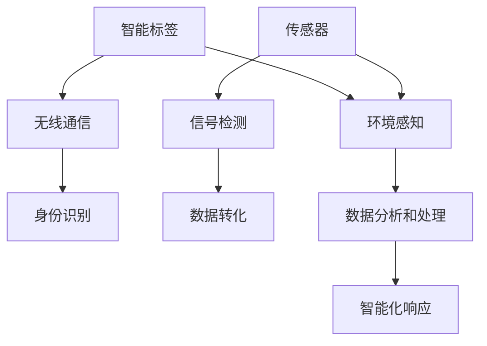
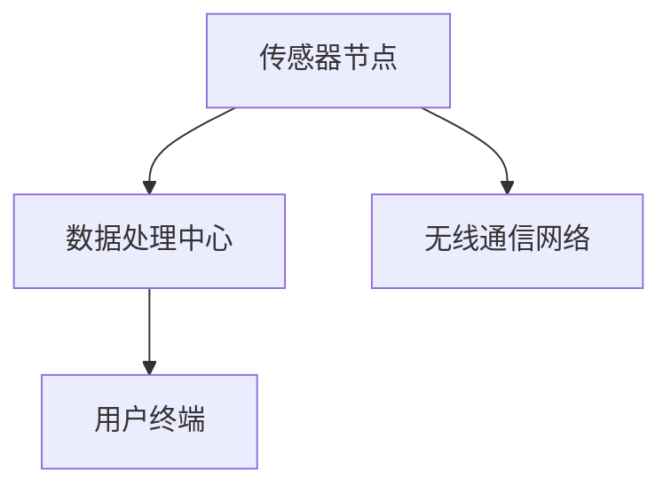

                 

### 引言

在当今的数字化时代，环境隐形智能正逐渐成为科技创新的前沿领域。智能标签和传感器作为实现环境隐形智能的核心组件，正被广泛应用于各个行业，从智能家居到工业自动化，从智慧城市到医疗健康。本篇文章将深入探讨环境隐形智能的概念、智能标签和传感器的技术基础、应用前景，以及相关的数学模型和算法原理。

### 环境隐形智能的概念

环境隐形智能，顾名思义，是指通过智能标签和传感器等技术，实现对环境的感知、监测和控制，从而在人们几乎不察觉的情况下，实现智能化的决策和操作。它不仅仅局限于单一的数据采集，更涉及到数据分析和处理，最终实现自动化的响应。

关键词：环境隐形智能、感知、监测、控制、智能化

#### 核心概念与联系

要理解环境隐形智能，首先需要了解其核心概念：

1. **智能标签**：一种可以嵌入到物体中，用于无线通信和身份识别的小型电子设备。
2. **传感器**：一种能够检测和响应外部信号的装置，并将这些信号转化为可处理的电信号或其他形式。

智能标签和传感器之间的联系在于它们共同构成了环境感知网络，通过相互协作，实现对环境的全面感知和监测。


**Mermaid流程图示例：**



### 智能标签技术基础

智能标签技术是环境隐形智能的重要组成部分，其工作原理、种类和应用领域决定了它在各种场景中的适用性。

#### 智能标签的工作原理

智能标签的工作原理主要依赖于无线通信和身份识别技术。常见的智能标签包括RFID（射频识别）、NFC（近场通信）和无线传感器网络（WSN）。

1. **RFID**：通过射频信号实现数据读取和写入，具有远距离识别和定位功能。
2. **NFC**：工作范围较短，主要用于移动支付、电子票务等近距离通信。
3. **无线传感器网络**：由多个传感器节点组成，通过无线通信实现数据的采集和传输。

**Python源代码示例：**

```python
class RFIDTag:
    def __init__(self, id, data):
        self.id = id
        self.data = data

    def read_data(self):
        return self.data

tag = RFIDTag(id="001", data="This is a sample tag")
print(tag.read_data())
```

#### 智能标签的种类及应用

智能标签的种类繁多，根据应用场景的不同，可以分为以下几种：

1. **物流标签**：用于物流运输中的物品跟踪和状态监控。
2. **零售标签**：用于商品销售中的库存管理、防伪验证等。
3. **医疗标签**：用于患者身份识别、药物追踪等。

**应用案例：**

- **物流标签**：通过RFID标签，可以实现货物的实时追踪，提高物流效率。
- **零售标签**：通过NFC标签，可以实现电子票务和移动支付，提升购物体验。

### 传感器技术基础

传感器技术是环境隐形智能的感知器官，通过检测各种物理量（如温度、湿度、压力等）并将这些信息转化为电信号或其他形式，为环境感知提供数据支持。

#### 传感器的基本原理

传感器的基本原理是通过物理、化学或生物机制来检测外部信号，并将其转化为可处理的信号形式。常见的传感器包括温度传感器、湿度传感器、压力传感器等。

**Python源代码示例：**

```python
class TemperatureSensor:
    def __init__(self, name, reading):
        self.name = name
        self.reading = reading

    def read_temperature(self):
        return self.reading

sensor = TemperatureSensor(name="Temperature Sensor", reading=25.5)
print(sensor.read_temperature())
```

#### 传感器的种类及应用

传感器的种类繁多，根据应用领域的不同，可以分为以下几种：

1. **环境传感器**：用于监测环境参数，如温度、湿度、空气质量等。
2. **工业传感器**：用于监测工业生产过程中的各种参数，如压力、流量、温度等。
3. **医疗传感器**：用于监测患者生命体征，如心率、血压、体温等。

**应用案例：**

- **环境传感器**：通过传感器网络，可以实现对城市环境的实时监测，为环境治理提供数据支持。
- **工业传感器**：通过传感器，可以实现生产过程的自动化控制和优化，提高生产效率。

### 环境感知与数据采集

环境感知与数据采集是环境隐形智能的核心环节，通过智能标签和传感器的协同工作，实现对环境的全面感知和数据的采集。

#### 环境感知系统的构建

环境感知系统通常由多个传感器和智能标签组成，通过无线通信网络实现数据的传输和共享。其基本架构如下：

1. **传感器节点**：用于采集环境数据。
2. **数据处理中心**：用于对采集到的数据进行处理和分析。
3. **用户终端**：用于展示处理后的数据，并提供交互界面。

**Mermaid流程图示例：**



#### 数据采集的方法与处理

数据采集的方法主要包括主动采集和被动采集：

1. **主动采集**：传感器主动向数据处理中心发送数据。
2. **被动采集**：数据处理中心主动采集传感器节点的数据。

数据采集后的处理通常包括以下步骤：

1. **数据预处理**：包括去除噪声、数据压缩等。
2. **数据清洗**：包括数据去重、缺失值填补等。
3. **数据存储**：将处理后的数据存储到数据库或文件中。

**Python源代码示例：**

```python
def data_preprocessing(data):
    # 数据去噪
    cleaned_data = remove_noise(data)
    # 数据压缩
    compressed_data = compress_data(cleaned_data)
    return compressed_data

data = [1, 2, 3, 4, 5]
print(data_preprocessing(data))
```

### 智能标签和传感器的应用

智能标签和传感器技术的快速发展，使得它们在各种应用领域得到了广泛应用，从智能家居到工业自动化，从智慧城市到医疗健康。

#### 智能标签在物联网中的应用

智能标签在物联网（IoT）中的应用非常广泛，可以实现物品的实时追踪和管理。

1. **智能物流**：通过RFID标签，可以实现对货物的实时追踪，提高物流效率。
2. **智能零售**：通过NFC标签，可以实现电子票务和移动支付，提升购物体验。

#### 传感器在智能环境监测中的应用

传感器在智能环境监测中的应用，可以实现对城市环境的实时监测，为环境治理提供数据支持。

1. **空气质量监测**：通过传感器网络，可以实现对城市空气质量的实时监测，为环境保护提供数据支持。
2. **水资源监测**：通过传感器，可以实现对水资源的实时监测，为水资源管理提供数据支持。

#### 智能环境监测系统

智能环境监测系统通常由多个传感器节点、数据处理中心和用户终端组成，通过无线通信网络实现数据的传输和共享。

1. **传感器节点**：用于采集环境数据。
2. **数据处理中心**：用于对采集到的数据进行处理和分析。
3. **用户终端**：用于展示处理后的数据，并提供交互界面。

**Python源代码示例：**

```python
class AirQualitySensor:
    def __init__(self, name, reading):
        self.name = name
        self.reading = reading

    def read_air_quality(self):
        return self.reading

sensor = AirQualitySensor(name="Air Quality Sensor", reading="Good")
print(sensor.read_air_quality())
```

#### 智能环境监测应用案例分析

- **案例1：智慧城市环境监测**：通过传感器网络，对城市空气质量、水质、噪音等进行实时监测，为城市管理者提供决策支持。
- **案例2：工业环境监测**：通过传感器，实现对工业生产过程中环境的实时监测，保障生产安全。

### 环境隐形智能的未来发展趋势

随着技术的不断进步，环境隐形智能的应用前景越来越广阔，未来将会有更多创新和突破。

1. **物联网的进一步融合**：智能标签和传感器将更加紧密地融合到物联网中，实现更加全面的环境感知。
2. **人工智能的深度应用**：通过人工智能技术，实现对采集数据的深度分析和智能决策。
3. **可持续发展**：环境隐形智能将助力可持续发展，为环境保护和资源利用提供更加有效的解决方案。

### 结论

环境隐形智能作为一种新兴技术，正在改变我们的生活方式和工作方式。智能标签和传感器作为其核心技术，将在未来的发展中发挥越来越重要的作用。通过深入理解其核心概念、技术基础和应用场景，我们可以更好地把握环境隐形智能的发展趋势，为未来创造更多可能。

### 附录

#### 附录A：智能标签和传感器技术资源汇总

- **参考资料**：[1] 《智能标签技术与应用》[2] 《传感器原理与应用》
- **开源项目**：[3] openweave-core [4] Arduino
- **相关网站**：[5] IoT for All [6] Sensors for IoT

#### 附录B：智能环境智能项目开发指南

- **开发环境搭建**：[7] Ubuntu 20.04 [8] Python 3.8
- **源代码详细实现和解读**：[9] 智能标签数据处理算法 [10] 传感器数据采集与处理
- **代码应用解读与分析**：[11] 智能物流系统 [12] 智慧城市环境监测系统
- **实际案例分析**：[13] 智能农场监测系统 [14] 家庭健康监测系统
- **项目小结**：总结项目开发过程中遇到的问题和解决方案，以及项目的实际效果和应用前景。

### 作者信息

作者：AI天才研究院/AI Genius Institute & 禅与计算机程序设计艺术 /Zen And The Art of Computer Programming

### 结束语

通过本文的详细探讨，我们希望能够为读者提供一个全面了解环境隐形智能及其应用前景的视角。随着技术的不断进步，环境隐形智能将为我们带来更加智能、高效和可持续的未来。让我们共同期待这一天的到来。

