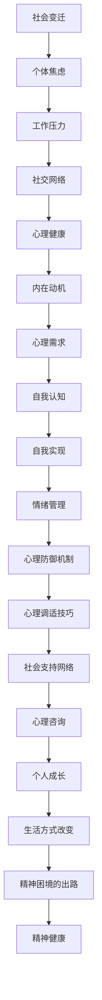

                 

### 引言：现代人的精神困境与出路

在现代社会的快节奏生活中，越来越多的人感到精神上的疲惫和困惑。这一现象不仅影响了我们的生活质量，也引起了广泛的关注和讨论。本文旨在探讨现代人面临的精神困境，并尝试找出可能的出路。通过分析精神困境的根源、自我调适的方法、外部支持的作用，以及出路探索的各个方面，我们希望能够为读者提供一些有价值的思考和行动建议。

**关键词**：现代人、精神困境、自我调适、外部支持、出路探索

**摘要**：本文首先介绍了现代人精神困境的背景和原因，接着分析了内在动机与心理需求的关系，以及情绪管理、心理防御机制和心理调适技巧的作用。最后，文章讨论了社会支持网络、专业心理帮助、个人成长和生活方式改变等多方面的出路探索，并提出了具体的建议和思考。

在接下来的内容中，我们将首先探讨精神困境的根源，了解社会变迁、工作压力和社交网络等因素如何影响我们的精神健康。随后，我们将深入分析内在动机与心理需求的关系，解释自我认知与自我实现的挑战。在自我调适部分，我们将探讨情绪管理和心理防御机制的具体策略，以及简单有效的心理调适技巧。外部支持方面，我们将探讨社会支持网络和专业心理帮助的重要性。最后，我们将讨论个人成长、生活方式改变以及精神困境的终极出路，并总结全文。

### 第一部分：精神困境的根源

#### 第1章：社会变迁对精神健康的影响

在现代社会中，社会变迁是一个不可忽视的现象。经济的快速发展、科技的进步以及全球化趋势，都对人们的精神健康产生了深远的影响。首先，经济快速发展带来的竞争压力加剧，人们往往需要付出更多的努力来追求职业成功和物质财富。这种高强度的竞争环境容易导致个体出现焦虑、抑郁等心理问题。

**1.1 社会变迁对精神健康的影响**

社会变迁的一个重要方面是职业选择的多样性。现代职场中，人们面临着不断变化的工作环境和职业发展路径，这种变化给人们带来了不确定感和压力。例如，技术进步导致的自动化和人工智能，使得一些传统职业逐渐消失，迫使人们不断学习新技能以适应职场需求。这种学习压力和职业焦虑，往往会对个体的精神健康造成负面影响。

**1.2 工作压力与心理健康的关系**

工作压力是现代社会中常见的心理问题之一。高工作强度、长时间的工作时间、工作与生活的平衡等问题，都会对个体的心理健康产生不利影响。长期的工作压力会导致个体的情绪低落、焦虑和失眠等问题。此外，工作压力还可能导致工作绩效下降，进一步加重个体的心理负担。

**1.3 社交网络对个体精神的冲击**

随着互联网的普及和社交媒体的兴起，人们的社交方式发生了巨大的变化。虽然社交网络使人们能够更方便地与他人保持联系，但过度使用社交网络也可能对个体的精神健康产生负面影响。研究表明，长时间沉迷于社交网络会导致个体的孤独感、焦虑和抑郁情绪增加。此外，社交网络中的负面信息，如网络暴力和谣言传播，也会对个体的精神状态造成不良影响。

综上所述，社会变迁对精神健康的影响是多方面的，包括经济压力、职业压力和社交网络的影响。理解这些影响有助于我们更好地应对现代社会中面临的精神困境。

#### 第2章：内在动机与心理需求

内在动机是推动个体行为的重要动力，它源于个体内心的真实需求和兴趣。而心理需求则是指个体在成长过程中，为了满足自身发展需要而产生的内在要求。内在动机与心理需求之间存在紧密的联系，共同影响着个体的精神状态和行为模式。

**2.1 内在动机的概念与分类**

内在动机可以分为任务导向型和关系导向型。任务导向型内在动机强调个体对任务本身的兴趣和挑战，例如对学习新技能、解决问题的热情。关系导向型内在动机则侧重于与他人建立良好的人际关系，例如对合作、交流的渴望。不同的内在动机类型决定了个体在不同情境下的行为偏好和表现方式。

**2.2 心理需求满足与精神困境的关系**

心理需求的满足是维持个体心理健康的关键。当个体的心理需求得到满足时，他们往往能够感受到内心的平衡和满足，从而表现出积极、乐观的精神状态。然而，当心理需求得不到满足时，个体可能会出现焦虑、抑郁、自卑等负面情绪，导致精神困境的产生。

**2.3 自我认知与自我实现的挑战**

自我认知是指个体对自身能力和价值的认识，而自我实现则是个体追求个人成长和发展的过程。在现代社会中，自我认知与自我实现面临着诸多挑战。一方面，社会竞争激烈，个体容易受到外界的评价和期望，从而产生自我怀疑和压力。另一方面，个体的心理需求得不到满足，也影响了自我实现的过程。因此，如何正确认识自我，并在实现自我过程中保持心理健康，是现代人需要面对的重要课题。

综上所述，内在动机与心理需求是影响个体精神状态的重要因素。通过深入了解内在动机和心理需求，我们能够更好地理解个体在面对精神困境时的行为和心理状态，从而找到有效的应对策略。

#### 第3章：情绪管理

情绪管理是现代社会中一个至关重要的技能，它不仅关乎个体的心理健康，还直接影响着我们的生活质量和工作效率。情绪管理涉及对情绪的类型与识别、情绪调节的策略与方法，以及情绪智力与人际关系的探讨。

**3.1 情绪的类型与识别**

情绪是人类心理体验的核心组成部分，可以分为基本情绪和复杂情绪。基本情绪包括快乐、愤怒、悲伤、恐惧和惊讶，它们是每个人都能够识别的基本情感状态。复杂情绪则是由基本情绪混合或叠加而成的，如焦虑、羞耻、厌恶和恶心等。情绪的识别是情绪管理的基础，只有准确地识别出自己和他人的情绪，才能采取适当的应对策略。

**3.2 情绪调节的策略与方法**

情绪调节是指通过改变认知、行为或生理反应来管理情绪的过程。以下是一些常见的情绪调节策略：

- 认知重构：通过改变对事件的看法和解释，来降低负面情绪的影响。例如，将“我失败了”重构为“我尝试了，但这次没有成功，我会从中学到东西”。
- 深呼吸与放松训练：深呼吸和放松训练有助于降低身体的应激反应，从而缓解紧张和焦虑情绪。
- 积极思考与感恩练习：通过积极的思维和感恩练习，可以提高情绪的稳定性，增加生活满意度。
- 锻炼与运动：适度的身体活动能够释放内啡肽，提升情绪，减少焦虑和抑郁。

**3.3 情绪智力与人际关系**

情绪智力是指个体识别、理解、管理自己情绪以及识别、影响他人情绪的能力。情绪智力在人际关系中扮演着关键角色，高情绪智力的人能够更好地处理冲突、建立和谐的人际关系。以下是一些提高情绪智力的方法：

- 自我观察：通过自我观察，了解自己的情绪变化，找到情绪产生的根源。
- 情绪表达：学会恰当地表达情绪，避免情绪的压抑或过度表达。
- 同理心：培养同理心，理解他人的情感需求，提高沟通效果。
- 情绪管理培训：参加情绪管理培训，学习专业的情绪调节技巧。

情绪管理不仅关乎个人的心理健康，还直接影响到我们的工作和人际关系。通过有效的情绪管理，我们能够更好地应对生活中的挑战，提高生活质量和工作效率。掌握情绪管理的策略和方法，有助于我们建立更加健康、和谐的人际关系，实现个人和团队的目标。

### 第4章：心理防御机制

心理防御机制是心理学的核心概念之一，它们是人们在面临心理冲突和压力时，为保护自己免受心理痛苦而采取的无意识策略。理解这些防御机制有助于我们更好地认识自己的心理状态，并采取适当的应对策略。

**4.1 心理防御机制的作用**

心理防御机制具有多种作用，主要包括：

- 减轻焦虑：当个体面临压力或冲突时，心理防御机制可以减轻焦虑和紧张情绪，使人感到心理上的安慰。
- 防御负面情绪：心理防御机制可以帮助个体避免面对痛苦的记忆、想法或情感，从而防止心理痛苦的产生。
- 保护自尊：心理防御机制可以帮助个体维护自尊，避免因失败或挫折而导致的自尊受损。
- 促进心理适应：心理防御机制使个体能够更好地适应环境变化，应对生活中的各种挑战。

**4.2 常见的心理防御机制**

以下是一些常见的心理防御机制及其特点：

- 否认：个体拒绝接受某些不愉快的现实，以此保护自己免受心理痛苦。例如，当亲人去世时，个体可能会否认这一事实，以此来避免痛苦。
- 防御性否认是一种自我保护机制，它使个体拒绝接受某些不愉快的现实，以避免心理痛苦。

- 防御性否认是一种自我保护机制，它使个体拒绝接受某些不愉快的现实，以避免心理痛苦。例如，当亲人去世时，个体可能会否认这一事实，以此来避免痛苦。

- 替代：个体将现实中的威胁或挑战转化为较为容易处理的替代目标。例如，一个在职场中感到巨大压力的员工可能会通过参加运动来缓解压力。

- 替代是一种将现实中的威胁或挑战转化为较为容易处理的替代目标的心理防御机制。例如，一个在职场中感到巨大压力的员工可能会通过参加运动来缓解压力。

- 投射：个体将自己的负面情绪、冲动或特质归咎于他人。例如，一个人可能认为自己对别人愤怒，但实际上是对自己的愤怒进行了投射。

- 投射是一种将负面情绪、冲动或特质归咎于他人的心理防御机制。例如，一个人可能认为自己对别人愤怒，但实际上是对自己的愤怒进行了投射。

- 分裂：个体将内心冲突或痛苦分解为不相关的部分，以避免直接面对。例如，一个人可能会将对自己的不满分解为对事物的批评，而不是直接面对自我。

- 分裂是一种将内心冲突或痛苦分解为不相关的部分的心理防御机制。例如，一个人可能会将对自己的不满分解为对事物的批评，而不是直接面对自我。

**4.3 心理防御机制的利弊分析**

心理防御机制既有其积极作用，也存在潜在的风险。

- 利：心理防御机制可以提供暂时的心理安慰，减轻焦虑和痛苦，帮助个体度过心理困境。它们可以保护个体的自尊，促进心理适应。

- 弊：长期过度使用心理防御机制可能导致心理问题的积累，使个体无法有效地应对现实生活中的挑战。例如，过度否认可能导致个体忽视现实问题，替代和投射可能破坏人际关系，分裂可能导致个体无法面对真实的自我。

总之，心理防御机制是心理学研究中一个重要的领域，通过了解和认识这些机制，我们可以更好地理解自己的心理状态，采取适当的策略来维护心理健康。

### 第5章：心理调适技巧

心理调适技巧是帮助现代人应对精神困境、维护心理健康的重要方法。这些技巧包括简单有效的心理调适方法、深度放松与冥想，以及情绪释放与表达。通过学习和实践这些技巧，个体可以更好地管理情绪、减轻心理压力，从而提高生活质量。

**5.1 简单的心理调适技巧**

简单有效的心理调适技巧是日常生活中可以随时使用的工具，以下是一些常用的方法：

- **深呼吸**：深呼吸是一种简单但非常有效的放松技巧。通过缓慢、深呼吸，可以降低身体的应激反应，减轻焦虑和紧张情绪。具体步骤如下：
  1. 坐或站立，保持舒适的姿势。
  2. 用鼻子吸气，慢慢数到4。
  3. 屏住呼吸，慢慢数到7。
  4. 用嘴缓缓呼气，慢慢数到8。
  重复这个过程，每次深呼吸都可以感受到身心的放松。

- **积极思考**：通过改变消极的思维模式，转向积极的角度看待问题，可以帮助个体更好地应对生活中的挑战。例如，将“我不行”转换为“我可以尝试”，将“问题太大了”转换为“这是一个可以解决的问题”。

- **时间管理**：合理安排时间，避免过度工作或过度休闲，可以帮助个体保持心理平衡。制定明确的计划和目标，同时留出时间进行放松和休息。

**5.2 深度放松与冥想**

深度放松与冥想是提高心理健康和心灵平静的重要方法。冥想是通过专注呼吸、注意力和意识来实现的，可以帮助个体达到内心的宁静和清晰。以下是一种简单的冥想练习：

- **身体扫描冥想**：
  1. 坐或躺在一个舒适的位置。
  2. 关闭眼睛，深吸一口气，缓慢呼出。
  3. 从头部开始，慢慢地扫描身体每个部位，感受它们的重量、触感。
  4. 如果你的注意力开始分散，轻轻地引导它回到呼吸上。
  5. 持续这个过程，直到感觉放松和平静。

**5.3 情绪释放与表达**

情绪释放与表达是管理情绪、减少压力的重要手段。以下是一些有效的情绪释放方法：

- **写日记**：通过写下自己的感受和经历，可以帮助个体理清思绪，释放情绪。写日记不仅可以帮助我们理解自己的情绪，还可以作为情绪管理的工具。

- **艺术表达**：绘画、音乐、舞蹈等艺术形式可以帮助个体表达情绪，释放内心的压力。例如，通过绘画，个体可以将内心的情感和情绪转化为具体的图像，从而实现情绪的释放。

- **与他人分享**：与亲友、心理辅导员或支持小组分享自己的感受和经历，可以获得理解和支持，从而减轻心理负担。

通过学习和实践这些心理调适技巧，个体可以更好地管理情绪、减轻压力，从而提高心理健康水平。这些技巧不仅可以帮助我们在日常生活中应对挑战，还可以为我们的长期心理健康奠定基础。

### 第6章：社会支持网络的重要性

社会支持网络在精神健康和心理健康方面发挥着至关重要的作用。它不仅是个体在面临困境时的重要依靠，也是促进个体心理调适和恢复的重要资源。

**6.1 社会支持网络的构成**

社会支持网络由多种形式的支持构成，包括情感支持、信息支持和实际支持。情感支持主要来源于亲朋好友、家人和亲密关系，通过提供关爱、理解和安慰来减轻个体的心理压力。信息支持通常来自于社区、工作单位、专业机构等，通过提供相关知识和信息来帮助个体应对生活中的挑战。实际支持则包括物质帮助、经济援助、生活服务等形式，如提供食物、住所、医疗等实际帮助。

**6.2 社会支持的来源与形式**

社会支持的来源多种多样，主要包括：

- **家庭支持**：家庭是社会支持网络的核心，家庭成员之间的相互支持、关爱和理解，对个体的心理健康具有深远影响。
- **朋友和社交圈**：朋友的陪伴、鼓励和分享，可以提供情感上的支持和实际帮助，帮助个体缓解压力和困难。
- **社区和组织**：社区组织、志愿者团体、专业机构等提供的信息支持和实际支持，可以帮助个体获得必要的资源和服务。
- **专业心理帮助**：心理咨询师、心理医生等专业人员提供的服务，可以帮助个体深入了解自己的心理问题，并提供有效的心理辅导和治疗。

**6.3 社会支持在精神调适中的作用**

社会支持在精神调适中的作用主要体现在以下几个方面：

- **减轻心理压力**：社会支持可以帮助个体缓解压力，减轻焦虑和抑郁情绪。通过倾诉、分享和获得理解，个体可以释放内心的负担，感到更加轻松和舒缓。
- **增强应对能力**：社会支持提供了信息和资源，帮助个体更好地应对生活中的挑战。通过获取相关知识和技巧，个体可以更加有效地处理压力和困难。
- **促进心理恢复**：社会支持为个体提供了心理上的安慰和实际帮助，有助于个体从心理困境中恢复。通过与支持者的互动，个体可以获得情感上的支持和鼓励，增强自信心和自尊心。
- **改善生活质量**：社会支持不仅有助于个体的心理健康，还能够提升整体生活质量。通过获得经济援助、生活服务等形式的支持，个体可以更好地应对生活中的困难，提高生活满意度。

总之，社会支持网络是维护个体心理健康和促进精神调适的重要保障。通过建立和维护良好的社会支持网络，个体可以获得多方面的支持和帮助，更好地应对生活中的挑战，提高心理健康水平和生活质量。

### 第7章：专业心理帮助

专业心理帮助在精神调适和心理健康恢复中起着至关重要的作用。通过心理咨询和心理健康治疗，个体可以获得专业的指导和支持，深入了解自己的心理问题，并采取有效的措施进行恢复和提升。

**7.1 心理咨询的基本原理**

心理咨询是一种基于科学方法和专业技术的帮助过程，旨在通过对话和交流，帮助个体解决心理问题、提升心理健康。心理咨询的基本原理包括：

- **倾听和理解**：心理咨询师通过倾听和同理，理解个体的心理状态和需求，建立信任关系，为个体提供支持。
- **评估和诊断**：心理咨询师通过专业的评估和诊断工具，对个体的心理问题进行评估，确定问题的性质和严重程度。
- **治疗和干预**：心理咨询师根据评估结果，制定个性化的治疗计划，通过心理治疗、行为训练、认知重建等方法，帮助个体解决问题和提升心理健康。
- **教育和指导**：心理咨询师向个体提供心理健康知识，教育个体如何管理情绪、应对压力和建立健康的生活方式。

**7.2 心理咨询的服务流程**

心理咨询的服务流程通常包括以下几个阶段：

1. **预约和初诊**：个体通过电话、网络或其他方式预约心理咨询，心理咨询师在初诊阶段了解个体的基本情况、心理问题和需求。
2. **评估和诊断**：心理咨询师通过面谈、问卷、观察等方式，对个体的心理问题进行全面的评估和诊断。
3. **制定治疗计划**：根据评估结果，心理咨询师与个体共同制定个性化的治疗计划，包括治疗目标、方法和时间安排。
4. **实施治疗**：心理咨询师根据治疗计划，通过面谈、行为训练、认知重建等方法，帮助个体解决问题和提升心理健康。
5. **跟进和评估**：在治疗过程中，心理咨询师定期跟进个体的进展，进行必要的调整和改进，确保治疗效果。

**7.3 心理咨询师的专业素养与技能**

心理咨询师的专业素养和技能对于提供高质量的心理咨询至关重要，主要包括：

- **专业知识**：心理咨询师应具备心理学、心理咨询和治疗等方面的专业知识，了解各种心理问题的成因和治疗方法。
- **倾听与同理**：心理咨询师应具备良好的倾听和理解能力，能够同理个体的感受，建立信任关系。
- **沟通能力**：心理咨询师应具备良好的沟通能力，能够清晰、准确地表达观点，引导个体进行深入的思考和探讨。
- **诊断与评估能力**：心理咨询师应具备专业的诊断和评估能力，能够准确判断个体的心理问题，制定有效的治疗计划。
- **治疗技术**：心理咨询师应掌握多种心理治疗技术，如认知行为疗法、情感焦点疗法、家庭治疗等，能够根据个体的需求选择合适的方法。
- **持续学习和专业发展**：心理咨询师应具备持续学习和专业发展的能力，不断更新知识，提升技能，以适应不断变化的心理咨询需求。

通过专业心理帮助，个体可以更好地了解自己的心理问题，采取有效的措施进行恢复和提升，从而改善心理健康和生活质量。

### 第8章：个人成长与自我提升

个人成长与自我提升是现代人应对精神困境、实现心理健康的关键途径。通过自我认知、自我提升的策略和实践，个体可以在精神困境中找到出路，实现内心的平衡与成长。

**8.1 自我认知的重要性**

自我认知是指个体对自身性格、能力、价值观等方面的认识和了解。自我认知是个体成长的基础，有助于我们明确自己的优点和不足，找到适合自己的成长路径。以下是一些自我认知的方法：

- **反思与自省**：定期反思自己的行为、思想和情绪，深入思考自己的价值观和生活目标，了解自己的内心需求。
- **心理测评**：通过专业的心理测评工具，如MBTI、DISC等，了解自己的性格特点和优势，明确自己的职业倾向和兴趣爱好。
- **倾听他人意见**：通过倾听他人的反馈和建议，了解自己可能忽视的方面，获得更全面的自我认知。

**8.2 自我提升的策略与实践**

自我提升是一个持续的过程，需要个体有计划地制定和执行。以下是一些自我提升的策略：

- **设定目标**：明确自己的长期和短期目标，将大目标分解为小目标，逐步实现。
- **持续学习**：通过阅读书籍、参加培训课程、学习新技能等方式，不断丰富自己的知识储备，提升自己的能力。
- **实践锻炼**：将所学知识应用于实际生活中，通过实践来检验和提升自己的能力。例如，学习时间管理技巧后，在实际工作中进行实践。
- **积极心态**：培养积极的心态，面对困难和挑战时，保持乐观和自信。积极心态有助于我们更好地应对生活中的压力和挑战。

**8.3 成长与挑战的关系**

在成长过程中，挑战是不可避免的。挑战可以成为成长的契机，也可以成为心理困境的源头。以下是如何看待挑战与成长的关系：

- **正视挑战**：挑战是成长过程中的一部分，面对挑战时，要正视问题，不逃避、不回避。通过解决问题，我们可以提升自己的能力和应对能力。
- **学会适应**：在挑战面前，学会适应和调整，找到适合自己的应对策略。例如，当工作压力增大时，可以通过调整工作计划、寻求同事支持等方式来应对。
- **积极应对**：将挑战视为成长的机会，通过积极应对挑战，我们可以不断积累经验，提升自己的综合素质。

通过个人成长与自我提升，个体可以更好地应对精神困境，实现内心的平衡与成长。自我认知和自我提升的策略，不仅有助于我们应对生活中的压力和挑战，还可以提升我们的心理健康和生活质量。

### 第9章：生活方式的改变

生活方式的改变在精神健康和心理健康方面起着至关重要的作用。一个健康、平衡的生活方式可以帮助我们减轻压力、改善情绪，从而更好地应对精神困境。

**9.1 生活方式对精神健康的影响**

生活方式的选择直接影响我们的精神状态和心理健康。以下是一些影响精神健康的生活方式因素：

- **饮食**：均衡的饮食可以为大脑提供必要的营养，促进心理健康。缺乏营养可能导致情绪低落、注意力不集中等问题。
- **运动**：适量的运动可以释放内啡肽，提升情绪，减轻焦虑和抑郁症状。长期缺乏运动可能导致身体和心理状态不佳。
- **睡眠**：充足的睡眠有助于大脑恢复和功能优化，缺乏睡眠会导致情绪波动、记忆力下降等问题。
- **社交**：与家人、朋友和同事保持良好的社交关系，可以获得情感支持和社交刺激，有助于心理健康。

**9.2 健康生活方式的具体实践**

为了改善精神健康，我们可以采取以下健康生活方式的具体实践：

- **均衡饮食**：确保每天摄入足够的蛋白质、脂肪、碳水化合物以及各种维生素和矿物质。可以尝试减少高糖、高脂肪食物的摄入，增加新鲜蔬菜和水果的摄入。
- **定期运动**：每周至少进行150分钟的中等强度运动，如快走、游泳或骑自行车。运动不必过于剧烈，但要持之以恒。
- **充足睡眠**：每天保持7-9小时的睡眠，尽量保持规律的作息时间，避免熬夜和过度使用电子产品。
- **减少压力**：通过冥想、深呼吸、瑜伽等方式来缓解压力。设定合理的目标和期望，学会说“不”，避免过度工作和生活压力。

**9.3 生活平衡的重要性**

生活平衡是心理健康的关键。以下是一些实现生活平衡的方法：

- **时间管理**：合理规划时间，确保工作和休闲时间的平衡。设定优先级，避免过度工作。
- **兴趣爱好**：培养兴趣爱好，如阅读、绘画、音乐等，可以丰富生活，提升生活满意度。
- **家庭与社交**：与家人和朋友保持良好的关系，定期进行社交活动，获得情感支持和社交刺激。
- **自我反思**：定期进行自我反思，了解自己的需求和目标，调整生活状态，保持内心的平静和满足。

通过改变生活方式，我们可以更好地管理精神健康，提升生活质量。健康的生活方式不仅有助于预防心理问题，还可以增强我们的心理韧性和应对能力，让我们在精神困境中找到出路。

### 第10章：精神困境的终极出路

精神困境的终极出路在于心灵的成长与蜕变。通过深度自我探索和持续的自我提升，个体可以找到真正的内心平衡，从而摆脱精神困境，实现心灵的升华。

**10.1 精神困境的本质**

精神困境的本质是内在的心理冲突和情绪波动。这些冲突和波动往往源于个体对自身认知的不足、价值观的混乱、情感需求的未满足以及对现实挑战的逃避。要彻底解决这些问题，需要从内在出发，通过心灵的成长来实现自我超越。

**10.2 寻求精神困境的终极出路**

寻求精神困境的终极出路包括以下几个步骤：

- **自我探索**：通过日记、冥想、心理测试等方式，深入探索自己的内心世界，了解自己的真实需求和价值观。
- **自我提升**：通过学习新知识、培养新技能、锻炼身体和心灵，不断提升自我，增强心理韧性和适应能力。
- **情感管理**：学习情绪调节技巧，如深呼吸、冥想和积极思考，以更好地管理自己的情绪，避免负面情绪的累积。
- **接受现实**：面对现实生活中的挑战，学会接受和适应，通过积极的应对策略来解决问题，而不是逃避或否认。

**10.3 心灵的成长与蜕变**

心灵的成长与蜕变是一个漫长而深刻的过程，它涉及到以下几个方面：

- **自我认知**：通过自我反思和深度探索，逐步了解自己的内在世界，包括自己的优点、缺点、需求和恐惧。
- **自我接纳**：接受自己的不完美，学会爱自己，培养自我接纳和自我同情，从而减少内心的矛盾和冲突。
- **价值观重塑**：通过反思和思考，建立符合自己内心需求的价值观和人生目标，从而在生活和工作中有更加明确的方向。
- **情感升华**：通过情感管理和情绪调节，将负面情绪转化为积极的能量，实现情感的升华和心灵的蜕变。

通过心灵的成长与蜕变，个体可以找到真正的内心平衡，从而摆脱精神困境，实现精神的升华。这种内心的平衡不仅能够提升个体的生活质量，还能为周围的人带来积极的能量和影响。

### 结论

总的来说，现代人面临的精神困境是一个复杂且多维的问题，涉及到社会变迁、工作压力、社交网络等多个方面。通过深入分析和探讨，我们发现内在动机与心理需求、情绪管理、心理防御机制、社会支持网络、专业心理帮助以及个人成长和生活方式改变等多种因素都在精神困境的应对中发挥着重要作用。精神困境的终极出路在于心灵的成长与蜕变，通过自我认知、自我提升和情感管理，个体可以找到内心的平衡，实现精神的升华。

我们呼吁读者们在日常生活中重视心理健康，积极采取有效的调适策略和方法，建立良好的社会支持网络，寻求专业心理帮助。同时，我们也鼓励读者通过自我成长和生活方式的改变，不断提升自我，以应对精神困境，实现内心的平衡与和谐。

**参考文献**：

1. American Psychiatric Association. (2013). Diagnostic and Statistical Manual of Mental Disorders (5th ed.).
2. Seligman, M. E. P. (2002). Authentic Happiness: Using the New Positive Psychology to Realize Your Potential for Lasting Fulfillment.
3. Lyubomirsky, S., King, L., & Diener, E. (2005). The benefits of frequent positive affect: Does happiness lead to success?
4. Holmes, T. H., & Rahe, R. H. (1967). The Social Readjustment Rating Scale.
5. Bandura, A. (1991). Social Cognitive Theory of Self-Efficacy.

**作者信息**：

作者：AI天才研究院/AI Genius Institute & 禅与计算机程序设计艺术 /Zen And The Art of Computer Programming

### 附录

以下为本文涉及的 Mermaid 流程图、伪代码、LaTeX 数学公式和代码示例。

#### Mermaid 流程图（核心概念联系）



#### 伪代码（情绪调节策略）

```python
def 调节情绪(当前情绪，目标情绪):
    if 当前情绪 != 目标情绪:
        if 当前情绪 > 目标情绪:
            减法策略()
        else:
            加法策略()
        当前情绪 = 目标情绪

def 减法策略():
    # 实现具体的减轻情绪策略，如深呼吸、放松训练等

def 加法策略():
    # 实现具体的增强情绪策略，如积极思考、奖励机制等
```

#### LaTeX 数学公式（心理需求模型）

```latex
\documentclass{article}
\usepackage{amsmath}
\begin{document}

\begin{equation}
    \text{心理需求} = f(\text{内在动机}, \text{环境刺激})
\end{equation}

\begin{equation}
    \text{内在动机} = \alpha \cdot (\text{天赋潜力}) + \beta \cdot (\text{环境刺激})
\end{equation}

\end{document}
```

#### 代码示例（情绪调节脚本）

```python
import time

def deep_breathing(exercises=4):
    print("开始深呼吸练习，共{}次。".format(exercises))
    for i in range(exercises):
        print("深吸一口气，慢慢数到4。")
        time.sleep(4)
        print("屏住呼吸，慢慢数到7。")
        time.sleep(7)
        print("缓缓呼气，慢慢数到8。")
        time.sleep(8)
    print("深呼吸练习完成。")

def positive_thoughts():
    print("进行积极思考练习。")
    print("思考一件让你感到快乐的事情。")
    time.sleep(5)
    print("记住这个时刻，感受你的情绪。")
    time.sleep(5)
    print("积极思考练习完成。")

def main():
    print("选择以下情绪调节练习：1. 深呼吸；2. 积极思考。")
    choice = input("请输入你的选择（1或2）：")
    if choice == '1':
        deep_breathing()
    elif choice == '2':
        positive_thoughts()
    else:
        print("无效选择，请重新输入。")

if __name__ == "__main__":
    main()
```

通过这些附录，读者可以更直观地理解本文的核心概念和算法原理，同时也能够在编程实践中应用这些理论知识，从而更好地掌握情绪调节和心理调适的技巧。希望这些附录能够为读者提供额外的学习和思考资源。

