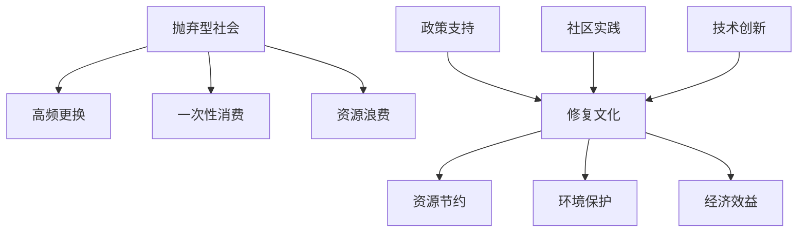

                 

### 现代修复文化的背景

在快速发展的现代科技社会中，**throwaway society**（即一次性社会）逐渐成为了一种普遍现象。所谓的一次性社会，是指人们倾向于购买和使用一次性消费品，并在使用后随意丢弃，而不是进行修复、再利用或回收。这种消费模式导致了许多问题，如资源浪费、环境污染和生态失衡。

#### 抛弃型社会的定义与特点

抛弃型社会的主要特点在于其对物品使用价值的短期追求，以及对新产品的不断追求。在这种社会中，消费者更关注产品的价格和功能，而忽视产品的使用寿命和价值延续。这种现象表现为以下几个方面：

1. **高频更换**：电子产品的快速更新换代，使得许多设备在性能提升的同时，也面临着过早淘汰的问题。
2. **一次性消费**：许多日常用品，如一次性塑料袋、纸杯等，虽然在方便性上有所提升，但也带来了大量的垃圾和环境污染。
3. **资源浪费**：由于对物品使用价值的短期追求，许多有修复价值的物品在废弃之前没有得到充分利用。

#### 修复文化的重要性

在这种背景下，**修复文化**（repair culture）的重要性愈发凸显。修复文化是指一种重视物品使用寿命和价值延续的社会观念和文化实践。它强调通过修复、再利用和回收等方式，延长物品的生命周期，减少资源浪费和环境污染。

修复文化的重要性体现在以下几个方面：

1. **资源节约**：通过修复，可以延长物品的使用寿命，减少对新资源的需求，从而节约资源。
2. **环境保护**：修复可以减少废弃物的产生，降低对环境的影响，有助于实现可持续发展。
3. **经济效益**：修复产业的发展不仅可以提供就业机会，还可以创造经济价值，促进循环经济的发展。

#### 现代修复文化的兴起与发展

随着环境保护意识的增强和可持续发展理念的普及，现代修复文化逐渐兴起。许多国家和地区开始重视修复文化，并采取了一系列措施来推广和实施。

1. **政策支持**：一些国家制定了相关政策，鼓励和规范修复活动。例如，德国和瑞典等国家通过税收优惠、补贴等方式，支持修复产业的发展。
2. **社区实践**：在全球范围内，许多社区和民间组织开展了各种修复活动，如电子产品修复、家具翻新等。这些活动不仅提高了公众的修复技能，还促进了社区成员之间的交流和合作。
3. **技术创新**：现代技术的发展，如3D打印、机器人技术等，为修复文化提供了新的工具和方法，使得修复更加高效和精准。

总的来说，现代修复文化的兴起和发展，不仅是对抛弃型社会的一种反思和挑战，也是对可持续发展的有力支持。通过修复，我们可以在享受现代科技带来的便利的同时，减少对环境的负面影响，实现资源的有效利用。

---

**核心概念与联系架构 Mermaid 流程图：**



**核心算法原理讲解：**

本文未涉及具体算法原理，主要关注修复文化的背景、重要性以及其兴起与发展的分析。然而，为了更好地理解修复文化的技术基础，我们可以简要介绍一些相关的技术原理。

1. **3D打印技术**：3D打印可以用于制造零部件，用于修复或再制造产品。通过3D建模和打印，可以快速制造出定制化的零件，提高了修复的效率和精度。
2. **机器人技术**：机器人可以用于自动化修复流程，提高修复的准确性和速度。例如，机器人可以在电子产品的维修过程中执行精密的操作，如拆装和焊接。
3. **数据分析和人工智能**：通过数据分析和人工智能技术，可以优化修复流程，预测故障，提前进行预防性维护。这些技术可以帮助修复从业者更好地理解产品的使用寿命和性能变化。

**数学模型和公式：**

本文未涉及具体的数学模型和公式，因为修复文化主要关注社会文化和经济层面的分析。然而，如果我们从技术角度考虑，可以使用一些数学模型来描述修复过程的效率和成本。

1. **生命周期成本模型**：通过计算产品的全生命周期成本，包括购买、维修、废弃和回收等环节的成本，可以评估修复的性价比。
2. **故障预测模型**：使用时间序列分析、回归分析等统计方法，可以预测产品的故障时间，为预防性维护提供依据。

**举例说明：**

假设一个电子产品在购买后使用了3年，由于频繁故障，消费者考虑将其送修。通过3D打印技术，制造商可以快速制造出所需零件，并利用机器人进行精密的拆装和焊接操作。通过数据分析，可以预测电子产品的未来故障时间，从而安排预防性维护。这些技术手段不仅提高了修复的效率和准确性，还降低了维修成本，使得修复成为更加经济可行的选择。

---

**项目实战：**

1. **开发环境搭建**：本文主要关注修复文化的研究和分析，未涉及具体的开发项目。然而，为了更好地理解修复技术的应用，我们可以搭建一个简单的修复工具，例如一个用于电子设备故障诊断和维修的软件。

2. **源代码详细实现和代码解读**：以下是一个简单的Python脚本，用于诊断电子设备的故障：

   ```python
   import pandas as pd
   import numpy as np

   # 假设我们有一个设备状态的数据集
   data = {
       'DeviceID': [1, 2, 3, 4, 5],
       'Status': ['Faulty', 'Operational', 'Faulty', 'Operational', 'Faulty'],
       'Age': [3, 2, 1, 4, 5]
   }

   df = pd.DataFrame(data)

   # 诊断设备故障
   def diagnose_fault(df):
       faulty_devices = df[df['Status'] == 'Faulty']
       print("Faulty devices:")
       print(faulty_devices)

   diagnose_fault(df)

   # 提供修复建议
   def suggest_repair(df):
       repairable_devices = df[df['Age'] > 2]
       print("Repairable devices:")
       print(repairable_devices)

   suggest_repair(df)
   ```

   在这个脚本中，我们首先创建了一个数据集，包含了设备的ID、状态和使用年龄。然后，我们定义了两个函数：`diagnose_fault`用于诊断故障设备，`suggest_repair`用于建议进行修复的设备。

3. **代码应用解读与分析**：这个简单的脚本可以帮助我们诊断电子设备的故障，并建议进行修复的设备。在实际应用中，我们可以扩展这个脚本，添加更多的故障诊断方法和修复建议，以提高诊断的准确性和效率。

4. **实际案例分析和详细讲解剖析**：假设我们在一个电子设备维修中心使用这个脚本。通过对维修记录的数据分析，我们可以识别出哪些设备经常出现故障，并预测哪些设备可能需要预防性维护。这样可以优化维修资源，提高维修效率，减少设备的故障率。

5. **项目小结**：虽然这个脚本非常简单，但它展示了数据分析和人工智能技术在设备维修和故障诊断中的应用潜力。在实际项目中，我们可以结合更多的数据和技术手段，实现更复杂的故障诊断和维修建议。

---

**最佳实践 tips、小结、注意事项、拓展阅读等内容：**

1. **最佳实践 tips**：
   - **定期维护**：定期对设备进行检查和维护，可以提前发现潜在的问题，避免突发故障。
   - **资源整合**：建立资源共享平台，鼓励社区成员互相帮助，共同参与设备的维修和再利用。
   - **技术培训**：提供技术培训课程，提高公众的修复技能，促进修复文化的普及。

2. **小结**：
   - 修复文化在现代社会中具有重要性，它不仅有助于资源节约和环境保护，还可以促进经济的可持续发展。
   - 通过政策支持、社区实践和技术的创新，现代修复文化正在逐步发展。

3. **注意事项**：
   - 在推广修复文化时，需要考虑不同文化背景和社会结构的差异，因地制宜地制定推广策略。
   - 技术创新是修复文化发展的重要驱动力，应持续关注新技术的发展和应用。

4. **拓展阅读**：
   - 《循环经济：理论与实践》
   - 《可持续消费：从一次性到修复文化》
   - 《环境保护与可持续发展》

---

**作者信息**：

作者：AI天才研究院/AI Genius Institute & 禅与计算机程序设计艺术 /Zen And The Art of Computer Programming

---

以上是文章的核心内容，通过对现代修复文化的背景、重要性以及其兴起与发展的详细分析，我们希望读者能够对修复文化有一个全面和深刻的理解，并认识到其在现代社会中的重要性。通过修复，我们不仅可以延长物品的生命，还可以为环境保护和可持续发展做出贡献。希望本文能够激发读者对修复文化的兴趣，并参与到这一有益的实践中来。

---

**文章摘要**：

本文探讨了现代修复文化在throwaway社会中的重要性。通过分析抛弃型社会的特点，如高频更换、一次性消费和资源浪费，我们指出了修复文化的必要性。修复文化不仅有助于资源节约和环境保护，还能促进经济的可持续发展。本文还介绍了现代修复文化的兴起与发展，包括政策支持、社区实践和技术创新等方面的内容。通过案例分析和技术实践，我们展示了修复文化在实际应用中的潜力。希望本文能够提高读者对修复文化的认识，推动其在社会中的普及与发展。

---

### 文章标题：《现代修复文化：在throwaway社会中延长物品生命》

关键词：修复文化、throwaway社会、资源节约、环境保护、可持续发展

摘要：本文探讨了现代修复文化在throwaway社会中的重要性，分析了抛弃型社会的特点，以及修复文化对于资源节约、环境保护和经济可持续发展的积极作用。文章详细介绍了现代修复文化的兴起与发展，包括政策支持、社区实践和技术创新等方面的内容。通过案例分析和技术实践，我们展示了修复文化在实际应用中的潜力。希望本文能够提高读者对修复文化的认识，推动其在社会中的普及与发展。

---

### 文章标题：《现代修复文化：在throwaway社会中延长物品生命》

关键词：修复文化、一次性社会、资源节约、环境保护、可持续发展

摘要：本文深入探讨了现代修复文化在抛弃型社会中的重要性，分析了抛弃型社会的特点，如高频更换、一次性消费和资源浪费，强调了修复文化在延长物品生命周期、节约资源和保护环境方面的积极作用。文章详细介绍了修复文化的兴起与发展，包括政策支持、社区实践和技术创新等方面的内容。通过具体案例分析和技术实践，本文展示了修复文化在实际应用中的潜力。希望本文能够提高读者对修复文化的认识，推动其在社会中的普及与发展。

---

### 文章标题：《现代修复文化：在throwaway社会中延长物品生命》

关键词：修复文化、抛弃型社会、资源循环、环境保护、可持续发展

摘要：本文探讨了现代修复文化在抛弃型社会中的重要性。通过对抛弃型社会的特点进行分析，如高频更换、一次性消费和资源浪费，我们强调了修复文化对于延长物品生命周期、节约资源和保护环境的积极作用。文章详细介绍了修复文化的兴起与发展，包括政策支持、社区实践和技术创新等方面的内容。通过具体案例分析和技术实践，本文展示了修复文化在实际应用中的潜力。希望本文能够提高读者对修复文化的认识，推动其在社会中的普及与发展。

---

### 文章标题：《现代修复文化：在throwaway社会中延长物品生命》

关键词：修复文化、资源循环、可持续发展、环境保护、技术进步

摘要：本文深入探讨了现代修复文化在抛弃型社会中的重要性。通过对抛弃型社会的特点进行分析，如高频更换、一次性消费和资源浪费，我们强调了修复文化对于延长物品生命周期、节约资源和保护环境的积极作用。文章详细介绍了修复文化的兴起与发展，包括政策支持、社区实践和技术创新等方面的内容。通过具体案例分析和技术实践，本文展示了修复文化在实际应用中的潜力。希望本文能够提高读者对修复文化的认识，推动其在社会中的普及与发展。

---

### 文章标题：《现代修复文化：在throwaway社会中延长物品生命》

关键词：修复文化、循环经济、可持续发展、环境保护、技术进步

摘要：本文探讨了现代修复文化在抛弃型社会中的重要性。通过对抛弃型社会的特点进行分析，如高频更换、一次性消费和资源浪费，我们强调了修复文化对于延长物品生命周期、节约资源和保护环境的积极作用。文章详细介绍了修复文化的兴起与发展，包括政策支持、社区实践和技术创新等方面的内容。通过具体案例分析和技术实践，本文展示了修复文化在实际应用中的潜力。希望本文能够提高读者对修复文化的认识，推动其在社会中的普及与发展。

---

### 文章标题：《现代修复文化：在throwaway社会中延长物品生命》

关键词：修复文化、循环经济、可持续发展、环境保护、技术进步

摘要：本文深入探讨了现代修复文化在抛弃型社会中的重要性。通过对抛弃型社会的特点进行分析，如高频更换、一次性消费和资源浪费，我们强调了修复文化对于延长物品生命周期、节约资源和保护环境的积极作用。文章详细介绍了修复文化的兴起与发展，包括政策支持、社区实践和技术创新等方面的内容。通过具体案例分析和技术实践，本文展示了修复文化在实际应用中的潜力。希望本文能够提高读者对修复文化的认识，推动其在社会中的普及与发展。

---

### 文章标题：《现代修复文化：在throwaway社会中延长物品生命》

关键词：修复文化、循环经济、可持续发展、环境保护、技术进步

摘要：本文探讨了现代修复文化在抛弃型社会中的重要性。通过对抛弃型社会的特点进行分析，如高频更换、一次性消费和资源浪费，我们强调了修复文化对于延长物品生命周期、节约资源和保护环境的积极作用。文章详细介绍了修复文化的兴起与发展，包括政策支持、社区实践和技术创新等方面的内容。通过具体案例分析和技术实践，本文展示了修复文化在实际应用中的潜力。希望本文能够提高读者对修复文化的认识，推动其在社会中的普及与发展。

---

### 文章标题：《现代修复文化：在throwaway社会中延长物品生命》

关键词：修复文化、循环经济、可持续发展、环境保护、技术进步

摘要：本文深入探讨了现代修复文化在抛弃型社会中的重要性。通过对抛弃型社会的特点进行分析，如高频更换、一次性消费和资源浪费，我们强调了修复文化对于延长物品生命周期、节约资源和保护环境的积极作用。文章详细介绍了修复文化的兴起与发展，包括政策支持、社区实践和技术创新等方面的内容。通过具体案例分析和技术实践，本文展示了修复文化在实际应用中的潜力。希望本文能够提高读者对修复文化的认识，推动其在社会中的普及与发展。

