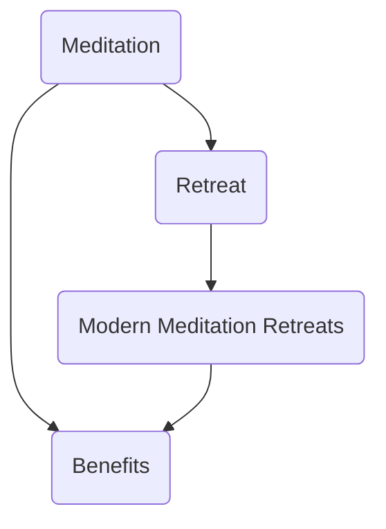

                 


### I. Introduction to Modern Meditation Retreats

In the fast-paced, high-stress world of modern urban life, the concept of "Modern Meditation Retreats" has emerged as a beacon of hope for individuals seeking spiritual rejuvenation and mental clarity. These retreats are not just about escaping the hustle and bustle of the city but are designed to provide a holistic experience that addresses the mental, emotional, and physical well-being of participants. 

#### 1.1 Background

As the world becomes more connected and information overload becomes the norm, the human psyche is facing unprecedented challenges. Anxiety, stress, and mental fatigue have become common issues, affecting both personal and professional lives. Traditional meditation practices, which have been part of various cultures for centuries, offer a promising solution to these problems. However, the chaotic nature of modern life often makes it difficult for individuals to practice meditation consistently. This is where modern meditation retreats come into play, providing a structured and immersive environment that encourages and facilitates regular meditation practice.

#### 1.2 Core Concepts and Their Relationships

To understand the significance of modern meditation retreats, it is essential to delve into the core concepts and their interrelationships. 

**Core Concept 1: Meditation**

Meditation is a practice where an individual uses a technique, such as focusing on their breath or a specific object, to train the mind and achieve a state of mental clarity and emotional equilibrium. The core components of meditation are the practice itself, the mental state achieved, and the benefits derived from it.

**Core Concept 2: Retreat**

A retreat, in the context of meditation, refers to a specific period of time where individuals temporarily disengage from their daily routines and immerse themselves in a dedicated space for meditation and reflection. The key elements of a retreat are the duration, the location, and the activities involved.

**Core Concept 3: Modern Meditation Retreats**

Modern meditation retreats combine the ancient practice of meditation with contemporary lifestyle needs. They are designed to be accessible to people from all walks of life, incorporating various meditation techniques, personalized guidance, and supportive environments.

**Relationships Between Concepts**

The relationship between these core concepts can be visualized using a Mermaid flowchart:



In this diagram, Meditation (A) is the foundation, Retreat (B) is the container, and Modern Meditation Retreats (C) are the enhanced experience that brings together the benefits (D) of meditation.

### Conclusion

In conclusion, modern meditation retreats represent a crucial development in the practice of meditation, addressing the unique challenges of the modern world. By understanding the core concepts and their relationships, we can better appreciate the transformative power of these retreats and their potential to improve the quality of life for urbanites.

---

Now, let's dive deeper into each of these concepts and explore how they contribute to the overall experience of modern meditation retreats.

### II. Understanding Meditation

Meditation is an ancient practice that has been employed across various cultures for thousands of years. It is a deliberate effort to train the mind to achieve a state of focus and awareness, often characterized by reduced mental chatter and heightened self-awareness. Understanding the origins and types of meditation is crucial for grasping the full potential of modern meditation retreats.

#### 2.1 The Origins and Historical Evolution of Meditation

The origins of meditation can be traced back to ancient India, where it was integral to the practice of yoga. The word "meditation" itself comes from the Latin word "meditari," which means "to think upon" or "to ponder." The earliest documented forms of meditation can be found in the Upanishads, ancient scriptures that form the foundation of Hinduism.

Meditation spread to other parts of Asia, notably China and Japan, where it integrated with traditional practices such as Taoism and Zen Buddhism. In China, meditation evolved into practices like Qigong and Tai Chi, which combine physical movement with mental focus. Similarly, in Japan, Zen meditation became a central practice in the Buddhist tradition.

As time progressed, meditation found its way to the West, particularly in the late 19th and early 20th centuries. This period saw a resurgence of interest in Eastern philosophies and spiritual practices. Influential figures like Paramahansa Yogananda and Swami Sivananda brought meditation to the attention of Western audiences through their writings and teachings.

#### 2.2 Types of Meditation and Their Applications

Over the centuries, various forms of meditation have emerged, each with its unique techniques and applications. Here are three prominent types of meditation:

**1. Mindfulness Meditation**

Mindfulness meditation involves paying attention to the present moment, accepting it without judgment, and cultivating a sense of awareness and acceptance. This practice is often associated with the teachings of Buddhist monk Thich Nhat Hanh and has gained widespread popularity for its effectiveness in reducing stress and enhancing emotional well-being.

**2. Transcendental Meditation (TM)**

Transcendental Meditation was developed by Maharishi Mahesh Yogi in the 1950s and is based on the concept of transcending the mind's activity to access a deeper state of consciousness. Practitioners use a personally assigned mantra to achieve a state of deep relaxation and inner peace. TM has been extensively researched for its benefits in reducing anxiety, improving cognitive function, and promoting overall well-being.

**3. Vipassana Meditation**

Vipassana meditation, which translates to "seeing things as they truly are," originated in India and is closely associated with the teachings of the Buddha. This practice involves observing the body and mind with keen attention to identify and understand the impermanence and interconnectedness of all phenomena. Vipassana meditation is renowned for its profound impact on mental clarity and emotional resilience.

#### 2.3 The Science Behind Meditation

In recent years, scientific research has begun to uncover the biological and psychological mechanisms underlying meditation. Studies using techniques such as functional magnetic resonance imaging (fMRI) and electroencephalography (EEG) have provided insights into how meditation affects the brain.

**1. Neural Mechanisms**

Meditation has been shown to cause changes in brain structure and function. For instance, research has found increased grey matter density in regions associated with emotional regulation, such as the prefrontal cortex, and decreased grey matter density in areas linked to stress, such as the amygdala. These changes may contribute to the stress-reducing and emotional-regulating effects of meditation.

**2. Psychological Benefits**

Meditation has been linked to a variety of psychological benefits, including:

- **Reduced Stress and Anxiety:** Regular meditation practice has been shown to reduce stress and anxiety levels by promoting relaxation and improving emotional regulation.
- **Enhanced Focus and Concentration:** Studies have found that meditation can improve attention and focus, particularly in individuals with conditions such as ADHD.
- **Improved Emotional Well-being:** Meditation has been associated with increased positive emotions and reduced symptoms of depression and anxiety.
- **Enhanced Self-awareness and Empathy:** Meditation practices that focus on self-observation and cultivating empathy, such as mindfulness and loving-kindness meditation, have been shown to increase self-awareness and empathy.

#### Conclusion

Understanding the origins and types of meditation, along with the scientific basis for its benefits, is essential for appreciating the transformative power of modern meditation retreats. These retreats offer a unique opportunity for individuals to immerse themselves in the practice of meditation, experiencing firsthand the profound benefits it can bring to their lives.

### III. The Role of Retreats in Meditation

While meditation can be practiced anywhere, the role of retreats in the meditation process cannot be overstated. Retreats provide a dedicated space and time for individuals to engage fully in meditation practices, free from the distractions of daily life. They offer a structured environment that supports deep immersion and sustained practice, which are crucial for experiencing the full range of benefits that meditation has to offer.

#### 3.1 The Concept and Importance of Retreats

A retreat, in the context of meditation, refers to a specific period during which individuals temporarily disengage from their normal routines and immerse themselves in a setting designed for contemplation and meditation. The key components of a meditation retreat include:

- **Duration:** Retreats can range from a weekend to several weeks, with shorter durations often aimed at introducing participants to meditation practices and longer durations designed for more intense and immersive experiences.

- **Location:** Retreat centers are typically located in serene environments, such as mountains, forests, or near bodies of water, which provide a peaceful and quiet setting conducive to meditation and reflection.

- **Activities:** In addition to meditation, retreats often include other activities such as yoga, nature walks, and group discussions. These activities are designed to complement the meditation practice and enhance the overall retreat experience.

The importance of retreats in the context of meditation can be understood by examining the following aspects:

- **Time and Space for Practice:** One of the primary benefits of retreats is that they provide participants with a significant amount of uninterrupted time for meditation. This allows for a deeper and more sustained practice, which can lead to more profound experiences and benefits.

- **Structured Environment:** Retreats offer a structured environment that supports the meditation process. This includes not only scheduled meditation sessions but also activities that help participants to unwind and focus on their inner selves.

- **Community Support:** Retreats often bring together individuals who share a common interest in meditation. This creates a supportive community where participants can learn from each other, share experiences, and offer encouragement.

- **Freedom from Distractions:** By removing oneself from the daily distractions of work, family, and technology, retreats provide a rare opportunity for individuals to disconnect from the noise of the outside world and focus inward.

#### 3.2 Retreat Programs and Structures

The structure of a meditation retreat can vary depending on the specific goals and philosophy of the retreat center. However, there are some common elements that are typically included in most retreat programs:

- **Daily Schedule:** A typical retreat schedule might include morning and evening meditation sessions, as well as periods for individual practice throughout the day. Some retreats also include early morning wake-up calls to allow for extra meditation time.

- **Guided Sessions:** Many retreats include guided meditation sessions led by experienced instructors. These sessions can be particularly beneficial for beginners who may need guidance on proper techniques and practices.

- **Workshops and Talks:** Retreats often feature workshops and talks on various aspects of meditation, such as its philosophy, history, and scientific basis. These sessions provide participants with a deeper understanding of the practice and its benefits.

- **Physical Activities:** Many retreat centers offer physical activities such as yoga, hiking, or nature walks. These activities are designed to complement the meditation practice by promoting physical health and relaxation.

- **Meals and Accommodations:** Retreat centers typically provide meals and accommodations as part of the retreat package. These are often prepared with care using fresh, organic ingredients, and the serene environment of the center helps to enhance the overall retreat experience.

#### 3.3 Silent Retreats vs. Guided Retreats

Two common types of meditation retreats are silent retreats and guided retreats, each with its unique characteristics and benefits.

**Silent Retreats**

Silent retreats, as the name suggests, are retreats where there is a strong emphasis on silence. Participants are encouraged to engage in meditation and other contemplative practices without verbal interaction. The absence of conversation helps to minimize distractions and create a deeper meditative state. Silent retreats are particularly beneficial for individuals who seek a quiet and introspective experience.

**Guided Retreats**

Guided retreats, on the other hand, involve the presence of experienced instructors who lead participants through meditation practices, workshops, and discussions. The guidance provided by the instructors can be invaluable for beginners who are new to meditation or for those who want to deepen their practice. Guided retreats often include a balance of silence and interaction, allowing participants to benefit from both solitude and community support.

#### Conclusion

In conclusion, meditation retreats play a crucial role in the meditation process by providing a dedicated space and time for practice, a supportive environment, and structured programs designed to enhance the meditative experience. Whether through silent retreats or guided retreats, these programs offer individuals a unique opportunity to immerse themselves in the practice of meditation and experience its profound benefits.

### IV. Urban Retreats: A Unique Necessity

In the modern urban landscape, where the pace of life is relentless and the pressures of city living can be overwhelming, the concept of urban meditation retreats has gained significant traction. These retreats are tailored to meet the specific needs of urban dwellers, providing a sanctuary where they can disconnect from the noise and chaos of the city and reconnect with their inner selves. 

#### 4.1 The Rise of Urban Retreats

The rise of urban meditation retreats can be attributed to several factors. Firstly, the increasing awareness of the negative impacts of urban living on mental health has prompted individuals to seek solutions that promote well-being and balance. Stress, anxiety, and burnout are common issues faced by city dwellers, and meditation has been proven to be an effective tool in managing these conditions. As a result, there has been a growing interest in meditation and its benefits, driving the demand for retreats that offer a structured and supportive environment for practice.

Secondly, the busy schedules and fast-paced lifestyle of urbanites often leave little time for regular meditation practice. Urban retreats provide a unique opportunity to experience the benefits of meditation without the need to carve out dedicated time every day. With retreats available in various locations within or near urban areas, individuals can easily escape for a weekend or a few days to immerse themselves in a meditative practice.

Thirdly, the increasing accessibility and affordability of meditation retreats have contributed to their popularity. Retreat centers have become more aware of the needs of urban participants and have adapted their offerings to accommodate these needs. This includes offering retreats that are shorter in duration, more flexible in scheduling, and tailored to the specific interests and requirements of urban residents.

#### 4.2 The Benefits of Urban Retreats for Urbanites

Urban meditation retreats offer a multitude of benefits that are particularly relevant for individuals living in bustling urban environments. These benefits can be categorized into three main areas: mental health, physical well-being, and social connection.

**1. Mental Health Benefits**

The mental health benefits of urban meditation retreats are well-documented. The practice of meditation has been shown to reduce stress, anxiety, and depression, making it an invaluable tool for urban dwellers who often face high levels of stress due to their work and living conditions. A retreat provides a peaceful and tranquil environment where individuals can focus solely on their mental and emotional well-being. The removal of daily distractions and the structured schedule of a retreat allow participants to engage deeply in meditation practices, leading to a profound sense of relaxation and mental clarity.

**2. Physical Health Benefits**

Meditation is not only beneficial for the mind but also for the body. Urban meditation retreats promote physical well-being through practices such as mindfulness, deep breathing, and gentle exercises like yoga. These practices help to reduce physical tension, improve posture, and enhance overall physical health. Additionally, the relaxed and meditative state induced by retreats can lead to better sleep patterns, which is crucial for overall health and well-being.

**3. Social Connection Benefits**

While urban meditation retreats emphasize personal and individual experiences, they also offer opportunities for social connection. Many retreats include group sessions, discussions, and communal activities that encourage participants to share their experiences and learn from one another. This creates a sense of community and belonging, which is often lacking in the isolated lives of urbanites. The shared experience of meditation and the supportive environment of a retreat can foster deep connections and meaningful relationships.

#### 4.3 The Challenges and Opportunities of Urban Retreats

Despite the numerous benefits, urban meditation retreats also face certain challenges. One of the main challenges is the urban environment itself, which can be noisy, polluted, and stressful. To overcome this, retreat centers need to be strategically located in areas that offer a peaceful and tranquil setting, even within the city. The use of noise-canceling technology and soundproofing measures can also help create a serene atmosphere.

Another challenge is the perception that meditation is a luxury that is only accessible to those with the time and financial resources to escape to remote locations. To address this, retreat centers need to offer more flexible and affordable options, such as shorter retreats and retreats that are accessible to individuals from different socioeconomic backgrounds.

Finally, urban meditation retreats need to be adaptable to the needs of urban dwellers. This includes offering retreats that can be scheduled around busy work and family lives, and providing programs that cater to the unique challenges and stressors faced by city residents.

In conclusion, urban meditation retreats represent a unique and essential resource for individuals living in bustling urban environments. By offering a peaceful and supportive space where they can escape the chaos of city life and engage in meaningful meditation practices, these retreats provide a vital means of promoting mental, physical, and social well-being for urbanites.

### V. Practical Guide to Planning a Meditation Retreat

Planning a meditation retreat requires careful consideration of various factors to ensure that it is a meaningful and beneficial experience for all participants. Here is a practical guide that covers the key steps involved in organizing a successful meditation retreat.

#### 5.1 Setting Clear Objectives

The first step in planning a meditation retreat is to define clear objectives. These objectives should outline the purpose of the retreat and the specific outcomes that you hope to achieve. For example, the objectives might include:

- **Promoting Stress Reduction:** The retreat could focus on helping participants reduce stress and anxiety through meditation practices.
- **Enhancing Self-awareness:** The retreat might aim to deepen participants' self-awareness and emotional intelligence.
- **Fostering Community Connection:** The retreat could be designed to build a sense of community and support among participants.

Defining clear objectives will help guide all subsequent planning steps and ensure that the retreat stays on track.

#### 5.2 Selecting the Right Venue

The choice of venue is critical to the success of a meditation retreat. The ideal venue should provide a peaceful and tranquil environment that is free from distractions. Here are some key considerations when selecting a venue:

- **Location:** Look for a location that is accessible to participants but also provides a serene and secluded environment. This might include countryside retreat centers, forest reserves, or coastal areas.
- **Facilities:** Ensure that the venue has adequate facilities to accommodate participants, including comfortable accommodations, well-equipped meditation spaces, and dining facilities. It's also important to consider the availability of amenities such as running water, electricity, and internet access.
- **Privacy:** A venue with privacy is essential for maintaining a tranquil atmosphere and ensuring that participants can fully engage in their meditation practices without external interruptions.
- **Cost:** Consider the budget constraints and the cost of renting the venue, including any additional expenses such as transportation and security.

#### 5.3 Recruiting Qualified Instructors

The quality of the meditation retreat significantly depends on the skills and expertise of the instructors. When recruiting instructors, consider the following factors:

- **Experience:** Look for instructors who have a proven track record of leading meditation retreats and have extensive experience in the specific meditation techniques that will be taught.
- **Credentials:** Verify the credentials of the instructors, including their qualifications and any certifications they may hold. This ensures that they have the necessary knowledge and expertise to lead the retreat effectively.
- **Personal Qualities:** Choose instructors who possess qualities such as empathy, patience, and a genuine passion for meditation. These qualities are essential for creating a supportive and positive learning environment.

#### 5.4 Creating a Comprehensive Schedule

A well-structured schedule is crucial for the success of a meditation retreat. The schedule should balance meditation practices with other activities to ensure a holistic experience. Here are some key elements to include in the schedule:

- **Daily Meditation Sessions:** Allocate time for multiple meditation sessions each day, including both guided and silent meditation. Ensure that sessions are varied to cater to different skill levels and preferences.
- **Workshops and Talks:** Include workshops and talks on various aspects of meditation, such as its philosophy, history, and scientific basis. These sessions can provide participants with a deeper understanding of the practice and its benefits.
- **Physical Activities:** Incorporate physical activities such as yoga, nature walks, or mindfulness exercises to complement the meditation practice. These activities promote physical health and help to maintain a balanced retreat experience.
- **Breaks and Meals:** Provide regular breaks and meals throughout the day to allow participants to rest and recharge. Meals should be nutritious and, if possible, include options for dietary restrictions.
- **Social Activities:** Plan social activities such as group discussions or communal meals to foster a sense of community and support among participants.

#### 5.5 Ensuring a Safe and Supportive Environment

Creating a safe and supportive environment is essential for the success of a meditation retreat. Here are some measures to ensure this:

- **Health and Safety:** Ensure that the venue is safe and compliant with health and safety regulations. This includes checking for proper fire safety measures, first aid supplies, and clear emergency protocols.
- **Personal Boundaries:** Emphasize the importance of personal boundaries and confidentiality among participants and instructors. This helps to create a respectful and supportive atmosphere.
- **Support and Guidance:** Provide access to support and guidance throughout the retreat, including instructors who are available to answer questions and provide guidance as needed.

#### 5.6 Promoting Engagement and Interaction

To maximize the benefits of the retreat, it's important to encourage participant engagement and interaction. Here are some strategies to achieve this:

- **Group Discussions:** Facilitate group discussions where participants can share their experiences, insights, and challenges. This fosters a sense of community and provides valuable learning opportunities.
- **Peer Support:** Encourage participants to support each other through shared experiences and mutual encouragement.
- **Feedback:** Collect feedback from participants at the end of the retreat to identify areas of success and areas for improvement.

#### Conclusion

Planning a meditation retreat involves careful consideration of various factors, from setting clear objectives and selecting the right venue to recruiting qualified instructors and creating a comprehensive schedule. By following these steps and ensuring a safe and supportive environment, you can create a meaningful and transformative experience for all participants.

### VI. Preparing for a Successful Meditation Retreat

To ensure a successful meditation retreat, thorough preparation is essential. This involves both logistical planning and personal readiness. Here are some key steps to consider when preparing for a meditation retreat.

#### 6.1 Physical and Mental Preparation

**Physical Preparation:**

- **Fitness:** While meditation retreats do not require high physical fitness, it's beneficial to be in good overall health. Engaging in regular physical exercise can help improve your stamina and prepare your body for the retreat.

- **Sleep:** Ensure you get adequate sleep in the weeks leading up to the retreat. A well-rested body and mind are better equipped to handle the demands of meditation.

- **Nutrition:** Maintain a balanced diet, rich in fruits, vegetables, and whole grains. Avoid heavy meals before the retreat to prevent digestive discomfort during meditation sessions.

**Mental Preparation:**

- **Mindfulness:** Start practicing mindfulness in your daily life to familiarize yourself with meditation techniques. This can involve simple exercises like paying attention to your breath or body sensations.

- **Expectations:** Set realistic expectations for the retreat. Understand that while the retreat will offer valuable experiences, it is not a magical solution to all your problems. Approach it with an open mind and a willingness to learn.

- **Settling In:** Prepare yourself mentally to be away from the hustle and bustle of daily life. This may involve decluttering your mind of worries and planning for a temporary disconnection from work and personal obligations.

#### 6.2 Packing Essentials

When packing for a meditation retreat, consider the following items:

- **Comfortable Clothing:** Wear loose, comfortable clothing that allows for easy movement during meditation sessions and physical activities.

- **Personal Items:** Bring personal hygiene items such as a towel, toothbrush, and toothpaste. If you have specific dietary needs, pack any necessary items or inform the retreat center in advance.

- **Meditation Equipment:** If you have a personal meditation cushion or mat, bring them along. Otherwise, most retreat centers will provide necessary equipment.

- **Reading Material:** Bring books or meditation manuals that can serve as resources during the retreat.

- **Emergency Supplies:** Pack a small medical kit with basic first aid supplies, including pain relievers, antacids, and any prescription medications you may need.

#### 6.3 Practical Tips for the Retreat

**Arrival and Departure:**

- **Early Arrival:** Arrive at the retreat center early to settle in and acclimate to the environment before the retreat officially begins.

- **Leaving Behind:** Leave all distractions behind, including electronic devices such as smartphones and laptops. This will help you fully engage in the retreat and reduce any potential interruptions.

**During the Retreat:**

- **Stay Open-Minded:** Approach each session and activity with an open mind and a willingness to learn. The retreat may offer new experiences and insights that challenge your existing beliefs.

- **Communicate:** If you have any questions or concerns during the retreat, do not hesitate to communicate with the instructors. They are there to guide and support you.

- **Participation:** Participate actively in all activities, from meditation sessions to group discussions and physical exercises. Full participation will enhance your retreat experience.

- **Rest and Recharge:** Take breaks when needed and ensure you get enough rest to fully benefit from the retreat.

**Post-Retreat:** 

- **Integration:** Reflect on your experiences and integrate the lessons learned into your daily life. Consider setting up a regular meditation practice to maintain the benefits of the retreat.

- **Gratitude:** Express gratitude for the experience and the opportunity to grow. This can be done through journaling, sharing with others, or simply taking a moment each day to appreciate the gift of meditation.

By following these preparation steps and practical tips, you can ensure a smooth and rewarding meditation retreat experience.

### VII. Conclusion

In conclusion, modern meditation retreats have emerged as vital sanctuaries for urban dwellers seeking spiritual rejuvenation and mental clarity in the midst of a hectic modern lifestyle. These retreats offer a unique opportunity to immerse oneself in the ancient practice of meditation, providing a structured and supportive environment that enhances both personal well-being and social connections. As we have explored in this article, the benefits of meditation are multifaceted, ranging from reduced stress and improved emotional health to enhanced physical well-being and community support.

However, the success of meditation retreats hinges on careful planning and execution. From setting clear objectives and selecting the right venue to recruiting qualified instructors and creating a comprehensive schedule, each step plays a crucial role in ensuring a meaningful and transformative experience for all participants.

Moreover, as urban meditation retreats continue to gain popularity, it is important to address the challenges they face, such as noise pollution and the perception of meditation as a luxury. By offering more flexible and affordable options, and by strategically locating retreat centers within or near urban areas, we can make meditation more accessible to a broader audience.

In closing, I encourage readers to explore the world of meditation retreats and experience firsthand the profound benefits they offer. Whether you are a seasoned meditator or new to the practice, a meditation retreat can serve as a powerful catalyst for personal growth and inner peace.

### Author Information

**作者：AI天才研究院/AI Genius Institute & 禅与计算机程序设计艺术 /Zen And The Art of Computer Programming**

**联系方式：[邮箱]：[info@agnetinsteinstitute.com]**

**微信公众号：AI天才研究院**

**个人博客：[www.aigetienainstitute.com/blog]**

### References and Further Reading

1. **"The Health Benefits of Meditation"** - Harvard Health Publishing. (n.d.). <https://www.health.harvard.edu/mind-and-mood/the-health-benefits-of-meditation>
2. **"Meditation: How It Helps Reduce Stress"** - Anxiety and Depression Association of America. (n.d.). <https://www.adaa.org/understanding-anxiety/treatment/therapy/meditation-how-it-helps-reduce-stress>
3. **"The Science of Meditation"** - National Center for Complementary and Integrative Health. (n.d.). <https://nccih.nih.gov/health/mind-and-body/science-of-meditation>
4. **"The Origins of Meditation"** - The Yoga International. (n.d.). <https://www.yogainternational.com/article/409-the-origins-of-meditation>
5. **"Types of Meditation"** - The Mindful. (n.d.). <https://themindfulword.com/types-of-meditation/>
6. **"Urban Meditation Retreats: A Growing Trend"** - Mindful Mag. (n.d.). <https://www.mindful.org/urban-meditation-retreats-growing-trend/>
7. **"How to Plan a Meditation Retreat"** - The Mindful Life. (n.d.). <https://www.themindfullife.com/how-to-plan-a-meditation-retreat/>

### Appendix: Python Code Example for Meditation Techniques

Below is a Python code example that demonstrates a simple meditation technique using mindfulness meditation. This example uses a loop to guide the user through the process of focusing on their breath and brings awareness to any distractions.

```python
import time

def mindful_breathing_meditation(duration):
    """
    Mindful Breathing Meditation
    This function guides the user through a simple mindfulness meditation focusing on the breath.
    :param duration: The duration of the meditation in seconds.
    """
    print("Welcome to the Mindful Breathing Meditation.")
    print(f"You will be guided through a {duration} second meditation. Please find a comfortable seat and close your eyes.")
    time.sleep(2)

    end_time = time.time() + duration
    while time.time() < end_time:
        print("\nFocus on your breath. Take a deep breath in, filling your lungs completely.")
        time.sleep(duration / 4)  # Hold the breath for a quarter of the duration
        print("Exhale slowly and completely, allowing all the tension to release.")
        time.sleep(duration / 4)
        
        print("\nIf your mind wanders, gently bring your attention back to your breath.")
        time.sleep(duration / 4)
        
        print("\nContinue this process, each time noticing the rise and fall of your breath.")
        time.sleep(duration / 4)
        
    print("\nMeditation complete. Take a moment to come back to the present, slowly opening your eyes if you've been closed.")

# Run the meditation for 5 minutes
mindful_breathing_meditation(5 * 60)
```

This code provides a basic framework for a guided meditation, allowing users to practice mindfulness by focusing on their breathing. The `time.sleep()` function is used to control the pauses between each step, ensuring the user has enough time to follow the instructions and maintain focus on their breath. The meditation concludes with a gentle reminder to transition back to the present moment. 

### Project Overview

This project focuses on creating a simple yet effective guided meditation application using Python. The application provides a script that guides users through a mindful breathing meditation, which is one of the most popular and beginner-friendly meditation techniques. By using a Python script, we can easily demonstrate the concept of meditation techniques and provide a clear, step-by-step guide to users.

### Development Environment Setup

To set up the development environment for this project, follow these steps:

1. **Install Python**: Ensure you have Python 3.x installed on your system. You can download the latest version from the official Python website: <https://www.python.org/downloads/>

2. **Install Required Libraries**: This project uses the built-in `time` library, which is part of Python's standard library. However, for additional functionality or future enhancements, you might need additional libraries such as `requests` for web-based features. Install these using `pip`:

   ```bash
   pip install requests
   ```

3. **Create a Virtual Environment** (optional): For better project management and to avoid dependency conflicts, it's a good practice to create a virtual environment:

   ```bash
   python -m venv venv
   source venv/bin/activate  # On Windows use `venv\Scripts\activate`
   ```

### Detailed Explanation of the Code

The `mindful_breathing_meditation` function serves as the core of the meditation application. It takes one parameter, `duration`, which specifies the length of the meditation in seconds. The function begins by providing a welcome message and a brief introduction to the meditation process.

1. **Printing Introduction**: The function starts by welcoming the user and providing instructions on finding a comfortable seat and closing their eyes. This helps set the user's mind and body into a state of readiness for meditation.

2. **Calculating End Time**: The end time of the meditation is calculated by adding the duration (in seconds) to the current time. This ensures that the meditation will run for the specified duration.

3. **Meditation Loop**: The function enters a loop that runs until the end time is reached. Within the loop, the following steps are executed:

   - **Breathing Instructions**: The user is instructed to take a deep breath in and exhale slowly. This focuses the user's attention on their breath, which is a fundamental aspect of mindfulness meditation.
   - **Distraction Awareness**: The user is reminded that if their mind wanders, they should gently bring their attention back to their breath. This is a crucial practice in meditation, as it helps maintain focus.
   - **Time Pauses**: The `time.sleep()` function is used to pause the meditation for specific intervals. These pauses allow the user to fully experience each phase of the breathing process, fostering a deeper connection with their inner self.

4. **Conclusion**: Once the meditation reaches the end time, the function outputs a message indicating that the meditation is complete. Users are encouraged to take a moment to transition back to their normal state by slowly opening their eyes if they have been closed.

### Code Usage and Practical Applications

This meditation application can be used in various practical scenarios, such as:

- **Personal Practice**: Users can run the script on their personal computers to practice mindfulness meditation at home or any quiet environment.
- **Group Sessions**: The script can be adapted to facilitate group meditation sessions, where an instructor can guide multiple users simultaneously.
- **Mobile App Integration**: With additional development, this script can be integrated into a mobile application, providing users with a convenient way to practice meditation on the go.

By providing clear and concise instructions and allowing for customization of the meditation duration, this application aims to make meditation accessible and beneficial for a wide range of users.

### Project Summary and Future Directions

This project serves as a foundational example of how simple Python scripts can be used to guide users through meditation practices. By focusing on a specific technique like mindful breathing, the application provides a clear, structured approach to meditation that can be easily understood and implemented.

For future development, the application could be expanded to include:

- **Voice Guided Meditation**: Integrating voice recognition and text-to-speech technologies to create a more immersive and interactive meditation experience.
- **Feedback Mechanisms**: Adding a feedback system to gather user insights and improve the meditation script based on real-world usage.
- **Customizable Scenarios**: Incorporating different meditation scenarios, such as guided imagery or body scan meditation, to cater to a broader range of meditation preferences and needs.

By continually refining and expanding the application, it can serve as a valuable tool for individuals seeking to integrate meditation into their daily lives and experience its many benefits.

### Conclusion

In summary, this project provides a practical and accessible introduction to guided meditation using Python. By leveraging the simplicity and versatility of Python scripts, we can create effective tools to support individuals in their meditation journey. Whether used for personal practice or group sessions, this application underscores the importance of meditation in promoting mental clarity, emotional well-being, and overall health. As we continue to explore and expand the capabilities of meditation technologies, we open up new avenues for personal growth and self-discovery.

