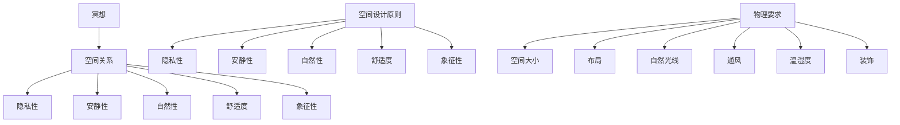

                 

# 现代冥想空间设计：在都市中创造宁静角落

## 关键词

- 冥想空间设计
- 都市宁静角落
- 空间规划
- 自然光线
- 材料与风格
- 植物与装饰
- 实际案例
- 设计原则

## 摘要

本文将深入探讨现代冥想空间设计的关键要素，特别是在繁忙的都市环境中如何打造一个宁静的角落。通过分析设计理念、空间规划、自然光线与通风、材料与风格选择、植物与装饰设计等核心内容，本文旨在为建筑师、室内设计师、冥想爱好者提供实用的设计指南。此外，还将分享实际案例，展示如何将理论应用到实践中，以及未来的发展趋势和面临的挑战。

## 引言

在当今快节奏的都市生活中，寻找一片宁静的角落变得越来越困难。冥想空间设计作为一种解决方法，旨在为人们提供一个远离喧嚣的环境，帮助他们放松身心，达到心灵的平衡。本文将探讨如何设计这样一个空间，使其在都市环境中既能满足功能需求，又能提供舒适的冥想体验。

### 设计理念

冥想空间的设计理念围绕以下几个核心原则：

1. **隐私性**：冥想需要一种安全感，因此空间设计要确保私密性。
2. **安静性**：声音是冥想的大敌，因此设计时要尽量减少噪声干扰。
3. **自然性**：自然元素如光线、植物和水等，有助于创造一个宁静的环境。
4. **舒适度**：座椅、地毯等设施的设计要确保使用者的舒适感。
5. **象征性**：空间中的装饰和布局应传达冥想的深层意义。

### 空间规划

空间规划是冥想空间设计的基础。以下是一些关键规划步骤：

1. **确定空间大小**：根据需求确定空间的大小，既要满足功能需求，又要避免过于拥挤。
2. **区域划分**：将空间划分为不同的功能区，如冥想区、休息区、储物区等。
3. **动线设计**：确保使用者的动线顺畅，避免不必要的障碍。
4. **功能布局**：根据不同功能的需求，合理布局空间内的设施。

### 自然光线与通风设计

自然光线和通风对冥想空间至关重要。以下是一些设计建议：

1. **光线控制**：利用窗帘和百叶窗来调节光线强度，避免过度直射。
2. **通风设计**：确保空气流通，但要避免穿堂风直接吹向使用者。
3. **自然元素**：引入自然元素，如窗户、天井或室内植物，以增加空间的自然感。

### 材料与风格选择

材料与风格的选择要符合冥想空间的设计理念。以下是一些关键考虑因素：

1. **环保性**：选择环保材料，减少对环境的影响。
2. **舒适度**：选择触感舒适的材料，如羊毛地毯、柔软的座椅等。
3. **风格统一**：保持整体风格的一致性，避免杂乱无章的感觉。
4. **色彩搭配**：使用柔和的色彩，如淡蓝色、淡绿色等，以创造宁静的氛围。

### 植物与装饰设计

植物和装饰品在冥想空间中扮演着重要角色。以下是一些建议：

1. **植物选择**：选择易于养护且具有净化空气功能的植物，如吊兰、芦荟等。
2. **装饰品布置**：选择简单的装饰品，如香炉、佛珠等，避免过多复杂的图案和色彩。
3. **摆放位置**：确保装饰品的摆放不会干扰使用者的冥想过程。

### 实际案例

以下是一些实际案例，展示了如何将理论应用到实践中：

- **案例一**：在都市公寓中设计一个宁静的冥想角落。通过合理的空间规划和自然光线利用，创造出一个舒适且私密的冥想空间。
- **案例二**：在办公室中设置一个冥想角落。通过合理的布局和装饰，为员工提供一个放松的场所，提升工作效率和心理健康。
- **案例三**：在公共设施中设计一个冥想空间。通过引入自然元素和舒适的设施，为公众提供一个放松和冥想的地方。

### 未来趋势与挑战

随着社会对心理健康和冥想重视程度的提高，冥想空间设计将迎来新的发展。未来趋势包括：

- **智能冥想空间**：利用人工智能和物联网技术，提供个性化的冥想体验。
- **多功能空间**：设计灵活的多功能空间，满足不同人群的需求。
- **生态设计**：更加注重生态可持续性，使用环保材料和能源。

然而，冥想空间设计也面临一些挑战，如：

- **空间限制**：在有限的空间内创造一个宁静的环境。
- **成本控制**：合理控制设计和建设成本，确保项目的可行性。
- **用户需求**：不断适应和满足不同用户的需求。

### 结论

冥想空间设计是现代都市生活中的一股清流，它不仅为人们提供了一个放松身心的场所，还能提升整体生活质量。通过合理的空间规划、材料选择和自然元素引入，我们可以在繁忙的都市中创造出一个宁静的角落，帮助人们找到内心的宁静。

### 附录

- **附录A：参考资料与推荐阅读**：提供相关的书籍、论文和网站资源，供读者进一步学习。
- **附录B：相关工具与软件介绍**：介绍一些用于冥想空间设计的工具和软件，如CAD软件、室内设计软件等。
- **附录C：常见问题解答**：解答读者在冥想空间设计中可能遇到的一些常见问题。

## 作者信息

作者：AI天才研究院/AI Genius Institute & 禅与计算机程序设计艺术 /Zen And The Art of Computer Programming

### 第1章：冥想空间设计的核心概念

冥想是一种古老而现代的身心实践，它通过集中注意力、放松身体和清理思绪来提升个人意识和心理健康。随着现代都市生活的快节奏和压力增加，人们越来越意识到冥想的重要性。冥想空间的设计因此成为了关注的焦点。一个良好的冥想空间不仅能够提供一个物理上的安静环境，还能营造一种心理上的平静氛围，帮助冥想者更好地进入冥想状态。

#### 冥想与空间的关系

冥想与空间有着密不可分的关系。空间不仅是物理存在的场所，也是心理体验的容器。一个合适的空间设计能够增强冥想的效果，反之则可能成为干扰因素。以下是一些冥想与空间关系的关键点：

1. **隐私性**：冥想通常涉及个人的内心体验，需要一个私密的空间来保护冥想者的隐私。
2. **安静性**：噪声是冥想的敌人，一个安静的空间有助于冥想者集中注意力。
3. **舒适性**：舒适的座椅和合适的温度、湿度等环境因素可以提高冥想的质量。
4. **自然性**：自然光线、植物和水的元素可以创造一种放松和宁静的氛围，有助于冥想。
5. **象征性**：空间中的装饰和布局可以传达冥想的深层意义，帮助冥想者更好地进入冥想状态。

#### 冥想空间设计原则

设计一个冥想空间需要遵循一些核心原则，以确保空间能够满足冥想的需求：

1. **隐私性**：通过封闭的门或隔断，确保空间私密性。
2. **安静性**：减少噪声干扰，使用隔音材料，如隔音板、地毯等。
3. **自然性**：引入自然光线、自然材料和自然元素，如植物、水景等。
4. **舒适度**：选择舒适的座椅和地面材料，确保使用者的舒适感。
5. **象征性**：空间中的装饰和布局要简洁、优雅，有助于冥想者进入冥想状态。
6. **灵活性**：设计要考虑空间的多功能性，以适应不同的冥想活动和需求。

#### 冥想空间的物理要求

一个理想的冥想空间应该具备以下物理要求：

1. **大小**：空间大小要适中，既能满足功能需求，又不会过于拥挤。
2. **布局**：布局要合理，确保动线顺畅，避免不必要的障碍。
3. **自然光线**：利用窗户和天井引入自然光线，但要避免直射。
4. **通风**：确保良好的通风，但要避免穿堂风。
5. **温湿度**：保持适宜的温度和湿度，避免过热或过冷。
6. **装饰**：选择简单的装饰品，如佛珠、香炉等，避免过多的复杂图案。

### 核心概念与联系

为了更好地理解冥想空间设计的核心概念，我们可以通过以下Mermaid流程图展示这些概念之间的关系：



通过这个流程图，我们可以清晰地看到冥想空间设计中的核心概念是如何相互关联和影响的。

### 核心算法原理讲解

在冥想空间设计中，算法原理并不直接涉及计算机科学，但我们可以借鉴一些设计算法的思维方式，如迭代改进和用户反馈机制，来优化空间设计。以下是一个简化的Python示例，展示如何通过用户反馈来逐步优化冥想空间的设计：

```python
# 用户反馈结构
class Feedback:
    def __init__(self, privacy: bool, tranquility: bool, comfort: bool, nature: bool):
        self.privacy = privacy
        self.tranquility = tranquility
        self.comfort = comfort
        self.nature = nature

# 初始设计
class Design:
    def __init__(self, privacy: bool, tranquility: bool, comfort: bool, nature: bool):
        self.privacy = privacy
        self.tranquility = tranquility
        self.comfort = comfort
        self.nature = nature

    # 评估设计
    def evaluate(self, feedback: Feedback) -> float:
        score = 0
        if feedback.privacy:
            score += 1
        if feedback.tranquility:
            score += 1
        if feedback.comfort:
            score += 1
        if feedback.nature:
            score += 1
        return score / 4

    # 改进设计
    def improve(self, feedback: Feedback):
        if not feedback.privacy:
            self.privacy = True
        if not feedback.tranquility:
            self.tranquility = True
        if not feedback.comfort:
            self.comfort = True
        if not feedback.nature:
            self.nature = True

# 初始设计评估
initial_design = Design(False, False, False, False)
print("初始设计评估得分：", initial_design.evaluate(Feedback(True, True, True, True)))

# 模拟用户反馈和设计改进
for i in range(5):
    feedback = Feedback(False, True, True, False)
    initial_design.improve(feedback)
    print(f"迭代 {i+1} 设计评估得分：", initial_design.evaluate(feedback))
```

在这个示例中，我们创建了一个简单的`Design`类，它有一个`evaluate`方法来评估设计是否符合用户的反馈，以及一个`improve`方法来根据反馈逐步改进设计。通过模拟迭代过程，我们可以看到设计如何逐渐优化以满足用户的需求。

### 数学公式与模型

在冥想空间设计中，数学模型可以用来优化空间布局，如利用几何原理来计算自然光线的分布。以下是一个简化的公式示例，用于计算一个圆的面积，这可以类比用于计算冥想空间中光线的覆盖范围：

$$
A = \pi r^2
$$

其中，\(A\) 是圆的面积，\(r\) 是圆的半径，\(\pi\) 是圆周率（约等于 3.14159）。

### 项目实战

#### 开发环境搭建

为了更好地理解和实现冥想空间设计，我们可以搭建一个简单的虚拟环境。以下是在Windows系统上搭建开发环境的基本步骤：

1. 安装Python 3.8或更高版本。
2. 安装Visual Studio Code（VS Code）作为代码编辑器。
3. 安装Git，用于版本控制和代码管理。
4. 安装所需的Python库，如Matplotlib（用于绘图）和Pandas（用于数据分析）。

#### 源代码实现

以下是一个简单的Python脚本，用于生成一个冥想空间的三维模型，并显示其结构：

```python
import matplotlib.pyplot as plt
from mpl_toolkits.mplot3d import Axes3D
import numpy as np

# 三维模型的参数
radius = 5
height = 3

# 创建一个三维坐标系
fig = plt.figure()
ax = fig.add_subplot(111, projection='3d')

# 绘制冥想空间的地面
x = np.linspace(-radius, radius, 100)
y = np.linspace(-radius, radius, 100)
x, y = np.meshgrid(x, y)
z = np.zeros_like(x)

ax.plot_surface(x, y, z, color='grey', alpha=0.5)

# 绘制冥想空间的墙面
z = height * np.ones_like(x)
ax.plot_surface(x, y, z, color='white', alpha=0.5)

# 添加标签和标题
ax.set_xlabel('X-axis')
ax.set_ylabel('Y-axis')
ax.set_zlabel('Z-axis')
ax.set_title('冥想空间三维模型')

# 显示图形
plt.show()
```

#### 代码解读与分析

在这个脚本中，我们使用了Matplotlib库来创建一个简单的三维模型。首先，我们定义了冥想空间的参数，如半径和高度。然后，我们使用`np.linspace`和`np.meshgrid`来生成坐标网格，并使用`plot_surface`方法来绘制冥想空间的地面和墙面。最后，我们添加了标签和标题，以便用户更好地理解模型。

#### 实际案例分析

以下是一个实际案例，展示了如何设计一个冥想空间：

1. **案例背景**：一个位于都市公寓的冥想角落，面积约为10平方米。
2. **设计目标**：创造一个安静、私密、自然且舒适的冥想空间。
3. **解决方案**：
   - **隐私性**：使用滑动门确保空间私密性。
   - **安静性**：使用隔音材料如隔音板和地毯。
   - **自然性**：引入自然光线和室内植物。
   - **舒适度**：选择舒适的冥想垫和温湿度调节设备。

通过这个案例，我们可以看到如何将冥想空间设计原则应用到实际项目中，从而实现一个理想的设计。

### 最佳实践与小结

在设计冥想空间时，以下是一些最佳实践：

- **注重私密性**：确保空间私密性，使用隔音和封闭的门。
- **平衡自然性与人工性**：引入自然元素，但也要考虑空间的功能性。
- **考虑用户反馈**：在设计中注重用户反馈，不断改进和优化设计。
- **注重可持续性**：使用环保材料和能源，减少对环境的影响。

总之，冥想空间设计是一个复杂但值得追求的过程。通过合理的规划和设计，我们可以在都市中创造出一个宁静的角落，帮助人们找到内心的平静。

### 注意事项

在设计冥想空间时，以下是一些需要注意的事项：

- **通风设计**：确保良好的通风，但要避免穿堂风直接吹向使用者。
- **光线控制**：合理使用窗帘和百叶窗来调节光线。
- **地面材料**：选择吸音和舒适的地面材料。
- **装饰品选择**：避免过多的装饰品，保持空间的简洁性。

### 拓展阅读

- 《空间设计心理学》
- 《自然光线设计原理》
- 《室内植物选择与养护》
- 《冥想空间设计案例集》

作者：AI天才研究院/AI Genius Institute & 禅与计算机程序设计艺术 /Zen And The Art of Computer Programming

