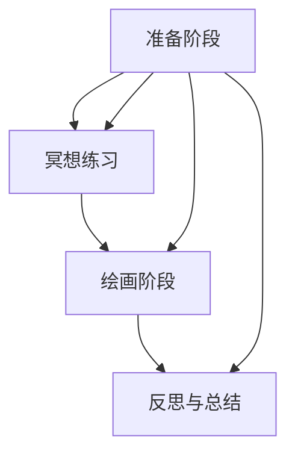

                 

# 现代冥想绘画工作坊：正念创作中的自我探索之旅

## 文章关键词

- 冥想绘画
- 正念创作
- 自我探索
- 艺术疗法
- 心理健康

## 文章摘要

本文旨在探讨冥想绘画作为一种结合冥想与绘画艺术的新型创作形式，如何通过正念实践帮助人们进行自我探索和心理健康提升。我们将从冥想绘画的起源与背景、核心概念与原理、实践方法与技巧、自我探索与情感疗愈、实际案例与应用等多个方面进行深入分析，并探讨其在现代社会中的重要性及未来发展方向。

## 引言

### 1.1 冥想绘画的起源与背景

冥想绘画这一概念起源于东方的冥想哲学与西方的绘画艺术。冥想作为一种古老的修身养性方式，早在几千年前就在印度、中国和欧洲等地得以实践。而绘画艺术则源于人类对自然世界的模仿与表达，具有悠久的历史和丰富的表现形式。

随着现代社会对心理健康问题的关注日益增加，艺术家和心理学家开始探索如何将冥想与绘画相结合，以创造一种更加全面和深入的自我探索与疗愈方式。冥想绘画应运而生，它不仅结合了冥想和绘画的基本原理，还融入了正念练习，成为一种独特的心理疗法和艺术创作形式。

### 1.2 正念的概念及其在绘画中的应用

正念（Mindfulness）是一种源自佛教的修行方法，强调对当前经验的完全接纳和非评判性观察。正念练习要求个体在特定的情境中，专注于当下的感受、思想和情绪，而不被它们所左右。近年来，正念已被广泛应用于心理学、医学和教育领域，以改善心理健康、减轻压力和提升生活质量。

在绘画中引入正念，意味着艺术家在创作过程中要保持对画布、画笔和颜料等创作工具的敏锐觉察，以及对内心情感和思维活动的深刻观察。通过这种方式，艺术家可以更加深入地探索自己的内心世界，并在创作中实现自我疗愈和成长。

### 1.3 目标读者与本书结构

本书的目标读者包括对冥想和绘画有兴趣的普通读者，艺术家、心理学从业者，以及寻求心理健康提升和自我探索的个体。本书将分为五个主要部分：

1. 引言与基础：介绍冥想绘画的起源、背景和核心概念。
2. 实践指南：提供冥想绘画的步骤和技巧。
3. 自我探索与提升：探讨冥想绘画在自我探索和心理健康提升中的应用。
4. 实际案例与应用：分享冥想绘画的实践案例和艺术结合方式。
5. 进阶练习与反思：提供高级技巧和实践建议。

## 第一部分 冥想绘画的理论基础

### 第2章 冥想的原理与类型

#### 2.1 冥想的原理

冥想是一种通过专注、冥思和放松来达到心理平静和清晰认知的练习。其原理主要基于以下几个核心概念：

1. **专注力训练**：冥想要求个体将注意力集中在某个特定的对象上，如呼吸、声音或想象中的图像。通过持续练习，可以提高专注力，减少分心和焦虑。
2. **放松反应**：冥想过程中，身体和大脑逐渐放松，进入一种低代谢状态。这种放松反应有助于降低压力水平，改善身体健康。
3. **非评判性观察**：冥想强调对当前经验的非评判性观察，即接受而不是批判或抵触。这种态度有助于培养接纳和宽容的心态。

#### 2.2 冥想的类型

冥想可以分为多种类型，每种类型都有其特定的方法和目标。以下是几种常见的冥想类型：

1. **呼吸冥想**：通过专注于呼吸，使个体逐渐放松，达到内心的平静。呼吸冥想是最简单和最普遍的冥想形式。
2. **正念冥想**：强调对当前经验的完全接纳和非评判性观察，通常通过观察呼吸、身体感受或思维活动来实现。
3. **静坐冥想**：通过长时间静坐，保持身体和思维的平静，以达到深层次的内在体验。
4. **动态冥想**：通过身体运动，如瑜伽或太极拳，结合呼吸和注意力控制，达到冥想状态。

#### 2.3 冥想与绘画的联系

冥想与绘画有着深刻的联系，两者都强调对当前经验的觉察和表达。以下是冥想与绘画的几个核心联系：

1. **专注力**：冥想绘画要求个体在创作过程中保持专注，集中注意力在画布和绘画材料上，这有助于提高专注力和减少分心。
2. **非评判性观察**：冥想绘画强调对绘画过程和结果的非评判性观察，即接受自己的创作而不进行批判或自我否定。
3. **情感表达**：通过绘画表达情感，个体可以在创作过程中获得情感上的释放和疗愈，同时也能够更好地理解自己的内心世界。
4. **创造性思维**：冥想绘画鼓励个体进行创造性的思考，通过新的视角和表现手法来表达自己的想法和感受。

### 2.4 冥想绘画的Mermaid流程图

以下是一个简化的冥想绘画流程图的Mermaid表示：

在这个流程图中，冥想绘画分为三个主要阶段：准备阶段、冥想练习阶段、绘画阶段和反思与总结阶段。每个阶段都有其特定的目标和要求。

## 第二部分 实践指南

### 第3章 冥想绘画的实践步骤

#### 3.1 准备阶段

冥想绘画的准备阶段至关重要，它为整个绘画过程奠定了基础。以下是一些准备阶段的步骤和注意事项：

1. **选择合适的地点和时间**：选择一个安静、舒适的环境，避免外界干扰。最好选择早晨或傍晚这样的时间段，因为这两个时间段通常是心理状态较为平静的时候。
2. **准备工作材料**：准备好绘画所需的材料，如画纸、画笔、颜料、调色板等。确保这些材料安全、易于清洁，并且不会造成浪费。
3. **身体放松**：在开始绘画之前，进行一些简单的身体放松练习，如深呼吸、瑜伽或伸展运动，以减轻身体紧张和焦虑。
4. **心理准备**：保持积极的心态，对自己和绘画过程充满信心。可以尝试用正向的自我暗示来调整心态，如“我可以做得很好”、“我享受这个创作过程”。

#### 3.2 冥想练习阶段

冥想练习阶段是冥想绘画的核心，它有助于个体进入一种平静和专注的状态。以下是一些冥想练习的步骤和技巧：

1. **选择冥想方式**：根据个人喜好和舒适度，选择一种冥想方式，如呼吸冥想、正念冥想或静坐冥想。
2. **集中注意力**：在冥想过程中，将注意力集中在呼吸、身体感受或想象中的图像上。当注意力分散时，不要批评自己，而是温柔地将注意力引回到呼吸或身体感受上。
3. **时间控制**：冥想的时间可以根据个人经验和舒适度来调整，初学者可以从5分钟开始，逐渐增加至10分钟或更长时间。
4. **音乐与指导**：可以使用冥想音乐或指导冥想的音频来辅助冥想，这有助于减少干扰和提升冥想效果。

#### 3.3 绘画阶段

绘画阶段是将冥想状态转化为创作的过程。以下是一些绘画阶段的步骤和技巧：

1. **放松心态**：在绘画过程中，保持轻松的心态，不要过分追求完美或结果。允许自己犯错，并将这些错误视为创作过程的一部分。
2. **自由绘画**：开始绘画时，不要过度思考或规划，而是让手和画笔自由地在画布上移动。这有助于释放内心的情感和创造力。
3. **观察和表达**：在绘画过程中，注意观察画面的细节和自己的情感变化。尝试用不同的颜色、形状和线条来表达自己的感受和想法。
4. **动态调整**：在绘画过程中，可以随时调整画面，增加或减少细节，改变颜色或形状。这种动态调整有助于保持创造力和灵活性。

#### 3.4 反思与总结阶段

反思与总结阶段是对整个冥想绘画过程的回顾和总结。以下是一些反思与总结的步骤和技巧：

1. **回顾绘画过程**：在绘画结束后，回顾整个创作过程，思考自己在冥想和绘画中的感受和体验。
2. **记录体验**：将反思的内容记录下来，这有助于加深对体验的理解和记忆。可以使用文字、图像或视频等多种方式来记录。
3. **情绪表达**：通过绘画记录下的情绪和想法，尝试用语言或其他形式来表达自己的感受，这有助于情感释放和自我探索。
4. **分享与反馈**：与他人分享自己的绘画作品和体验，获取反馈和建议。这有助于从不同角度看待自己的创作，并发现新的创作可能性。

### 3.5 实践示例

以下是一个冥想绘画的实践示例：

**步骤 1：准备阶段**
- 选择一个安静、舒适的房间，准备画纸、画笔和颜料。
- 进行简单的身体放松练习，如深呼吸和伸展运动。

**步骤 2：冥想练习阶段**
- 选择正念冥想，专注于呼吸，保持10分钟的冥想。
- 在冥想过程中，注意观察身体感受和思绪，并温柔地将注意力引回到呼吸上。

**步骤 3：绘画阶段**
- 在冥想结束后，开始绘画，用画笔在画布上自由地表达自己的感受。
- 不要过度思考或规划，让手和画笔自然地移动。
- 用不同的颜色和线条尝试表达自己的情绪和想法。

**步骤 4：反思与总结阶段**
- 完成绘画后，回顾整个创作过程，记录下自己的感受和体验。
- 与他人分享绘画作品和体验，获取反馈和建议。

通过这个实践示例，读者可以初步了解冥想绘画的步骤和技巧，并在实际操作中逐步掌握和提升。

## 第三部分 自我探索与提升

### 第4章 自我探索的冥想绘画方法

#### 4.1 内心情感的绘画表达

冥想绘画作为一种自我探索工具，可以帮助个体将内心深处的情感和感受通过绘画表达出来。以下是一些具体的步骤和技巧：

1. **情感识别**：在绘画之前，花些时间反思自己的情感状态。尝试识别出主要的情感，如快乐、悲伤、愤怒、焦虑等。
2. **情感表达**：在画布上用线条、颜色和形状来表达这些情感。例如，可以用鲜艳的颜色和激烈的线条表达愤怒，用柔和的色调和曲线表达悲伤。
3. **自由绘画**：不要担心绘画的技巧或结果，让情感自然地流淌在画布上。这有助于释放内心的情感压力，并获得更深的自我理解。

#### 4.2 意识流的绘画技巧

意识流绘画是一种让思想和情感在画布上自由流淌的技巧，它可以帮助个体深入探索内心世界。以下是一些具体的步骤和技巧：

1. **放松身心**：在开始绘画之前，通过深呼吸和放松练习来减轻身体的紧张和焦虑。
2. **放松思维**：让思维自由流动，不要试图控制或组织它。让画笔在画布上自然地跟随思维的流动。
3. **自由表达**：不要担心绘画的技巧或结果，让情感和思想在画布上自由地表达出来。这有助于探索内心深处未被意识到的情感和想法。

#### 4.3 自我认知的提升

冥想绘画不仅可以帮助个体表达情感和思想，还可以提升自我认知。以下是一些具体的步骤和技巧：

1. **反思绘画过程**：在完成绘画后，花些时间反思整个创作过程。思考自己在绘画中的感受和体验，以及这些感受和体验与自己的内心世界有何联系。
2. **记录感受**：将反思的内容记录下来，这有助于加深对感受和体验的理解。可以使用文字、图像或视频等多种方式来记录。
3. **深入探讨**：在记录的基础上，尝试深入探讨自己的感受和体验，寻找情感和思想背后的原因和意义。这有助于提升自我认知和自我理解。

### 4.4 情感疗愈的冥想绘画实例

以下是一个情感疗愈的冥想绘画实例：

**案例 1：处理悲伤**

**步骤 1：情感识别**：识别出自己近期感到的悲伤情感。

**步骤 2：准备材料**：准备好画纸、画笔和颜料。

**步骤 3：冥想练习**：进行5分钟的呼吸冥想，专注于呼吸和悲伤情感。

**步骤 4：自由绘画**：在画布上自由地表达悲伤情感，使用柔和的色调和曲线。

**步骤 5：反思与总结**：完成绘画后，回顾创作过程，记录下自己的感受和体验。

**步骤 6：分享与反馈**：与他人分享绘画作品和体验，获取反馈和建议。

**案例 2：缓解焦虑**

**步骤 1：情感识别**：识别出自己近期感到的焦虑情感。

**步骤 2：准备材料**：准备好画纸、画笔和颜料。

**步骤 3：冥想练习**：进行5分钟的呼吸冥想，专注于呼吸和焦虑情感。

**步骤 4：自由绘画**：在画布上自由地表达焦虑情感，使用鲜艳的颜色和激烈的线条。

**步骤 5：反思与总结**：完成绘画后，回顾创作过程，记录下自己的感受和体验。

**步骤 6：分享与反馈**：与他人分享绘画作品和体验，获取反馈和建议。

通过这些实例，读者可以初步了解如何通过冥想绘画进行情感疗愈和自我探索。

## 第四部分 实际案例与应用

### 第5章 冥想绘画案例研究

#### 5.1 个人冥想绘画案例

**案例 1：缓解工作压力**

**背景**：张先生是一名软件工程师，由于长时间的工作压力和繁忙的生活节奏，他感到身心疲惫，情绪低落。

**解决方案**：张先生开始尝试冥想绘画作为缓解压力的方法。他按照以下步骤进行冥想绘画：

1. **准备阶段**：选择一个安静的房间，准备好画纸、画笔和颜料。
2. **冥想练习**：每天晚上进行10分钟的呼吸冥想，专注于呼吸和放松。
3. **绘画阶段**：在冥想结束后，开始在画布上自由绘画，使用各种颜色和线条来表达自己的感受。
4. **反思与总结**：在绘画结束后，回顾整个创作过程，记录下自己的感受和体验。

**结果**：经过一段时间的冥想绘画实践，张先生的压力水平明显降低，情绪变得更加稳定。他发现自己通过绘画释放了内心的情感，更好地理解了自己的需求和愿望。

#### 5.2 团队冥想绘画案例

**案例 2：提升团队合作能力**

**背景**：一家初创公司的团队成员由于工作压力大和沟通不畅，导致团队氛围紧张，工作效率下降。

**解决方案**：公司管理层决定组织一次冥想绘画工作坊，以提升团队合作能力和沟通效果。工作坊的流程如下：

1. **准备工作**：在会议室布置画纸、画笔和颜料，并准备冥想音乐。
2. **热身活动**：进行5分钟的冥想练习，帮助团队成员放松身心。
3. **分组绘画**：将团队成员分成小组，每个小组共同完成一幅画作。
4. **绘画阶段**：团队成员在画布上自由绘画，表达自己的感受和想法。
5. **分享与反思**：在绘画结束后，每个小组分享自己的创作过程和感受，并讨论如何将冥想绘画的经验应用到工作中。

**结果**：通过冥想绘画工作坊，团队成员之间的沟通更加顺畅，团队氛围得到了明显改善。团队成员在绘画过程中学会了倾听和表达，并在反思阶段找到了提升团队合作的方法。

#### 5.3 冥想绘画在艺术治疗中的应用

**案例 3：青少年心理辅导**

**背景**：一家青少年心理咨询机构希望通过冥想绘画帮助青少年缓解心理压力和焦虑。

**解决方案**：心理咨询师为青少年安排了冥想绘画课程，课程内容包括：

1. **冥想练习**：通过呼吸冥想和正念冥想，帮助青少年放松身心。
2. **情感表达**：在绘画过程中，鼓励青少年用颜色和线条表达自己的情感和想法。
3. **情感疗愈**：通过绘画过程中的情感表达和反思，帮助青少年理解和处理自己的情感。
4. **心理辅导**：心理咨询师在绘画过程中提供个性化的心理辅导，帮助青少年解决心理问题。

**结果**：通过冥想绘画课程，青少年的心理压力和焦虑水平显著降低。他们在绘画过程中学会了自我表达和情感管理，并在心理辅导中找到了解决问题的方法。

### 第6章 冥想绘画与艺术结合

#### 6.1 冥想绘画与其他艺术形式的结合

冥想绘画可以与其他艺术形式如音乐、舞蹈、诗歌等相结合，创造出更加丰富和深入的艺术体验。以下是一些具体的结合方式：

1. **冥想音乐与绘画**：在绘画过程中播放冥想音乐，可以帮助个体更好地放松身心，提高创作效果。
2. **舞蹈与绘画**：通过舞蹈的形式表达情感和思想，然后将其转化为绘画作品，这有助于增强情感表达的深度。
3. **诗歌与绘画**：将诗歌中的意象和情感融入绘画，可以创造出具有诗意和哲理的艺术作品。

#### 6.2 艺术疗愈与冥想绘画

冥想绘画作为一种艺术疗愈方法，可以广泛应用于心理健康领域。以下是一些具体的艺术疗愈方法：

1. **情感释放**：通过绘画表达情感，个体可以在创作过程中获得情感上的释放和疗愈。
2. **心理疏导**：在绘画过程中，个体可以深入探索自己的内心世界，找到心理问题的根源并寻求解决方法。
3. **增强自我认知**：通过绘画反思和总结，个体可以更好地理解自己的情感和行为，从而提升自我认知。

#### 6.3 冥想绘画在教育中的应用

冥想绘画在教育领域具有广泛的应用前景，可以帮助学生提高专注力、创造力和心理素质。以下是一些具体的应用案例：

1. **艺术课程**：将冥想绘画引入艺术课程，可以激发学生的创作兴趣，提高艺术素养。
2. **心理课程**：在心理课程中，冥想绘画可以作为自我探索和情感管理的工具，帮助学生更好地理解自己。
3. **班级活动**：通过组织冥想绘画班级活动，可以促进班级成员之间的沟通和合作，营造积极和谐的班级氛围。

### 第7章 冥想绘画的进阶练习与反思

#### 7.1 进阶冥想绘画练习

为了进一步提升冥想绘画的效果，可以尝试以下进阶练习：

1. **长时间冥想**：逐渐增加冥想的时间，从10分钟到30分钟不等，以提高专注力和情感深度。
2. **主题绘画**：选择特定的主题，如自然、家庭、友情等，进行有针对性的绘画练习，这有助于深化对主题的理解和表达。
3. **创作挑战**：设定一些创作挑战，如使用特定的颜色或材料，或在一个限定时间内完成绘画，这有助于提升创造力和应变能力。

#### 7.2 反思与总结

在冥想绘画过程中，反思和总结是不可或缺的一部分。以下是一些反思和总结的建议：

1. **情感反思**：在每次绘画结束后，花些时间反思自己的情感体验，思考情感与绘画之间的关系。
2. **技术反思**：评估自己的绘画技巧，思考如何改进和提高。
3. **生活应用**：将冥想绘画的经验应用到日常生活中，如在工作、学习和社交场合中保持正念和专注。
4. **持续练习**：冥想绘画是一种长期练习，需要持续不断地实践和探索，以获得最佳效果。

### 第8章 结论

冥想绘画作为一种结合冥想和绘画艺术的新型创作形式，为人们提供了一种独特的自我探索和心理疗愈方式。通过冥想绘画，个体可以在创作过程中获得情感上的释放和疗愈，提高专注力和创造力，并提升自我认知。

本文从冥想绘画的起源与背景、核心概念与原理、实践方法与技巧、自我探索与情感疗愈、实际案例与应用等多个方面进行了深入分析。随着现代社会对心理健康问题的关注日益增加，冥想绘画作为一种心理疗法和艺术创作形式，具有广阔的应用前景。

最后，鼓励读者尝试冥想绘画，并在实践中探索和发现自己的内心世界。通过持续练习和反思，相信每个人都能在冥想绘画中找到属于自己的自我探索之旅。

## 附录

### 附录A 冥想绘画资源与工具

以下是一些推荐的冥想绘画资源和工具，帮助读者开始冥想绘画实践：

1. **冥想音乐**：
   - **Uplifted**：提供各种冥想和放松音乐，适合在绘画时使用。
   - **MoodDao**：提供定制化的冥想音乐，可以根据个人喜好选择。

2. **绘画工具**：
   - **水彩颜料**：易于使用，颜色鲜艳，适合进行自由绘画。
   - **素描本**：便携式素描本方便随时随地记录灵感。

3. **在线冥想绘画课程**：
   - **冥想绘画在线工作坊**：提供各种冥想绘画课程，适合初学者和进阶者。
   - **CanvasPop**：提供在线绘画课程，涵盖各种绘画技巧和风格。

4. **推荐书籍**：
   - **《冥想绘画：发现内心深处的艺术》**：详细介绍冥想绘画的方法和技巧。
   - **《正念艺术疗法》**：探讨艺术疗法在心理健康提升中的应用。

### 附录B 拓展阅读

1. **《禅与摩托车维修艺术》**：李维•史特劳斯（Levi Strauss）所著，探讨禅宗思想在生活中的应用，有助于理解冥想绘画的哲学背景。
2. **《正念：如何在生活中培养正念》**：乔·卡巴金（Jon Kabat-Zinn）所著，详细介绍了正念练习的方法和应用，对冥想绘画有重要指导意义。
3. **《艺术治疗：理论与实践》**：苏珊·戴维斯（Susan Davis）所著，介绍了艺术疗法在不同领域的应用，包括心理健康和情感疗愈。

### 附录C 注意事项

1. **尊重个人感受**：在冥想绘画过程中，尊重自己的感受和体验，不要强迫自己达到特定的目标或结果。
2. **安全使用绘画工具**：确保使用绘画工具的安全，避免误食或误伤。
3. **保持清洁**：在绘画结束后，及时清洁画具和画布，保持工作环境的整洁。

通过以上资源和工具，读者可以更好地开始冥想绘画实践，并在创作中探索自我和提升心理健康。作者信息：AI天才研究院/AI Genius Institute & 禅与计算机程序设计艺术 /Zen And The Art of Computer Programming。感谢您的阅读！

