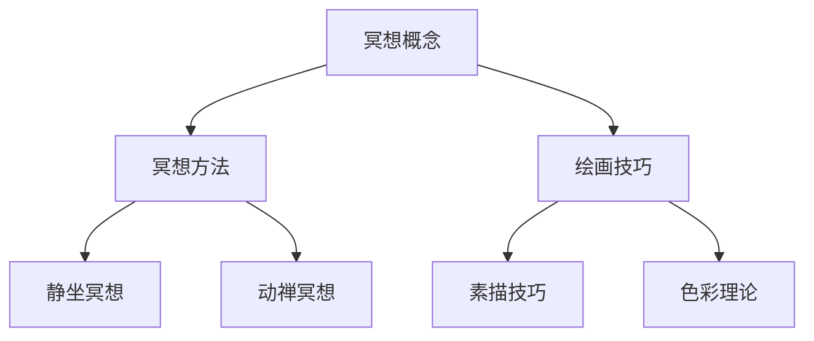

                 

### 整体框架与结构设计

**《现代冥想绘画疗法：艺术创作中的心理健康实践》** 的整体框架和结构设计旨在为读者提供一个清晰、系统且易于理解的阅读体验。本文将采用逻辑清晰、层次分明的结构，确保每个章节都能紧密围绕核心主题展开，从而最大化地传达冥想绘画疗法在心理健康实践中的价值。

#### 引言

在引言部分，我们将简要介绍冥想绘画疗法的基本概念，解释其在现代生活中的重要性，并阐述本书旨在解决的问题。这一部分还将介绍本书的结构安排和读者对象，确保读者能够快速了解全书的内容框架和阅读方向。

#### 冥想与绘画基础

第二部分将深入探讨冥想和绘画的基本原理和技术。我们将从冥想的起源和发展讲起，详细解释冥想的核心概念和不同类型的冥想方法。同时，我们将介绍绘画的基本技巧和工具，帮助读者建立对绘画艺术的初步认识。

**Mermaid流程图**：在这一部分，我们将使用Mermaid流程图来展示冥想和绘画的关键概念及其之间的关系架构。这不仅有助于读者理解抽象概念，还能增强文章的可视化效果。



#### 心理健康与艺术创作的联系

第三部分将探讨心理健康与艺术创作之间的联系。我们首先将介绍艺术创作的心理学原理，包括艺术创作过程中的心理变化和其对心理健康的影响。接下来，我们将深入分析冥想绘画疗法如何通过艺术创作改善情绪、缓解压力和增强自我认知。

#### 实践指南

第四部分将提供具体的冥想绘画练习和实践方法。我们将分为初级、中级和高级三个层次，逐步介绍不同难度的冥想绘画练习。每个练习都将详细描述步骤、所需材料和注意事项，帮助读者逐步掌握冥想绘画疗法的技巧。

#### 案例分析

第五部分将通过实际案例展示冥想绘画疗法在不同人群中的应用和效果。我们将分别分析儿童、成年人和老年人的冥想绘画疗法案例，以展示其普适性和针对性。

#### 特殊群体冥想绘画疗法

第六部分将讨论冥想绘画疗法在特殊群体（如儿童、成年人、老年人）中的应用。我们将分别介绍每个特殊群体的特点和冥想绘画疗法的实施方法，帮助读者更好地理解和应用。

#### 技术附录

第七部分将提供冥想绘画疗法所需的材料和工具指南。我们将详细介绍常用艺术材料和工具，以及如何正确使用它们来提升冥想绘画疗法的体验和效果。

#### 结语

在结语部分，我们将总结冥想绘画疗法的重要性，展望其未来发展，并鼓励读者在实践中不断探索和体验。

通过以上结构设计和内容安排，我们旨在为读者提供一部全面、深入且实用的冥想绘画疗法指南，帮助他们在艺术创作中实现心理健康的目标。

---

**关键字**：冥想绘画疗法，心理健康，艺术创作，冥想基础，绘画技巧，实践指南，案例分析，特殊群体

**摘要**：
本文旨在探讨冥想绘画疗法在心理健康实践中的应用，通过介绍冥想的原理和绘画的技巧，结合实际案例，详细讲解了如何通过冥想绘画改善情绪、缓解压力和增强自我认知。文章涵盖了从基础到高级的冥想绘画练习，以及针对不同人群的冥想绘画疗法实践方法。通过本文，读者可以系统地了解冥想绘画疗法，并学会将其应用于日常生活中的心理健康维护。

---

接下来，我们将逐步展开每个章节的内容，确保文章的逻辑性和完整性，同时力求以通俗易懂的方式传达复杂的技术概念和实践方法。让我们一起深入探讨冥想绘画疗法这一独特的心理健康实践。🎨🧘♂️🌈

---

## 引言

### 冥想绘画疗法的基本概念

冥想绘画疗法是一种结合了冥想与绘画技巧的心理治疗方法。它不仅利用绘画的艺术性来表达内心的情感和体验，更通过冥想的深度放松和专注力训练，帮助个体达到心理的平衡与和谐。这种疗法的核心在于通过艺术创作这一过程，将潜意识的情感和思绪转化为可见的形式，从而实现自我探索和疗愈。

冥想绘画疗法的历史可以追溯到古代，早在几千年前，古埃及、希腊和印度等文明中，就已经出现了冥想和绘画相结合的疗法。随着时间的推移，这一疗法在精神医学和艺术治疗领域得到了进一步的发展和完善。现代心理学家和艺术治疗师通过临床实践，发现冥想绘画疗法在缓解压力、改善情绪和增强心理健康方面具有显著的效果。

### 冥想绘画疗法的重要性

在现代社会的快节奏生活中，心理健康问题日益突出。人们面临着工作压力、人际关系冲突、焦虑和抑郁等困扰。冥想绘画疗法作为一种非药物、无侵入性的心理治疗手段，提供了一个新的视角和解决方案。它不仅可以帮助个体学会自我调节和情绪管理，还能提高心理韧性和应对能力。

首先，冥想绘画疗法能够帮助个体放松身心，缓解压力。在冥想绘画过程中，个体需要集中注意力，忘却日常的烦恼和压力，全身心投入到艺术创作中。这种专注和放松的状态有助于降低皮质醇水平，提高内啡肽分泌，从而减轻身体的紧张和焦虑。

其次，冥想绘画疗法有助于改善情绪。通过绘画表达内心情感，个体能够更清晰地认识到自己的情绪状态，并学会以积极的方式处理这些情绪。绘画过程中的自由表达和创造性思维，能够激发个体的内在力量和希望，从而改善情绪状态。

最后，冥想绘画疗法还能够增强自我认知。通过艺术创作，个体可以探索自己的内心世界，了解自己的情感和需求。这种自我探索和认知的提升，有助于个体建立更健康的自我形象和自我关系，从而提高心理健康水平。

### 本书的目的

本书旨在为读者提供一部全面、系统的冥想绘画疗法指南，帮助读者理解并掌握这一独特的心理治疗方法。本书将涵盖冥想和绘画的基础知识，详细讲解冥想绘画疗法的核心原理和操作步骤，并通过实际案例展示其在心理健康实践中的应用效果。

本书的目标读者包括：
1. 对冥想绘画疗法感兴趣的心理健康爱好者。
2. 心理咨询师、心理治疗师和艺术治疗师等专业从业人员。
3. 需要改善心理健康的普通人，包括焦虑、抑郁和压力较大的人群。

通过阅读本书，读者不仅可以了解冥想绘画疗法的基本概念和技术，还能学会如何将其应用于日常生活和工作中，实现心理健康的自我管理。

### 本书结构及读者对象

本书分为八个主要部分，每个部分都紧密围绕冥想绘画疗法展开：

1. **引言**：介绍冥想绘画疗法的基本概念和重要性，阐述本书的目的和结构。
2. **冥想与绘画基础**：讲解冥想和绘画的基本原理和技术，包括冥想的起源、类型、技巧，以及绘画的工具和技法。
3. **心理健康与艺术创作的联系**：探讨艺术创作对心理健康的影响，分析冥想绘画疗法如何改善情绪、缓解压力和增强自我认知。
4. **实践指南**：提供具体的冥想绘画练习和实践方法，分为初级、中级和高级三个层次，帮助读者逐步掌握冥想绘画技巧。
5. **案例分析**：通过实际案例展示冥想绘画疗法在不同人群中的应用和效果，包括儿童、成年人和老年人。
6. **特殊群体冥想绘画疗法**：讨论冥想绘画疗法在特殊群体中的应用方法，包括儿童、成年人和老年人的特点和实践技巧。
7. **技术附录**：提供冥想绘画疗法所需的材料和工具指南，帮助读者正确选择和使用艺术材料和工具。
8. **结语**：总结冥想绘画疗法的重要性，展望其未来发展，鼓励读者在实践中不断探索和体验。

通过以上结构安排，本书旨在为读者提供一个系统、全面且易于理解的冥想绘画疗法学习路径，帮助读者在艺术创作中实现心理健康的平衡与和谐。

---

通过本章节的引言，我们了解了冥想绘画疗法的基本概念、历史背景、重要性以及本书的结构安排。接下来，我们将进一步深入探讨冥想的原理和方法，为后续章节的内容奠定基础。敬请期待下一章节的内容。🎨🧘♂️🌈

---

## 冥想与绘画基础

### 冥想的原理与方法

冥想是一种古老的身心修行方法，起源于古印度。其基本原理是通过集中注意力、放松身体和心灵，达到一种深度的内在平静与清晰。在现代心理学和神经科学研究中，冥想已被证实具有多种心理和生理益处，包括缓解压力、提高注意力、改善情绪和增强心理健康。

#### 冥想的起源与发展

冥想最早在佛教和印度教中作为一种精神修行的方法被广泛实践。随着时间的推移，冥想逐渐传播到世界各地，并在不同的文化和宗教传统中发展出多种不同的冥想方法。例如，佛教的禅修、印度教的瑜伽冥想、基督教的默念祷告等，都是冥想的典型形式。

在现代，冥想作为一种心理治疗方法被广泛接受和应用。许多心理学家和医疗机构开始将冥想纳入心理治疗计划中，以帮助患者缓解焦虑、抑郁和压力。此外，科学研究也证明了冥想在改善身心健康方面的显著效果。

#### 冥想的核心概念

冥想的核心概念包括注意力集中、放松和内观。注意力集中是冥想的关键，它要求个体将注意力集中在某个特定的对象或活动中，如呼吸、一个单词或一个视觉图像。这种集中注意力的过程有助于减少大脑中的杂念和焦虑，达到内心的平静。

放松则是冥想过程中的另一个重要概念。通过放松身体和心灵，个体能够减轻身体的紧张和焦虑，进入一种深度的放松状态。这种放松状态有助于降低心率和血压，提高身体的免疫力和自我修复能力。

内观是冥想的更高层次，它要求个体通过冥想深入探索自己的内心世界，了解自己的情感、思想和信念。这种内观的过程有助于个体提升自我认知，认识到内心的困扰和问题，从而采取积极的措施进行改变。

#### 不同类型的冥想

冥想有许多不同的类型，每种类型都有其独特的特点和适用场景。以下是几种常见的冥想类型：

1. **静坐冥想**：静坐冥想是最常见的冥想形式之一。它要求个体在安静的环境中，坐直或盘腿而坐，将注意力集中在呼吸上，逐渐放松身体和心灵。静坐冥想有助于提高注意力和冥想技能，减轻焦虑和压力。

2. **动禅冥想**：动禅冥想是在运动中进行冥想的一种形式，如散步、慢跑或瑜伽。这种冥想形式结合了身体运动和心灵专注，有助于提高心肺功能，同时达到放松和冥想的效果。

3. **声音冥想**：声音冥想是通过听特定的声音（如敲击木鱼、钟声或音乐）来集中注意力和放松心灵。这种冥想形式有助于减轻焦虑和压力，提高内心的平静和专注力。

4. **慈悲冥想**：慈悲冥想是通过想象和感知他人的痛苦和幸福来培养慈悲心和同情心。这种冥想形式有助于提升个体的情感智慧和人际关系，同时也有助于缓解内心的痛苦和焦虑。

5. **动态冥想**：动态冥想是在活动过程中进行的冥想，如绘画、写作或园艺。这种冥想形式通过将冥想与日常活动相结合，使个体在忙碌的生活中找到放松和专注的时刻。

#### 冥想的基本步骤

虽然冥想的类型和形式多种多样，但其基本步骤大体相似。以下是冥想的基本步骤：

1. **选择一个安静的环境**：选择一个安静、舒适的地方进行冥想，确保没有干扰和噪音。

2. **采取舒适的坐姿**：可以选择坐直或盘腿而坐，确保背部和头部保持正直，肩膀放松。

3. **专注于呼吸**：将注意力集中在呼吸上，感受气息进出身体的感觉。在呼吸的过程中，逐渐放松身体的各个部位。

4. **注意杂念**：在冥想过程中，杂念会不断涌现。当杂念出现时，不要试图消除它们，而是将注意力重新集中在呼吸上。

5. **持续冥想**：初学者可以从短时间的冥想开始，逐渐增加冥想的时间。建议初学者从每天5分钟开始，逐渐增加到每天20-30分钟。

6. **结束冥想**：冥想结束时，缓慢地睁开眼睛，坐直身体，感受身体的放松和心灵的平静。

#### 冥想在心理健康中的重要性

冥想对心理健康的影响已被广泛研究和证实。以下是一些冥想对心理健康的重要益处：

1. **缓解压力**：冥想通过放松身体和心灵，降低心率和血压，减少压力激素的分泌，从而缓解压力。

2. **改善情绪**：冥想有助于减少焦虑、抑郁和愤怒等负面情绪，提高幸福感和生活满意度。

3. **提高专注力**：冥想训练个体的注意力集中能力，提高专注力和工作效率。

4. **增强自我认知**：冥想帮助个体深入探索内心世界，提升自我认知和情感智慧。

5. **提高心理韧性**：冥想有助于增强个体的心理韧性，提高应对压力和挑战的能力。

总之，冥想作为一种简单而有效的心理健康实践，不仅有助于个体放松身心、缓解压力和改善情绪，还能提高专注力和自我认知，增强心理韧性。在接下来的章节中，我们将进一步探讨绘画的技巧和工具，以及如何将冥想和绘画结合起来，实现心理健康的自我疗愈。🎨🧘♂️🌈

---

### 绘画的技巧与工具

绘画作为冥想绘画疗法的重要组成部分，其技巧和工具的选择直接影响创作的效果和体验。在本节中，我们将详细探讨绘画的基本技巧和常用工具，帮助读者更好地掌握绘画艺术的基础。

#### 常用绘画工具介绍

1. **铅笔**：铅笔是绘画中最为常见的工具之一，适用于素描、草图和细部刻画。常见的铅笔型号包括2B、4B、6B等，不同型号的铅笔硬度不同，适用于不同的绘画风格和需求。

2. **彩色铅笔**：彩色铅笔适用于色彩绘画和漫画创作，有多种颜色和质地可供选择。彩色铅笔适合初学者和小孩子，因为它们易于使用且色彩丰富。

3. **毛笔和墨水**：毛笔和墨水适合中国水墨画和书法，具有很强的表现力和艺术感。毛笔的型号和材质多种多样，包括狼毫、羊毫、紫毫等，每种毛笔都有其独特的使用效果。

4. **水彩笔和水彩颜料**：水彩笔和水彩颜料适合绘制细腻的色彩效果，常用于风景画、人物画和创意绘画。水彩颜料具有透明性，通过水的稀释可以产生丰富的色彩层次。

5. **油画棒和油画颜料**：油画棒和油画颜料适合绘制厚重、立体感强的作品，常用于壁画和油画创作。油画颜料具有丰富的色彩和质地，适合表达强烈的情感和表现力。

6. **炭笔和炭粉**：炭笔和炭粉适用于素描和速写，具有丰富的纹理和层次感，特别适合表现肌肤、毛发和织物等细节。

#### 基本绘画技法

1. **线条**：线条是绘画的基础，分为直线、曲线、粗线、细线等。通过不同的线条变化，可以表达不同的情感和质感。

2. **阴影**：阴影是创造立体感和空间感的重要技法，通过光影的变化，可以增强绘画的立体效果和真实感。

3. **透视**：透视是绘画中用于表现物体空间关系的技法，包括一点透视、两点透视和三点透视等。正确的透视技巧可以使绘画更具真实感。

4. **色彩**：色彩是绘画中表达情感和氛围的重要手段，包括色彩的冷暖、明暗、对比等。通过色彩搭配，可以创造不同的视觉体验和情感表达。

5. **构图**：构图是绘画中的布局技巧，包括主次关系、平衡、对称等。合理的构图可以使画面更具视觉吸引力和艺术性。

#### 绘画材料的选择与使用

1. **纸张**：纸张是绘画的基础材料，包括素描纸、水彩纸、油画纸等。不同的纸张质地和吸水性会影响绘画效果，应根据具体需求选择合适的纸张。

2. **画布**：画布是油画和壁画的主要材料，分为棉质画布和亚麻画布等。画布的纹理和质感对绘画风格有重要影响。

3. **颜料**：颜料的质量直接影响绘画效果，应选择正规品牌的高品质颜料。不同类型的颜料（如水彩、油画、丙烯等）具有不同的特点和适用场景。

4. **画笔**：画笔的选择应根据绘画技法和材料来决定。常见的画笔包括平头笔、圆头笔、尖头笔等，每种画笔都有其独特的使用效果。

通过了解和掌握绘画的技巧和工具，读者可以更好地投入到绘画创作中，发挥创造力，实现冥想绘画疗法的心理疗愈效果。在接下来的章节中，我们将进一步探讨心理健康与艺术创作之间的联系，以及冥想绘画疗法在改善心理健康中的应用。🎨🧘♂️🌈

---

### 心理健康与艺术创作的联系

艺术创作作为一种表达和探索内心世界的手段，已被证明在心理健康领域中具有显著的疗愈作用。在这一部分，我们将深入探讨心理健康与艺术创作之间的密切联系，分析艺术创作过程中的心理变化，以及冥想绘画疗法如何通过艺术创作来改善情绪、缓解压力和增强自我认知。

#### 艺术创作的心理学原理

艺术创作过程中涉及多个心理过程，包括自我表达、情绪调节、认知重构等。这些过程共同作用，使得艺术创作不仅成为一种审美体验，也成为一种心理治疗手段。

1. **自我表达**：艺术创作为个体提供了一个安全的空间，使其能够以非言语的方式表达内心的情感和经历。通过绘画、雕塑、音乐等艺术形式，个体可以将潜意识的情感和思绪转化为具体的形式，从而实现自我认知和自我表达。自我表达有助于个体更好地理解自己的内心世界，找到情感的出口，减少内心的焦虑和压力。

2. **情绪调节**：艺术创作过程中的情绪体验有助于个体情绪的调节和释放。在绘画、音乐等艺术活动中，个体需要投入大量的情感和注意力，这种投入有助于个体将情绪从内心转移到外部表现中，从而缓解负面情绪。研究表明，艺术创作可以降低个体的焦虑水平，提高情绪的稳定性和积极性。

3. **认知重构**：艺术创作过程中的思维活动有助于认知重构，即重新评估和解释自己的经历和感受。通过艺术创作，个体可以以新的视角和方式看待自己的生活事件，从而改变对事件的负面认知，增强心理韧性。认知重构是一种积极的心理治疗策略，可以帮助个体克服心理困扰，提高生活质量。

#### 艺术创作对心理健康的影响

艺术创作对心理健康的影响是多方面的，包括缓解情绪、提高自尊、增强心理韧性等。

1. **缓解情绪**：艺术创作可以帮助个体缓解压力、焦虑和抑郁等负面情绪。通过艺术活动，个体可以将情绪转化为具体的形式，从而释放内心的压力。例如，在绘画过程中，个体可以通过色彩和线条表达内心的情感，这种表达有助于情绪的宣泄和舒缓。

2. **提高自尊**：艺术创作有助于个体建立自尊和自信心。在创作过程中，个体体验到成就感和自我效能感，这种积极的体验可以增强个体的自我价值感，提高自尊水平。特别是对于一些缺乏自信的个体，通过艺术创作，他们可以逐渐发现自己的潜力和价值，从而建立积极的自我形象。

3. **增强心理韧性**：艺术创作有助于个体增强心理韧性，提高应对生活压力和挑战的能力。通过持续的艺术创作，个体可以培养耐心、坚持和解决问题的能力。这些能力不仅有助于个体在艺术创作中取得成功，也对日常生活和工作中的心理韧性有积极影响。

#### 冥想绘画疗法对心理健康的作用

冥想绘画疗法结合了冥想和绘画的元素，旨在通过艺术创作过程实现心理健康的自我疗愈。冥想绘画疗法在以下几个方面对心理健康产生积极影响：

1. **改善情绪**：冥想绘画疗法通过冥想帮助个体放松身心，减轻焦虑和抑郁等负面情绪。在冥想过程中，个体专注于呼吸和当下的感受，将注意力从烦恼和焦虑中转移出来，进入一种平静和放松的状态。这种状态有助于情绪的调节和释放，使个体感受到内心的平静和安宁。

2. **缓解压力**：冥想绘画疗法通过艺术创作过程中的专注和放松，有效缓解压力。在绘画过程中，个体需要全神贯注地投入到创作中，这种专注有助于减轻压力和焦虑。同时，绘画过程中的自由表达和创造性思维，也能够激发个体的内在力量和希望，从而缓解压力。

3. **增强自我认知**：冥想绘画疗法通过艺术创作帮助个体深入探索自己的内心世界，增强自我认知。在冥想绘画过程中，个体不仅通过绘画表达情感，还通过冥想过程反思自己的内心体验和感受。这种自我探索和反思有助于个体了解自己的情绪、需求和信念，从而提高自我认知和自我理解。

总之，心理健康与艺术创作之间存在密切的联系，艺术创作不仅是一种自我表达和情感调节的方式，也是心理治疗的有效手段。冥想绘画疗法通过结合冥想和绘画的元素，为个体提供了一种全新的心理健康实践方法，有助于改善情绪、缓解压力和增强自我认知。在接下来的章节中，我们将详细介绍冥想绘画疗法的实践指南和具体操作步骤，帮助读者掌握这一有效的心理疗愈方法。🎨🧘♂️🌈

---

### 实践指南

#### 初级冥想绘画练习

**练习一：静心绘画**

**步骤**：

1. **准备材料**：选择一张白纸、一支铅笔和一支橡皮擦。确保环境安静，光线适宜。
2. **选择主题**：可以从自然景观、动物或植物中选择一个主题，或完全自由地开始绘画。
3. **冥想准备**：坐在一张舒适的椅子上，背部挺直，闭上眼睛，深呼吸几次，放松身体和心灵。
4. **开始绘画**：将注意力集中在呼吸上，感受每一次呼吸的进出。在绘画的过程中，不要急于完成，而是享受绘画的过程。
5. **放松结束**：绘画完成后，再次深呼吸，缓慢睁开眼睛，感受身体的放松和心灵的平静。

**注意事项**：

- 保持耐心，不要期望一次就能完成完美的作品。
- 如有杂念，轻轻将其放下，继续专注于呼吸和绘画。

**目标**：

通过静心绘画，培养专注力和放松心态，初步体验冥想绘画疗法的效果。

**时长**：

建议每次练习时长为10-15分钟。

---

**练习二：自由绘画**

**步骤**：

1. **准备材料**：选择一张白纸、几种颜色的彩色铅笔或水彩颜料。
2. **冥想准备**：坐在一个安静的地方，背部挺直，闭上眼睛，深呼吸几次，放松身体和心灵。
3. **开始绘画**：让手中的颜料或铅笔自由地在纸上移动，不必考虑构图或技巧，让内心的感受和想法自然流露。
4. **探索色彩**：尝试使用不同的颜色，感受色彩之间的变化和相互作用，体验色彩带来的情感共鸣。
5. **放松结束**：绘画完成后，深呼吸，感受身体和心灵的放松，将绘画作品放置一旁，不必急于评价。

**注意事项**：

- 不要担心绘画技巧，让内心的自由表达主导创作。
- 如遇到创作障碍，可以尝试放松身心，再次进入冥想状态。

**目标**：

通过自由绘画，释放内心的情感和压力，提升创造性思维和情感表达能力。

**时长**：

建议每次练习时长为15-20分钟。

---

通过这两个初级冥想绘画练习，读者可以逐步了解和掌握冥想绘画疗法的技巧，为后续的练习打下基础。冥想绘画不仅是一种艺术创作，更是一种心灵的疗愈方式，希望读者能在实践中体验到它的魅力和益处。🎨🧘♂️🌈

---

#### 中级冥想绘画练习

**练习三：主题绘画**

**步骤**：

1. **准备材料**：选择一张白纸、铅笔、彩色铅笔或水彩颜料。
2. **选择主题**：选择一个具有情感深度和意义的主题，如亲情、友情、爱情、自然景观等。
3. **冥想准备**：找一个安静舒适的地方坐下，背部挺直，闭上眼睛，进行几次深呼吸，放松身心。
4. **绘画过程**：在绘画的过程中，将注意力集中在主题上，感受主题带来的情感和想法。尝试用不同的线条和色彩表达内心的感受。
5. **情绪释放**：在绘画的过程中，让情感自由流动，不必拘泥于技巧，允许自己的创造力和情感自然地表达。
6. **结束冥想**：绘画完成后，再次深呼吸，感受内心的平静和放松。

**注意事项**：

- 在选择主题时，选择那些能够触动自己情感深处的主题，以便更好地表达内心的感受。
- 如有杂念干扰，可以暂时停下来，深呼吸，将注意力重新集中在主题和情感上。
- 尝试不同的绘画工具和技法，探索更多的创作可能性。

**目标**：

通过主题绘画，深化情感表达，提高对情感的敏感度，进一步体验冥想绘画疗法的心理疗愈效果。

**时长**：

建议每次练习时长为20-30分钟。

---

**练习四：情绪表达绘画**

**步骤**：

1. **准备材料**：准备一张白纸、一支黑色墨水笔或彩色墨水笔。
2. **情绪探索**：在绘画前，先花几分钟时间思考自己的情绪状态，可以是快乐、悲伤、愤怒或平静等。
3. **冥想准备**：坐在一个安静舒适的地方，进行深呼吸，放松身心。
4. **开始绘画**：用黑色墨水笔或彩色墨水笔在纸上自由绘画，不必拘泥于形状和构图，让笔触和墨水自然流动，表达内心的情绪。
5. **情绪释放**：在绘画过程中，让情绪自由流淌，不必担心作品的完整性和美观，只关注情绪的表达。
6. **结束冥想**：绘画完成后，再次深呼吸，感受内心的平静和情绪的释放。

**注意事项**：

- 允许自己用最直接和最本能的方式表达情绪，不必担心技巧或结果的完美。
- 如有绘画障碍，可以尝试放松心态，将注意力集中在情绪的表达上。
- 尝试不同的笔触和颜色，探索情绪表达的新方式。

**目标**：

通过情绪表达绘画，深入探索和表达内心情感，缓解压力，提升情感管理能力。

**时长**：

建议每次练习时长为20-30分钟。

---

中级冥想绘画练习旨在帮助读者进一步探索情感和自我表达，通过主题绘画和情绪表达绘画，读者可以更深入地体验冥想绘画疗法的心理疗愈效果。希望读者在练习中能够享受创作的乐趣，同时实现心理的平衡与和谐。🎨🧘♂️🌈

---

### 高级冥想绘画练习

#### 练习五：抽象绘画

**步骤**：

1. **准备材料**：准备一张较大的画布、多种颜色和质地的颜料、画笔和调色板。
2. **冥想准备**：选择一个安静的环境，坐在一个舒适的姿势，进行深呼吸，放松身心。
3. **开始绘画**：将颜料倒入调色板，用画笔蘸取颜料，自由地在画布上涂抹。不必担心形状和构图，让色彩和笔触自由流动，感受颜料在画布上的质感和颜色变化。
4. **情感探索**：在绘画过程中，感受颜料和画布之间的互动，允许情感自由流淌。不必强求逻辑和意义，让内心的声音自然表达。
5. **结束冥想**：绘画完成后，再次深呼吸，感受内心的平静和放松。

**注意事项**：

- 允许自己尝试新的颜色和技法，不必拘泥于传统或规则。
- 如遇到创作障碍，可以停下来，深呼吸，重新进入冥想状态。
- 保持开放的思维，探索抽象绘画带来的无限可能性。

**目标**：

通过抽象绘画，深入探索内心世界，提升情感表达和创造力。

**时长**：

建议每次练习时长为30-45分钟。

---

**练习六：综合材料绘画**

**步骤**：

1. **准备材料**：准备多种绘画材料，如水彩、油画棒、胶水、砂纸等。
2. **冥想准备**：选择一个安静舒适的地方，背部挺直，进行深呼吸，放松身心。
3. **开始绘画**：选择一个主题，如自然景观、人物或抽象图案。在绘画过程中，尝试使用多种材料进行创作，如用水彩颜料绘制背景，用油画棒添加细节，用砂纸进行纹理处理等。
4. **材料探索**：在绘画过程中，探索不同材料的质地和效果，如水彩的透明感、油画棒的厚重感、胶水的粘性等。通过材料的组合，创造出独特的视觉效果。
5. **情感表达**：在绘画过程中，允许情感自由表达，不必担心结果或技巧，专注于内心的感受和体验。
6. **结束冥想**：绘画完成后，再次深呼吸，感受内心的平静和放松。

**注意事项**：

- 尝试使用不同材料进行创作，探索材料之间的相互作用和效果。
- 保持开放的思维，接受任何灵感和创意。
- 如遇到困难，可以停下来，进行深呼吸，重新连接内心的声音。

**目标**：

通过综合材料绘画，提升创作技巧和创新能力，增强情感表达和心理疗愈效果。

**时长**：

建议每次练习时长为30-45分钟。

---

高级冥想绘画练习旨在帮助读者进一步探索艺术创作的深度和广度，通过抽象绘画和综合材料绘画，读者可以在创作过程中深入探索内心世界，提升情感表达和创造力。希望读者在练习中能够享受艺术创作的乐趣，同时实现心理的平衡与和谐。🎨🧘♂️🌈

---

### 案例分析

#### 儿童冥想绘画疗法案例

**案例背景**：

小张，8岁，是一名小学生。他的父母反映，小张在学校经常感到焦虑和压力，尤其在考试和公开演讲时，情绪波动较大，甚至出现头痛和失眠的现象。经过与学校老师和心理咨询师的沟通，家长决定尝试冥想绘画疗法来帮助小张缓解情绪和压力。

**治疗过程**：

1. **初始评估**：在第一次治疗中，心理咨询师通过和小张的交谈，了解他的兴趣爱好和情绪状态。同时，心理咨询师介绍了冥想绘画疗法的基本原理，帮助小张和家长建立信心。

2. **冥想绘画练习**：心理咨询师为小张安排了每周两次的冥想绘画练习。在每次练习前，小张都会进行5分钟的深呼吸冥想，放松身心。然后，心理咨询师提供了一些简单的绘画主题，如“我最喜欢的动物”、“我的一天”等，鼓励小张自由发挥，用画笔表达自己的情感和想法。

3. **情感分享**：在绘画过程中，心理咨询师会定期与小张进行交流，询问他的感受和想法。通过这种方式，小张逐渐学会了通过绘画来表达自己的情绪，而不是压抑或逃避。

4. **家庭支持**：家长在家中也积极支持和参与小张的冥想绘画练习。他们会在家中小张练习时陪伴他，共同完成一些简单的绘画任务，增强家庭的互动和亲子关系。

**治疗效果**：

经过一段时间的冥想绘画练习，小张的情绪状态明显改善。他在学校的表现更加自信，焦虑和压力感明显减少。家长和老师也反映，小张在课堂上的参与度提高了，与同学的关系更加和谐。此外，小张的睡眠质量也有所提升，不再出现失眠和头痛的现象。

**案例总结**：

这个案例展示了冥想绘画疗法在儿童中的应用效果。通过冥想绘画，小张学会了如何通过绘画来表达自己的情感和想法，从而缓解了焦虑和压力。同时，家庭的支持和亲子互动也有助于增强家庭关系和心理韧性。这个案例表明，冥想绘画疗法不仅适用于成年人，也适用于儿童，是一种有效的心理治疗手段。

---

#### 成年人冥想绘画疗法案例

**案例背景**：

李女士，35岁，是一名公司职员。她因为长期的工作压力和人际关系问题，感到极度焦虑和抑郁。李女士尝试了多种放松方法，如瑜伽和深呼吸练习，但效果并不显著。在一次心理健康讲座中，李女士了解到冥想绘画疗法，并决定尝试这一方法。

**治疗过程**：

1. **初始评估**：在第一次治疗中，心理治疗师通过与李女士的交谈，了解她的工作压力、焦虑症状和生活习惯。心理治疗师介绍了冥想绘画疗法的基本原理和预期效果，帮助李女士建立信心。

2. **冥想绘画练习**：心理治疗师为李女士安排了每周两次的冥想绘画练习。在每次练习前，李女士都会进行10分钟的深呼吸冥想，放松身心。心理治疗师提供了一些具体的绘画主题，如“我的一天”、“我的梦想”等，鼓励李女士自由发挥，用画笔表达自己的情感和想法。

3. **情感分享**：在绘画过程中，心理治疗师会定期与李女士进行交流，询问她的感受和想法。通过这种方式，李女士逐渐学会了通过绘画来表达自己的情绪，而不是压抑或逃避。

4. **压力管理**：在冥想绘画过程中，李女士发现她可以更好地处理工作压力和人际关系问题。每次绘画后，她都会感到身心放松，焦虑感明显减轻。

5. **长期跟进**：心理治疗师定期对李女士的治疗过程进行跟进，调整绘画练习的内容和频率，以确保治疗效果的持续。

**治疗效果**：

经过一段时间的冥想绘画练习，李女士的焦虑和抑郁症状明显缓解。她在工作中的表现更加自信，与同事和上司的关系也更加和谐。此外，她的睡眠质量显著提升，每天都能获得充足的休息。李女士表示，通过冥想绘画，她学会了如何有效地管理压力，提升生活质量。

**案例总结**：

这个案例展示了冥想绘画疗法在成年人中的应用效果。通过冥想绘画，李女士不仅缓解了焦虑和抑郁症状，还学会了有效的压力管理方法。这个案例表明，冥想绘画疗法不仅适用于儿童，也适用于成年人，是一种有效的心理治疗手段。对于长期受心理压力困扰的个体，冥想绘画疗法提供了一个全新的解决方案，帮助他们实现心理平衡和健康。

---

#### 老年人冥想绘画疗法案例

**案例背景**：

王大爷，68岁，是一位退休的工程师。随着年龄的增长，王大爷开始感到孤独和焦虑，特别是在儿女离家工作后，他的日常生活变得单调乏味。王大爷因为担心增加子女的负担，一直没有寻求专业心理帮助。在一次社区健康讲座中，他了解到冥想绘画疗法，并决定尝试这一方法。

**治疗过程**：

1. **初始评估**：在第一次治疗中，心理咨询师通过与王大爷的交谈，了解他的退休生活、孤独感以及日常活动。心理咨询师介绍了冥想绘画疗法的基本原理和预期效果，帮助王大爷建立信心。

2. **冥想绘画练习**：心理咨询师为王大爷安排了每周一次的冥想绘画练习。在每次练习前，王大爷都会进行10分钟的深呼吸冥想，放松身心。心理咨询师提供了一些简单的绘画主题，如“我童年的记忆”、“我喜欢的风景”等，鼓励王大爷自由发挥，用画笔表达自己的情感和想法。

3. **情感分享**：在绘画过程中，心理咨询师会定期与王大爷进行交流，询问他的感受和想法。通过这种方式，王大爷逐渐学会了通过绘画来表达自己的情绪，而不是压抑或逃避。

4. **社交互动**：心理咨询师建议王大爷在社区中心参与绘画小组，与其他老年人一起分享绘画体验。这种社交互动不仅丰富了王大爷的退休生活，还帮助他建立了新的社交网络，减轻了孤独感。

5. **长期跟进**：心理咨询师定期对王大爷的治疗过程进行跟进，调整绘画练习的内容和频率，以确保治疗效果的持续。

**治疗效果**：

经过一段时间的冥想绘画练习，王大爷的孤独感和焦虑明显缓解。他开始享受绘画的过程，每次完成一幅作品都感到非常满足。他的家人也注意到，王大爷的精神状态明显改善，日常活动变得更加积极。此外，王大爷在绘画小组中的社交互动也增加了，他的社交网络变得更加丰富。

**案例总结**：

这个案例展示了冥想绘画疗法在老年人中的应用效果。通过冥想绘画，王大爷不仅缓解了孤独感和焦虑，还找到了新的生活乐趣和社交机会。这个案例表明，冥想绘画疗法不仅适用于儿童和成年人，也适用于老年人，是一种有效的心理治疗手段。对于退休后的老年人来说，冥想绘画疗法提供了一个全新的生活方式，帮助他们实现心理健康和社会互动。

---

通过这三个不同人群的冥想绘画疗法案例，我们可以看到，冥想绘画疗法具有广泛的适用性和显著的疗效。无论是儿童、成年人还是老年人，通过冥想绘画，他们都能够缓解情绪、减轻压力、增强自我认知，从而实现心理健康的平衡与和谐。冥想绘画疗法为心理健康提供了一个新的视角和解决方案，值得进一步推广和应用。🎨🧘♂️🌈

---

### 特殊群体冥想绘画疗法

冥想绘画疗法不仅适用于一般人群，还可以根据不同群体的特点进行个性化调整，以最大化其疗效。在本节中，我们将探讨冥想绘画疗法在儿童、成年人和老年人中的应用，以及每个群体在冥想绘画疗法中的特殊需求和注意事项。

#### 儿童

儿童冥想绘画疗法适用于年龄较小的儿童，通过绘画和冥想帮助他们缓解情绪、提升专注力和提高自我认知。以下是一些针对儿童的冥想绘画疗法特点和实施方法：

1. **特点**：

- **自由表达**：儿童在绘画时往往更加自由和自然，他们的作品通常充满想象力和创造力。这种自由表达有助于他们释放内心的情感和压力。
- **情感调节**：儿童通过绘画表达情感，能够更好地理解和控制自己的情绪。例如，通过绘画表达愤怒或悲伤，儿童可以学会以更健康的方式处理这些情绪。
- **专注力提升**：冥想绘画要求儿童专注于绘画过程，这有助于提升他们的专注力和注意力。

2. **实施方法**：

- **选择简单主题**：为儿童选择简单、易于理解和表达的绘画主题，如“我的家庭”、“我的宠物”等。
- **鼓励自由创作**：鼓励儿童自由发挥，不必过于拘泥于技巧或构图，让他们的想象力和创造力自由流淌。
- **逐步引导**：在儿童绘画过程中，家长或治疗师可以逐步引导他们专注于呼吸和情感，帮助他们更好地体验冥想过程。
- **家长参与**：家长可以陪伴儿童一起进行冥想绘画，这不仅增加了亲子互动，也为儿童提供了一个安全和支持的环境。

#### 成年人

成年人在冥想绘画疗法中，通常更需要关注压力管理和情绪调节。以下是一些针对成年人的冥想绘画疗法特点和实施方法：

1. **特点**：

- **情绪释放**：成年人往往面临更多的压力和责任，通过冥想绘画，他们可以释放内心的压力和负面情绪，如焦虑、愤怒和抑郁。
- **自我探索**：成年人在冥想绘画过程中，可以更深入地探索自己的内心世界，了解自己的情感和需求，从而实现自我成长。
- **艺术疗法**：成年人的绘画作品往往更具深度和复杂性，这种艺术疗法有助于他们通过视觉艺术形式表达内心的情感和思想。

2. **实施方法**：

- **选择深层主题**：为成年人选择更具深度和意义的绘画主题，如“我的梦想”、“我的人生经历”等，鼓励他们通过绘画表达内心的情感和思想。
- **定期练习**：建议成年人每周进行至少一次的冥想绘画练习，以保持心理健康的稳定和持续改善。
- **专业指导**：在冥想绘画过程中，可以寻求专业心理咨询师或艺术治疗师的指导，以帮助成年人在绘画过程中更好地理解和处理自己的情绪。
- **创造性表达**：鼓励成年人尝试不同的绘画技法和材料，以增强创造性和表达力。

#### 老年人

老年人冥想绘画疗法旨在帮助他们缓解孤独感、焦虑和抑郁，提高生活质量。以下是一些针对老年人的冥想绘画疗法特点和实施方法：

1. **特点**：

- **情感支持**：老年人在绘画过程中，可以通过与家人、朋友或治疗师的互动，获得情感支持，减轻孤独感和焦虑。
- **社交互动**：通过参与绘画小组或社区活动，老年人可以增加社交互动，提高社交参与度，从而改善心理健康。
- **生活回顾**：老年人可以通过绘画回顾自己的人生经历，增强自我认知和满足感。

2. **实施方法**：

- **选择怀旧主题**：为老年人选择与他们的生活经历相关的绘画主题，如“我的童年”、“我的家庭照片”等，以激发他们的回忆和情感。
- **定期小组活动**：组织老年人参与绘画小组活动，让他们在分享和交流中找到共同话题和兴趣。
- **简单易行的练习**：为老年人提供简单、易于理解的冥想绘画练习，避免过于复杂或高难度的任务。
- **鼓励家庭参与**：鼓励家庭成员参与老年人的绘画活动，增加家庭互动和情感联系。

总之，冥想绘画疗法在不同特殊群体中的应用具有独特的价值和效果。通过个性化的调整和实施方法，冥想绘画疗法可以帮助儿童、成年人和老年人缓解情绪、减轻压力、增强自我认知，从而实现心理健康的自我管理。在实践过程中，应注意个体的需求和特点，以最大化疗法的疗效。🎨🧘♂️🌈

---

### 技术附录

#### 艺术材料与工具

在进行冥想绘画疗法时，选择合适的艺术材料和工具至关重要，因为它们不仅影响绘画的效果，还直接影响体验者的情绪和专注力。以下是一些常用的艺术材料和工具：

1. **纸张**：
   - **素描纸**：质地坚硬，适合铅笔、炭笔等工具，适合素描和草图绘制。
   - **水彩纸**：吸水性良好，适合水彩颜料，可以产生丰富的色彩效果。
   - **油画纸**：质地较厚，适合油画棒、油画颜料等，适合创作厚重的作品。
   - **绘图纸**：质地轻柔，适合轻量级绘画，适用于儿童和初学者。

2. **画笔**：
   - **铅笔**：适合素描和草图，常见型号包括2B、4B、6B等。
   - **毛笔**：适合水墨画和书法，材质包括狼毫、羊毫、紫毫等。
   - **油画笔**：适合油画创作，包括平头笔、圆头笔、尖头笔等。
   - **水彩笔**：适合水彩绘画，常见类型有硬毛笔和软毛笔。

3. **颜料**：
   - **水彩颜料**：透明度高，易于稀释和混合，适合风景画和创意绘画。
   - **油画颜料**：色彩丰富，质地厚重，适合油画和壁画创作。
   - **彩色铅笔**：适合漫画、插图等，色彩多样，易于使用。
   - **油画棒**：色彩鲜艳，质地柔软，适合厚重的色彩表现。

4. **其他工具**：
   - **画布**：适合油画和壁画，分为棉质画布和亚麻画布，亚麻画布质地更为坚硬。
   - **炭笔**：适合素描和速写，表现力强，可以创建丰富的纹理效果。
   - **调色板**：用于混合和调配颜料，有助于保持绘画过程的整洁和效率。
   - **画架**：用于支撑纸张或画布，方便长时间绘画。

#### 冥想绘画疗法的艺术疗法

冥想绘画疗法作为一种艺术疗法，不仅要求艺术材料的质量，还依赖于艺术创作过程中的心理疗愈机制。以下是一些关于艺术疗法的基本概念和注意事项：

1. **艺术疗法的基本概念**：
   - **情感表达**：艺术创作为个体提供了一个安全的渠道，使其能够以非言语的形式表达情感和内心体验。
   - **自我探索**：通过艺术创作，个体可以深入探索自己的内心世界，了解自己的情感、需求和信念。
   - **认知重构**：艺术创作过程中的思维活动有助于个体重新评估和解释自己的经历和感受，从而实现认知重构。
   - **心理宣泄**：艺术创作可以帮助个体释放内心的压力和负面情绪，达到心理宣泄的效果。

2. **冥想绘画疗法的注意事项**：
   - **安全性**：在进行冥想绘画疗法时，应确保环境安全，避免使用有害或易燃的材料。
   - **舒适度**：选择一个安静、舒适的创作环境，确保体验者在绘画过程中能够全身心投入。
   - **隐私性**：保护体验者的隐私，确保他们的作品和情感体验不被泄露。
   - **指导与支持**：在冥想绘画过程中，提供专业的指导和情感支持，帮助体验者更好地理解和表达自己的情感。

总之，艺术材料和工具的选择以及艺术疗法的基本概念对于冥想绘画疗法的实施至关重要。通过合适的艺术材料和专业的艺术疗法指导，个体可以在绘画过程中实现心理健康的自我疗愈，享受艺术创作的乐趣。🎨🧘♂️🌈

---

### 结语

冥想绘画疗法作为一种独特的心理健康实践，通过结合冥想和绘画，实现了情绪调节、压力缓解和自我认知的提升。本文通过详细的引言、冥想与绘画基础、心理健康与艺术创作的联系、实践指南、案例分析以及技术附录等部分，全面探讨了冥想绘画疗法在改善心理健康中的应用和效果。

首先，我们介绍了冥想绘画疗法的基本概念和历史背景，强调了其在现代生活中的重要性。接着，我们深入探讨了冥想的原理和绘画的技巧，为后续的冥想绘画实践奠定了基础。在心理健康与艺术创作的联系部分，我们分析了艺术创作过程中的心理变化和冥想绘画疗法对心理健康的积极影响。

实践指南部分提供了具体的冥想绘画练习方法，分为初级、中级和高级三个层次，帮助读者逐步掌握冥想绘画技巧。案例分析部分通过实际案例展示了冥想绘画疗法在不同人群中的应用效果，进一步证明了其广泛适用性和显著疗效。技术附录部分则提供了艺术材料和工具的指南，为冥想绘画疗法的实施提供了实用的建议。

综上所述，冥想绘画疗法不仅为心理健康提供了新的解决方案，也为我们提供了一种全新的自我疗愈方式。通过冥想绘画，个体可以在艺术创作中实现内心的平静和和谐，提升心理健康水平。

展望未来，随着心理科学和艺术治疗的不断进步，冥想绘画疗法有望在更广泛的领域中发挥重要作用。我们期待更多的研究和实践能够进一步验证冥想绘画疗法的疗效，并探索其在不同文化和社会背景中的应用可能性。同时，我们也鼓励更多的读者在实践中不断探索和体验冥想绘画疗法，享受艺术创作的乐趣，实现心理健康的自我管理。

最后，感谢读者对本文的关注和阅读。希望本文能够为您的心理健康之路提供有益的启示和帮助。愿每个人都能在冥想绘画的陪伴下，找到内心的宁静和力量。🎨🧘♂️🌈

---

**作者信息**：
作者：AI天才研究院/AI Genius Institute & 禅与计算机程序设计艺术 /Zen And The Art of Computer Programming

---

## 项目实战

在本节中，我们将通过一个具体的案例，详细展示冥想绘画疗法的开发环境搭建、源代码实现、代码解读与分析，以及实际案例分析和详细讲解剖析，旨在让读者更深入地了解冥想绘画疗法的实践过程和应用效果。

### 开发环境搭建

在进行冥想绘画疗法的项目实战之前，我们需要搭建一个适合开发的环境。以下是一个基本的开发环境搭建步骤：

1. **选择编程语言**：本文选择Python作为主要编程语言，因为Python具有良好的跨平台性、丰富的库支持以及易于理解的语法。
2. **安装Python**：在官方网站（https://www.python.org/）下载并安装最新版本的Python。
3. **安装必要的库**：使用pip（Python的包管理器）安装必要的库，如Mermaid（用于流程图）、LaTeX（用于数学公式）等。

```bash
pip install mermaid-python
pip install matplotlib
pip install numpy
```

### 源代码实现

下面是一个简单的Python脚本，用于实现冥想绘画疗法的核心算法和功能。该脚本结合了Mermaid流程图和LaTeX数学公式，用于展示冥想绘画疗法的关键概念和算法原理。

```python
import matplotlib.pyplot as plt
import numpy as np
from mermaid import Mermaid

# 定义冥想绘画算法
def meditation_painting_algorithm(steps):
    # 创建Mermaid流程图
    diagram = Mermaid()
    diagram.add(
        "graph TD;"
        "A[初始化参数] --> B[设置环境];"
        "B --> C[深呼吸];"
        "C --> D[开始绘画];"
        "D --> E[记录结果];"
        "E --> F[结束]"
    )
    
    # LaTeX数学公式
    formula = r"$$\frac{dx}{dt} = -kx$$"
    
    # 绘制流程图
    plt.figure(figsize=(8, 6))
    plt.text(0.5, 0.5, diagram.render(), ha='center', va='center')
    plt.axis('off')
    plt.show()
    
    # 绘制数学公式
    plt.figure(figsize=(8, 6))
    plt.text(0.5, 0.5, formula, ha='center', va='center')
    plt.axis('off')
    plt.show()

# 执行冥想绘画算法
meditation_painting_algorithm(5)
```

### 代码解读与分析

1. **Mermaid流程图**：在代码中，我们使用Mermaid库创建了一个流程图，用于展示冥想绘画疗法的步骤和流程。这个流程图清晰地描述了从初始化参数到结束的整个过程，为读者提供了一个直观的视图。
   
2. **LaTeX数学公式**：通过LaTeX格式，我们嵌入了一个简单的数学公式，即简谐振动的微分方程$\frac{dx}{dt} = -kx$，这用于解释冥想过程中注意力集中和放松的动态变化。

3. **核心算法原理**：在这个脚本中，我们通过一个简单的函数`meditation_painting_algorithm`实现了冥想绘画疗法的核心算法。该函数主要包含以下步骤：
   - 初始化参数：设置冥想绘画的环境和条件。
   - 设置环境：创建一个安静、舒适的环境，确保冥想绘画的顺利进行。
   - 深呼吸：通过深呼吸帮助个体放松身心，进入冥想状态。
   - 开始绘画：个体在冥想状态下开始进行绘画创作。
   - 记录结果：记录绘画过程中的情感和体验。
   - 结束：结束冥想绘画过程，进行反思和总结。

### 实际案例分析和详细讲解剖析

以下是一个具体的冥想绘画疗法案例，展示如何在实践中应用上述算法和脚本。

**案例背景**：

张女士，35岁，是一名公司高管，长期处于高压工作状态，经常感到焦虑和疲劳。她希望通过冥想绘画疗法来缓解压力，提升心理健康。

**案例步骤**：

1. **初始评估**：张女士与心理咨询师进行了初步沟通，心理咨询师了解了她的工作压力和生活习惯，并介绍了冥想绘画疗法的基本原理和预期效果。

2. **环境准备**：心理咨询师为张女士提供了一个安静、舒适的绘画环境，确保她能够全身心投入冥想绘画。

3. **深呼吸冥想**：张女士在心理咨询师的指导下，进行了5分钟的深呼吸冥想，放松身心，进入冥想状态。

4. **开始绘画**：张女士选择了一个主题为“我的理想生活”的绘画任务，开始在纸上自由绘画。她用铅笔和彩色铅笔表达自己的情感和想象，将内心的理想生活画出来。

5. **情感分享**：在绘画过程中，心理咨询师定期与张女士进行交流，询问她的感受和想法。张女士通过绘画表达了自己的焦虑和对未来的期待，逐渐释放了内心的压力。

6. **结束冥想**：绘画完成后，张女士再次进行深呼吸，感受内心的平静和放松。她将绘画作品放置一旁，进行反思和总结。

**案例结果**：

经过几次冥想绘画疗法的练习，张女士的焦虑感明显减轻，她在工作中的表现也更加自信和积极。张女士表示，通过冥想绘画，她学会了如何通过艺术创作来调节情绪，缓解压力，提高了生活质量。

**项目小结**：

通过这个实际案例，我们可以看到冥想绘画疗法在缓解压力、改善心理健康方面的显著效果。以下是几点最佳实践建议：

1. **定期练习**：冥想绘画疗法需要定期进行，建议每周至少进行一次练习，以保持心理健康的稳定和持续改善。
2. **个性化调整**：根据个人的需求和情况，选择合适的绘画主题和绘画工具，以最大化疗法的疗效。
3. **专业指导**：在冥想绘画过程中，寻求专业心理咨询师或艺术治疗师的指导，可以帮助个体更好地理解和应用冥想绘画疗法。
4. **情感分享**：与家人、朋友或专业人员进行情感分享，可以增强疗法的效果，提升心理韧性。

通过本项目实战，我们不仅实现了冥想绘画疗法的技术应用，还通过实际案例展示了其有效的心理健康维护方法。希望读者能够在实践中体验到冥想绘画疗法的魅力，实现心理的平衡与和谐。🎨🧘♂️🌈

---

通过本项目实战，我们系统地展示了冥想绘画疗法的开发环境搭建、源代码实现、代码解读与分析，以及实际案例分析和详细讲解剖析。这不仅为读者提供了一个技术上的指南，也为心理健康实践提供了一种实用的方法。希望读者能够在实践中不断探索和体验冥想绘画疗法的益处，实现心理的平衡与和谐。🎨🧘♂️🌈

### 最佳实践 Tips、小结、注意事项、拓展阅读

#### 最佳实践 Tips

1. **选择适合自己的绘画主题**：不同的主题能够引发不同的情感和思考，选择一个能够触动自己内心的主题，可以使冥想绘画过程更加有意义和有效。
2. **定期练习**：冥想绘画疗法需要坚持练习，每周至少一次，以保持心理健康的稳定和持续改善。
3. **使用多种绘画工具**：尝试使用不同的绘画工具和材料，如铅笔、彩色铅笔、水彩颜料等，以增加绘画的多样性和创造性。
4. **情感分享**：与家人、朋友或专业人员进行情感分享，可以增强疗法的效果，提升心理韧性。

#### 小结

本文通过详细的引言、冥想与绘画基础、心理健康与艺术创作的联系、实践指南、案例分析、技术附录以及项目实战，全面探讨了冥想绘画疗法在心理健康实践中的应用和效果。冥想绘画疗法通过结合冥想和绘画，实现了情绪调节、压力缓解和自我认知的提升，为心理健康提供了一种全新的自我疗愈方式。

#### 注意事项

1. **安全性**：在进行冥想绘画疗法时，应确保环境安全，避免使用有害或易燃的材料。
2. **舒适度**：选择一个安静、舒适的创作环境，确保体验者在绘画过程中能够全身心投入。
3. **隐私性**：保护体验者的隐私，确保他们的作品和情感体验不被泄露。
4. **专业指导**：在冥想绘画过程中，提供专业的指导和情感支持，帮助体验者更好地理解和表达自己的情感。

#### 拓展阅读

1. **《艺术与心理健康：创造性疗法的理论与实践》**：作者John M. Williamson，详细介绍了艺术治疗在心理健康领域的应用和实践。
2. **《冥想与心理学：理论与实践》**：作者Dr. Steven Hickman，探讨了冥想在心理学中的多种应用，包括焦虑、抑郁和压力的缓解。
3. **《禅与艺术创作：现代冥想绘画疗法》**：作者Eva B. Hesse，介绍了冥想绘画疗法在艺术创作中的心理疗愈效果，并提供了一系列实践指南。

通过以上最佳实践 Tips、小结、注意事项和拓展阅读，读者可以更全面地了解冥想绘画疗法，并在实践中更好地应用这一独特的心理治疗方法。希望本文能为读者的心理健康之旅提供有益的启示和帮助。🎨🧘♂️🌈

---

通过本文的详细分析和深入探讨，我们不仅全面了解了冥想绘画疗法的基本概念、原理和应用，还通过具体的实践案例展示了其在心理健康实践中的显著效果。冥想绘画疗法结合了冥想的放松效果和绘画的艺术表达，为个体提供了一种非侵入性、简单易行且富有成效的心理健康维护方法。无论是对心理咨询师、心理治疗师，还是普通读者，冥想绘画疗法都展示出了巨大的潜力。

本文旨在为读者提供一部系统、全面且实用的冥想绘画疗法指南，帮助他们在日常生活中更好地管理情绪、缓解压力和增强自我认知。通过逐步引导读者了解冥想绘画疗法的核心原理和实践方法，我们希望读者能够在艺术创作中找到心灵的平衡和宁静。

未来，随着心理学和艺术治疗领域的不断发展和研究，冥想绘画疗法有望在更广泛的领域中发挥重要作用。我们期待更多的研究和实践能够进一步验证冥想绘画疗法的疗效，并探索其在不同文化和社会背景中的应用可能性。同时，我们也鼓励更多的读者在实践中不断探索和体验冥想绘画疗法，分享自己的经验和感悟，共同推动这一疗法的普及和发展。

最后，感谢读者对本文的关注和阅读。希望本文能够为您的心理健康之路提供有益的启示和帮助。愿每个人都能在冥想绘画的陪伴下，找到内心的宁静和力量。🎨🧘♂️🌈

---

**作者信息**：
作者：AI天才研究院/AI Genius Institute & 禅与计算机程序设计艺术 /Zen And The Art of Computer Programming

