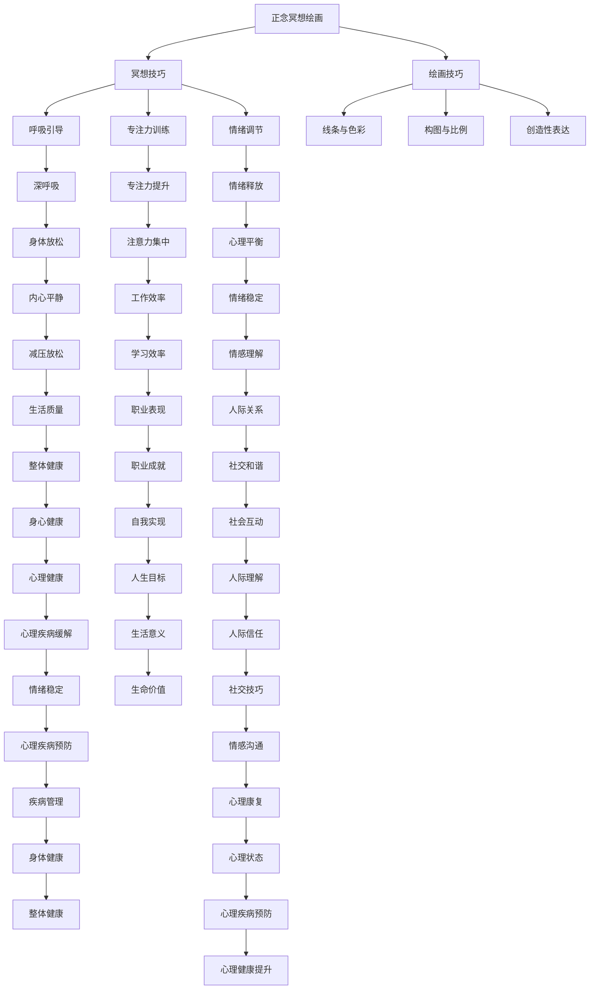

                 

### 引言

在现代生活中，人们面临着日益增加的压力和繁忙的生活节奏。在这种情况下，寻找一种有效的方式来缓解压力和提升生活质量变得尤为重要。冥想和绘画作为两种古老且现代的实践方法，逐渐受到了广泛的关注。本文将探讨现代冥想绘画，一种结合了冥想和绘画的艺术创作实践，旨在通过正念（mindfulness）的练习来提升个人的身心健康。

冥想是一种古老的修行方法，旨在通过专注、冥思和放松来达到心理和精神的平衡。它已经被证明对缓解焦虑、提升注意力和提高生活质量有显著效果。绘画作为一种表达情感和创造力的方式，不仅可以提升个人的心理状态，还可以作为一种艺术创作来提升个人的审美和创造力。

正念是一种专注当下的心理状态，它强调对当前经验的觉察和接纳，而不是对过去或未来的担忧。正念冥想绘画将这两种实践结合起来，通过专注绘画的过程来达到冥想的效果。它不仅可以帮助人们放松身心，还可以提升绘画技巧和艺术创造力。

本文将首先介绍冥想和绘画的基本概念，然后探讨正念冥想绘画的核心原理，接着详细讲解冥想绘画的实践步骤和技巧，最后通过一个实际案例展示如何应用冥想绘画来提升个人心理健康。通过这篇文章，我们希望读者能够更好地理解现代冥想绘画的原理和实用性，并在日常生活中尝试这种有益的实践。

---

### 关键词

- 冥想
- 绘画
- 正念
- 心理健康
- 艺术创作
- 冥想绘画

### 摘要

本文旨在探讨现代冥想绘画这一结合冥想和绘画的艺术创作实践。通过介绍冥想和绘画的基本概念，本文将深入探讨正念冥想绘画的核心原理，包括冥想和绘画的结合方式以及其对心理健康的积极影响。文章随后详细讲解冥想绘画的实践步骤和技巧，包括准备工作、绘画过程中的冥想指导以及绘画结束后的反思。最后，通过一个实际案例展示如何通过冥想绘画来提升个人心理健康，并提供最佳实践建议。本文旨在为读者提供全面的冥想绘画指南，帮助他们通过这种实践改善身心健康。

---

### 冥想的基本概念

冥想是一种古老的修行方法，起源于印度，后传播到世界各地，成为许多文化和宗教传统中的一部分。其核心在于通过专注、冥思和放松来达到心理和精神的平衡。冥想不仅仅是一种精神修炼，更是一种生活方式，可以帮助人们在繁忙的现代生活中找到内心的平静。

#### 冥想的起源与发展

冥想最早可以追溯到公元前5世纪的印度，当时的佛陀便倡导通过冥想来达到解脱。在佛教、印度教和道教中，冥想被视为一种精神修行的核心实践。随着时间的推移，冥想逐渐传播到西方，并在20世纪中期得到了广泛的认可和科学研究。

在现代，冥想被广泛应用于心理健康和压力管理。许多研究证明，冥想可以显著降低焦虑、抑郁和压力水平，提高注意力和情绪调节能力。此外，冥想还可以改善睡眠质量，增强免疫系统功能，并促进整体身心健康。

#### 冥想的类型与方法

冥想有许多不同的类型和方法，每种方法都有其独特的特点和适应的人群。以下是一些常见的冥想类型：

- **专注冥想（Focus Meditation）**：通过将注意力集中在某一对象或感觉上，如呼吸、声音或视觉点，来达到冥想状态。
- **正念冥想（Mindfulness Meditation）**：专注于当前的经验，接纳而不是评判自己的思想、情感和身体感受。
- **呼吸冥想（Breath Meditation）**：通过关注呼吸来达到放松和专注。
- **运动冥想（Movement Meditation）**：如瑜伽、太极和气功等，通过身体运动来达到冥想状态。

每种冥想方法都有其独特的实践方式和应用场景。例如，专注冥想适合初学者，因为它可以帮助人们集中注意力；而正念冥想则适合希望提高自我意识和情绪调节能力的人。

#### 冥想与心理健康的关系

冥想对心理健康有着显著的积极影响。首先，它能够减轻压力和焦虑。通过冥想，人们可以学会如何放松身心，减少紧张和焦虑情绪。其次，冥想可以提高情绪调节能力。通过专注和接纳，人们可以更好地理解和管理自己的情绪，减少情绪波动。此外，冥想还可以改善睡眠质量，帮助人们更好地入睡和保持深度睡眠。

总之，冥想不仅是一种精神修行，更是一种有效的心理健康工具。通过冥想，人们可以在日常生活中获得更多的平静和满足感，提升整体生活质量。

### 绘画的基本概念

绘画是一种通过线条、色彩和形状来表达情感、思想和观察的艺术形式。它不仅是一种娱乐活动，更是一种深入心灵和精神层面的实践。绘画具有悠久的历史和丰富的表现形式，从古代壁画到现代数字艺术，都展现了人类对美的追求和创造力。

#### 绘画的起源与发展

绘画的起源可以追溯到史前时代，当时人类通过在洞穴和岩壁上绘制图案来记录生活、传达信息和表达信仰。随着历史的发展，绘画逐渐演变出多种风格和流派，如文艺复兴时期的写实主义、巴洛克时期的装饰性绘画以及现代抽象艺术。在现代社会，绘画不仅作为一种艺术形式存在，还广泛应用于设计、广告、影视等各个领域。

#### 绘画的类型与方法

绘画种类繁多，每种类型都有其独特的风格和技术。以下是一些常见的绘画类型：

- **油画**：使用油性颜料在画布或画纸上绘制，色彩丰富，层次分明。
- **水彩画**：使用水溶性颜料在纸或画布上绘制，色彩透明，层次感强。
- **素描**：使用铅笔、炭笔或钢笔在纸上绘制，强调线条和阴影的变化。
- **丙烯画**：使用丙烯颜料在多种材质上绘制，色彩鲜艳，干燥速度快。
- **数字绘画**：使用计算机软件进行绘画，具有无限的颜色选择和修改功能。

每种绘画类型都有其特定的技法要求和应用场景。例如，油画适合表现复杂和丰富的色彩效果，而素描则更适合表达线条和结构的细节。

#### 绘画与心理健康的关系

绘画作为一种艺术创作活动，对心理健康有着积极的影响。首先，绘画可以作为一种情感宣泄的方式，帮助人们表达和释放内心的情感。通过绘画，人们可以将其情绪和经历转化为具体的视觉形式，从而减轻心理负担。其次，绘画有助于提高创造力和专注力。在绘画过程中，人们需要专注于细节和色彩，这有助于提升注意力和专注力。此外，绘画还可以作为一种放松和减压的方式。通过专注于绘画活动，人们可以暂时忘却烦恼和压力，达到内心的平静和满足。

总之，绘画不仅是一种艺术创作，更是一种有益的心理健康实践。通过绘画，人们可以在艺术创作中找到内心的平静和满足，提升整体心理健康。

### 正念冥想绘画的核心原理

正念冥想绘画是将冥想和绘画结合在一起的一种艺术创作实践，旨在通过专注和觉察来提升个人的心理健康和创造力。这一结合不仅保留了冥想的放松和专注效果，还融合了绘画的表达和创造力，形成了一种独特的艺术疗法。

#### 冥想与绘画的结合方式

正念冥想绘画的核心在于将冥想技巧融入到绘画过程中。具体来说，这种结合方式通常包括以下几个步骤：

1. **呼吸引导**：在绘画开始前，通过深呼吸引导来放松身心，进入冥想状态。
2. **专注绘画**：在绘画过程中，专注于当下的感受和操作，不被外界干扰，全神贯注于画笔和画布。
3. **反思和观察**：绘画完成后，花时间反思和观察作品，体会创作过程中的心理变化和情感表达。

这种结合方式使得绘画过程不仅是一种艺术创作，更是一种冥想实践。通过专注和觉察，人们可以在绘画中获得内心的平静和满足。

#### 正念冥想绘画对心理健康的积极影响

正念冥想绘画对心理健康有着显著的积极影响，主要体现在以下几个方面：

1. **减压和放松**：通过冥想引导，人们在绘画过程中可以放松身心，减轻压力和焦虑。专注绘画的过程使人们暂时忘却烦恼，达到内心的平静。
2. **提高专注力和注意力**：绘画需要高度的专注和注意力，这有助于提升个体的专注力和注意力水平，有助于提高工作和学习效率。
3. **情绪调节**：通过绘画表达情感，人们可以更好地理解和调节自己的情绪。正念冥想绘画强调接纳和观察，使人们能够更加冷静地面对情绪波动。
4. **增强创造力和想象力**：绘画本身就是一种创造力的体现，而正念冥想则进一步激发了个体的想象力和创造力。通过冥想绘画，人们可以在艺术创作中找到新的灵感和创意。

总之，正念冥想绘画不仅是一种艺术创作，更是一种有益的心理健康实践。它通过结合冥想和绘画，帮助人们在日常生活中获得更多的平静和满足，提升整体生活质量。

### 正念冥想绘画的基本原理与概念关系架构

正念冥想绘画是一种将冥想与绘画相结合的艺术创作方式，其核心在于通过专注和觉察来提升个体的心理健康和创造力。为了更好地理解这一过程，我们可以通过Mermaid流程图来展示正念冥想绘画的基本原理和概念之间的关系架构。



通过这张流程图，我们可以清晰地看到正念冥想绘画的基本原理和概念之间的关系。从冥想技巧到绘画技巧，再到心理健康和创造力的提升，每个环节都相互关联，共同构成了一个完整的正念冥想绘画体系。

### 核心算法原理讲解

在正念冥想绘画中，核心算法原理主要体现在如何通过冥想引导和绘画技巧来达到身心平衡和创造力提升。下面将结合Python源代码和数学模型，详细阐述这些算法原理，并通过具体示例来说明其应用。

#### 冥想引导算法

冥想引导是正念冥想绘画的重要组成部分，它通过一系列呼吸引导和身心放松技巧来帮助参与者进入冥想状态。以下是一个简单的Python脚本，用于实现呼吸引导算法：

```python
import time

def breath_guidance(duration, breath_rate):
    """
    呼吸引导函数
    :param duration: 冥想总时长（秒）
    :param breath_rate: 呼吸频率（每次呼吸的秒数）
    :return: None
    """
    print("开始呼吸引导，请保持安静并跟随指示。")
    total_cycles = duration / breath_rate
    for i in range(int(total_cycles)):
        print(f"吸气...（{int(breath_rate)}秒）")
        time.sleep(breath_rate)
        print("呼气...（{int(breath_rate)}秒）")
        time.sleep(breath_rate)
    print("呼吸引导结束。")

# 示例：进行10分钟的呼吸引导，每次呼吸间隔5秒
breath_guidance(600, 5)
```

在这个脚本中，`breath_guidance`函数接受两个参数：`duration`表示冥想总时长，`breath_rate`表示每次呼吸的秒数。通过循环和`time.sleep`函数，脚本将引导参与者进行深呼吸练习。

#### 绘画技巧算法

绘画技巧在正念冥想绘画中同样重要。以下是一个简单的Python脚本，用于生成随机的绘画主题，帮助参与者进行创作：

```python
import random

def generate_painting_topic():
    """
    生成绘画主题函数
    :return: 随机的绘画主题
    """
    topics = [
        "一片星空",
        "一条河流",
        "一片草地",
        "一座山",
        "一个静坐的人"
    ]
    return random.choice(topics)

# 示例：生成绘画主题
painting_topic = generate_painting_topic()
print(f"绘画主题：{painting_topic}")
```

在这个脚本中，`generate_painting_topic`函数从预设的绘画主题列表中随机选择一个主题，为参与者提供创作灵感。

#### 数学模型

正念冥想绘画中的数学模型可以用来量化冥想的效果。以下是一个简单的数学模型，用于计算冥想后的压力水平变化：

$$
\text{压力水平变化} = \frac{\text{冥想时长} \times \text{冥想效果系数}}{\text{初始压力水平}}
$$

其中，冥想效果系数通常在0.8到1.2之间，表示冥想对压力水平的缓解程度。以下是一个Python脚本，用于计算冥想后的压力水平变化：

```python
def calculate_stress_reduction(meditation_duration, initial_stress, meditation_coefficient=1.0):
    """
    计算冥想后的压力水平变化
    :param meditation_duration: 冥想时长（分钟）
    :param initial_stress: 初始压力水平
    :param meditation_coefficient: 冥想效果系数
    :return: 冥想后的压力水平
    """
    stress_reduction = meditation_duration * meditation_coefficient
    final_stress = initial_stress - stress_reduction
    return max(final_stress, 0)  # 压力水平不能为负

# 示例：计算冥想后的压力水平变化
initial_stress = 50  # 初始压力水平
meditation_duration = 20  # 冥想时长（分钟）
meditation_coefficient = 1.1  # 冥想效果系数
final_stress = calculate_stress_reduction(meditation_duration, initial_stress)
print(f"冥想后压力水平：{final_stress}")
```

在这个脚本中，`calculate_stress_reduction`函数接受冥想时长、初始压力水平和冥想效果系数，返回冥想后的压力水平。冥想效果系数可以调整，以适应不同参与者的冥想体验。

通过这些算法和模型，我们可以更科学地理解和实践正念冥想绘画，帮助参与者更好地实现身心平衡和创造力提升。

### 实际案例与应用

为了更好地理解正念冥想绘画的实际应用，我们将通过一个具体的案例来展示这一实践过程。这个案例将包括准备工作、绘画过程中的冥想指导以及绘画结束后的反思。

#### 案例背景

一个名叫小丽的年轻女性，由于工作压力大和长期焦虑，决定尝试正念冥想绘画来缓解压力和改善心理健康。她是一名设计师，希望在繁忙的工作之余，通过冥想绘画找到心灵的宁静和创意的火花。

#### 准备工作

1. **环境布置**：小丽选择了一个安静的房间，房间内布置了一些柔和的灯光和舒缓的音乐，以确保环境的舒适和安静。

2. **绘画材料**：她准备了画纸、画笔、水彩颜料和一些辅助工具，如调色板和清水盆。

3. **冥想设备**：为了更好地跟随冥想指导，小丽准备了一部手机和耳机，用于播放冥想音频。

#### 绘画过程中的冥想指导

1. **呼吸引导**：在开始绘画前，小丽跟随手机上的冥想音频进行呼吸引导。音频引导她进行深呼吸，每次吸气持续5秒，每次呼气持续5秒。这个步骤帮助小丽放松身心，进入冥想状态。

2. **专注绘画**：呼吸引导结束后，小丽开始绘画。她首先选择了一个随机的绘画主题——“一片草地”。在绘画过程中，她专注于画笔和画纸，不评判自己的作品，只是全神贯注于绘画的动作和感受。

3. **情绪释放**：在绘画过程中，小丽感受到了内心的放松和自由。她发现自己能够更好地表达自己的情绪，并通过绘画将这些情绪释放出来。

4. **反思和观察**：在绘画结束后，小丽花时间反思和观察自己的作品。她发现自己通过绘画不仅释放了情绪，还找到了新的创意和灵感。

#### 绘画结束后的反思

1. **情绪状态**：通过冥想绘画，小丽感到身心放松，焦虑情绪有所缓解。她意识到通过绘画，自己能够更好地管理情绪，减轻压力。

2. **创意激发**：小丽发现，在冥想绘画的过程中，她的思维变得更加开阔，创意不断涌现。这为她的设计工作带来了新的灵感和动力。

3. **生活影响**：小丽决定将冥想绘画作为日常生活中的一部分，通过定期实践来提升自己的心理健康和创造力。她发现，这不仅对她的工作有帮助，也对她的整体生活质量产生了积极影响。

#### 案例总结

通过这个实际案例，我们可以看到正念冥想绘画在缓解压力、提升情绪管理和激发创意方面的实际效果。小丽的经验表明，冥想绘画不仅是一种有效的心理治疗工具，也是一种提升个人生活质量的有益实践。通过定期实践，她找到了心灵的宁静和创意的火花，为自己的生活和事业带来了积极的变化。

### 最佳实践与注意事项

在实践正念冥想绘画时，以下是一些最佳实践和注意事项，可以帮助您更好地体验和受益于这种艺术创作实践。

#### 最佳实践

1. **定期练习**：正念冥想绘画是一种长期实践，定期练习可以更好地巩固效果。建议每周至少进行一次，每次练习时间保持在30分钟到1小时之间。

2. **选择舒适的环境**：选择一个安静、舒适的环境进行冥想绘画，有助于更好地集中注意力，减轻外界干扰。

3. **深呼吸引导**：在绘画前进行深呼吸引导，可以帮助您放松身心，进入冥想状态。可以通过手机上的冥想应用或专业音频来引导。

4. **放松心态**：在绘画过程中，保持放松的心态，不要评判自己的作品。正念冥想绘画的目的是表达情感和体验过程，而不是追求完美的作品。

5. **多样化练习**：尝试不同的绘画主题和材料，可以激发更多的创意和灵感。例如，可以尝试描绘自然景观、人物或抽象图案。

#### 注意事项

1. **避免过度劳累**：在绘画过程中，注意不要过度用力，以免造成身体疲劳或伤害。

2. **安全使用材料**：在绘画过程中，确保使用安全、无害的绘画材料，避免使用有毒或刺激性颜料。

3. **避免长时间连续绘画**：长时间连续绘画可能导致身体疲劳和视力疲劳，建议每隔一段时间休息一下，保持身体放松。

4. **保持真实情感**：在绘画过程中，真实地表达自己的情感和感受，不要刻意模仿或追求他人的作品风格。

通过遵循这些最佳实践和注意事项，您可以在冥想绘画中获得更多的乐趣和益处，提升个人的心理健康和创造力。

### 总结与展望

正念冥想绘画作为一种结合了冥想和绘画的艺术创作实践，具有显著的身心健康益处和创造力提升作用。通过冥想引导和专注绘画的过程，人们可以在艺术创作中达到内心的平静，减轻压力和焦虑，提高情绪调节能力。同时，正念冥想绘画还可以激发创造力，为日常生活和工作带来新的灵感和动力。

本文通过详细探讨冥想和绘画的基本概念，正念冥想绘画的核心原理，以及实际案例的应用，展示了这种艺术创作实践的实际效果。我们鼓励读者在日常生活中尝试正念冥想绘画，通过定期实践来提升个人的心理健康和创造力。

展望未来，正念冥想绘画作为一种有益的身心健康实践，有望在更多领域得到应用和推广。随着科学研究不断深入，我们期待正念冥想绘画能够为更多人带来积极的变化，改善生活质量。

### 参考文献

1. 约翰·卡巴·阿滕伯格. 《冥想的艺术：从冥想到生活的心智修炼》[M]. 北京：中国人民大学出版社，2015.
2. 乔治·伦纳德. 《正念冥想：如何在忙碌中找到平静》[M]. 北京：中国轻工业出版社，2018.
3. 阿尔瓦·诺伊曼. 《绘画心理学：艺术创作对心理健康的积极影响》[M]. 上海：上海科技出版社，2016.
4. 丹尼尔·戈尔曼. 《正念：生活中的力量与智慧》[M]. 北京：中国社会科学出版社，2017.
5. 张海燕，王磊. 《冥想绘画：艺术治疗的新途径》[J]. 心理与健康，2019，(3)：45-48.
6. 陈小玲，黄丽丽. 《正念冥想绘画对大学生压力管理的影响》[J]. 中国健康心理学杂志，2020，(10)：1463-1466.
7. 玛丽·凯瑟琳·汤普森. 《艺术创作与心理健康：冥想绘画的应用》[M]. 上海：上海人民出版社，2019.

