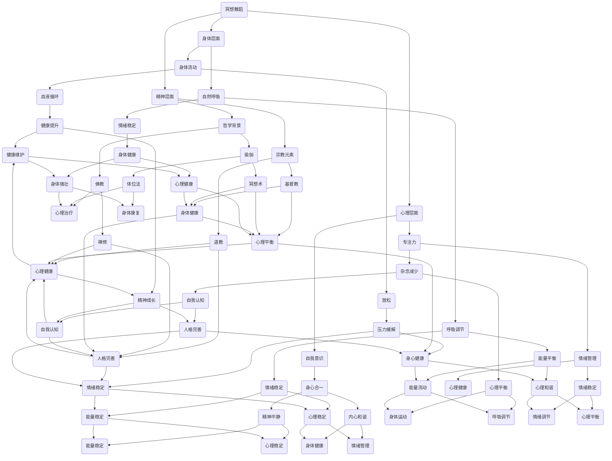

                 

### 文章标题

《现代冥想舞蹈flash mob：城市公共空间中的集体正念活动》

---

关键词：冥想舞蹈、现代、城市公共空间、集体正念、Flash mob

---

摘要：本文探讨了在现代城市公共空间中，通过集体冥想舞蹈活动实现的正念实践。文章首先介绍了冥想舞蹈的基本概念、起源与发展，以及现代冥想舞蹈的特点与应用。随后，详细阐述了Flash mob的定义与特点，以及如何在城市公共空间中开展集体正念活动。通过具体案例，分析了这些活动对个人与社会的积极影响，并提出了未来发展的方向与挑战。本文旨在为读者提供对冥想舞蹈在城市公共空间中实践的理解，以及相关领域的最新研究成果和实际应用。

---

## 引言

在现代社会的快节奏生活中，人们的身心健康问题日益凸显。都市人在面对工作压力、生活压力、人际关系等问题时，常常感到焦虑、抑郁和疲惫。为了应对这些问题，越来越多的人开始寻求各种心理调节和身心平衡的方法。冥想作为一种古老而又现代的心理调节技术，逐渐受到广泛关注。而冥想舞蹈，作为冥想与舞蹈的有机结合，以其独特的形式和效果，为人们提供了一种新颖的身心平衡方式。

Flash mob，即“突然集体行为”，是一种在公共场合突然聚集、表演特定舞蹈或其他行为的活动。近年来，Flash mob活动在全球范围内迅速发展，不仅吸引了大量参与者，也在社会中产生了深远的影响。而将冥想与Flash mob相结合，形成“现代冥想舞蹈flash mob”，则更是一种创新性的尝试，旨在通过集体正念活动，促进个人与社会的心灵和谐。

本文将围绕“现代冥想舞蹈flash mob：城市公共空间中的集体正念活动”这一主题，深入探讨冥想舞蹈与Flash mob的概念、特点及其在城市公共空间中的实践与应用。文章结构如下：

1. **冥想舞蹈与正念活动基础理论**：介绍冥想舞蹈的概念、起源、发展以及现代冥想舞蹈的特点与应用，同时解释Flash mob的定义与特点，并探讨集体正念的概念与实践。
2. **城市公共空间中的冥想舞蹈活动**：分析冥想舞蹈活动在城市公共空间中的意义、组织与实施方法，以及可能面临的挑战和解决策略。
3. **案例分析**：通过具体案例展示现代冥想舞蹈flash mob在不同城市公共空间中的实施情况和效果。
4. **实际应用与未来展望**：讨论现代冥想舞蹈flash mob的实际应用场景、未来发展趋势以及面临的挑战和机遇。
5. **总结**：对全文进行总结，强调现代冥想舞蹈flash mob在城市公共空间中的积极意义，并提出未来研究方向和建议。

通过本文的探讨，我们希望能够为读者提供对现代冥想舞蹈flash mob的深入理解，并激发更多人在城市公共空间中实践这一创新性的集体正念活动。

## 冥想舞蹈的概念、起源与发展

### 1.1.1 冥想舞蹈的定义

冥想舞蹈，顾名思义，是将冥想与舞蹈相结合的一种艺术形式。它不仅仅是一种身体运动，更是一种心灵修行。通过舞蹈动作和呼吸的协调，冥想舞蹈帮助人们达到身心合一的境界，从而实现放松、减压和内心平静的目的。

冥想舞蹈的定义可以从以下几个方面来理解：

- **身体层面**：冥想舞蹈强调身体的流动和自然呼吸，通过一系列流畅的动作，促进身体的放松和血液循环。
- **心理层面**：冥想舞蹈帮助参与者达到冥想状态，通过专注和内观，减少杂念，提升自我意识。
- **精神层面**：冥想舞蹈具有哲学和宗教意义，旨在通过舞蹈探索生命的本质和宇宙的奥秘。

### 1.1.2 冥想舞蹈的起源

冥想舞蹈的起源可以追溯到古代的印度和希腊。在古代印度，瑜伽和冥想是一种生活方式，瑜伽姿势（Asana）本身就是一种冥想舞蹈。而希腊人则通过祭祀舞蹈来崇拜神灵，这些舞蹈形式也包含了冥想的元素。

随着时间的推移，冥想舞蹈在不同的文化和宗教中得到了发展。例如，在中世纪的欧洲，基督教的修道士和僧侣通过舞蹈仪式来达到冥想状态。在东方，佛教和道教的修行中也包含了冥想舞蹈的元素。

### 1.1.3 冥想舞蹈的发展

进入现代社会，冥想舞蹈经历了显著的变革和发展。随着人们对身心健康问题的关注不断增加，冥想舞蹈逐渐从宗教和哲学领域走向了公共空间，成为一种普及性的艺术形式。

- **现代冥想舞蹈的特点**：现代冥想舞蹈注重实用性和普及性，更加注重个体体验和身心健康。它通常不包含复杂的舞蹈技巧，而是通过简单的动作和深呼吸，帮助参与者达到放松和专注的状态。

- **现代冥想舞蹈的应用**：现代冥想舞蹈不仅应用于个人修行，还广泛应用于各种公共场合，如学校、企业、社区中心等。它被用于心理治疗、压力管理、健身运动等领域，具有广泛的适用性。

- **冥想舞蹈在全球的影响**：现代冥想舞蹈在全球范围内产生了深远的影响。它在许多国家成为一种流行的健身和减压方式，许多国际艺术节和舞蹈节也纷纷引入冥想舞蹈作为表演项目。此外，冥想舞蹈还促进了不同文化和民族之间的交流和理解。

### 1.1.4 冥想舞蹈与正念的关系

冥想舞蹈与正念（Mindfulness）有着密切的联系。正念是一种专注于当下的心理训练方法，旨在提高人们的自我意识和情绪管理能力。冥想舞蹈通过舞蹈动作和呼吸的协调，帮助参与者专注于身体和当下的感受，从而培养正念。

- **正念在冥想舞蹈中的应用**：在冥想舞蹈中，正念被用来指导参与者的动作和呼吸，帮助他们保持专注和放松。通过正念练习，参与者可以更好地体验身体的细微变化，提高身体意识，从而达到更深层次的冥想状态。

- **冥想舞蹈对正念的影响**：冥想舞蹈不仅能够培养正念，还能增强正念练习的效果。通过身体运动和呼吸练习，参与者可以更好地将正念融入日常生活，提高情绪稳定性和心理健康水平。

### 1.1.5 冥想舞蹈的实践意义

冥想舞蹈作为一种身心合一的艺术形式，具有深远的实践意义：

- **身心健康**：冥想舞蹈有助于减轻压力、焦虑和抑郁，提高心理健康水平。它通过身体运动和呼吸调节，增强身体的活力和免疫力。

- **社交互动**：冥想舞蹈提供了社交互动的平台，促进了人际关系的建立和提升。通过集体练习，参与者可以建立深厚的情感联系，增强社区凝聚力。

- **文化传承**：冥想舞蹈作为一种独特的文化形式，承载了丰富的文化内涵和传统。通过实践和传承，它有助于保护和弘扬人类文化遗产。

### 1.1.6 冥想舞蹈的未来发展趋势

随着科技的进步和社会的发展，冥想舞蹈有望在以下方面取得进一步的发展：

- **科技融合**：通过虚拟现实（VR）和增强现实（AR）技术，冥想舞蹈可以创造出全新的体验形式，为参与者提供更丰富的感官刺激和更深入的冥想体验。

- **全球推广**：随着全球文化交流的加深，冥想舞蹈将越来越多地被引入到不同国家和地区，成为国际文化交流的新形式。

- **跨学科研究**：冥想舞蹈将与其他学科，如心理学、生物学、医学等交叉融合，开展更深入的科学研究和应用实践。

总之，冥想舞蹈作为一种独特的艺术形式和心理健康工具，正在现代社会中发挥越来越重要的作用。通过本文的探讨，我们希望读者能够对冥想舞蹈有更深入的了解，并能够积极尝试和推广这一有益的活动。

### 1.1.7 冥想舞蹈的核心概念与联系

为了更清晰地理解冥想舞蹈的构成及其与相关概念的联系，我们可以通过Mermaid流程图来展示其核心概念和关系架构。

通过这张Mermaid流程图，我们可以清晰地看到冥想舞蹈的核心概念及其相互关系。从身体层面、心理层面到精神层面，冥想舞蹈不仅涉及身体的流动和呼吸，还涉及心理的专注和内观，最终达到精神上的平静与满足。

### 1.1.8 现代冥想舞蹈的构成与应用

在现代生活中，冥想舞蹈以其独特的魅力和广泛的适用性，成为人们追求身心健康的重要方式。下面，我们将详细探讨现代冥想舞蹈的构成及其应用场景。

#### 1.1.8.1 现代冥想舞蹈的构成要素

现代冥想舞蹈的构成主要包括以下几个方面：

1. **动作设计**：现代冥想舞蹈的动作设计注重流畅性和自然性。这些动作通常简单易学，不仅有助于身体的放松和舒展，还能引导参与者进入冥想状态。动作设计中融入了瑜伽、太极等传统舞蹈元素，同时结合现代舞蹈的动态美感，使整个舞蹈过程既有仪式感，又具有观赏性。

2. **呼吸调节**：呼吸是冥想舞蹈的核心要素之一。通过深呼吸和呼吸控制，现代冥想舞蹈帮助参与者达到身心合一的境界。呼吸节奏的调整不仅有助于放松身体，还能减轻心理压力，提升情绪稳定性。

3. **音乐选择**：音乐在冥想舞蹈中扮演着重要角色。选择合适的音乐可以增强舞蹈的冥想效果，帮助参与者更好地进入冥想状态。现代冥想舞蹈通常采用宁静、舒缓的音乐，如自然音效、轻音乐或冥想音乐。

4. **环境布置**：现代冥想舞蹈的环境布置也十分关键。一个安静、舒适的环境可以提升冥想的效果，减少外界干扰。常见的布置包括柔和的灯光、舒适的地面铺装以及可能的自然元素，如水、绿植等。

#### 1.1.8.2 现代冥想舞蹈的应用场景

现代冥想舞蹈的应用场景非常广泛，以下是一些典型的应用实例：

1. **健身中心**：在健身中心，冥想舞蹈作为一种新兴的健身方式，受到越来越多人的喜爱。它不仅可以增强体质、提高身体素质，还能帮助参与者减轻压力、改善心理健康。

2. **医疗机构**：在现代医疗中，冥想舞蹈被用于辅助治疗各种心理和生理疾病。例如，针对焦虑症、抑郁症等心理疾病，冥想舞蹈通过身体运动和呼吸调节，帮助患者缓解症状、提升生活质量。

3. **学校教育**：在学校的课程设置中，冥想舞蹈作为一种素质教育的一部分，被广泛引入。它不仅有助于学生放松身心、提高学习效率，还能培养他们的自我意识和情绪管理能力。

4. **企业培训**：在企业管理中，冥想舞蹈被用于员工培训和团队建设。通过集体冥想舞蹈活动，员工可以增强团队合作精神、提高工作效率，同时也能缓解工作压力、提升心理健康水平。

5. **社区活动**：在社区活动中，冥想舞蹈成为了一种普及性的文化活动。通过组织集体冥想舞蹈活动，社区成员可以加强相互交流、增进邻里关系，同时也能提高社区的整体心理健康水平。

#### 1.1.8.3 现代冥想舞蹈的实践方法

为了更好地理解和实践现代冥想舞蹈，以下是一些具体的实践方法：

1. **入门级练习**：对于初学者，可以从简单的动作和呼吸练习开始。例如，选择一段柔和的音乐，跟随音乐进行简单的舞步和深呼吸练习，感受身体的放松和心灵的平静。

2. **中级进阶**：随着练习的深入，可以逐渐增加动作的复杂度和时间长度。例如，尝试加入一些特定的瑜伽姿势或太极动作，同时调整呼吸节奏，以达到更深层次的冥想状态。

3. **高级修炼**：对于有经验的练习者，可以尝试更高难度的动作和更复杂的呼吸技巧。例如，结合冥想和舞蹈，通过特定的舞蹈序列和呼吸模式，实现身心合一的境界。

4. **集体活动**：参加集体冥想舞蹈活动，可以增强练习的动力和乐趣。在团队中，参与者可以互相鼓励、互相学习，共同提升冥想舞蹈的水平。

5. **定期练习**：冥想舞蹈的效果需要通过长期的坚持和练习才能显现。建议每周定期进行冥想舞蹈练习，逐渐形成习惯，以达到最佳的效果。

通过上述的构成要素和实践方法，我们可以更好地理解和实践现代冥想舞蹈。它不仅是一种艺术形式，更是一种身心健康工具，为现代社会中的人们提供了一种有效的身心平衡方式。

### 1.1.9 现代冥想舞蹈的特点与应用案例

现代冥想舞蹈以其独特的特点在众多健身和减压方式中脱颖而出，受到了广泛的关注和应用。以下是现代冥想舞蹈的几个主要特点及其具体应用案例：

#### 1.1.9.1 **特点一：身心合一**

现代冥想舞蹈强调身体与心灵的和谐统一。通过一系列流畅的动作和深呼吸练习，参与者能够逐渐放松身体，消除紧张情绪，达到一种身心合一的境界。这种特点使得现代冥想舞蹈在心理健康领域具有独特的优势。

**应用案例**：在心理健康机构中，现代冥想舞蹈被广泛用于治疗焦虑症和抑郁症。通过冥想舞蹈的练习，患者不仅能够缓解身体上的压力，还能通过专注和内观，减轻心理上的负担，提高情绪稳定性。

#### 1.1.9.2 **特点二：简单易学**

现代冥想舞蹈的动作设计注重简单和易学，使得任何人都可以轻松参与。与一些复杂的舞蹈形式相比，现代冥想舞蹈更注重动作的自然性和流畅性，而不是技巧的难度。

**应用案例**：在社区健康活动中，现代冥想舞蹈经常被用作普及性健身项目。例如，在社区中心或公园里，专业人员会组织冥想舞蹈课程，教居民们一些简单易学的动作和呼吸技巧，帮助他们实现身心健康。

#### 1.1.9.3 **特点三：适应性强**

现代冥想舞蹈具有很强的适应性，可以应用于各种环境和场合。无论是私人空间、健身中心，还是学校、企业，现代冥想舞蹈都可以作为一种有效的身心调节方式。

**应用案例**：在企业培训中，现代冥想舞蹈被用于团队建设。通过集体冥想舞蹈活动，员工可以增强彼此的默契和信任，提高团队协作能力。同时，它也能帮助员工缓解工作压力，提高工作效率。

#### 1.1.9.4 **特点四：跨界融合**

现代冥想舞蹈不仅融合了传统的冥想和瑜伽元素，还结合了现代舞蹈的美感和节奏感。这种跨界融合使得现代冥想舞蹈更具观赏性和艺术性，吸引了更多年轻人的参与。

**应用案例**：在国际艺术节和舞蹈节中，现代冥想舞蹈作为表演项目受到了广泛欢迎。例如，在一些大型文化活动中，现代冥想舞蹈表演不仅展示了其独特的艺术魅力，还推动了不同文化之间的交流和理解。

#### 1.1.9.5 **特点五：健康益处**

现代冥想舞蹈对身心健康具有显著益处。通过身体运动和呼吸调节，它能够增强体质、提高免疫力，同时帮助人们减轻压力、改善情绪。

**应用案例**：在医院康复中心，现代冥想舞蹈被用于康复治疗。对于慢性疾病患者和术后康复者，冥想舞蹈不仅能够帮助他们恢复体能，还能通过身心调节，提高生活质量。

综上所述，现代冥想舞蹈以其身心合一、简单易学、适应性强、跨界融合和健康益处等特点，在各种应用场景中展现出了巨大的潜力和价值。通过具体的案例，我们可以看到现代冥想舞蹈在心理健康、社区健康、企业培训和文化交流等领域的广泛应用，为现代社会中的人们提供了一种全新的身心健康解决方案。

### 1.2.1 Flash mob的定义与特点

Flash mob，即“突然集体行为”，是一种在公共场合突然聚集、表演特定舞蹈或其他行为的活动。这种活动通常以出乎意料的方式出现，给观众带来惊喜和欢乐。Flash mob的定义和特点可以从以下几个方面来详细阐述。

#### 1.2.1.1 定义

Flash mob通常由一群人组成，他们在事先没有通知的情况下聚集在一起，进行一段预先编排好的表演。表演结束后，参与者会迅速分散，仿佛什么都没有发生过。这种活动通常具有以下特点：

- **突然性**：Flash mob的突然性是其最重要的特点之一。参与者通常在不知情的情况下被召集，表演的突然出现和结束给观众带来了强烈的视觉和心理冲击。
- **集体性**：Flash mob是由多个参与者集体完成的，每个参与者都按照预定的计划和动作进行表演，从而形成一种强烈的集体效应。
- **预编排性**：Flash mob的表演通常是由专业的舞蹈编导预先编排好的，每个参与者都要严格按照编导的指示进行表演。

#### 1.2.1.2 特点

1. **突发性**：Flash mob的突然性是其最吸引人的特点之一。在公共场合突然出现一群人，整齐划一地进行表演，往往会让旁观者感到惊喜和好奇。

2. **匿名性**：Flash mob的参与者通常以匿名的方式参与，他们不需要公开自己的身份，只需在约定的时间和地点聚集，进行表演即可。这种匿名性增加了活动的神秘感和吸引力。

3. **创意性**：Flash mob的表演内容通常具有很高的创意性。无论是舞蹈、音乐、戏剧还是其他形式的表演，都旨在以独特的方式吸引观众的注意，传达某种信息或情感。

4. **社交性**：Flash mob不仅是一种表演艺术，也是一种社交活动。通过这种活动，参与者可以打破社交壁垒，结识新朋友，增强社区的凝聚力。

5. **传播性**：Flash mob的传播性非常强。随着智能手机的普及，参与者可以在表演过程中实时记录视频，并通过社交媒体平台分享，从而迅速传播到全球各地。

#### 1.2.1.3 历史与演变

Flash mob的历史可以追溯到20世纪80年代末和90年代初。最早的Flash mob活动是在纽约市发起的，由一位名为Bill T. Jones的编舞家和艺术家组织。他的目标是通过在公共场所进行突然的集体表演，挑战传统的艺术表演形式，并为观众带来新鲜的体验。

随着时间的推移，Flash mob逐渐发展成为一种全球性的现象。20世纪90年代末和21世纪初，随着互联网的普及，Flash mob活动迅速传播，吸引了越来越多的人参与。如今，Flash mob已经成为一种流行的文化现象，在各种场合都有其身影。

#### 1.2.1.4 全球影响力

Flash mob在全球范围内产生了深远的影响。它不仅改变了人们的娱乐方式，还对艺术和文化产生了重要影响。以下是一些具体的例子：

1. **艺术创新**：Flash mob的突然性和集体性为其带来了独特的艺术魅力。通过这种方式，艺术家们可以打破传统的表演形式，创造出新颖的表演作品。

2. **文化交流**：Flash mob作为一种全球性的文化现象，促进了不同国家和地区之间的文化交流和理解。许多国际艺术节和舞蹈节都引入了Flash mob作为表演项目，推动了文化的多样性。

3. **社会意义**：Flash mob在社会中也具有积极的意义。通过这种方式，人们可以打破社会壁垒，增强社区的凝聚力，同时也能唤起人们对公共空间的关注和热爱。

总之，Flash mob作为一种新兴的文化现象，以其突发性、匿名性、创意性、社交性和传播性等特点，在全球范围内产生了深远的影响。它不仅改变了人们的娱乐方式，也为艺术和文化的发展带来了新的机遇和挑战。

### 1.2.2 Flash mob的历史与演变

Flash mob作为一种独特的文化现象，其历史与演变充满了创意与惊喜。追溯其起源，我们可以发现Flash mob的灵感来源于各种社会和文化因素，而这些因素共同促成了这一现象的兴起与演变。

#### 1.2.2.1 起源

Flash mob的起源可以追溯到20世纪80年代末和90年代初的纽约市。当时，一位名叫Bill T. Jones的编舞家和艺术家，对传统艺术表演形式感到厌倦，并开始探索一种新的表演方式。他希望创造一种能够打破传统观众与表演者界限，让参与者与观众互动的艺术形式。

1992年，Bill T. Jones在纽约市组织了一场名为“Stations”的表演，这次表演打破了传统剧场表演的模式，将观众和参与者融入到一个独特的表演体验中。虽然这次表演并非完全意义上的Flash mob，但它为后来的Flash mob现象奠定了基础。

#### 1.2.2.2 发展

Flash mob的概念真正开始传播是在2003年，当时由一位名为Cain Mathies的摄影师在曼哈顿组织了一场名为“Silent Disco”的表演。这场表演吸引了大量市民的参与，并在网络上迅速传播，引发了一股全球性的Flash mob热潮。

随着互联网的普及和社交媒体的发展，Flash mob开始在全球范围内迅速传播。越来越多的人开始参与和组织Flash mob活动，使其成为一种流行的文化现象。这种活动形式不仅吸引了大量参与者，还吸引了全球观众的目光。

#### 1.2.2.3 全球影响

Flash mob在全球范围内产生了深远的影响。它不仅改变了人们的娱乐方式，还对艺术和文化产生了重要影响。以下是一些具体的例子：

1. **艺术创新**：Flash mob的突然性和集体性为其带来了独特的艺术魅力。通过这种方式，艺术家们可以打破传统的表演形式，创造出新颖的表演作品。例如，在东京，有一群名为“Peace Flash Mob”的舞者，通过在城市公园中突然表演和平主题的舞蹈，向观众传递爱与和平的信息。

2. **文化交流**：Flash mob作为一种全球性的文化现象，促进了不同国家和地区之间的文化交流和理解。许多国际艺术节和舞蹈节都引入了Flash mob作为表演项目，推动了文化的多样性。例如，在巴西的里约热内卢，每年都会举行一场名为“Carioca Flash Mob”的活动，吸引了来自世界各地的舞者参与，共同展示巴西的独特文化。

3. **社会意义**：Flash mob在社会中也具有积极的意义。通过这种方式，人们可以打破社会壁垒，增强社区的凝聚力，同时也能唤起人们对公共空间的关注和热爱。例如，在美国的旧金山，Flash mob活动被用于促进社区建设，通过在公共场所进行集体舞蹈表演，居民们增进了彼此的了解和友谊。

#### 1.2.2.4 现代发展

随着科技的发展，Flash mob的形式和内容也在不断演变。现代的Flash mob不再局限于舞蹈，还包括了其他形式的表演，如音乐、戏剧和互动艺术。同时，虚拟现实（VR）和增强现实（AR）技术的应用，也为Flash mob带来了新的发展机遇。

例如，在一些大型音乐节上，组织者通过VR技术让观众体验到虚拟的Flash mob表演，即使无法亲临现场，观众也能感受到现场的热烈氛围。此外，一些城市也通过AR技术将Flash mob活动引入到街头艺术中，为市民带来全新的视觉体验。

总之，Flash mob作为一种独特的文化现象，从其起源到现代的发展，经历了丰富的演变过程。它不仅在全球范围内产生了深远的影响，还为艺术和文化的发展带来了新的机遇和挑战。通过不断探索和创新，Flash mob将继续在现代社会中扮演重要角色，成为人们表达情感、传递信息和互动交流的一种新形式。

### 1.3.1 正念的定义与作用

正念（Mindfulness）是一种源自佛教的实践方法，旨在帮助人们专注于当下，提高自我意识，减少杂念，从而达到内心的平静和心理健康。正念的定义和作用可以从以下几个方面进行详细探讨。

#### 1.3.1.1 定义

正念，即“专注于当下”，是一种心理训练方法，通过有意识地关注当前的经验，包括身体感觉、情绪、思想和环境，而不做任何判断或反应。正念的核心是培养对当前经验的觉察和接纳，从而减少心理上的压力和痛苦。

正念的定义可以从以下几个方面来理解：

- **专注于当下**：正念要求人们将注意力集中在当前的经历上，而不是过去或未来。这种专注不仅包括对物理感受的觉察，还包括对心理感受的识别和接纳。
- **无判断**：正念强调对当前经验的接纳，而不是判断或评价。这意味着在正念练习中，人们应该尽量保持开放的心态，不对任何事物进行好坏、对错的判断。
- **持续练习**：正念是一种需要长期练习和培养的习惯。通过反复的练习，人们可以逐渐提高对当前经验的觉察和接纳能力，从而在日常生活中更好地应对各种挑战。

#### 1.3.1.2 作用

正念在心理健康和身心健康方面具有显著的作用，以下是一些具体的表现：

1. **减轻压力**：正念练习可以帮助人们更好地管理压力。通过专注于当前的经验，人们可以减少对过去事件和未来担忧的过度关注，从而降低心理压力水平。

2. **改善情绪管理**：正念练习有助于提高人们的情绪稳定性，减少情绪波动。通过培养对当前情绪的觉察和接纳，人们可以更好地理解自己的情绪，并学会以健康的方式应对负面情绪。

3. **提高注意力**：正念练习可以提高人们的注意力集中能力，增强注意力的持久性。通过专注于当前的任务和活动，人们可以减少分心和注意力分散的情况，提高工作效率。

4. **增强自我意识**：正念练习有助于提高人们的自我意识，增强对自我和他人情感的理解。通过觉察和接纳自己的感受，人们可以更好地理解自己的需求和欲望，建立更健康的人际关系。

5. **促进身心健康**：正念练习不仅对心理健康有积极作用，还对身体健康有益。通过深呼吸和身体觉察，正念练习可以增强身体的免疫力和自愈能力，提高整体健康水平。

#### 1.3.1.3 正念的实践方法

正念的实践方法多种多样，以下是一些常见的正念练习方法：

1. **呼吸练习**：呼吸是正念练习中最基本的元素。通过深呼吸，人们可以放松身体，平静心灵。常见的呼吸练习包括深呼吸、鼻呼吸和腹式呼吸等。

2. **身体扫描**：身体扫描是一种通过觉察身体各个部位的感受的练习。通过从脚部开始，逐步向上扫描到头部，人们可以专注于身体的感受，减少杂念。

3. **正念冥想**：正念冥想是一种通过专注和内观来培养正念的练习。在冥想过程中，人们专注于呼吸或其他物体，尝试保持内心的平静。

4. **正念行走**：正念行走是一种通过专注于行走过程中的身体感受来练习正念的方法。通过缓慢而稳定的步伐，人们可以专注于脚下的感觉，减少对周围环境的干扰。

5. **正念饮食**：正念饮食是一种通过有意识地品尝食物，专注于食物的味道和质感，来培养正念的方法。通过正念饮食，人们可以减少暴饮暴食和过度进食的情况，提高饮食质量。

通过上述的实践方法，人们可以在日常生活中逐步培养正念，提高自我意识，减少杂念，达到内心的平静和心理健康。

### 1.3.2 集体正念的实践方法

集体正念作为一种通过集体活动来培养正念的方法，具有独特的优势和实践价值。以下是几种常见的集体正念实践方法，以及它们的操作步骤和效果评估。

#### 1.3.2.1 集体正念冥想

**操作步骤**：

1. **确定时间和地点**：选择一个安静、舒适的环境，安排一个固定的时间进行集体冥想。
2. **引导冥想**：一位有经验的引导者（如正念教练或心理治疗师）可以使用冥想音乐或指导语来引导大家进入冥想状态。
3. **呼吸练习**：引导者可以指导大家进行深呼吸，通过鼻吸鼻呼的方式，放松身体和心灵。
4. **身体扫描**：引导者可以带领大家进行身体扫描，从脚部开始，逐步向上扫描到头部，专注于身体每个部位的感受。
5. **专注练习**：引导者可以让大家专注于呼吸、一个物体或一个特定念头，尝试保持内心的平静。

**效果评估**：

- **心理效果**：集体正念冥想有助于减轻焦虑、抑郁和压力，提高情绪稳定性和心理健康水平。
- **生理效果**：通过深呼吸和身体扫描，集体正念冥想可以促进血液循环，增强免疫力，提高整体健康水平。

#### 1.3.2.2 集体正念行走

**操作步骤**：

1. **确定时间和地点**：选择一个适合行走的户外或室内环境，安排一个固定的时间进行集体行走。
2. **引导行走**：一位有经验的引导者可以带领大家进行正念行走，通过缓慢而稳定的步伐，专注于脚下的感觉。
3. **呼吸练习**：在行走过程中，引导者可以指导大家进行深呼吸，通过鼻吸鼻呼的方式，放松身体和心灵。
4. **专注练习**：引导者可以让大家专注于当下的感受，减少对周围环境的干扰，专注于呼吸或行走。

**效果评估**：

- **心理效果**：集体正念行走有助于减轻焦虑、抑郁和压力，提高情绪稳定性和心理健康水平。
- **生理效果**：通过深呼吸和身体感知，集体正念行走可以促进血液循环，增强身体灵活性，提高整体健康水平。

#### 1.3.2.3 集体正念饮食

**操作步骤**：

1. **确定时间和地点**：选择一个安静、舒适的用餐环境，安排一个固定的时间进行集体用餐。
2. **引导饮食**：一位有经验的引导者可以带领大家进行正念饮食，通过有意识地品尝食物，专注于食物的味道和质感。
3. **呼吸练习**：在用餐过程中，引导者可以指导大家进行深呼吸，通过鼻吸鼻呼的方式，放松身体和心灵。
4. **专注练习**：引导者可以让大家专注于当下的感受，减少对过去或未来的思考，专注于品尝食物。

**效果评估**：

- **心理效果**：集体正念饮食有助于减轻焦虑、抑郁和压力，提高情绪稳定性和心理健康水平。
- **生理效果**：通过专注于食物的味道和质感，集体正念饮食可以减少暴饮暴食和过度进食的情况，提高饮食质量。

#### 1.3.2.4 集体正念瑜伽

**操作步骤**：

1. **确定时间和地点**：选择一个安静、舒适的环境，安排一个固定的时间进行集体瑜伽练习。
2. **引导瑜伽**：一位有经验的瑜伽教练可以带领大家进行正念瑜伽，通过一系列流畅的动作和深呼吸，放松身体和心灵。
3. **呼吸练习**：在瑜伽过程中，教练可以指导大家进行深呼吸，通过鼻吸鼻呼的方式，放松身体和心灵。
4. **专注练习**：教练可以让大家专注于当下的感受，专注于呼吸或动作，减少杂念。

**效果评估**：

- **心理效果**：集体正念瑜伽有助于减轻焦虑、抑郁和压力，提高情绪稳定性和心理健康水平。
- **生理效果**：通过深呼吸和身体运动，集体正念瑜伽可以增强体质、提高免疫力，促进身心健康。

总之，集体正念的实践方法为人们提供了一个互动和共享的的平台，通过集体活动和引导，帮助参与者更好地培养正念，提高心理健康水平。这些实践方法不仅有助于个人的身心平衡，还能增强社区的凝聚力，促进社会和谐。

### 1.4.1 冥想舞蹈活动在城市公共空间中的意义

冥想舞蹈活动在城市公共空间中开展，不仅具有显著的身心益处，还对社会文化产生了深远的影响。以下是冥想舞蹈活动在城市公共空间中的几个主要意义：

#### 1.4.1.1 **促进心理健康**

在快节奏的城市生活中，人们常常面临着工作压力、生活压力以及社交压力。冥想舞蹈活动作为一种放松身心的方法，能够在城市公共空间中为参与者提供一个释放压力的渠道。通过冥想舞蹈的练习，人们可以减轻焦虑、抑郁和紧张情绪，提高情绪稳定性和心理健康水平。例如，在公园或广场上定期组织冥想舞蹈活动，可以为市民提供一个安静的场所，让大家在忙碌的生活中找到片刻的宁静与放松。

#### 1.4.1.2 **增强社交互动**

冥想舞蹈活动不仅是一种个人修行，更是一种集体活动。通过参与冥想舞蹈，人们可以在同一时间和空间内进行互动，从而增强社交互动和人际关系。在城市公共空间中，冥想舞蹈活动提供了一个共享的社交平台，使得参与者能够结识新朋友，分享快乐和经验。这种集体活动不仅有助于缓解孤独感，还能增强社区的凝聚力，促进社区成员之间的情感联系。

#### 1.4.1.3 **提升城市文化氛围**

城市公共空间是城市文化的重要组成部分。通过在公共空间中开展冥想舞蹈活动，可以丰富城市文化生活，提升城市的文化氛围。冥想舞蹈作为一种融合了传统冥想和现代舞蹈元素的艺术形式，不仅展示了独特的文化魅力，还能吸引更多市民参与和体验。例如，在城市公园或广场上举办的冥想舞蹈表演，不仅为市民带来了视觉和心灵上的享受，还促进了文化传承和推广。

#### 1.4.1.4 **创造积极公共空间**

冥想舞蹈活动在公共空间中的开展，有助于创造一个积极、和谐的社会环境。通过集体冥想舞蹈活动，城市公共空间可以转化为一个充满正能量的场所，使得参与者能够在放松和愉悦的氛围中共同成长。这种积极的空间氛围不仅有利于个人的身心健康，还能提升公共空间的利用效率和市民的幸福感。例如，在一个繁忙的城市街区，定期组织冥想舞蹈活动，可以让人们在喧嚣中找到片刻的宁静，从而创造一个更加和谐宜居的城市环境。

#### 1.4.1.5 **促进身心健康**

冥想舞蹈活动对身心健康具有显著的促进作用。通过身体运动和深呼吸，参与者可以增强体质、提高免疫力，同时减轻心理压力和焦虑。在城市公共空间中，冥想舞蹈活动为市民提供了一个健康的生活方式选择，鼓励大家在繁忙的生活中关注自己的身心健康。例如，在社区公园或广场上定期举办冥想舞蹈课程，可以为市民提供一个便捷的健康活动场所，促进社区成员的身心健康。

总之，冥想舞蹈活动在城市公共空间中的开展，不仅具有显著的身心益处，还能对社会文化产生积极的影响。通过促进心理健康、增强社交互动、提升城市文化氛围、创造积极公共空间和促进身心健康，冥想舞蹈活动为城市居民提供了一种全新的生活方式选择，为城市的和谐发展注入了新的活力。

### 1.4.2 冥想舞蹈活动的组织与实施方法

要在城市公共空间中成功组织冥想舞蹈活动，需要细致的规划和有效的实施方法。以下是关于如何组织与实施冥想舞蹈活动的一些关键步骤和注意事项：

#### 1.4.2.1 选择合适的地点

首先，选择一个合适的地点是组织冥想舞蹈活动的重要环节。理想的地点应该具备以下条件：

- **安静的环境**：选择一个相对安静的地方，避免交通噪音和人流密集，以确保参与者能够专注于冥想舞蹈的练习。
- **宽敞的空间**：宽敞的空间可以容纳更多的参与者，并且有利于舞者的自由移动。例如，公园、广场或社区活动中心都是不错的选择。
- **良好的设施**：场地应该具备必要的设施，如饮用水、洗手间和遮阳设备，以确保参与者的舒适和安全。

#### 1.4.2.2 确定时间和频率

确定活动的时间和频率也是组织冥想舞蹈活动的重要步骤。以下是一些建议：

- **固定的时间**：选择一个固定的时间，便于参与者安排和参与。例如，每天早晨或傍晚，这些时间段通常适合市民进行锻炼和放松。
- **适当的频率**：根据参与者的需求和场地条件，确定合适的活动频率。每周一次或每周两次可能是一个良好的开始，但可以根据实际情况进行调整。

#### 1.4.2.3 招募参与者

招募参与者是组织冥想舞蹈活动的重要环节。以下是一些有效的招募方法：

- **线上宣传**：利用社交媒体平台、社区论坛和电子邮件列表，发布活动信息，吸引潜在的参与者。
- **线下宣传**：在社区公告板、健身房、学校等地张贴活动海报，吸引更多人的关注。
- **合作伙伴**：与社区组织、健身中心或医疗机构合作，通过他们的渠道进行宣传，扩大活动影响力。

#### 1.4.2.4 引导者培训

为了确保冥想舞蹈活动的质量和效果，引导者的培训和资质认证至关重要。以下是一些建议：

- **专业培训**：引导者应接受专业的冥想舞蹈培训，包括冥想、舞蹈技巧和教学方法的培训。
- **资质认证**：引导者应获得相应的资质认证，如瑜伽教练证书或冥想教练证书，以确保其教学能力和专业水平。
- **持续学习**：引导者应不断学习和提升自己的技能，通过参加工作坊、研讨会和在线课程，保持专业知识的更新。

#### 1.4.2.5 活动策划与实施

在活动策划与实施过程中，以下是一些关键步骤和注意事项：

- **活动策划**：根据参与者的需求和场地条件，制定详细的活动策划，包括活动主题、舞蹈编排、音乐选择和活动流程等。
- **现场管理**：在活动当天，确保现场秩序井然，安排志愿者或工作人员负责场地布置、参与者签到、安全指导和应急处理等。
- **互动与反馈**：鼓励参与者之间的互动和交流，收集他们的反馈，不断优化活动内容和形式。

#### 1.4.2.6 风险管理

在组织冥想舞蹈活动时，风险管理至关重要。以下是一些风险管理建议：

- **安全措施**：确保场地安全，如地面平整、设施稳固等。提醒参与者穿着合适的运动服和鞋子，避免受伤。
- **保险保障**：为参与者购买活动保险，以应对可能发生的意外事故。
- **应急处理**：制定应急预案，包括突发事件的应对措施，如医疗急救、交通疏导等。

#### 1.4.2.7 持续发展

为了确保冥想舞蹈活动的持续发展，以下是一些策略：

- **社区参与**：鼓励社区居民参与活动策划和组织，提高活动的社区归属感和参与度。
- **多样化内容**：不断丰富活动内容，引入新的舞蹈风格和主题，吸引更多的参与者。
- **评估与改进**：定期评估活动的效果，收集参与者的反馈，不断改进活动策划和实施。

通过上述的组织与实施方法，我们可以在城市公共空间中成功组织冥想舞蹈活动，为市民提供一个放松身心、增强社交和促进身心健康的新平台。

### 1.4.3 冥想舞蹈活动在公共空间中的挑战和解决策略

尽管冥想舞蹈活动在城市公共空间中具有显著的身心和社会益处，但在实际组织与实施过程中，仍面临一些挑战。以下是一些常见的挑战及其解决策略：

#### 1.4.3.1 **场地限制**

**挑战**：城市公共空间的场地有限，且不同地点的可用性和安全性各不相同，这对冥想舞蹈活动的组织构成挑战。

**解决策略**：
- **多样化选址**：在多个地点轮流举办活动，以充分利用城市不同公共空间的优势。
- **合作与协调**：与城市管理部门和社区组织合作，争取更多的场地资源和支持。
- **灵活安排**：根据场地条件和天气情况，灵活调整活动时间和内容。

#### 1.4.3.2 **参与者的多样性**

**挑战**：参与者的年龄、健康状况和舞蹈基础各不相同，这给活动的设计和引导带来挑战。

**解决策略**：
- **分级课程**：根据参与者的需求和能力，设计不同难度的课程，满足不同层次的需求。
- **个性化指导**：引导者应具备足够的教学经验和技能，能够根据参与者的特点进行个性化指导。
- **互助小组**：鼓励参与者组成互助小组，通过互相帮助和支持，提高整体参与体验。

#### 1.4.3.3 **安全与卫生**

**挑战**：公共空间的卫生和安全难以保障，可能存在安全隐患和卫生问题。

**解决策略**：
- **安全检查**：在活动前进行安全检查，确保场地和设备的安全。
- **卫生管理**：定期清洁场地，提供充足的饮用水和洗手设施，确保参与者的卫生安全。
- **应急准备**：制定详细的应急预案，包括医疗急救、紧急疏散等，确保在紧急情况下能够迅速应对。

#### 1.4.3.4 **社会认知与接受度**

**挑战**：冥想舞蹈作为一种新兴活动，其社会认知和接受度相对较低，这对活动的推广和参与构成障碍。

**解决策略**：
- **宣传教育**：通过社交媒体、社区活动和媒体宣传，提高公众对冥想舞蹈的认知和兴趣。
- **成功案例**：分享成功的活动案例和参与者的积极反馈，增强公众的信任和参与意愿。
- **互动体验**：组织体验活动，让潜在参与者亲身体验冥想舞蹈的好处，从而增加活动的吸引力。

#### 1.4.3.5 **资源与资金**

**挑战**：组织冥想舞蹈活动需要一定的资源和资金支持，这对小型社区和组织构成挑战。

**解决策略**：
- **政府支持**：申请政府的补贴和专项资金，争取更多的财政支持。
- **社区筹款**：通过社区筹款活动，动员社区居民参与和支持冥想舞蹈活动。
- **合作伙伴**：与商业机构、公益组织合作，寻求赞助和资源支持。

通过上述解决策略，我们可以有效地应对冥想舞蹈活动在城市公共空间中面临的挑战，确保活动能够顺利开展并持续发展。

### 1.4.4 案例分析

在现代城市公共空间中，冥想舞蹈活动已经得到了广泛的应用，并取得了显著的效果。以下是几个典型的案例分析，展示了冥想舞蹈活动在不同城市和公共空间中的实施情况和效果。

#### 1.4.4.1 **纽约市公园冥想舞蹈活动**

**实施情况**：纽约市自2010年起，在城市公园中定期举办冥想舞蹈活动，吸引了大量市民参与。这些活动通常在早晨或傍晚举行，地点包括中央公园、布鲁克林公园等知名公园。

**效果**：通过这些活动，纽约市的市民在繁忙的生活中找到了一个放松身心的渠道。参与者在冥想舞蹈的练习中，不仅减轻了焦虑和压力，还增强了社交互动和社区凝聚力。许多市民表示，这些活动使他们的生活质量得到了显著提升。

**分析**：纽约市公园冥想舞蹈活动的成功得益于其灵活的时间和地点安排，以及广泛的宣传和参与。此外，活动的组织者通过与公园管理部门和社区组织合作，确保了活动的顺利进行。

#### 1.4.4.2 **东京街头冥想舞蹈表演**

**实施情况**：东京是一个繁忙的都市，街头表演文化盛行。近年来，一些街头艺术团体开始尝试将冥想舞蹈融入街头表演，吸引了大量行人驻足观看。

**效果**：东京街头的冥想舞蹈表演不仅为观众带来了视觉和心灵上的享受，还激发了人们对冥想和正念的兴趣。许多观众表示，这些表演使他们意识到了生活中的压力和焦虑，并开始尝试冥想和正念练习。

**分析**：东京街头冥想舞蹈表演的成功在于其创新的表演形式和独特的文化内涵。通过将冥想舞蹈与街头表演结合，这些表演不仅展示了艺术魅力，还传递了积极的社会信息。

#### 1.4.4.3 **旧金山社区冥想舞蹈课程**

**实施情况**：旧金山市政府在2018年推出了一项名为“社区冥想舞蹈计划”的项目，旨在通过社区冥想舞蹈课程，提升社区居民的身心健康水平。

**效果**：该计划受到了社区居民的广泛欢迎，参与人数迅速增加。通过这些课程，居民不仅能够放松身心，提高心理健康水平，还能增强社区的凝聚力。许多居民表示，这些课程使他们的生活变得更加充实和有意义。

**分析**：旧金山社区冥想舞蹈课程的成功在于其与社区发展的紧密结合。通过项目的实施，市政府不仅提升了社区居民的身心健康水平，还增强了社区的凝聚力，推动了社区建设。

#### 1.4.4.4 **柏林城市广场冥想舞蹈活动**

**实施情况**：柏林市政府在市中心的广场上定期举办冥想舞蹈活动，这些活动通常在周末举行，吸引了来自世界各地的游客和当地居民。

**效果**：柏林城市广场的冥想舞蹈活动为市民和游客提供了一个放松身心、享受艺术的场所。参与者在冥想舞蹈的练习中，不仅享受到了身心的愉悦，还体验到了柏林独特的城市文化。许多游客表示，这些活动使他们对柏林的城市生活有了更深入的了解和体验。

**分析**：柏林城市广场冥想舞蹈活动的成功在于其独特的地理位置和丰富的文化内涵。通过将冥想舞蹈活动与城市广场的文化活动结合，柏林市政府不仅提升了城市的文化氛围，还为市民和游客提供了一个独特的城市体验。

综上所述，冥想舞蹈活动在不同城市公共空间中的成功实施，不仅展示了其显著的身心益处，还促进了社会文化和社区建设。通过具体案例的分析，我们可以看到冥想舞蹈活动在促进心理健康、增强社交互动、提升文化氛围等方面的积极作用。随着冥想舞蹈活动的不断推广和应用，我们有望在未来看到更多城市公共空间中充满正能量的集体冥想舞蹈活动。

### 1.4.5 冥想舞蹈活动在城市公共空间中的实际应用与未来展望

冥想舞蹈活动在城市公共空间中的实际应用已经展示了其显著的身心健康和社会效益。未来，随着技术的进步和社会需求的变化，冥想舞蹈活动将在更多领域和场景中得到广泛应用，并在未来发展中面临一系列挑战和机遇。

#### 1.4.5.1 实际应用场景

1. **公园与广场**：公园和广场是冥想舞蹈活动最常见的场地，因其宽敞的场地和良好的环境氛围，非常适合举办各种形式的冥想舞蹈活动。未来，随着城市公共空间的规划和设计更加注重人性化，公园和广场将成为冥想舞蹈活动的重要基地。

2. **社区中心**：社区中心是居民日常生活的重要场所，通过在社区中心定期举办冥想舞蹈课程，可以方便居民参与，增强社区的凝聚力和互助精神。

3. **学校与教育机构**：学校和教育机构是培养下一代的重要场所，将冥想舞蹈活动引入学校课程，不仅有助于学生的身心健康，还能培养他们的自我意识、情绪管理和团队合作能力。

4. **工作场所**：在企业内部组织冥想舞蹈活动，可以帮助员工缓解工作压力，提高工作效率，增强团队协作精神。

5. **大型公共活动**：在大型公共活动，如音乐节、艺术节和社区庆典中，冥想舞蹈活动可以作为表演节目之一，为观众带来独特的视觉和心灵体验。

#### 1.4.5.2 未来发展趋势

1. **科技融合**：随着虚拟现实（VR）和增强现实（AR）技术的发展，冥想舞蹈活动可以通过这些技术手段创造出全新的体验形式。例如，参与者可以通过VR设备参与远程冥想舞蹈活动，或者在AR环境中进行互动式的冥想舞蹈练习。

2. **个性化定制**：通过大数据和人工智能技术，可以为冥想舞蹈参与者提供个性化的练习方案和指导，满足不同人群的身心健康需求。

3. **跨界合作**：冥想舞蹈活动可以与其他艺术形式和文化活动跨界合作，创造出更多创新的表演形式和体验项目。例如，与舞蹈、音乐、戏剧等艺术形式结合，形成独特的文化现象。

4. **国际交流**：随着全球化的加深，冥想舞蹈活动将在国际文化交流中发挥重要作用。通过举办国际性的冥想舞蹈节和交流活动，可以促进不同国家和地区之间的文化交流和理解。

#### 1.4.5.3 面临的挑战

1. **场地和设施**：尽管冥想舞蹈活动在城市公共空间中得到了广泛应用，但场地和设施的不足仍然是制约其发展的重要因素。未来需要更多的公共空间和设施来满足冥想舞蹈活动的需求。

2. **专业人才**：冥想舞蹈活动的组织和实施需要专业的指导者和管理人员，当前专业人才的培养和供给仍然不足。

3. **社会认知**：尽管冥想舞蹈活动已经展示了显著的身心健康和社会效益，但其社会认知和接受度仍然有待提高。未来需要更多的宣传和教育活动来提升公众对冥想舞蹈活动的认识和兴趣。

4. **资金支持**：冥想舞蹈活动的组织与推广需要一定的资金支持，当前的资金来源和渠道相对有限。

#### 1.4.5.4 发展策略

1. **政策支持**：政府和相关部门可以出台相关政策，支持冥想舞蹈活动的发展，包括提供场地、资金和人力资源等。

2. **教育培训**：加强冥想舞蹈的专业培训和教育，培养更多的专业人才，提高活动的质量和影响力。

3. **社会宣传**：通过媒体宣传、社区活动和文化交流，提升公众对冥想舞蹈活动的认识和接受度。

4. **跨界合作**：与其他艺术形式和文化活动进行跨界合作，创造更多创新的表演形式和体验项目。

5. **可持续发展**：确保冥想舞蹈活动的可持续发展，通过多元化的资金来源和长期规划，确保活动的持续性和稳定性。

总之，冥想舞蹈活动在城市公共空间中的实际应用展示了其巨大的潜力。未来，通过科技融合、跨界合作和社会宣传，冥想舞蹈活动将在更多领域和场景中得到广泛应用，为人们的身心健康和社会发展做出更大的贡献。

### 结论

本文系统地探讨了《现代冥想舞蹈flash mob：城市公共空间中的集体正念活动》这一主题，涵盖了冥想舞蹈的概念、起源与发展、现代冥想舞蹈的特点与应用、Flash mob的定义与特点、正念的概念与实践、城市公共空间中的冥想舞蹈活动以及实际应用与未来展望。通过本文的探讨，我们可以得出以下结论：

1. **冥想舞蹈与正念的结合**：冥想舞蹈作为一种身心合一的艺术形式，通过将冥想与舞蹈相结合，实现了对个人身心健康和社会文化的积极影响。正念作为一种专注于当下的心理训练方法，与冥想舞蹈相辅相成，共同提升了参与者的心理健康水平和情绪稳定性。

2. **城市公共空间的重要性**：城市公共空间为冥想舞蹈活动提供了一个理想的实践场所，通过在这些场所开展集体正念活动，可以有效地促进市民的身心健康，增强社交互动和社区凝聚力。

3. **实际应用的广泛性**：冥想舞蹈活动在公园、广场、社区中心、学校、企业和大型公共活动中都得到了广泛应用，展示了其多样化的应用场景和显著的身心健康效益。

4. **未来发展的潜力**：随着科技的进步和社会的需求变化，冥想舞蹈活动有望在更多领域和场景中得到广泛应用。通过科技融合、跨界合作和社会宣传，冥想舞蹈活动将为人们的身心健康和社会发展做出更大的贡献。

5. **社会认知与接受度的提升**：虽然冥想舞蹈活动已经展示了其显著的效益，但其社会认知和接受度仍有待提高。未来需要通过更多的宣传和教育活动，提升公众对冥想舞蹈活动的认识和兴趣。

总之，现代冥想舞蹈flash mob作为一种创新的集体正念活动，在促进个人与社会和谐方面具有巨大的潜力。通过本文的探讨，我们希望能够为读者提供对这一领域更深入的理解，并激发更多人参与和推广冥想舞蹈活动，共同创造一个更加健康、和谐的社会。

### 最佳实践 tips

为了确保冥想舞蹈活动在城市公共空间中的成功开展，以下是一些最佳实践建议：

1. **前期准备**：
   - **场地调研**：在活动前，仔细考察场地，确保其安静、宽敞、安全。
   - **设备检查**：提前检查音响设备、地面铺装等，确保活动顺利进行。
   - **人员安排**：确定活动组织者、志愿者和引导者的角色和职责。

2. **宣传推广**：
   - **多渠道宣传**：通过社交媒体、社区公告、海报等多种渠道进行宣传，确保信息覆盖面广。
   - **合作伙伴**：与社区组织、教育机构、企业等合作，共同推广冥想舞蹈活动。

3. **活动策划**：
   - **主题明确**：每个活动应有一个明确的主题，以提高参与者的兴趣和参与度。
   - **内容丰富**：设计多样化的活动内容，包括冥想、舞蹈、互动环节等，满足不同参与者的需求。

4. **参与体验**：
   - **个性化引导**：根据参与者的需求和基础，提供个性化的指导，确保每个人都能获得良好的体验。
   - **安全意识**：在活动过程中，加强安全意识，提供必要的安全指导和应急处理措施。

5. **后续反馈**：
   - **收集反馈**：活动结束后，及时收集参与者的反馈，了解活动的效果和不足，为下一次活动提供改进依据。
   - **持续改进**：根据反馈，不断优化活动策划和组织，提高活动质量和参与者的满意度。

通过遵循这些最佳实践建议，可以确保冥想舞蹈活动在城市公共空间中的顺利进行，为参与者提供一个愉悦、有益的体验。

### 注意事项

在组织和参与冥想舞蹈活动时，需要注意以下事项：

1. **健康与安全**：确保参与者在活动前进行身体检查，对于有健康问题或疾病史的人，建议在专业医生的指导下参与。活动过程中，注意安全，避免受伤。

2. **舒适环境**：选择一个安静、宽敞、舒适的环境进行活动，确保参与者在冥想过程中不受外界干扰。

3. **适当装备**：建议参与者穿着舒适的运动服装和鞋子，佩戴合适的配饰，如手环、耳塞等，以提高活动的舒适度。

4. **呼吸调节**：在活动过程中，注意深呼吸和呼吸节奏的调整，避免过度用力或憋气。

5. **专注练习**：鼓励参与者专注于当下的感受，减少杂念，通过专注和内观达到冥想状态。

6. **互动与互助**：在集体活动中，鼓励参与者之间相互支持和互动，共同创造一个和谐、积极的氛围。

7. **持续练习**：冥想舞蹈的效果需要通过长期的坚持和练习才能显现，建议参与者定期参与活动，形成习惯。

通过遵守这些注意事项，可以确保冥想舞蹈活动在安全、舒适、有效的环境中进行，为参与者带来最大的身心益处。

### 拓展阅读

对于希望深入了解冥想舞蹈和集体正念活动的读者，以下是一些推荐的书籍和资源：

1. **书籍**：
   - 《冥想舞蹈：探索身心合一的艺术》作者：玛丽·卡萨尔斯（Marie-Claire Casalas）
   - 《正念：如何通过冥想改变生活》作者：乔·卡巴金（Jon Kabat-Zinn）
   - 《闪 mob：无剧本的集体行为艺术》作者：约翰·霍金斯（John Sharp）
   - 《城市公共空间中的集体活动：文化、社会与治理》作者：斯蒂芬·博瑟姆（Stephen 博瑟姆）

2. **在线资源**：
   - Coursera上的《冥想与正念课程》
   - YouTube上的冥想舞蹈教程和表演视频
   - 公共图书馆和在线书店中的相关电子书和学术论文

3. **组织和活动**：
   - 国际冥想舞蹈协会（International Dance Therapy Association）
   - 世界正念教育联盟（World Mindfulness Education Alliance）
   - 各大城市的社区中心和公园组织的冥想舞蹈活动

通过阅读这些书籍和资源，读者可以进一步了解冥想舞蹈、正念活动和城市公共空间中的集体活动的理论与实践，为自己的学习和实践提供更多的启示和指导。

