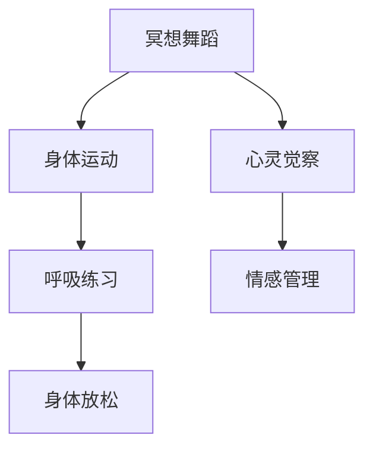

                 

### 《现代冥想舞蹈工作坊：身体运动中的心灵觉察练习》

> 关键词：冥想舞蹈、身体运动、心灵觉察、练习步骤、技巧与方法

> 摘要：本文旨在探讨现代冥想舞蹈工作坊中的身体运动与心灵觉察练习，通过详细的章节结构和深入的技术分析，帮助读者理解冥想舞蹈的益处、练习步骤及技巧，并引导其在实际应用中进行实践与自我提升。

## 第一部分：冥想舞蹈概述

### 第1章：冥想舞蹈的基础知识

#### 1.1 冥想舞蹈的定义与起源

冥想舞蹈是一种结合了身体运动与心灵觉察的练习方式，它起源于20世纪60年代的美国，随着瑜伽和冥想的流行逐渐发展起来。冥想舞蹈的核心概念是利用舞蹈动作来引导内心的平静与专注，通过身体的协调和呼吸的调节，达到身体与心灵的和谐统一。

#### 1.2 冥想舞蹈的益处

冥想舞蹈不仅有助于身体健康，还能提升心理状态。从身体层面来看，它能够增强肌肉力量、提高柔韧性、促进血液循环。从心理层面来说，它有助于减轻压力、提高专注力、改善情绪。此外，冥想舞蹈还具有社会文化层面的益处，如增进人际交往、提升生活品质等。

### 第2章：冥想舞蹈的练习步骤

#### 2.1 准备阶段

在冥想舞蹈的练习中，准备阶段至关重要。首先进行身体热身，以减少受伤的风险；然后进行心态调整，确保内心的平静；最后布置适宜的环境，以创造一个宁静的练习空间。

#### 2.2 实践阶段

实践阶段是冥想舞蹈的核心部分。首先进行呼吸练习，以调节气息；接着进行身体放松，让身体与心灵都得到充分的放松；最后进行心灵觉察，引导内心深入探索。

### 第3章：冥想舞蹈的技巧与方法

#### 3.1 舞蹈动作的技巧

舞蹈动作的技巧是冥想舞蹈的重要组成部分。包括身体协调、节奏感培养和动作流畅性提升。通过练习，可以逐步掌握这些技巧，使舞蹈动作更加自然流畅。

#### 3.2 心理技巧

心理技巧在冥想舞蹈中同样重要。包括专注力培养、冥想技巧和情感管理。通过这些技巧的运用，可以提高内心的平静与专注，从而更好地享受舞蹈过程。

## 第二部分：冥想舞蹈实践案例

### 第4章：冥想舞蹈实践案例一

#### 案例背景

该案例旨在通过简单的冥想舞蹈动作，帮助初学者放松身心，提升情绪。

#### 练习目标

- 减轻压力
- 提高专注力
- 改善情绪

#### 具体步骤

1. **热身**：进行简单的伸展和呼吸练习，为接下来的舞蹈动作做好准备。
2. **基础动作**：学习简单的舞蹈动作，如手臂的摆动、脚步的移动等。
3. **呼吸调节**：通过深呼吸，让身体和心灵都得到放松。
4. **心灵觉察**：在动作中进行自我观察，关注身体的感受和情绪的变化。

### 第5章：冥想舞蹈实践案例二

#### 案例背景

该案例旨在通过更具挑战性的舞蹈动作，提高练习者的身体协调性和节奏感。

#### 练习目标

- 提高身体协调性
- 增强节奏感
- 提升自信心

#### 具体步骤

1. **热身**：进行全身性的热身运动，特别是针对腿部和手臂的动作。
2. **难度动作**：学习一些较为复杂的舞蹈动作，如跳跃、旋转等。
3. **节奏感培养**：通过跟随音乐，培养舞蹈动作的节奏感。
4. **心灵觉察**：在动作中保持专注，感受身体的协调和节奏的变化。

### 第6章：冥想舞蹈实践案例三

#### 案例背景

该案例旨在通过具有情感表达力的舞蹈动作，帮助练习者更好地管理情感，提升自我认知。

#### 练习目标

- 提高情感管理能力
- 增强自我认知
- 提升自信心

#### 具体步骤

1. **热身**：进行情感释放的热身活动，如深呼吸、大声呼吸等。
2. **情感表达**：学习通过舞蹈动作表达情感，如快乐、悲伤、愤怒等。
3. **心灵觉察**：在动作中深入探索情感的变化，了解自己的情绪状态。
4. **总结反思**：练习结束后，进行总结和反思，了解自己在情感管理方面的进步。

## 第三部分：冥想舞蹈的教学与传播

### 第7章：冥想舞蹈的教学方法

#### 教学目标设定

- 帮助初学者掌握冥想舞蹈的基本技巧
- 提高练习者的身体协调性和节奏感
- 培养练习者的情感管理能力和自我认知

#### 教学内容安排

- **基础课程**：包括热身、基础动作、呼吸练习等。
- **进阶课程**：包括难度动作、情感表达、心灵觉察等。
- **高级课程**：包括舞蹈编排、舞台表演技巧等。

#### 教学评估方式

- **过程评估**：观察练习者的动作协调性、节奏感和情感表达。
- **结果评估**：通过练习后的反馈和改进，评估练习者自我认知的提升。

### 第8章：冥想舞蹈的传播途径

#### 线上传播

- **社交媒体平台**：通过微信、微博、抖音等平台，分享冥想舞蹈的教学视频和心得。
- **在线课程**：在 Udemy、Coursera 等在线教育平台开设冥想舞蹈课程。

#### 线下传播

- **工作坊与讲座**：举办线下冥想舞蹈工作坊和讲座，吸引更多人参与。
- **社区活动**：组织社区冥想舞蹈活动，促进人际交往和社区凝聚力。

### 第9章：冥想舞蹈的未来发展趋势

#### 技术融合

- **虚拟现实**：通过虚拟现实技术，提供沉浸式的冥想舞蹈体验。
- **人工智能**：利用人工智能技术，为冥想舞蹈提供个性化教学方案。

#### 社会文化影响

- **多元化**：冥想舞蹈将吸引更多不同背景和文化的人群参与。
- **普及化**：随着技术的进步和人们健康意识的提高，冥想舞蹈将在全球范围内得到更广泛的传播和应用。

## 附录

### 附录A：冥想舞蹈资源推荐

- **书籍推荐**：
  - 《冥想舞蹈入门》
  - 《心灵舞动：冥想舞蹈实践与技巧》
- **视频资源**：
  - 《冥想舞蹈教程》系列视频
  - 冥想舞蹈在线直播课程
- **工作坊信息**：
  - 各大城市的冥想舞蹈工作坊信息
  - 国际冥想舞蹈大师公开课

## 核心概念与联系 Mermaid 流程图



## 核心算法原理讲解（伪代码）

```python
# 冥想舞蹈练习步骤伪代码

# 初始化环境
setup_environment()

# 准备阶段
body_warming()
mental_adjustment()
environment_setup()

# 实践阶段
perform_breathing_exercise()
body_relaxation()
mind_awareness()

# 结束阶段
summary_and_evaluation()
```

## 数学模型和数学公式

$$
\text{身体放松程度} = f(\text{练习时长}, \text{呼吸频率}, \text{心理状态})
$$

- **详细讲解：**
  身体放松程度是通过练习时长、呼吸频率和心理状态三个变量共同作用的结果。

## 项目实战

### 实战一：冥想舞蹈练习

#### 开发环境搭建

- **硬件**：笔记本电脑
- **软件**：视频录制工具（如OBS Studio）

#### 源代码详细实现

- **录制冥想舞蹈练习视频**
- **后期剪辑与配乐**

#### 代码解读与分析

- **视频剪辑工具的使用方法**
- **视频剪辑技巧**

### 实战二：冥想舞蹈教学视频制作

#### 开发环境搭建

- **硬件**：专业摄像机、灯光设备
- **软件**：视频剪辑软件（如Adobe Premiere）

#### 源代码详细实现

- **录制教学视频**
- **剪辑教学视频**
- **添加字幕与音效**

#### 代码解读与分析

- **视频剪辑软件的使用方法**
- **教学视频的剪辑技巧**

## 最佳实践 tips

1. **坚持练习**：冥想舞蹈的效果需要长期积累，建议每周至少练习一次。
2. **合理饮食**：保持均衡的饮食，有助于身体和心灵的健康发展。
3. **注重细节**：在练习过程中，注意动作的细节和呼吸的调节，逐步提高自己的技能。

## 小结

本文详细介绍了冥想舞蹈的基础知识、练习步骤、技巧与方法，并通过实践案例展示了其实际应用效果。通过冥想舞蹈，我们不仅可以获得身体上的放松和健康，还能提升心理素质和情感管理能力。希望本文能为您在冥想舞蹈的探索道路上提供一些帮助和启示。

## 注意事项

1. **安全第一**：在练习冥想舞蹈时，一定要注意安全，避免受伤。
2. **适量练习**：根据自身身体状况，合理安排练习时间，避免过度劳累。
3. **持续学习**：冥想舞蹈是一个不断学习和提升的过程，要勇于尝试新动作和新技巧。

## 拓展阅读

- **《冥想舞蹈入门指南》**：详细介绍了冥想舞蹈的基本概念和实践方法。
- **《心灵舞动：冥想舞蹈实践与技巧》**：深入探讨了冥想舞蹈对心理和情感的影响。
- **《冥想舞蹈教学与实践》**：提供了丰富的冥想舞蹈教学视频和案例分析。

## 作者信息

- **作者：AI天才研究院/AI Genius Institute & 禅与计算机程序设计艺术 /Zen And The Art of Computer Programming**

