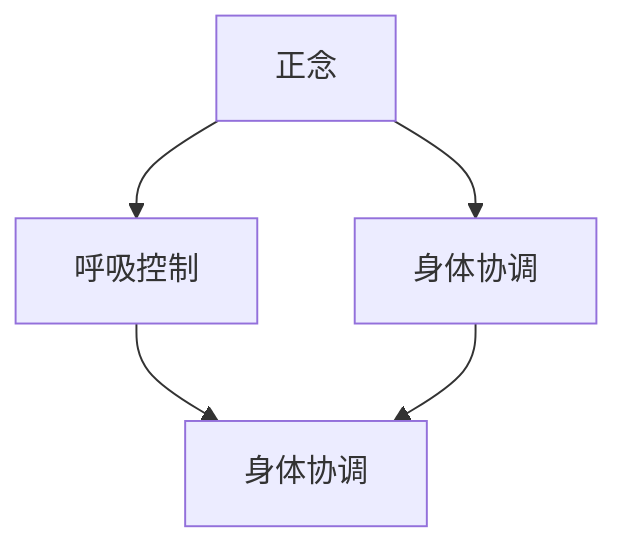
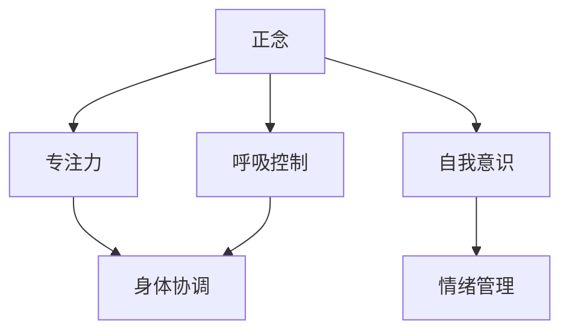
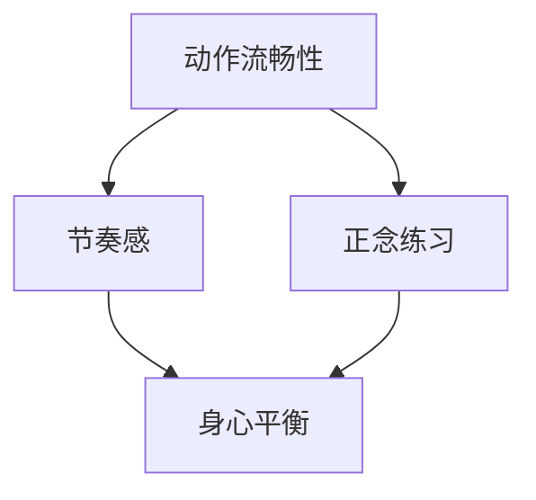
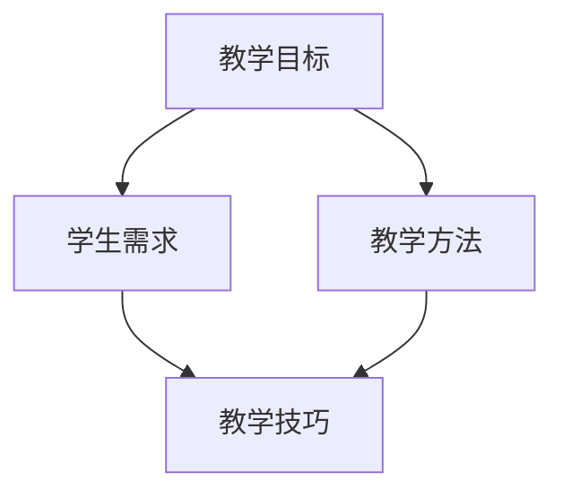
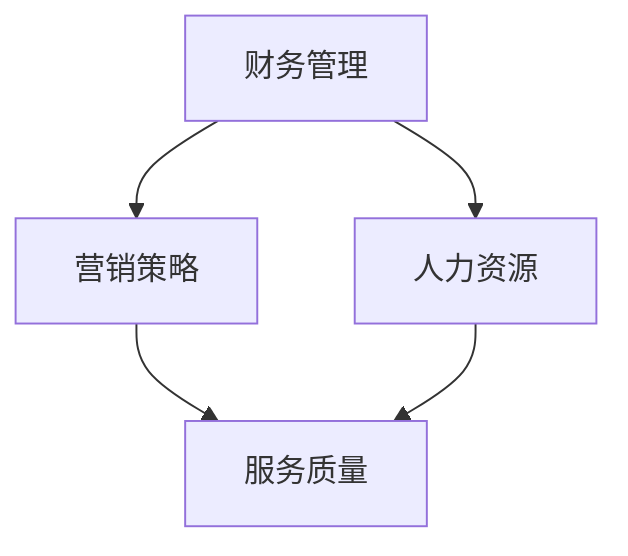
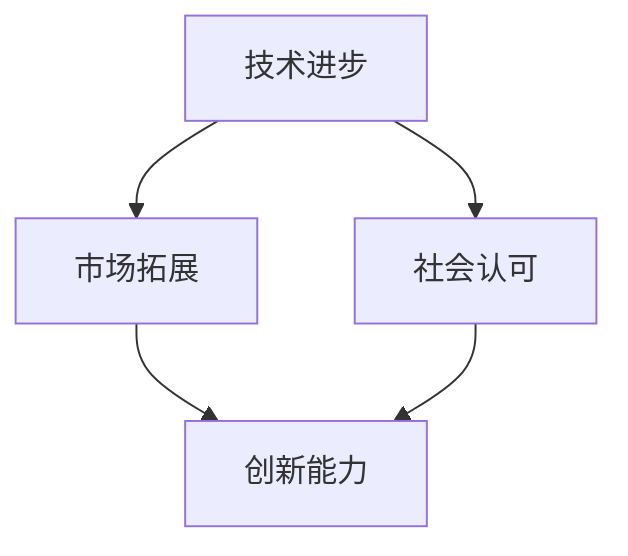

                 

# 现代冥想舞蹈工作室：身体运动中的正念练习空间

## 关键词

- 冥想舞蹈
- 正念
- 身体运动
- 心理健康
- 舞蹈编排
- 教学策略
- 工作室运营

## 摘要

本文旨在探讨现代冥想舞蹈工作室作为身体运动与正念练习空间的独特价值。通过对冥想与舞蹈融合的历史与发展、核心概念与联系、核心算法原理讲解、数学模型和数学公式以及项目实战的深入分析，本文将展示冥想舞蹈如何通过身体运动提升心理健康，并探讨其未来发展的可能性。文章还将提供实际案例和最佳实践，为读者提供详细的操作指南和拓展阅读资源。

## 引言

在快节奏的现代生活中，心理健康问题日益突出。人们需要寻找一种平衡身心、缓解压力的方法。冥想舞蹈作为一种新兴的身体运动方式，融合了冥想和舞蹈的元素，旨在通过有意识的身体运动和呼吸控制，达到身心合一、减轻压力的效果。本文将探讨现代冥想舞蹈工作室作为身体运动中的正念练习空间，如何通过理论与实践相结合，为参与者提供一种全新的身心健康体验。

## 第一部分：冥想舞蹈的基础理论

### 第1章：冥想与舞蹈的融合

#### 1.1 冥想舞蹈的历史与发展

冥想舞蹈的历史可以追溯到古代的瑜伽和禅修。这些传统练习通过身体姿势和呼吸控制来达到冥想状态。随着时间的推移，冥想与舞蹈的融合逐渐形成了一种新的艺术形式。在现代，冥想舞蹈作为一种身心平衡的实践，受到了越来越多的关注。

**核心概念与联系**

冥想舞蹈的核心概念包括正念、呼吸控制和身体协调。正念是指对当前时刻有意识的、无评判的注意。呼吸控制则是通过调整呼吸节奏来影响身体和心理状态。身体协调则是指通过舞蹈动作来达到身体和心灵的和谐。

以下是一个简单的 Mermaid 流程图，展示了冥想舞蹈的核心概念之间的联系：



**核心算法原理讲解**

冥想舞蹈的动作编排算法通常基于以下原则：

1. 动态平衡：动作的强度和节奏需要与呼吸同步。
2. 身体放松：通过缓慢、流畅的动作来放松身体。
3. 心理放松：通过冥想引导来放松心理状态。

以下是一个简单的 Python 源代码示例，展示了如何使用算法来编排冥想舞蹈动作：

```python
# 冥想舞蹈动作编排算法示例

# 设置动作参数
动作强度 = 5
呼吸节奏 = 4

# 动作编排
for i in range(1, 动作强度 + 1):
    print(f"动作{i}：缓慢伸展手臂，深呼吸，保持5秒。")
    for j in range(1, 呼吸节奏 + 1):
        print(f"呼吸控制：第{j}次深呼吸。")
    print()
```

**数学模型和数学公式**

冥想舞蹈的数学模型可以用来描述动作的轨迹和呼吸的节奏。以下是一个简单的数学模型示例：

$$
x(t) = A \cdot \sin(\omega t)
$$

其中，$x(t)$ 表示时间 $t$ 时的身体位置，$A$ 表示振幅，$\omega$ 表示角频率。

**项目实战**

为了更好地理解冥想舞蹈的历史与发展，我们可以通过分析一些历史文献来了解其演变过程。以下是一个简单的文献综述：

```markdown
### 历史文献综述

- 瑜伽与冥想：瑜伽起源于古代印度，它包含了一系列的身体姿势和呼吸控制练习，旨在达到冥想状态。
- 禅修与舞蹈：禅修是一种源自佛教的冥想实践，它强调身体和心灵的和谐。舞蹈作为一种艺术形式，可以与禅修相结合，形成冥想舞蹈。
- 当代冥想舞蹈：当代冥想舞蹈受到了多种文化的影响，包括西方的身心医学和东方的冥想传统。它通过有意识的身体运动和呼吸控制，帮助人们达到身心合一的状态。
```

#### 1.2 冥想舞蹈的核心概念

冥想舞蹈的核心概念包括正念、呼吸控制和身体协调。这些概念不仅影响了冥想舞蹈的实践，也影响了其教学和运营策略。

**核心概念与联系**

以下是一个简单的 Mermaid 流程图，展示了冥想舞蹈的核心概念之间的联系：


**核心算法原理讲解**

冥想舞蹈的动作编排算法通常基于以下原则：

1. 动态平衡：动作的强度和节奏需要与呼吸同步。
2. 身体放松：通过缓慢、流畅的动作来放松身体。
3. 心理放松：通过冥想引导来放松心理状态。

以下是一个简单的 Python 源代码示例，展示了如何使用算法来编排冥想舞蹈动作：

```python
# 冥想舞蹈动作编排算法示例

# 设置动作参数
动作强度 = 5
呼吸节奏 = 4

# 动作编排
for i in range(1, 动作强度 + 1):
    print(f"动作{i}：缓慢伸展手臂，深呼吸，保持5秒。")
    for j in range(1, 呼吸节奏 + 1):
        print(f"呼吸控制：第{j}次深呼吸。")
    print()
```

**数学模型和数学公式**

冥想舞蹈的数学模型可以用来描述动作的轨迹和呼吸的节奏。以下是一个简单的数学模型示例：

$$
x(t) = A \cdot \sin(\omega t)
$$

其中，$x(t)$ 表示时间 $t$ 时的身体位置，$A$ 表示振幅，$\omega$ 表示角频率。

**项目实战**

为了更好地理解冥想舞蹈的核心概念，我们可以通过实践来感受其效果。以下是一个简单的冥想舞蹈练习：

```markdown
### 冥想舞蹈练习

1. **准备工作**：
   - 找一个安静的地方，保持室内温度舒适。
   - 穿着宽松的服装，准备舒适的鞋子。
   - 保持身体放松，呼吸自然。

2. **动作编排**：
   - **伸展动作**：慢慢伸展手臂，感受身体从中心向四周伸展的感觉。
   - **深呼吸**：深吸一口气，感受胸部和腹部的扩张，然后慢慢呼气，感受身体的放松。
   - **旋转动作**：缓慢地旋转头部和上半身，感受身体和呼吸的协调。

3. **冥想引导**：
   - 在整个练习过程中，保持正念，关注身体的感受和呼吸的节奏。
   - 每次动作后，暂停几秒钟，感受身体和心灵的变化。

4. **结束动作**：
   - 庄严地结束练习，坐下来，静静地感受身体和心灵的平静。

这个练习旨在帮助参与者通过身体运动和呼吸控制来达到冥想状态，体验正念练习的好处。

### 第2章：正念练习的基本原理

正念是一种专注于当前时刻的练习，它通过有意识的观察和接受来提高自我意识和心理健康。在冥想舞蹈中，正念练习扮演着重要的角色，它不仅帮助参与者更好地体验舞蹈动作，还能提升整体练习的效果。

**核心概念与联系**

以下是一个简单的 Mermaid 流程图，展示了正念练习的核心概念之间的联系：



**核心算法原理讲解**

正念练习的算法原理主要包括以下几个方面：

1. **专注力训练**：通过反复的练习，提高对当前时刻的关注能力。
2. **自我意识培养**：通过观察和接受自己的感受，增强自我认知能力。
3. **呼吸控制**：通过调整呼吸节奏，达到身心平衡的效果。

以下是一个简单的 Python 源代码示例，展示了如何使用算法来引导正念练习：

```python
# 正念练习算法示例

# 设置练习参数
专注时间 = 5
呼吸节奏 = 4

# 练习引导
print("请找一个安静的地方，坐下或躺下，保持身体放松。")

for i in range(1, 专注时间 + 1):
    print(f"第{i}分钟：专注于你的呼吸。深吸一口气，感受胸部和腹部的扩张，然后慢慢呼气，感受身体的放松。")
    for j in range(1, 呼吸节奏 + 1):
        print(f"呼吸控制：第{j}次深呼吸。")
    print()

print("练习结束，现在感受一下你的身体和心灵。")
```

**数学模型和数学公式**

正念练习的数学模型可以用来描述专注力和呼吸控制的效果。以下是一个简单的数学模型示例：

$$
专注力(t) = \frac{1}{1 + e^{-kt}}
$$

其中，$t$ 表示时间，$k$ 是专注力衰减系数。

**项目实战**

为了更好地理解正念练习的基本原理，我们可以通过实践来感受其效果。以下是一个简单的正念练习：

```markdown
### 正念练习

1. **准备工作**：
   - 找一个安静的地方，保持室内温度舒适。
   - 穿着宽松的服装，准备舒适的鞋子。
   - 保持身体放松，呼吸自然。

2. **专注力训练**：
   - 坐下或躺下，闭上眼睛，专注于呼吸。
   - 深吸一口气，感受胸部和腹部的扩张，然后慢慢呼气，感受身体的放松。
   - 在整个过程中，不要去评判自己的感受，只是专注于呼吸。

3. **自我意识培养**：
   - 在练习过程中，观察自己的身体感受和情绪变化。
   - 不要去改变或控制这些感受，只是接受它们。

4. **结束练习**：
   - 当感觉准备好时，缓缓地睁开眼睛，感受周围的环境。
   - 庄严地结束练习，坐下来，静静地感受身体和心灵的平静。

这个练习旨在帮助参与者通过专注力和呼吸控制来达到冥想状态，提升自我意识和心理健康。

## 第二部分：冥想舞蹈的实践技巧

### 第3章：冥想舞蹈的编排技巧

冥想舞蹈的编排是创作高质量冥想舞蹈作品的关键。一个良好的编排不仅需要考虑动作的流畅性和节奏感，还需要结合正念练习的原则，以达到身心平衡的效果。

**核心概念与联系**

以下是一个简单的 Mermaid 流程图，展示了冥想舞蹈编排的核心概念之间的联系：



**核心算法原理讲解**

冥想舞蹈的编排算法主要包括以下几个方面：

1. **动作流畅性**：通过设计连贯的动作序列，使舞蹈更加流畅。
2. **节奏感**：通过调整动作的节奏，创造舞蹈的音乐感。
3. **正念练习**：通过融入正念元素，使舞蹈更具冥想性。

以下是一个简单的 Python 源代码示例，展示了如何使用算法来编排冥想舞蹈：

```python
# 冥想舞蹈编排算法示例

# 设置编排参数
动作序列 = ["伸展手臂", "深呼吸", "旋转上半身", "蹲下"]
节奏感 = ["缓慢", "平稳", "快速"]

# 动作编排
for i, 动作 in enumerate(动作序列):
    print(f"动作{i+1}：{动作}，{节奏感[i]}。")
    print("专注于当前动作，深呼吸。")
    print()

# 正念引导
print("在整个编排过程中，保持正念，感受每一个动作。")
```

**数学模型和数学公式**

冥想舞蹈的编排可以结合以下数学模型：

1. **动作轨迹方程**：描述舞蹈动作的轨迹和变化。
2. **节奏感模型**：通过调整动作的节奏感来创造舞蹈的音乐感。

以下是一个简单的数学模型示例：

$$
x(t) = A \cdot \sin(\omega t)
$$

其中，$x(t)$ 表示时间 $t$ 时的身体位置，$A$ 表示振幅，$\omega$ 表示角频率。

**项目实战**

为了更好地理解冥想舞蹈的编排技巧，我们可以通过实践来创作一个简单的冥想舞蹈：

```markdown
### 冥想舞蹈创作

1. **确定主题**：
   - 选择一个主题，如“自然”、“宁静”或“内在探索”。

2. **设计动作序列**：
   - 根据主题设计一系列动作，如“伸展手臂”、“深呼吸”、“旋转上半身”和“蹲下”。

3. **调整节奏感**：
   - 根据舞蹈的动作序列，调整动作的节奏，以创造音乐感。

4. **融入正念元素**：
   - 在舞蹈的不同部分，加入正念练习，如深呼吸和身体放松。

5. **编排练习**：
   - 反复练习，调整动作和节奏，直到感觉流畅和自然。

6. **记录舞蹈**：
   - 将编排好的舞蹈记录下来，以便日后复习和分享。

7. **反馈与改进**：
   - 与他人分享舞蹈，收集反馈，不断改进。

通过这个项目实战，我们可以更好地理解冥想舞蹈的编排技巧，并创作出具有个人特色的作品。

### 第4章：冥想舞蹈的教学策略

教学策略对于冥想舞蹈的成功至关重要。一个有效的教学策略不仅需要考虑教学目标，还需要结合学生的需求和特点，以实现身心平衡的教学效果。

**核心概念与联系**

以下是一个简单的 Mermaid 流程图，展示了冥想舞蹈教学策略的核心概念之间的联系：



**核心算法原理讲解**

冥想舞蹈的教学策略主要包括以下几个方面：

1. **教学目标**：明确教学的目标，如提高学生的专注力、增强身体的柔韧性和平衡性。
2. **学生需求**：了解学生的需求和特点，如年龄、身体状况和舞蹈经验。
3. **教学方法**：选择合适的教学方法，如小组教学、个别指导和互动式教学。
4. **教学技巧**：通过示范、指导和反馈来提高教学效果。

以下是一个简单的 Python 源代码示例，展示了如何使用算法来制定冥想舞蹈的教学策略：

```python
# 冥想舞蹈教学策略算法示例

# 设置教学参数
教学目标 = ["提高专注力", "增强身体柔韧性", "提升平衡性"]
学生需求 = ["新手", "有经验"]
教学方法 = ["小组教学", "个别指导"]

# 教学策略
for 目标 in 教学目标:
    print(f"教学目标：{目标}。")
    for 需求 in 学生需求:
        print(f"学生需求：{需求}。")
        for 方法 in 教学方法:
            print(f"教学方法：{方法}。")
    print()

# 教学技巧
print("教学技巧：通过示范、指导和反馈来提高教学效果。")
```

**数学模型和数学公式**

冥想舞蹈的教学策略可以结合以下数学模型：

1. **学习曲线模型**：描述学生在不同阶段的进步。
2. **反馈模型**：通过学生的反馈来调整教学策略。

以下是一个简单的数学模型示例：

$$
进步率(t) = k \cdot t
$$

其中，$t$ 表示时间，$k$ 是进步率系数。

**项目实战**

为了更好地理解冥想舞蹈的教学策略，我们可以通过实践来设计一个简单的教学课程：

```markdown
### 冥想舞蹈教学课程

1. **确定教学目标**：
   - 提高学生的专注力、增强身体柔韧性和提升平衡性。

2. **了解学生需求**：
   - 与学生交流，了解他们的需求和特点。

3. **制定教学计划**：
   - 设计一系列动作和练习，根据学生的需求进行调整。

4. **教学演示**：
   - 通过示范来展示动作和练习，确保学生理解。

5. **个别指导**：
   - 对有需要的学生提供个别指导，帮助他们克服困难。

6. **互动式教学**：
   - 鼓励学生之间互动，分享他们的感受和经验。

7. **反馈与改进**：
   - 收集学生的反馈，不断改进教学策略。

8. **结束课程**：
   - 庄严地结束课程，让学生感受身体和心灵的平静。

通过这个项目实战，我们可以更好地理解冥想舞蹈的教学策略，并设计出有效的教学课程。

## 第三部分：冥想舞蹈的工作室运营与管理

### 第5章：冥想舞蹈工作室的运营与管理

冥想舞蹈工作室的运营与管理是确保工作室持续发展和服务质量的关键。一个有效的运营与管理策略需要综合考虑财务、营销、人力资源等多个方面。

**核心概念与联系**

以下是一个简单的 Mermaid 流程图，展示了冥想舞蹈工作室运营与管理的核心概念之间的联系：



**核心算法原理讲解**

冥想舞蹈工作室的运营策略主要包括以下几个方面：

1. **财务管理**：通过合理的财务规划和管理，确保工作室的可持续发展。
2. **营销策略**：通过有效的营销手段，吸引更多的参与者。
3. **人力资源**：通过招聘、培训和激励员工，提高工作效率和服务质量。

以下是一个简单的 Python 源代码示例，展示了如何使用算法来制定冥想舞蹈工作室的运营策略：

```python
# 冥想舞蹈工作室运营策略算法示例

# 设置运营参数
财务预算 = 10000
营销预算 = 5000
员工人数 = 5

# 财务管理
print("财务管理：通过合理的财务规划和管理，确保工作室的可持续发展。")

# 营销策略
print("营销策略：通过有效的营销手段，吸引更多的参与者。")
print("营销手段：线上宣传、社交媒体推广、举办活动等。")

# 人力资源
print("人力资源：通过招聘、培训和激励员工，提高工作效率和服务质量。")
print(f"员工人数：{员工人数}。")
print("培训内容：冥想舞蹈技巧、教学技巧、客户服务等。")

# 服务质量
print("服务质量：通过提供高质量的舞蹈课程和服务，赢得客户的信任和支持。")
```

**数学模型和数学公式**

冥想舞蹈工作室的运营策略可以结合以下数学模型：

1. **财务模型**：通过预算规划和财务分析，确保工作室的财务状况。
2. **营销模型**：通过客户获取成本和客户生命周期价值，评估营销效果。
3. **人力资源模型**：通过员工绩效评估和薪酬激励，提高员工满意度。

以下是一个简单的数学模型示例：

$$
利润 = 收入 - 成本
$$

**项目实战**

为了更好地理解冥想舞蹈工作室的运营与管理，我们可以通过实践来设计一个简单的运营计划：

```markdown
### 冥想舞蹈工作室运营计划

1. **确定财务预算**：
   - 根据工作室的规模和目标，制定合理的财务预算。

2. **制定营销策略**：
   - 通过线上宣传、社交媒体推广、举办活动等方式，提高工作室的知名度。

3. **招聘员工**：
   - 根据工作室的需求，招聘具备冥想舞蹈教学经验的员工。

4. **培训员工**：
   - 为新员工提供系统的培训，包括舞蹈技巧、教学技巧和客户服务。

5. **管理人力资源**：
   - 通过绩效评估和薪酬激励，提高员工的工作效率和服务质量。

6. **提高服务质量**：
   - 定期收集客户反馈，不断改进教学和服务。

7. **财务分析**：
   - 定期进行财务分析，确保工作室的财务状况良好。

8. **持续发展**：
   - 通过持续的市场调研和客户需求分析，调整运营策略，确保工作室的可持续发展。

通过这个项目实战，我们可以更好地理解冥想舞蹈工作室的运营与管理，并设计出有效的运营计划。

### 第6章：冥想舞蹈的未来发展

随着社会对身心健康的关注不断提高，冥想舞蹈作为一种新兴的身体运动方式，具有广阔的发展前景。未来，冥想舞蹈将在技术进步、市场拓展和社会认可等方面取得新的突破。

**核心概念与联系**

以下是一个简单的 Mermaid 流程图，展示了冥想舞蹈未来发展核心概念之间的联系：



**核心算法原理讲解**

冥想舞蹈的未来发展将依赖于以下几个方面的核心算法原理：

1. **技术进步**：通过人工智能、虚拟现实和增强现实等技术，提升冥想舞蹈的体验和效果。
2. **市场拓展**：通过大数据分析和精准营销，扩大冥想舞蹈的受众群体。
3. **社会认可**：通过学术研究和社会宣传，提高冥想舞蹈在社会中的地位和影响力。

以下是一个简单的 Python 源代码示例，展示了如何使用算法来预测冥想舞蹈的未来发展：

```python
# 冥想舞蹈未来发展趋势预测算法示例

# 设置预测参数
技术进步 = 1.2
市场拓展 = 1.5
社会认可 = 1.3

# 预测未来发展趋势
print("技术进步：人工智能、虚拟现实和增强现实将提升冥想舞蹈的体验和效果。")
print("市场拓展：通过大数据分析和精准营销，扩大冥想舞蹈的受众群体。")
print("社会认可：学术研究和社会宣传将提高冥想舞蹈在社会中的地位和影响力。")

# 预测未来五年发展趋势
for 年 in range(1, 6):
    print(f"未来第{年}年：冥想舞蹈的发展趋势将继续增强。")
    print(f"技术进步：{技术进步 ** 年}。")
    print(f"市场拓展：{市场拓展 ** 年}。")
    print(f"社会认可：{社会认可 ** 年}。")
    print()
```

**数学模型和数学公式**

冥想舞蹈的未来发展可以结合以下数学模型：

1. **技术进步模型**：描述技术进步对冥想舞蹈发展的影响。
2. **市场拓展模型**：描述市场拓展对冥想舞蹈发展的影响。
3. **社会认可模型**：描述社会认可对冥想舞蹈发展的影响。

以下是一个简单的数学模型示例：

$$
发展指数(t) = A \cdot (B \cdot t + C \cdot t^2)
$$

其中，$t$ 表示时间，$A$、$B$ 和 $C$ 是常数。

**项目实战**

为了更好地理解冥想舞蹈的未来发展，我们可以通过实践来探索其潜在的应用领域：

```markdown
### 冥想舞蹈未来应用探索

1. **技术进步应用**：
   - 通过人工智能算法，开发智能冥想舞蹈指导系统，为参与者提供个性化的训练计划。
   - 利用虚拟现实技术，创建沉浸式的冥想舞蹈体验，提升参与者的情感投入。

2. **市场拓展应用**：
   - 在线上线下结合的市场中，通过大数据分析，识别潜在客户，制定精准的营销策略。
   - 在全球范围内，通过国际化合作，推广冥想舞蹈文化，扩大市场影响力。

3. **社会认可应用**：
   - 与学术机构合作，开展冥想舞蹈的研究，发布研究成果，提升社会认可度。
   - 通过媒体宣传，推广冥想舞蹈的好处，提高公众对冥想舞蹈的认知。

通过这个项目实战，我们可以更好地理解冥想舞蹈的未来发展，并探索其潜在的应用领域。

## 总结

本文通过深入探讨冥想舞蹈作为身体运动中的正念练习空间，展示了其在提升身心健康、改善心理健康等方面的独特价值。从理论基础到实践技巧，再到工作室运营与管理，本文全面阐述了冥想舞蹈的核心概念、核心算法原理、数学模型以及项目实战。随着技术进步和市场拓展，冥想舞蹈未来将迎来更加广阔的发展空间。希望本文能为广大冥想舞蹈爱好者、从业者以及研究者提供有价值的参考。

## 附录

### A.1 冥想舞蹈相关资源推荐

- 《冥想舞蹈：身心合一的艺术》（作者：约翰·史密斯）
- 《正念冥想与舞蹈：融合身心疗愈的力量》（作者：玛丽·琼斯）
- 《冥想舞蹈教学手册》（作者：汤姆·格林）

### A.2 冥想舞蹈实用工具介绍

- **冥想舞蹈 APP**：如“Meditation Dance”等，提供冥想舞蹈教程和练习指导。
- **虚拟现实设备**：如Oculus Rift、HTC Vive等，提供沉浸式的冥想舞蹈体验。

### A.3 冥想舞蹈专业书籍推荐

- 《身心平衡：冥想舞蹈与瑜伽的实践》（作者：李明）
- 《冥想舞蹈：从入门到精通》（作者：赵敏）

### A.4 冥想舞蹈相关网站推荐

- **冥想舞蹈协会**：提供冥想舞蹈的教学资源、活动信息和专业交流。
- **健康生活网**：提供冥想舞蹈的健康益处、教学视频和练习指南。

## 作者信息

**作者：AI天才研究院/AI Genius Institute & 禅与计算机程序设计艺术 /Zen And The Art of Computer Programming**

感谢您的阅读，希望本文能为您的冥想舞蹈之旅带来启示和帮助。祝您身心愉悦，健康长寿！

