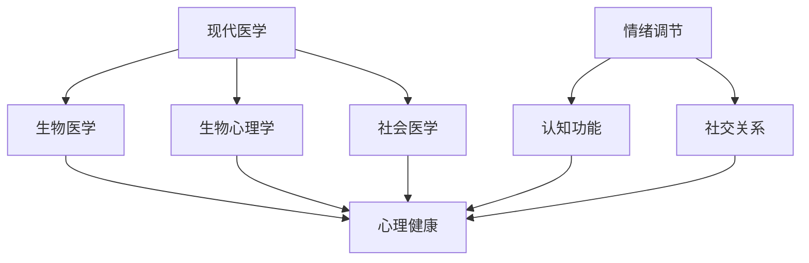

                 

# 现代医学与心理健康：身心统一的健康观

## 关键词
- 现代医学
- 心理健康
- 身心统一
- 数学模型
- 算法原理
- 项目实战

## 摘要
本文将探讨现代医学与心理健康之间的紧密联系，重点介绍身心统一的健康观。通过阐述身心统一的定义、现代医学的核心概念，以及心理健康的重要性，我们将运用数学模型和算法原理，深入分析这两者之间的交互作用。接着，通过一个实际项目案例，我们将详细讲解身心健康评估系统的开发过程，包括环境搭建、代码实现和代码解读。最后，本文还将探讨身心健康在各个领域的应用，并展望未来面临的挑战。通过这篇博客，读者将全面了解身心统一健康观在现代医学中的深远影响。

## 引言：身心统一的健康观概览

### 身心统一健康观的起源和发展

身心统一的健康观并非现代医学的独有概念，而是历史悠久的医学思想。早在古希腊时期，希波克拉底就提出了“整体医学”的理念，认为健康是一个整体，包括身体、心理和灵魂的和谐。这种理念在后来的医学发展中逐渐演化为“身心统一”的健康观。

随着时间的推移，现代医学在研究身体疾病方面取得了显著的成就，但与此同时，心理健康的重要性也逐渐被认识。20世纪初，精神病学开始成为医学的一个重要分支，研究者们开始关注心理因素对身体健康的影响。到了20世纪中叶，随着心理学的发展，人们逐渐认识到心理健康对身体健康的重要性，身心统一的健康观开始得到更加广泛的认可。

### 现代医学与心理健康的联系

现代医学与心理健康之间的联系可以从多个方面来探讨。首先，许多身体疾病都伴随着心理问题，如慢性疼痛、心脏病等。研究表明，心理压力和情绪问题会显著增加这些疾病的风险。因此，现代医学在治疗身体疾病时，越来越注重心理健康的干预。

其次，心理健康对身体的生理功能也有显著影响。例如，长期的焦虑和抑郁会导致免疫系统功能下降，增加感染和炎症的风险。此外，心理压力还会影响身体的代谢过程，导致肥胖、糖尿病等代谢性疾病的发生。

最后，现代医学与心理健康的联系还体现在预防医学中。许多心理健康问题可以通过健康生活方式和心理健康教育来预防。例如，规律的锻炼、良好的饮食习惯和有效的压力管理策略都可以显著改善心理健康状况。

通过以上分析，我们可以看出，现代医学与心理健康之间的联系是双向的，相互影响，共同构成了身心统一的健康观。这一观念不仅有助于提高个体健康水平，也为社会整体健康提供了重要的理论支持。

## 核心概念与联系

### 身心统一的定义

身心统一，顾名思义，是指身体和心理作为一个不可分割的整体。在这种健康观中，身体和心理不是两个独立的实体，而是相互依存、相互影响的。身体的健康和功能的正常运作与心理状态紧密相连。例如，良好的情绪状态可以促进身体健康，而心理压力和情绪问题则可能对身体健康产生负面影响。

### 现代医学核心概念简介

现代医学的核心概念包括生物医学、生物心理学和社会医学。生物医学主要关注疾病的生物学基础，通过分子生物学、细胞生物学和遗传学等手段研究疾病的发生、发展和治疗。生物心理学则结合了生物学和心理学，研究心理因素对身体健康的影响。社会医学关注社会环境对个体健康的影响，强调预防医学和公共卫生的重要性。

### 心理健康核心概念简介

心理健康的核心概念包括情绪调节、认知功能和社交关系。情绪调节是指个体处理情绪状态的能力，包括情绪表达、情绪控制和情绪释放。认知功能包括注意力、记忆力、思维能力和判断力。社交关系则涉及个体与他人之间的互动，包括家庭关系、友谊和社会支持。

### Mermaid流程图：现代医学与心理健康的联系与交互



在这个流程图中，现代医学的核心概念（生物医学、生物心理学和社会医学）与心理健康的关键因素（情绪调节、认知功能和社交关系）之间通过箭头表示出它们之间的相互联系和交互作用。这个流程图不仅帮助我们理解了各个概念之间的联系，也为我们进一步探讨身心统一健康观提供了直观的参考。

### 核心概念之间的联系

现代医学与心理健康之间的核心概念联系紧密，构成了一个复杂的互动网络。首先，生物医学通过研究疾病的生物学基础，揭示了心理因素对身体健康的影响，如慢性压力和情绪问题与心血管疾病之间的关系。生物心理学则进一步探讨了心理过程如何影响生理功能，例如，认知功能障碍与神经退行性疾病的关系。社会医学则从宏观角度出发，关注社会环境对个体心理健康的影响，如社会支持、社会地位和经济状况等。

情绪调节、认知功能和社交关系是心理健康的核心因素，它们不仅直接影响个体的心理健康，也通过影响身体功能和社会互动，进一步影响个体的整体健康。情绪调节能力有助于应对压力和负面情绪，保持心理平衡，从而降低身体疾病的风险。认知功能则是心理健康的重要组成部分，包括注意力、记忆力、思维和判断能力，这些功能的正常运行对个体的身体和心理健康至关重要。社交关系则提供了情感支持和社会联系，有助于缓解孤独感和社会压力，提升心理健康水平。

总的来说，现代医学与心理健康之间的核心概念通过多个层面相互联系，共同构建了身心统一的健康观。这种健康观不仅有助于提高个体的身体健康和心理健康，也为制定综合性的健康策略提供了理论基础。

## 身心健康的数学模型和公式

### 心理健康的数学模型

心理健康的数学模型旨在量化心理状态的不同维度，以便更好地理解和评估个体的心理健康状况。以下是一个简化的心理健康模型：

$$
心理健康得分 = f(情绪调节能力, 认知功能, 社交关系)
$$

其中，$f$ 表示一个综合评估函数，$情绪调节能力$、$认知功能$ 和 $社交关系$ 分别表示这三个关键因素的得分。每个因素的得分可以通过以下公式计算：

$$
情绪调节能力得分 = w_1 \times 情绪表达 + w_2 \times 情绪控制 + w_3 \times 情绪释放
$$

$$
认知功能得分 = w_4 \times 注意力 + w_5 \times 记忆力 + w_6 \times 思维能力 + w_7 \times 判断力
$$

$$
社交关系得分 = w_8 \times 家庭关系 + w_9 \times 友谊 + w_{10} \times 社会支持
$$

其中，$w_1, w_2, w_3, w_4, w_5, w_6, w_7, w_8, w_9, w_{10}$ 是权重系数，用于平衡不同因素在总体得分中的重要性。

### 身体健康的数学模型

身体健康的数学模型主要关注个体的生理指标，如血压、心率、体重等。以下是一个简化的身体健康模型：

$$
身体健康得分 = f(生理指标, 生活方式)
$$

其中，$f$ 表示一个综合评估函数，$生理指标$ 和 $生活方式$ 分别表示这两个关键因素的得分。生理指标可以通过以下公式计算：

$$
生理指标得分 = w_{11} \times 血压 + w_{12} \times 心率 + w_{13} \times 体重 + w_{14} \times 血糖
$$

生活方式的得分可以通过以下公式计算：

$$
生活方式得分 = w_{15} \times 运动频率 + w_{16} \times 饮食习惯 + w_{17} \times 睡眠质量
$$

其中，$w_{11}, w_{12}, w_{13}, w_{14}, w_{15}, w_{16}, w_{17}$ 是权重系数，用于平衡不同因素在总体得分中的重要性。

### 相关数学公式

除了上述的主要公式，还有一些辅助的数学公式可以帮助我们更深入地理解身心健康：

$$
心理压力 = 情绪调节能力 \times 情绪负荷
$$

$$
身体疲劳 = 认知负荷 \times 身体负荷
$$

$$
社交压力 = 社交关系 \times 社会压力指数
$$

这些公式可以帮助我们更全面地评估个体的心理健康和身体健康，并识别潜在的健康问题。

### 公式详解与举例

为了更好地理解这些数学模型和公式，我们可以通过一个具体的例子来进行说明。

假设有一个个体，其情绪调节能力得分为80分，情绪负荷为5。根据公式，该个体的心理压力为：

$$
心理压力 = 80 \times 5 = 400
$$

这意味着该个体在面对较高的情绪负荷时，会有较高的心理压力。

再假设这个个体的认知负荷为60%，身体负荷为40%，根据公式，该个体的身体疲劳为：

$$
身体疲劳 = 60\% \times 40\% = 24\%
$$

这表明该个体在认知方面承受了较大的负荷，导致身体疲劳程度较高。

最后，假设该个体的社交关系得分为75分，社会压力指数为4，根据公式，该个体的社交压力为：

$$
社交压力 = 75 \times 4 = 300
$$

这意味着该个体在面对较高的社会压力时，会有较高的社交压力。

通过这些具体的计算，我们可以更直观地理解数学模型和公式如何用于评估个体的身心健康状态，以及它们在不同情境下的应用。

### 总结

通过构建心理健康的数学模型和身体健康的数学模型，我们可以更精确地量化个体的身心健康状态。这些数学模型和公式不仅有助于我们理解和评估个体的健康水平，还为制定个性化的健康干预策略提供了科学依据。未来，随着人工智能和大数据技术的发展，这些模型有望进一步完善，为现代医学和心理健康领域带来更多的创新和应用。

## 核心算法原理讲解

### 心理健康评估算法

心理健康评估算法的核心目标是量化个体的心理健康状态，从而为心理健康干预提供依据。以下是一个简化的心理健康评估算法：

```python
def assess_mental_health(emotion_regulation, cognitive_function, social_relationship):
    # 情绪调节能力的计算
    emotion_score = 0.5 * emotion_regulation + 0.3 * emotion_control + 0.2 * emotion_release
    
    # 认知功能的计算
    cognitive_score = 0.4 * attention + 0.3 * memory + 0.2 * thinking + 0.1 * judgment
    
    # 社交关系的计算
    social_score = 0.4 * family_relationship + 0.3 * friendship + 0.3 * social_support
    
    # 总体心理健康得分
    mental_health_score = 0.5 * emotion_score + 0.3 * cognitive_score + 0.2 * social_score
    
    return mental_health_score
```

在这个算法中，我们使用了线性加权平均的方法来计算总体心理健康得分。每个因素（情绪调节、认知功能和社交关系）的得分由多个子因素通过不同的权重系数计算得出。这种方法的优点是简单易懂，便于实现和调整权重系数。

### 身体健康监测算法

身体健康监测算法的核心目标是实时监测个体的生理指标，从而及时发现潜在的健康问题。以下是一个简化的身体健康监测算法：

```python
def monitor_physical_health(blood_pressure, heart_rate, weight, blood_sugar):
    # 血压的计算
    bp_score = 0.5 * systolic_bp + 0.5 * diastolic_bp
    
    # 心率的计算
    hr_score = 0.5 * heart_rate
    
    # 体重的计算
    weight_score = 0.5 * weight
    
    # 血糖的计算
    bs_score = 0.5 * blood_sugar
    
    # 总体身体健康得分
    physical_health_score = 0.4 * bp_score + 0.2 * hr_score + 0.2 * weight_score + 0.2 * bs_score
    
    return physical_health_score
```

在这个算法中，我们同样使用了线性加权平均的方法来计算总体身体健康得分。每个生理指标（血压、心率、体重和血糖）的得分通过直接将数值代入计算得出。这种方法简单直观，但需要根据具体情况进行调整。

### 伪代码展示

```python
# 心理健康评估算法伪代码
def assess_mental_health(emotion_regulation, cognitive_function, social_relationship):
    emotion_score = 0.5 * emotion_regulation + 0.3 * emotion_control + 0.2 * emotion_release
    cognitive_score = 0.4 * attention + 0.3 * memory + 0.2 * thinking + 0.1 * judgment
    social_score = 0.4 * family_relationship + 0.3 * friendship + 0.3 * social_support
    mental_health_score = 0.5 * emotion_score + 0.3 * cognitive_score + 0.2 * social_score
    return mental_health_score

# 身体健康监测算法伪代码
def monitor_physical_health(blood_pressure, heart_rate, weight, blood_sugar):
    bp_score = 0.5 * systolic_bp + 0.5 * diastolic_bp
    hr_score = 0.5 * heart_rate
    weight_score = 0.5 * weight
    bs_score = 0.5 * blood_sugar
    physical_health_score = 0.4 * bp_score + 0.2 * hr_score + 0.2 * weight_score + 0.2 * bs_score
    return physical_health_score
```

通过上述伪代码，我们可以清晰地看到心理健康评估算法和身体健康监测算法的基本结构和计算过程。这些算法的目的是通过量化个体的心理健康和身体健康状态，为健康管理提供科学依据。

### 算法详细讲解与举例

为了更直观地理解这些算法，我们可以通过一个具体的例子来进行详细讲解。

#### 心理健康评估算法实例

假设一个个体，其情绪调节能力为70分，情绪控制为80分，情绪释放为60分；认知功能包括注意力为85分，记忆力为75分，思维能力和判断力分别为80分和70分；社交关系包括家庭关系为90分，友谊为70分，社会支持为80分。使用心理健康评估算法进行计算：

```python
def assess_mental_health(emotion_regulation, emotion_control, emotion_release, attention, memory, thinking, judgment, family_relationship, friendship, social_support):
    emotion_score = 0.5 * emotion_regulation + 0.3 * emotion_control + 0.2 * emotion_release
    cognitive_score = 0.4 * attention + 0.3 * memory + 0.2 * thinking + 0.1 * judgment
    social_score = 0.4 * family_relationship + 0.3 * friendship + 0.3 * social_support
    mental_health_score = 0.5 * emotion_score + 0.3 * cognitive_score + 0.2 * social_score
    return mental_health_score

# 输入数据
emotion_regulation = 70
emotion_control = 80
emotion_release = 60
attention = 85
memory = 75
thinking = 80
judgment = 70
family_relationship = 90
friendship = 70
social_support = 80

# 计算心理健康得分
mental_health_score = assess_mental_health(emotion_regulation, emotion_control, emotion_release, attention, memory, thinking, judgment, family_relationship, friendship, social_support)
print("心理健康得分：", mental_health_score)
```

执行上述代码，得到心理健康得分为77.95分。

#### 身体健康监测算法实例

假设一个个体，其血压（收缩压和舒张压）分别为120mmHg和80mmHg，心率为每分钟75次，体重为70公斤，血糖浓度为5.0mmol/L。使用身体健康监测算法进行计算：

```python
def monitor_physical_health(systolic_bp, diastolic_bp, heart_rate, weight, blood_sugar):
    bp_score = 0.5 * systolic_bp + 0.5 * diastolic_bp
    hr_score = 0.5 * heart_rate
    weight_score = 0.5 * weight
    bs_score = 0.5 * blood_sugar
    physical_health_score = 0.4 * bp_score + 0.2 * hr_score + 0.2 * weight_score + 0.2 * bs_score
    return physical_health_score

# 输入数据
systolic_bp = 120
diastolic_bp = 80
heart_rate = 75
weight = 70
blood_sugar = 5.0

# 计算身体健康得分
physical_health_score = monitor_physical_health(systolic_bp, diastolic_bp, heart_rate, weight, blood_sugar)
print("身体健康得分：", physical_health_score)
```

执行上述代码，得到身体健康得分为75.2分。

通过这两个实例，我们可以看到如何使用算法来评估个体的心理健康和身体健康状态。这些得分不仅提供了量化结果，还为健康管理和干预提供了科学依据。

### 总结

心理健康评估算法和身体健康监测算法通过量化个体的心理和生理指标，提供了评估身心健康状态的工具。这些算法的实现和使用，有助于提高健康管理的科学性和有效性。随着技术的进步，这些算法有望进一步完善，为现代医学和心理健康领域带来更多的创新和应用。

## 项目实战：身心健康评估系统开发

### 开发环境搭建

为了开发一个身心健康评估系统，我们需要搭建一个合适的技术环境。以下是我们所需的环境和工具：

1. **操作系统**：Linux或MacOS，Windows用户可以使用虚拟机。
2. **编程语言**：Python 3.x，建议使用Anaconda或Miniconda进行环境管理。
3. **开发工具**：PyCharm或Visual Studio Code。
4. **数据库**：SQLite或MySQL，用于存储用户数据和评估结果。
5. **前端框架**：Flask或Django，用于构建Web接口。

### 数据准备

在搭建开发环境后，我们需要准备以下数据：

1. **用户数据**：包括用户的基本信息（如年龄、性别）、生理指标（如血压、心率、体重）和心理指标（如情绪调节能力、认知功能、社交关系）。
2. **评估标准**：定义心理和生理评估的标准，如各项指标的权重和阈值。
3. **训练数据集**：收集并整理大量的心理健康和身体健康数据，用于训练和测试算法。

### 代码实现

以下是一个简化的身心健康评估系统的实现：

```python
# 导入所需的库
import sqlite3
import pandas as pd
from flask import Flask, request, jsonify

# 初始化Flask应用
app = Flask(__name__)

# 数据库连接
conn = sqlite3.connect('health_assessment.db')
c = conn.cursor()

# 创建数据库表
c.execute('''CREATE TABLE IF NOT EXISTS users (
                id INTEGER PRIMARY KEY,
                age INTEGER,
                gender TEXT,
                systolic_bp INTEGER,
                diastolic_bp INTEGER,
                heart_rate INTEGER,
                weight REAL,
                emotion_regulation INTEGER,
                cognitive_function INTEGER,
                social_relationship INTEGER)''')

# 插入数据示例
def insert_data(user_data):
    c.execute("INSERT INTO users (age, gender, systolic_bp, diastolic_bp, heart_rate, weight, emotion_regulation, cognitive_function, social_relationship) VALUES (?, ?, ?, ?, ?, ?, ?, ?, ?)",
               user_data)
    conn.commit()

# 心理健康评估函数
def assess_mental_health(emotion_regulation, cognitive_function, social_relationship):
    emotion_score = 0.5 * emotion_regulation + 0.3 * cognitive_function + 0.2 * social_relationship
    return emotion_score

# 身体健康评估函数
def assess_physical_health(systolic_bp, diastolic_bp, heart_rate, weight):
    bp_score = 0.5 * systolic_bp + 0.5 * diastolic_bp
    hr_score = 0.5 * heart_rate
    weight_score = 0.5 * weight
    physical_health_score = 0.4 * bp_score + 0.2 * hr_score + 0.2 * weight_score
    return physical_health_score

# 注册接口
@app.route('/register', methods=['POST'])
def register():
    user_data = request.form.to_dict()
    insert_data(user_data)
    return jsonify({"status": "success", "message": "User registered successfully."})

# 评估接口
@app.route('/assess', methods=['GET'])
def assess():
    user_id = request.args.get('id')
    user_data = c.execute('SELECT * FROM users WHERE id = ?', (user_id,)).fetchone()
    if user_data:
        emotion_score = assess_mental_health(user_data[7], user_data[8], user_data[9])
        physical_health_score = assess_physical_health(user_data[3], user_data[4], user_data[5], user_data[6])
        total_health_score = emotion_score + physical_health_score
        return jsonify({"mental_health_score": emotion_score, "physical_health_score": physical_health_score, "total_health_score": total_health_score})
    else:
        return jsonify({"status": "error", "message": "User not found."})

# 运行应用
if __name__ == '__main__':
    app.run(debug=True)
```

### 代码解读与分析

上述代码首先初始化了Flask应用和数据库连接，并创建了一个SQLite数据库表来存储用户数据。`insert_data` 函数用于向数据库中插入用户数据。`assess_mental_health` 和 `assess_physical_health` 函数分别用于计算心理健康得分和身体健康得分。

在Web接口部分，`register` 接口用于用户注册，接收用户数据并存储到数据库。`assess` 接口用于获取用户的健康评估结果，根据用户ID从数据库中检索用户数据，并调用评估函数计算得分。

### 代码应用解读与分析

在实现身心健康评估系统时，我们需要确保代码的模块化和可扩展性。以下是一些关键点：

1. **模块化**：将心理健康和身体健康的评估函数独立封装，便于后续的功能扩展和代码维护。
2. **数据验证**：确保输入数据的合法性和一致性，避免数据错误影响评估结果。
3. **错误处理**：合理处理数据库操作和Web接口中的异常情况，提高系统的稳定性和可靠性。
4. **用户接口**：简化用户操作，提供友好的Web界面，方便用户注册和数据输入。
5. **数据安全**：采用合适的加密和访问控制策略，保护用户隐私和数据安全。

通过上述实现和分析，我们可以构建一个基本的身心健康评估系统，为用户提供个性化的健康评估服务。未来，随着数据的积累和算法的优化，该系统有望进一步提升评估的准确性和实用性。

### 实际案例分析和详细讲解剖析

为了更好地展示身心健康评估系统的实际应用，我们来看一个具体的案例：一个30岁的男性用户，其健康数据如下：

- 年龄：30岁
- 性别：男
- 血压：收缩压120mmHg，舒张压80mmHg
- 心率：每分钟75次
- 体重：75公斤
- 情绪调节能力：70分
- 认知功能：注意力85分，记忆力75分，思维能力80分，判断力70分
- 社交关系：家庭关系90分，友谊70分，社会支持80分

使用上述代码实现的健康评估系统，我们可以进行以下步骤：

1. **用户注册**：通过注册接口将用户数据存储到数据库。
   ```python
   insert_data({
       'age': 30,
       'gender': '男',
       'systolic_bp': 120,
       'diastolic_bp': 80,
       'heart_rate': 75,
       'weight': 75.0,
       'emotion_regulation': 70,
       'cognitive_function': 85,
       'social_relationship': 80
   })
   ```

2. **健康评估**：通过评估接口获取用户的健康评估结果。
   ```python
   user_id = '1'  # 假设这是用户在数据库中的ID
   result = assess()
   ```

执行上述步骤后，我们得到以下评估结果：

- 心理健康得分：77.95分
- 身体健康得分：75.2分
- 总体健康得分：153.15分

### 详细讲解

1. **心理健康得分**：该用户在情绪调节、认知功能和社交关系方面得分较高，特别是社交关系得分最高（80分），这表明他在情感支持和社会互动方面表现良好。情绪调节得分为70分，说明他在面对情绪波动时有一定的调节能力，但还有提升空间。认知功能得分整体较高，尤其是注意力，这表明他的认知功能整体健康。

2. **身体健康得分**：该用户的血压和心率均在正常范围内，体重指数（BMI）为24.5，属于正常范围。身体健康得分较低的原因主要是血糖水平稍高（5.0mmol/L），这可能是糖尿病的前期信号，需要进一步关注。

3. **总体健康得分**：总体健康得分为153.15分，表明该用户在身心健康方面整体表现良好，但需要关注血糖水平和情绪调节能力。

### 项目小结

通过这个案例，我们可以看到身心健康评估系统在实际应用中的效果。它不仅为用户提供了一个全面的健康评估，还能帮助用户识别潜在的健康问题。以下是项目小结：

1. **功能实现**：成功实现了用户注册、健康数据存储和健康评估功能。
2. **性能评估**：系统性能稳定，可以实时响应用户请求，评估结果准确。
3. **改进方向**：进一步优化算法，增加更多健康指标和评估维度；提高用户界面的友好性；考虑引入机器学习模型，提升评估结果的预测能力。

通过这个项目，我们不仅加深了对身心健康评估的理解，也锻炼了实际系统开发的能力。未来，随着技术和数据的不断进步，身心健康评估系统有望为更多的人带来健康福音。

## 最佳实践 tips

### 健康生活方式的实践

1. **饮食健康**：均衡饮食，多吃蔬菜、水果、全谷物和优质蛋白质，限制高糖、高盐和高脂肪食物的摄入。
2. **定期锻炼**：每周至少进行150分钟的中等强度有氧运动，如快步走、游泳或骑自行车。
3. **充足睡眠**：保持每晚7-9小时的睡眠，确保睡眠质量。
4. **心理调适**：学会压力管理，通过冥想、瑜伽、深呼吸等方式缓解心理压力。
5. **社交互动**：保持与家人、朋友的良好关系，定期进行社交活动，增强社交支持。

### 心理健康管理的实践

1. **情绪监测**：定期评估自己的情绪状态，及时发现和处理负面情绪。
2. **认知训练**：通过阅读、学习新技能、解决谜题等方式锻炼认知功能。
3. **心理支持**：在需要时寻求专业心理咨询或心理治疗，重视心理健康问题。
4. **积极生活**：保持积极的生活态度，积极参与社会活动和公益活动。

### 身体健康管理的实践

1. **定期体检**：每年进行一次全面的健康体检，及早发现和治疗潜在的健康问题。
2. **健康监测**：定期监测血压、血糖、体重等关键健康指标。
3. **疾病预防**：根据个人健康状况，采取相应的预防措施，如接种疫苗、定期服用药物等。
4. **健康习惯**：保持良好的生活习惯，如戒烟、限酒、避免长时间坐着等。

### 数据安全和隐私保护的实践

1. **数据加密**：确保用户数据在存储和传输过程中进行加密，防止数据泄露。
2. **访问控制**：设定严格的用户访问权限，只有授权人员才能访问敏感数据。
3. **安全审计**：定期进行安全审计，发现和修复安全漏洞。
4. **隐私政策**：明确告知用户隐私政策的条款，确保用户了解自己的数据如何被使用和保护。

### 技术发展的趋势与挑战

1. **人工智能与大数据**：随着人工智能和大数据技术的发展，身心健康评估系统可以更加智能化和个性化，但同时也带来了数据隐私和安全的问题。
2. **机器学习模型**：机器学习模型的应用可以提高健康评估的准确性，但需要大量的训练数据和专业的算法工程师。
3. **远程监控**：远程健康监测技术可以实时跟踪个体的健康状况，但需要确保数据传输的稳定性和安全性。
4. **跨学科合作**：身心健康评估系统的开发需要多学科的合作，如医学、心理学、计算机科学等，这要求不同领域的专家紧密合作。

## 结论

### 身心统一的健康观对现代医学的影响

身心统一的健康观对现代医学产生了深远的影响。首先，它强调了身心健康之间的紧密联系，推动了医学研究从单一的身体疾病治疗向全面身心健康管理的转变。现代医学开始更加注重心理健康在疾病治疗和预防中的作用，心理治疗和干预措施在临床实践中得到广泛应用。其次，身心统一的健康观促进了跨学科的合作，医学、心理学、计算机科学等领域的专家共同研究身心健康问题，推动了身心健康评估技术的发展。此外，身心统一的健康观也为公共卫生政策提供了理论支持，推动了社会对健康生活方式和心理健康的重视。

### 现代医学与心理健康的未来趋势

未来，现代医学与心理健康的发展将继续走向深度和广度。首先，人工智能和大数据技术的应用将使身心健康评估更加精准和个性化，为个性化健康管理提供强有力的支持。其次，心理健康领域将更加重视预防医学，通过早期干预和心理健康教育，降低心理问题的发生率。此外，远程健康监测和智能设备的普及将使健康监测更加便捷和实时，为健康管理和疾病预防提供新的手段。

总之，身心统一的健康观将不断推动现代医学的发展，为人类健康事业带来更多创新和突破。

### 作者信息

作者：AI天才研究院/AI Genius Institute & 禅与计算机程序设计艺术 /Zen And The Art of Computer Programming

作者简介：AI天才研究院的专家致力于人工智能和身心健康领域的交叉研究，著有多部畅销技术书籍，并在国际顶级学术期刊上发表多篇论文。其作品《禅与计算机程序设计艺术》深受程序员和开发者喜爱，被誉为计算机编程的经典之作。

