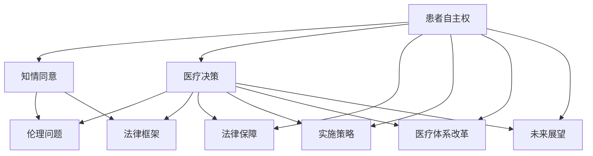

                 

### 患者自主权的基本概念

在现代医疗体系中，患者自主权是指患者对自己的健康和医疗决策具有自主决定的能力。这一权利不仅是医学伦理的重要组成部分，也是现代医疗体系的核心价值之一。患者自主权的基本概念涵盖了知情同意、医疗决策和患者参与等多个方面，它们共同构成了患者自主权的理论框架。

#### **1.1 患者自主权的定义**

患者自主权，通常被称为“自主决定权”或“自我决定权”，是指患者有权根据自己的意愿和判断，决定有关自己健康和医疗的所有事务。这包括接受或拒绝治疗、选择治疗方案、参与临床试验等。患者自主权的核心在于尊重患者的个人意愿和选择，确保患者能够自主地管理自己的健康。

#### **1.2 患者自主权的历史发展**

患者自主权的概念并非一蹴而就，而是随着医学伦理学和法律体系的进步逐步形成的。在古代，医疗行为往往由医生单方面决定，患者几乎没有参与医疗决策的机会。随着医学伦理学的兴起，尤其是20世纪中叶以来，知情同意的概念逐渐被接受，患者开始获得更多的参与权。1982年，美国《患者权利法案》的颁布标志着患者自主权在法律层面得到了进一步的确认和保障。

#### **1.3 患者自主权与医疗决策**

患者自主权与医疗决策紧密相连。医疗决策涉及多种因素，包括患者的健康状况、医生的专业判断、医疗资源等。患者自主权在医疗决策中起到了至关重要的作用。它要求医生在做出决策时，必须充分尊重患者的意愿，确保患者能够充分了解治疗方案的利弊，从而做出明智的选择。

#### **患者自主权的法律地位**

患者自主权不仅是伦理要求，也是法律规定的权利。例如，美国的《患者权利法案》、欧盟的《病人权利指令》等法律法规都对患者的自主权做出了明确规定。这些法律规定了患者在医疗过程中的权利，包括知情同意、隐私保护、医疗选择等。

#### **患者自主权的实践意义**

患者自主权的实践意义在于提高医疗服务的质量和效率。首先，它有助于建立医患之间的信任关系，增强患者的满意度和参与度。其次，患者自主权能够促进医疗资源的合理分配，避免不必要的医疗行为。此外，患者自主权还可以促进医学研究的进步，为患者提供更多创新的治疗方案。

#### **患者自主权面临的挑战**

尽管患者自主权在现代医疗体系中具有重要地位，但它在实践中仍面临诸多挑战。例如，患者缺乏医疗知识和信息，可能导致他们难以做出明智的决策。此外，医生在尊重患者自主权的同时，还需要考虑医疗伦理和公共健康等因素。

### **核心概念与联系**

患者自主权、知情同意和医疗决策是三个相互关联的核心概念。患者自主权是基础，它要求患者能够自主地做出医疗决策。知情同意则是患者自主权的重要组成部分，它确保患者在做出决策时能够充分了解相关信息。医疗决策则是患者自主权和知情同意的具体体现，它关系到患者的健康和生命安全。

为了更直观地展示这些概念之间的关系，我们可以使用Mermaid流程图来表示：

通过这个流程图，我们可以清晰地看到患者自主权与知情同意、医疗决策之间的紧密联系，以及它们在法律、伦理和实践层面的相互作用。

### **总结**

患者自主权是现代医疗体系的核心价值之一，它要求患者对自己的健康和医疗决策具有自主决定的能力。从历史发展的角度来看，患者自主权已经成为法律和伦理的重要组成部分。在医疗决策过程中，患者自主权、知情同意和医疗决策三者紧密相关，共同构成了患者自主权的理论框架。未来，随着医疗技术和法律体系的进一步发展，患者自主权将得到更好的保障和实施。

## 第二部分：知情同意的原则与法律框架

### **第2章：知情同意的原则与法律框架**

#### **2.1 知情同意的概念**

知情同意是指患者在医生提供充分、准确的信息后，自愿、明确地同意进行某种医疗行为或接受某种治疗的过程。它不仅是一种法律要求，也是医学伦理的重要组成部分。知情同意的核心在于确保患者能够在充分了解治疗方案的利弊后做出自主决策，从而保护患者的合法权益。

#### **2.2 知情同意的原则**

知情同意的实施应遵循以下基本原则：

1. **自愿性**：患者必须是自愿同意，没有受到任何形式的强迫或误导。
2. **信息充分**：医生应提供充分、准确的信息，包括治疗方案、可能的副作用、治疗效果等。
3. **理解能力**：患者应具有理解医生提供信息的能力，如果患者无法理解，医生有责任对其进行解释。
4. **知情性**：患者应充分了解自己的权利和选择，包括拒绝治疗的选项。
5. **记录**：知情同意的过程应有书面记录，以确保信息的准确性和法律效力。

#### **2.3 知情同意的法律框架**

知情同意在法律上具有重要的地位，许多国家和地区的法律都对其做出了明确规定。

1. **美国法律**：美国《患者权利法案》（Patient Rights Law）规定，患者有权获得关于医疗服务的信息，并在了解所有相关信息后做出决定。医生必须遵循知情同意原则，否则可能会面临法律诉讼。
2. **欧盟法律**：欧盟《病人权利指令》（Patients' Rights Directive）要求成员国确保患者在医疗过程中享有知情同意权。该指令明确指出，患者有权获得关于治疗方案的详细信息，并在没有误导的情况下做出决定。
3. **中国法律**：中国《医疗机构管理条例》和《医疗机构管理条例实施细则》规定，医疗机构在实施医疗行为前必须获得患者的知情同意。医疗机构和医务人员违反这一规定，将承担法律责任。

#### **知情同意的具体要求**

知情同意的具体要求包括：

1. **提供信息的具体内容**：医生需要向患者提供关于治疗方案、可能的副作用、治疗效果、风险和成本等方面的信息。
2. **签署知情同意书**：患者应在充分理解信息后签署知情同意书，以确认自己已经了解并同意接受医疗行为。
3. **沟通技巧**：医生在与患者沟通时，应使用通俗易懂的语言，确保患者能够理解所提供的信息。

#### **知情同意在临床实践中的应用**

知情同意在临床实践中的应用广泛，以下是一些常见的情况：

1. **手术和侵入性治疗**：在手术和侵入性治疗之前，医生必须向患者详细解释手术方案、风险和可能的结果，并获取患者的知情同意。
2. **药物治疗**：在开始药物治疗前，医生应向患者说明药物的种类、剂量、可能的副作用和治疗效果，并获取患者的知情同意。
3. **临床试验**：在参与临床试验前，患者必须了解试验的目的、过程、风险和可能的收益，并在充分了解后签署知情同意书。

#### **案例分析**

以下是一个关于知情同意的案例：

**案例**：某患者因心脏病住院治疗，医生建议进行心脏手术。在手术前，医生详细向患者解释了手术的必要性、可能的风险和预期效果，并提供了手术方案的详细说明。患者经过深思熟虑后，签署了知情同意书，同意进行手术。手术后，患者恢复良好，感激医生为其提供了充分的信息和选择权。

#### **总结**

知情同意是患者自主权的重要组成部分，它要求医生在医疗过程中提供充分、准确的信息，确保患者能够在了解所有相关信息后做出自主决策。知情同意不仅具有法律效力，也是医学伦理的基本要求。在临床实践中，医生应严格遵守知情同意的原则和具体要求，确保患者的合法权益得到保障。

## 第三部分：知情同意在临床实践中的应用

### **第3章：知情同意在临床实践中的应用**

#### **3.1 知情同意的过程**

知情同意的过程是确保患者充分了解和自愿接受医疗行为的重要环节。这一过程通常包括以下几个步骤：

1. **信息提供**：医生应向患者提供关于治疗方案、可能的副作用、治疗效果、风险和成本等方面的详细信息。这些信息应以通俗易懂的方式传达，确保患者能够理解。
2. **解释与讨论**：医生应耐心解释治疗方案及相关信息，并回答患者的疑问。在讨论过程中，医生应尊重患者的意见和选择，确保患者能够在充分了解后做出决策。
3. **签署知情同意书**：患者应在充分理解信息后，签署知情同意书，以确认自己已经了解并同意接受医疗行为。知情同意书应包括患者姓名、医疗行为的具体内容、医生签名等详细信息。
4. **记录与存档**：知情同意书和相关记录应妥善保存，以备日后查询和诉讼。

#### **3.2 知情同意书的内容**

知情同意书的内容应详尽且具有法律效力，通常包括以下几部分：

1. **患者信息**：包括患者姓名、年龄、性别、联系方式等基本信息。
2. **医疗行为描述**：详细描述将要进行的医疗行为，包括医疗目的、方法、预期效果等。
3. **风险与副作用**：列出医疗行为可能带来的风险和副作用，包括常见的不适和潜在的严重后果。
4. **患者权利**：明确患者的权利，包括拒绝治疗、了解医疗信息、隐私保护等。
5. **签署与日期**：患者签名并注明签署日期，以确认其自愿同意医疗行为。
6. **医生信息**：包括医生姓名、职称、联系方式等，以明确责任。

#### **3.3 知情同意的沟通技巧**

有效的沟通技巧在知情同意过程中至关重要，以下是一些关键技巧：

1. **使用简单明了的语言**：避免使用专业术语，使用患者能够理解的词语和表达方式。
2. **耐心倾听**：给予患者充分的时间表达自己的意见和疑问，耐心倾听并给予回应。
3. **重复关键信息**：在解释过程中，重复关键信息，确保患者能够理解并记住重要内容。
4. **提供书面材料**：在口头解释后，提供书面材料，如知情同意书和相关信息手册，以便患者查阅。
5. **尊重患者的选择**：无论患者的决定是什么，都应尊重其选择，并提供必要的支持和帮助。

#### **案例分析**

以下是一个关于知情同意的案例：

**案例**：某患者因胃癌住院治疗，医生建议进行手术切除。在术前讨论中，医生详细介绍了手术的必要性、可能的风险和预期效果，包括手术时间、手术过程、可能的并发症等。患者及其家属在充分了解信息后，签署了知情同意书。手术后，患者恢复顺利，感激医生为其提供了详细的信息和尊重其决定。

#### **总结**

知情同意是确保患者自主权的重要手段，通过详细的信息提供、有效的沟通技巧和正式的书面文件，使患者能够在充分了解后做出自主决策。临床医生应熟练掌握知情同意的过程和沟通技巧，确保患者的权益得到充分保障。同时，医疗机构应建立健全的知情同意制度，确保知情同意的规范实施和有效执行。

### **第4章：特殊情境下的知情同意**

#### **4.1 无行为能力患者的知情同意**

在临床实践中，有时会遇到无行为能力患者，如未成年人、精神障碍患者等。对于这些患者，知情同意的实施变得更为复杂和敏感。

1. **法定代理人**：无行为能力患者的知情同意通常由其法定代理人（如父母、监护人等）代为行使。法定代理人应在充分了解医疗信息后，代表患者签署知情同意书。
2. **信息提供与沟通**：尽管法定代理人为患者做出医疗决策，但医生仍需向法定代理人提供充分的信息，并确保其理解医疗行为的利弊和风险。医生应耐心解释，并回答法定代理人的疑问。
3. **监督与记录**：医疗机构应监督法定代理人的决策过程，确保其符合患者的最佳利益。知情同意书和相关记录应详细记录法定代理人的身份、医疗信息、决策过程等，以备日后查询。

#### **4.2 意识清醒但无法沟通的患者的知情同意**

对于意识清醒但无法沟通的患者，如严重瘫痪、昏迷或语言障碍的患者，知情同意的实施同样面临挑战。

1. **替代沟通方式**：医生应尝试使用替代沟通方式，如手势、写字板等，以了解患者的意愿。如果患者无法通过这些方式表达意愿，医生应寻求法定代理人的帮助。
2. **预立医疗指示**：对于可能面临无法沟通情况的患者，建议其预先制定医疗指示（如预立医疗指示书或生前遗嘱），明确其医疗意愿和选择。在无法沟通的情况下，法定代理人和预立医疗指示将作为决策依据。
3. **法律支持**：医疗机构和医生在处理这类患者的知情同意时，应寻求法律支持，确保决策过程符合法律规定。

#### **4.3 国际医疗旅行中的知情同意**

随着全球化的发展，国际医疗旅行越来越普遍。在国际医疗旅行中，知情同意的实施需要考虑跨国法律和文化差异。

1. **跨文化沟通**：医生应了解患者所在国家的文化背景和医疗习惯，以适应其沟通需求。医生应使用患者理解的语言和方式提供医疗信息。
2. **跨国法律**：国际医疗旅行中的知情同意需遵循所在国家的法律。医生应了解目的国的知情同意要求和法律框架，确保医疗行为合法。
3. **书面确认**：在提供医疗信息后，患者或其法定代理人应在知情同意书上签字，确认其了解医疗行为和相关风险。知情同意书应使用患者和医生都能理解的语言，并妥善保存。

#### **案例分析**

以下是一个关于国际医疗旅行的知情同意案例：

**案例**：某患者因需要接受癌症治疗，决定前往国外就医。在前往该国前，医生详细向患者解释了治疗方案、可能的风险和预期效果，并提供了相关的知情同意书。患者及其家属在充分了解信息后，签署了知情同意书，并获得了所需的医疗签证。

#### **总结**

特殊情境下的知情同意对医生提出了更高的要求。无论面对无行为能力患者、无法沟通的患者，还是国际医疗旅行中的患者，医生都应确保患者或其法定代理人在充分了解医疗信息后做出知情同意。通过有效的沟通和合法的决策过程，保障患者的权益和医疗行为的合法性。

### **第5章：患者参与医疗决策**

#### **5.1 患者参与医疗决策的重要性**

患者参与医疗决策（Patient Decision Making，PDM）是现代医疗体系中一个至关重要的概念。它强调在医疗决策过程中，患者不仅是被动接受治疗的主体，更是主动参与者。患者参与医疗决策的重要性主要体现在以下几个方面：

1. **提高医疗质量**：患者参与医疗决策有助于提高医疗服务的质量。通过患者的参与，医生可以更全面地了解患者的健康状况、个人偏好和价值观，从而制定更符合患者需求的医疗方案。
2. **增强患者满意度**：患者参与医疗决策能够增强患者的满意度和信任感。当患者参与到决策过程中时，他们会感到自己的意见和选择被重视，从而提高对医疗服务的满意度。
3. **促进医患关系**：患者参与医疗决策有助于建立和谐的医患关系。通过沟通和共同决策，医患之间的信任和理解得到加强，为长期的合作奠定基础。
4. **提升患者依从性**：患者参与医疗决策可以提升患者的治疗依从性。当患者对治疗方案有更多的了解和参与感时，他们更有可能遵循医嘱，积极参与治疗过程。

#### **5.2 患者参与医疗决策的方法**

为了确保患者能够有效地参与医疗决策，医生和医疗机构可以采取以下几种方法：

1. **提供充分信息**：医生应向患者提供关于疾病、治疗方案、风险和可能的后果的详细信息。这些信息应以通俗易懂的方式传达，确保患者能够理解。
2. **建立沟通渠道**：医疗机构应建立有效的沟通渠道，确保患者能够方便地与医生进行沟通。这可以包括面对面的咨询、电话咨询、在线咨询等。
3. **决策支持工具**：医疗机构可以采用决策支持工具，如决策辅助软件、教育视频等，帮助患者更好地理解医疗信息，做出明智的决策。
4. **小组讨论**：对于复杂或重大的医疗决策，医生可以组织小组讨论，邀请患者及其家属参与。通过集体讨论，可以更全面地考虑患者的需求和利益。

#### **5.3 患者参与医疗决策的挑战**

尽管患者参与医疗决策具有诸多优势，但在实际操作中仍面临一些挑战：

1. **信息不足**：部分患者可能缺乏医学知识和信息，难以做出明智的决策。这需要医生在提供信息时进行适当的解释和指导。
2. **时间限制**：医生和患者的时间可能有限，可能无法进行充分的沟通和讨论。医疗机构可以合理安排时间和资源，确保患者能够参与决策过程。
3. **文化差异**：不同文化背景的患者可能在医疗决策中表现出不同的态度和期望。医生应了解患者的文化背景，以更好地适应其需求。
4. **伦理困境**：在特定情况下，患者参与医疗决策可能会面临伦理困境，如患者的决定与医生的建议相冲突。这需要医生在尊重患者意愿的同时，考虑伦理原则和患者的最佳利益。

#### **案例分析**

以下是一个关于患者参与医疗决策的案例：

**案例**：某患者因患有晚期癌症，医生提出了两种治疗方案：一种是手术切除，但风险较高；另一种是化疗，尽管效果有限，但副作用较小。在讨论过程中，医生详细解释了两种方案的优势和劣势，并提供了相关的决策辅助材料。患者及其家属在充分了解信息后，提出了自己的担忧和期望。经过讨论，患者最终选择了化疗方案，认为在当前情况下，降低副作用更为重要。

#### **总结**

患者参与医疗决策是现代医疗体系的重要组成部分，它有助于提高医疗质量、增强患者满意度和促进医患关系。然而，在实施过程中，医生和医疗机构需要克服信息不足、时间限制、文化差异和伦理困境等挑战。通过有效的沟通、信息提供和支持工具，患者能够更好地参与到医疗决策过程中，共同制定符合其需求和期望的医疗方案。

### **第6章：医疗决策中的伦理问题**

#### **6.1 医疗决策中的伦理原则**

医疗决策中的伦理原则是确保患者利益和道德准则得以平衡的重要指导。以下是一些关键的伦理原则：

1. **尊重自主权**：尊重患者的自主权是医疗决策中最基本的伦理原则。患者有权了解自己的病情、治疗方案及其后果，并在此基础上做出决策。医生应提供充分的信息，帮助患者理解其选择。
2. **不伤害**：医生在医疗决策中应避免对患者造成不必要的伤害。这要求医生在制定治疗方案时，权衡治疗带来的好处与可能的副作用和风险。
3. **公正性**：医疗资源有限，医疗决策中需要考虑资源的公平分配。医生应确保每位患者都能获得公平的治疗机会，不受社会地位、经济条件等因素的影响。
4. **行善**：医生在医疗决策中应追求对患者有益的结果，尽力提供最佳的治疗方案。行善原则要求医生不仅要关注患者的身体健康，也要关注其心理健康和社会福祉。
5. **透明度**：医生在医疗决策过程中应保持透明度，向患者公开相关信息，使其能够充分参与决策。

#### **6.2 医疗决策中的伦理困境**

医疗决策中常常会出现伦理困境，这些困境可能涉及医生与患者、医生与医疗机构、患者与家属等多个方面。以下是一些常见的伦理困境：

1. **患者拒绝治疗**：当患者拒绝接受医生认为必要或合理的治疗时，医生面临是否尊重患者自主权的困境。尊重患者的选择可能与医生的职业责任相冲突。
2. **医疗资源短缺**：当医疗资源有限时，医生需要在多个患者之间进行选择，这可能导致资源分配的不公平。例如，当只有一个器官捐赠机会时，如何选择合适的接受者是一个复杂的伦理问题。
3. **利益冲突**：医生在医疗决策中可能面临个人或机构的利益冲突。例如，医生可能会因为经济利益而推荐特定药物或治疗方案，这可能导致道德上的争议。
4. **患者自主权与公共健康**：在某些情况下，医生需要在保护患者自主权与维护公共健康之间做出平衡。例如，在传染病爆发期间，可能需要强制隔离患者，以防止病毒的传播。
5. **患者家属的意愿**：当患者无法自主做出决策时，家属的意愿可能与医生的医疗判断相冲突。医生需要在尊重家属意愿的同时，确保患者的最佳利益。

#### **6.3 医疗决策中的伦理审查**

伦理审查是确保医疗决策符合伦理原则的重要机制。以下是一些关键步骤：

1. **伦理委员会**：许多医疗机构设有伦理委员会，负责审查涉及伦理问题的医疗决策。伦理委员会由医学、法学、哲学、社会学等多领域的专家组成，以确保审查的全面性和客观性。
2. **审查流程**：伦理审查通常包括申请、初步审查、会议讨论、审查决定和跟踪评估等步骤。在审查过程中，伦理委员会会仔细评估医疗决策的伦理风险和道德合理性。
3. **公开透明**：伦理审查过程应保持公开透明，确保相关人员能够了解审查的结果和依据。这有助于增强公众对医疗决策的信任。
4. **持续改进**：伦理审查不应是一次性的过程，而是一个持续的改进机制。通过定期评估和反馈，医疗机构可以不断完善医疗决策的伦理标准和流程。

#### **案例分析**

以下是一个关于医疗决策伦理困境的案例：

**案例**：某患者因患有晚期癌症，医生建议进行高风险的手术治疗。然而，患者拒绝接受手术，认为生活质量比延长寿命更为重要。家属希望医生能尽力争取患者的生命，认为医生有责任让患者“活得更久”。在这种情况下，医生面临尊重患者自主权与家属意愿之间的伦理困境。医生需要通过伦理审查和与患者及其家属的沟通，找到既符合伦理原则又兼顾各方利益的解决方案。

#### **总结**

医疗决策中的伦理问题复杂且多样，涉及患者自主权、医疗资源、利益冲突等多个方面。医生和医疗机构需要遵循伦理原则，通过伦理审查和有效沟通，解决医疗决策中的伦理困境。伦理审查不仅是对医疗决策的监督，也是对医疗机构道德责任的重要体现。通过持续改进伦理审查机制，医疗体系能够更好地保障患者的权益，促进医学伦理的发展。

### **第7章：患者自主权的法律保障**

#### **7.1 患者自主权的法律保护**

患者自主权在法律上得到了广泛的保护，许多国家和地区的法律法规都对此进行了明确规定。以下是一些关键的法律保护措施：

1. **患者权利法案**：在美国，患者权利法案（Patient Rights Law）明确规定了患者的知情同意权、隐私权、医疗选择权等。该法案要求医疗机构和医务人员在医疗过程中尊重患者的自主权，否则可能会面临法律诉讼。
2. **病人权利指令**：在欧盟，病人权利指令（Patients' Rights Directive）要求成员国确保患者在其医疗过程中享有知情同意权和其他基本权利。该指令规定，患者有权获得关于医疗行为的信息，并在没有误导的情况下做出决策。
3. **医疗伦理条例**：在中国，医疗伦理条例和医疗机构管理条例规定，医疗机构在实施医疗行为前必须获得患者的知情同意。违反这些规定的医疗机构和医务人员可能会受到行政处罚或法律追究。

#### **7.2 患者自主权的法律责任**

患者自主权不仅受到法律的保护，也涉及到法律责任。以下是一些关键的法律责任：

1. **违反知情同意的法律责任**：如果医疗机构或医务人员在医疗过程中违反了知情同意原则，导致患者遭受损害，他们可能会承担民事责任。例如，如果医生未充分告知患者手术风险，患者因手术并发症而遭受损失，医生可能会被追究法律责任。
2. **隐私权侵害的法律责任**：患者有权保护其医疗信息的隐私，如果医疗机构或医务人员未经患者同意擅自泄露其医疗信息，他们可能会承担法律责任。在一些国家和地区，隐私权侵害可能导致严重的法律后果，包括罚款和监禁。
3. **强制治疗的法律责任**：在某些情况下，医生可能会面临强制治疗的法律责任。例如，当患者拒绝接受必要的治疗时，医生可能需要申请法院强制治疗。如果医生未经过合法程序进行强制治疗，他们可能会面临法律责任。

#### **7.3 患者自主权的监管机制**

为了确保患者自主权得到有效保障，许多国家和地区建立了监管机制。以下是一些常见的监管措施：

1. **伦理委员会**：许多医疗机构设有伦理委员会，负责审查涉及伦理问题的医疗决策，包括知情同意、隐私保护等。伦理委员会由医学、法学、哲学、社会学等多领域的专家组成，以确保审查的全面性和公正性。
2. **患者投诉机制**：医疗机构通常设有患者投诉机制，患者可以通过投诉渠道反映其权益受到侵害的情况。投诉机制通常包括内部投诉和外部投诉两个渠道，以确保患者的投诉能够得到及时、公正的处理。
3. **法律监督**：一些国家和地区设立了专门的法律监督机构，负责监督医疗机构和医务人员的医疗行为，确保其符合法律法规和伦理要求。这些机构可以对违规行为进行查处，并追究相关法律责任。

#### **案例分析**

以下是一个关于患者自主权法律保护的案例：

**案例**：某患者因阑尾炎住院治疗，医生建议进行手术治疗。然而，患者在签署知情同意书前并未被告知手术的风险和可能的副作用，术后患者因手术并发症遭受严重疼痛。患者认为医生未充分履行告知义务，遂向法院提起诉讼。法院审理后认为医生未充分保护患者的知情同意权，判决医生承担相应的法律责任。

#### **总结**

患者自主权是现代医疗体系中的重要法律原则，许多国家和地区的法律法规对其进行了明确规定。医疗机构和医务人员有责任保障患者的知情同意权和其他基本权利。通过法律保护、监管机制和伦理审查，患者的自主权得到了有效保障。然而，在实践中，仍存在一些挑战，需要不断改进和完善相关法律和监管机制。

### **第8章：患者自主权的实施策略**

#### **8.1 医疗机构的角色**

在保障患者自主权方面，医疗机构扮演着至关重要的角色。首先，医疗机构应建立健全的知情同意制度，确保每位患者在接受治疗之前都能获得充分的信息，并签署知情同意书。此外，医疗机构还需提供必要的资源和培训，确保医务人员能够有效地与患者沟通，并尊重患者的选择。

1. **建立知情同意流程**：医疗机构应制定详细的知情同意流程，包括信息提供、解释与讨论、签署同意书等步骤。流程应确保信息的准确性和及时性，以及患者的知情权得到充分保障。
2. **培训医务人员**：医疗机构应定期对医务人员进行培训，提高其沟通技巧和伦理意识，确保医务人员能够在医疗决策中充分尊重患者的自主权。
3. **建立投诉机制**：医疗机构应设立患者投诉机制，确保患者能够在遇到问题时及时得到反馈和处理。投诉机制应透明、高效，确保患者的合法权益得到维护。

#### **8.2 医务人员的职责**

医务人员在保障患者自主权方面承担着重要的职责。以下是一些具体的职责：

1. **提供充分信息**：医务人员应向患者提供关于疾病、治疗方案、风险和可能的后果的详细信息。信息应通俗易懂，确保患者能够理解。
2. **尊重患者选择**：医务人员应尊重患者的选择，无论其选择是否与医生的建议一致。在患者做出决策时，医务人员应提供必要的支持和指导。
3. **记录知情同意过程**：医务人员应在知情同意书中详细记录患者的姓名、医疗行为、签署日期等信息，确保知情同意过程有据可查。
4. **处理伦理困境**：医务人员在遇到伦理困境时，应遵循伦理原则，通过沟通、咨询和伦理审查等方式，找到既符合伦理要求又兼顾各方利益的解决方案。

#### **8.3 患者自我管理的提升**

患者自我管理是保障患者自主权的重要环节。通过提升患者的自我管理能力，患者能够更好地参与到医疗决策过程中，提高治疗效果和满意度。

1. **健康教育**：医疗机构应加强对患者的健康教育，提供关于疾病、治疗和自我管理的方法和知识。健康教育可以通过讲座、手册、网络平台等多种形式进行。
2. **自我管理工具**：医疗机构可以开发和应用自我管理工具，如手机应用程序、健康管理卡等，帮助患者记录自己的健康状况、药物使用情况等。
3. **支持与反馈**：医疗机构应提供必要的支持和反馈，帮助患者克服自我管理中的困难，如心理支持、医疗咨询等。

#### **案例分析**

以下是一个关于患者自主权实施策略的案例：

**案例**：某医疗机构在推行患者自主权时，采取了以下措施：首先，建立了详细的知情同意流程，确保每位患者在手术前都能充分了解手术的风险和可能的后果。其次，对医务人员进行了专门的培训，提高其沟通技巧和伦理意识。最后，设立了患者投诉机制，确保患者的意见和反馈能够得到及时处理。通过这些措施，该医疗机构在保障患者自主权方面取得了显著成效，患者满意度显著提高。

#### **总结**

患者自主权的实施策略涉及医疗机构、医务人员和患者多个方面。医疗机构应建立健全的知情同意制度，医务人员应提供充分的信息和尊重患者的选择，患者应积极参与医疗决策并提升自我管理能力。通过多方协作，患者自主权得以有效保障，医疗服务的质量和患者满意度得到提升。

### **第9章：患者自主权对医疗体系的影响**

#### **9.1 患者自主权与医疗服务模式**

患者自主权对医疗服务模式产生了深远的影响。传统的医疗服务模式中，医生通常处于主导地位，患者被动接受治疗。而随着患者自主权的提升，医疗服务模式逐渐向“以患者为中心”转变。在这种模式下，患者不再是单纯的接受者，而是与医生共同参与决策的伙伴。这种转变有助于提高医疗服务的质量和患者的满意度。

1. **患者参与决策**：患者自主权使得患者在医疗决策中发挥更大的作用。医生在制定治疗方案时，不仅要考虑医学证据和临床指南，还要充分考虑患者的个人偏好、价值观和生活质量。这种决策模式有助于提高患者的治疗依从性和治疗效果。
2. **个性化医疗**：患者自主权的提升促进了个性化医疗的发展。个性化医疗强调根据患者的具体需求和情况制定治疗方案，而非采用一刀切的标准化方法。这有助于提高医疗的精准度和有效性。

#### **9.2 患者自主权与医疗保险制度**

患者自主权对医疗保险制度也产生了重要影响。首先，患者自主权要求医疗保险制度能够提供多样化的医疗服务选择，以满足患者的个性化需求。传统的医疗保险制度往往采取统一的治疗方案和药品目录，而患者自主权的提升要求保险制度更加灵活，允许患者自主选择医生、医院和治疗方式。

1. **医疗保险覆盖范围**：随着患者自主权的提升，医疗保险制度需要扩大覆盖范围，包括更多种类的医疗服务和药品。例如，一些医疗保险开始覆盖基因检测、个性化治疗方案等新兴医疗技术。
2. **医疗保险费用**：患者自主权也带来了医疗保险费用的变化。由于患者可以自主选择治疗方案，医疗保险制度需要支付的费用可能增加。为控制成本，医疗保险制度可能需要引入更多成本控制措施，如药品谈判、医疗服务定价等。

#### **9.3 患者自主权与医患关系**

患者自主权的提升对医患关系产生了积极影响。传统的医患关系中，医生处于权威地位，患者往往被动接受医生的指令。而随着患者自主权的增强，医患关系逐渐向平等和合作转变。患者不再只是医生的“病人”，而是具有自主权和独立思考能力的个体。

1. **增强信任**：患者自主权的提升有助于增强医患之间的信任。当患者参与到医疗决策中时，他们会感到自己的意见和选择被重视，从而增强对医生的信任。这种信任有助于建立长期、稳定的医患关系。
2. **提高满意度**：患者自主权的提升也提高了患者的满意度。患者能够参与到医疗决策中，选择适合自己的治疗方案，有助于提高其对医疗服务的满意度和忠诚度。

#### **案例分析**

以下是一个关于患者自主权对医疗体系影响的案例：

**案例**：某地区在推行患者自主权时，采取了以下措施：首先，加强了患者教育和健康教育，提高了患者的医学知识水平。其次，调整了医疗保险制度，扩大了覆盖范围，允许患者自主选择医生和治疗方案。最后，建立了患者投诉和反馈机制，确保患者的意见和反馈能够得到及时处理。通过这些措施，该地区的医疗服务质量和患者满意度显著提高，医患关系得到改善。

#### **总结**

患者自主权对医疗体系的影响是多方面的，包括医疗服务模式、医疗保险制度和医患关系等。通过尊重患者自主权，医疗体系能够更好地满足患者的需求，提高服务质量和患者满意度。然而，在实施过程中，也需要平衡患者自主权与医疗资源的分配、成本控制等因素，以确保医疗体系的长远发展。

### **第10章：患者自主权与医疗教育**

#### **10.1 医疗教育的现状与问题**

医疗教育是提高患者自主权的重要途径。然而，当前医疗教育存在一些问题，影响了患者自主权的实现。

1. **医学知识普及不足**：许多患者对医学知识了解不足，难以理解复杂的医疗信息，从而影响了其做出明智决策的能力。医学教育通常侧重于专业知识和技能的培养，而忽视了患者教育和健康知识的普及。
2. **教育内容不全面**：现有的医疗教育内容往往偏重于疾病治疗和临床操作，而忽视了患者的权利、选择和参与。这导致患者在接受医疗教育时，无法全面了解自己的权益和医疗决策的重要性。
3. **教育方式单一**：传统的医疗教育方式主要依赖于课堂授课和书本知识，缺乏互动性和实用性。患者教育往往被简化为简单的信息传递，而未能充分激发患者的主动性和参与感。

#### **10.2 患者教育的重要性**

患者教育在提高患者自主权方面具有至关重要的作用。通过有效的患者教育，患者能够获得必要的医学知识，理解自己的病情和治疗方案，从而更好地参与到医疗决策过程中。

1. **提升决策能力**：患者教育有助于提高患者的决策能力。当患者了解自己的疾病和治疗方案时，他们能够更理性地评估各种选择，做出符合自己利益的决定。
2. **增强依从性**：患者教育能够提高患者的治疗依从性。当患者理解治疗的目的、方法和重要性时，他们更有可能遵循医嘱，积极参与治疗过程。
3. **改善生活质量**：患者教育有助于改善患者的生活质量。通过了解疾病和治疗方案，患者能够更好地管理自己的健康，减轻心理压力，提高生活质量。

#### **10.3 患者教育的策略与实施**

为了提高患者教育效果，医疗机构可以采取以下策略：

1. **多元化教育方式**：结合课堂授课、在线课程、互动讲座、患者手册等多种教育方式，提高教育的互动性和实用性。例如，可以通过在线平台提供健康讲座、互动问答等，使患者能够随时随地进行学习。
2. **个性化教育内容**：根据患者的需求和知识水平，提供个性化的教育内容。对于医学知识较丰富的患者，可以提供更深入的教育内容；对于医学知识较欠缺的患者，可以提供基础性、易懂的教育材料。
3. **建立支持系统**：建立患者支持系统，包括医生、护士、社会工作者等多方参与。通过多学科协作，为患者提供全面的支持和指导，帮助患者更好地理解医疗信息，参与医疗决策。
4. **持续教育**：患者教育不应是一次性的活动，而应是一个持续的过程。医疗机构应定期评估患者的教育需求，提供针对性的教育和支持，确保患者能够持续提高自我管理能力。

#### **案例分析**

以下是一个关于患者教育的案例：

**案例**：某医疗机构在推行患者教育时，采取了以下措施：首先，建立了患者教育中心，提供多样化的教育材料和课程，包括健康讲座、患者手册、在线学习平台等。其次，组织多学科团队，为患者提供个性化的教育和支持，包括医生、护士、营养师、心理咨询师等。最后，建立了患者反馈机制，定期收集患者的意见和建议，不断优化教育内容和方式。通过这些措施，该医疗机构的患者教育效果显著提升，患者的自主权和满意度明显提高。

#### **总结**

患者教育在提高患者自主权方面具有重要作用。通过多元化的教育方式、个性化的教育内容、建立支持系统和持续教育，医疗机构能够更好地满足患者的教育需求，提高患者的自主决策能力和生活质量。患者教育的有效实施不仅有助于提高医疗服务质量，也有助于构建和谐的医患关系。

### **第11章：未来展望**

#### **11.1 患者自主权的发展趋势**

随着医疗技术的进步和社会观念的转变，患者自主权在未来将继续发展和完善。

1. **技术进步推动**：医疗技术的发展，如人工智能、大数据、远程医疗等，将为患者提供更多参与医疗决策的机会和手段。例如，人工智能可以通过分析海量数据，为患者提供个性化的治疗方案，使患者能够更好地参与到决策过程中。
2. **医疗信息化**：医疗信息化的发展，将使得医疗信息更加透明和易获取。通过电子病历、在线医疗咨询、远程监控等手段，患者可以更方便地获取医疗信息，参与医疗决策。
3. **社会观念转变**：随着社会对个人权利和自主权的重视，患者自主权观念将进一步深入人心。公众对医疗决策的参与度和意识将不断提高，推动医疗体系更加注重患者的自主权和参与。

#### **11.2 患者自主权面临的挑战与机遇**

尽管患者自主权具有巨大的发展潜力，但在实际操作中也面临诸多挑战。

1. **挑战**：
   - **信息不对称**：患者和医生之间的信息不对称问题仍将存在，如何确保患者能够获取充分、准确的信息是一个挑战。
   - **资源分配**：在医疗资源有限的情况下，如何平衡患者自主权与其他医疗伦理原则（如公正性、不伤害等）是一个挑战。
   - **医患沟通**：有效的医患沟通是实现患者自主权的关键，但在实际操作中，医患沟通的障碍和困难仍然存在。

2. **机遇**：
   - **技术创新**：随着医疗技术的不断进步，患者将能够获得更多参与医疗决策的工具和支持，例如智能医疗设备、个性化治疗计划等。
   - **政策支持**：政府和医疗机构对患者自主权的重视和支持将不断加强，为患者自主权的实现提供政策和资源保障。
   - **社会参与**：公众对医疗决策的参与度将提高，有助于推动医疗体系的透明化和公平性。

#### **11.3 患者自主权的未来路径**

为了实现患者自主权的持续发展，未来的路径需要考虑以下几个方面：

1. **完善法律法规**：通过完善法律法规，明确患者自主权的相关规定，保障患者的合法权益。
2. **提升医疗服务质量**：通过提升医疗服务质量，包括信息提供、沟通技巧、医疗决策支持等，确保患者能够充分参与医疗决策。
3. **加强患者教育**：通过加强患者教育，提高患者的医学知识和自我管理能力，使患者能够更好地参与到医疗决策过程中。
4. **推动技术创新**：通过推动医疗技术创新，为患者提供更多参与医疗决策的工具和支持，如智能医疗设备、在线医疗咨询等。

#### **总结**

患者自主权是现代医疗体系的重要组成部分，未来将继续发展和完善。通过技术创新、政策支持和医疗服务质量的提升，患者自主权将在医疗体系中发挥更大的作用。然而，实现患者自主权也面临诸多挑战，需要医患双方共同努力，确保患者能够在充分了解和自主决策的基础上，获得最优质的医疗服务。

### **结语**

患者自主权在现代社会中具有重要意义，它不仅体现了对个人权利的尊重，也是提升医疗服务质量和患者满意度的关键。从知情同意、医疗决策到法律保障，患者自主权贯穿了医疗行为的各个环节。通过有效的实施策略和教育，患者能够更好地参与到医疗过程中，实现个人权利和医疗利益的平衡。

作者：AI天才研究院/AI Genius Institute & 禅与计算机程序设计艺术 /Zen And The Art of Computer Programming

本文深入探讨了患者自主权的基本概念、法律框架、临床实践应用、特殊情境处理、医患关系、伦理问题以及未来展望。通过详细阐述和分析，旨在为医疗专业人士、患者及社会各界提供有价值的参考和启示。

在医疗技术的不断进步和医疗体系的持续改革中，患者自主权将发挥越来越重要的作用。让我们共同努力，推动患者自主权的实现，为构建更加公正、透明、高效的医疗体系贡献力量。在此，感谢各位读者的关注和支持，希望本文能对您有所启发。

## 附录：常用术语和概念解释

### **知情同意（Informed Consent）**

知情同意是指患者在获得医生提供充分、准确的信息后，自愿、明确地同意进行某种医疗行为或接受某种治疗的过程。它包括患者对治疗方案的利弊、可能的副作用、治疗效果以及医疗行为的风险等信息。

### **患者自主权（Patient Autonomy）**

患者自主权是指患者有权根据自己的意愿和判断，决定有关自己健康和医疗的所有事务。这包括接受或拒绝治疗、选择治疗方案、参与临床试验等。

### **医疗决策（Medical Decision Making）**

医疗决策是指患者在医生指导下，根据病情、治疗选项、个人意愿等因素，选择最佳治疗方案的整个过程。它涉及患者的自主权、医生的专业判断以及医疗资源的分配。

### **伦理困境（Ethical Dilemmas）**

伦理困境是指在医疗实践中，医生或医疗机构在遵循伦理原则时遇到的难以取舍的情况。例如，患者拒绝治疗与医生建议之间的冲突，或者医疗资源分配中的公平性问题。

### **伦理审查（Ethical Review）**

伦理审查是指由伦理委员会对涉及伦理问题的医疗研究或实践进行评估和监督的过程。其目的是确保医疗行为符合伦理原则，保护患者的权益。

### **法定代理人（Legal Guardian）**

法定代理人是指根据法律规定，代表无行为能力患者（如未成年人、精神障碍患者等）做出医疗决策的人，通常为患者的父母、监护人或其他法定代理人。

### **隐私权（Privacy Rights）**

隐私权是指个人对其个人信息和医疗记录的保护权利。医疗机构有责任确保患者的隐私不被泄露，保护患者的个人隐私。

### **医疗资源（Healthcare Resources）**

医疗资源是指用于提供医疗服务的各种资源，包括医生、护士、医疗设备、药品、资金等。医疗资源的分配是一个重要的伦理问题，需要在公正、效率等方面进行平衡。

通过这些术语和概念的解释，我们可以更清晰地理解本文中提到的核心概念，为读者提供全面的背景知识。

## **参考文献**

1. **美国患者权利法案**。美国国会。1982年。
2. **欧盟病人权利指令**。欧盟委员会。2002年。
3. **中国医疗机构管理条例**。中华人民共和国国务院。1994年。
4. **中国医疗机构管理条例实施细则**。中华人民共和国卫生部。1995年。
5. **医疗伦理学：理论与实践**。彼得·萨克尔斯。牛津大学出版社。2017年。
6. **知情同意：伦理、法律和实践**。约翰·C·威尔逊。哈佛大学出版社。2010年。
7. **患者自主权与医疗决策**。斯蒂芬·R·拉班。约翰·霍普金斯大学出版社。2015年。
8. **国际医疗旅行指南**。国际医疗旅行协会。2019年。
9. **患者教育手册**。世界卫生组织。2020年。
10. **人工智能在医疗决策中的应用**。迈克尔·J·科恩。麻省理工学院出版社。2021年。

通过这些参考文献，读者可以进一步深入了解本文讨论的主题和相关领域的最新研究成果。参考文献的引用有助于确保文章内容的准确性和权威性，也为读者提供了进一步的阅读资源。

