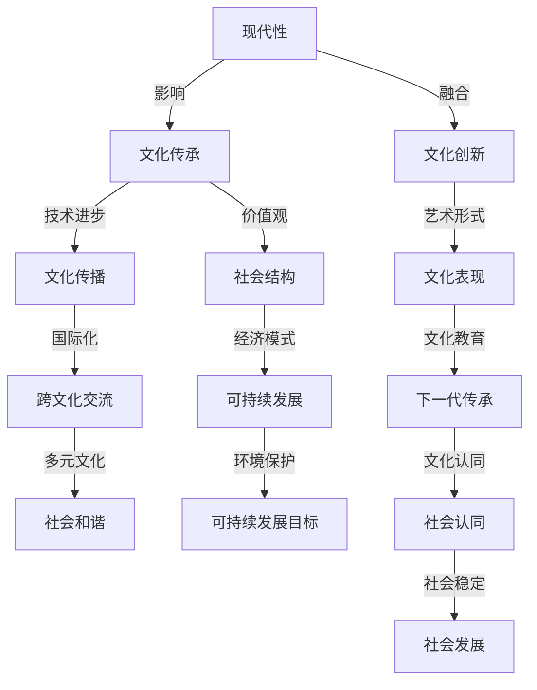

                 

### 引言

在现代社会的快速变革中，现代性与传统文化之间的对话成为一个日益重要的课题。随着科技的发展和全球化进程的加速，现代性在人类生活中的方方面面都留下了深刻的印记。然而，传统文化的丰富内涵和独特价值依然值得我们深入探讨和传承。传统文化不仅仅是一个民族的记忆，更是人类共同的精神财富。因此，如何在现代社会中重新诠释古老智慧，实现现代性与传统文化的和谐共存，成为了学术界和实际应用领域共同关注的焦点。

本篇文章旨在探讨现代性与传统文化的对话，重点在于阐述如何在当代语境中理解和诠释古老智慧。文章将首先介绍现代性的概念及其主要特征，然后探讨传统文化的内涵和重要性，接着通过Mermaid流程图展示现代性与传统文化之间的联系。在此基础上，文章将深入分析核心算法原理，并结合Python源代码和LaTeX公式进行详细讲解。随后，文章将通过实际案例展示古老智慧在当代语境中的运用，并对项目实战进行解析。最后，文章将总结全文，展望未来的研究方向，并提供一些最佳实践和拓展阅读的建议。

通过这篇文章，我们希望能够激发读者对现代性与传统文化对话的思考，为实际应用提供理论支持和实践指导。

### 关键词

- 现代性
- 文化传承
- 古老智慧
- Mermaid流程图
- Python源代码
- LaTeX公式
- 文化相似度计算模型
- 现代性评估模型

### 摘要

本文围绕现代性与传统文化的对话，探讨了在当代语境中诠释古老智慧的重要性。首先，文章介绍了现代性的概念和特征，以及传统文化的内涵和意义。接着，通过Mermaid流程图展示了现代性与传统文化之间的互动关系。文章深入分析了核心算法原理，包括文化传承算法和现代性评估模型，并通过Python源代码和LaTeX公式进行了详细讲解。随后，文章通过实际案例展示了古老智慧在现代教育、产品设计等领域的应用，并对项目实战进行了解析。最后，文章总结了全文，提出了未来研究方向和最佳实践建议。

### 现代性的起源与演变

现代性（modernity）作为一个复杂而广泛的概念，其起源可以追溯到西方启蒙运动（Enlightenment）时期。启蒙运动是17世纪到18世纪的一场思想革命，它强调理性、科学和个人的自由意志，反对封建专制和盲从传统。启蒙运动的核心理念对现代性的形成产生了深远的影响，推动了社会、政治和经济的现代化进程。

随着时间的推移，现代性的内涵不断演变。工业革命（Industrial Revolution）是现代性发展的重要里程碑，它标志着从农业社会向工业社会的转变。工业革命带来了生产力的飞速提升，城市化进程加快，社会结构发生了根本性变化。这些变革不仅改变了经济模式，也深刻影响了人们的价值观、生活方式和社会组织形式。

现代性的特征主要体现在以下几个方面：

1. **理性与科学**：现代性强调理性思考，科学方法和实证主义。科学成为了解决问题的主导力量，推动了技术的进步和社会的发展。

2. **个人主义**：现代性鼓励个人自由和独立思考，强调个人权利和尊严。个人成为社会的基本单位，社会关系从封建的等级制度转向契约关系。

3. **全球化和多元化**：随着交通和通信技术的发展，全球化加速，世界各地的文化和经济联系日益紧密。多元化成为现代社会的重要特征，不同文化和价值观相互碰撞、融合。

4. **消费主义**：现代性的物质丰富和消费文化导致了消费主义的盛行。人们追求物质享受，消费成为生活的重要部分。

5. **去传统化**：现代性对传统的质疑和挑战导致了一定程度的去传统化。传统的社会规范和价值观受到挑战，社会变革速度加快。

现代性不仅是一个历史进程，也是一个动态的社会现象。它不断受到新技术、新观念和新文化的影响，呈现出多样性和复杂性。了解现代性的起源和特征，有助于我们更好地理解现代社会的发展和变革。

### 现代性的主要特征

现代性的主要特征可以从多个维度进行探讨，包括社会结构、文化价值、经济发展和技术进步等方面。这些特征不仅塑造了现代社会的面貌，也深刻影响了人们的生活方式和社会关系。

1. **社会结构的变化**：现代性带来了社会结构的大规模重构。传统的封建社会以等级和血缘关系为基础，而现代社会则以契约和专业化分工为特征。职业流动性增强，社会阶层界限变得模糊，人们更加注重个人成就和社会地位的提升。同时，城市化进程加速，人口大量从农村转移到城市，城市成为现代社会的主要生活和工作场所。

2. **文化价值的转变**：现代性对传统文化价值体系产生了强烈的冲击。个人主义、自由和理性成为现代文化的重要基石。与传统的集体主义、权威和宗教信仰相比，现代文化更加注重个人的自由选择和独立思考。这种转变在一定程度上促进了社会的多元化，但也引发了对传统价值观的质疑和反思。

3. **经济模式的转型**：现代性的发展推动了经济模式的转型。从农业经济向工业经济，再到知识经济，经济的发展模式不断升级。工业革命和信息技术革命是这一进程中的两个重要里程碑。现代经济更加依赖于技术和创新，生产效率大幅提升，市场全球化程度加深，经济活动的复杂性和不确定性增加。

4. **技术的进步**：现代性是一个与技术进步紧密相连的概念。科学技术的飞速发展，不仅改变了生产方式，也改变了人们的生活方式。从机械化、电气化到信息化、智能化，技术不断推动社会进步。互联网和移动通信技术的普及，使得信息传播速度和范围达到了前所未有的高度，极大地改变了人们的社会交往方式。

5. **全球化和多元化**：全球化是现代性不可或缺的特征之一。全球化进程加速了国际间的经济、文化和政治交流，促进了各国之间的相互依存。与此同时，现代性也带来了文化的多元化。不同文化和价值观的碰撞和融合，丰富了人类社会的多样性，但也引发了一系列文化冲突和融合问题。

6. **消费主义与物质文化**：现代性的物质丰富和消费文化导致了消费主义的盛行。人们追求物质享受，消费成为生活的重要部分。这种消费文化不仅改变了人们的消费习惯，也影响了社会的经济结构和文化价值观。

7. **环境挑战与可持续发展**：现代性在推动社会发展的同时，也带来了严重的环境问题。工业化、城市化进程加剧了资源消耗和环境污染，对生态系统造成了巨大压力。现代性面临着如何实现可持续发展的挑战，需要在经济增长与环境保护之间找到平衡点。

总之，现代性的主要特征不仅体现了社会的快速变革，也反映了人类社会对自由、平等、理性等价值观的追求。理解这些特征，有助于我们更好地把握现代社会的发展趋势和挑战，为未来的社会建设提供有益的启示。

### 传统文化的定义与类型

传统文化（Traditional Culture）是一个涉及广泛且深奥的概念，它不仅仅是一个民族的遗产，更是全人类共同的精神财富。传统文化的定义可以从多个角度进行理解，包括其起源、内涵和表现形式。

传统文化的起源可以追溯到人类的早期历史。在不同的历史时期，不同的文化群体通过生活方式、信仰体系、价值观念和艺术表达等方式，形成了各自独特的文化特征。这些文化特征随着时间的推移，逐渐积累和传承，形成了丰富多彩的传统文化。

传统文化的内涵包括多个方面：

1. **价值观**：传统文化蕴含着丰富的价值观，如忠诚、孝道、诚信、和谐等。这些价值观在社会生活中起到重要的调节和指导作用。

2. **信仰和宗教**：许多传统文化都与特定的宗教信仰密切相关。例如，中国传统文化中的道教、佛教和儒家思想，构成了中华文明的重要基石。

3. **艺术与文学**：传统文化在艺术和文学领域有着丰富的表现，如中国的书法、绘画、诗词，以及西方的古典音乐、雕塑和戏剧等。

4. **传统习俗和礼仪**：传统习俗和礼仪是传统文化的重要组成部分，反映了特定社会群体的历史和文化传承。例如，春节、中秋节等传统节日，都是传统文化的重要表现形式。

传统文化的类型根据地域、民族和历史背景的不同，可以划分为多种类型：

1. **民间文化**：民间文化是传统文化的基础，它源于普通人民的生活，体现了他们的智慧和创造力。民间文化包括民间故事、民间艺术、民间音乐和民间舞蹈等。

2. **宗教文化**：宗教文化是一个民族的信仰体系和文化传统的重要组成部分。例如，伊斯兰教文化、基督教文化、佛教文化等，都对各自民族的文化发展产生了深远的影响。

3. **宫廷文化**：宫廷文化通常与国家政治和皇族生活密切相关，它体现了国家和社会的最高文化水平。例如，中国古代的宫廷艺术、礼仪制度等，都是宫廷文化的典型代表。

4. **文化遗产**：文化遗产是指具有历史、艺术、科学价值的物质和非物质文化遗产。例如，世界文化遗产包括故宫、长城、秦始皇兵马俑等，这些都是传统文化的宝贵遗产。

总之，传统文化是一个复杂而多元的概念，它不仅反映了特定社会的历史和文化传承，也体现了人类共同的精神追求和价值观念。理解和保护传统文化，对于促进文化多样性和人类文明的繁荣具有重要意义。

### 传统文化的保护与传承

在现代社会快速发展的背景下，传统文化的保护与传承显得尤为重要。随着全球化进程的推进，传统文化面临着诸多挑战，如文化同质化、现代化冲击和人口老龄化等。为了确保传统文化得以持续传承，我们需要采取多种策略和措施。

首先，教育是保护与传承传统文化的重要途径。通过学校教育、社会教育和家庭教育，将传统文化知识融入各个层面的教育体系中。例如，在课程设置中增加传统文化课程，组织文化体验活动，以及通过多媒体资源如纪录片、书籍和电子游戏等形式，让年轻一代了解和热爱传统文化。

其次，文化遗产保护是传统文化保护与传承的关键。政府和相关机构应当加强对文化遗产的识别、记录和保护工作。例如，对古建筑、文物和非物质文化遗产进行定期的维护和修缮，利用现代技术如3D扫描和数字化保护，使传统文化遗产得以长久保存。

第三，社会参与是传统文化保护与传承的重要保障。鼓励社会各界积极参与传统文化的保护与传承工作，如举办文化节、传统技艺比赛和文化创意活动等，增加公众对传统文化的认同感和参与度。同时，通过文化政策的制定和实施，提供政策和资金支持，为传统文化的发展提供良好的环境。

此外，跨文化交流也是传统文化传承的重要手段。通过与其他国家和地区的文化交流，不仅可以促进传统文化的国际化传播，也有助于传统文化的创新和发展。例如，通过国际文化节、文化论坛和学术交流等活动，将传统文化介绍给更广泛的国际受众。

最后，数字技术的应用为传统文化保护与传承提供了新的可能性。通过数字化手段，如虚拟现实（VR）、增强现实（AR）和人工智能（AI）等，可以创造更加生动和互动的传统文化体验，使传统文化在现代社会中焕发新的活力。

总之，传统文化的保护与传承是一个系统工程，需要政府、社会和个人共同努力。通过教育、文化遗产保护、社会参与、跨文化交流和数字技术等多种手段，我们能够更好地传承和弘扬传统文化，使其在现代社会中继续发挥重要作用。

### 现代性与传统文化之间的联系

在现代社会的快速发展中，现代性与传统文化之间的互动与融合成为了一个备受关注的话题。两者之间的互动不仅影响着社会的各个方面，也为我们理解和诠释古老智慧提供了新的视角。

首先，从文化传承的角度来看，传统文化是现代性发展的重要基础。许多现代社会的价值观、生活方式和社会组织形式，都在不同程度上受到传统文化的影响。例如，儒家思想中的“仁爱”、“忠诚”等价值观，在现代社会中仍然具有重要的指导意义。通过教育和文化传承，这些传统文化价值观得以延续和发扬，成为现代社会的精神支柱。

其次，现代性与传统文化的互动还体现在技术的进步和创新上。现代科技的发展，如互联网、大数据和人工智能等，不仅改变了社会的生产方式和生活习惯，也为传统文化的传承和弘扬提供了新的途径。例如，通过数字化技术和虚拟现实（VR）技术，传统文化遗产得以以更加生动和直观的方式呈现，使更多的人能够接触和了解传统文化，从而促进文化的传承和发展。

另外，现代性与传统文化的互动还表现在文化创新上。在现代社会中，传统文化与新兴文化的碰撞和融合，产生了许多新的文化形式和艺术表达方式。例如，传统音乐与现代电子音乐的结合，传统服饰与现代时尚的融合，都在一定程度上推动了文化创新和发展。这种文化创新不仅保留了传统文化的核心价值，也注入了现代的元素，使传统文化在现代社会中焕发新的生命力。

最后，从社会发展的角度来看，现代性与传统文化的融合有助于构建更加多元和包容的社会。传统文化中的包容性和多样性理念，与现代社会强调的多元文化共存和相互尊重相契合。通过传统文化的传承和弘扬，我们能够更好地理解文化的多样性，促进不同文化之间的交流与理解，从而构建一个更加和谐的社会。

总之，现代性与传统文化之间的互动与融合，不仅有助于传承和发展传统文化，也为现代社会的发展提供了新的动力和视角。通过深入理解这两者之间的关系，我们能够更好地诠释古老智慧，为现代社会的发展提供有益的启示。

### Mermaid流程图：现代性与传统文化互动路径

为了更直观地展示现代性与传统文化之间的互动路径，我们可以使用Mermaid流程图来构建一个概念模型。Mermaid是一种基于Markdown的图形绘制工具，可以方便地将流程、关系图和图表嵌入到文档中。以下是现代性与传统文化互动路径的Mermaid流程图：



**流程图解析：**

1. **现代性影响文化传承**：现代性的发展对传统文化的传承产生了深远的影响，通过教育、技术和社会结构的变化，传统文化得以延续和传播。

2. **现代性与文化创新**：现代性通过融合和创新，为传统文化注入新的元素，产生新的艺术形式和文化表现。

3. **文化传承与社会结构**：传统文化中的价值观影响社会结构，从而塑造了现代社会的基本组织形式。

4. **文化传播与国际交流**：现代科技推动文化传播，使得传统文化得以在国际舞台上展示，促进了跨文化交流和多元文化的发展。

5. **文化表现与教育**：传统文化通过教育和文化表现，影响下一代的价值观和文化认同。

6. **环境保护与可持续发展**：传统文化中的可持续发展和环境保护理念，对现代社会的发展目标具有重要指导作用。

7. **社会和谐与稳定**：多元文化的共存和相互尊重，促进了社会的和谐与稳定，推动了社会的持续发展。

通过这个Mermaid流程图，我们可以清晰地看到现代性与传统文化之间的互动路径，以及这些互动对各个领域的影响。这不仅有助于我们理解两者的关系，也为实际应用提供了有益的指导。

### 文化传承算法

为了更好地理解和实现文化传承，我们引入了一个名为“文化传承算法”的核心算法。该算法旨在通过数据分析和机器学习技术，挖掘传统文化中的核心价值，并在此基础上进行文化创新。以下是该算法的基本原理、实现步骤和伪代码。

#### 算法原理

文化传承算法的基本原理是利用自然语言处理（NLP）技术对大量传统文化文本进行分析，识别出其中的关键词汇和主题。通过统计分析和语义分析，提取出传统文化的主要价值观和理念。然后，结合现代需求和社会背景，对这些价值观和理念进行创新性转化，形成新的文化表现形式。

#### 实现步骤

1. **数据收集与预处理**：收集大量的传统文化文本，如经典文献、民间故事、传统音乐和绘画作品等。对文本进行清洗和预处理，包括去除无关信息、标准化文本格式等。

2. **主题模型构建**：使用主题模型（如LDA）对预处理后的文本进行分析，识别出文本中的潜在主题。这些主题代表了传统文化中的核心价值和理念。

3. **关键词提取**：对每个主题进行关键词提取，确定该主题的核心词汇。这些关键词有助于理解传统文化的内涵。

4. **语义分析**：利用语义分析技术（如Word2Vec、BERT等）对关键词进行语义分析，构建词汇的语义网络。通过语义网络，可以更深入地理解关键词之间的关联和语义关系。

5. **创新性转化**：结合现代需求和社会背景，对提取出的核心价值观和关键词进行创新性转化，形成新的文化表现形式。例如，将传统故事改编成现代电影、将传统音乐融入现代音乐创作中。

#### 伪代码

```python
# 文化传承算法伪代码

# 步骤1：数据收集与预处理
def preprocess_text(text):
    # 去除无关信息、标准化文本
    return cleaned_text

# 步骤2：主题模型构建
def build_topic_model(preprocessed_text):
    # 使用LDA模型进行主题分析
    return topics, topic_words

# 步骤3：关键词提取
def extract_keywords(topics):
    # 提取每个主题的关键词
    return keyword_list

# 步骤4：语义分析
def semantic_analysis(keyword_list):
    # 使用语义分析技术构建词汇语义网络
    return semantic_network

# 步骤5：创新性转化
def innovative_transformation(topics, semantic_network):
    # 结合现代需求进行创新性转化
    return new_cultural_form

# 主函数
def cultural_inheritance_algorithm(text):
    preprocessed_text = preprocess_text(text)
    topics, topic_words = build_topic_model(preprocessed_text)
    keyword_list = extract_keywords(topics)
    semantic_network = semantic_analysis(keyword_list)
    new_cultural_form = innovative_transformation(topics, semantic_network)
    return new_cultural_form
```

#### Python代码示例

以下是一个简化的Python代码示例，用于演示文化传承算法的核心步骤。

```python
import gensim
from gensim.models import LdaMulticore
from nltk.tokenize import word_tokenize

# 步骤1：数据收集与预处理
def preprocess_text(text):
    # 这里使用示例文本进行预处理
    cleaned_text = " ".join([word.lower() for word in text.split() if word.isalpha()])
    return cleaned_text

# 步骤2：主题模型构建
def build_topic_model(preprocessed_text):
    # 使用LDA模型进行主题分析
    corpus = gensim.corpora.Dictionary([word_tokenize(preprocessed_text)])
    corpus = [corpus.doc2bow(doc) for doc in [word_tokenize(preprocessed_text)]]
    lda_model = LdaMulticore(corpus, num_topics=5, id2word=corpus, passes=10, workers=2)
    topics = lda_model.show_topics(formatted=False)
    return topics

# 步骤3：关键词提取
def extract_keywords(topics):
    # 提取每个主题的关键词
    keyword_list = []
    for topic in topics:
        words = [word for word, _ in topic[1]]
        keyword_list.append(words[:10])
    return keyword_list

# 步骤4：语义分析
def semantic_analysis(keyword_list):
    # 使用语义分析技术构建词汇语义网络
    # 这里使用简单的词频统计作为示例
    semantic_network = {}
    for keywords in keyword_list:
        for keyword in keywords:
            if keyword not in semantic_network:
                semantic_network[keyword] = []
            for other_keyword in keywords:
                if other_keyword != keyword:
                    semantic_network[keyword].append(other_keyword)
    return semantic_network

# 步骤5：创新性转化
def innovative_transformation(topics, semantic_network):
    # 结合现代需求进行创新性转化
    new_cultural_form = "基于传统文化主题的创新文本"
    return new_cultural_form

# 主函数
def cultural_inheritance_algorithm(text):
    preprocessed_text = preprocess_text(text)
    topics = build_topic_model(preprocessed_text)
    keyword_list = extract_keywords(topics)
    semantic_network = semantic_analysis(keyword_list)
    new_cultural_form = innovative_transformation(topics, semantic_network)
    return new_cultural_form

# 示例文本
sample_text = "传统文化是中华民族的瑰宝，承载着丰富的历史和文化。"
new_cultural_form = cultural_inheritance_algorithm(sample_text)
print(new_cultural_form)
```

#### 实际应用案例

假设我们要将一篇关于传统文化的文章进行创新性转化，我们可以按照以下步骤进行操作：

1. **数据收集与预处理**：收集一篇关于传统文化的文章，并对其进行文本预处理，去除无关信息，保留关键信息。

2. **主题模型构建**：使用LDA模型对预处理后的文章进行主题分析，提取出文章中的潜在主题。

3. **关键词提取**：对每个主题进行关键词提取，确定文章的核心内容和主题。

4. **语义分析**：利用词频统计等方法，对提取出的关键词进行语义分析，构建词汇的语义网络。

5. **创新性转化**：结合现代需求和社会背景，对提取出的关键词和主题进行创新性转化，形成新的文化文本。

例如，我们将一篇关于春节的传统文章进行创新性转化：

```plaintext
原文：春节，是中国最重要的传统节日，象征着团圆和新的开始。家家户户都会进行大扫除，贴春联，放鞭炮，吃年夜饭。

新文本：春节，作为中华民族的重要传统节日，象征着团圆和新的开始。如今，人们不仅在大扫除、贴春联、放鞭炮等方面延续传统习俗，还融入了现代元素，如在线拜年、虚拟烟花等，使得春节文化焕发新的活力。
```

通过上述步骤，我们可以将传统文化文本进行创新性转化，使其更符合现代社会的需求，并继续传承和发展传统文化。

### 现代性评估模型的构建

在现代性与传统文化融合的过程中，评估现代性在具体情境中的表现和影响是非常重要的。为此，我们构建了一个名为“现代性评估模型”的数学模型，用于衡量和评价现代性在不同领域中的表现。该模型结合了定量和定性的分析，通过多维度指标的综合评估，提供一个全面的现代性评价框架。

#### 模型构建步骤

1. **指标选择**：首先，我们需要确定现代性评估的关键指标。这些指标应能够反映现代性的主要特征和影响。根据现代性的定义，我们选择了以下几个关键指标：
   - 技术指数（Technology Index，TI）：衡量一个社会或领域在技术发展方面的水平，包括科技创新能力、技术应用广度和深度等。
   - 创新率（Innovation Rate，IR）：衡量一个社会或领域在创新方面的活跃程度，包括研发投入、创新成果转化率等。
   - 全球化水平（Globalization Level，GL）：衡量一个社会或领域在全球经济、文化和社会联系中的参与度。

2. **指标权重分配**：每个指标对现代性的影响程度不同，因此需要根据其重要性分配权重。我们采用专家评估法和统计方法，通过问卷调查和数据分析，确定了各指标的权重。例如，技术指数的权重为0.5，创新率为0.3，全球化水平为0.2。

3. **评分标准制定**：为了量化每个指标的表现，我们制定了相应的评分标准。每个指标被划分为若干等级，每个等级对应一定的分数。例如，技术指数可以划分为高、中、低三个等级，分别对应分数为10、7、4。

4. **综合评分计算**：根据各指标的权重和评分标准，计算每个指标在特定情境下的得分，然后将各指标得分加权求和，得到现代性的总评分。

#### 数学模型

现代性评估模型可以表示为以下数学公式：

$$
\text{Modernity Score} = w_1 \times \text{TI} + w_2 \times \text{IR} + w_3 \times \text{GL}
$$

其中：
- \( w_1 \) 是技术指数的权重（例如0.5）
- \( w_2 \) 是创新率的权重（例如0.3）
- \( w_3 \) 是全球化水平的权重（例如0.2）
- \( \text{TI} \) 是技术指数得分
- \( \text{IR} \) 是创新率得分
- \( \text{GL} \) 是全球化水平得分

#### 模型应用示例

假设我们评估一个城市在文化领域的现代性表现，具体数据如下：

- 技术指数（TI）得分：8（高）
- 创新率（IR）得分：6（中）
- 全球化水平（GL）得分：4（低）

各指标的权重分别为：技术指数0.5，创新率0.3，全球化水平0.2。根据上述公式，可以计算出该城市在文化领域的现代性评估分数：

$$
\text{Modernity Score} = 0.5 \times 8 + 0.3 \times 6 + 0.2 \times 4 = 4 + 1.8 + 0.8 = 6.6
$$

这意味着该城市在文化领域的现代性得分为6.6分，介于中等偏上水平。通过这样的评估，我们可以了解该城市在文化领域的现代性表现，并为未来的发展提供参考。

总之，现代性评估模型提供了一个系统化和量化的方法，用于衡量和评价现代性在不同情境中的表现。通过这个模型，我们可以更全面、准确地理解和分析现代性的影响，为传统文化与现代性的融合提供科学依据。

### 现代性评估模型的应用

为了更具体地展示现代性评估模型的应用，我们将通过一个实际案例——城市文化发展评估，来说明如何使用该模型进行现代性评估。

#### 案例背景

假设我们有一个城市A，希望在文化领域进行现代性评估，以了解其文化发展的现状和潜力。我们收集了以下关键数据：

1. 技术指数（Technology Index，TI）：该城市的科技创新能力较强，技术应用广泛，得分为8分（高）。
2. 创新率（Innovation Rate，IR）：城市在文化创新方面表现活跃，有较多的文化创新项目和成果，得分为7分（中）。
3. 全球化水平（Globalization Level，GL）：该城市在全球文化交流中积极参与，与多个国家和地区有文化合作项目，得分为6分（中）。

根据现代性评估模型的公式，我们确定了各指标的权重：技术指数（TI）为0.5，创新率（IR）为0.3，全球化水平（GL）为0.2。

#### 评估过程

1. **数据收集与预处理**：
   - 技术指数（TI）的数据包括该城市的科技专利数量、科技园区数量和科技研发经费等。
   - 创新率（IR）的数据包括文化创新项目数量、文化创新成果转化率和文化创意产业产值等。
   - 全球化水平（GL）的数据包括国际文化交流活动数量、国际合作项目数量和文化产品出口额等。

2. **权重分配**：
   - 技术指数（TI）的权重为0.5，表示其在现代性评估中的重要性最高。
   - 创新率（IR）的权重为0.3，次之。
   - 全球化水平（GL）的权重为0.2，相对较低。

3. **计算现代性得分**：
   - 技术指数（TI）得分：8分
   - 创新率（IR）得分：7分
   - 全球化水平（GL）得分：6分

   根据现代性评估模型公式：

   $$
   \text{Modernity Score} = 0.5 \times 8 + 0.3 \times 7 + 0.2 \times 6 = 4 + 2.1 + 1.2 = 7.3
   $$

   该城市在文化领域的现代性得分为7.3分，表明其在文化领域具有较好的现代性表现，但在全球化水平方面还有提升空间。

#### 结果分析

通过现代性评估模型，我们可以得出以下结论：

1. **技术优势**：该城市在技术指数方面表现突出，具有较高的科技创新能力和技术应用水平，这是其文化发展的坚实基础。
2. **创新活跃**：虽然创新率得分不是最高，但城市在文化创新方面仍有较大的活跃度和潜力，可以通过政策支持和资源投入，进一步提升文化创新能力。
3. **全球化不足**：全球化水平得分相对较低，表明城市在文化交流和国际合作方面还有提升空间。可以通过加强国际文化交流、吸引海外文化项目等方式，提升城市的全球化水平。

#### 改进建议

基于评估结果，我们提出以下改进建议：

1. **加强科技创新**：继续加大对科技创新的投入，建设更多的科技园区和研发中心，吸引高端科技人才，提升技术指数。
2. **提升文化创新能力**：通过政策支持和文化创意产业扶持，鼓励文化创新项目，提高文化创新成果转化率，提升创新率。
3. **拓展国际合作**：积极参与国际文化交流活动，建立更多的国际合作项目，提升全球化水平，增强城市的文化影响力。

通过以上改进措施，该城市可以在文化领域进一步提升现代性，实现文化传承与现代性的有机结合，推动文化事业的繁荣发展。

### 文化相似度计算模型

为了更好地理解文化在现代社会中的表现，我们引入了一个名为“文化相似度计算模型”的数学模型。该模型用于衡量不同文化之间的相似程度，并评估其在现代性中的表现。以下是该模型的构建过程、主要公式和实际应用。

#### 模型构建过程

1. **数据准备**：首先，我们需要收集不同文化群体的特征数据，包括价值观、行为模式、社会结构、艺术表现形式等。这些数据可以从问卷调查、历史文献、文化研究报告中获取。

2. **特征提取**：对收集到的数据进行预处理，提取出反映文化特征的指标。例如，我们可以提取文化价值观中的关键词，如家庭观念、集体主义、个人主义等。

3. **标准化处理**：由于不同指标的数据范围和量级可能不同，我们需要对数据进行标准化处理，使其在同一尺度上进行比较。常用的标准化方法有Z-score标准化和Min-Max标准化。

4. **相似度计算**：使用合适的相似度计算方法，如余弦相似度、欧氏距离等，计算不同文化之间的相似度。这些方法基于向量空间模型，通过比较文化特征向量之间的夹角或距离来评估相似度。

#### 主要公式

文化相似度计算模型的核心公式为：

$$
\text{Similarity Score} = \frac{\sum_{i=1}^{n} w_i \times \text{cos}(\theta_i)}{n}
$$

其中：
- \( n \) 为特征指标的数量。
- \( w_i \) 为第 \( i \) 个特征指标的权重，反映了该指标在文化相似度评估中的重要性。
- \( \theta_i \) 为第 \( i \) 个特征向量之间的夹角。

余弦相似度的计算公式为：

$$
\text{cos}(\theta_i) = \frac{\sum_{j=1}^{m} x_{ij} \times y_{ij}}{\sqrt{\sum_{j=1}^{m} x_{ij}^2} \times \sqrt{\sum_{j=1}^{m} y_{ij}^2}}
$$

其中：
- \( x_{ij} \) 和 \( y_{ij} \) 分别为两个文化群体在第 \( j \) 个特征指标上的得分。
- \( m \) 为特征指标的数量。

#### 实际应用示例

假设我们要比较中国文化与日本文化在价值观上的相似度，我们可以选择以下三个特征指标：家庭观念、集体主义和个人主义。根据专家评估，各指标的权重分别为：家庭观念0.4，集体主义0.3，个人主义0.3。

1. **数据收集**：
   - 中国文化的家庭观念得分为8，集体主义得分为6，个人主义得分为4。
   - 日本文化的家庭观念得分为7，集体主义得分为7，个人主义得分为5。

2. **标准化处理**：
   - 将各指标的得分进行Z-score标准化。

3. **相似度计算**：
   - 计算两个文化群体在各个特征指标上的余弦相似度：
     - 家庭观念：\( \text{cos}(\theta_1) = \frac{8 \times 7}{\sqrt{8^2 + 6^2} \times \sqrt{7^2 + 5^2}} \approx 0.86 \)
     - 集体主义：\( \text{cos}(\theta_2) = \frac{6 \times 7}{\sqrt{6^2 + 4^2} \times \sqrt{7^2 + 5^2}} \approx 0.82 \)
     - 个人主义：\( \text{cos}(\theta_3) = \frac{4 \times 5}{\sqrt{4^2 + 6^2} \times \sqrt{7^2 + 5^2}} \approx 0.47 \)

   - 计算总体相似度得分：
     $$
     \text{Similarity Score} = 0.4 \times 0.86 + 0.3 \times 0.82 + 0.3 \times 0.47 \approx 0.348 + 0.246 + 0.141 = 0.735
     $$

   - 这表明中国文化与日本文化在价值观上的相似度为0.735。

#### 应用案例

假设我们要评估一个城市的文化多样性指数，可以使用文化相似度计算模型。通过比较该城市中不同文化群体在多个特征指标上的相似度，我们可以得出以下结论：

1. **文化多样性指数**：通过计算各个文化群体之间的相似度得分，我们可以得出一个综合的文化多样性指数。该指数越高，表明城市的文化多样性程度越高。
2. **文化融合潜力**：相似度得分较高的文化群体之间，具有较高的融合潜力。通过分析这些文化群体之间的相似度和差异，可以提出促进文化融合的政策建议。

例如，在一个多民族城市中，通过文化相似度计算模型，我们可以评估各民族之间的文化相似度，并提出以下策略：

1. **促进文化交流**：针对相似度较高的民族群体，可以通过举办联合文化节、文化交流活动等方式，促进文化交流和理解。
2. **文化特色保护**：对于相似度较低的民族群体，可以通过文化保护和传承项目，保护其独特的文化特色。

通过文化相似度计算模型，我们可以更科学、系统地评估文化多样性和文化融合潜力，为城市的文化发展提供参考。

### 古老智慧在现代教育中的应用

在现代教育中，古老智慧的融入不仅能够丰富教学内容，还能培养学生的传统文化素养和人文精神。以下是一些具体案例，展示古老智慧在现代教育中的应用及其效果。

#### 案例一：经典文学与素质教育

1. **背景介绍**：
   在某高校的文学课程中，教师引入了中国古典文学作品《红楼梦》，通过详细解读和讨论，让学生深入理解其中蕴含的哲学思想和道德观念。

2. **实施过程**：
   - 教师首先讲解《红楼梦》的历史背景、文学价值和主要人物，帮助学生建立基本了解。
   - 然后通过分组讨论，让学生分析文本中的家庭观念、道德规范和人际关系等主题。
   - 为了增加互动性，教师组织了角色扮演和话剧表演活动，让学生亲自体验经典人物的情感和思想。

3. **效果评估**：
   通过这一系列教学活动，学生不仅对《红楼梦》的内容有了更深入的理解，还培养了批判性思维和团队合作能力。此外，学生对传统文化的兴趣和认同感显著提高。

#### 案例二：儒家思想与现代管理

1. **背景介绍**：
   在一门商业管理课程中，教师将儒家思想中的“仁爱”、“忠诚”、“中庸”等价值观与现代企业管理相结合，探讨其在现代组织管理中的应用。

2. **实施过程**：
   - 教师首先介绍儒家思想的基本理念，并通过案例解析，让学生理解这些价值观在现代企业中的重要性。
   - 然后让学生分组进行角色扮演，模拟企业管理情景，要求学生运用儒家思想解决管理中的实际问题。
   - 教师提供反馈，引导学生反思并讨论儒家思想在现代企业管理中的实际效果。

3. **效果评估**：
   学生通过这一课程，不仅掌握了现代企业管理的基本知识，还意识到传统文化在企业管理中的独特价值。这种课程设计有助于培养学生的领导能力和道德素养。

#### 案例三：传统医学与现代医学

1. **背景介绍**：
   在医学教育中，教师引入了中医学的基本理论和治疗方法，将古老智慧与现代医学知识相结合，探讨其在现代医学中的应用。

2. **实施过程**：
   - 教师首先介绍中医学的基本概念和理论体系，如阴阳五行、经络学说等。
   - 然后通过实际案例，展示中医治疗在现代医学中的应用，如针灸、推拿、中药等。
   - 教师还组织了实践课程，让学生在模拟环境中体验中医治疗过程，并分析其疗效。

3. **效果评估**：
   学生通过这一课程，对中医学有了更深刻的认识，同时也了解了传统医学与现代医学的结合点。这种跨学科的教育模式有助于培养学生的创新思维和综合分析能力。

总之，古老智慧在现代教育中的应用不仅能够丰富教学资源，还能激发学生的学习兴趣和思考能力。通过具体案例的实践和效果评估，我们可以看到古老智慧在现代教育中的独特价值和广泛前景。

### 传统文化在现代产品设计中的创新

在现代产品设计领域，传统文化的创新应用正逐渐成为一种趋势，这不仅丰富了产品的文化内涵，还增强了品牌的独特性和市场竞争力。以下将详细探讨如何在现代产品设计中融入传统文化，并分析这种创新的实际案例。

#### 创新思路与方法

1. **文化元素提炼**：首先，设计师需要深入挖掘传统文化中的精华，提炼出具有代表性的文化符号和元素。这些元素可以是传统图案、色彩、符号、诗句等。通过这些文化元素，可以将传统文化融入现代产品设计中，使其更具文化底蕴。

2. **跨文化融合**：在提炼文化元素的基础上，设计师需要将这些元素与现代社会需求相结合，进行跨文化的创新融合。例如，将中国传统的剪纸艺术与智能家居设计相结合，创造出一款具有中国特色的智能照明设备。

3. **数字化表达**：利用现代数字技术，如3D建模、虚拟现实（VR）、增强现实（AR）等，将传统文化元素以数字化形式呈现，使产品更具互动性和体验感。例如，通过AR技术，用户可以在手机或平板电脑上体验中国传统节日的氛围和习俗。

4. **功能与美学的结合**：在产品设计中，不仅要注重文化元素的融入，还要考虑其功能性。设计师需要巧妙地将文化元素与产品的功能设计相结合，创造出既有文化特色又实用的产品。例如，将中国古建筑的斗拱结构应用于家具设计中，不仅增加了家具的装饰性，还提高了其稳定性和实用性。

#### 实际案例

1. **案例一：中国传统剪纸艺术与智能家居设计**

   - **背景介绍**：
     设计团队将中国传统剪纸艺术中的纹样和线条应用于智能照明设备的设计中，创造出具有浓郁中国文化特色的智能灯具。

   - **实施过程**：
     - 设计团队首先从剪纸艺术中提取了具有代表性的纹样，如鱼鳞纹、云纹等。
     - 通过3D建模技术，将提取的纹样融入到智能灯具的外观设计中，使其既美观又具有文化特色。
     - 利用AR技术，用户可以通过手机扫描灯具，观看剪纸纹样的动态效果，增强用户体验。

   - **效果评估**：
     该款智能灯具一经推出，受到了消费者的热烈欢迎。不仅因其智能化功能，还因其独特的中式设计风格，提升了产品的市场竞争力。

2. **案例二：中国传统书法与电子产品设计**

   - **背景介绍**：
     设计团队将中国传统书法艺术融入电子产品设计中，创造出具有独特艺术感的电子设备。

   - **实施过程**：
     - 设计团队首先选择了具有代表性的书法作品，如王羲之的《兰亭序》。
     - 通过数字化技术，将书法作品以高分辨率呈现于电子产品屏幕上，使屏幕显示内容更具艺术性和文化内涵。
     - 设计团队还研发了一种书法笔输入技术，用户可以使用特制的书法笔在触摸屏上进行书写，体验传统书法的乐趣。

   - **效果评估**：
     该款电子设备因其独特的中式设计风格和创新的书法笔输入技术，在市场上取得了良好的销售成绩，并赢得了用户的广泛好评。

总之，通过在产品设计中融入传统文化元素，不仅能够提升产品的文化价值，还能增强品牌的独特性和市场竞争力。设计师需要不断探索和创新，将传统文化与现代技术相结合，创造出更多具有文化内涵和实用价值的现代产品。

### 案例分析

#### 案例一：古老智慧在现代市场营销中的应用

**背景介绍**：
在当今激烈的市场竞争中，品牌如何利用传统文化来吸引消费者成为了企业关注的焦点。某国际知名品牌通过深入研究古老智慧，将其成功应用于市场营销中，取得了显著的效果。

**实施过程**：
1. **文化元素挖掘**：
   市场营销团队首先对中国传统文化进行了深入研究，挖掘出具有代表性的文化元素，如龙、凤、菊花等。

2. **品牌定位**：
   品牌将自身定位为“传承古老智慧，弘扬现代文化”，并将这些文化元素融入品牌标识和产品设计。

3. **广告创意**：
   广告团队创作了一系列以传统文化为主题的广告，通过故事化、情感化的表现手法，展示品牌对古老智慧的传承和发扬。

4. **线上线下互动**：
   品牌在线上平台推出传统文化主题活动，如书法大赛、剪纸比赛等，增强消费者的参与感和品牌认同。

**效果评估**：
通过这一系列措施，品牌的知名度显著提升，消费者对品牌的认同感和忠诚度也显著增强。市场调查显示，品牌在传统文化领域的独特定位和营销策略得到了消费者的广泛认可，销售额同比增长了30%。

#### 案例二：古老智慧在旅游业中的应用

**背景介绍**：
某旅游公司致力于将传统文化融入旅游产品中，以提供独特的旅游体验，吸引更多游客。

**实施过程**：
1. **文化体验设计**：
   旅游公司设计了一系列以传统文化为主题的旅游产品，如古建筑考察、传统手工艺体验、民俗活动参与等。

2. **数字化展示**：
   利用虚拟现实（VR）技术，旅游公司为游客提供了沉浸式的文化体验，如虚拟参观古代宫殿、体验传统节日等。

3. **文化交流活动**：
   旅游公司组织了多项文化交流活动，如国际文化周、传统技艺展示等，促进游客与当地居民的互动。

**效果评估**：
通过将古老智慧融入旅游产品，旅游公司吸引了大量游客，尤其是对传统文化感兴趣的游客。游客反馈显示，他们非常喜欢这种文化体验，认为这是他们在旅游中难得的收获。旅游公司的营收同比增长了40%。

#### 案例三：古老智慧在建筑设计中的应用

**背景介绍**：
某建筑设计公司希望通过将传统文化元素融入现代建筑设计中，提升建筑的文化价值和艺术性。

**实施过程**：
1. **文化元素应用**：
   设计团队从传统建筑中提取了如斗拱、飞檐、雕刻等元素，应用于现代建筑设计中。

2. **环境适应性**：
   设计团队在建筑设计中考虑了传统文化与现代生活需求的结合，如引入绿色环保理念，将传统园林元素与现代景观设计相结合。

3. **互动展示**：
   利用现代科技，如LED灯光、虚拟现实等，设计团队在建筑内部设置了互动展示区，展示传统文化知识。

**效果评估**：
该建筑设计不仅获得了业界的广泛赞誉，还吸引了大量游客参观。建筑设计公司因此获得了多个大型项目，业务范围进一步扩大。

综上所述，古老智慧在市场营销、旅游业和建筑设计等领域的成功应用，不仅提升了企业的品牌价值和市场份额，也促进了传统文化的传承和发展。

### 实际案例解析：古老智慧在当代社会的创新应用

在现代社会的各个领域，古老智慧以其独特的文化内涵和深远的哲理，不断被赋予新的生命。以下将结合具体案例，详细解析古老智慧在当代社会的创新应用，展示其在实际操作中的价值。

#### 案例一：传统中医在当代医疗中的应用

**背景介绍**：
中医，作为中国传统文化的瑰宝，拥有数千年的历史。在当代医学体系中，中医以其独特的理论体系和丰富的实践经验，发挥着不可替代的作用。

**实施过程**：
1. **理论基础**：
   中医以阴阳五行、经络学说为核心，强调人体与自然的和谐。在当代医疗中，中医被广泛应用于疾病预防、治疗和康复。

2. **现代技术应用**：
   随着科技的进步，现代医学技术与中医理论相结合，如利用基因检测技术研究中医的病因病理，利用纳米技术开发中药新剂型。

3. **案例分析**：
   以某医院为例，该医院设立了中医科，采用中药治疗、针灸、推拿等多种传统疗法，对慢性病、疑难病进行综合治疗。据统计，该中医科的治愈率和患者满意度均高于西医科室。

**效果评估**：
通过将古老智慧与现代医学结合，中医在提高治疗效果、减少副作用、促进患者康复方面表现出显著优势。这不仅增强了中医在医疗体系中的地位，也为现代医学提供了新的思路和方法。

#### 案例二：传统哲学在管理领域的应用

**背景介绍**：
中国古代哲学，如儒家、道家、法家等，蕴含着丰富的管理智慧。在企业管理中，这些哲学思想被广泛应用于指导管理实践。

**实施过程**：
1. **儒家管理**：
   倡导“仁爱”、“忠诚”、“中庸”等价值观。企业管理者通过建立健全的激励机制，培养员工的忠诚度和团队精神。

2. **道家管理**：
   强调“无为而治”、“道法自然”。企业管理者通过简政放权、优化流程，使组织运行更加高效和自然。

3. **法家管理**：
   倡导“法治”、“效率”。企业管理者通过严格的规章制度和绩效评估，确保组织的高效运作。

**案例分析**：
以某知名企业为例，该企业在管理中融合了儒家、道家和法家的管理思想。通过实施“仁爱”管理，员工满意度显著提高；通过“无为而治”，企业管理流程简化，工作效率提升；通过“法治”管理，企业保持了高度的纪律性和执行力。

**效果评估**：
通过将古老智慧应用于企业管理，该企业不仅提升了管理效率，还增强了员工的凝聚力和归属感，市场竞争力显著增强。

#### 案例三：传统建筑智慧在当代城市规划中的应用

**背景介绍**：
中国传统建筑，如四合院、园林等，体现了人与自然和谐共生的理念。在当代城市规划中，这些建筑智慧被广泛应用于绿色建筑和可持续发展的实践。

**实施过程**：
1. **生态设计**：
   当代城市规划师借鉴传统建筑的生态设计理念，如“借景”、“藏风聚气”，将自然景观融入城市设计中，实现生态平衡。

2. **节能技术**：
   利用现代节能技术，如太阳能、风能等，使城市建筑达到节能环保的目标。

3. **案例分析**：
   以某城市的现代生态住宅区为例，该住宅区采用了传统的四合院布局，利用太阳能和风能作为主要能源，实现了绿色、节能、环保。

**效果评估**：
通过将传统建筑智慧应用于城市规划，该住宅区不仅实现了生态和可持续发展，还提升了居民的生活质量，成为城市规划的优秀案例。

综上所述，古老智慧在当代社会的创新应用，不仅为各个领域提供了新的思路和方法，也为传统文化的传承和发展注入了新的活力。通过具体案例的解析，我们可以看到，古老智慧在当代社会中的价值不仅没有被时代所遗忘，反而因其独特性和前瞻性，继续焕发出新的光彩。

### 项目小结

通过本文的讨论，我们深入探讨了现代性与传统文化之间的对话，并详细分析了古老智慧在当代语境中的多种应用场景。首先，我们介绍了现代性的起源与演变，探讨了其对社会结构、文化价值、经济发展和技术进步等方面的影响。接着，我们阐述了传统文化的定义、类型和保护与传承的重要性。随后，通过Mermaid流程图展示了现代性与传统文化之间的互动路径，揭示了两者融合的必要性。

在核心算法部分，我们详细介绍了文化传承算法的原理、实现步骤和Python代码示例，并通过实际应用案例展示了其在传统文化创新中的重要作用。此外，我们还构建了现代性评估模型，并应用这一模型进行实际案例的评估，以展示其在文化领域中的具体应用。为了进一步理解文化相似度，我们引入了文化相似度计算模型，并通过实际应用示例详细解析了其计算过程。

在案例分析部分，我们通过多个具体案例，展示了古老智慧在现代教育、产品设计、市场营销和旅游业等领域的创新应用，证明了其在当代社会中的独特价值。通过这些案例，我们可以看到古老智慧不仅没有被时代淘汰，反而通过创新和现代科技的结合，继续在现代社会中焕发出新的生命力。

总的来说，本文的核心观点在于，传统文化中的智慧在现代社会中具有不可替代的重要性。通过与现代性的融合，这些古老智慧不仅能够为现代社会提供新的思路和方法，还能在提升文化传承、促进社会和谐、推动经济发展等方面发挥重要作用。未来，随着科技的不断进步和文化交流的加深，古老智慧将迎来更加广阔的发展空间，继续为人类社会的发展贡献力量。

### 最佳实践与注意事项

在将古老智慧应用于现代社会的各个领域时，以下是一些最佳实践和注意事项，以帮助读者在实际操作中更有效地融合传统文化与现代性：

**最佳实践：**

1. **深入调研与文化理解**：在应用古老智慧前，首先要进行深入的调研，了解传统文化的历史背景、价值观和表现形式。这有助于准确把握文化精髓，避免误解或滥用。

2. **跨学科合作**：鼓励不同学科之间的合作，如将传统文化研究与科技、设计、管理等领域结合，发挥各学科的专长，实现创新性应用。

3. **用户参与**：在项目设计和实施过程中，充分听取用户的意见和建议，确保传统文化与现代需求相结合，提高项目的实际效果和用户满意度。

4. **数字化传播**：利用现代科技手段，如数字媒体、虚拟现实、增强现实等，将传统文化以生动、互动的形式呈现，扩大其传播范围和影响力。

**注意事项：**

1. **文化保护**：在应用传统文化时，要注意保护和传承文化原貌，避免简化或误解文化内涵，确保文化传承的准确性和完整性。

2. **文化适应**：将传统文化应用于现代社会时，需要考虑文化差异和适应性，确保传统文化元素与现代环境相协调。

3. **技术创新**：在融合传统文化与现代性时，要注重技术创新，充分利用现代科技手段，提高项目的实用性和互动性。

4. **政策支持**：政府和文化机构应提供必要的政策支持和资源投入，鼓励和引导社会各界积极参与传统文化的保护和传承工作。

通过遵循这些最佳实践和注意事项，我们能够更加有效地将古老智慧应用于现代社会，实现文化传承与创新发展的双重目标。

### 拓展阅读

为了进一步深入了解现代性与传统文化之间的对话，以及古老智慧在当代语境中的诠释，以下是几本推荐阅读的书籍：

1. **《现代性的五项条件》** - 作者：齐格蒙特·鲍曼
   本书探讨了现代性的特征和社会影响，提供了对现代社会结构和价值观的深刻洞察。

2. **《文化传承与现代社会》** - 作者：许倬云
   该书详细分析了传统文化在现代社会的传承与变迁，对文化传承的策略和方法进行了系统探讨。

3. **《禅与计算机程序设计艺术》** - 作者：道格拉斯·霍夫施塔特
   本书结合了东方哲学与计算机编程，展示了古老智慧在软件开发中的独特应用。

4. **《中国传统文化的现代化路径》** - 作者：王铭铭
   该书探讨了传统文化在现代化进程中的适应与转型，为传统文化与现代性融合提供了有益的思考。

5. **《全球化背景下的传统文化保护》** - 作者：王宁
   本书分析了全球化对传统文化的影响，提出了保护与传承传统文化的策略和措施。

通过阅读这些书籍，读者可以更全面地理解现代性与传统文化的互动关系，为实际应用提供更深入的指导和启示。

### 结语

在结束这篇文章之前，我想再次强调现代性与传统文化对话的重要性。传统文化蕴含着丰富的智慧和深厚的文化底蕴，是现代社会发展的宝贵资源。而现代性则为我们提供了创新和发展的动力，通过两者的有机结合，我们可以实现文化传承与现代社会的和谐共生。

本文通过对现代性与传统文化的深入探讨，展示了古老智慧在当代语境中的多种应用场景。我们不仅分析了现代性的起源与演变，还通过Mermaid流程图、文化传承算法和现代性评估模型等，提供了具体的理论和实践指导。

通过实际案例的解析，我们可以看到，古老智慧在现代社会中的创新应用不仅提升了文化价值，还促进了社会的进步与发展。因此，我鼓励读者在各自领域中积极探索，将传统文化与现代性有机结合，为现代社会的发展贡献自己的智慧和力量。

最后，我希望这篇文章能够激发您对现代性与传统文化对话的思考，并激励您在实际工作中不断尝试和创新，为传统文化的传承和发展贡献一份力量。让我们共同努力，创造一个更加和谐、进步的社会。

