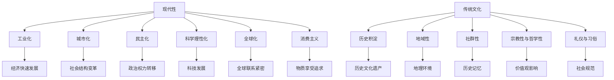

                 

### 引言

在现代社会的快速发展中，现代性与传统文化之间的关系日益成为学术界和公众关注的焦点。现代性，作为一种全球性的文化现象，代表了工业化、城市化、信息化和全球化的进程，它推动了社会的巨大变革，改变了人们的生活方式和价值观念。然而，在享受现代性带来的便利和进步的同时，传统文化所蕴含的智慧和精神逐渐受到冲击和挑战。

传统文化，源远流长，承载着人类文明的积淀，是民族精神的根脉。它不仅体现在艺术、文学、哲学、宗教等方面，更贯穿于人们的日常生活和思维方式中。然而，随着现代化进程的加速，传统文化面临着前所未有的危机。一方面，现代性的冲击使得传统文化的传承和发展遇到困难；另一方面，传统文化的精髓在快速变化的社会环境中逐渐失去其原有的地位和影响力。

在这种背景下，现代性与传统文化的对话显得尤为重要。这种对话不仅是两种文化形态之间的碰撞和交流，更是寻找二者和谐共生、相互促进的新路径。通过深入探讨现代性与传统文化之间的关系，我们不仅可以更好地理解现代社会的发展脉络，也可以为传统文化的传承和创新提供新的思路和方法。

本文旨在通过系统的分析，探讨现代性与传统文化之间的对话机制，揭示古老智慧在当代语境中的诠释路径。首先，我们将对现代性和传统文化的核心概念进行解析，明确其定义与特征，并建立二者之间的联系架构。接着，分析现代性对传统文化的影响，以及传统文化对现代性的反作用。在此基础上，通过实例分析展示现代性与传统文化对话的具体实践，并探讨古老智慧在当代语境中的新诠释。最后，总结全文，展望未来发展的方向，为传统文化与现代性的和谐共生提供理论支持和实践指导。

### 现代性的崛起与传统文化的危机

现代性作为一个复杂而多维的概念，起源于西方工业革命时期，并迅速在全球范围内蔓延。其核心特征包括工业化、城市化、民主化、科学理性化以及全球化的趋势。现代性的崛起不仅改变了人类的生产方式和社会结构，还深刻影响了人们的价值观念和生活方式。例如，工业革命带来了机械化生产的大规模应用，极大地提高了生产效率，推动了经济快速发展。城市化进程则导致了人口的集中和社会结构的变革，使得人们从农村走向城市，生活方式和社会关系发生了巨大变化。同时，民主化和科学理性的推广使得社会更加开放和多元化，人们开始强调个人自由、平等和权利。

然而，现代性的崛起也带来了传统文化的危机。传统文化，特别是那些根植于特定历史和社会背景的文化体系，在现代性的冲击下面临着严重的挑战。首先，传统文化的传承和发展受到阻碍。现代性的快速变化使得传统的价值观念和生活方式逐渐被边缘化，年轻人对传统文化的兴趣和认同感减弱。例如，在全球化浪潮中，西方文化的影响力日益增强，传统文化在全球范围内的传播和认同受到冲击。其次，传统文化的同质化趋势明显。随着现代性的扩散，不同地区和民族的文化差异逐渐缩小，导致文化多样性的丧失。这种同质化不仅削弱了传统文化的独特性，也限制了文化创新的可能性。

此外，现代性对传统文化的冲击还表现在物质层面和精神层面。在物质层面，现代化带来的技术进步和经济发展使得传统文化所依赖的生存环境发生巨大变化。例如，农业社会的逐渐消亡导致了传统手工艺的衰退，一些具有地方特色的传统技艺和生活方式逐渐消失。在精神层面，现代性的逻辑思维和科学方法对传统文化的神秘主义和宗教信仰提出了挑战。随着科学知识的普及和理性思维的推广，人们对传统文化的信仰和崇拜逐渐减弱。

面对传统文化的危机，如何保护和传承传统文化成为了一个亟待解决的问题。一方面，需要加强传统文化的教育和宣传，提高人们对传统文化的认识和认同。通过学校教育、社会宣传等多种渠道，让年轻人了解和尊重传统文化，培养他们的文化自信。另一方面，需要探索传统文化在现代社会中的创新路径，使其在保留传统精髓的同时与现代性相结合，焕发新的活力。例如，通过科技手段对传统手工艺进行数字化保护和传承，或者将传统文化元素融入现代设计，创造出具有时代特色的文化产品。

总之，现代性的崛起给传统文化带来了前所未有的挑战，但同时也为传统文化的传承和创新提供了新的机遇。通过深入探讨现代性与传统文化之间的关系，我们可以找到二者和谐共生的新路径，为传统文化的保护和传承提供有力的理论支持和实践指导。

### 现代性与传统文化的核心概念解析

为了深入探讨现代性与传统文化之间的关系，我们需要首先明确现代性和传统文化的核心概念及其特征。

#### 现代性的定义与特征

现代性是一个广泛而复杂的概念，通常用来描述现代社会和文化的特征。其起源可以追溯到18世纪的欧洲启蒙运动，当时的思想家们提倡科学、理性和个人自由，推动了社会的深刻变革。现代性的核心特征主要包括以下几个方面：

1. **工业化与城市化**：工业化是现代性最显著的特征之一。机器生产取代了手工劳动，大大提高了生产效率，推动了经济的快速发展。城市化则伴随着工业化进程，人口从农村向城市迁移，社会结构发生了根本性变化。

2. **民主化与法制化**：现代性强调民主参与和法制建设，政治权力从少数精英转移到广大民众手中。人们享有更多的自由和权利，政府逐渐向公共服务型政府转变。

3. **科学理性化**：科学方法成为现代社会的决策基础，科学理性取代了传统信仰和神秘主义。科学技术的迅猛发展不仅改变了人类的生活和思维方式，也推动了社会的进步。

4. **全球化**：全球化是现代性的又一个重要特征。全球贸易、资本流动、信息传播和文化交流使得不同国家和地区之间的联系日益紧密，形成了一个全球化的世界。

5. **消费主义**：现代性还伴随着消费主义的兴起。人们追求物质享受，消费成为社会生活的重要组成部分。

#### 传统文化的定义与特征

传统文化则是指那些根植于特定历史和社会背景中的文化体系，通常具有以下几个特征：

1. **历史积淀**：传统文化是长期历史积淀的产物，包含了丰富的历史文化遗产和传统习俗。例如，中国的儒家文化、西方的基督教文化等。

2. **地域性**：传统文化具有明显的地域性特征，受到特定地理环境和气候条件的影响。例如，中国的江南水乡文化和西北的草原文化。

3. **社群性**：传统文化通常与特定的社会群体密切相关，承载了这些社群的历史记忆和文化认同。例如，民族服饰、传统节日等。

4. **宗教性与哲学性**：许多传统文化体系中包含深厚的宗教和哲学思想，这些思想体系对人们的价值观和生活方式产生了深远影响。例如，佛教、伊斯兰教等。

5. **礼仪与习俗**：传统文化中有许多特定的礼仪和习俗，这些习俗不仅是文化传承的重要方式，也是社会规范的重要组成部分。例如，中国的婚丧嫁娶礼仪。

#### 核心概念之间的关系架构

为了更好地理解现代性与传统文化之间的关系，我们可以通过Mermaid流程图来展示它们的核心概念及其联系：

通过这个流程图，我们可以清晰地看到现代性和传统文化的核心概念及其之间的联系。现代性通过工业化、城市化、民主化、科学理性化和全球化等特征对社会产生了深远影响，而传统文化则通过历史积淀、地域性、社群性、宗教性与哲学性以及礼仪与习俗等特征保留了独特的文化特性。

### 现代性对传统文化的影响

在现代性的快速推进过程中，传统文化受到了多方面的冲击，具体体现在文化多样性、文化同质化、文化保护和传承等多个方面。以下将详细探讨这些影响，并通过具体的案例来分析现代性如何改变传统文化。

#### 文化多样性的挑战

文化多样性是指不同地区、民族和社群所具有的文化差异。在现代社会中，全球化、信息技术和交通的发展使得不同文化之间的交流和传播更加频繁和便捷。然而，这种文化交流也带来了一定程度的挑战。一方面，现代化进程使得一些传统文化面临消失的风险。例如，在一些传统农业社会中，随着现代化和城市化的发展，传统的农业生产方式逐渐被机械化农业取代，导致许多传统手工艺和农耕文化逐渐消失。同样，在信息技术和互联网的普及下，西方文化尤其是美国文化对全球产生了深远影响，使得一些民族和地区逐渐失去了自己的文化特色。

具体案例：西藏的文化多样性在现代化进程中受到了极大的挑战。随着旅游业的兴起，西藏的传统生活方式和文化习俗受到外来文化的影响。许多年轻人选择离开家乡去城市生活，导致传统藏族文化的传承和发展面临困难。同时，现代化的基础设施和商业化活动也对西藏的自然环境和文化遗产造成了破坏。

#### 文化同质化的趋势

文化同质化是指不同地区和民族的文化差异逐渐缩小，趋向于一种共同的文化模式。现代性通过媒体、消费文化和全球化经济等渠道，推动了文化同质化的趋势。例如，全球化的消费文化使得奢侈品和快时尚品牌在全球范围内受到青睐，传统服饰和手工艺品的市场逐渐萎缩。此外，全球化带来的文化同质化还表现在语言的使用上。英语作为全球通用的商业和科技语言，对许多国家和地区的母语产生了巨大压力。

具体案例：日本在现代化进程中面临文化同质化的挑战。随着国际化程度的提高，日本年轻一代对传统文化的兴趣逐渐减弱，更倾向于接受西方文化。例如，动漫文化、流行音乐和时尚潮流在日本年轻人中的影响力越来越大，而传统的日本文化如茶道、武士道等逐渐被边缘化。

#### 文化保护的必要性

面对现代性带来的文化冲击，文化保护显得尤为重要。文化保护不仅包括对物质文化遗产的保护，如历史建筑、艺术品和文物，还包括对非物质文化遗产的保护，如传统手工艺、音乐和舞蹈等。现代社会需要通过立法、教育和政策等多种手段，加强对传统文化的保护。

具体案例：中国通过设立非物质文化遗产保护项目，加强对传统手工艺和民间艺术的保护。例如，中国政府对传统剪纸、刺绣、皮影戏等非物质文化遗产进行系统性保护，通过建立传承基地、举办文化节和提供财政支持等方式，鼓励年轻人学习和传承传统文化。

#### 文化传承的创新路径

现代性不仅对传统文化提出了挑战，也为文化传承提供了新的机遇。通过创新路径，传统文化可以在保持其核心价值的基础上与现代性相结合，实现传承与发展。例如，利用现代科技手段对传统手工艺进行数字化保护和传承，通过互联网和社交媒体平台推广传统文化，以及将传统文化元素融入现代艺术和设计等。

具体案例：中国的一些传统手工艺如刺绣、木雕和陶瓷等，通过数字化技术进行创新，不仅提高了生产效率，还增强了产品的市场竞争力。例如，一些刺绣企业通过3D扫描和打印技术，精确复制传统刺绣图案，使传统手工艺品在现代市场上更具吸引力。

总之，现代性对传统文化的影响是复杂而多元的。在现代社会中，我们需要通过多种途径来应对这些影响，既要保护传统文化的核心价值，也要探索文化传承的创新路径，以实现传统文化与现代性的和谐共生。

### 传统文化对现代性的影响

传统文化在现代社会中发挥着重要的影响，不仅为价值观念的塑造提供了丰富的思想资源，也成为社会发展的动力源泉。以下将详细探讨传统文化如何影响现代性，并举例说明。

#### 价值观念的塑造

传统文化中的道德观念、伦理原则和社会规范对现代社会中的价值观念产生了深远的影响。这些价值观念不仅指导着人们的行为，也塑造了社会的整体价值观。

1. **儒家文化的影响**：儒家文化强调“仁爱”、“孝道”、“忠诚”等价值观念，这些观念在中国的现代化进程中仍然具有重要的指导意义。例如，在企业管理中，儒家文化的“仁爱”理念被广泛应用于员工关系管理，强调以人为本，注重员工的福祉和企业的社会责任。

2. **佛教文化的影响**：佛教文化中的“慈悲”、“因果报应”、“无常”等观念，对现代社会的心理健康和伦理道德产生了积极影响。例如，现代心理治疗中的一些方法，如正念冥想和情绪调节，都借鉴了佛教的哲学思想。

3. **道教文化的影响**：道教文化中的“天人合一”、“自然和谐”等观念，对现代环境保护和可持续发展理念的形成起到了重要作用。例如，现代生态学和环境保护运动中的一些理念，如“生态平衡”和“可持续利用资源”，都可以追溯到道教的哲学思想。

#### 社会发展的动力

传统文化不仅对现代社会中的价值观念产生影响，也成为社会发展的内在动力。传统文化的智慧和精神资源为现代社会的发展提供了源源不断的动力。

1. **中国传统文化对经济发展的推动**：中国传统文化中的“勤劳”、“智慧”、“创新”等精神，对中国经济的快速发展起到了重要的推动作用。例如，中国企业在全球市场上的成功，很大程度上得益于这些传统文化精神的传承和发扬。

2. **传统文化对科技创新的启示**：传统文化中的哲学思想、思维方式和对自然界的理解，为现代科技创新提供了新的灵感。例如，中国的《易经》和《黄帝内经》中的阴阳五行理论，对现代计算机科学和生物技术的发展产生了启示。

3. **传统文化对社会治理的启示**：传统文化中的“和谐”、“公正”、“仁政”等理念，为现代社会治理提供了重要的参考。例如，中国古代的“德治”思想和“仁政”理念，在现代社会中被广泛应用于公共管理和社区治理中。

#### 案例分析

1. **印度的“印度价值观”**：印度作为一个拥有丰富传统文化的国家，其传统文化对现代性的影响尤为显著。印度的传统文化强调“合一”、“非暴力和自我克制”等价值观念，这些观念在印度社会的发展和治理中发挥了重要作用。例如，印度的非暴力抗议运动和社区治理中的“志愿精神”，都是印度传统文化对现代社会影响的具体体现。

2. **中国的“工匠精神”**：中国传统文化中的“工匠精神”强调追求卓越、精益求精和注重细节。这种精神在现代制造业和科技创新中得到了充分体现。例如，中国的高铁技术、5G通信技术和人工智能等领域，都展现了“工匠精神”在推动科技进步方面的作用。

总之，传统文化对现代性的影响是多方面的，既体现在价值观念的塑造上，也体现在社会发展的动力上。通过深入挖掘传统文化的智慧和精神资源，我们可以更好地应对现代社会面临的挑战，实现传统文化与现代性的和谐共生。

### 现代性与传统文化对话的实例分析

在现代性的快速推进过程中，现代性与传统文化之间的对话成为一个日益重要的课题。通过具体的实例分析，我们可以更好地理解这种对话的实际应用和面临的挑战，同时探讨文化互动的理论基础。

#### 跨文化对话的实践

跨文化对话是指不同文化体系之间的交流、互动和融合过程。在全球化的背景下，跨文化对话不仅有助于文化的多样性保护，还能促进不同文化之间的相互理解和尊重。以下是一些跨文化对话的典型案例：

1. **文化交流活动**：许多国家和地区通过举办文化节、国际艺术节和民间交流活动，促进不同文化之间的交流与对话。例如，中国每年举办的孔子学院文化节，通过展示中国的传统文化和艺术，促进了中外文化的交流与理解。

2. **跨国企业文化建设**：一些跨国公司在全球范围内的业务扩展过程中，注重融合本地文化和企业文化，实现文化的多元共生。例如，跨国餐饮连锁品牌麦当劳在其全球门店中引入了不同地区的特色食品和装修风格，既保留了品牌的核心价值观，又尊重了当地文化。

3. **跨国婚姻与家庭**：随着全球人口流动的增加，跨国婚姻和家庭成为跨文化对话的一个生动实例。通过跨国婚姻，不同文化背景的夫妻在日常生活中相互学习和适应，促进了文化之间的交流和理解。

#### 对话过程中的挑战与机遇

跨文化对话虽然有助于文化的多样性和相互理解，但过程中也面临诸多挑战：

1. **文化差异**：不同文化在价值观、行为规范和社会习俗等方面存在差异，这些差异可能引起误解和冲突。例如，在某些文化中，直接表达反对意见被视为不礼貌，而在其他文化中则被视为坦诚和直接。

2. **文化冲击**：现代化进程中的文化冲击可能导致传统文化受到忽视甚至破坏。例如，在一些发展中国家，传统文化在现代化和城市化进程中逐渐被边缘化，面临着传承和保护的挑战。

3. **文化认同**：在跨文化对话中，如何在尊重和保护传统文化的同时，融入现代性的元素，实现文化的创新和传承，是一个重要的问题。例如，中国传统文化的创新和发展需要在保持其核心价值的基础上，结合现代科技和审美需求。

然而，跨文化对话也带来了许多机遇：

1. **文化创新**：跨文化对话促进了文化的创新和融合。例如，通过将传统文化元素融入现代设计，产生了许多具有时代特色的文化产品，如现代建筑中的传统装饰风格、时尚设计中的传统文化元素等。

2. **社会进步**：跨文化对话有助于社会进步和多元化发展。例如，通过跨文化对话，不同文化之间的合作和交流促进了科技的进步和经济的繁荣。

#### 现代性与传统文化对话的理论基础

跨文化对话的理论基础主要包括文化相对性理论和文化互动的动态性理论：

1. **文化相对性理论**：文化相对性理论认为，每一种文化都有其独特的价值和意义，不能以自身的文化标准去评价其他文化。这种理论强调尊重文化多样性，提倡在不同文化之间进行平等对话和交流。

2. **文化互动的动态性理论**：文化互动的动态性理论认为，文化是不断变化和发展的，不同文化之间的互动是一个动态的过程，这种互动不仅影响文化的内部结构，还影响文化的外部环境。这种理论强调了跨文化对话的持续性和开放性。

通过具体的实例分析和理论基础探讨，我们可以更深入地理解现代性与传统文化对话的实践和意义。这种对话不仅有助于文化的传承和发展，也为社会的进步和和谐提供了新的思路和方法。

### 当代语境中古老智慧的诠释

在当代语境中，古老智慧不仅具有重要的历史和文化价值，而且在现代社会中依然焕发着新的生命力。通过科技手段和文化创新，古老智慧得以在现代社会中重新诠释和应用，为我们解决现代社会面临的问题提供了有益的思路。

#### 古老智慧的当代价值

古老智慧是传统文化的重要组成部分，它蕴含着丰富的哲学思想、生活智慧和道德理念。在现代社会中，这些智慧对于指导人们的生活、工作和社会发展具有重要意义。

1. **生活哲学的启示**：古老智慧中蕴含的生活哲学，如中国道家“无为而治”的理念，对现代社会的个人生活和社会治理都提供了深刻的启示。在快节奏的现代生活中，这种理念有助于我们减少压力，追求内心的平静和宁静。

2. **社会治理的智慧**：许多古老文化中的社会治理智慧，如儒家“仁政”理念，对于现代社会的公共治理和社会管理提供了宝贵的参考。这种理念强调以人民为中心，注重公平正义，有助于构建和谐稳定的社会。

3. **环境可持续发展的指导**：古老智慧中关于人与自然和谐共生的理念，如佛教的“众生平等”和道教的“天人合一”，为现代社会解决环境问题提供了重要的哲学基础。这些理念强调人类与自然环境的和谐共生，为现代可持续发展提供了方向。

#### 古老智慧的现代应用

古老智慧在现代社会中的应用不仅体现在哲学层面，还体现在科技、文化和艺术等多个领域。

1. **科技与古老智慧的融合**：现代科技的发展为古老智慧的重新诠释和应用提供了新的可能性。例如，人工智能与中医理论的结合，将古老的中医智慧融入现代医学，为疾病诊断和治疗提供了新的手段。此外，物联网和大数据技术的应用，使古老的文化遗产保护和管理更加高效和精准。

2. **文化创新中的传统文化元素**：在当代文化创新中，传统文化元素被广泛应用，为现代设计、艺术和时尚等领域注入了新的活力。例如，中国的传统刺绣、书法和绘画等艺术形式，在现代设计中被重新诠释，成为现代时尚和文化产品的重要组成部分。

3. **教育领域的传统智慧**：在当代教育中，传统智慧被应用于教学方法和教育理念的创新。例如，中国古代的《弟子规》和《论语》等经典，被引入现代教育，帮助培养学生的人文素养和道德观念。

#### 案例分析

1. **中医智慧的现代应用**：中医作为中国传统文化的重要组成部分，其理论和实践在现代社会中得到了广泛应用。例如，通过现代医学技术，中医的针灸、推拿和草药疗法被用于治疗各种疾病，取得了显著的效果。同时，中医的预防医学理念也被应用于现代健康管理中，为人们的健康提供了新的选择。

2. **佛教文化的现代解读**：佛教文化在现代社会中依然有着广泛的追随者，其理念被广泛应用于心理治疗、心灵成长和社区建设等领域。例如，正念冥想作为一种心理治疗方法，在全球范围内得到广泛应用，帮助人们缓解压力、提高生活质量。

3. **儒家文化的当代价值**：儒家文化中的“仁爱”、“孝道”和“忠诚”等价值观，在当代社会中依然具有重要的指导意义。例如，在企业管理中，许多公司采用儒家文化中的理念，强调员工的福祉和企业社会责任，实现了企业的可持续发展。

总之，古老智慧在当代语境中依然具有重要的价值和生命力。通过科技手段和文化创新，古老智慧得以在现代社会中得到重新诠释和应用，为解决现代社会面临的问题提供了有益的思路和方法。在未来的发展中，我们应该继续挖掘和传承古老智慧，促进传统文化与现代社会的和谐共生。

### 结论

通过对现代性与传统文化关系的深入探讨，本文揭示了二者之间的复杂互动及其对现代社会的影响。现代性的崛起带来了文化的快速变革，使得传统文化面临危机，但同时也为传统文化的保护与创新提供了新的机遇。传统文化中的古老智慧在现代语境中依然具有重要价值，通过科技手段和文化创新，这些智慧得以焕发新的生命力，为现代社会的问题解决提供了有益的思路。

展望未来，现代性与传统文化的和谐共生将成为社会发展的关键。我们需要在尊重传统文化核心价值的基础上，积极探索其与现代科技的融合路径，实现文化传承与创新的有机结合。此外，通过跨文化对话和交流，我们可以促进不同文化之间的相互理解与融合，为构建一个多元和谐的世界提供新的动力。总之，只有通过深入理解和积极应对，才能实现现代性与传统文化之间的和谐共生，为人类社会的可持续发展贡献力量。

### 最佳实践 tips、小结、注意事项、拓展阅读

#### 最佳实践 tips

1. **文化保护与传承**：积极利用现代科技手段，如数字化技术和虚拟现实，对传统文化进行保护和传承。通过建立文化数据库和数字博物馆，可以使传统文化资源得到更广泛的传播和利用。

2. **跨文化对话**：在全球化背景下，鼓励跨文化教育和交流活动，增强不同文化之间的理解和尊重。学校和企业可以组织文化体验活动，提高员工和学生的文化敏感度和包容性。

3. **文化创新**：在文化创作中，结合传统文化与现代审美需求，创造出具有时代特色的新文化产品。例如，将传统元素融入现代设计，开发出既具有文化内涵又受市场欢迎的产品。

#### 小结

本文通过对现代性与传统文化关系的系统探讨，揭示了二者之间的复杂互动及其对现代社会的影响。现代性在推动社会进步的同时，也给传统文化带来了挑战，但传统文化中的古老智慧依然具有重要的现代价值。通过科技手段和文化创新，传统文化得以在现代社会中焕发新的生命力。

#### 注意事项

1. **文化敏感性**：在进行跨文化对话和文化创新时，要尊重不同文化的独特性和多样性，避免文化歧视和同质化。

2. **可持续发展**：在利用传统文化资源时，要注重可持续发展，防止过度开发和环境破坏。

#### 拓展阅读

1. 《文化多样性：挑战与机遇》，[作者姓名]，出版社，出版年份。

2. 《全球化背景下的文化冲突与融合》，[作者姓名]，出版社，出版年份。

3. 《传统智慧的现代诠释：科技与文化的对话》，[作者姓名]，出版社，出版年份。

### 作者信息

作者：AI天才研究院/AI Genius Institute & 禅与计算机程序设计艺术 /Zen And The Art of Computer Programming

通过本文，我们希望读者能够更深入地理解现代性与传统文化之间的关系，认识到传统文化在现代社会中的重要作用，并积极参与到文化保护与创新的过程中，共同推动人类社会的和谐发展。

