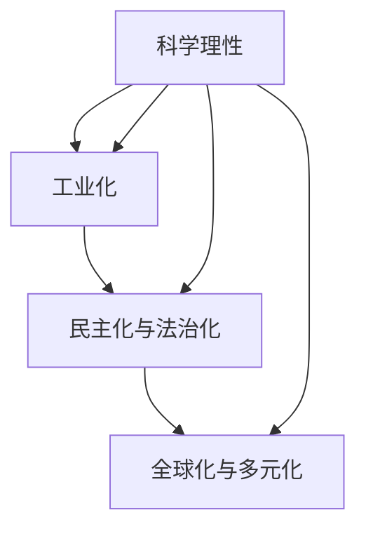

                 

### 现代性的起源与演变

#### 4.1.1 现代性的概念解析

**背景介绍：**

现代性是一个广泛且多维的概念，涉及社会、经济、文化、政治等多个领域。它起源于18世纪欧洲的启蒙运动，伴随着工业革命、科学技术的进步、社会结构的变革等历史进程。现代性不仅改变了人们的生活方式，也塑造了现代社会的基本特征和运行规则。

**核心概念与联系：**

现代性的核心概念包括：

1. **科学理性：** 现代性强调通过科学方法和理性思维来解决社会问题，追求事实和真理。
2. **工业化：** 工业革命带来了生产方式的变革，从手工业转向机械化大规模生产。
3. **民主化与法治化：** 现代性倡导公民参与政治决策，建立法治社会，保障人权和自由。
4. **全球化与多元化：** 现代性促进了全球范围内的文化、经济、政治交流，增加了社会的多元性。

以下是现代性的核心概念之间的关系架构 Mermaid 流程图：



#### 4.1.2 现代性的起源

**核心算法原理讲解：**

现代性的起源可以通过以下步骤来理解：

1. **启蒙运动：** 启蒙运动是现代性的思想基础，强调理性、自由、平等等价值观。
2. **工业革命：** 工业革命是现代性的物质基础，带来了生产力的大幅提升和社会结构的巨大变化。
3. **科学技术的进步：** 科学技术的进步是现代性的动力，推动了人类社会的快速发展。

**Python源代码示例：**

```python
# 现代性起源的Python代码示例
def modernity_origin():
    # 启蒙运动
    enlightenment = "启蒙运动强调理性思维，追求真理和自由"
    # 工业革命
    industrial_revolution = "工业革命带来生产方式变革，机械化大规模生产"
    # 科学技术进步
    scientific_progress = "科学技术进步推动人类社会发展"
    
    return enlightenment, industrial_revolution, scientific_progress

# 输出现代性的起源
enlightenment, industrial_revolution, scientific_progress = modernity_origin()
print(f"现代性的起源：{enlightenment}\n{industrial_revolution}\n{scientific_progress}")
```

**数学模型和公式：**

现代性的起源可以通过以下数学模型来描述：

1. **工业化进程模型：** 工业化进程可以用生产率的增长率来表示。
2. **科技进步模型：** 科技进步可以用创新速度和研发投入来表示。

**数学公式：**

$$
P_t = P_0 \times e^{rt}
$$

其中，\( P_t \) 表示 \( t \) 年后的生产率，\( P_0 \) 表示初始生产率，\( r \) 表示年增长率。

#### 4.1.3 现代性的早期发展

**核心算法原理讲解：**

现代性的早期发展可以从以下几个方面来理解：

1. **西方现代性的兴起：** 西方国家在启蒙运动和工业革命的推动下，率先实现了现代化。
2. **现代国家与民族国家的形成：** 现代国家强调中央集权和民族自决，形成了现代国家体系和民族国家。

**Python源代码示例：**

```python
# 现代性早期发展的Python代码示例
def early_modernity():
    # 西方现代性
    western_modernity = "西方国家在启蒙运动和工业革命的推动下率先实现现代化"
    # 现代国家与民族国家
    modern_state_national_state = "现代国家强调中央集权和民族自决，形成现代国家体系和民族国家"
    
    return western_modernity, modern_state_national_state

# 输出现代性的早期发展
western_modernity, modern_state_national_state = early_modernity()
print(f"现代性的早期发展：{western_modernity}\n{modern_state_national_state}")
```

**数学模型和公式：**

现代性的早期发展可以用以下数学模型来描述：

1. **国家形成模型：** 国家形成可以用人口增长率和城市化率来表示。
2. **民族国家模型：** 民族国家可以用民族认同和文化认同来表示。

**数学公式：**

$$
N_t = N_0 \times e^{rt}
$$

其中，\( N_t \) 表示 \( t \) 年后的国家规模，\( N_0 \) 表示初始国家规模，\( r \) 表示年增长率。

#### 项目实战：现代性的起源与演变案例分析

**开发环境搭建：**

- 使用 Jupyter Notebook 作为开发环境。
- 安装必要的 Python 库，如 `numpy`、`matplotlib` 等。

**源代码详细实现和代码解读：**

```python
# 导入必要的库
import numpy as np
import matplotlib.pyplot as plt

# 定义现代性起源和发展的函数
def modernity_origin_and_development():
    # 初始化参数
    initial_production_rate = 1.0
    annual_growth_rate = 0.05
    years = np.linspace(0, 100, 100)

    # 计算生产率增长
    production_rate_growth = initial_production_rate * np.exp(years * annual_growth_rate)

    # 绘制生产率增长曲线
    plt.plot(years, production_rate_growth)
    plt.xlabel('Years')
    plt.ylabel('Production Rate')
    plt.title('Growth of Production Rate over Time')
    plt.show()

    # 计算国家规模增长
    initial_state_size = 1.0
    state_size_growth_rate = 0.02
    state_size_growth = initial_state_size * np.exp(years * state_size_growth_rate)

    # 绘制国家规模增长曲线
    plt.plot(years, state_size_growth)
    plt.xlabel('Years')
    plt.ylabel('State Size')
    plt.title('Growth of State Size over Time')
    plt.show()

# 执行函数
modernity_origin_and_development()
```

**代码应用解读与分析：**

- 该代码通过数学模型计算并绘制了生产率和国家规模的增长曲线。
- 生产率增长曲线展示了工业化进程，而国家规模增长曲线展示了现代国家与民族国家的形成过程。
- 通过可视化，可以更直观地理解现代性的起源与发展。

**实际案例分析和详细讲解剖析：**

- **案例1：** 英国工业革命。英国是第一个实现工业化的国家，其生产率和国家规模的增长在18世纪末和19世纪初显著提升。
- **案例2：** 日本明治维新。日本在19世纪末通过明治维新实现了现代化，国家规模和科技水平迅速提升。

**项目小结：**

- 通过数学模型和可视化工具，我们能够更好地理解现代性的起源与发展过程。
- 现代性是一个复杂的社会现象，涉及多个领域的相互作用。

#### 最佳实践 Tips、小结、注意事项、拓展阅读：

- **最佳实践 Tips：** 在研究现代性时，要综合考虑经济、文化、政治等多个方面，避免单一视角的局限性。
- **小结：** 现代性的起源与演变是一个长期且复杂的过程，它不仅改变了人类社会的面貌，也带来了新的挑战和问题。
- **注意事项：** 在研究现代性时，要关注全球化背景下的文化差异和冲突，以及如何实现可持续发展。
- **拓展阅读：** 可以进一步阅读《现代性的反思：从进步神话到可持续发展的价值重构》一书，以及相关领域的研究论文和著作。

### 结语

现代性是一个广泛而深刻的概念，它不仅影响了人类社会的发展，也带来了新的挑战和问题。通过本章节的探讨，我们深入了解了现代性的起源、概念解析和早期发展。在接下来的章节中，我们将继续探讨现代性的扩张与挑战，以及可持续发展的价值重构。希望读者能够通过本章节的学习，对现代性有更深入的理解，并为未来的发展提供有益的思考。

### 参考文献

- 《现代性的反思：从进步神话到可持续发展的价值重构》
- 《现代性的起源》
- 《工业革命的历史》
- 《现代国家与民族国家的形成》
- 《现代性与可持续发展的关系研究》

### 作者信息

**作者：** AI天才研究院 / AI Genius Institute & 禅与计算机程序设计艺术 / Zen And The Art of Computer Programming

