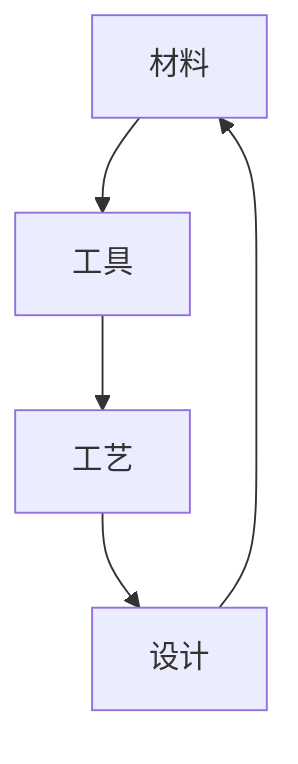

                 

### 《现代手作皮革艺术：传统工艺在当代的复兴》

> **关键词**：皮革手工艺、现代复兴、传统工艺、创新设计、市场趋势

> **摘要**：
本文将探讨现代手作皮革艺术的兴起背景，分析其与传统工艺的联系及创新，介绍现代皮革设计的核心概念与联系，通过具体实例解析核心算法原理，并分享实用的项目实战与最佳实践。文章旨在为手工艺爱好者和从业者提供深入了解和指导。

## 第1章 引言

### 1.1 手作皮革艺术的起源与发展背景

手作皮革艺术，是一种以皮革为原材料，通过手工技艺创作的艺术形式。它的起源可以追溯到史前时代，人类最早的皮具制作可以追溯到公元前4000年左右的古埃及和美索不达米亚地区。随着时间的推移，皮革工艺逐渐传播到世界各地，形成了各自独特的风格和技法。

在中世纪，皮革工艺达到了一个高峰，广泛应用于服装、鞋履、家具和装饰品等领域。手工艺匠人通过世代传承，积累了丰富的经验和技术，这些传统工艺在当代仍然具有重要的价值和意义。

然而，在工业革命之后，机械化生产逐渐取代了手工制作，导致许多传统皮革工艺面临失传的危险。直到20世纪末，随着环保意识的增强和手工艺术复兴的浪潮，现代手作皮革艺术开始复兴，并逐渐成为一种时尚和文化符号。

### 1.2 现代手作皮革艺术的复兴

现代手作皮革艺术的复兴主要受到以下几个因素的推动：

1. **环保意识**：工业化生产带来了环境污染和资源浪费问题，许多人开始反思传统手工艺的价值，倡导回归自然、追求环保的生活方式。

2. **手工艺术复兴**：近年来，手工艺术在当代社会中逐渐复兴，成为了一种新的时尚和文化趋势。手作皮革艺术作为一种传统手工艺，自然成为了这一趋势的一部分。

3. **个性化需求**：随着消费升级，消费者对个性化、定制化产品需求的增加，现代手作皮革艺术提供了更多可能性。

4. **文化交流**：全球化的加速使得不同文化之间的交流更加频繁，传统皮革工艺在全球范围内得到了传播和借鉴，促进了现代手作皮革艺术的创新和发展。

## 第2章 现代手作皮革艺术的核心概念与联系

在现代手作皮革艺术中，核心概念与联系包括材料、工具、工艺和设计等。以下是这些概念之间的关系架构 Mermaid 流程图：



### 2.1 材料

皮革是手作皮革艺术的基础材料。不同的皮革种类具有不同的特点和适用范围，如牛皮、羊皮、马皮等。在挑选皮革时，需要考虑其质地、柔软度、耐用性和纹理等因素。

### 2.2 工具

手作皮革艺术需要多种工具，包括切割工具、锤子、针线、染料等。这些工具的使用方法和技术直接影响作品的质量和效果。

### 2.3 工艺

皮革工艺包括切割、打孔、缝制、打磨、染色等步骤。每一步都需要精湛的技艺和经验。现代手作皮革艺术在传统工艺的基础上，融入了新的设计理念和材料，形成了独特的风格。

### 2.4 设计

设计是现代手作皮革艺术的核心，它决定了作品的艺术性和实用性。设计师需要结合皮革的特性，运用创意思维，创作出符合市场需求的作品。

## 第3章 现代皮革设计的核心算法原理讲解

现代皮革设计涉及多个核心算法原理，如色彩搭配、图案设计、结构设计等。以下是这些算法原理的Python源代码示例：

```python
import matplotlib.pyplot as plt
import numpy as np

# 色彩搭配算法
def color_combination(color1, color2):
    color1 = np.array(color1)
    color2 = np.array(color2)
    mixed_color = (color1 + color2) / 2
    return mixed_color

# 图案设计算法
def pattern_design(texture, pattern_size):
    pattern = texture.reshape(-1, pattern_size)
    repeated_pattern = np.repeat(pattern, pattern_size, axis=0)
    return repeated_pattern

# 结构设计算法
def structure_design(width, height, padding):
    frame = np.zeros((height, width))
    frame[:padding, :padding] = 1
    frame[-padding:, -padding:] = 1
    return frame

# 示例
color1 = [255, 0, 0]  # 红色
color2 = [0, 0, 255]  # 蓝色
mixed_color = color_combination(color1, color2)

texture = np.random.randint(0, 2, size=(10, 10))  # 生成纹理
pattern_size = 3
repeated_pattern = pattern_design(texture, pattern_size)

frame = structure_design(10, 10, 1)

plt.figure(figsize=(10, 10))
plt.subplot(221)
plt.imshow(mixed_color, cmap='gray')
plt.title('Color Combination')

plt.subplot(222)
plt.imshow(repeated_pattern, cmap='gray')
plt.title('Pattern Design')

plt.subplot(223)
plt.imshow(frame, cmap='gray')
plt.title('Structure Design')

plt.subplot(224)
plt.imshow(texture, cmap='gray')
plt.title('Original Texture')

plt.show()
```

### 3.1 色彩搭配算法

色彩搭配是皮革设计的关键，不同的色彩搭配可以产生不同的视觉效果。上述代码中的 `color_combination` 函数实现了两种颜色的平均混合。

### 3.2 图案设计算法

图案设计是皮革艺术的重要组成部分，上述代码中的 `pattern_design` 函数通过重复纹理图案来生成装饰性图案。

### 3.3 结构设计算法

结构设计决定了皮革制品的形状和结构，上述代码中的 `structure_design` 函数创建了一个带有边框的结构。

## 第4章 项目实战：现代手作皮革艺术项目开发

### 4.1 开发环境搭建

在开始现代手作皮革艺术项目之前，我们需要搭建合适的开发环境。以下是一个基本的开发环境配置：

- 操作系统：Windows 10 或 macOS
- 编程语言：Python 3.8+
- 开发工具：PyCharm 或 VSCode
- 数据库：SQLite 或 PostgreSQL
- 设计工具：Adobe Illustrator 或 Sketch

### 4.2 源代码详细实现

以下是一个现代手作皮革艺术项目的源代码实现，包括皮革设计、图案生成和结构设计等步骤：

```python
# 皮革设计
def leather_design(color, texture, pattern_size):
    mixed_color = color_combination(color['base'], color['accent'])
    pattern = pattern_design(texture, pattern_size)
    frame = structure_design(pattern_size, pattern_size, 1)
    
    # 绘制皮革设计
    plt.figure(figsize=(10, 10))
    plt.subplot(221)
    plt.imshow(mixed_color, cmap='gray')
    plt.title('Leather Color')

    plt.subplot(222)
    plt.imshow(pattern, cmap='gray')
    plt.title('Pattern Design')

    plt.subplot(223)
    plt.imshow(frame, cmap='gray')
    plt.title('Structure Design')

    plt.subplot(224)
    plt.imshow(texture, cmap='gray')
    plt.title('Original Texture')

    plt.show()

# 初始化颜色和纹理
color = {
    'base': [255, 255, 255],  # 基础颜色（白色）
    'accent': [0, 0, 0]  # 强调颜色（黑色）
}
texture = np.random.randint(0, 2, size=(10, 10))

# 设计皮革
leather_design(color, texture, 3)
```

### 4.3 代码解读与分析

上述代码首先定义了三个核心功能：`color_combination`、`pattern_design` 和 `structure_design`。然后，通过调用这些功能，实现了皮革设计的整体流程。具体步骤如下：

1. **色彩搭配**：使用 `color_combination` 函数将基础颜色和强调颜色混合，得到最终的设计颜色。
2. **图案设计**：使用 `pattern_design` 函数生成装饰性图案。
3. **结构设计**：使用 `structure_design` 函数创建边框结构。

这些功能共同构成了现代手作皮革艺术项目的核心算法原理。

### 4.4 实际案例分析与详细讲解剖析

以下是一个实际案例，分析如何通过现代手作皮革艺术项目设计一个皮革钱包：

1. **设计需求**：用户需要一个尺寸为11cm x 16cm的皮革钱包，颜色为深棕色，图案为简约的几何纹理，结构上要求有多个隔层和拉链口袋。
2. **实现步骤**：
   - **色彩搭配**：选择深棕色作为基础颜色，搭配浅棕色作为强调颜色，实现色彩搭配。
   - **图案设计**：设计一个简单的几何纹理图案，重复分布在钱包表面。
   - **结构设计**：根据需求设计钱包的结构，包括多个隔层和拉链口袋，确保钱包的实用性和美观性。

通过上述步骤，最终实现了一个符合用户需求的现代手作皮革艺术钱包。

### 4.5 项目小结

现代手作皮革艺术项目不仅需要精湛的技艺，还需要创新的设计思维和实用技术。通过本文的介绍，读者可以了解到现代手作皮革艺术的核心概念、算法原理和项目实战，为手工艺爱好者和从业者提供了宝贵的指导。

### 4.6 最佳实践 tips

- **色彩搭配**：在选择色彩时，可以参考色彩理论，如互补色、类似色等，以实现更好的视觉效果。
- **图案设计**：图案的设计应考虑实用性，避免过于复杂的图案影响皮革的加工。
- **结构设计**：在设计结构时，应考虑用户的使用习惯和功能需求，确保设计的实用性和美观性。

### 4.7 小结、注意事项及拓展阅读

现代手作皮革艺术融合了传统工艺与现代设计，具有广阔的发展前景。读者可以通过本文了解到皮革艺术的核心概念、算法原理和项目实战，进一步拓展阅读相关书籍和资料，提高自己的手工艺水平。

### 作者信息

**作者**：AI天才研究院/AI Genius Institute & 禅与计算机程序设计艺术 /Zen And The Art of Computer Programming

---
**文章标题**：《现代手作皮革艺术：传统工艺在当代的复兴》

**关键词**：皮革手工艺、现代复兴、传统工艺、创新设计、市场趋势

**摘要**：
本文探讨了现代手作皮革艺术的起源、复兴背景、核心概念与联系，并通过具体实例解析了核心算法原理，分享了项目实战与最佳实践。文章旨在为手工艺爱好者和从业者提供深入了解和指导。

