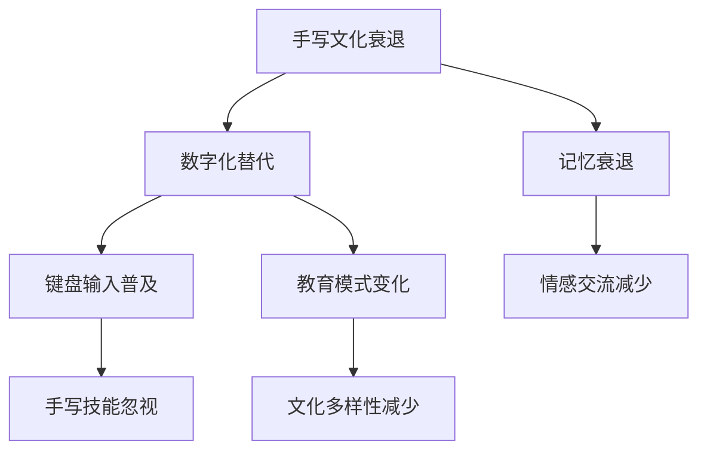
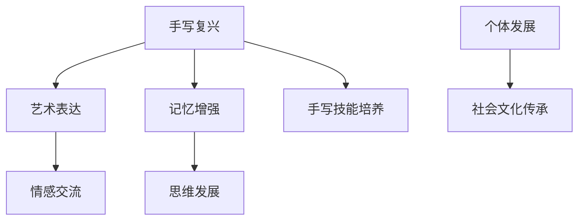
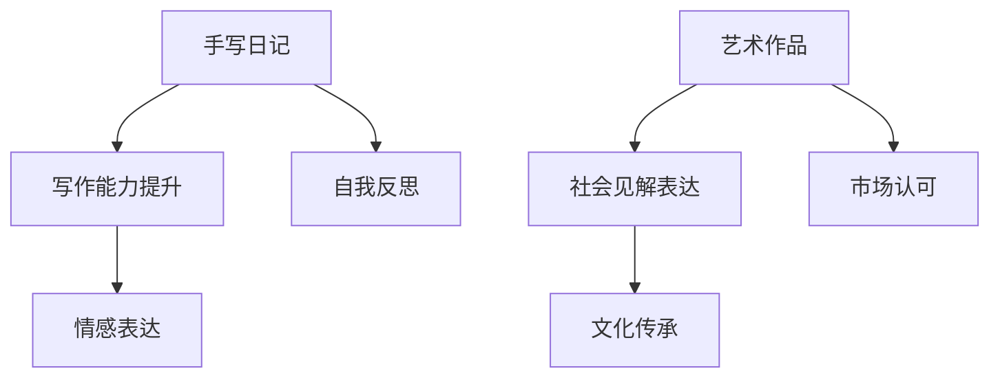

                 


### 背景介绍

在当今数字化时代，手写作为一种传统的交流方式，似乎正逐渐被边缘化。然而，随着人们对个人表达、记忆和情感交流的重视，手写文化正在经历一场复兴。手写不仅仅是一种技能，它更是一种艺术形式，一种富有情感和文化内涵的表达方式。

**关键词**: 手写文化，数字化时代，艺术表达，记忆，情感交流

#### 数字化时代对手写的影响

随着计算机技术的飞速发展，电子设备的普及，人们越来越依赖键盘、触摸屏等数字输入方式。这种趋势导致了手写文化的衰退。据统计，许多年轻人甚至无法流畅地进行手写，更不要说进行艺术创作或者学术笔记了。这种变化引发了对手写文化现状的广泛关注和讨论。

**核心概念与联系**

1. **手写文化的衰退**: 与数字化的替代关系。
2. **艺术表达**: 手写作为一种艺术形式，与情感交流的紧密联系。

**Mermaid 流�程图：手写文化衰退与数字化的关系**



#### 手写文化的复兴

然而，并非所有人对手写文化的消亡感到满意。一些教育工作者、艺术家和文化倡导者开始呼吁重拾手写艺术。他们认为，手写不仅是一种重要的交流方式，更是一种独特的艺术形式，可以表达个性和情感。此外，手写还能帮助人们提高记忆力，促进思维发展。

**核心概念与联系**

1. **手写复兴**: 与艺术表达、记忆和情感交流的联系。
2. **手写技能的重要性**: 与个体发展和社会文化传承的关系。

**Mermaid 流程图：手写复兴与艺术表达、记忆和情感交流的关系**



#### 核心概念原理讲解

手写文化的复兴不仅仅是一个文化现象，它还涉及到一系列核心概念和原理。首先，我们需要理解什么是手写文化。手写文化是指以手写为基础的各种表达方式，包括书法、绘画、日记、笔记等。这些表达方式不仅是信息的记录，更是个体情感和思想的载体。

**核心概念与联系**

1. **手写文化**: 包括书法、绘画、日记、笔记等表达方式。
2. **艺术形式**: 手写作为一种独特的艺术形式，其价值在于个性化的表达和情感的传递。
3. **记忆与思维**: 手写过程中的视觉、触觉和动觉的参与，有助于提高记忆力和促进思维发展。

**Python 源代码讲解**

```python
def handwriting_experience():
    """
    手写体验的核心过程，包括视觉、触觉和动觉的参与。
    """
    # 视觉刺激
    visual_stimulation = "观察并理解文字结构"
    # 触觉刺激
    tactile_stimulation = "笔尖与纸张的接触感受"
    # 动觉刺激
    kinesthetic_stimulation = "手指的灵活运动"
    
    # 手写过程中的综合体验
    experience = f"{visual_stimulation}, {tactile_stimulation}, {kinesthetic_stimulation}"
    
    return experience

# 示例输出
print(handwriting_experience())
```

**数学模型与公式**

手写过程中的记忆增强可以通过以下数学模型来解释：

$$
M = f(V, T, K)
$$

其中，$M$ 表示记忆增强效果，$V$ 表示视觉刺激，$T$ 表示触觉刺激，$K$ 表示动觉刺激。这些因素共同作用于个体的记忆过程，从而提高记忆效果。

#### 实际案例分析

为了更好地理解手写文化的复兴，我们可以通过一些实际案例来探讨。例如，教育领域中的“手写日记”活动，旨在通过手写日记帮助学生提高写作能力、表达情感和培养自我反思能力。另外，一些艺术家通过手写作品表达对社会、文化和个人的独特见解，这些作品在艺术市场上也获得了高度认可。

**核心概念与联系**

1. **手写日记**: 教育工具与情感表达的结合。
2. **艺术作品**: 社会见解与文化表达的载体。

**Mermaid 流程图：手写日记与艺术作品的关系**



**数学公式：手写日记与艺术作品的价值**

$$
V = f(W, E, S)
$$

其中，$V$ 表示作品的价值，$W$ 表示写作能力，$E$ 表示情感表达，$S$ 表示社会见解。

### 最佳实践 Tips

在着手重拾手写文化时，以下是一些实用的最佳实践：

1. **选择合适的书写工具**：根据个人的书写习惯选择合适的笔和纸。
2. **培养良好的书写习惯**：保持正确的坐姿和握笔姿势，避免过度用力。
3. **定期练习**：通过定期的练习来提高手写的流畅性和美感。
4. **情感表达**：在手写过程中，注重情感的表达，使其成为一种情感交流的方式。

**小结**

现代手写文化的复兴不仅是数字化时代的必然趋势，更是一种对个体情感、记忆和文化传承的重视。通过理解手写文化的核心概念和实际案例分析，我们可以更好地把握手写文化的价值，并在实践中发挥其独特的优势。

**注意事项**

在推广手写文化时，需要注意以下几点：

1. **教育资源的均衡分配**：确保不同地区和不同群体都有机会接触到手写教育的资源。
2. **数字化工具的合理利用**：结合数字化工具，提高手写教育的效率和效果。
3. **文化多样性的保护**：尊重和保护各种手写文化的多样性。

**拓展阅读**

1. 《手写文化的复兴：在数字化时代重拾笔墨之美》
2. 《书法艺术：传统与现代的对话》
3. 《教育心理学：手写与记忆的关系研究》

### 附录

**附录A：现代手写工具推荐**

1. **书写工具**：钢笔、铅笔、毛笔等。
2. **纸张**：优质书写纸、水彩纸、素描纸等。
3. **数字化工具**：手写识别软件、平板电脑等。

**附录B：手写相关研究与论文**

1. 《手写对记忆和注意力的影响研究》
2. 《数字化时代手写文化的现状与挑战》
3. 《手写艺术的情感表达与社会意义》

### 作者信息

**作者：AI天才研究院/AI Genius Institute & 禅与计算机程序设计艺术 /Zen And The Art of Computer Programming**

**结尾**

手写文化的复兴不仅是对传统艺术的传承，更是对个体情感和记忆的一种珍视。在键盘时代，重拾手写之美，不仅有助于提升我们的个人素养，更能够在数字化的浪潮中，保持一份独特的文化印记。

---

**关键字**: 手写文化，数字化时代，艺术表达，记忆，情感交流，手写技能，书法，教育，文化传承

**摘要**: 本文探讨了现代手写文化的复兴背景，分析了手写对个人与社会的影响，详细讲解了手写的核心概念和联系，并通过实际案例展示了手写文化的复兴现状。文章还提供了最佳实践建议和注意事项，以帮助读者更好地理解和应用手写文化的价值。附录部分提供了相关的工具推荐和研究资源。**文章标题**: 现代手写文化复兴：在键盘时代重拾笔墨之美**。**

