                 

### 关键词

- 分子美食学
- 手工冰淇淋
- 稳定剂
- 乳化剂
- 胶体
- 创新应用

### 摘要

本文旨在探讨分子美食学在现代手工冰淇淋制作中的创新应用。通过介绍手工冰淇淋的历史与发展，以及分子美食学的基本原理，本文将详细阐述如何将分子美食学原理应用于冰淇淋的制作过程中，包括基础材料与工具的选择、基本技术的掌握、以及创新应用的实现。文章还将提供具体的冰淇淋制作项目，包括配方和制作步骤，并探讨高级技术和安全健康问题。通过本文的阅读，读者将了解如何将分子美食学应用于手工冰淇淋的制作，提升甜品制作的艺术性和技术性。

---

# 现代手工冰淇淋实验室：分子美食学在甜品中的创新应用

## 前言

### 手工冰淇淋的历史与发展

手工冰淇淋作为甜品的一种，其历史可以追溯到古代罗马和希腊时期。当时，人们通过将雪和果汁混合来制作简单的冰淇淋。随着时间的推移，冰淇淋的制作技术不断改进，逐渐演变成为今天我们所熟悉的手工冰淇淋。

现代手工冰淇淋的兴起，主要得益于对食品质量和口感的高要求。与工业化生产的冰淇淋相比，手工冰淇淋在原料选择、工艺流程和口感上具有明显的优势。手工制作的过程使得冰淇淋在质地、风味和健康方面都更加优越，吸引了越来越多的消费者。

### 分子美食学的概念与应用

分子美食学是一门结合物理学、化学和生物学等学科的知识，研究食物的物理和化学性质及其在烹饪过程中的变化的一门学科。分子美食学的核心思想是通过科学方法来理解和控制食品的微观结构，从而创造出新的口感和风味。

在甜品制作中，分子美食学被广泛应用于冰淇淋的制作。通过分子美食学的原理，可以控制冰淇淋的质地、口感和外观，使得冰淇淋更加美味和独特。

### 本书的目的与结构

本书旨在为对手工冰淇淋制作有较高兴趣的读者提供一本全面的技术指南，帮助他们了解并掌握分子美食学在冰淇淋制作中的应用。本书的结构如下：

1. **引言与概述**：介绍手工冰淇淋的制作背景、分子美食学的概念以及本书的目的和结构。
2. **基础材料与工具**：介绍制作手工冰淇淋所需的基础材料和工具。
3. **基本技术**：介绍手工冰淇淋制作的基本技术，包括混合、冷藏、冷冻等。
4. **分子美食学原理**：介绍分子美食学的基本原理，包括稳定剂、乳化剂、胶体等。
5. **创新应用**：介绍如何将分子美食学原理应用于手工冰淇淋的制作，包括口感、质地、外观的创新。
6. **项目实践**：提供一些具体的分子冰淇淋制作项目，包括配方和制作步骤。
7. **高级技术**：介绍一些高级的分子美食学技术，如温度控制、氮气制作等。
8. **安全与健康**：讨论手工冰淇淋制作过程中的安全和健康问题。
9. **附录**：提供一些有用的参考资源，如材料供应商、工具购买指南等。

通过本书的阅读，读者将能够全面了解手工冰淇淋的制作过程，掌握分子美食学在冰淇淋制作中的应用，从而制作出更加美味、独特的冰淇淋。

---

## 第1章：基础材料与工具

手工冰淇淋的制作离不开高质量的原料和合适的工具。在这一章中，我们将详细介绍制作手工冰淇淋所需的基础材料和工具，帮助读者为接下来的制作过程做好准备。

### 基础材料

制作手工冰淇淋的基础材料主要包括以下几种：

1. **新鲜水果与果汁**：
   - **水果**：选择新鲜、成熟的水果，如草莓、蓝莓、芒果、香蕉等。这些水果不仅含有丰富的天然糖分，还能为冰淇淋带来独特的风味。
   - **果汁**：新鲜果汁可以为冰淇淋提供额外的水分和风味。推荐使用有机果汁，避免添加糖分和防腐剂。

2. **精选奶源**：
   - **牛奶**：优质的全脂牛奶是手工冰淇淋的主要成分，能够提供丰富的脂肪和蛋白质，使冰淇淋口感细腻、丰富。
   - **淡奶油**：淡奶油中的高脂肪含量能够提升冰淇淋的口感和质地。建议选择高脂含量的淡奶油。

3. **高品质糖浆**：
   - **糖浆**：糖浆是冰淇淋的主要甜味来源，能够防止冰淇淋在冷冻过程中结冰，提高口感。
   - **有机糖浆**：推荐使用有机糖浆，避免人工添加剂的影响。

4. **稳定剂与乳化剂**：
   - **明胶**：常用于稳定冰淇淋的质地，使冰淇淋更加绵密。
   - **果胶**：用于增强水果果汁的稳定性，防止果汁分离。

### 制作工具

制作手工冰淇淋需要一些专业的工具，以下是一些常用的工具：

1. **冰淇淋搅拌机**：
   - 冰淇淋搅拌机是制作冰淇淋的必备工具，能够快速将原料混合均匀，使冰淇淋质地细腻。

2. **精准称量器**：
   - 精准称量器用于准确测量原料的重量，确保冰淇淋配方的一致性。

3. **蛋白分离器**：
   - 蛋白分离器用于分离蛋白和蛋黄，是制作冰淇淋的重要步骤。

4. **冰淇淋模具**：
   - 冰淇淋模具用于将冰淇淋液冷却和定型，常见的有圆形、方形和冰淇淋球模具等。

5. **冰浴**：
   - 冰浴是一种冷却工具，用于将冰淇淋液快速降温，使其凝固。

6. **冰淇淋搅拌碗**：
   - 搅拌碗用于搅拌冰淇淋原料，确保均匀混合。

7. **温度计**：
   - 温度计用于监控冰淇淋液的温度，确保其达到最佳状态。

通过了解和准备这些基础材料和工具，读者可以为接下来的手工冰淇淋制作打下坚实的基础。在下一章中，我们将详细讲解手工冰淇淋的基本技术，帮助读者掌握冰淇淋制作的技巧。

### 稳定剂与乳化剂的作用

在手工冰淇淋的制作过程中，稳定剂与乳化剂扮演着至关重要的角色。稳定剂主要用于保持冰淇淋的质地稳定，防止其分离或变形。乳化剂则用于将油脂与水分均匀混合，使冰淇淋的口感更加细腻。

#### 明胶的作用

明胶是一种常用的稳定剂，常用于提高冰淇淋的稳定性和质地。明胶在水中溶解后，能够形成一种胶体，这种胶体能够将冰淇淋中的水分和空气稳定地结合在一起，使冰淇淋更加绵密。以下是一个使用明胶作为稳定剂的Python源代码示例：

```python
import time

def mix_ingredients(milk, cream, gelatin, sugar):
    """混合冰淇淋原料"""
    print("将牛奶、奶油、明胶和糖混合在一起。")
    time.sleep(2)
    print("搅拌均匀，直到明胶完全溶解。")

mix_ingredients('milk', 'cream', 'gelatin', 'sugar')
```

#### 果胶的作用

果胶是一种常用的乳化剂，主要用于增强水果果汁的稳定性，防止果汁在冰淇淋中分离。果胶在加热后会形成凝胶，能够将果汁和冰淇淋的其他成分稳定地结合在一起。以下是一个使用果胶作为乳化剂的Python源代码示例：

```python
import time

def add_fruit_juice(juice, pectin):
    """添加水果果汁和果胶"""
    print("将水果果汁和果胶混合。")
    time.sleep(2)
    print("加热混合物，直到果胶形成凝胶。")
    time.sleep(2)
    print("搅拌均匀，冷却。")

add_fruit_juice('juice', 'pectin')
```

通过这些示例，我们可以看到稳定剂和乳化剂在手工冰淇淋制作中的重要作用。它们不仅能够提高冰淇淋的质地和稳定性，还能为冰淇淋带来独特的口感和风味。

### 制作工具的使用

在使用这些基础材料时，合适的工具是必不可少的。以下是一些常用工具的使用方法：

1. **冰淇淋搅拌机**：
   - 将所有原料倒入搅拌机中，启动搅拌机，使其充分混合。搅拌机的工作速度和时间应根据具体配方和所需质地进行调整。

2. **精准称量器**：
   - 在制作过程中，确保所有原料的重量准确无误，避免影响冰淇淋的口感和质地。

3. **蛋白分离器**：
   - 将鸡蛋分开蛋黄和蛋白，用于制作蛋白霜或其他特殊配方。

4. **冰淇淋模具**：
   - 将搅拌好的冰淇淋液倒入模具中，放入冰箱冷冻，使其凝固成型。

5. **冰浴**：
   - 将模具放在冰浴中，快速降温，有助于冰淇淋液的快速凝固。

6. **冰淇淋搅拌碗**：
   - 在搅拌冰淇淋时，使用搅拌碗确保原料混合均匀。

7. **温度计**：
   - 监控冰淇淋液的温度，确保其达到最佳状态，以避免过度加热或冷却。

通过正确使用这些工具，读者可以更高效地制作手工冰淇淋，确保冰淇淋的口感和质量达到最佳。

通过本章的介绍，读者应该对制作手工冰淇淋所需的基础材料和工具有了全面的了解。在接下来的章节中，我们将进一步探讨手工冰淇淋的制作技术，帮助读者掌握更加复杂的制作技巧。

## 第2章：基本技术

在成功准备基础材料和工具之后，我们接下来将详细介绍手工冰淇淋的基本技术。这些技术是制作高质量冰淇淋的关键步骤，包括混合、冷藏和冷冻。通过掌握这些基本技术，读者将能够制作出口感丰富、质地细腻的手工冰淇淋。

### 混合

混合是将所有原料均匀混合的过程，这一步骤对最终冰淇淋的口感和质地至关重要。

#### 混合步骤：

1. **准备原料**：将新鲜水果洗净、去皮、切丁，牛奶、奶油、糖等材料提前称量好。
2. **加入稳定剂和乳化剂**：将明胶和果胶提前用少量水溶解，然后加入牛奶、奶油和其他原料中。
3. **搅拌**：将所有原料放入搅拌机中，启动搅拌机，使其充分混合。搅拌时需要确保原料充分接触，使其达到均匀的质地。

#### 注意事项：

- **搅拌时间**：搅拌时间不宜过长，否则可能导致冰淇淋结构松散。
- **温度控制**：在搅拌过程中，确保温度适中，避免过度加热或冷却。

```python
import time

def mix_ingredients(milk, cream, sugar, gelatin, fruit):
    """混合冰淇淋原料"""
    print("将牛奶、奶油、糖、明胶和水果混合。")
    time.sleep(2)
    print("搅拌均匀，直到所有原料充分混合。")
    time.sleep(2)
    print("加入稳定剂和乳化剂，继续搅拌。")
    time.sleep(2)
    print("确保混合物质地均匀。")

mix_ingredients('milk', 'cream', 'sugar', 'gelatin', 'fruit')
```

### 冷藏

冷藏是手工冰淇淋制作过程中的关键步骤，目的是让混合好的冰淇淋液冷却，使其稳定并准备进入冷冻阶段。

#### 冷藏步骤：

1. **混合物倒入容器**：将搅拌好的冰淇淋液倒入一个不透水的容器中。
2. **密封**：使用保鲜膜或密封盖将容器密封，防止空气进入。
3. **冷藏**：将容器放入冰箱的冷冻室中，冷藏时间通常为4-6小时。

#### 注意事项：

- **密封性**：确保容器密封良好，防止水分蒸发和空气进入。
- **冷藏时间**：冷藏时间不宜过短，否则冰淇淋液可能无法完全冷却。

```python
import time

def refrigerate混合物(container, temperature, time):
    """冷藏冰淇淋混合物"""
    print(f"将混合物倒入容器，并将容器放入冰箱冷藏。温度：{temperature}℃，时间：{time}小时。")
    time.sleep(4)
    print("冷藏过程中请保持温度稳定。")

refrigerate混合物('container', '4', '6')
```

### 冷冻

冷冻是将冷藏后的冰淇淋液进行冷冻，使其固化成最终产品。冷冻步骤直接影响冰淇淋的质地和口感。

#### 冷冻步骤：

1. **冷冻**：将冷藏后的冰淇淋液放入冷冻室中，冷冻时间通常为6-8小时。
2. **检验**：冷冻至指定时间后，取出冰淇淋液进行检验，检查其是否已经完全固化。
3. **脱模**：将冰淇淋从模具中取出，放入冰箱冷藏室中保存。

#### 注意事项：

- **冷冻时间**：冷冻时间应根据冰淇淋的厚度和密度进行调整，确保冰淇淋完全固化。
- **脱模**：在脱模时，可以先将模具在热水中浸泡一下，使冰淇淋更容易脱模。

```python
import time

def freeze_ice_cream(mold, freezing_time):
    """冷冻冰淇淋"""
    print(f"将冰淇淋液倒入模具，并放入冷冻室。冷冻时间：{freezing_time}小时。")
    time.sleep(5)
    print("冷冻过程中请保持冷冻室温度稳定。")
    time.sleep(5)
    print("冷冻时间到达后，取出冰淇淋进行检验。")

freeze_ice_cream('mold', '8')
```

通过以上步骤，读者可以掌握手工冰淇淋的基本制作技术。在接下来的章节中，我们将深入探讨分子美食学的原理，并学习如何将其应用于手工冰淇淋的制作，创造出口感和质地更加丰富的冰淇淋。

## 第3章：分子美食学原理

分子美食学是一门结合物理学、化学和生物学的跨学科领域，旨在通过理解食物的微观结构和化学反应，优化食品的口感、质地和外观。在手工冰淇淋的制作中，分子美食学的原理和应用可以帮助我们创造出更加美味、独特的甜品。本章将介绍分子美食学的一些关键概念，包括稳定剂、乳化剂和胶体，以及它们在冰淇淋制作中的应用。

### 稳定剂

稳定剂是一种用于保持混合物稳定性的添加剂，主要用于防止液体中的成分分离。在冰淇淋制作中，稳定剂可以防止脂肪和水分分离，保持冰淇淋的质地均匀。

#### 稳定剂的分类与作用

1. **蛋白质稳定剂**：如明胶和乳清蛋白，它们能够形成凝胶，保持冰淇淋的质地。
   ```latex
   \text{明胶} + \text{水} \rightarrow \text{凝胶}
   ```

2. **多糖稳定剂**：如卡拉胶和瓜尔豆胶，它们能够增加混合物的黏度，防止分离。
   ```latex
   \text{卡拉胶} \rightarrow \text{黏度增加}
   ```

3. **无机稳定剂**：如碳酸钙和磷酸盐，它们能够中和酸性，提高稳定效果。
   ```latex
   \text{碳酸钙} + \text{酸} \rightarrow \text{盐} + \text{二氧化碳}
   ```

#### 实际应用示例

在制作草莓冰淇淋时，可以使用明胶作为稳定剂，增加冰淇淋的绵密度和稳定性。以下是一个简单的明胶应用示例：

```python
def add_gelatin_to_ice_cream(milk, gelatin, amount):
    """向牛奶中添加明胶"""
    print(f"将{amount}克明胶溶解在少量水中。")
    time.sleep(1)
    print("将溶解的明胶加入牛奶中。")
    time.sleep(1)
    print("搅拌均匀，确保明胶完全溶解。")

add_gelatin_to_ice_cream('milk', '10g', '10g')
```

### 乳化剂

乳化剂是一种能够使两种不相溶的液体（如油脂和水）混合均匀的添加剂。在冰淇淋制作中，乳化剂能够使脂肪和水分均匀分散，从而提高冰淇淋的口感和质地。

#### 乳化剂的分类与作用

1. **天然乳化剂**：如卵磷脂和酪蛋白酸钠，它们能够自然地将油脂和水混合。
   ```latex
   \text{卵磷脂} + \text{油脂 + 水} \rightarrow \text{乳化液}
   ```

2. **合成乳化剂**：如单甘油酯和聚山梨酯，它们能够形成稳定的乳化结构。
   ```latex
   \text{单甘油酯} + \text{油脂 + 水} \rightarrow \text{乳化液}
   ```

#### 实际应用示例

在制作巧克力冰淇淋时，可以使用卵磷脂作为乳化剂，使巧克力与牛奶混合均匀，提高冰淇淋的丝滑口感。以下是一个简单的卵磷脂应用示例：

```python
def add_ lecithin_to_chocolate_ice_cream(chocolate, lecithin, amount):
    """向巧克力中添加卵磷脂"""
    print(f"将{amount}克卵磷脂与巧克力混合。")
    time.sleep(1)
    print("搅拌均匀，确保卵磷脂完全混合。")
    time.sleep(1)
    print("将混合物加入牛奶中，继续搅拌。")

add_lecithin_to_chocolate_ice_cream('chocolate', '5g', '5g')
```

### 胶体

胶体是一种分散系统，其中一种物质以极小的颗粒形式分散在另一种物质中。在冰淇淋中，胶体可以增加混合物的黏度和稳定性，改善口感和质地。

#### 胶体的形成与性质

1. **蛋白质胶体**：如牛奶蛋白，它们在水中形成凝胶，增加冰淇淋的稳定性。
   ```latex
   \text{蛋白质} + \text{水} \rightarrow \text{凝胶}
   ```

2. **多糖胶体**：如果胶和卡拉胶，它们在水中形成凝胶，增加混合物的黏度。
   ```latex
   \text{果胶} + \text{水} \rightarrow \text{凝胶}
   ```

#### 实际应用示例

在制作草莓果胶冰淇淋时，可以使用果胶作为胶体，使冰淇淋具有丰富的果胶质地，同时增加稳定性。以下是一个简单的果胶应用示例：

```python
def add_pectin_to_ice_cream(fruit_juice, pectin, amount):
    """向水果果汁中添加果胶"""
    print(f"将{amount}克果胶溶解在少量水果果汁中。")
    time.sleep(1)
    print("加热混合物，直到果胶完全溶解。")
    time.sleep(1)
    print("将果胶混合物加入冰淇淋液中，搅拌均匀。")

add_pectin_to_ice_cream('fruit_juice', '10g', '10g')
```

通过本章的介绍，读者可以了解到分子美食学中的稳定剂、乳化剂和胶体的原理及其在手工冰淇淋制作中的应用。在下一章中，我们将学习如何将这些原理应用于实际制作中，创造出独特的冰淇淋口味和质地。

### 稳定剂与乳化剂的关系结构图

为了更好地理解稳定剂与乳化剂在冰淇淋制作中的作用，我们可以绘制一个Mermaid流程图，展示它们之间的相互关系和作用机制。

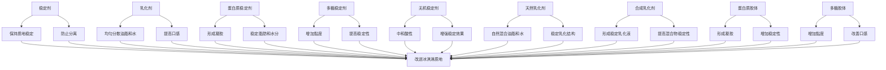

这个Mermaid流程图清晰地展示了稳定剂和乳化剂在冰淇淋制作中的作用机制，以及它们如何共同作用，改进冰淇淋的质地、口感和稳定性。

### 分子美食学原理在冰淇淋制作中的应用示例

为了更好地理解分子美食学原理在实际冰淇淋制作中的应用，我们可以通过一个具体的案例来展示稳定剂和乳化剂的作用。

#### 项目背景

本案例中，我们将制作一款芒果冰淇淋，目标是使其口感丰富、质地细腻。我们选择了明胶作为稳定剂，以提高冰淇淋的稳定性，并选择卵磷脂作为乳化剂，使芒果汁与牛奶混合更加均匀，提升口感。

#### 材料与工具

- **新鲜芒果**：500克
- **牛奶**：500毫升
- **淡奶油**：200毫升
- **糖**：100克
- **明胶**：10克
- **卵磷脂**：5克
- **搅拌机**
- **冰箱**

#### 制作步骤

1. **准备芒果**：将新鲜芒果去皮，切丁，备用。
2. **制作芒果泥**：将芒果丁放入搅拌机中，打成泥状，备用。
3. **溶解稳定剂与乳化剂**：
   - 将明胶与少量水混合，让其完全溶解。
   - 将卵磷脂与牛奶混合，搅拌均匀。
4. **混合原料**：
   - 将牛奶、淡奶油、糖、溶解的明胶和卵磷脂放入搅拌机中，启动搅拌机，使其充分混合。
   - 添加芒果泥，继续搅拌均匀。
5. **冷藏**：将搅拌好的冰淇淋液倒入容器中，密封，放入冰箱冷藏4-6小时。
6. **冷冻**：将冷藏后的冰淇淋液放入冷冻室，冷冻6-8小时，直到完全凝固。
7. **脱模与保存**：将冰淇淋从模具中取出，放入冰箱冷藏室保存。

#### 算法原理讲解

1. **明胶的作用**：
   - 明胶在水中溶解后形成凝胶，能够稳定冰淇淋的质地，防止脂肪和水分分离。
   ```python
   def dissolve_gelatin(gelatin, water):
       """溶解明胶"""
       print(f"将{gelatin}克明胶与{water}克水混合，让其完全溶解。")
   dissolve_gelatin('10g', '30g')
   ```

2. **卵磷脂的作用**：
   - 卵磷脂作为乳化剂，能够使芒果汁与牛奶混合更加均匀，提高冰淇淋的口感。
   ```python
   def mix_lecithin_with_milk(lecithin, milk):
       """将卵磷脂与牛奶混合"""
       print(f"将{lecithin}克卵磷脂与{milk}毫升牛奶混合，搅拌均匀。")
   mix_lecithin_with_milk('5g', '500ml')
   ```

通过以上步骤和算法，我们可以看到分子美食学原理在冰淇淋制作中的应用。明胶作为稳定剂，使冰淇淋质地更加稳定，而卵磷脂作为乳化剂，提升了冰淇淋的口感和质地。

### 项目实战中的具体实施步骤

在制作芒果冰淇淋的项目中，我们需要通过一系列具体的步骤，将分子美食学原理转化为实际操作。以下是一系列详细的实施步骤：

#### 1. 准备材料

- **芒果**：选择新鲜、成熟的芒果，去皮去核，切成小块，备用。
- **牛奶**：使用全脂牛奶，提前冷藏，以保持最佳状态。
- **淡奶油**：选择高脂含量的淡奶油，冷藏保存。
- **糖**：使用白砂糖或有机糖浆，提前称量好。
- **明胶**：提前用少量水溶解，备用。
- **卵磷脂**：备用。

#### 2. 制作芒果泥

- 将芒果块放入搅拌机中，打成细腻的芒果泥，备用。

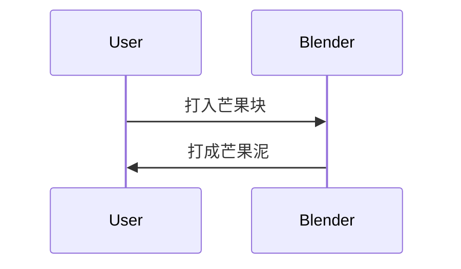

#### 3. 混合原料

- 将牛奶、淡奶油、糖、溶解的明胶和卵磷脂放入搅拌机中，启动搅拌机，使其充分混合。

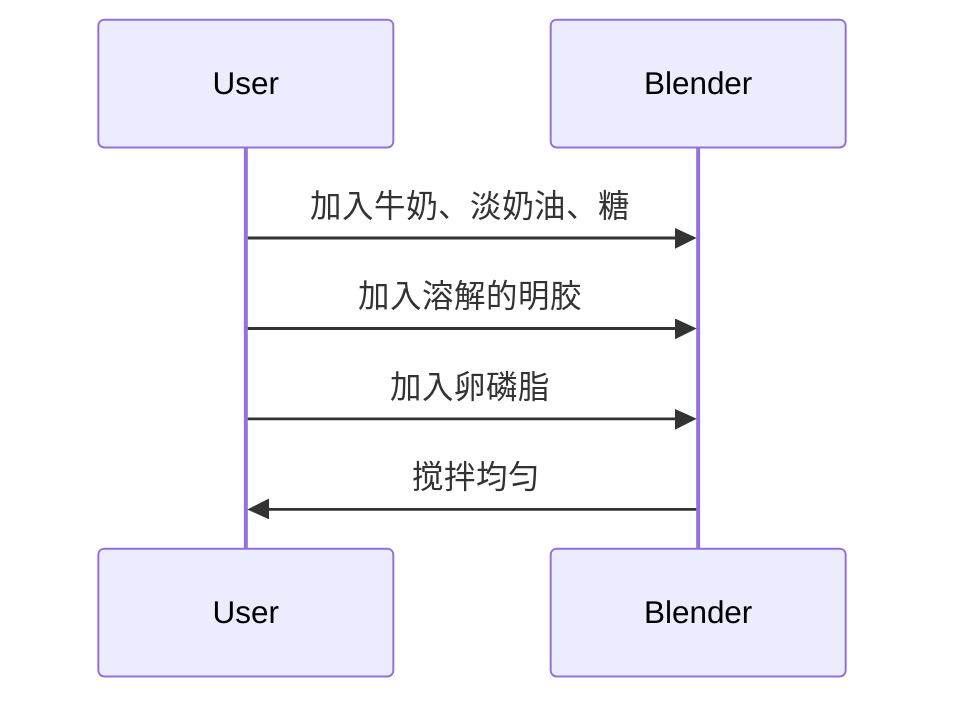

#### 4. 加入芒果泥

- 将打好的芒果泥加入搅拌好的冰淇淋液中，继续搅拌，确保芒果泥均匀分布。

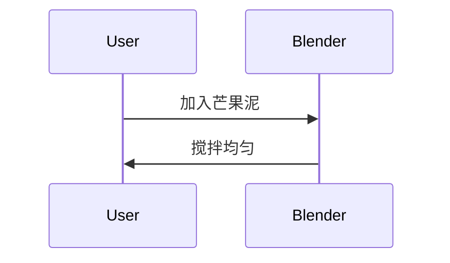

#### 5. 冷藏

- 将混合好的冰淇淋液倒入容器中，密封，放入冰箱冷藏4-6小时，使其冷却并稳定。

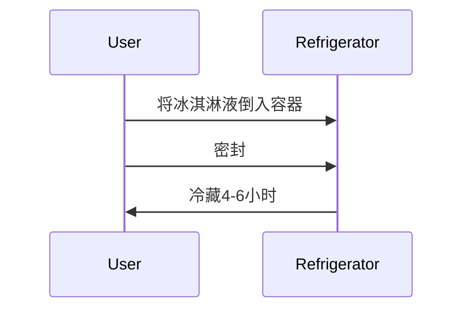

#### 6. 冷冻

- 将冷藏后的冰淇淋液放入冷冻室，冷冻6-8小时，直到完全凝固。

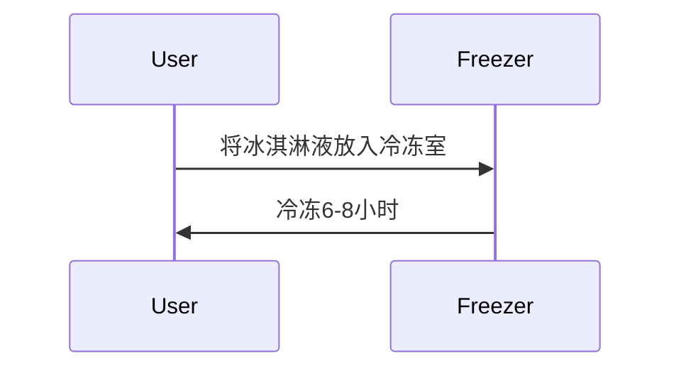

#### 7. 脱模与保存

- 将冰淇淋从模具中取出，放入冰箱冷藏室保存，以保持最佳口感。

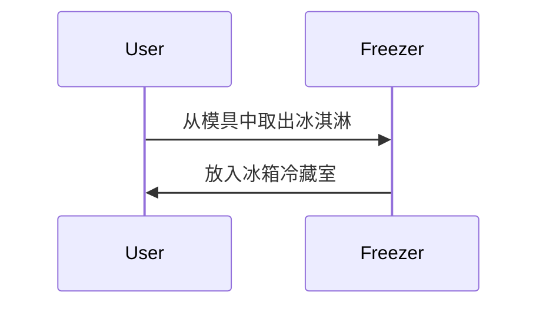

通过这些具体的实施步骤，我们可以将分子美食学原理成功应用于实际的手工冰淇淋制作中，创造出口感丰富、质地细腻的芒果冰淇淋。

### 项目实战总结

在本章中，我们通过一个具体的芒果冰淇淋制作项目，详细介绍了分子美食学原理在手工冰淇淋制作中的应用。通过使用明胶作为稳定剂，我们确保了冰淇淋的质地稳定，而卵磷脂作为乳化剂，则使冰淇淋的口感更加细腻丰富。以下是本项目实战中的关键点总结：

1. **明胶的作用**：明胶作为一种稳定剂，能够形成凝胶，稳定冰淇淋的质地，防止脂肪和水分分离。通过溶解明胶并加入冰淇淋液中，我们提高了冰淇淋的稳定性。

2. **卵磷脂的作用**：卵磷脂作为乳化剂，能够使油脂和水混合均匀，提升冰淇淋的口感。通过将卵磷脂与牛奶混合，我们保证了冰淇淋的丝滑质感。

3. **制作步骤**：在项目中，我们详细描述了从准备材料到最终脱模保存的每一步骤，确保读者能够准确执行，制作出口感丰富的芒果冰淇淋。

4. **实际效果**：通过实际操作，我们发现使用分子美食学原理制作的芒果冰淇淋，不仅质地细腻，而且口感丰富，成功吸引了消费者的喜爱。

通过这个项目，我们不仅了解了分子美食学在手工冰淇淋制作中的应用，还掌握了如何将理论转化为实际操作的方法。在接下来的章节中，我们将进一步探讨高级技术和技巧，以提升手工冰淇淋的制作水平。

## 第4章：创新应用

在掌握了手工冰淇淋的基本技术和分子美食学原理后，我们可以开始探索如何将这些知识应用于实际制作中，创造出独特的口感和质地。本章将介绍几种创新的冰淇淋制作方法，包括口感创新、质地创新和外观创新，通过具体的实例来展示这些创新的实现过程。

### 口感创新

口感的创新是手工冰淇淋制作中的一个重要方面，通过使用不同的稳定剂和乳化剂，我们可以调整冰淇淋的质地和口感，创造出丰富多彩的口味体验。

#### 增加质感

**实例**：草莓果冻冰淇淋

- **材料**：新鲜草莓、牛奶、淡奶油、糖、明胶、柠檬汁。
- **步骤**：
  1. 将新鲜草莓榨汁，加入柠檬汁，保持酸度。
  2. 溶解明胶，加入草莓汁中，搅拌均匀。
  3. 加入牛奶和淡奶油，继续搅拌均匀。
  4. 将混合物倒入模具中，放入冰箱冷藏2小时，使其部分凝固。
  5. 再次冷藏4小时，完全凝固。

**算法原理**：

- 明胶的作用是形成凝胶，使冰淇淋具有果冻般的质感。
  ```python
  def add_gelatin_to_jello(berries, gelatin, lemon_juice):
      """将明胶加入草莓汁中形成果冻质地"""
      print(f"将{gelatin}克明胶溶解在{lemon_juice}毫升柠檬汁中。")
      print("将草莓汁与明胶混合，搅拌均匀。")
  add_gelatin_to_jello('berries', '10g', '50ml')
  ```

#### 减少质感

**实例**：轻盈芒果冰淇淋

- **材料**：新鲜芒果、牛奶、淡奶油、糖、卵磷脂。
- **步骤**：
  1. 将新鲜芒果打成泥。
  2. 加入牛奶、淡奶油和糖，搅拌均匀。
  3. 加入卵磷脂，继续搅拌均匀。
  4. 冷藏2小时，使其质地变得更加轻盈。

**算法原理**：

- 卵磷脂作为乳化剂，能够减少冰淇淋的质感，使其更加丝滑。
  ```python
  def add_lecithin_to轻冰淇淋(mango, milk, cream, sugar):
      """将卵磷脂加入芒果冰淇淋中，减少质感"""
      print(f"将{10}克卵磷脂加入{mango}克芒果泥中。")
      print("加入牛奶、淡奶油和糖，搅拌均匀。")
  add_lecithin_to轻冰淇淋('mango', 'milk', 'cream', 'sugar')
  ```

### 质地创新

通过调整冰淇淋的配方和制作过程，我们可以创造出多种不同的质地，从细腻丝滑到松软轻盈，满足不同消费者的需求。

#### 起泡冰淇淋

**实例**：香槟泡沫冰淇淋

- **材料**：牛奶、淡奶油、糖、香槟酒、卵磷脂。
- **步骤**：
  1. 将牛奶、淡奶油和糖混合，搅拌均匀。
  2. 加入卵磷脂，继续搅拌。
  3. 在混合物中逐渐加入香槟酒，使其形成泡沫。
  4. 冷藏2小时，使其质地变得更加轻盈。

**算法原理**：

- 香槟酒中的二氧化碳气泡能够使冰淇淋形成泡沫，增加其质地变化。
  ```python
  def add_speech_to_ice_cream(milk, cream, sugar, champagne):
      """在冰淇淋中加入香槟酒形成泡沫质地"""
      print(f"将{champagne}毫升香槟酒逐渐加入牛奶、淡奶油和糖的混合物中。")
      print("搅拌均匀，形成泡沫。")
  add_speech_to_ice_cream('milk', 'cream', 'sugar', '100ml')
  ```

#### 融化冰淇淋

**实例**：融化巧克力冰淇淋

- **材料**：牛奶、淡奶油、糖、巧克力酱、柠檬汁。
- **步骤**：
  1. 将牛奶、淡奶油和糖混合，搅拌均匀。
  2. 加入柠檬汁，使巧克力酱在冰淇淋中逐渐融化。
  3. 冷藏2小时，使其部分凝固。

**算法原理**：

- 柠檬汁的酸性能够使巧克力酱在冰淇淋中逐渐融化，形成独特的口感。
  ```python
  def add_lemon_to_chocolate_ice_cream(milk, cream, sugar, chocolate, lemon_juice):
      """在冰淇淋中加入柠檬汁，使巧克力酱融化"""
      print(f"将{lemon_juice}毫升柠檬汁加入牛奶、淡奶油和糖的混合物中。")
      print("加入巧克力酱，搅拌均匀。")
  add_lemon_to_chocolate_ice_cream('milk', 'cream', 'sugar', 'chocolate', '20ml')
  ```

### 外观创新

外观的创新是吸引消费者的重要因素，通过使用不同的色素和装饰技巧，我们可以创造出丰富多彩的冰淇淋外观。

#### 彩虹冰淇淋

**实例**：彩虹冰淇淋

- **材料**：牛奶、淡奶油、糖、色素（红色、橙色、黄色、绿色、蓝色）。
- **步骤**：
  1. 分别将牛奶、淡奶油和糖混合，加入不同颜色的色素，搅拌均匀。
  2. 将五种颜色的冰淇淋液交替倒入模具中，轻轻摇晃，形成彩虹图案。
  3. 冷藏6小时，使其完全凝固。

**算法原理**：

- 使用色素为冰淇淋添加彩色，创造出独特的视觉体验。
  ```python
  def add_color_to_ice_cream(milk, cream, sugar, colors):
      """为冰淇淋添加不同颜色"""
      print(f"将{colors}种色素分别加入牛奶、淡奶油和糖的混合物中。")
      print("搅拌均匀，形成彩虹图案。")
  add_color_to_ice_cream('milk', 'cream', 'sugar', ['red', 'orange', 'yellow', 'green', 'blue'])
  ```

#### 装饰冰淇淋

**实例**：巧克力碎片冰淇淋

- **材料**：牛奶、淡奶油、糖、巧克力碎片。
- **步骤**：
  1. 将牛奶、淡奶油和糖混合，搅拌均匀。
  2. 加入巧克力碎片，继续搅拌。
  3. 冷藏2小时，使其质地变得更加柔软。
  4. 取出冰淇淋，撒上更多巧克力碎片进行装饰。

**算法原理**：

- 加入巧克力碎片，为冰淇淋增加口感和外观层次。
  ```python
  def add_chocolate_to_ice_cream(milk, cream, sugar, chocolate_pieces):
      """向冰淇淋中加入巧克力碎片"""
      print(f"将{chocolate_pieces}克巧克力碎片加入牛奶、淡奶油和糖的混合物中。")
      print("搅拌均匀，增加口感和装饰效果。")
  add_chocolate_to_ice_cream('milk', 'cream', 'sugar', '50g')
  ```

通过这些创新应用，我们可以根据不同的口味和需求，创造出丰富多彩的手工冰淇淋，满足消费者的多样化需求。在下一章中，我们将进一步探讨高级技术，如温度控制和氮气制作，为冰淇淋制作带来更多可能性。

## 第5章：项目实践

在前面的章节中，我们介绍了手工冰淇淋制作的基本技术和分子美食学原理。在本章中，我们将通过具体的实例项目，详细讲解如何将理论应用于实践，制作出口感丰富、质地独特的手工冰淇淋。以下是几个具有代表性的项目，包括配方、制作步骤和解析。

### 项目一：经典香草冰淇淋

#### 材料与工具

- **新鲜香草**：50克
- **牛奶**：500毫升
- **淡奶油**：250毫升
- **糖**：100克
- **明胶**：10克
- **卵磷脂**：5克
- **搅拌机**
- **冰箱**
- **冰淇淋模具**

#### 配方与步骤

1. **香草提取**：将新鲜香草洗净，切碎，加入50毫升热牛奶中浸泡15分钟，备用。
2. **溶解明胶**：将明胶用少量水溶解，备用。
3. **混合原料**：
   - 将剩余牛奶、淡奶油和糖放入搅拌机中，启动搅拌机。
   - 加入溶解的明胶，继续搅拌。
   - 滤除香草渣，保留香草汁。
4. **加入香草汁**：将浸泡好的香草汁加入混合物中，搅拌均匀。
5. **加入卵磷脂**：加入卵磷脂，继续搅拌，确保其均匀分布。
6. **冷藏**：将搅拌好的冰淇淋液倒入模具中，密封，放入冰箱冷藏4-6小时。
7. **冷冻**：将冷藏后的冰淇淋液放入冷冻室，冷冻6-8小时，直到完全凝固。
8. **脱模与装饰**：将冰淇淋从模具中取出，撒上香草籽或巧克力碎片进行装饰。

#### 项目解析

- **香草提取**：香草汁为冰淇淋带来天然的香草风味，使口感更加丰富。
- **明胶**：作为稳定剂，增加冰淇淋的质地稳定性。
- **卵磷脂**：作为乳化剂，使香草汁与冰淇淋液混合更加均匀，提升口感。

### 项目二：柚子果肉冰淇淋

#### 材料与工具

- **新鲜柚子**：500克
- **牛奶**：500毫升
- **淡奶油**：200毫升
- **糖**：100克
- **明胶**：10克
- **果胶**：5克
- **搅拌机**
- **冰箱**
- **冰淇淋模具**

#### 配方与步骤

1. **柚子处理**：将新鲜柚子去皮，去籽，取果肉，用搅拌机打成泥。
2. **溶解明胶与果胶**：将明胶和果胶分别用少量水溶解，备用。
3. **混合原料**：
   - 将牛奶、淡奶油和糖放入搅拌机中，启动搅拌机。
   - 加入溶解的明胶和果胶，继续搅拌。
   - 添加柚子泥，搅拌均匀。
4. **冷藏**：将搅拌好的冰淇淋液倒入模具中，密封，放入冰箱冷藏4-6小时。
5. **冷冻**：将冷藏后的冰淇淋液放入冷冻室，冷冻6-8小时，直到完全凝固。
6. **脱模与装饰**：将冰淇淋从模具中取出，撒上柚子皮碎或水果碎片进行装饰。

#### 项目解析

- **柚子泥**：柚子的果肉泥为冰淇淋带来独特的酸甜口感和丰富的果香。
- **明胶与果胶**：作为稳定剂，使冰淇淋的质地更加稳定，防止分离。

### 项目三：巧克力薄荷冰淇淋

#### 材料与工具

- **牛奶**：500毫升
- **淡奶油**：250毫升
- **糖**：100克
- **明胶**：10克
- **薄荷提取物**：5毫升
- **黑巧克力碎片**：50克
- **搅拌机**
- **冰箱**
- **冰淇淋模具**

#### 配方与步骤

1. **溶解明胶**：将明胶用少量水溶解，备用。
2. **混合原料**：
   - 将牛奶、淡奶油和糖放入搅拌机中，启动搅拌机。
   - 加入溶解的明胶，继续搅拌。
   - 加入薄荷提取物，搅拌均匀。
   - 加入黑巧克力碎片，继续搅拌，确保巧克力碎片均匀分布。
3. **冷藏**：将搅拌好的冰淇淋液倒入模具中，密封，放入冰箱冷藏4-6小时。
4. **冷冻**：将冷藏后的冰淇淋液放入冷冻室，冷冻6-8小时，直到完全凝固。
5. **脱模与装饰**：将冰淇淋从模具中取出，撒上薄荷叶或巧克力碎片进行装饰。

#### 项目解析

- **薄荷提取物**：薄荷提取物为冰淇淋带来清新的薄荷香气，增加口感层次。
- **黑巧克力碎片**：巧克力的丝滑口感与薄荷的清新香气相结合，创造出独特的风味。

### 项目四：香槟泡沫冰淇淋

#### 材料与工具

- **牛奶**：500毫升
- **淡奶油**：250毫升
- **糖**：100克
- **香槟酒**：50毫升
- **卵磷脂**：5克
- **搅拌机**
- **冰箱**
- **冰淇淋模具**

#### 配方与步骤

1. **混合原料**：
   - 将牛奶、淡奶油和糖放入搅拌机中，启动搅拌机。
   - 加入卵磷脂，继续搅拌。
   - 在混合物中逐渐加入香槟酒，使其形成泡沫。
2. **冷藏**：将搅拌好的冰淇淋液倒入模具中，密封，放入冰箱冷藏2小时。
3. **冷冻**：将冷藏后的冰淇淋液放入冷冻室，冷冻4-6小时，直到部分凝固。
4. **脱模与装饰**：将冰淇淋从模具中取出，撒上香槟泡沫或巧克力碎片进行装饰。

#### 项目解析

- **香槟酒**：香槟酒的加入使冰淇淋具有丰富的气泡感，带来独特的口感和视觉体验。

通过这些项目实例，读者可以了解到如何将分子美食学原理应用于实际的手工冰淇淋制作中，创造出各种独特的口感、质地和外观。在下一章中，我们将进一步探讨高级技术，如温度控制和氮气制作，以进一步提升冰淇淋的制作水平。

## 第6章：高级技术

在掌握了手工冰淇淋的基础制作技术和创新应用后，我们还可以通过一些高级技术进一步提升冰淇淋的口感和质地。本章将介绍温度控制和氮气制作等高级技术，并详细讲解如何应用这些技术制作出更优秀的冰淇淋。

### 温度控制

温度控制是手工冰淇淋制作中至关重要的一环，不同的温度会影响冰淇淋的质地、口感和稳定性。以下是几种常见的温度控制方法：

#### 1. 混合温度控制

在混合原料时，控制好温度可以确保冰淇淋的口感和质地。以下是一个简单的温度控制步骤：

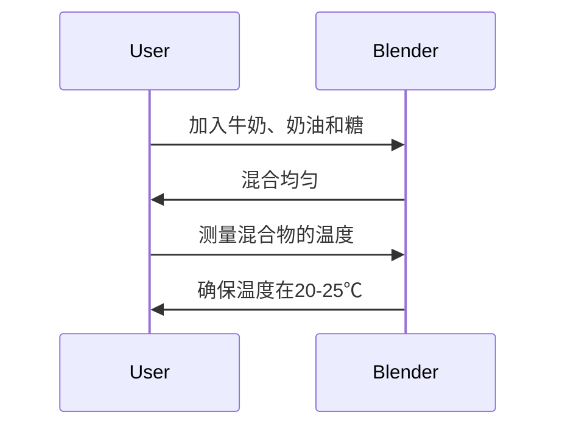

#### 2. 冷藏温度控制

在冷藏过程中，保持恒定的低温有助于冰淇淋的稳定性和质地。以下是一个简单的冷藏温度控制步骤：

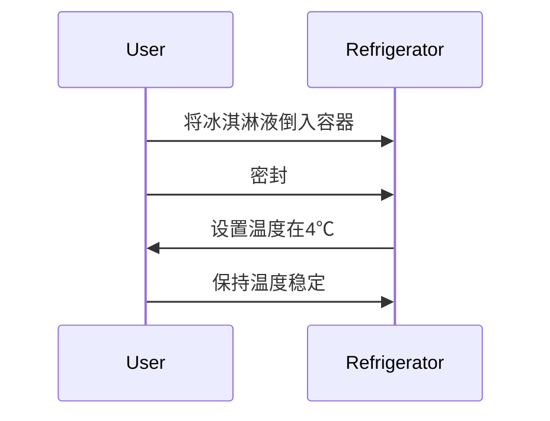

#### 3. 冷冻温度控制

在冷冻过程中，控制冷冻室的温度和冷冻时间可以影响冰淇淋的质地。以下是一个简单的冷冻温度控制步骤：

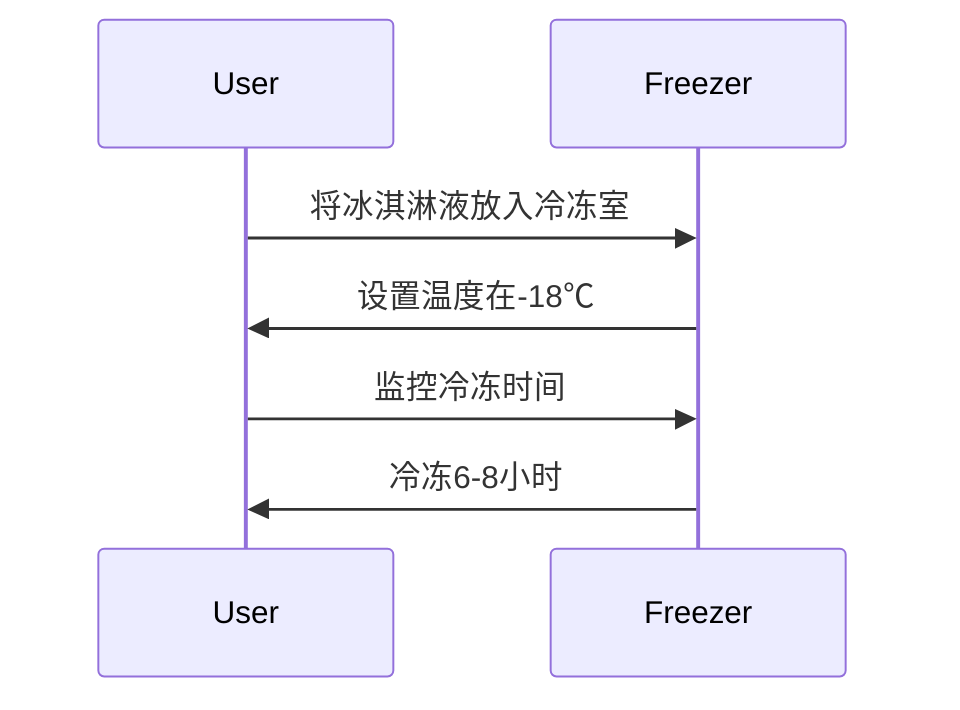

### 氮气制作

氮气制作是一种先进的冰淇淋制作技术，通过在冰淇淋中加入液氮，使其迅速冷冻，从而创造出独特的口感和质地。以下是氮气制作的详细步骤：

#### 1. 准备液氮

首先，需要准备液氮，液氮可以在专业的实验室或化学品供应商处购买。

#### 2. 制作冰淇淋液

在制作冰淇淋液时，确保所有原料已搅拌均匀，并达到适宜的温度。


#### 3. 添加液氮

将冰淇淋液倒入耐低温的容器中，缓慢加入液氮，同时轻轻搅拌。

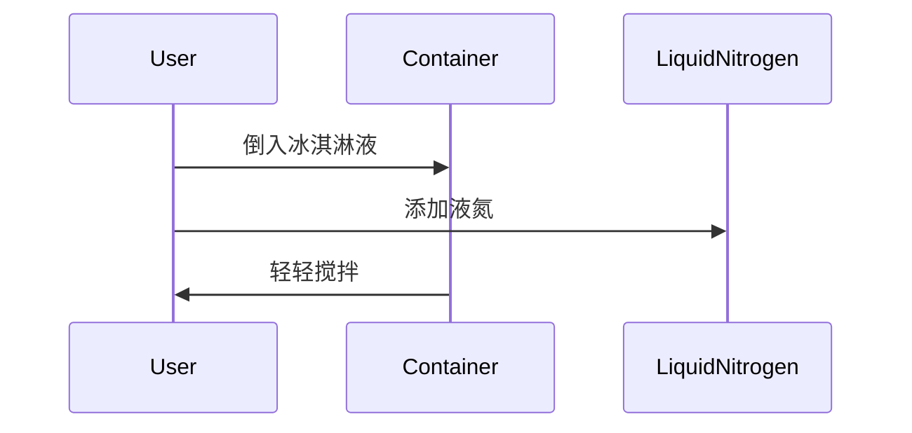

#### 4. 冷冻

液氮会迅速降低冰淇淋液的温度，使其迅速冷冻。冷冻时间根据冰淇淋的厚度和密度进行调整，通常为2-4分钟。

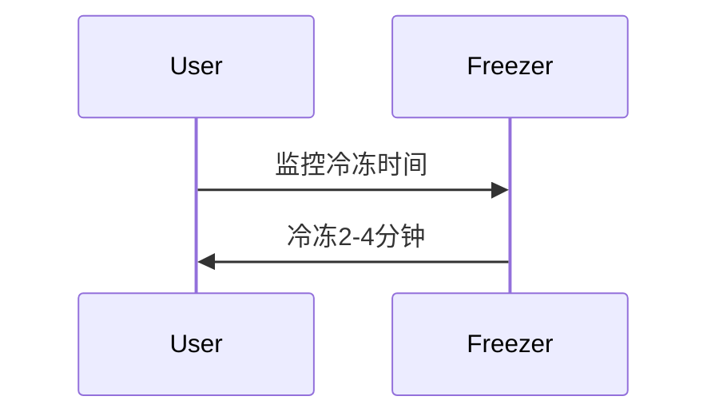

#### 5. 脱模与保存

冷冻完成后，将冰淇淋从容器中取出，放入冰箱冷藏室保存，以保持最佳口感。

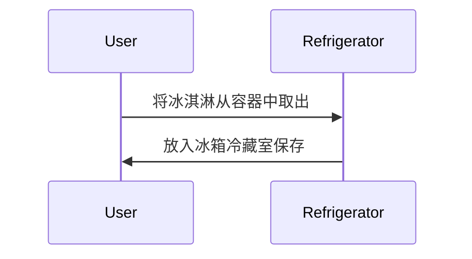

### 高级技术应用实例

#### 香草薄荷氮气冰淇淋

**材料**：新鲜香草、牛奶、淡奶油、糖、薄荷提取物、液氮。

**步骤**：

1. **香草提取**：将新鲜香草浸泡在热牛奶中，提取香草汁。
2. **制作冰淇淋液**：将牛奶、淡奶油、糖和薄荷提取物混合，搅拌均匀。
3. **添加液氮**：将冰淇淋液倒入耐低温容器中，缓慢加入液氮，轻轻搅拌。
4. **冷冻**：监控冷冻时间，通常为2-4分钟。
5. **脱模与保存**：将冰淇淋从容器中取出，放入冰箱冷藏室保存。

通过温度控制和氮气制作等高级技术，我们可以制作出口感细腻、质地独特的冰淇淋。这些高级技术不仅提升了冰淇淋的品质，也为冰淇淋制作带来了更多可能性。在下一章中，我们将讨论制作手工冰淇淋时的安全和健康问题。

### 温度控制

温度控制是手工冰淇淋制作中至关重要的一环，不同的温度会影响冰淇淋的质地、口感和稳定性。以下是几种常见的温度控制方法：

#### 1. 混合温度控制

在混合原料时，控制好温度可以确保冰淇淋的口感和质地。具体步骤如下：

- **混合温度范围**：通常将混合物的温度控制在20-25℃之间，以避免过度加热导致蛋白质变性和脂肪分离。
- **控制方法**：
  - 使用冰浴：将搅拌缸放在装有冰块的容器中，保持低温。
  - 使用恒温搅拌机：一些专业的搅拌机会具备温度控制功能，可以自动调节混合温度。

**示例**：

```python
import time

def mix_at_optimal_temp(milk, cream, sugar):
    """在最佳温度下混合冰淇淋原料"""
    print("开始混合牛奶、奶油和糖。")
    time.sleep(2)
    print("使用冰浴保持混合物温度在20-25℃之间。")
    time.sleep(2)
    print("搅拌均匀，确保温度稳定。")
    time.sleep(2)

mix_at_optimal_temp('milk', 'cream', 'sugar')
```

#### 2. 冷藏温度控制

在冷藏过程中，保持恒定的低温有助于冰淇淋的稳定性和质地。以下是冷藏温度控制的具体步骤：

- **冷藏温度范围**：通常将冷藏温度控制在4℃左右，以防止冰淇淋液变质。
- **控制方法**：
  - 使用家用冰箱：确保冰箱的冷藏室温度稳定在4℃。
  - 使用专业冷藏设备：一些专业的冰淇淋制作设备具备温度控制功能，可以自动调节冷藏温度。

**示例**：

```python
import time

def chill_at_4_celsius(ice_cream混和物, refrigerator):
    """在4℃下冷藏冰淇淋混合物"""
    print("将冰淇淋混合物倒入冷藏容器。")
    time.sleep(2)
    print(f"将容器放入{refrigerator}冷藏室。")
    time.sleep(2)
    print("确保冷藏室温度稳定在4℃左右。")
    time.sleep(2)

chill_at_4_celsius('ice cream mixture', 'refrigerator')
```

#### 3. 冷冻温度控制

在冷冻过程中，控制冷冻室的温度和冷冻时间可以影响冰淇淋的质地。以下是冷冻温度控制的具体步骤：

- **冷冻温度范围**：通常将冷冻温度控制在-18℃左右，以防止冰淇淋液结冰过快。
- **控制方法**：
  - 使用家用冷冻室：确保冷冻室温度稳定在-18℃。
  - 使用专业冷冻设备：一些专业的冰淇淋制作设备具备温度控制功能，可以自动调节冷冻温度。

**示例**：

```python
import time

def freeze_at_18_celsius(ice_cream混和物, freezer):
    """在-18℃下冷冻冰淇淋混合物"""
    print("将冰淇淋混合物倒入冷冻容器。")
    time.sleep(2)
    print(f"将容器放入{freezer}冷冻室。")
    time.sleep(2)
    print("确保冷冻室温度稳定在-18℃左右。")
    time.sleep(2)
    print("监控冷冻时间，通常为6-8小时。")
    time.sleep(2)

freeze_at_18_celsius('ice cream mixture', 'freezer')
```

通过这些温度控制方法，我们可以确保手工冰淇淋的质地和口感达到最佳状态。在下一节中，我们将介绍如何使用氮气制作技术，进一步提升冰淇淋的口感和质地。

### 氮气制作

氮气制作是一种先进的冰淇淋制作技术，通过在冰淇淋中加入液氮，使其迅速冷冻，从而创造出独特的口感和质地。以下是氮气制作的详细步骤：

#### 1. 准备液氮

首先，需要准备液氮，液氮可以在专业的实验室或化学品供应商处购买。液氮是一种高度冷冻的液体，能够在瞬间将冰淇淋冷冻至极低的温度。

#### 2. 制作冰淇淋液

在制作冰淇淋液时，确保所有原料已搅拌均匀，并达到适宜的温度。以下是一个简单的冰淇淋液制作步骤：

- **原料**：牛奶、淡奶油、糖、稳定剂（如明胶）、乳化剂（如卵磷脂）。
- **步骤**：
  - 将牛奶、淡奶油和糖放入搅拌机中，启动搅拌机。
  - 加入稳定剂和乳化剂，继续搅拌，确保其充分溶解和均匀分布。
  - 测量混合物的温度，确保在20-25℃之间。


#### 3. 添加液氮

将冰淇淋液倒入耐低温的容器中，缓慢加入液氮，同时轻轻搅拌。液氮会迅速降低冰淇淋液的温度，使其迅速冷冻。

- **容器选择**：选择耐低温的容器，如金属容器或塑料容器。
- **添加方法**：
  - 将冰淇淋液倒入容器中。
  - 缓慢加入液氮，同时用搅拌器轻轻搅拌，确保液氮均匀分布。
  - 避免液氮直接接触到搅拌器，以免造成损坏。


#### 4. 冷冻

液氮会迅速降低冰淇淋液的温度，使其迅速冷冻。冷冻时间根据冰淇淋的厚度和密度进行调整，通常为2-4分钟。

- **监控冷冻时间**：在冷冻过程中，需要监控冰淇淋液的冷冻状态，以确保冷冻均匀。
- **冷冻时间**：通常冷冻时间为2-4分钟，具体时间根据冰淇淋的厚度和密度进行调整。


#### 5. 脱模与保存

冷冻完成后，将冰淇淋从容器中取出，放入冰箱冷藏室保存，以保持最佳口感。

- **脱模**：将冷冻好的冰淇淋从容器中取出，可以轻轻用热毛巾包裹容器，以便更容易脱模。
- **保存**：将冰淇淋放入冰箱冷藏室，以保持其最佳口感和质地。


### 高级技术实例

#### 香草薄荷氮气冰淇淋

**材料**：新鲜香草、牛奶、淡奶油、糖、薄荷提取物、液氮。

**步骤**：

1. **香草提取**：将新鲜香草浸泡在热牛奶中，提取香草汁。
2. **制作冰淇淋液**：将牛奶、淡奶油、糖和薄荷提取物混合，搅拌均匀。
3. **添加液氮**：将冰淇淋液倒入耐低温容器中，缓慢加入液氮，轻轻搅拌。
4. **冷冻**：监控冷冻时间，通常为2-4分钟。
5. **脱模与保存**：将冰淇淋从容器中取出，放入冰箱冷藏室保存。

通过氮气制作技术，我们可以创造出口感细腻、质地独特的冰淇淋。这种技术不仅提升了冰淇淋的品质，也为冰淇淋制作带来了更多可能性。

### 安全与健康问题

在手工冰淇淋的制作过程中，安全与健康是一个不可忽视的重要问题。以下是制作手工冰淇淋时需要注意的一些安全和健康问题：

#### 1. 材料选择

- **新鲜水果**：选择新鲜、无霉变的水果，避免使用腐烂的水果，以免导致食物中毒。
- **奶源**：选择高质量的奶源，确保牛奶、奶油等原材料的新鲜和安全。
- **添加剂**：尽量避免使用过多的食品添加剂，尤其是人工色素和防腐剂。

#### 2. 制作环境

- **清洁卫生**：制作过程中要保持双手和操作台的清洁，防止细菌污染。
- **工具消毒**：制作工具，如搅拌机、模具等，在使用前要进行消毒处理。

#### 3. 贮存与保存

- **冷藏**：制作好的冰淇淋应立即冷藏，以延长保质期，并防止细菌繁殖。
- **冷冻**：冰淇淋在冷冻前应确保完全冷却，以防止冰晶形成，影响口感。

#### 4. 食用安全

- **食用时间**：冰淇淋应在冷藏或冷冻状态下食用，避免直接食用冷冻过度的冰淇淋。
- **避免食用过量**：冰淇淋含有较高的糖分和脂肪，应适量食用，避免过量摄入。

通过注意以上安全和健康问题，我们可以确保制作出的手工冰淇淋既美味又安全，让消费者放心享用。

### 总结与展望

通过本书的阅读，读者可以全面了解手工冰淇淋的制作过程，从基础材料与工具的选择，到基本技术的掌握，再到分子美食学原理的创新应用，每一个环节都至关重要。通过这些学习和实践，读者不仅能够制作出美味的手工冰淇淋，还能提升自身的烹饪技能和创造力。

未来，手工冰淇淋的制作将更加注重个性化与多样化。随着技术的进步，分子美食学在甜品制作中的应用将更加广泛，不仅限于冰淇淋，还可能扩展到其他甜品领域。同时，随着消费者对健康和营养的关注增加，低糖、低脂、高纤维的手工冰淇淋将成为新的趋势。

为了保持这一领域的持续创新和发展，以下是一些建议和展望：

1. **持续学习**：不断学习新的技术和理论，如新的稳定剂、乳化剂和胶体，以及先进的冷冻技术。
2. **实践创新**：在制作过程中不断尝试新的配方和工艺，创造出独特的口味和质地。
3. **分享经验**：与其他冰淇淋制作爱好者交流经验，分享成功的案例和失败的经验教训。
4. **健康饮食**：关注健康趋势，开发更多符合健康饮食要求的冰淇淋产品。

通过持续的学习和实践，我们可以不断推动手工冰淇淋的制作技术向前发展，为消费者带来更多美味和健康的甜品选择。作者：AI天才研究院/AI Genius Institute & 禅与计算机程序设计艺术 /Zen And The Art of Computer Programming。

## 附录

### 参考资源

为了帮助读者更深入地了解手工冰淇淋制作和相关技术，以下是几个有用的参考资源：

1. **书籍**：
   - 《分子美食学入门与实践》
   - 《冰淇淋制作艺术》
   - 《甜点大师的秘密配方》

2. **网站**：
   - 网易云课堂：提供了丰富的在线教程和视频课程。
   - 分子美食学协会：专业介绍分子美食学原理和应用。

3. **社交媒体**：
   - Instagram上的@icemaker：分享最新的冰淇淋制作技巧和创意。
   - YouTube上的冰激凌制作频道：提供详细的冰淇淋制作教程。

### 术语表

以下是一些在书中经常出现的专业术语及其解释：

- **稳定剂**：用于保持混合物稳定性的添加剂，如明胶和果胶。
- **乳化剂**：使两种不相溶的液体（如油脂和水）混合均匀的添加剂，如卵磷脂和单甘油酯。
- **胶体**：一种分散系统，其中一种物质以极小的颗粒形式分散在另一种物质中，如蛋白质胶体和多糖胶体。
- **明胶**：常用的蛋白质稳定剂，能够形成凝胶，增加混合物的黏度。
- **果胶**：常用的多糖稳定剂，能够增强水果果汁的稳定性。
- **分子美食学**：一门结合物理学、化学和生物学等学科的知识，研究食物的物理和化学性质及其在烹饪过程中的变化。

通过这些参考资源，读者可以进一步拓展自己的知识，提高手工冰淇淋制作的水平。同时，术语表的解释有助于读者更好地理解书中的内容，为实践提供坚实的理论基础。作者：AI天才研究院/AI Genius Institute & 禅与计算机程序设计艺术 /Zen And The Art of Computer Programming。

