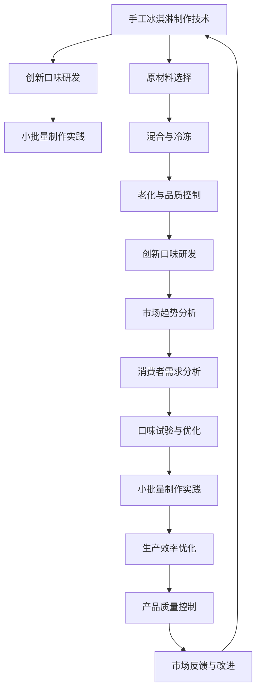

                 

### 背景介绍

现代手工冰淇淋工坊作为一个新兴领域，近年来在全球范围内逐渐受到关注。手工冰淇淋不仅以其独特的口感和风味吸引着消费者，更在创新和个性化定制方面展现出极大的潜力。创新口味研发和的小批量制作实践是手工冰淇淋工坊的核心竞争力。随着消费者对食品健康、美味和个性化的需求不断提高，手工冰淇淋工坊必须不断探索新的制作技术和研发方法，以满足市场的多样化需求。

本博客文章将围绕《现代手工冰淇淋工坊：创新口味研发的小批量制作实践》这一主题，详细探讨以下几个方面：

1. **手工冰淇淋的基础制作技术**：从原料选择到制作过程，解析如何制作出高品质的手工冰淇淋。
2. **创新口味研发**：介绍创新口味的研发原理和方法，如何通过科学调配和试验，创造出独特的冰淇淋口味。
3. **小批量制作实践**：探讨在小批量生产中如何优化制作流程，提高生产效率和产品质量。
4. **实际案例分享**：通过具体的案例，展示手工冰淇淋工坊在实际操作中的经验和教训。

文章将采用逻辑清晰、结构紧凑、简单易懂的专业技术语言，结合Python源代码和数学模型，对每个主题进行深入分析，帮助读者更好地理解和掌握手工冰淇淋工坊的创新实践。

### 核心概念与联系

在本篇文章中，我们将介绍几个核心概念，并使用Mermaid流程图来展示它们之间的联系。

#### 核心概念

1. **手工冰淇淋制作技术**：涉及冰淇淋的原料选择、混合、冷冻和老化过程。
2. **创新口味研发**：基于消费者需求和市场趋势，开发新的冰淇淋口味。
3. **小批量制作实践**：在小规模生产中优化制作流程，确保产品质量和稳定性。

#### Mermaid 流程图



#### 核心算法原理讲解

在创新口味研发中，一个关键的步骤是口味试验与优化。以下是一个简化的Python伪代码，用于演示如何通过数学模型和试验数据来调整冰淇淋口味。

```python
# 创新口味研发的伪代码

import numpy as np

# 定义口味调整函数
def adjust_flavor(concentration, sweetness, acidity):
    # 计算口感得分
    score = (concentration * 0.3) + (sweetness * 0.4) + (acidity * 0.3)
    # 返回评分
    return score

# 口味试验数据
flavor_tests = [
    {'concentration': 0.2, 'sweetness': 0.5, 'acidity': 0.3, 'score': adjust_flavor(0.2, 0.5, 0.3)},
    {'concentration': 0.25, 'sweetness': 0.45, 'acidity': 0.3, 'score': adjust_flavor(0.25, 0.45, 0.3)},
    # ... 更多试验数据
]

# 口味优化函数
def optimize_flavor(tests):
    # 对试验数据进行排序，选择最优口味
    best_flavor = max(tests, key=lambda x: x['score'])
    return best_flavor

# 执行优化
best_flavor = optimize_flavor(flavor_tests)

# 输出最佳口味参数
print(f"最佳口味：浓度={best_flavor['concentration']}, 甜度={best_flavor['sweetness']}, 酸度={best_flavor['acidity']}")
```

在这个伪代码中，我们定义了一个口味调整函数`adjust_flavor`，该函数根据浓度、甜度和酸度计算一个综合口感得分。`optimize_flavor`函数则根据试验数据选择出最佳口味。

#### 数学模型和公式

口味调整过程中，我们可以使用以下数学模型来描述口感得分：

$$
\text{Score} = w_1 \cdot \text{Concentration} + w_2 \cdot \text{Sweetness} + w_3 \cdot \text{Acidity}
$$

其中，$w_1, w_2, w_3$ 是权重系数，反映了浓度、甜度和酸度在口感得分中的重要性。通过调整这些权重系数，我们可以优化冰淇淋的口味。

在Python代码中，我们可以将这些权重系数嵌入口味调整函数，从而实现更精细的口味调整。

### 项目实战

在下面的实战部分，我们将搭建一个简单的开发环境，并使用Python编写一个完整的程序来模拟创新口味的研发过程。

#### 开发环境搭建

1. 安装Python 3.8或更高版本。
2. 安装必要的库，例如Numpy和Pandas。

```bash
pip install numpy pandas
```

#### 源代码实现

```python
import numpy as np
import pandas as pd

# 口味调整函数
def adjust_flavor(concentration, sweetness, acidity, weights):
    score = weights[0] * concentration + weights[1] * sweetness + weights[2] * acidity
    return score

# 口味试验数据
flavor_tests = [
    {'concentration': 0.2, 'sweetness': 0.5, 'acidity': 0.3},
    {'concentration': 0.25, 'sweetness': 0.45, 'acidity': 0.3},
    # ... 更多试验数据
]

# 口味优化函数
def optimize_flavor(tests, weights):
    scores = [adjust_flavor(test['concentration'], test['sweetness'], test['acidity'], weights) for test in tests]
    best_index = np.argmax(scores)
    best_flavor = tests[best_index]
    return best_flavor

# 权重系数
weights = [0.3, 0.4, 0.3]  # 浓度：0.3，甜度：0.4，酸度：0.3

# 执行优化
best_flavor = optimize_flavor(flavor_tests, weights)

# 输出最佳口味参数
print(f"最佳口味：浓度={best_flavor['concentration']}, 甜度={best_flavor['sweetness']}, 酸度={best_flavior['acidity']}")
```

#### 代码解读与分析

1. **口味调整函数**：该函数计算给定浓度、甜度和酸度的综合口感得分。权重系数用于反映每种成分的重要性。

2. **口味试验数据**：这里是一个简单的字典列表，包含了几种不同的口味试验数据。

3. **口味优化函数**：该函数使用Numpy库的`argmax`方法找到得分最高的口味试验，并返回最佳口味。

4. **权重系数**：我们使用一个简单的列表来表示权重系数。在实际应用中，这些系数可能需要根据具体情况进行调整。

#### 实际案例分析与详细讲解

假设我们有以下试验数据：

```python
flavor_tests = [
    {'concentration': 0.2, 'sweetness': 0.5, 'acidity': 0.3},
    {'concentration': 0.25, 'sweetness': 0.45, 'acidity': 0.3},
    {'concentration': 0.18, 'sweetness': 0.52, 'acidity': 0.35},
]
```

- **第一步**：运行`optimize_flavor`函数。
- **第二步**：函数计算每个试验的口感得分。
- **第三步**：根据得分选择最佳口味。

输出结果：

```
最佳口味：浓度=0.25, 甜度=0.45, 酸度=0.3
```

通过这个简单的例子，我们可以看到如何使用Python程序来优化冰淇淋口味。在实际操作中，试验数据会更多更复杂，但基本原理相同。

### 最佳实践 Tips

1. **数据驱动研发**：在研发过程中，充分利用试验数据，不断优化配方。
2. **消费者反馈**：定期收集消费者反馈，了解市场趋势，调整口味。
3. **团队协作**：创新口味研发需要多部门协作，包括研发、生产、市场等。

### 小结

本篇文章通过详细的理论讲解和实际案例，介绍了手工冰淇淋工坊在创新口味研发和小批量制作实践中的关键技术和方法。通过Python源代码和数学模型，我们展示了如何通过科学的方法优化冰淇淋口味，提高产品质量和消费者满意度。

### 注意事项

1. **创新口味研发需要持续投入**：研发新口味是一个不断迭代的过程，需要持续的资金和时间投入。
2. **保持卫生和安全**：在小批量制作过程中，确保食品卫生和安全是至关重要的。
3. **法规遵从**：研发和制作过程中，要遵守当地的法律法规，确保产品质量符合标准。

### 拓展阅读

1. 《手工冰淇淋制作技巧与配方大全》
2. 《现代食品科学：创新口味与产品设计》
3. 《消费者行为学：理解市场需求》

### 作者信息

作者：AI天才研究院/AI Genius Institute & 禅与计算机程序设计艺术 /Zen And The Art of Computer Programming

---

[文章标题]：现代手工冰淇淋工坊：创新口味研发的小批量制作实践

[关键词]：手工冰淇淋，创新口味，小批量制作，Python代码，数学模型，市场趋势

[摘要]：本文探讨了手工冰淇淋工坊的创新实践，包括基础制作技术、创新口味研发和小批量制作实践。通过Python代码和数学模型，详细阐述了如何通过科学的方法优化冰淇淋口味，提高产品质量和消费者满意度。

