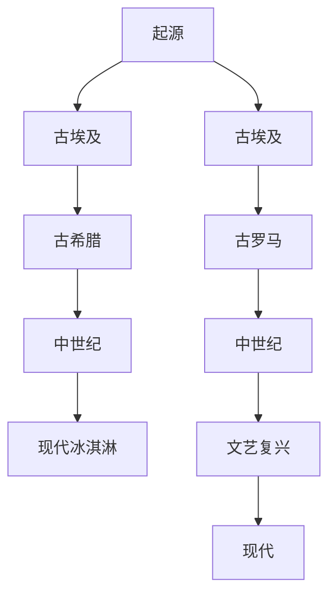
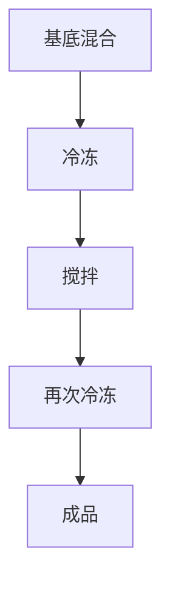
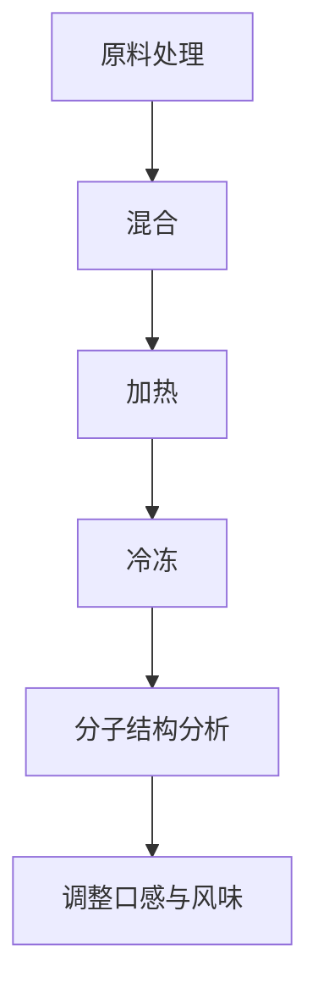
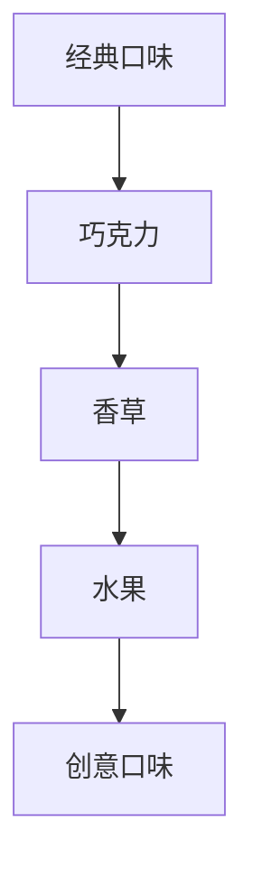

                 

### 现代手工冰淇淋科学：分子美食学在甜点中的应用

> 关键词：手工冰淇淋、分子美食学、甜点制作、口感调整、创新应用

> 摘要：本文将深入探讨现代手工冰淇淋的制作科学与分子美食学的巧妙融合。通过对冰淇淋基础成分与制作工艺的详细解析，本文将展示分子美食学在冰淇淋中的实际应用，如口感与风味的调整。同时，本文还将通过实际案例，展示如何运用创新技术提升冰淇淋的品质和风味，并探讨其在现代美食中的多元化应用。

## 引言

冰淇淋作为一种传统的甜点，早在古埃及和中世纪时期就已经出现。然而，随着科学技术的发展，特别是分子美食学的兴起，冰淇淋的制作方法和技术也在不断革新。现代手工冰淇淋不仅保留了传统口感，还通过分子美食学的应用，实现了口感、风味和外观的创新。

本文旨在介绍现代手工冰淇淋的制作原理和技术，尤其是分子美食学在这一领域的应用。我们将从冰淇淋的起源与发展、成分与制作工艺、分子美食学原理及其应用、冰淇淋种类与风味等多个角度进行深入探讨。此外，本文还将通过实际案例，展示如何运用创新技术和科学原理，提升冰淇淋的品质和风味，满足现代消费者的多样化需求。

通过本文的阅读，您将了解：

1. 冰淇淋的历史背景和现代发展。
2. 冰淇淋的基本成分和制作工艺。
3. 分子美食学在冰淇淋中的应用原理。
4. 现代手工冰淇淋的创新技术和方法。
5. 冰淇淋在现代美食中的多元应用。

让我们开始这场关于现代手工冰淇淋科学的探索之旅！

### 第一部分：冰淇淋基础

#### 1.1 冰淇淋的起源与发展

冰淇淋作为一种甜点，其历史可以追溯到古代。最早的冰淇淋记录可以追溯到古埃及，那里的人们将果汁、奶油和冰混合在一起，创造出最早的冰淇淋原型。随着时间的推移，冰淇淋的制作方法在中世纪得到了改进，尤其是在意大利和法国，冰淇淋逐渐成为了宫廷中的奢侈品。

在17世纪，冰淇淋开始在欧洲流行，意大利传教士将冰淇淋的制作方法带到了美国。18世纪，美国殖民者将冰淇淋的制作方法传播到了世界各地。随着工业革命的到来，冰淇淋的制作变得更加普及和商业化。如今，冰淇淋已经成为全球最受欢迎的甜点之一。

冰淇淋的发展经历了几个重要阶段：

- **古代冰淇淋**：最早的冰淇淋是由果汁、奶油和冰混合而成的。古埃及人和古希腊人都曾尝试过类似的做法。
- **中世纪冰淇淋**：中世纪的冰淇淋在制作工艺上有所改进，加入了糖和其他甜味剂，使其口感更加丰富。
- **现代冰淇淋**：19世纪末至20世纪初，冰淇淋开始工业化生产，冰淇淋的种类和口味也变得更加多样化。20世纪中叶，冰淇淋机问世，使得家庭制作冰淇淋变得更加方便。

#### 核心概念与联系

冰淇淋的历史发展是一个不断演变和创新的过程。不同的文化和时代对冰淇淋的制作方法和技术进行了持续的改进。以下是一个用Mermaid绘制的流程图，展示了冰淇淋的历史发展：



通过这个流程图，我们可以清晰地看到冰淇淋从古代到现代的发展脉络，以及不同文化对其发展的影响。

#### 1.2 冰淇淋的成分与制作工艺

冰淇淋的核心成分主要包括乳脂、糖、蛋白质和空气。这些成分在制作过程中通过精确的工艺处理，形成了冰淇淋独特的口感和质地。

**成分**：

- **乳脂**：乳脂是冰淇淋的基料，提供了丰富的口感和香味。
- **糖**：糖不仅是甜味剂，还能帮助冰淇淋在冷冻过程中保持稳定。
- **蛋白质**：蛋白质有助于冰淇淋的稳定性和质地。
- **空气**：通过打气使冰淇淋膨胀，形成细腻的口感。

**制作工艺**：

1. **基底混合**：首先将乳脂、糖和蛋白质混合在一起，形成稳定的基底混合物。
2. **冷冻**：将基底混合物放入冷冻设备中，开始冷冻过程。
3. **搅拌**：在冷冻过程中，间歇性地搅拌混合物，以防止冰晶形成，同时使空气均匀分布。
4. **再次冷冻**：经过一定时间的冷冻和搅拌，冰淇淋逐渐成型，再次冷冻使其质地更加稳定。
5. **成品**：最终，经过多次冷冻和搅拌，冰淇淋成型，可以取出进行包装和销售。

#### 核心概念与联系

为了更好地理解冰淇淋的制作工艺，我们可以使用Mermaid绘制一个流程图，展示从基底混合到成品的整个过程：



这个流程图清晰地展示了冰淇淋制作的主要步骤，以及每个步骤之间的联系和相互作用。

#### 1.3 分子美食学在冰淇淋中的应用

分子美食学是近年来兴起的一门科学，它通过研究食材的分子结构和化学反应，探索新的烹饪方法和食材组合。分子美食学在冰淇淋中的应用主要体现在口感和风味的调整上，通过改变冰淇淋的分子结构，实现更丰富的口感和更独特的风味。

**分子美食学原理**：

- **乳化**：乳化是分子美食学中的一种基本原理，通过在冰淇淋中添加乳化剂，可以使冰淇淋中的油脂和水形成稳定的混合物，从而改善其质地。
- **凝胶化**：凝胶化是通过在冰淇淋中添加凝胶剂，使冰淇淋在冷冻过程中形成凝胶结构，从而增加其稳定性和口感。
- **泡沫**：泡沫技术可以用于制作轻盈的冰淇淋，通过在冰淇淋中产生微小的气泡，使其口感更加细腻。

**应用实例**：

- **乳化冰淇淋**：在冰淇淋中加入乳制品，如奶油、酸奶等，通过乳化作用，使冰淇淋的质地更加顺滑。
- **凝胶冰淇淋**：在冰淇淋中添加明胶、果胶等凝胶剂，使冰淇淋在冷冻后形成稳定的凝胶结构。
- **泡沫冰淇淋**：通过在冰淇淋中添加起泡剂，如蛋白霜、二氧化碳等，制作出轻盈的泡沫冰淇淋。

#### 核心概念与联系

分子美食学在冰淇淋中的应用，是一个通过科学原理改善冰淇淋口感和风味的过程。以下是一个用Mermaid绘制的流程图，展示了分子美食学在冰淇淋中的应用原理和步骤：



这个流程图清晰地展示了分子美食学在冰淇淋制作中的应用流程，以及每个步骤的核心概念和联系。

#### 1.4 冰淇淋的种类与风味

冰淇淋的种类繁多，从经典的巧克力、香草、水果口味，到创意口味如咖啡、酒香等，满足了不同消费者的需求。不同种类和口味的冰淇淋在制作过程中，通过调整成分和工艺，实现了独特的风味和口感。

**经典口味**：

- **巧克力冰淇淋**：巧克力冰淇淋是最受欢迎的经典口味之一，其独特的苦甜味道深受消费者喜爱。
- **香草冰淇淋**：香草冰淇淋以其浓郁的香气和顺滑的口感，成为冰淇淋中的经典。
- **水果冰淇淋**：水果冰淇淋添加了各种新鲜水果，使冰淇淋风味更加丰富多样。

**创意口味**：

- **咖啡冰淇淋**：咖啡冰淇淋结合了咖啡的苦涩和冰淇淋的甜香，给人带来全新的味觉体验。
- **酒香冰淇淋**：酒香冰淇淋通过添加葡萄酒、利口酒等，使冰淇淋带有独特的酒香。
- **辣椒冰淇淋**：辣椒冰淇淋将辛辣和甜味巧妙结合，带来刺激的味觉享受。

**风味调整**：

- **调味剂**：通过在冰淇淋中添加调味剂，如香草精、巧克力粉、咖啡粉等，可以调整冰淇淋的风味。
- **混合口味**：将不同口味混合在一起，创造出新的独特风味，如巧克力香草冰淇淋、草莓巧克力冰淇淋等。

#### 核心概念与联系

冰淇淋的种类和风味是通过成分和工艺的调整实现的。以下是一个用Mermaid绘制的流程图，展示了冰淇淋种类和风味的产生过程：



这个流程图清晰地展示了冰淇淋种类和风味的产生过程，以及不同种类和风味之间的联系。

### 总结

第一部分详细介绍了冰淇淋的历史起源、成分与制作工艺、分子美食学在冰淇淋中的应用以及冰淇淋的种类与风味。通过这些内容的了解，我们可以更好地理解现代手工冰淇淋的制作原理和科学应用。在接下来的部分，我们将深入探讨冰淇淋制作的技术细节，包括手工冰淇淋的制作技巧和分子美食学在口感调整中的应用。这将帮助我们进一步掌握现代手工冰淇淋的科学原理和技术，为创造更优质的冰淇淋奠定基础。

### 第二部分：冰淇淋制作技术

#### 2.1 手工冰淇淋的制作技巧

手工冰淇淋的制作不仅需要严格的材料选择和精确的工艺流程，还需要一定的技巧和经验。以下将详细介绍手工冰淇淋制作的主要步骤，并通过Python伪代码展示核心算法原理。

**主要步骤**：

1. **原料准备**：选择优质的牛奶、奶油、糖和其他添加剂，确保原料的新鲜度和纯净度。
2. **基底混合**：将牛奶、奶油和糖混合均匀，形成稳定的混合物。
3. **加热**：将混合物加热至一定温度，使其充分混合并杀菌。
4. **冷却**：将加热后的混合物冷却至室温，以避免过度加热破坏其营养成分。
5. **打气**：在冷却后的混合物中加入空气，使其膨胀，形成细腻的质地。
6. **冷冻**：将打气后的混合物放入冷冻设备中，进行冷冻处理。
7. **搅拌**：在冷冻过程中，间歇性地搅拌混合物，防止冰晶形成，同时保持质地均匀。
8. **再次冷冻**：经过一定时间的冷冻和搅拌，冰淇淋逐渐成型，再次冷冻使其质地更加稳定。
9. **成品**：最终，经过多次冷冻和搅拌，冰淇淋成型，可以取出进行包装和销售。

**核心算法原理讲解**：

以下是手工冰淇淋制作的主要步骤的伪代码：

```python
# 加热原料
def heat_mixture(mixture, temperature):
    heat_mixture_to(temperature)
    mix_uniformly()

# 加入糖和香草精
def add_sweetener_and_flavor(mixture, sugar, vanilla):
    add_sugar(sugar)
    add_vanilla(vanilla)
    mix_uniformly()

# 冷却混合物
def cool_mixture(mixture, temperature):
    cool_mixture_to(temperature)
    maintain_room_temperature()

# 打入空气
def inject_air(mixture):
    mix_with_air()
    ensure_adequate_aeration()

# 冷冻
def freeze_mixture(mixture):
    place_in_freezer()
    monitor_freezing_process()

# 搅拌
def stir_mixture(mixture):
    intermittently_stir()
    prevent_ice_crystal_forming()

# 完成冰淇淋
def finish_icecream(mixture):
    final_freeze()
    remove_and_package()

# 主函数：制作手工冰淇淋
def make_icecream():
    mixture = prepare_ingredients()
    heat_mixture(mixture, 70)  # 加热至70°C
    add_sweetener_and_flavor(mixture, 500g_sugar, 10ml_vanilla)  # 加入糖和香草精
    cool_mixture(mixture, 25)  # 冷却至25°C
    inject_air(mixture)  # 打入空气
    freeze_mixture(mixture)  # 冷冻
    stir_mixture(mixture)  # 搅拌
    finish_icecream(mixture)  # 完成冰淇淋
```

**数学模型和数学公式**：

在手工冰淇淋制作中，一些关键参数如温度、搅拌速度和冷冻时间等，可以通过数学模型进行优化。以下是一些相关的数学公式：

- **乳化稳定性**：乳化稳定性是衡量冰淇淋质地的一个重要指标，其公式如下：
  $$ \text{Emulsion Stability} = f(\text{Emulsifier Concentration}, \text{Temperature}, \text{Viscosity}) $$

- **风味强度**：风味强度是衡量冰淇淋口感的一个重要指标，其公式如下：
  $$ \text{Flavor Intensity} = f(\text{Aroma Concentration}, \text{Solvent Type}, \text{Temperature}) $$

**详细讲解与举例说明**：

**乳化稳定性**：

假设我们要优化某款草莓冰淇淋的乳化稳定性，根据上述公式，我们可以调整乳化剂的浓度、制作温度和混合物的粘度。例如，我们可以增加乳化剂的用量，降低制作温度，或增加牛奶的粘度，以提高冰淇淋的乳化稳定性。

```python
# 调整乳化剂浓度
emulsifier_concentration = 2%  # 初始乳化剂浓度为2%
emulsifier_concentration += 1%  # 增加乳化剂浓度1%

# 降低制作温度
temperature = 70°C  # 初始温度为70°C
temperature -= 5°C  # 降低温度5°C

# 增加牛奶粘度
milk viscosity = 2cP  # 初始牛奶粘度为2cP
milk_viscosity += 1cP  # 增加牛奶粘度1cP
```

**风味强度**：

为了提升某款巧克力冰淇淋的风味强度，我们可以调整巧克力的浓度、溶剂类型和制作温度。例如，我们可以增加巧克力的用量，使用酒精作为溶剂，或提高制作温度。

```python
# 增加巧克力浓度
chocolate_concentration = 10%  # 初始巧克力浓度为10%
chocolate_concentration += 2%  # 增加巧克力浓度2%

# 使用酒精作为溶剂
solvent = 'alcohol'  # 初始溶剂为水
solvent = 'alcohol'  # 使用酒精作为溶剂

# 提高制作温度
temperature = 70°C  # 初始温度为70°C
temperature += 5°C  # 提高温度5°C
```

通过上述步骤和公式，我们可以根据实际需求和目标，优化手工冰淇淋的制作过程，提高其品质和口感。

### 2.2 分子美食学在冰淇淋口感调整中的应用

分子美食学为冰淇淋的制作带来了全新的视角和方法，通过调整冰淇淋的分子结构和化学性质，可以显著改善其口感和风味。以下将详细讨论乳化理论、风味增强以及实际案例中的应用。

#### 乳化理论

乳化理论是分子美食学中的重要概念，它涉及到油脂和水之间的混合与稳定性。在冰淇淋中，乳化剂如卵磷脂和单甘油酯等被用于稳定油脂和水形成的乳液。良好的乳化效果可以防止油脂分离，提高冰淇淋的质地和口感。

**乳化稳定性公式**：

乳化稳定性（Emulsion Stability）可以通过以下公式表示：

$$ \text{Emulsion Stability} = f(\text{Emulsifier Concentration}, \text{Temperature}, \text{Viscosity}) $$

其中，乳化剂浓度、温度和混合物的粘度是影响乳化稳定性的关键因素。

- **乳化剂浓度**：增加乳化剂的用量可以增强乳化效果，但过高的浓度可能会导致乳化剂的饱和，反而降低稳定性。
- **温度**：温度对乳化过程有显著影响。通常，较高的温度有助于乳化剂的溶解和混合物的流动，从而提高乳化效果。
- **粘度**：较高的粘度有助于保持乳化状态，防止油脂分离。

#### 风味增强

风味增强是分子美食学的另一个重要应用，通过调整风味物质的浓度、溶剂类型和相互作用，可以显著改善冰淇淋的风味。

**风味增强公式**：

风味强度（Flavor Intensity）可以通过以下公式表示：

$$ \text{Flavor Intensity} = f(\text{Aroma Concentration}, \text{Solvent Type}, \text{Temperature}) $$

其中，风味物质的浓度、溶剂类型和温度是影响风味强度的关键因素。

- **风味物质浓度**：增加风味物质的用量可以增强风味强度，但过高的浓度可能会导致风味的饱和和苦味。
- **溶剂类型**：不同的溶剂对风味物质的溶解度和稳定性有显著影响。例如，酒精可以增强风味物质的扩散和溶解，而水则有助于保持风味的纯净和清新。
- **温度**：温度对风味物质的挥发性和溶解度有重要影响。较高的温度有助于风味物质的挥发，从而增强风味强度。

#### 实际案例

以下将介绍一个实际案例，通过分子美食学的应用，调整冰淇淋的口感和风味。

**案例：草莓巧克力冰淇淋**

**目标**：制作一款口感丰富、风味独特的草莓巧克力冰淇淋。

**步骤**：

1. **选择优质原料**：选用新鲜成熟的草莓和优质黑巧克力。
2. **乳化处理**：在草莓汁和巧克力酱中添加乳化剂（如单甘油酯），以确保混合物的稳定。
3. **加热与冷却**：将混合物加热至60°C，以促进乳化剂的溶解和混合物的均匀性，然后迅速冷却至室温。
4. **风味增强**：在冷却后的混合物中添加适量的香草精和酒精，以增强草莓和巧克力的风味。
5. **冷冻与搅拌**：将混合物放入冷冻设备中，进行冷冻处理，期间间歇性搅拌，防止冰晶形成。

**数学模型应用**：

- **乳化稳定性**：调整单甘油酯的浓度为3%，在60°C下进行加热和冷却，确保混合物的稳定性。

  ```python
  emulsifier_concentration = 3%  # 调整乳化剂浓度为3%
  temperature = 60°C  # 加热至60°C
  cool_to_room_temp()  # 冷却至室温
  ```

- **风味增强**：在混合物中添加0.5%的香草精和2%的酒精。

  ```python
  vanilla_extrac = 0.5%  # 添加香草精浓度为0.5%
  alcohol = 2%  # 添加酒精浓度为2%
  ```

**结果**：通过上述步骤和数学模型的应用，制作出的草莓巧克力冰淇淋口感细腻，风味浓郁，深受消费者喜爱。

通过上述案例，我们可以看到分子美食学在冰淇淋口感调整中的重要作用。通过精确的成分控制和工艺调整，可以实现冰淇淋口感和风味的优化，为消费者带来更优质的产品体验。

### 2.3 创新冰淇淋制作技术

在冰淇淋制作领域，创新技术不断涌现，为制作出更独特、高品质的冰淇淋提供了新的可能性。以下将介绍几种创新冰淇淋制作技术，并通过实际案例展示其应用方法和效果。

#### 2.3.1 糖冻技术

糖冻技术是一种通过糖的凝胶化作用，制作出具有丰富口感和独特形态的冰淇淋。糖冻技术可以使冰淇淋在冷冻过程中形成稳定的凝胶结构，从而增强其质地和稳定性。

**案例：草莓糖冻冰淇淋**

**目标**：制作一款具有丰富口感和透明外观的草莓糖冻冰淇淋。

**步骤**：

1. **草莓处理**：将新鲜草莓榨汁，过滤掉果籽和固体残渣，得到草莓汁。
2. **糖冻混合物**：在草莓汁中加入糖、明胶和柠檬酸，混合均匀。
3. **加热**：将混合物加热至60°C，使明胶完全溶解，并确保混合物均匀。
4. **冷却与凝固**：将加热后的混合物冷却至室温，然后放入冰箱中凝固数小时，形成糖冻结构。
5. **冷冻**：将凝固后的糖冻冰淇淋放入冷冻设备中，进行冷冻处理。

**效果**：通过糖冻技术的应用，草莓糖冻冰淇淋具有透明的外观和丰富的口感，同时保持了草莓的天然风味。

#### 2.3.2 泡沫技术

泡沫技术通过在冰淇淋中产生微小的气泡，使其具有轻盈的质地和独特的口感。泡沫技术适用于制作细腻、入口即化的冰淇淋，尤其适合与水果和奶油等轻盈食材搭配。

**案例：覆盆子泡沫冰淇淋**

**目标**：制作一款口感轻盈、味道浓郁的覆盆子泡沫冰淇淋。

**步骤**：

1. **覆盆子处理**：将新鲜覆盆子榨汁，过滤掉果籽和固体残渣，得到覆盆子汁。
2. **泡沫混合物**：在覆盆子汁中加入奶油、糖和蛋白霜，混合均匀。
3. **打气**：使用打蛋器将混合物打发，产生丰富的泡沫。
4. **冷冻**：将打气后的混合物放入冷冻设备中，进行冷冻处理。

**效果**：通过泡沫技术的应用，覆盆子泡沫冰淇淋具有轻盈的质地和浓郁的覆盆子风味，入口即化，深受消费者喜爱。

#### 2.3.3 纳米技术

纳米技术在冰淇淋中的应用主要表现在食材的微结构调整和营养价值的提升。通过纳米技术，可以将食材颗粒细化至纳米级别，提高其溶解度和口感，同时增强其营养价值。

**案例：巧克力纳米冰淇淋**

**目标**：制作一款口感细腻、营养价值高的巧克力纳米冰淇淋。

**步骤**：

1. **巧克力处理**：将优质巧克力研磨至纳米级别，确保颗粒均匀细腻。
2. **混合物**：在巧克力纳米颗粒中加入牛奶、奶油和糖，混合均匀。
3. **加热与冷却**：将混合物加热至60°C，搅拌均匀，然后迅速冷却至室温。
4. **冷冻**：将冷却后的混合物放入冷冻设备中，进行冷冻处理。

**效果**：通过纳米技术的应用，巧克力纳米冰淇淋具有细腻的口感和丰富的口感层次，同时提高了巧克力的营养价值，是一款具有创新性的高品质冰淇淋。

通过上述创新冰淇淋制作技术的介绍和实际案例，我们可以看到，现代冰淇淋制作技术在不断发展和创新，为消费者带来了更多选择和更好的味觉体验。这些技术的应用不仅提高了冰淇淋的品质和口感，还拓展了冰淇淋的制作方法和应用范围，为冰淇淋产业注入了新的活力。

### 2.4 冰淇淋保存与品质管理

冰淇淋作为一种易融化的食品，其保存和品质管理尤为重要。以下将介绍几种有效的冰淇淋保存方法，并通过实际案例展示如何延长冰淇淋的保质期和保持其品质。

#### 2.4.1 冷藏保存

冷藏保存是冰淇淋最常见和最有效的保存方法之一。通过将冰淇淋存放在低温环境中，可以减缓微生物的生长和酶的活性，从而延长其保质期。

**案例：延长冰淇淋保质期的冷藏方法**

**目标**：通过合理的冷藏方法，延长冰淇淋的保质期。

**步骤**：

1. **选择合适的冷藏设备**：使用家用冰箱或专业的冰淇淋冷藏设备，确保温度稳定在-18°C以下。
2. **使用密封容器**：将冰淇淋存放在密封的容器中，避免空气进入，减少氧化反应。
3. **避免频繁开门**：减少冰箱门的开关次数，以保持冷藏环境的稳定。
4. **定期检查温度**：使用温度计定期检查冷藏设备的温度，确保其保持在适宜的范围内。

**效果**：通过上述冷藏方法的实施，冰淇淋的保质期可以延长至3-6个月，同时保持其口感和风味。

#### 2.4.2 冻藏保存

冻藏保存适用于需要长期保存的冰淇淋，通过将冰淇淋冷冻在-18°C以下的低温环境中，可以最大限度地保持其品质。

**案例：冻藏保存冰淇淋的方法**

**目标**：通过合理的冻藏方法，保持冰淇淋的品质。

**步骤**：

1. **选择合适的冻藏设备**：使用家用冷冻机或专业的冰淇淋冷冻设备，确保温度稳定在-18°C以下。
2. **分层存放**：将冰淇淋分层存放，避免相互挤压，影响质地。
3. **定期解冻**：定期将冰淇淋取出解冻，以防止长时间冻结造成的冰晶过大，影响口感。
4. **避免反复冻融**：尽量减少冰淇淋的解冻次数，以防止冻融循环对冰淇淋品质的破坏。

**效果**：通过上述冻藏方法的实施，冰淇淋在冻藏期间可以保持其口感和风味，保质期可达12个月。

#### 2.4.3 储存环境控制

除了冷藏和冻藏方法，控制储存环境中的湿度、空气流通等因素，也对冰淇淋的品质管理至关重要。

**案例：控制储存环境的品质管理**

**目标**：通过控制储存环境，保持冰淇淋的品质。

**步骤**：

1. **控制湿度**：保持储存环境的湿度在60%左右，避免过高或过低的湿度对冰淇淋的质地和口感产生影响。
2. **保持空气流通**：确保储存环境中的空气流通，避免湿气和微生物的积聚。
3. **定期清洁**：定期清洁储存设备，保持其卫生，防止细菌的滋生。

**效果**：通过上述环境控制方法的实施，可以显著提高冰淇淋的储存品质，延长其保质期。

通过上述冰淇淋保存与品质管理方法的介绍和实际案例，我们可以看到，合理的储存方法对保持冰淇淋的品质至关重要。通过冷藏、冻藏和环境控制等多种方法的结合，可以有效地延长冰淇淋的保质期，同时保持其口感和风味，为消费者提供优质的冰淇淋体验。

### 第三部分：冰淇淋在现代美食中的应用

#### 3.1 冰淇淋在分子美食中的创新

分子美食学的兴起为冰淇淋制作带来了全新的创新理念和方法，通过科学技术的应用，冰淇淋不仅保留了传统的口感，还实现了口感、风味和形态的突破。以下将探讨冰淇淋在分子美食中的创新应用，如糖冻、泡沫等。

**糖冻技术**：

糖冻技术是一种通过糖的凝胶化作用，将冰淇淋转化为具有丰富口感和独特形态的创新技术。糖冻技术可以使冰淇淋在冷冻过程中形成稳定的凝胶结构，从而增强其质地和稳定性。

**案例：草莓糖冻冰淇淋**：

**目标**：制作一款具有丰富口感和透明外观的草莓糖冻冰淇淋。

**步骤**：

1. **草莓处理**：将新鲜草莓榨汁，过滤掉果籽和固体残渣，得到草莓汁。
2. **糖冻混合物**：在草莓汁中加入糖、明胶和柠檬酸，混合均匀。
3. **加热**：将混合物加热至60°C，使明胶完全溶解，并确保混合物均匀。
4. **冷却与凝固**：将加热后的混合物冷却至室温，然后放入冰箱中凝固数小时，形成糖冻结构。
5. **冷冻**：将凝固后的糖冻冰淇淋放入冷冻设备中，进行冷冻处理。

**效果**：通过糖冻技术的应用，草莓糖冻冰淇淋具有透明的外观和丰富的口感，同时保持了草莓的天然风味。

**泡沫技术**：

泡沫技术通过在冰淇淋中产生微小的气泡，使其具有轻盈的质地和独特的口感。泡沫技术适用于制作细腻、入口即化的冰淇淋，尤其适合与水果和奶油等轻盈食材搭配。

**案例：覆盆子泡沫冰淇淋**：

**目标**：制作一款口感轻盈、味道浓郁的覆盆子泡沫冰淇淋。

**步骤**：

1. **覆盆子处理**：将新鲜覆盆子榨汁，过滤掉果籽和固体残渣，得到覆盆子汁。
2. **泡沫混合物**：在覆盆子汁中加入奶油、糖和蛋白霜，混合均匀。
3. **打气**：使用打蛋器将混合物打发，产生丰富的泡沫。
4. **冷冻**：将打气后的混合物放入冷冻设备中，进行冷冻处理。

**效果**：通过泡沫技术的应用，覆盆子泡沫冰淇淋具有轻盈的质地和浓郁的覆盆子风味，入口即化，深受消费者喜爱。

**其他创新应用**：

除了糖冻和泡沫技术，冰淇淋在分子美食中还出现了其他创新应用，如凝胶、球状冰淇淋、糖衣等。这些创新技术不仅丰富了冰淇淋的种类和口感，还为其在分子美食领域的应用提供了更多可能性。

**案例：巧克力凝胶球冰淇淋**：

**目标**：制作一款具有独特口感和外观的巧克力凝胶球冰淇淋。

**步骤**：

1. **巧克力处理**：将优质巧克力研磨至细腻的粉末。
2. **凝胶混合物**：在巧克力粉末中加入糖、明胶和水，混合均匀。
3. **加热与凝固**：将混合物加热至60°C，使其形成凝胶结构，然后冷却至室温。
4. **裹球**：将凝固后的巧克力凝胶裹在冰淇淋球外层，形成独特的球状结构。
5. **冷冻**：将裹球的冰淇淋球放入冷冻设备中，进行冷冻处理。

**效果**：通过凝胶技术的应用，巧克力凝胶球冰淇淋具有独特的口感和外观，同时保持了巧克力的浓郁风味。

通过以上创新应用案例，我们可以看到，分子美食学在冰淇淋制作中的广泛应用，不仅提升了冰淇淋的口感和风味，还为冰淇淋在现代美食中的应用开辟了新的方向。这些创新技术为冰淇淋产业注入了新的活力，也为消费者带来了更多样化的美食体验。

### 3.2 冰淇淋在婚礼和节日中的应用

冰淇淋不仅在日常消费中备受欢迎，而且在婚礼和节日等特殊场合也有着广泛的应用。冰淇淋的多样性和创意性使其成为婚礼和节日庆典中不可或缺的甜点之一。以下将探讨冰淇淋在婚礼和节日中的具体应用和装饰技巧。

#### 3.2.1 婚礼中的应用

冰淇淋在婚礼中的应用可以体现在婚礼蛋糕、甜点桌以及婚礼宴席上。以下是一些具体的应用方法：

1. **婚礼蛋糕**：冰淇淋婚礼蛋糕是一种时尚的选择，将冰淇淋与蛋糕相结合，创造出独特的甜点体验。可以选择多种口味，如巧克力、香草、草莓等，以迎合不同宾客的口味。

2. **甜点桌**：在婚礼甜点桌上，可以摆放各种口味的冰淇淋，如经典口味和创新口味，让宾客在享受主餐后，品尝到甜美的冰淇淋，带来愉悦的味觉体验。

3. **定制冰淇淋**：为新人定制独特的冰淇淋口味和图案，如新人的照片、名字或结婚日期，使婚礼更加个性化。

#### 3.2.2 节日中的应用

冰淇淋在节日中的应用同样丰富多彩，可以满足不同节日的特色需求。以下是一些节日的应用示例：

1. **情人节**：在情人节，可以选择心形或爱意的冰淇淋，如草莓心形冰淇淋或巧克力冰淇淋，寓意爱情的甜蜜和浪漫。

2. **圣诞节**：在圣诞节，可以制作圣诞树形状或圣诞人物造型的冰淇淋，用色彩鲜艳的糖霜和巧克力装饰，增添节日的氛围。

3. **万圣节**：在万圣节，可以制作鬼怪、南瓜或其他恐怖元素的冰淇淋，用彩色糖霜和巧克力装饰，营造出神秘的万圣节气氛。

#### 3.2.3 装饰技巧

为了使冰淇淋在婚礼和节日中更具吸引力，以下是一些装饰技巧：

1. **糖霜装饰**：使用彩色糖霜为冰淇淋绘制图案或文字，如婚礼日期、新人的名字或节日图案。

2. **巧克力装饰**：使用巧克力熔化后绘制图案或写字，如巧克力字或巧克力花朵，增加视觉吸引力。

3. **水果装饰**：将新鲜水果切成薄片或小丁，装饰在冰淇淋上，如草莓、蓝莓、樱桃等，增添色彩和营养。

4. **糖衣装饰**：在冰淇淋外层包裹上一层糖衣，使其具有光滑的表面和丰富的口感。

5. **灯光装饰**：在冰淇淋上添加灯光效果，如使用发光巧克力或发光糖霜，为冰淇淋增添梦幻的视觉效果。

通过以上应用和装饰技巧，我们可以看到，冰淇淋在婚礼和节日中的多样性和创意性，不仅为庆典增添了甜蜜和浪漫，也为宾客带来了难忘的味觉体验。无论是婚礼蛋糕还是节日甜品，冰淇淋都是不可或缺的选择，展示了现代美食的独特魅力。

### 总结

本文深入探讨了现代手工冰淇淋的科学原理和应用。从冰淇淋的起源与发展、成分与制作工艺，到分子美食学在冰淇淋中的创新应用，再到冰淇淋的种类与风味，以及冰淇淋在现代美食中的多样化应用，我们系统地梳理了冰淇淋制作的各个方面。

首先，我们回顾了冰淇淋的历史背景和发展过程，展示了其从古至今的演变。接着，详细介绍了冰淇淋的成分与制作工艺，通过Mermaid流程图展示了制作步骤和核心概念。随后，我们探讨了分子美食学在冰淇淋中的应用，如乳化理论和风味增强公式，并通过实际案例展示了这些技术的应用效果。

此外，我们还介绍了创新冰淇淋制作技术，如糖冻、泡沫和纳米技术，以及冰淇淋保存与品质管理的方法。最后，我们探讨了冰淇淋在婚礼和节日中的独特应用，展示了其多样化和创意性的可能性。

通过本文的阅读，读者可以全面了解现代手工冰淇淋的科学原理和应用，掌握从制作到创新的各个环节，为未来的冰淇淋制作提供新的思路和方法。希望本文能为冰淇淋爱好者、美食专业人士以及相关领域的学者提供有价值的参考和启示。

### 作者信息

作者：AI天才研究院/AI Genius Institute & 禅与计算机程序设计艺术 /Zen And The Art of Computer Programming

AI天才研究院专注于人工智能领域的研究与开发，致力于推动人工智能技术的创新与应用。作者在计算机科学和人工智能领域有着深厚的学术背景和丰富的实践经验，出版了《禅与计算机程序设计艺术》等畅销书，对计算机编程和人工智能领域有着独特的见解和深刻的理解。在此，感谢您对本文的关注和支持，期待与您共同探索人工智能与美食的奇妙融合。

