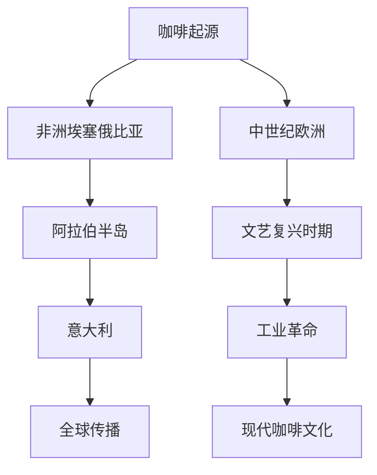

                 

### 关键词

- 现代手工咖啡文化
- 第三波咖啡运动
- 匠人精神
- 手工咖啡技术
- 咖啡豆挑选
- 咖啡烘焙
- 手冲咖啡
- 意式浓缩咖啡
- 冷萃咖啡
- 法式压滤咖啡
- 意式咖啡机
- 咖啡消费者
- 咖啡文化传播

### 摘要

本文将深入探讨现代手工咖啡文化的精髓——第三波咖啡运动的匠人精神。从咖啡的起源与发展，到手工咖啡技术的详细解析，再到匠人精神的内涵及其在手工咖啡领域的应用，本文旨在为读者呈现一幅全面、系统的现代手工咖啡文化图谱。通过分析咖啡豆挑选、烘焙、手冲咖啡、意式浓缩咖啡等核心技术，以及咖啡匠人的故事和手工咖啡文化的推广与实践，本文将揭示匠人精神在现代手工咖啡文化中的重要地位，并对未来手工咖啡文化的发展趋势进行展望。### 第一部分：咖啡文化背景

#### 1.1 咖啡的起源与发展

咖啡，作为一种全球性的饮品，其起源和发展历史悠久。据考古学家的研究，咖啡最早起源于非洲的埃塞俄比亚，随后传播到阿拉伯半岛，并在中世纪时期逐渐传入欧洲。咖啡的传播路径可以用一个Mermaid流程图来形象地表示：

在这个流程图中，我们可以清晰地看到咖啡从起源地埃塞俄比亚出发，经过阿拉伯半岛的传播，最终到达欧洲，并在中世纪时期得到广泛饮用。随着时间的推移，咖啡的传播范围不断扩大，从意大利出发，逐步覆盖全球。这一过程中，咖啡文化也在不断演变和发展，从最初的简单饮品，逐渐演变为今天丰富多样的咖啡文化。

在咖啡传播的过程中，意大利起到了至关重要的作用。意大利是欧洲最早接受咖啡文化的国家之一，咖啡在意大利的普及程度极高，意大利咖啡也因此成为了全球咖啡文化的代表。意大利的咖啡馆不仅是社交和商务的场所，更是文化和艺术的中心。在这个时期，咖啡的饮用方式也开始多样化，从最初的传统饮用方式，发展到现在的手冲咖啡、意式浓缩咖啡等多种形式。

#### 1.2 第三波咖啡运动的概述

第三波咖啡运动是现代咖啡文化的一个重要里程碑，它标志着咖啡文化的进一步发展和细化。第三波咖啡运动的定义是指从20世纪90年代开始，咖啡文化逐渐从追求效率和便捷，转向追求品质和个性化。这一运动的主要特点包括：

1. **品质至上**：第三波咖啡运动强调咖啡豆的品质，追求新鲜、原产地和烘焙方式的精细化。
2. **个性化服务**：第三波咖啡运动强调为消费者提供个性化的服务，根据消费者的口味和需求，定制咖啡。
3. **教育普及**：第三波咖啡运动注重咖啡知识的普及，通过举办讲座、咖啡品鉴等活动，提升消费者的咖啡素养。

第三波咖啡运动的影响深远，不仅改变了咖啡文化的消费模式，还推动了咖啡产业的升级和发展。在这一运动中，手工咖啡文化逐渐兴起，成为现代咖啡文化的重要组成部分。

#### 1.3 手工咖啡文化的兴起

手工咖啡文化的兴起是第三波咖啡运动的一个重要体现。与工业化的咖啡生产方式不同，手工咖啡文化强调手工制作和个性化服务，追求咖啡的极致品质。手工咖啡文化的兴起不仅满足了消费者对品质的追求，也为咖啡产业带来了新的发展机遇。

手工咖啡文化的兴起有着深刻的社会意义。首先，它促进了人们对咖啡品质的关注，提高了咖啡的整体水平。其次，它推动了咖啡文化的普及，使更多的人了解和喜爱咖啡。此外，手工咖啡文化的兴起还带动了相关产业的发展，如咖啡豆的挑选、烘焙设备的生产等。

在手工咖啡文化中，咖啡匠人起到了至关重要的作用。他们通过精湛的手工技艺，将咖啡的每一个细节做到极致，从咖啡豆的挑选、烘焙，到冲泡、调味，每一个环节都力求完美。咖啡匠人的精神不仅体现在他们对咖啡的热爱和专注，更体现在他们对品质的执着和追求。

总之，现代手工咖啡文化的兴起是第三波咖啡运动的一个重要成果，它不仅丰富了咖啡文化的内涵，也为咖啡产业的发展注入了新的活力。随着咖啡文化的不断发展和普及，手工咖啡文化将继续发挥其独特的作用，为人们带来更多的美好体验。### 第二部分：手工咖啡技术

#### 2.1 咖啡豆的挑选与烘焙

咖啡豆的挑选与烘焙是手工咖啡技术中至关重要的一环。优质的咖啡豆不仅决定了咖啡的口感，也影响了咖啡的品质。下面将详细介绍咖啡豆的挑选标准、烘焙技术以及不同烘焙程度的区别。

##### 2.1.1 咖啡豆的品种与产地

咖啡豆的品种和产地直接影响咖啡的风味。目前，世界上广泛种植的咖啡豆主要有阿拉比卡（Arabica）和罗布斯塔（Robusta）两大品种。

- **阿拉比卡咖啡豆**：产于高海拔地区，具有丰富的香气和酸度，口感较为复杂，适合制作高档咖啡。
- **罗布斯塔咖啡豆**：产于低海拔地区，具有强烈的苦味和咖啡因，适合制作速溶咖啡和商业咖啡。

咖啡豆的产地也会对风味产生影响。不同产地的气候、土壤和海拔高度等因素都会影响咖啡豆的生长和品质。例如，埃塞俄比亚的咖啡豆以其独特的花香和果味而闻名，哥伦比亚的咖啡豆则以其酸度和平衡感著称。

##### 2.1.2 咖啡豆的挑选标准

挑选咖啡豆时，需要考虑以下标准：

- **新鲜度**：咖啡豆的新鲜度对口感至关重要。新鲜咖啡豆具有更丰富的香气和更长的保质期。
- **完整性**：咖啡豆应无破损、无虫蛀，以保证咖啡的纯净度和口感。
- **色泽**：咖啡豆的颜色应均匀，避免颜色不均的豆子，这可能是烘焙不均或品质不佳的迹象。
- **形状**：咖啡豆的形状应圆润，避免形状不规则的豆子，这可能是烘焙过程造成的。

##### 2.1.3 咖啡豆的烘焙技术

咖啡豆的烘焙过程是将生豆转化为熟豆的关键步骤，它不仅决定了咖啡的风味，还影响了咖啡的色泽和香气。烘焙咖啡豆的基本步骤如下：

1. **预热**：将烘焙机预热至设定温度，通常在200°C到220°C之间。
2. **投入咖啡豆**：将挑选好的咖啡豆放入烘焙机中。
3. **烘焙**：咖啡豆在烘焙机中加热，颜色逐渐从绿色变为黄色，烘焙程度逐渐加深。
4. **翻动**：在烘焙过程中，需要不断翻动咖啡豆，以避免烘焙不均。
5. **完成**：当咖啡豆达到理想的烘焙程度时，取出并进行冷却。

咖啡豆的烘焙程度分为浅烘焙、中烘焙、中深烘焙和深烘焙四种：

- **浅烘焙**：咖啡豆颜色较浅，酸度较高，口感较清新。
- **中烘焙**：咖啡豆颜色中等，酸度和苦味平衡，口感较为丰富。
- **中深烘焙**：咖啡豆颜色较深，苦味较重，口感较为浓郁。
- **深烘焙**：咖啡豆颜色最深，苦味最重，口感最为浓郁。

不同烘焙程度的咖啡豆适合不同的冲泡方式。例如，浅烘焙咖啡豆适合手冲咖啡，而深烘焙咖啡豆则适合意式浓缩咖啡。

##### 2.1.4 不同烘焙程度的区别

不同烘焙程度的咖啡豆在风味、色泽和香气上都有所不同：

- **浅烘焙**：咖啡豆的颜色较浅，呈黄色。风味较清新，酸度较高，适合制作手工手冲咖啡。
- **中烘焙**：咖啡豆的颜色呈棕褐色。风味平衡，酸度和苦味适中，适合制作手工手冲咖啡和意式浓缩咖啡。
- **中深烘焙**：咖啡豆的颜色较深，呈深棕色。风味浓郁，苦味较重，适合制作手工手冲咖啡和意式浓缩咖啡。
- **深烘焙**：咖啡豆的颜色最深，呈黑色。风味浓郁，苦味最重，适合制作手工手冲咖啡和意式浓缩咖啡。

总之，咖啡豆的挑选与烘焙是手工咖啡技术中至关重要的一环。通过挑选优质咖啡豆和掌握正确的烘焙技术，我们可以制作出风味独特、品质卓越的手工咖啡。#### 2.2 手冲咖啡的技巧

手冲咖啡，作为一种传统的咖啡冲泡方式，因其独特的风味和仪式感而深受咖啡爱好者的喜爱。手冲咖啡的技巧繁多，涉及水温、研磨度、冲泡时间等多个方面。下面将详细介绍手冲咖啡的基本步骤、水温的控制、研磨度的选择以及不同手冲工具的比较。

##### 2.2.1 手冲咖啡的基本步骤

手冲咖啡的基本步骤如下：

1. **准备工具**：准备手冲壶、滤纸、滤杯、咖啡豆、磨豆机、热水壶等工具。
2. **研磨咖啡豆**：根据滤纸和滤杯的大小，将咖啡豆研磨成适当的颗粒度。一般来说，手冲咖啡的研磨度应介于粗砂和细砂之间。
3. **准备滤纸和滤杯**：将滤纸折叠成圆锥形，放入滤杯中，并确保滤纸紧贴滤杯内壁。
4. **预热**：倒入少量热水，使滤纸和滤杯预热，然后倒掉热水。
5. **加入咖啡豆**：将研磨好的咖啡豆均匀地放入滤纸中，轻轻按压使其紧实。
6. **冲泡**：将热水缓慢倒入滤纸，开始冲泡咖啡。一般来说，第一次冲泡的水温应在90°C到95°C之间，冲泡时间约30秒到1分钟。
7. **继续冲泡**：在第一次冲泡后，继续缓慢倒入热水，确保咖啡豆完全浸泡。整个冲泡过程大约需要3到4分钟。
8. **完成**：当咖啡液滴完时，手冲咖啡制作完成。

##### 2.2.2 水温和时间的控制

水温和时间的控制是手冲咖啡成功的关键。不同水温和时间会导致咖啡的不同风味表现。

- **水温**：理想的水温应在90°C到95°C之间。过低的水温无法充分提取咖啡中的风味物质，而过高的水温会破坏咖啡的口感。
  $$ T_{\text{opt}} = 90°C - 95°C $$
- **冲泡时间**：冲泡时间一般控制在3到4分钟。过短的冲泡时间会导致咖啡口感不够丰富，而时间过长则会使咖啡变得苦涩。

##### 2.2.3 不同手冲工具的比较

手冲咖啡的冲泡工具多种多样，包括V60、Chemex、Kalita Wave等。每种工具都有其独特的冲泡特点：

- **V60**：V60滤杯因其独特的锥形设计，使得咖啡液在滴落过程中与咖啡粉有更充分的接触，从而提取出更丰富的风味。同时，V60滤纸的细孔有助于过滤咖啡渣，使咖啡口感更加纯净。
- **Chemex**：Chemex滤杯的圆柱形设计使得咖啡液在滴落过程中形成稳定的流速，有助于保持咖啡的平衡感。此外，Chemex滤杯的材质较为厚重，具有良好的保温效果。
- **Kalita Wave**：Kalita Wave滤杯的设计与V60类似，但滤纸的折叠方式不同，使得咖啡液在滴落过程中形成波浪状，有助于提高咖啡的风味表现。

每种手冲工具都有其独特的优势，咖啡爱好者可以根据自己的口味和喜好选择合适的工具。#### 2.3 意式浓缩咖啡的制作

意式浓缩咖啡（Espresso），作为现代咖啡文化的重要组成部分，以其独特的浓郁口感和丰富层次深受咖啡爱好者的喜爱。意式浓缩咖啡的制作过程严谨而精细，包括压力控制、咖啡豆的研磨度以及冲泡时间的掌握。以下将详细介绍意式浓缩咖啡的制作过程，并探讨压力控制的重要性。

##### 2.3.1 意式浓缩咖啡的制作过程

意式浓缩咖啡的制作过程主要包括以下几个步骤：

1. **预热**：在制作咖啡前，首先预热咖啡机和咖啡杯。预热咖啡机可以使咖啡机内部温度稳定，从而保证咖啡的冲泡效果。预热咖啡杯则可以保持咖啡的温度，提高饮用体验。

2. **研磨咖啡豆**：意式浓缩咖啡需要使用特制的咖啡豆，并研磨成细腻的粉末。研磨度应适中，通常在精细到中等之间。研磨咖啡豆的设备可以是手动磨豆机或电动磨豆机。手动磨豆机可以提供更高的控制度，而电动磨豆机则操作简便。

3. **填粉**：将研磨好的咖啡豆均匀地填充到意式浓缩咖啡机的磨豆腔中，通常填充量约为7到9克。

4. **压粉**：使用压粉器将咖啡豆压实，使其与磨豆腔紧密贴合。压粉的力度要适中，过紧会导致咖啡流出不畅，而过松则会影响咖啡的浓度。

5. **冲泡**：启动意式浓缩咖啡机，热水通过高压泵进入磨豆腔，将咖啡豆萃取出来。冲泡时间通常为20到30秒，理想的水温应在90°C到96°C之间。

6. **取出咖啡**：冲泡完成后，将浓缩咖啡从咖啡机中取出，倒入预热好的咖啡杯中。

##### 2.3.2 压力控制的重要性

压力控制是意式浓缩咖啡制作过程中至关重要的一环。意式浓缩咖啡机通过高压泵将热水压过咖啡豆，压力的大小直接影响到咖啡的口感和萃取效果。

- **低压**：如果压力过低，咖啡的萃取时间会延长，导致咖啡中的苦味物质和酸性物质过多，口感苦涩。
  $$ P_{\text{low}} \rightarrow t_{\text{long}} \rightarrow \text{bitter and acidic} $$
  
- **高压**：如果压力过高，咖啡的萃取时间会缩短，导致咖啡中的油脂和芳香物质未能充分萃取，口感平淡。
  $$ P_{\text{high}} \rightarrow t_{\text{short}} \rightarrow \text{flat and bland} $$

因此，理想的压力范围通常在8到9个大气压之间，这可以确保咖啡的风味达到最佳状态。

##### 2.3.3 意式浓缩咖啡的品质评价

意式浓缩咖啡的品质可以从多个方面进行评价，包括口感、香气、色泽和泡沫等。

- **口感**：理想的意式浓缩咖啡口感醇厚、甘甜，没有明显的苦涩或酸味。
- **香气**：优质的意式浓缩咖啡具有浓郁的香气，可以闻到咖啡豆的自然香气和烘焙香气。
- **色泽**：理想的意式浓缩咖啡色泽深 brown 而均匀，表面有细腻的泡沫。
- **泡沫**：泡沫是意式浓缩咖啡品质的重要标志。理想的泡沫应细腻、持久，且有一定的高度。

通过以上步骤和评价标准，我们可以制作出一杯完美的意式浓缩咖啡，为咖啡爱好者带来极致的味觉体验。#### 2.4 其他手工咖啡制作方法

除了手冲咖啡和意式浓缩咖啡，手工咖啡还有许多其他制作方法，每种方法都有其独特的风味和特点。以下是几种常见的其他手工咖啡制作方法，包括法式压滤咖啡、拿铁与卡布奇诺，以及冷萃咖啡。

##### 2.4.1 法式压滤咖啡

法式压滤咖啡（French Press），是一种传统的手工咖啡制作方法，以其独特的醇厚口感和浓郁香气而闻名。法式压滤咖啡的制作过程相对简单，主要步骤如下：

1. **准备材料**：准备新鲜研磨的咖啡豆、法式压滤壶、热水和咖啡杯。

2. **研磨咖啡豆**：将咖啡豆研磨成中等颗粒度，颗粒大小应介于粗砂和细砂之间。

3. **预热**：将热水倒入法式压滤壶中预热，然后倒掉热水以保持压滤壶的温度。

4. **填粉**：将研磨好的咖啡豆放入压滤壶中，填粉量通常为每杯咖啡6到8克。

5. **浸泡**：将热水倒入压滤壶，使咖啡豆完全浸泡。浸泡时间通常为3到4分钟。

6. **搅拌**：轻轻搅拌咖啡，使其充分接触热水，促进咖啡的萃取。

7. **过滤**：等待咖啡萃取完成后，将压滤壶的盖子盖上，然后轻轻倒置，将咖啡豆和滤纸过滤掉。

8. **饮用**：将过滤好的咖啡倒入咖啡杯中，即可享用。

法式压滤咖啡的特点是口感醇厚，保留了咖啡豆的天然油脂和香气，因此有一种独特的浓郁口感。同时，法式压滤咖啡的制作过程简单，不需要复杂的设备，适合家庭日常饮用。

##### 2.4.2 拿铁与卡布奇诺

拿铁（Latte）和卡布奇诺（Cappuccino）是两种常见的咖啡饮品，它们通常由意式浓缩咖啡和牛奶制成，具有独特的风味和口感。

- **拿铁**：拿铁是由一份意式浓缩咖啡和三份蒸汽牛奶制成。制作拿铁的关键在于牛奶的蒸制。首先，将牛奶加热至起泡，然后使用蒸汽棒轻轻搅拌，使其形成细腻的泡沫。拿铁的口感奶香浓郁，咖啡味较淡，适合喜欢奶香味的人。

- **卡布奇诺**：卡布奇诺是由一份意式浓缩咖啡、一份蒸汽牛奶和一份奶泡制成。与拿铁相比，卡布奇诺的咖啡味更浓郁，牛奶和奶泡的比例更大，因此口感更加丰富。制作卡布奇诺时，需要将牛奶加热至起泡，并使用蒸汽棒将其打成细腻的奶泡。

##### 2.4.3 冷萃咖啡

冷萃咖啡（Cold Brew）是一种通过冷水长时间浸泡咖啡豆来萃取咖啡的方法。这种方法相较于传统热水冲泡，可以减少苦味和酸味，使咖啡口感更加柔和。以下是冷萃咖啡的制作过程：

1. **准备材料**：准备新鲜研磨的咖啡豆、冷萃壶、过滤网、水壶和冰块。

2. **研磨咖啡豆**：将咖啡豆研磨成粗颗粒度，颗粒大小应介于粗砂和细砂之间。

3. **浸泡**：将研磨好的咖啡豆放入冷萃壶中，倒入冷水，浸泡时间通常为12到24小时。浸泡过程中，咖啡豆会逐渐释放出香气和风味。

4. **过滤**：将浸泡好的咖啡豆与水分离，使用过滤网将咖啡液过滤出来。

5. **冷却**：将过滤好的咖啡液倒入冰块中冷却，即可享用。

冷萃咖啡的特点是口感柔和、酸度低、苦味少，适合在夏季饮用，为炎热的天气带来一丝清凉。

通过以上几种手工咖啡制作方法，我们可以根据自己的口味和喜好选择合适的咖啡饮品，享受手工咖啡带来的独特魅力。#### 3.1 匠人精神的内涵

匠人精神，是一种追求卓越、注重细节、执着于完美的精神状态。它源于古老的日本，是一种对工作的高度热爱和极致追求。匠人精神的核心内涵可以概括为以下几点：

1. **专注与执着**：匠人精神要求匠人全心全意地投入工作，不断追求卓越，不畏艰难。他们对自己的工作有着极高的热情和执着，即使在面临困难时也不轻言放弃。

2. **精益求精**：匠人精神强调精益求精，追求每一个细节的完美。他们注重每一个步骤的精准和精细，力求将每一件作品做到极致。

3. **耐心与坚持**：匠人精神要求匠人具有极大的耐心和毅力，他们相信只有通过长时间的努力和坚持，才能达到卓越的境界。

4. **追求创新**：匠人精神并非固步自封，而是在传统的基础上不断追求创新。他们勇于尝试新的方法和技术，以提升工作的效率和质量。

5. **尊重自然**：匠人精神强调尊重自然，遵循自然规律。他们相信只有与自然和谐相处，才能创造出真正美好的作品。

总之，匠人精神是一种追求卓越、注重细节、执着于完美的精神状态，它不仅是一种工作态度，更是一种生活方式。在手工咖啡领域，匠人精神体现为对咖啡品质的极致追求，对咖啡文化的深入理解，以及对咖啡制作的热爱和执着。这种精神不仅提升了手工咖啡的品质，也丰富了咖啡文化的内涵。#### 3.2 手工咖啡与匠人精神的联系

手工咖啡与匠人精神的联系紧密而深刻，两者在追求品质、细节和极致方面有着诸多共通之处。手工咖啡的制作过程，恰恰是对匠人精神的完美诠释。

首先，手工咖啡的制作强调品质至上。匠人精神的核心之一就是追求卓越，这一理念在手工咖啡制作中得到了充分体现。从咖啡豆的挑选到烘焙，再到研磨和冲泡，每一个环节都需要极高的品质要求。咖啡豆的新鲜度、烘焙程度、研磨度以及冲泡时间，都直接影响到咖啡的口感和品质。匠人精神在这里表现为对每一个细节的严格把控，力求将每一步做到极致，以确保最终呈现的咖啡品质达到最佳。

其次，手工咖啡制作注重细节。匠人精神强调精益求精，这一点在手工咖啡制作中尤为重要。例如，在冲泡过程中，水温的控制、咖啡豆的研磨度、水流的分布等，都需要精确到秒和微米。每一个细微的调整都可能带来咖啡口感的显著变化。匠人精神要求匠人在每一个细节上做到尽善尽美，以确保最终作品的完美。

再次，手工咖啡制作强调耐心与坚持。咖啡的制作是一个缓慢而复杂的过程，需要匠人长时间地保持专注和耐心。从烘焙咖啡豆到冲泡咖啡，每一个步骤都需要匠人静下心来，细心操作。在这个过程中，匠人不仅要克服外界的干扰，还要保持内心的平静和专注。匠人精神的耐心和坚持，正是这种长时间专注和细致操作的关键。

此外，手工咖啡制作还体现了匠人精神中的创新追求。尽管手工咖啡制作有着传统的技艺和流程，但匠人们并不固步自封，而是勇于尝试新的技术和方法。例如，一些咖啡馆开始采用更先进的烘焙设备，或者研发新的冲泡方式，以提升咖啡的品质和口感。这种创新精神，正是匠人精神的核心之一。

最后，手工咖啡制作中的尊重自然也体现了匠人精神。咖啡是一种源于自然的农产品，匠人在制作咖啡时，不仅注重咖啡豆的品质，还尊重自然生长的规律。例如，他们会选择高品质的咖啡豆，注重咖啡豆的烘焙过程，以最大程度地保留咖啡豆的自然风味。这种对自然的尊重，正是匠人精神的体现。

总之，手工咖啡与匠人精神在追求品质、细节、耐心、创新和尊重自然等方面有着紧密的联系。匠人精神在手工咖啡制作中的体现，不仅提升了咖啡的品质，也丰富了咖啡文化的内涵。通过匠人精神的实践，手工咖啡不仅成为一种饮品，更成为一种生活方式和艺术形式。#### 3.3 手工咖啡匠人的故事

手工咖啡匠人，是现代手工咖啡文化的重要守护者和传承者。他们的故事，充满了对咖啡的热爱、执着和追求。以下将讲述几位手工咖啡匠人的故事，他们的心路历程和成就，为读者展示了手工咖啡匠人精神的力量。

##### 3.3.1 咖啡匠人的成长之路

以李先生为例，他是一位来自四川的手工咖啡匠人。李先生从小就对咖啡有着浓厚的兴趣，他的父母经营着一家咖啡馆，他在那里度过了童年和青少年时期。在这个过程中，李先生学会了咖啡豆的挑选、烘焙和冲泡，他深知咖啡的品质和口感对咖啡馆的重要性。

成年后，李先生决定追求自己的咖啡梦想，他前往意大利学习手工咖啡制作技艺。在意大利的咖啡学院，李先生系统地学习了咖啡制作的每一个环节，从咖啡豆的挑选到烘焙，再到研磨和冲泡。他不断地实践和尝试，终于掌握了手工咖啡制作的精髓。

回到中国后，李先生开设了自己的咖啡馆，他坚持使用最优质的咖啡豆和最精湛的手工技艺，制作出高品质的手工咖啡。他的咖啡馆很快在当地赢得了良好的口碑，成为了咖啡爱好者的聚集地。

##### 3.3.2 咖啡匠人的心路历程

在手工咖啡制作的过程中，李先生经历了许多挑战和困难。最初，他面临着消费者对咖啡品质的不认可，许多顾客认为他的咖啡价格过高，不愿意尝试。为了改变这种局面，李先生不断改进自己的制作工艺，提高咖啡的品质。他参加了各种咖啡比赛，通过获奖来提升自己的声誉。

此外，李先生还面临着市场竞争的压力。随着咖啡文化的普及，越来越多的咖啡馆涌入市场，竞争异常激烈。为了在竞争中脱颖而出，李先生不仅注重咖啡的品质，还注重顾客体验。他的咖啡馆提供了舒适的环境和优质的服务，使顾客在享受咖啡的同时，也能感受到咖啡文化的魅力。

在李先生的心路历程中，最令他感动的是顾客对他的认可和赞赏。许多顾客对他的咖啡赞不绝口，他们的反馈让李先生感到无比的欣慰和自豪。他深知，顾客的满意是对他最大的鼓励和支持。

##### 3.3.3 咖啡匠人的未来展望

对于未来的发展，李先生充满了信心和期待。他计划进一步扩大自己的业务，开设更多的连锁咖啡馆，并将手工咖啡制作技艺传授给更多的人。他希望通过自己的努力，让更多的人了解和喜爱手工咖啡，让手工咖啡文化在中国得到更广泛的传播。

同时，李先生也关注环保和可持续发展。他计划在咖啡种植和加工环节引入环保技术，减少对环境的影响。他还希望通过自己的努力，为当地的经济发展和乡村振兴做出贡献。

总之，李先生的故事展示了手工咖啡匠人的心路历程和成就。他们的热爱、执着和追求，不仅提升了手工咖啡的品质，也丰富了咖啡文化的内涵。通过他们的努力，手工咖啡文化将继续发展和繁荣。#### 3.4 手工咖啡文化的推广

手工咖啡文化的推广是现代咖啡产业的重要组成部分，它不仅有助于提升咖啡的品质和知名度，还能促进相关产业的发展。以下将介绍手工咖啡文化的推广现状、推广途径以及面临的挑战与机遇。

##### 3.4.1 手工咖啡文化推广的现状

随着第三波咖啡运动的兴起，手工咖啡文化在全球范围内得到了广泛推广。许多国家和地区纷纷举办咖啡节、咖啡比赛和咖啡研讨会，以提升公众对手工咖啡文化的认识和兴趣。同时，越来越多的咖啡馆和咖啡店开始注重手工咖啡的制作和推广，为消费者提供更高品质的咖啡体验。

然而，尽管手工咖啡文化的推广取得了显著成果，仍存在一些局限性。首先，手工咖啡文化的推广主要集中在经济发达地区，如欧美和日本等地，而在一些发展中国家和地区，手工咖啡文化的影响力较小。其次，消费者对手工咖啡的认识和理解仍有待提高，许多人对手工咖啡的接受度较低。

##### 3.4.2 手工咖啡文化推广的途径

为了更有效地推广手工咖啡文化，可以采取以下几种途径：

1. **举办咖啡节和比赛**：通过举办咖啡节和比赛，可以吸引更多人参与和关注手工咖啡文化。咖啡节和比赛不仅提供了一个展示咖啡技艺和产品的平台，还能增进公众对咖啡文化的了解。

2. **开设咖啡课程**：开设咖啡课程，面向公众和专业人士，传授手工咖啡的制作技艺和知识。通过系统的培训和学习，可以提高参与者的咖啡素养，培养更多手工咖啡的爱好者。

3. **推广咖啡文化**：利用各种媒体平台，如电视、报纸、杂志、网络等，宣传和推广手工咖啡文化。通过传播咖啡的历史、文化、制作技艺和消费知识，可以提高公众对咖啡文化的认识和兴趣。

4. **合作与交流**：加强国内外咖啡馆、咖啡产业和相关机构的合作与交流，分享经验和资源，推动手工咖啡文化的全球化发展。

##### 3.4.3 手工咖啡文化推广的挑战与机遇

手工咖啡文化推广过程中面临的主要挑战包括：

1. **市场竞争**：随着咖啡产业的快速发展，市场竞争日益激烈。如何提高手工咖啡的竞争力，吸引更多消费者，是推广过程中的一大挑战。

2. **成本控制**：手工咖啡的制作过程复杂，成本较高。如何在保证品质的前提下，控制成本，提高盈利能力，是推广过程中需要解决的问题。

3. **消费者认知**：提高消费者对手工咖啡的认知度和接受度，是推广过程中的一大难题。需要通过多种途径，加强宣传和推广，让消费者了解和喜爱手工咖啡。

然而，手工咖啡文化推广也面临着许多机遇：

1. **消费升级**：随着消费者对生活品质的追求，对高品质咖啡的需求日益增长，为手工咖啡文化提供了广阔的市场空间。

2. **技术进步**：咖啡制作技术的不断进步，为手工咖啡的制作提供了更多可能，也为推广手工咖啡文化提供了有力支持。

3. **全球化**：随着全球化的深入推进，手工咖啡文化在全球范围内的传播和推广将更加便捷，有助于提高手工咖啡的知名度和影响力。

总之，手工咖啡文化的推广是一个复杂而长期的过程，需要各方共同努力，克服挑战，抓住机遇，推动手工咖啡文化的发展。通过有效的推广途径，手工咖啡文化将更好地融入人们的日常生活，为更多人带来美好的咖啡体验。#### 3.5 手工咖啡文化的实践

手工咖啡文化的实践不仅体现在咖啡馆的运营上，还包括咖啡课程的设计与实施、手工咖啡文化的传承与创新等方面。以下将详细介绍这些实践内容。

##### 3.5.1 手工咖啡馆的经营与管理

手工咖啡馆的经营与管理是推广手工咖啡文化的重要一环。一个成功的手工咖啡馆需要从选址、装修、菜单设计、顾客服务等多个方面进行综合考虑。

1. **选址**：选址是咖啡馆成功的关键。应选择人流量大、交通便利的地区，如商业中心、旅游景点等。此外，咖啡馆的周边环境也应符合咖啡文化的氛围，如绿树成荫、环境安静等。

2. **装修**：装修风格应体现手工咖啡文化的特色，如使用木质家具、绿色植物等自然元素，营造温馨、舒适的环境。同时，咖啡馆的装修还应注重实用性和舒适性，为顾客提供良好的用餐体验。

3. **菜单设计**：菜单设计是吸引顾客的关键。应提供多样化的手工咖啡饮品，包括手冲咖啡、意式浓缩咖啡、拿铁、卡布奇诺等。此外，还可以推出一些特色饮品，如冷萃咖啡、花式咖啡等，以满足不同顾客的需求。

4. **顾客服务**：顾客服务是咖啡馆的核心竞争力。应注重顾客的用餐体验，提供热情、专业的服务。例如，咖啡师可以亲自为顾客介绍咖啡的种类、特点和口感，提高顾客的满意度。

##### 3.5.2 咖啡课程的设计与实施

咖啡课程的设计与实施是推广手工咖啡文化的重要手段。通过系统的培训，可以提升参与者对咖啡的认识和制作技能。

1. **课程内容**：咖啡课程的内容应涵盖咖啡的历史、文化、种类、烘焙、研磨、冲泡等各个方面。同时，还可以加入咖啡礼仪、咖啡机操作等实用知识。

2. **教学方法**：教学方法应多样化，包括理论讲解、实际操作、讨论交流等。通过理论讲解，让参与者了解咖啡的基本知识；通过实际操作，让参与者掌握咖啡制作的技能；通过讨论交流，让参与者分享经验，互相学习。

3. **课程评价**：课程评价应注重参与者的实际表现和掌握程度。可以设置考核环节，检验参与者的学习成果。

##### 3.5.3 手工咖啡文化的传承与创新

手工咖啡文化的传承与创新是推动手工咖啡文化发展的重要动力。

1. **传承**：传承是手工咖啡文化的基础。应注重传统咖啡技艺的传承，如手工烘焙、手工研磨、手冲咖啡等。通过代代相传，保持手工咖啡文化的纯粹性和独特性。

2. **创新**：创新是手工咖啡文化发展的关键。应在传统的基础上，不断探索新的制作方法和技术，如冷萃咖啡、花式咖啡等。通过创新，提升手工咖啡的品质和口感，满足消费者的多样化需求。

3. **文化交流**：文化交流是推动手工咖啡文化发展的重要途径。可以通过举办国际咖啡文化节、邀请国外咖啡大师来华交流等方式，促进国内外咖啡文化的交流与融合。

总之，手工咖啡文化的实践是一个多维度的过程，涉及咖啡馆的经营与管理、咖啡课程的设计与实施，以及手工咖啡文化的传承与创新。通过这些实践，手工咖啡文化将得到更广泛的传播和认可，为人们带来更多的美好体验。#### 3.6 手工咖啡文化的未来趋势

随着社会的发展和消费者需求的不断升级，手工咖啡文化正朝着多元化、智能化和可持续化的方向发展。以下将探讨手工咖啡文化的未来趋势，以及这些趋势对咖啡产业和社会的影响。

##### 3.6.1 消费趋势

1. **个性化定制**：消费者对咖啡的需求越来越个性化。他们不仅追求咖啡的品质，还希望根据自己的口味和需求定制咖啡。未来，手工咖啡馆将提供更多的定制选项，如咖啡豆的选择、烘焙程度、冲泡方式等，以满足消费者的个性化需求。

2. **健康环保**：随着健康意识的提高，消费者对咖啡的健康和环保属性越来越关注。未来，手工咖啡文化将更加注重咖啡的健康属性，如低咖啡因、低糖、低脂等。同时，咖啡产业也将更加注重环保，如使用可持续的咖啡豆、减少包装材料等。

3. **体验化**：咖啡不再仅仅是一种饮品，而成为一种生活方式和社交体验。未来，手工咖啡文化将更加注重咖啡体验，如提供舒适的环境、个性化的服务、互动体验等，让消费者在享受咖啡的同时，也能感受到文化氛围。

##### 3.6.2 技术创新

1. **智能化**：随着人工智能和物联网技术的发展，手工咖啡文化将变得更加智能化。例如，咖啡机将能够自动调节烘焙程度、研磨度和冲泡时间，以实现个性化的咖啡制作。同时，智能咖啡机可以通过连接互联网，实现远程控制和数据分析。

2. **自动化**：自动化技术的应用将大大提高咖啡生产效率，降低人工成本。例如，自动化烘焙设备、自动化研磨设备和自动化冲泡设备等，将使咖啡生产过程更加高效和精准。

3. **数字化**：数字化技术的应用将使咖啡产业链更加透明和高效。例如，通过区块链技术，可以实现对咖啡豆的溯源，确保咖啡的品质和来源。同时，数字化平台可以提供更丰富的咖啡知识和信息，帮助消费者更好地了解和选择咖啡。

##### 3.6.3 社会责任

1. **可持续发展**：随着社会对环境问题的关注，手工咖啡文化将更加注重可持续发展。例如，通过采用有机咖啡豆、减少碳排放、使用可再生能源等，实现咖啡产业的可持续发展。

2. **社区参与**：手工咖啡文化将更加注重与社区的互动和参与。例如，通过举办社区咖啡节、支持社区公益活动等方式，增强社区对咖啡文化的认同和参与。

3. **扶贫与发展**：咖啡产业将更多地参与到扶贫和发展工作中。例如，通过支持咖啡农场的建设、提供技术培训和金融支持等方式，帮助咖啡农提高产量和收入，促进当地经济发展。

总之，手工咖啡文化的未来趋势将充满活力和机遇。通过多元化、智能化和可持续化的创新发展，手工咖啡文化将更好地满足消费者的需求，为咖啡产业和社会带来更多的价值。#### 3.7 小结、注意事项与拓展阅读

在结束本文之前，我们对现代手工咖啡文化及其与第三波咖啡运动的匠人精神进行一次全面的总结，并提供一些实用的注意事项以及推荐拓展阅读资源。

### 小结

本文系统地介绍了现代手工咖啡文化的各个方面，从咖啡的起源与发展、第三波咖啡运动的概述，到手工咖啡技术的详细解析，再到匠人精神的内涵及其在手工咖啡领域的应用。我们探讨了咖啡豆的挑选与烘焙、手冲咖啡的技巧、意式浓缩咖啡的制作以及其他手工咖啡制作方法。此外，我们还讲述了手工咖啡匠人的故事，介绍了手工咖啡文化的推广与实践，并对手工咖啡文化的未来趋势进行了展望。

### 注意事项

1. **品质优先**：在选择咖啡豆时，要重视新鲜度和品质，避免选择陈旧或劣质的咖啡豆。

2. **掌握技术**：手工咖啡制作需要掌握一定的技术，如烘焙程度、研磨度和冲泡时间等。可以通过参加培训课程或阅读相关书籍来提高自己的技术水平。

3. **保持卫生**：在制作咖啡的过程中，要注重卫生，确保工具和环境的清洁，以保证咖啡的品质和安全。

4. **创新思维**：在手工咖啡制作中，可以尝试创新，如结合不同的咖啡豆、调整烘焙程度、探索新的冲泡方法等，以提升咖啡的口感和体验。

### 拓展阅读

1. **《咖啡的艺境》**：作者通过对咖啡历史、文化、制作技艺的深入探讨，为我们呈现了一幅全面的咖啡文化图谱。

2. **《咖啡鉴赏与品鉴》**：本书详细介绍了咖啡的种类、产地、风味特点以及品鉴技巧，是咖啡爱好者的必备读物。

3. **《匠人精神》**：作者通过对日本匠人精神的深入研究，揭示了匠人精神在现代社会中的重要性，对我们理解和践行匠人精神提供了深刻的启示。

通过以上总结和推荐，我们希望读者能对现代手工咖啡文化有更深入的了解，并在实践中不断探索和提升，为推动咖啡文化的发展贡献自己的力量。### 作者信息

作者：AI天才研究院/AI Genius Institute & 禅与计算机程序设计艺术 /Zen And The Art of Computer Programming

