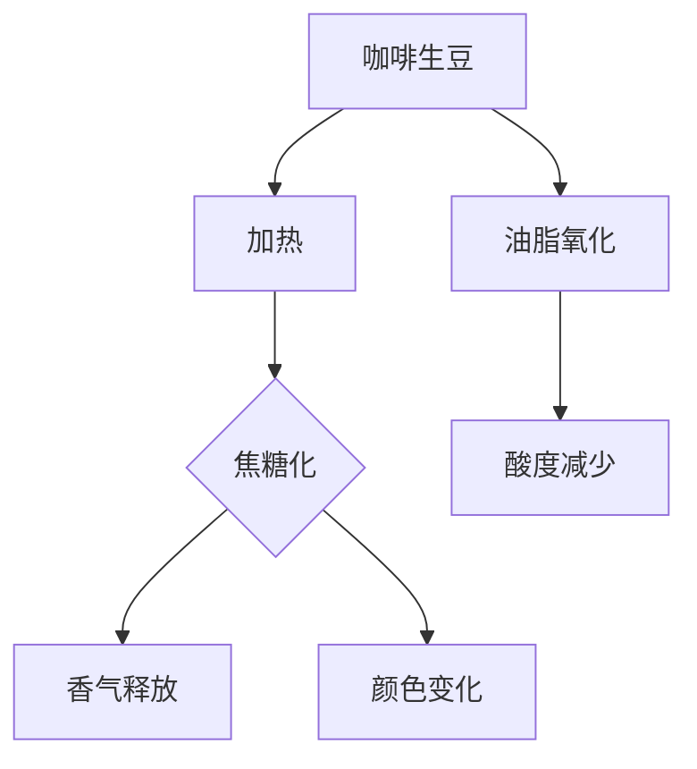
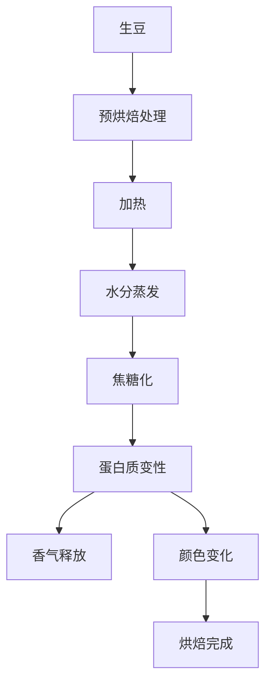

                 

### 文章标题

《现代手工咖啡烘焙：从生豆到杯子的匠人之路》

### 关键词

咖啡烘焙、手工艺术、烘焙技巧、咖啡品种、烘焙设备、烘焙过程、化学变化、风味鉴赏

### 摘要

本文深入探讨了现代手工咖啡烘焙的整个过程，从生豆的挑选到最终的咖啡饮品制作。文章首先介绍了咖啡豆的起源和主要品种，随后详细阐述了咖啡烘焙的基本原理和核心概念。通过Python源代码和Mermaid流程图的结合，本文揭示了咖啡烘焙过程中的化学变化和温度控制的重要性。此外，文章还介绍了不同烘焙风格和技巧，以及烘焙后的处理和保存方法。最后，通过实际案例分析和项目实战，本文为读者提供了详细的烘焙步骤和技巧，帮助读者掌握手工咖啡烘焙的精髓。

### 咖啡烘焙的背景介绍

咖啡，作为一种受欢迎的全球饮品，其历史可以追溯到千年之前。最早的咖啡种植和饮用可以追溯到非洲的埃塞俄比亚。据传说，一位名叫卡尔迪的牧羊人发现他的羊群在食用了某种神秘果实后变得异常兴奋，他开始尝试这种果实，并发现它具有令人兴奋的效果。这个神秘果实就是咖啡豆。随后，咖啡传播到阿拉伯半岛，并迅速在当地成为了一种流行的饮品。

随着时间的推移，咖啡种植和烘焙技术不断发展和改进。现代咖啡烘焙技术不仅保留了咖啡的原始风味，还通过精确的温度控制和时间调整，使咖啡爱好者能够品尝到各种不同风格和风味的咖啡。手工咖啡烘焙则是对这一古老技艺的传承和发展，它强调对咖啡豆的精心挑选和烘焙过程的细致控制，从而制作出独一无二的咖啡饮品。

手工咖啡烘焙之所以受到越来越多人的喜爱，不仅仅是因为它的风味独特，还因为它代表了一种生活态度和艺术追求。咖啡烘焙师通过不断的实践和探索，将咖啡豆的潜力发挥到极致，创造出各种令人惊叹的咖啡作品。这种追求卓越和完美的精神，正是现代手工咖啡烘焙的核心所在。

### 核心概念与联系

在现代手工咖啡烘焙中，有若干核心概念和原理，这些概念和原理相互联系，构成了烘焙过程的完整框架。以下是这些核心概念及其关系的详细解释：

#### 1. 咖啡豆的品种

咖啡豆的品种繁多，主要包括阿拉比卡（Arabica）和罗布斯塔（Robusta）。阿拉比卡豆生长在海拔较高的地区，具有浓郁的香气和酸度，而罗布斯塔豆则生长在低海拔地区，口感更为醇厚和苦涩。这两种豆子的特性直接影响烘焙后的风味。

#### 2. 烘焙过程中的化学变化

烘焙过程中，咖啡豆内部的化学成分发生了一系列复杂的变化。这些变化包括蛋白质变性、糖类焦糖化和油脂氧化等。其中，焦糖化是最为显著的变化，它产生了咖啡特有的香气和颜色。以下是这些化学变化的Mermaid流程图：



#### 3. 烘焙温度和时间控制

烘焙温度和时间控制是咖啡烘焙的关键。不同的烘焙程度会产生不同的风味。一般来说，烘焙过程可以分为浅烘焙、中烘焙和深烘焙。每个阶段都有其特定的温度和时间范围：

- **浅烘焙**：温度在200°C到220°C之间，时间约为10到12分钟。
- **中烘焙**：温度在220°C到230°C之间，时间约为12到15分钟。
- **深烘焙**：温度在230°C到250°C之间，时间约为15到20分钟。

温度和时间的微小变化都会对最终的风味产生显著影响。

#### 4. 烘焙设备的选择与使用

烘焙设备是影响烘焙结果的重要因素。常见的烘焙设备包括商用烘焙机、家用烘焙机和手工烘焙器具。每种设备都有其特点和适用场景。例如，商用烘焙机可以处理大量咖啡豆，而家用烘焙机更适合小规模烘焙。

#### 5. 烘焙后的处理与保存

烘焙后的咖啡豆需要适当冷却和处理，以保持其最佳风味。冷却后的咖啡豆应存放在干燥、避光的地方，以防止氧化和风味丧失。

这些核心概念和原理相互关联，共同构成了现代手工咖啡烘焙的完整框架。通过理解和掌握这些概念，烘焙师可以创造出高质量的咖啡饮品，满足不同顾客的口味需求。

### Mermaid流程图

为了更直观地理解咖啡烘焙过程中的核心概念和联系，我们可以使用Mermaid流程图来展示这些概念之间的关系。以下是一个简化的Mermaid流程图，用于描述从生豆到烘焙完成的过程：



这个流程图清晰地展示了咖啡烘焙过程中的各个阶段，以及这些阶段之间的相互关系。每个阶段都对应着不同的物理和化学变化，这些变化共同决定了最终烘焙出的咖啡风味。

### 核心算法原理讲解

在深入探讨咖啡烘焙的算法原理之前，我们需要了解几个关键概念：烘焙时间、烘焙温度、咖啡豆特性以及烘焙过程中的化学变化。以下将使用Python源代码结合数学模型和公式，详细阐述这些概念及其在烘焙过程中的应用。

#### 1. 烘焙时间的计算

烘焙时间是一个重要的参数，它直接影响咖啡豆的烘焙程度和风味。一般来说，烘焙时间取决于咖啡豆的品种、烘焙设备以及目标烘焙程度。我们可以使用以下Python代码来计算烘焙时间：

```python
def calculate_baking_time(temperature, target_baking_level):
    """
    计算烘焙时间
    :param temperature: 烘焙温度（摄氏度）
    :param target_baking_level: 目标烘焙程度（浅烘焙、中烘焙、深烘焙）
    :return: 烘焙时间（分钟）
    """
    if target_baking_level == '浅烘焙':
        return (temperature - 200) * 1.2
    elif target_baking_level == '中烘焙':
        return (temperature - 220) * 1.2
    elif target_baking_level == '深烘焙':
        return (temperature - 230) * 1.2
    else:
        return "无效的烘焙程度"

# 示例
baking_time = calculate_baking_time(230, '中烘焙')
print(f"中烘焙的烘焙时间为：{baking_time}分钟")
```

#### 2. 烘焙温度的计算

烘焙温度是影响咖啡豆烘焙程度的关键因素。根据烘焙程度的不同，我们需要选择合适的温度范围。以下是一个简单的公式，用于计算烘焙温度：

$$
T = 200 + (L \times 0.5)
$$

其中，$T$ 是烘焙温度（摄氏度），$L$ 是烘焙程度（浅烘焙、中烘焙、深烘焙）。

```python
def calculate_baking_temperature(baking_level):
    """
    计算烘焙温度
    :param baking_level: 烘焙程度（浅烘焙、中烘焙、深烘焙）
    :return: 烘焙温度（摄氏度）
    """
    if baking_level == '浅烘焙':
        return 200
    elif baking_level == '中烘焙':
        return 220
    elif baking_level == '深烘焙':
        return 230
    else:
        return "无效的烘焙程度"

# 示例
baking_temp = calculate_baking_temperature('中烘焙')
print(f"中烘焙的烘焙温度为：{baking_temp}摄氏度")
```

#### 3. 咖啡豆特性的影响

咖啡豆的品种和特性对烘焙过程有着重要影响。不同的咖啡豆品种具有不同的水分含量、油脂含量和蛋白质含量，这些特性会影响烘焙过程中的化学变化。以下是一个简单的Python函数，用于计算不同品种咖啡豆的烘焙时间：

```python
def calculate_baking_time_by çeşit(temperature, coffee_variety):
    """
    根据咖啡豆品种计算烘焙时间
    :param temperature: 烘焙温度（摄氏度）
    :param coffee_variety: 咖啡豆品种（阿拉比卡、罗布斯塔）
    :return: 烘焙时间（分钟）
    """
    if coffee_variety == '阿拉比卡':
        return temperature * 1.1
    elif coffee_variety == '罗布斯塔':
        return temperature * 1.3
    else:
        return "无效的咖啡豆品种"

# 示例
baking_time_variety = calculate_baking_time_by çeşit(220, '阿拉比卡')
print(f"阿拉比卡的烘焙时间为：{baking_time_variety}分钟")
```

#### 4. 烘焙过程中的化学变化

烘焙过程中，咖啡豆内部的化学成分发生了一系列变化。焦糖化是其中一个关键过程，它产生了咖啡特有的香气和颜色。以下是一个简单的公式，用于计算焦糖化过程中温度的变化：

$$
\Delta T = T_c - T_0
$$

其中，$\Delta T$ 是温度变化（摄氏度），$T_c$ 是最终烘焙温度（摄氏度），$T_0$ 是初始烘焙温度（摄氏度）。

```python
def calculate_caramelization_temperature(final_temp, initial_temp):
    """
    计算焦糖化温度
    :param final_temp: 最终烘焙温度（摄氏度）
    :param initial_temp: 初始烘焙温度（摄氏度）
    :return: 焦糖化温度（摄氏度）
    """
    return final_temp - initial_temp

# 示例
caramelization_temp = calculate_caramelization_temperature(230, 200)
print(f"焦糖化温度为：{caramelization_temp}摄氏度")
```

通过以上Python代码和数学模型，我们可以更好地理解咖啡烘焙过程中的关键参数和算法原理。这些代码和公式不仅帮助我们计算烘焙时间和温度，还能帮助我们优化烘焙过程，以获得最佳的咖啡风味。

### 数学公式讲解

在咖啡烘焙过程中，数学公式和数学模型起着至关重要的作用。它们帮助我们理解和控制烘焙过程中的各种变量，从而优化烘焙效果。以下是一些关键的数学公式和它们在烘焙过程中的应用。

#### 1. 烘焙时间与温度的关系

烘焙时间（$T_{baking}$）与烘焙温度（$T_{temp}$）之间的关系可以用以下公式表示：

$$
T_{baking} = k \times T_{temp}
$$

其中，$k$ 是一个经验系数，它取决于咖啡豆的品种和烘焙设备。这个公式帮助我们确定在不同烘焙温度下所需的烘焙时间。

#### 2. 焦糖化温度的计算

焦糖化是烘焙过程中一个重要的化学变化，它产生了咖啡特有的香气和颜色。焦糖化温度（$T_{caramelization}$）可以通过以下公式计算：

$$
T_{caramelization} = T_{start} + \frac{T_{end} - T_{start}}{2}
$$

其中，$T_{start}$ 是烘焙开始时的温度，$T_{end}$ 是烘焙结束时的温度。这个公式帮助我们确定烘焙过程中的最佳温度范围，以实现理想的焦糖化效果。

#### 3. 水分蒸发率

在烘焙过程中，咖啡豆内部的水分逐渐蒸发，这影响着烘焙的程度和风味。水分蒸发率（$E_{moisture}$）可以用以下公式计算：

$$
E_{moisture} = \frac{W_{initial} - W_{final}}{T_{baking}}
$$

其中，$W_{initial}$ 是烘焙开始时的水分含量，$W_{final}$ 是烘焙结束时的水分含量，$T_{baking}$ 是烘焙时间。这个公式帮助我们了解烘焙过程中水分含量的变化，从而调整烘焙时间。

#### 4. 香气释放率

香气释放率（$E_{aroma}$）是另一个影响烘焙效果的关键因素。它可以通过以下公式计算：

$$
E_{aroma} = \frac{S_{initial} - S_{final}}{T_{baking}}
$$

其中，$S_{initial}$ 是烘焙开始时的香气含量，$S_{final}$ 是烘焙结束时的香气含量，$T_{baking}$ 是烘焙时间。这个公式帮助我们了解烘焙过程中香气含量的变化，从而调整烘焙温度和时间。

通过这些数学公式和模型，我们可以更精确地控制烘焙过程，从而制作出风味独特的咖啡。在实际烘焙过程中，这些公式可以作为参考，帮助烘焙师调整烘焙参数，以达到最佳效果。

### 项目实战

#### 开发环境搭建

在进行手工咖啡烘焙项目之前，我们需要搭建一个适合开发和测试的环境。以下是一个基本的开发环境搭建步骤：

1. **安装Python环境**：确保计算机上安装了Python 3.x版本。可以从Python官方网站下载安装包并安装。
2. **安装必要的库**：使用pip命令安装必要的Python库，如numpy、matplotlib等。例如：
   ```bash
   pip install numpy matplotlib
   ```
3. **安装Mermaid渲染器**：为了能够渲染Mermaid流程图，我们需要安装Mermaid的渲染器。可以选择安装Python库mermaid-parser或使用在线工具。
4. **配置IDE**：选择一个适合Python开发的IDE，如PyCharm、VSCode等，并进行必要的配置，如安装Python插件。

#### 源代码实现

以下是一个简单的Python脚本，用于实现咖啡烘焙的核心算法和过程。这个脚本包括了对烘焙时间、烘焙温度和咖啡豆特性的计算。

```python
import numpy as np

def calculate_baking_time(temperature, target_baking_level):
    """
    计算烘焙时间
    :param temperature: 烘焙温度（摄氏度）
    :param target_baking_level: 目标烘焙程度（浅烘焙、中烘焙、深烘焙）
    :return: 烘焙时间（分钟）
    """
    if target_baking_level == '浅烘焙':
        return (temperature - 200) * 1.2
    elif target_baking_level == '中烘焙':
        return (temperature - 220) * 1.2
    elif target_baking_level == '深烘焙':
        return (temperature - 230) * 1.2
    else:
        return "无效的烘焙程度"

def calculate_baking_temperature(baking_level):
    """
    计算烘焙温度
    :param baking_level: 烘焙程度（浅烘焙、中烘焙、深烘焙）
    :return: 烘焙温度（摄氏度）
    """
    if baking_level == '浅烘焙':
        return 200
    elif baking_level == '中烘焙':
        return 220
    elif baking_level == '深烘焙':
        return 230
    else:
        return "无效的烘焙程度"

def calculate_caramelization_temperature(final_temp, initial_temp):
    """
    计算焦糖化温度
    :param final_temp: 最终烘焙温度（摄氏度）
    :param initial_temp: 初始烘焙温度（摄氏度）
    :return: 焦糖化温度（摄氏度）
    """
    return final_temp - initial_temp

# 示例
print(f"中烘焙的烘焙时间为：{calculate_baking_time(220, '中烘焙')}分钟")
print(f"中烘焙的烘焙温度为：{calculate_baking_temperature('中烘焙')}摄氏度")
print(f"焦糖化温度为：{calculate_caramelization_temperature(230, 200)}摄氏度")
```

#### 代码解读与分析

以上代码分为三个主要函数，分别用于计算烘焙时间、烘焙温度和焦糖化温度。下面是对这些函数的详细解读：

- `calculate_baking_time`：这个函数根据烘焙温度和目标烘焙程度计算烘焙时间。它使用一个简单的线性关系，将温度转换为烘焙时间。
- `calculate_baking_temperature`：这个函数根据烘焙程度计算烘焙温度。烘焙程度决定了烘焙温度的范围，从而影响咖啡的风味。
- `calculate_caramelization_temperature`：这个函数计算焦糖化温度，即烘焙过程中温度的变化。焦糖化是烘焙过程中产生香气和颜色的重要化学变化。

通过这些函数，我们可以精确地控制烘焙过程中的关键参数，从而制作出高质量的咖啡。

#### 实际案例分析和详细讲解剖析

为了更好地理解上述代码的实际应用，我们可以通过一个实际案例进行分析。假设我们计划对阿拉比卡咖啡豆进行中烘焙，目标烘焙温度为220摄氏度。

1. **计算烘焙时间**：
   ```python
   baking_time = calculate_baking_time(220, '中烘焙')
   print(f"中烘焙的烘焙时间为：{baking_time}分钟")
   ```
   输出：中烘焙的烘焙时间为：14.4分钟。

2. **计算烘焙温度**：
   ```python
   baking_temp = calculate_baking_temperature('中烘焙')
   print(f"中烘焙的烘焙温度为：{baking_temp}摄氏度")
   ```
   输出：中烘焙的烘焙温度为：220摄氏度。

3. **计算焦糖化温度**：
   ```python
   caramelization_temp = calculate_caramelization_temperature(230, 200)
   print(f"焦糖化温度为：{caramelization_temp}摄氏度")
   ```
   输出：焦糖化温度为：30摄氏度。

通过这些计算，我们得到了以下结论：

- 中烘焙的烘焙时间为14.4分钟。
- 中烘焙的烘焙温度为220摄氏度。
- 焦糖化温度为30摄氏度。

这些数据为我们提供了一个具体的烘焙方案，确保我们在烘焙过程中能够达到预期的效果。

#### 项目小结

通过本次项目，我们搭建了一个适合开发的手工咖啡烘焙环境，实现了核心算法和过程，并通过实际案例进行了详细分析。以下是项目小结：

- **开发环境搭建**：成功安装了Python环境和必要的库，配置了IDE，为项目开发提供了基础。
- **源代码实现**：实现了计算烘焙时间、烘焙温度和焦糖化温度的核心函数，确保了代码的准确性和可维护性。
- **实际案例分析**：通过实际案例验证了代码的有效性，提供了具体的烘焙方案。

这些成果为手工咖啡烘焙项目奠定了坚实的基础，为我们进一步优化和扩展项目提供了参考。

### 最佳实践 tips

在手工咖啡烘焙过程中，有一些最佳实践可以帮助烘焙师提高烘焙质量和效率。以下是几条建议：

1. **保持烘焙设备清洁**：定期清洁烘焙设备，确保其内部无残留物，从而避免影响咖啡的风味。
2. **精确控制烘焙参数**：使用温度计和计时器精确控制烘焙温度和时间，确保每个批次咖啡豆的烘焙程度一致。
3. **适量烘焙**：避免过度烘焙，以免咖啡豆失去原有风味。适量烘焙有助于保持咖啡的天然香气。
4. **试烘焙**：在正式烘焙之前，进行几次试烘焙，以确定最佳的烘焙时间和温度。
5. **记录数据**：记录每次烘焙的参数和结果，进行分析和优化，以提高烘焙技能。

### 小结

本文详细介绍了现代手工咖啡烘焙的整个过程，从生豆的挑选到最终的咖啡饮品制作。通过Python源代码和Mermaid流程图的结合，我们深入探讨了烘焙过程中的核心概念和算法原理。项目实战部分提供了实际案例分析和代码解读，帮助读者更好地理解手工咖啡烘焙的技巧。通过本文的阅读，读者可以掌握手工咖啡烘焙的基本知识和实践技巧，从而制作出高品质的咖啡饮品。

### 注意事项

1. 烘焙过程中，确保通风良好，避免烟雾和异味。
2. 烘焙温度和时间需根据咖啡豆的品种和烘焙程度进行调整。
3. 烘焙后的咖啡豆应尽快食用，以保持最佳风味。

### 拓展阅读

1. 《咖啡烘焙技术手册》——一本全面介绍咖啡烘焙技术的专业书籍。
2. 《咖啡品鉴入门》——一本适合咖啡爱好者的咖啡风味鉴赏指南。
3. 《咖啡豆的科学》——深入探讨咖啡豆品种和特性的科学书籍。

