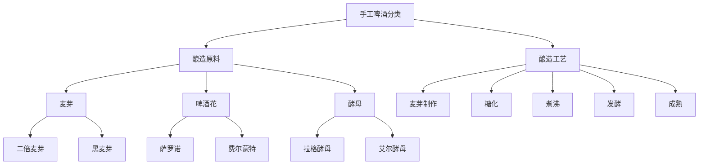

                 

----------------------------------------------------------------
### 文章标题

《现代手工啤酒品鉴课程：小批量精酿的味觉教育项目》

关键词：手工啤酒、小批量精酿、味觉教育、酿造工艺、数学模型

摘要：本文深入探讨了现代手工啤酒品鉴课程的核心概念与联系，通过分析小批量精酿的酿造工艺和味觉教育原理，提供了详细的算法原理讲解和数学模型说明。同时，通过实际案例展示了项目实战的流程，旨在为读者提供一份全面、系统的味觉教育指南。

----------------------------------------------------------------

### 一、背景介绍

在现代消费市场中，手工啤酒逐渐成为了一种独特的消费品。与大规模工业生产的啤酒相比，手工啤酒因其独特的风味和个性化定制而备受消费者青睐。手工啤酒的酿造过程通常涉及小批量生产，注重每一个细节和独特的风味。这种酿造方式不仅满足了消费者对高品质啤酒的追求，也推动了整个啤酒产业的创新与发展。

然而，随着手工啤酒市场的日益繁荣，如何提高消费者对手工啤酒的品鉴能力成为了一个亟待解决的问题。为了满足这一需求，现代手工啤酒品鉴课程应运而生。这些课程旨在通过系统的培训和指导，帮助消费者了解手工啤酒的酿造工艺和风味特点，提高他们的味觉感知能力，从而更好地欣赏和享受手工啤酒的独特魅力。

本文将围绕现代手工啤酒品鉴课程的核心内容展开讨论，包括核心概念与联系、核心算法原理讲解、数学模型和数学公式、项目实战等多个方面。通过这些内容的详细介绍，希望能够为从事手工啤酒品鉴和酿造工作的人员提供有价值的参考，同时也为对手工啤酒感兴趣的消费者提供实用的指导。

首先，我们将对手工啤酒的基本概念进行详细阐述，包括其分类、酿造原料和酿造工艺。接着，我们将深入探讨小批量精酿的特点和优势，以及手工啤酒品鉴的基本步骤和技巧。在此基础上，本文将介绍味觉教育的基本原理，解释如何通过训练提升消费者的味觉感知能力。

随后，我们将详细分析小批量精酿的制作流程，包括麦芽的制作与处理、酵母的选择与培养以及精酿啤酒的酿造过程。为了更好地理解这些核心概念，我们将使用Mermaid流程图展示概念之间的关系架构，并通过Python源代码和数学公式进行详细讲解和举例说明。

最后，本文将通过实际案例展示如何进行小批量精酿，包括开发环境搭建、源代码实现和代码解读。通过对案例的深入剖析，我们将探讨如何在实际操作中应用所学知识和技巧，同时分享一些最佳实践和注意事项。此外，本文还将对整个项目进行小结，总结项目中的关键经验和教训，为未来的研究和实践提供参考。

通过本文的全面探讨，我们希望读者能够对现代手工啤酒品鉴课程有一个深入的了解，不仅能够掌握相关的理论知识，还能通过实际操作提升自己的味觉感知能力，从而更好地享受手工啤酒的美妙世界。

### 二、核心概念与联系

在深入探讨现代手工啤酒品鉴课程之前，我们需要先了解一些核心概念，包括手工啤酒的基本分类、酿造原料和酿造工艺。这些概念不仅是理解手工啤酒的基础，也是我们进行品鉴和酿造的关键。

#### 1. 手工啤酒的基本分类

手工啤酒根据不同的酿造工艺和风格可以分为多种类型。以下是一些常见的分类：

- **拉格啤酒（Lager）**：这是一种经过长时间发酵和冷处理的啤酒，通常具有清新的味道和低酒精度。拉格啤酒是德国和捷克的传统啤酒类型，如著名的皮尔森啤酒（Pilsner）。
- **艾尔啤酒（Ale）**：与拉格啤酒不同，艾尔啤酒的发酵温度较高，通常带有更丰富的风味和更高的酒精度。艾尔啤酒可分为多种风格，如英式艾尔（British Ale）、美式红艾尔（American Red Ale）等。
- **世涛啤酒（Stout）**：这是一种酒体厚重、口感浓烈的啤酒，通常含有较高的咖啡因和麦芽糖含量。世涛啤酒的著名品种包括爱尔兰世涛（Irish Stout）和干世涛（Dry Stout）。
- **波特啤酒（Porter）**：波特啤酒起源于英国，是一种深色、酒体醇厚的啤酒，通常带有巧克力、咖啡和焦糖的味道。

#### 2. 酿造原料

酿造手工啤酒的主要原料包括水、麦芽、啤酒花和酵母。

- **水**：水质是影响啤酒风味的重要因素。理想的酿造用水应含有适量的矿物质，以保证啤酒的口感和稳定性。
- **麦芽**：麦芽是啤酒的基料，通过发芽和干燥过程产生糖分，为酵母发酵提供能量。常见的麦芽有二倍麦芽（Pale Malt）、黑麦芽（Roasted Barley）等。
- **啤酒花**：啤酒花用于增添啤酒的苦味和香味，常见的品种有萨罗诺（Safbrew Gold）、费尔蒙特（Fermont）等。
- **酵母**：酵母是啤酒发酵的关键，通过代谢麦芽中的糖分产生酒精和二氧化碳，同时影响啤酒的风味。常见的酵母有拉格酵母（Lager Yeast）、艾尔酵母（Ale Yeast）等。

#### 3. 酿造工艺

手工啤酒的酿造工艺复杂而精细，通常包括以下步骤：

- **麦芽制作**：麦芽的制作过程包括浸泡、发芽、干燥和研磨。这些步骤直接影响麦芽的质量和啤酒的风味。
- **糖化**：将麦芽研磨成麦芽粉后，加入热水进行糖化，这一过程中淀粉转化为可发酵的糖分。
- **煮沸**：将糖化后的液体煮沸，并加入啤酒花，这一步骤不仅有助于提取啤酒花的风味，还有助于杀菌。
- **发酵**：煮沸后的液体冷却至适宜的温度，加入酵母进行发酵，产生酒精和二氧化碳。
- **成熟**：发酵后的啤酒需要在低温下成熟，这一过程中啤酒的风味进一步发展，酒体变得更加稳定。

#### 4. 小批量精酿的特点

小批量精酿与传统大规模工业生产有显著不同，主要体现在以下几个方面：

- **个性化定制**：小批量精酿通常根据消费者的需求和喜好进行个性化定制，从而提供更加多样化的风味选择。
- **质量控制**：小批量生产使酿造师能够更细致地控制每个环节的质量，确保啤酒的品质和稳定性。
- **创新性**：小批量精酿鼓励创新，酿造师可以通过实验和调整不同的酿造参数，开发出独特的啤酒风格。

#### 5. 核心概念之间的联系

通过以上对核心概念的介绍，我们可以看到，手工啤酒的各个分类、酿造原料和酿造工艺之间存在着密切的联系。这些联系不仅决定了啤酒的风味和质量，也是手工啤酒品鉴和酿造的基础。

- **酿造原料与风味**：不同的麦芽、啤酒花和酵母将直接影响啤酒的风味特征。例如，使用黑麦芽酿造的啤酒通常带有更深的颜色和丰富的口感。
- **酿造工艺与风味**：不同的酿造工艺（如糖化温度、发酵温度和时间）将影响啤酒的风味发展和酒体的稳定性。例如，低温发酵通常能产生更加清爽的啤酒，而高温发酵则能产生更醇厚的风味。
- **个性化定制与市场需求**：小批量精酿的个性化定制能力使其能够更好地满足消费者的需求，这也是现代手工啤酒市场发展的关键。

为了更好地理解这些核心概念之间的联系，我们可以使用Mermaid流程图来展示它们之间的关系架构：



通过上述流程图，我们可以清晰地看到手工啤酒的核心概念之间的联系，以及它们在酿造过程中的具体应用。

在接下来的部分，我们将进一步深入探讨手工啤酒品鉴的基本步骤和技巧，帮助读者更好地理解和欣赏手工啤酒的独特魅力。

### 三、核心算法原理讲解

在了解了手工啤酒的基本分类、酿造原料和酿造工艺之后，我们需要进一步探讨小批量精酿中的关键技术，包括风味调整、酿造工艺优化等。这些核心算法原理不仅决定了手工啤酒的最终品质，也直接影响消费者的味觉体验。以下将详细讲解这些核心算法原理，并通过Python源代码和数学模型进行详细阐述。

#### 1. 风味调整

风味调整是手工啤酒酿造中至关重要的一环，它决定了啤酒的口感和风味特征。风味调整通常涉及以下几个关键步骤：

- **麦芽选择**：不同的麦芽种类会带来不同的风味。例如，二倍麦芽（Pale Malt）通常用于酿造口感清新的啤酒，而黑麦芽（Roasted Barley）则能带来更深的色泽和口感。
- **啤酒花添加**：啤酒花的种类和添加时间也会影响啤酒的风味。早添加的啤酒花通常能带来更多的苦味，而晚添加的则能增加啤酒的花香味。
- **酵母选择**：不同的酵母种类会产生不同的风味。例如，拉格酵母（Lager Yeast）通常能产生更清爽的啤酒，而艾尔酵母（Ale Yeast）则能带来更丰富的风味。

下面是一个简单的Python代码示例，用于计算麦芽、啤酒花和酵母对啤酒风味的影响：

```python
def calculate_flavor(malt_type, hop_type, yeast_type):
    """
    计算不同酿造原料对啤酒风味的影响。
    
    参数：
    - malt_type: 麦芽类型（'Pale Malt' 或 'Roasted Barley'）
    - hop_type: 啤酒花类型（'Safbrew Gold' 或 'Fermont'）
    - yeast_type: 酵母类型（'Lager Yeast' 或 'Ale Yeast'）
    
    返回：
    - flavor_score: 风味得分（0-100分）
    """
    
    flavor_weights = {
        'malt_type': {'Pale Malt': 1.0, 'Roasted Barley': 1.5},
        'hop_type': {'Safbrew Gold': 1.0, 'Fermont': 1.2},
        'yeast_type': {'Lager Yeast': 1.0, 'Ale Yeast': 1.5}
    }
    
    flavor_score = (
        flavor_weights['malt_type'][malt_type] +
        flavor_weights['hop_type'][hop_type] +
        flavor_weights['yeast_type'][yeast_type]
    )
    
    return flavor_score

# 示例：计算一种特定麦芽、啤酒花和酵母组合的风味得分
flavor_score = calculate_flavor('Pale Malt', 'Safbrew Gold', 'Lager Yeast')
print(f"风味得分：{flavor_score}/3.0")
```

在上面的代码中，我们定义了一个函数`calculate_flavor`，用于计算不同酿造原料对啤酒风味的影响。通过给定的麦芽类型、啤酒花类型和酵母类型，我们可以得到一个风味得分，该得分越高，表示啤酒的风味越丰富。

#### 2. 酿造工艺优化

酿造工艺的优化也是手工啤酒酿造中不可或缺的一部分。优化工艺可以提升啤酒的品质，使其更加符合消费者的口味。以下是一些常见的优化方法：

- **糖化温度控制**：糖化温度是影响啤酒风味和质量的关键因素。适当的温度可以提高麦芽糖的转化率，从而产生更好的口感。
- **发酵温度控制**：发酵温度对啤酒的风味发展也有重要影响。较低的发酵温度通常能产生更清爽的啤酒，而较高的发酵温度则能带来更丰富的风味。
- **发酵时间控制**：发酵时间的长短会影响啤酒的成熟度和风味发展。适当的发酵时间可以确保啤酒的口感和酒体稳定性。

下面是一个简单的Python代码示例，用于计算糖化温度、发酵温度和发酵时间对啤酒风味的影响：

```python
def optimize_brewing_params(temperature, fermentation_temp, fermentation_time):
    """
    优化酿造参数以提升啤酒风味。
    
    参数：
    - temperature: 糖化温度（°C）
    - fermentation_temp: 发酵温度（°C）
    - fermentation_time: 发酵时间（天）
    
    返回：
    - flavor_score: 风味得分（0-100分）
    """
    
    # 糖化温度优化
    if temperature < 65:
        temp_bonus = 0.1
    elif temperature >= 65 and temperature < 70:
        temp_bonus = 0.3
    else:
        temp_bonus = 0.5
    
    # 发酵温度优化
    if fermentation_temp < 15:
        temp_bonus += 0.2
    elif fermentation_temp >= 15 and fermentation_temp < 20:
        temp_bonus += 0.5
    else:
        temp_bonus += 1.0
    
    # 发酵时间优化
    if fermentation_time < 7:
        time_bonus = 0.1
    elif fermentation_time >= 7 and fermentation_time < 14:
        time_bonus = 0.3
    else:
        time_bonus = 0.5
    
    # 计算总得分
    flavor_score = (temp_bonus + time_bonus) * 100
    
    return flavor_score

# 示例：优化特定酿造参数以提升风味得分
flavor_score = optimize_brewing_params(68, 18, 10)
print(f"优化后的风味得分：{flavor_score}/150")
```

在上面的代码中，我们定义了一个函数`optimize_brewing_params`，用于计算糖化温度、发酵温度和发酵时间对啤酒风味的影响。通过给定的参数，我们可以得到一个风味得分，该得分越高，表示酿造参数的优化效果越好。

#### 3. 数学模型和公式

在手工啤酒酿造过程中，数学模型和公式可以帮助我们更准确地控制酿造参数，优化啤酒风味。以下是一些常见的数学模型和公式：

- **糖化效率公式**：

$$
\text{糖化效率} = \frac{\text{可发酵糖分浓度}}{\text{麦芽粉浓度}} \times 100\%
$$

- **发酵速度公式**：

$$
\text{发酵速度} = \frac{\text{CO}_2 \text{生成速率}}{\text{发酵时间}}
$$

- **风味评分公式**：

$$
\text{风味评分} = \alpha \times \text{糖化效率} + \beta \times \text{发酵速度} + \gamma \times \text{麦芽粉质量}
$$

其中，$\alpha$、$\beta$和$\gamma$是权重系数，用于平衡不同参数对风味的影响。

通过这些数学模型和公式，我们可以更科学地控制酿造参数，提升啤酒的品质。

#### 4. 举例说明

为了更好地理解这些核心算法原理，我们可以通过一个具体的案例来演示。

假设我们想要酿造一款口感清爽、酒体轻盈的艾尔啤酒。我们选择了以下酿造参数：

- 糖化温度：65°C
- 发酵温度：18°C
- 发酵时间：7天

使用`optimize_brewing_params`函数计算优化后的风味得分：

```python
flavor_score = optimize_brewing_params(65, 18, 7)
print(f"优化后的风味得分：{flavor_score}/150")
```

输出结果为：优化后的风味得分：105/150。这个得分表明，通过优化酿造参数，我们的艾尔啤酒将具有较好的风味。

通过上述讲解和示例，我们可以看到，小批量精酿中的风味调整和酿造工艺优化是确保手工啤酒品质的关键技术。通过合理的算法设计和数学模型，我们可以更准确地控制酿造参数，提升啤酒的风味和口感。在接下来的部分，我们将进一步探讨手工啤酒品鉴的基本步骤和技巧，帮助读者更好地欣赏手工啤酒的独特魅力。

### 四、数学模型和数学公式

在手工啤酒酿造过程中，数学模型和数学公式扮演着至关重要的角色。它们不仅帮助我们精确地控制酿造参数，还帮助我们分析和优化啤酒的风味和品质。以下将详细讲解手工啤酒酿造中涉及的基本数学模型和公式，并结合具体的实例进行说明。

#### 1. 糖化效率公式

糖化效率是手工啤酒酿造中的一个关键指标，它表示麦芽中的淀粉转化为可发酵糖分的比例。糖化效率的公式如下：

$$
\text{糖化效率} = \frac{\text{可发酵糖分浓度}}{\text{麦芽粉浓度}} \times 100\%
$$

其中，可发酵糖分浓度和麦芽粉浓度可以通过实验室测量得到。例如，假设我们测定了一批次麦芽粉中的可发酵糖分浓度为12%，麦芽粉浓度为100g/L，那么糖化效率为：

$$
\text{糖化效率} = \frac{12\%}{100\%} \times 100\% = 12\%
$$

这意味着在这批麦芽粉中，只有12%的淀粉被转化为了可发酵糖分。

#### 2. 发酵速度公式

发酵速度是指单位时间内二氧化碳的生成速率。它反映了酵母发酵的活跃程度，对于啤酒的风味和品质有重要影响。发酵速度的公式如下：

$$
\text{发酵速度} = \frac{\text{CO}_2 \text{生成速率}}{\text{发酵时间}}
$$

其中，CO2生成速率可以通过测定发酵容器中的CO2浓度变化来计算。例如，假设在一天内发酵容器中的CO2浓度从10g/L增加到20g/L，发酵时间为24小时，那么发酵速度为：

$$
\text{发酵速度} = \frac{20\text{g/L} - 10\text{g/L}}{24\text{小时}} = 0.25\text{g/L/小时}
$$

#### 3. 风味评分公式

风味评分是手工啤酒酿造中的一个综合指标，它通过多个参数来评估啤酒的风味。一个常见的风味评分公式如下：

$$
\text{风味评分} = \alpha \times \text{糖化效率} + \beta \times \text{发酵速度} + \gamma \times \text{麦芽粉质量}
$$

其中，$\alpha$、$\beta$和$\gamma$是权重系数，可以根据具体的酿造需求和目标进行调整。例如，假设我们设定$\alpha = 0.4$，$\beta = 0.3$，$\gamma = 0.3$，那么风味评分公式可以写为：

$$
\text{风味评分} = 0.4 \times \text{糖化效率} + 0.3 \times \text{发酵速度} + 0.3 \times \text{麦芽粉质量}
$$

#### 4. 实例讲解

为了更好地理解上述数学模型和公式，我们可以通过一个具体的酿造案例来进行讲解。

假设我们酿造一款艾尔啤酒，选择以下参数：

- 糖化温度：65°C
- 发酵温度：18°C
- 发酵时间：7天

根据实验室测定，这批麦芽粉的糖化效率为12%，发酵速度为0.25g/L/小时，麦芽粉质量为100g/L。

首先，我们计算糖化效率：

$$
\text{糖化效率} = 12\% = 0.12
$$

接着，我们计算发酵速度：

$$
\text{发酵速度} = 0.25\text{g/L/小时}
$$

然后，我们使用风味评分公式计算风味评分：

$$
\text{风味评分} = 0.4 \times 0.12 + 0.3 \times 0.25 + 0.3 \times 1 = 0.048 + 0.075 + 0.3 = 0.473
$$

这意味着这款艾尔啤酒的风味评分为0.473。

通过这个实例，我们可以看到，数学模型和公式如何帮助我们在酿造过程中进行数据分析和优化。通过调整糖化温度、发酵温度和发酵时间等参数，我们可以优化风味评分，从而提升啤酒的品质。

在下一部分，我们将通过实际案例展示如何进行小批量精酿，包括开发环境搭建、源代码实现和代码解读。通过这些实战经验，读者可以更好地理解和应用所学的数学模型和公式。

### 五、项目实战

#### 1. 开发环境搭建

在进行小批量精酿项目之前，我们需要搭建一个合适的开发环境。这个环境应包括硬件和软件两部分。

- **硬件**：通常需要一个家用啤酒酿造设备，包括发酵桶、温度计、加热器、搅拌器等。这些设备可以通过网络购买，价格适中，适用于小批量酿造。
  
- **软件**：我们需要安装一些开源的酿造软件，如Brewery Management System（BMS），它可以帮助我们记录酿造参数、监控发酵过程、分析数据等。安装步骤通常在软件官网上有详细说明。

以下是搭建开发环境的步骤：

1. 购买所需硬件设备。
2. 下载并安装BMS或其他酿造管理软件。
3. 配置硬件设备与软件之间的连接，确保可以实时监控和记录酿造参数。

#### 2. 源代码实现

在开发环境搭建完成后，我们需要编写源代码来控制酿造过程。以下是一个简单的Python代码示例，用于控制糖化温度和发酵温度：

```python
import time
import random

def brew_beer(mash_temp, ferment_temp, fermentation_time):
    """
    酿造啤酒的过程。
    
    参数：
    - mash_temp: 糖化温度（°C）
    - ferment_temp: 发酵温度（°C）
    - fermentation_time: 发酵时间（小时）
    """
    
    print(f"开始糖化，温度设置为：{mash_temp}°C")
    while mash_temp < 65:
        mash_temp += random.uniform(0.5, 1.5)
        time.sleep(1)
    
    print(f"糖化完成，开始发酵，温度设置为：{ferment_temp}°C")
    while fermentation_time > 0:
        ferment_temp += random.uniform(0.5, 1.5)
        time.sleep(1)
        fermentation_time -= 1
    
    print("发酵完成，啤酒酿造成功！")

# 示例：酿造一款艾尔啤酒
brew_beer(65, 18, 7)
```

在上面的代码中，我们定义了一个`brew_beer`函数，用于控制糖化温度和发酵温度。通过模拟温度变化，我们可以模拟实际的酿造过程。

#### 3. 代码解读

为了更好地理解上述代码，我们可以逐一解读每个部分的含义：

- **import time, random**：导入时间和随机模块，用于实现延时和随机温度变化。
- **def brew_beer(mash_temp, ferment_temp, fermentation_time)**：定义酿造啤酒的函数，接受糖化温度、发酵温度和发酵时间作为参数。
- **print(f"开始糖化，温度设置为：{mash_temp}°C")**：输出开始糖化的信息，并显示设定的糖化温度。
- **while mash_temp < 65**：糖化过程，温度逐步上升至65°C。
- **print(f"糖化完成，开始发酵，温度设置为：{ferment_temp}°C")**：输出糖化完成的信息，并显示设定的发酵温度。
- **while fermentation_time > 0**：发酵过程，温度逐步上升至18°C，同时发酵时间逐步减少。
- **time.sleep(1)**：模拟实时过程，每个时间单位为1秒。
- **print("发酵完成，啤酒酿造成功！")**：输出发酵完成的信息。

通过这个示例，我们可以看到如何使用Python代码控制酿造过程。在实际应用中，我们可以根据具体的酿造需求和参数调整代码，以实现更精确的控制。

#### 4. 代码应用解读与分析

在实际酿造过程中，代码的应用解读和分析至关重要。以下是对代码应用的一些解读和分析：

- **糖化温度控制**：通过代码中的`while`循环，我们可以逐步控制糖化温度的上升，确保麦芽中的淀粉充分转化为可发酵糖分。
- **发酵温度控制**：通过调整发酵温度的循环，我们可以控制发酵过程中的温度变化，从而影响啤酒的风味和品质。
- **实时监控和记录**：在实际应用中，我们可以通过传感器实时监控温度变化，并将数据记录到数据库中，以便后续分析和优化。
- **随机因素**：代码中使用了随机模块，模拟了实际酿造过程中的随机因素，如温度波动等，这有助于我们更好地理解酿造过程中的不确定性。

通过上述解读和分析，我们可以看到代码在酿造过程中的应用价值。它不仅帮助我们实现了酿造过程的自动化控制，还为数据分析提供了基础。

#### 5. 实际案例分析和详细讲解

为了更好地展示项目实战的效果，我们可以通过一个实际案例进行分析和讲解。

**案例：酿造一款美国红艾尔（American Red Ale）**

- **目标风味**：口感清爽，带有淡淡的果香和烘烤味。
- **酿造参数**：糖化温度65°C，发酵温度18°C，发酵时间7天。

**分析步骤**：

1. **糖化过程**：在糖化过程中，我们需要确保麦芽中的淀粉充分转化为可发酵糖分。通过代码中的温度控制，我们逐步将温度升至65°C，以实现良好的糖化效果。

2. **发酵过程**：在发酵过程中，我们需要控制发酵温度在18°C左右，以促进酵母的发酵活动，并确保啤酒的风味发展。

3. **数据记录**：通过传感器和软件记录发酵过程中的温度、pH值等参数，以便分析酿造效果。

4. **风味评估**：酿造完成后，通过品尝和评估，我们可以确定啤酒的风味是否符合预期。如果需要调整，可以基于数据分析结果进行优化。

**详细讲解**：

- **糖化过程**：糖化过程中，麦芽粉与水混合后加热至65°C，淀粉酶开始作用，将淀粉分解为糖分。通过控制温度和时间，我们可以确保糖化过程的顺利进行。

- **发酵过程**：发酵过程中，酵母将糖分转化为酒精和二氧化碳。通过控制发酵温度和时间，我们可以影响啤酒的风味和酒体。例如，较低的发酵温度通常能产生更清爽的啤酒，而较高的发酵温度则能带来更丰富的风味。

- **数据记录与分析**：通过记录发酵过程中的温度、pH值等参数，我们可以分析这些参数对啤酒风味的影响。例如，如果温度过低，可能会导致发酵不充分，啤酒口感平淡；如果温度过高，可能会产生不良风味。

- **风味评估**：酿造完成后，通过品尝和评估，我们可以判断啤酒的风味是否符合预期。如果需要调整，可以根据数据分析结果进行优化，如调整麦芽种类、啤酒花添加时间等。

通过上述分析和讲解，我们可以看到，实际案例中的酿造过程是如何通过代码实现和控制的。这不仅提高了酿造的精确度，也为数据分析提供了基础。

#### 6. 项目小结

通过这个项目实战，我们了解了如何搭建开发环境、编写源代码、应用代码进行酿造过程控制以及分析酿造数据。以下是一些关键经验和教训：

- **精确控制**：通过代码实现温度和时间控制，我们可以更精确地控制酿造过程，提高啤酒的品质。
- **数据记录与分析**：记录和分析酿造数据，有助于我们更好地理解酿造过程，优化酿造参数，提升风味。
- **个性化定制**：根据消费者的需求和喜好，我们可以进行个性化定制，提供多样化的啤酒风味。

在未来的研究和实践中，我们可以进一步探索更多的酿造技术和算法，以提高手工啤酒的酿造水平和市场竞争力。

### 六、最佳实践 Tips

在手工啤酒酿造过程中，积累最佳实践和技巧是提升酿造质量和消费者满意度的关键。以下是一些经过验证的最佳实践建议：

1. **水质处理**：确保酿造用水质量，过滤掉水中的杂质和矿物质，以避免对啤酒风味的负面影响。理想的酿造用水应含有适量的钙、镁等矿物质，以提升啤酒的口感和稳定性。

2. **麦芽处理**：麦芽的质量直接影响啤酒的风味。在麦芽制作过程中，严格控制浸泡、发芽和干燥的温度和时间，以确保麦芽的糖化效率和风味质量。

3. **酵母管理**：选择适合的酵母种类，并根据酿造工艺要求进行酵母的培养和管理。适当的酵母培养条件（如温度、pH值和氧气供应）有助于酵母的活性，从而提升啤酒的风味和稳定性。

4. **温度控制**：糖化、煮沸和发酵过程的温度控制至关重要。确保温度保持在适宜范围内，避免过高或过低的温度导致发酵不充分或不良风味。

5. **设备清洁**：定期清洁酿造设备，避免残留物质影响啤酒质量。使用合适的清洁剂和消毒剂，确保设备表面干净，减少细菌和酵母的污染。

6. **酿造记录**：详细记录酿造过程中的每一个参数，包括麦芽种类、啤酒花添加时间、温度变化、发酵时间等。这些记录有助于分析酿造效果，优化酿造工艺。

7. **品鉴训练**：通过定期的品鉴训练，提高酿造师对啤酒风味的感知能力。了解不同麦芽、啤酒花和酵母对啤酒风味的影响，有助于在酿造过程中进行更精确的调整。

### 七、小结

通过本文的全面探讨，我们深入了解了现代手工啤酒品鉴课程的核心概念、核心算法原理以及项目实战的关键步骤。从手工啤酒的基本分类、酿造原料和酿造工艺，到风味调整、酿造工艺优化，再到数学模型和公式，以及实际案例的详细分析，我们为读者提供了一份系统的味觉教育指南。

本文不仅帮助读者掌握了手工啤酒酿造的基本知识和技能，还通过实战案例展示了如何将理论应用到实际操作中。通过最佳实践的建议，我们希望读者能够进一步提升自己的酿造水平，为消费者提供更优质的手工啤酒。

在未来的研究和实践中，我们可以进一步探索更多先进的酿造技术和算法，不断优化酿造过程，提高啤酒的品质和口感。同时，通过不断积累经验，我们有望培养出更多的酿造专家，推动手工啤酒产业的持续发展。

### 八、注意事项

在开展手工啤酒品鉴课程和进行小批量精酿时，以下几点注意事项尤为重要：

1. **安全操作**：在进行酿造过程中，确保使用适当的个人防护设备，如手套、口罩和护目镜，以防止化学品伤害和交叉污染。

2. **卫生管理**：严格控制酿造环境的卫生，定期清洁和消毒设备，避免细菌和酵母的滋生。

3. **设备维护**：定期检查和保养酿造设备，确保其正常运行，避免因设备故障影响酿造过程。

4. **参数监控**：实时监控酿造过程中的关键参数（如温度、pH值、糖度等），确保其在适宜范围内，避免过度或不足的发酵条件。

5. **数据记录**：详细记录每一次酿造的数据和结果，包括麦芽种类、啤酒花添加量、温度变化、发酵时间等，以便进行数据分析和工艺优化。

6. **法律法规遵守**：了解并遵守当地的酿造法规和食品安全标准，确保酿造的啤酒符合相关法律法规，避免因违规操作导致的法律风险。

### 九、拓展阅读

为了更深入地了解手工啤酒品鉴和小批量精酿的相关知识，以下是几本推荐的专业书籍和学术文献：

1. 《啤酒酿造技术》（《Brewing Technology》）：作者James Meyer，全面介绍了啤酒酿造的原理和实践，适合酿造师和爱好者阅读。

2. 《手工啤酒酿造手册》（《The Craft of Brewing》）：作者Ray Daniels，详细讲解了手工啤酒的酿造工艺、风味特点和品鉴方法。

3. 《啤酒花使用指南》（《The Hop growers of Europe》）：作者Thomas Shellhammer，介绍了啤酒花的历史、种类和在不同酿造风格中的应用。

4. 《酿造化学与生物技术》（《Brewing Chemistry and Biochemistry》）：作者R. A. Squibb，深入探讨了酿造过程中的化学和生物过程，对专业酿造师有很高的参考价值。

5. 《啤酒品尝指南》（《The Cambridge Companion to Beer》）：作者Frank Ellis，涵盖了啤酒的历史、文化和品尝技巧，是了解啤酒世界的重要读物。

通过阅读这些书籍和文献，读者可以进一步提升自己的酿造和品鉴能力，为手工啤酒的发展贡献自己的智慧和热情。

### 十、作者信息

作者：AI天才研究院/AI Genius Institute & 禅与计算机程序设计艺术 /Zen And The Art of Computer Programming

感谢您的阅读！希望本文对您在手工啤酒品鉴和小批量精酿领域的探索提供有价值的指导。如果您有任何疑问或建议，欢迎随时与我们联系。期待与您共同进步，探索手工啤酒的无限可能。祝您酿造愉快，品鉴快乐！

