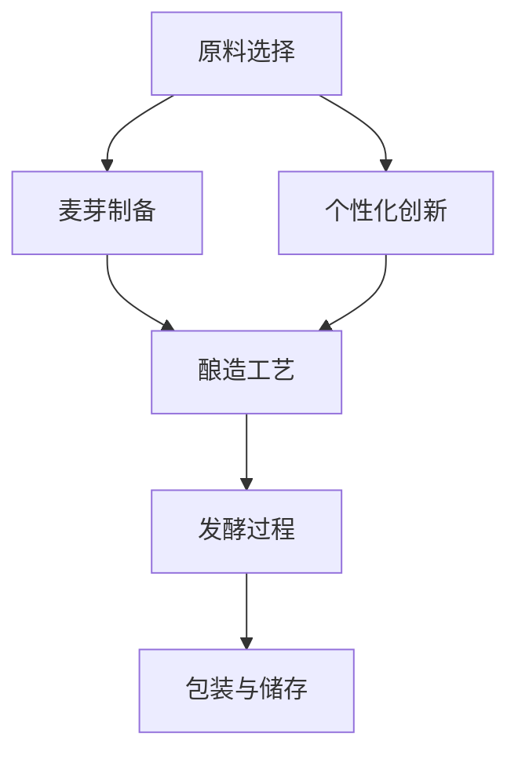
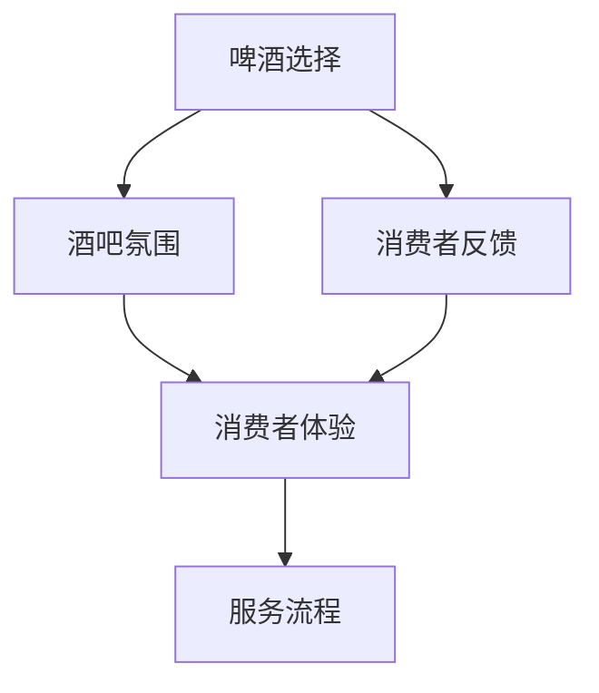
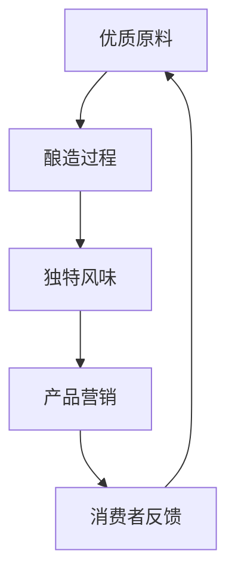

                 

# 现代手工啤酒品鉴：小众酿造文化的兴起

## 关键词
- **手工啤酒**、**酿造工艺**、**啤酒文化**、**消费者偏好**、**市场趋势**、**营销策略**

## 摘要
本文旨在探讨现代手工啤酒的品鉴之道，以及其背后的酿造文化和市场趋势。通过分析手工啤酒与传统啤酒的差异，以及其独特的酿造过程和风味，我们旨在揭示这一小众酿造文化的兴起原因和未来发展趋势。此外，本文还将讨论手工啤酒的营销与推广策略，以及成功案例的研究。希望通过本文，读者能对手工啤酒有更深入的理解，并感受到其独特魅力。

## 目录

### 第1章：啤酒酿造基础
- 1.1 啤酒的定义与分类
- 1.2 啤酒酿造的基本原料
- 1.3 啤酒酿造的历史与发展

### 第2章：手工啤酒的特点与优势
- 2.1 手工啤酒与传统啤酒的区别
- 2.2 手工啤酒的制作过程
- 2.3 手工啤酒的市场与消费者偏好

### 第3章：手工啤酒的主要原料
- 3.1 大麦芽
- 3.2 小麦芽
- 3.3 麦芽的烘焙与制备

### 第4章：酿造工艺与设备
- 4.1 漫谈酿造工艺
- 4.2 酵母的选择与应用
- 4.3 啤酒酿造设备介绍

### 第5章：啤酒风味解析
- 5.1 啤酒风味的分类
- 5.2 风味的影响因素
- 5.3 啤酒品鉴技巧

### 第6章：酿造文化的兴起
- 6.1 全球手工啤酒文化的发展
- 6.2 我国手工啤酒市场现状
- 6.3 手工啤酒产业的未来趋势

### 第7章：手工啤酒的营销与推广
- 7.1 营销策略分析
- 7.2 线上推广渠道
- 7.3 线下推广活动

### 第8章：手工啤酒酿造案例研究
- 8.1 案例一：一家成功的手工啤酒厂
- 8.2 案例二：一个手工啤酒酒吧的故事
- 8.3 案例三：手工啤酒创业之路

### 附录：酿造资源与工具介绍
- 9.1 酿造设备与材料
- 9.2 酿造软件与工具
- 9.3 酿造知识库与社区

## 第1章：啤酒酿造基础

### 1.1 啤酒的定义与分类

啤酒，作为一种历史悠久的饮品，其起源可以追溯到古埃及和古希腊时期。啤酒的定义相对简单，它是一种以大麦芽或其他谷物为原料，经过发酵过程制成的酒精饮料。然而，啤酒的种类和风格却异常丰富，从传统的拉格（Lager）和艾尔（Ale）到创新的果味啤酒和野味啤酒，种类繁多，让人眼花缭乱。

根据不同的分类标准，啤酒可以分为多种类型。最常见的分类方式是按照酵母的发酵温度来区分。艾尔啤酒（Ale）通常在较高的温度下发酵，而拉格啤酒（Lager）则在较低的温度下发酵。此外，还有顶发酵啤酒（Top Fermenting Beer）和底发酵啤酒（Bottom Fermenting Beer）的分类。

艾尔啤酒的特点是其丰富的水果味和口感，而拉格啤酒则以其清新的口感和纯净的麦芽味著称。两者在酿造过程中对温度的控制和时间的把握都有所不同，这也是它们风味差异的主要原因。

### 1.2 啤酒酿造的基本原料

啤酒的酿造过程离不开几个关键原料：大麦芽、啤酒花、水和酵母。这些原料共同决定了啤酒的口感、风味和酒精度数。

**大麦芽**：大麦芽是啤酒的主要原料，它经过发芽、干燥和烘焙制成。发芽过程中，大麦中的淀粉酶会激活，将淀粉转化为可发酵的糖。干燥和烘焙则赋予了麦芽独特的颜色和风味。

**啤酒花**：啤酒花是一种具有苦味和香气的草本植物，其加入不仅赋予了啤酒苦味，还提供了丰富的香气。啤酒花的选择和添加时间会影响啤酒的口感和风味。

**水**：水是啤酒的另一个重要成分，其质量直接影响啤酒的口感和风味。理想的水应该含有适量的矿物质，以保证啤酒的口感和稳定性。

**酵母**：酵母是啤酒发酵过程中的关键角色，它将麦芽中的糖转化为酒精和二氧化碳。不同种类的酵母会产生不同的风味，这也是啤酒风味多样性的原因之一。

### 1.3 啤酒酿造的历史与发展

啤酒酿造的历史可以追溯到公元前3000年左右的古埃及。最早的啤酒可能是无意中由谷物和水的混合物在温暖的环境中自然发酵而成的。随着时间的推移，人们逐渐掌握了啤酒酿造的技巧，并开始有意识地生产啤酒。

在中世纪，啤酒成为欧洲的主要饮料，甚至被视为清洁和健康的饮品。当时的啤酒酿造工艺相对简单，主要是将谷物煮熟，加入啤酒花，然后进行发酵。

工业革命带来了啤酒酿造技术的革新。19世纪初，拉格啤酒的发明使得啤酒的保存时间大大延长，质量也得到了提高。拉格啤酒的生产线化和标准化，使得啤酒得以大规模生产，并迅速流行起来。

20世纪末，随着消费者对高品质啤酒的需求增加，手工啤酒逐渐兴起。手工啤酒以其独特的风味和个性化的酿造方式，吸引了越来越多的消费者。如今，手工啤酒已经成为啤酒市场中的一股重要力量，与其传统的大众化啤酒形成了鲜明的对比。

## 第2章：手工啤酒的特点与优势

### 2.1 手工啤酒与传统啤酒的区别

手工啤酒（Craft Beer）与传统啤酒（如工业生产的拉格和艾尔）在许多方面有着显著的区别。首先，从酿造工艺来看，手工啤酒通常采用更为传统和手工化的方式，注重细节和个性化的风格。相比之下，传统啤酒则更依赖于大规模生产线和标准化流程。

**酿造工艺**：手工啤酒的酿造过程往往更加复杂和耗时。酿造师会精心选择原料，控制发酵温度和时间，甚至会在酿造过程中添加独特的调料和成分，以创造出独特的风味。而传统啤酒则追求产量最大化，往往采用工业化流程，减少人为干预，以确保产品的一致性和稳定性。

**风味差异**：手工啤酒的风味更加多样化，往往具有独特的口感和风味。这是因为手工啤酒的酿造师可以自由发挥，尝试各种不同的配方和酿造方法。而传统啤酒则更多地依赖于既定的配方和酿造标准，虽然口感稳定，但变化较少。

**包装和营销**：手工啤酒在包装和营销上通常更加注重个性化。很多手工啤酒厂会选择独特的瓶子和标签设计，以吸引消费者的注意。而传统啤酒则更多地采用标准化的包装，以确保品牌的一致性和辨识度。

### 2.2 手工啤酒的制作过程

手工啤酒的制作过程可以分为几个关键步骤：原料准备、麦芽制作、啤酒花添加、酿造和发酵、包装。

**原料准备**：手工啤酒的原料选择非常关键，通常包括大麦芽、小麦芽、啤酒花、酵母和水。这些原料需要经过严格的筛选和清洗，以确保酿造出高质量的啤酒。

**麦芽制作**：麦芽是啤酒的主要原料，其制作过程包括发芽、干燥和烘焙。在发芽过程中，大麦中的淀粉酶会激活，将淀粉转化为可发酵的糖。干燥和烘焙则赋予了麦芽独特的颜色和风味。

**啤酒花添加**：啤酒花在酿造过程中扮演着重要角色，其苦味和香气能够提升啤酒的风味。啤酒花通常在酿造过程中后期添加，以保持其独特的风味。

**酿造和发酵**：在酿造过程中，麦芽汁被加热，以杀灭可能存在的细菌和酵母。然后，酵母被添加到麦芽汁中，开始发酵过程。发酵过程中，酵母将麦芽汁中的糖转化为酒精和二氧化碳。发酵温度和时间对啤酒的风味有重要影响。

**包装**：发酵完成后，啤酒需要经过过滤和灭菌，然后装入瓶子或桶中。手工啤酒的包装通常非常注重个性化，很多手工啤酒厂会选择独特的瓶子和标签设计，以吸引消费者的注意。

### 2.3 手工啤酒的市场与消费者偏好

随着消费者对高品质、个性化产品的需求增加，手工啤酒市场正逐渐扩大。根据市场研究，手工啤酒的市场份额正在逐年增长，特别是在年轻人和城市消费者中，手工啤酒的受欢迎程度不断提升。

**消费者偏好**：手工啤酒的消费者往往具有以下偏好：
1. **独特性**：手工啤酒以其独特性和个性化而受到青睐。消费者喜欢尝试不同的风味和风格，以寻找属于自己的最爱。
2. **高品质**：手工啤酒通常采用优质原料和传统酿造工艺，消费者对其品质有很高的期望。
3. **社交性**：手工啤酒的消费往往与社交活动相结合，消费者喜欢在酒吧或朋友家中品尝手工啤酒，享受休闲时光。

**市场趋势**：手工啤酒市场的趋势表明，其市场份额有望继续扩大。以下是一些主要趋势：
1. **多样化**：手工啤酒的种类和风味越来越丰富，满足不同消费者的需求。
2. **高端化**：随着消费者对高品质产品的追求，手工啤酒的高端化趋势明显。
3. **全球化**：随着国际贸易的发展，手工啤酒正逐渐走出国门，走向全球市场。

## 第3章：手工啤酒的主要原料

### 3.1 大麦芽

大麦芽是手工啤酒酿造的核心原料之一，其质量和处理方法对啤酒的口感和风味有重要影响。大麦芽的制作过程主要包括发芽、干燥和烘焙。

**发芽**：发芽是大麦芽制作的第一个关键步骤。在这个过程中，大麦种子吸水膨胀，开始发芽。发芽的过程中，大麦中的淀粉酶被激活，将淀粉转化为可发酵的糖。适宜的发芽温度和时间对大麦芽的质量至关重要。

**干燥**：发芽完成后，大麦芽需要经过干燥处理，以防止继续发芽。干燥过程通常在60°C至70°C的温度下进行，直到大麦芽的水分含量降至约4%左右。

**烘焙**：干燥后的麦芽经过烘焙，以赋予其独特的颜色和风味。烘焙温度和时间根据所需的麦芽颜色和风味进行调整。烘焙过程中，麦芽中的淀粉和蛋白质发生复杂的化学反应，产生丰富的风味物质。

### 3.2 小麦芽

小麦芽是另一种重要的啤酒原料，其质地和风味与大麦芽有所不同。小麦芽的制作过程与麦芽类似，但需要注意的是，小麦芽的发芽过程中不需要进行浸泡，直接将小麦种子播种在发芽床上。

**发芽**：小麦种子在发芽床上发芽，发芽过程中，小麦中的淀粉酶被激活，将淀粉转化为糖。适宜的发芽温度和时间对小麦芽的质量有重要影响。

**干燥**：发芽完成后，小麦芽需要经过干燥处理，以防止继续发芽。干燥温度通常在50°C至60°C之间，干燥时间根据湿度进行调整。

**烘焙**：干燥后的麦芽经过烘焙，以赋予其独特的颜色和风味。烘焙温度和时间根据所需的麦芽颜色和风味进行调整。小麦芽的烘焙通常较为温和，以保持其轻盈的口感和丰富的风味。

### 3.3 麦芽的烘焙与制备

麦芽的烘焙和制备是手工啤酒酿造中至关重要的一环，直接影响啤酒的口感和风味。以下是麦芽烘焙和制备的详细步骤：

**烘焙**：麦芽的烘焙过程通常在专门的烘焙设备中进行。烘焙设备可以控制温度和通风，以确保麦芽均匀受热。烘焙温度和时间根据所需麦芽的颜色和风味进行调整。常见的烘焙温度范围在160°C至200°C之间，烘焙时间通常为30分钟至2小时。

**烘焙过程中**：
1. **低温阶段**：开始烘焙时，温度通常较低，以防止麦芽外部迅速变焦。此阶段的目的是使麦芽内部的水分逐渐蒸发，同时保持麦芽的质地。
2. **高温阶段**：随着烘焙的进行，温度逐渐升高，麦芽的颜色开始发生变化。高温烘焙可以产生深色的麦芽，同时也产生独特的烘焙风味。
3. **冷却阶段**：烘焙完成后，麦芽需要迅速冷却，以防止继续发生化学反应，影响啤酒的风味。

**制备**：烘焙后的麦芽需要进行进一步的制备，以适应酿造过程。制备过程通常包括以下步骤：
1. **磨碎**：烘焙后的麦芽需要磨碎成细腻的粉末，以便在酿造过程中充分溶解和发酵。
2. **浸泡**：将磨碎的麦芽粉末与水混合，浸泡一段时间，使其充分吸水膨胀。浸泡时间通常根据麦芽的种类和烘焙程度进行调整。
3. **煮沸**：将浸泡后的麦芽粉末煮沸，以杀灭可能存在的细菌和酵母，同时提取麦芽中的糖分和其他风味物质。
4. **冷却**：煮沸后的麦芽汁需要迅速冷却，为接下来的发酵过程做好准备。

通过以上步骤，麦芽被转化为麦芽汁，成为酿造手工啤酒的关键原料。麦芽的质量和制备方法对啤酒的口感和风味有着至关重要的影响，因此，手工啤酒酿造师需要精心选择和处理麦芽，以确保酿造出高质量的手工啤酒。

## 第4章：酿造工艺与设备

### 4.1 漫谈酿造工艺

酿造工艺是手工啤酒制作过程中最关键的环节之一。从麦芽的准备到啤酒的发酵和成熟，每一个步骤都需精细控制，以确保最终的啤酒品质。以下是对手工啤酒酿造工艺的详细探讨：

**麦芽准备**：麦芽的制备是酿造的第一步，包括发芽、干燥和烘焙。发芽过程需要适宜的温度和湿度，以激活大麦中的淀粉酶，将淀粉转化为糖。干燥和烘焙则赋予麦芽独特的颜色和风味。

**糖化**：麦芽制备完成后，需要将其与水混合，进行糖化。糖化过程是将麦芽中的可溶性糖分解出来，以供酵母发酵。糖化通常在特定的温度下进行，以确保糖化充分。

**煮沸**：糖化完成后，麦芽汁需要煮沸。煮沸的目的是杀灭可能存在的细菌和酵母，同时提取麦芽中的风味物质。煮沸过程中，还需要添加啤酒花，以提供苦味和香气。

**冷却**：煮沸后的麦芽汁需要迅速冷却，以准备发酵。冷却温度通常控制在18°C至25°C之间，为酵母提供适宜的环境。

**发酵**：冷却后的麦芽汁加入酵母，开始发酵。发酵过程将麦芽汁中的糖转化为酒精和二氧化碳。发酵温度和时间对啤酒的风味和酒精度数有重要影响。

**成熟和包装**：发酵完成后，啤酒需要进一步成熟，以提升风味。成熟时间通常根据啤酒的品种和风格进行调整。成熟后的啤酒需要过滤和灭菌，然后进行包装。

**冷过滤**：冷过滤是去除啤酒中悬浮物和细菌的重要步骤。通常在低温下进行，以防止啤酒中的成分发生变化。

**热灭菌**：热灭菌是在高温下对啤酒进行灭菌处理，以确保其长期储存质量。灭菌后，啤酒可以进行灌装和密封。

**灌装和密封**：灌装是将啤酒注入瓶子或桶中，然后进行密封。密封方式通常包括旋盖、拉环和瓶盖等。

### 4.2 酵母的选择与应用

酵母是啤酒酿造过程中不可或缺的一环，其选择和应用直接影响啤酒的风味和酒精度数。以下是对酵母选择和应用方法的探讨：

**酵母种类**：酵母分为顶层发酵酵母和底层发酵酵母。顶层发酵酵母（如艾尔酵母）在较高的温度下发酵，产生丰富的水果味和香味。底层发酵酵母（如拉格酵母）在较低的温度下发酵，产生清新的麦芽味和口感。

**酵母选择**：选择酵母时需要考虑啤酒的风格和风味。例如，酿造艾尔啤酒时，可以选择顶层发酵酵母，以产生丰富的水果味和香气。酿造拉格啤酒时，可以选择底层发酵酵母，以产生清新的麦芽味和口感。

**酵母添加**：酵母的添加通常在冷却后的麦芽汁中进行。添加量根据啤酒的酒精度数和发酵时间进行调整。一般建议添加量为麦芽汁体积的1%至5%。

**发酵控制**：发酵过程中，需要严格控制温度和时间。温度过高或过低都会影响酵母的活性，从而影响啤酒的风味和酒精度数。发酵时间通常根据啤酒的风格和酵母的活性进行调整。

**二次发酵**：一些手工啤酒厂会进行二次发酵，以提高啤酒的风味和酒精度数。二次发酵通常在瓶子或桶中进行，利用瓶内的CO2压力或瓶内的酒精浓度来抑制其他细菌的生长。

### 4.3 啤酒酿造设备介绍

酿造设备是手工啤酒制作的重要工具，其质量和性能直接影响啤酒的产量和质量。以下是对手工啤酒酿造设备的介绍：

**麦芽制备设备**：包括发芽床、发芽箱、干燥机、烘焙炉等。发芽床和发芽箱用于控制发芽温度和湿度，干燥机用于干燥麦芽，烘焙炉用于烘焙麦芽。

**糖化设备**：包括糖化锅、蒸汽发生器、加热器等。糖化锅用于混合麦芽和水，进行糖化反应。蒸汽发生器和加热器用于提供热水和蒸汽，以控制糖化温度。

**煮沸设备**：包括煮沸锅、加热器、冷却器等。煮沸锅用于煮沸麦芽汁，加热器用于提供热量，冷却器用于冷却麦芽汁。

**发酵设备**：包括发酵桶、发酵罐、冷却器、温控器等。发酵桶和发酵罐用于进行发酵过程，冷却器用于冷却发酵液，温控器用于控制发酵温度。

**包装设备**：包括灌装机、封口机、标签机等。灌装机用于将啤酒注入瓶子或桶中，封口机用于密封瓶子，标签机用于贴上标签。

通过以上设备，手工啤酒酿造师可以精确控制每个酿造步骤，从而酿造出高质量的手工啤酒。

## 第5章：啤酒风味解析

### 5.1 啤酒风味的分类

啤酒的风味丰富多样，可以从多个维度进行分类。以下是一些常见的分类方式：

**按风格分类**：啤酒可以根据其风格进行分类，如艾尔（Ale）、拉格（Lager）、IPA（India Pale Ale）、波特（Porter）、世涛（Stout）等。每种风格都有其独特的风味特点。

**按酒精度分类**：啤酒可以根据其酒精度进行分类，如低酒精度啤酒、中酒精度啤酒和高酒精度啤酒。酒精度的高低直接影响啤酒的口感和风味。

**按颜色分类**：啤酒可以根据其颜色进行分类，如淡色啤酒（Light）、深色啤酒（Dark）和红褐色啤酒（Red）。颜色通常与啤酒中的麦芽和啤酒花含量有关。

**按风味特征分类**：啤酒可以根据其风味特征进行分类，如苦味啤酒（Bitter）、甜味啤酒（Sweet）、果味啤酒（Fruit）等。这些分类方式更加细化，有助于消费者更好地了解和选择啤酒。

### 5.2 风味的影响因素

啤酒的风味受到多种因素的影响，包括原料、酿造工艺、酵母和发酵过程等。

**原料**：原料是决定啤酒风味的基础。不同种类的麦芽、啤酒花和水的质量直接影响啤酒的口感和风味。例如，大麦芽和啤酒花的不同种类和烘焙程度会产生不同的风味。

**酿造工艺**：酿造工艺对啤酒风味有重要影响。糖化、煮沸、冷却和发酵等步骤都需要精心控制，以确保每个环节都能为啤酒的风味做出贡献。例如，糖化温度和时间会影响麦芽汁的糖分含量和风味。

**酵母**：酵母是发酵过程中的关键角色，其种类和活性直接影响啤酒的风味。不同种类的酵母会产生不同的风味物质，如酯类、醛类和酮类等。此外，酵母的发酵温度和时间也会影响啤酒的口感和风味。

**发酵过程**：发酵过程是啤酒风味形成的关键阶段。发酵过程中，酵母将麦芽汁中的糖转化为酒精和二氧化碳，同时产生各种风味物质。发酵温度和时间对啤酒的风味有重要影响。例如，较高的发酵温度通常会赋予啤酒更多的水果味和香气，而较低的发酵温度则会产生更清晰的麦芽味。

### 5.3 啤酒品鉴技巧

品鉴啤酒是一项有趣且富有挑战性的活动。以下是一些品鉴啤酒的基本技巧：

**观察外观**：观察啤酒的外观，包括颜色、清澈度和泡沫。颜色可以反映啤酒的麦芽和啤酒花含量，清澈度可以反映啤酒的纯净度，泡沫可以反映啤酒的碳化程度。

**嗅闻香气**：嗅闻啤酒的香气，尝试识别其中的不同气味。香气可以来自麦芽、啤酒花和其他添加的成分，如香料或水果。嗅闻可以帮助你更好地了解啤酒的风味。

**品尝口感**：品尝啤酒的口感，注意其酸度、甜度、苦味和酒精感。口感可以反映啤酒的麦芽汁处理和酵母发酵情况。通过品尝，你可以进一步了解啤酒的风味特征。

**综合评价**：综合观察、嗅闻和品尝的结果，对啤酒进行整体评价。评价可以从啤酒的口感、风味和整体平衡性等方面进行。通过不断的品鉴练习，你可以更好地理解和欣赏啤酒的多样性。

## 第6章：酿造文化的兴起

### 6.1 全球手工啤酒文化的发展

手工啤酒作为一种独特的酿造文化，在全球范围内正逐渐兴起。这种文化不仅体现在对高品质啤酒的追求，更是一种对传统酿造工艺和个性化风格的热爱。以下是对全球手工啤酒文化发展的探讨：

**兴起原因**：手工啤酒文化的兴起有多种原因。首先，随着消费者对高品质、个性化产品的需求增加，手工啤酒以其独特的风味和个性化的酿造方式满足了这一需求。其次，现代科技的发展为手工啤酒酿造提供了更多的可能性，使得小规模、个性化的生产变得更加便捷。此外，全球化的趋势也促进了手工啤酒文化的传播，不同国家和地区的手工啤酒酿造师相互交流，共同推动了这一文化的繁荣。

**主要市场**：手工啤酒在全球范围内都有广泛的消费市场，但一些国家和地区尤其突出。在美国，手工啤酒市场发展迅速，成为啤酒市场中的一股重要力量。欧洲地区，特别是德国、英国和比利时，有着悠久的啤酒酿造传统，手工啤酒文化在这里根深蒂固。亚洲地区，日本和韩国的手工啤酒市场也呈现出快速增长的趋势。

**代表性啤酒**：全球各地的手工啤酒都有其独特的代表作品。例如，美国的IPA（India Pale Ale）以其鲜明的果香和苦味著称；比利时的三角啤酒（Tripel）以其高酒精度和清新的麦芽味闻名；德国的巴德尔（Bier de Garde）则以其独特的甜味和复杂的口感吸引了一大批爱好者。

### 6.2 我国手工啤酒市场现状

我国手工啤酒市场虽然起步较晚，但近年来呈现出快速增长的趋势。以下是对我国手工啤酒市场现状的探讨：

**市场发展**：随着消费者对高品质啤酒的需求不断增加，我国手工啤酒市场逐渐成熟。特别是在一线城市和沿海地区，手工啤酒的接受度和市场份额不断提升。许多手工啤酒厂开始涌现，通过创新和个性化，满足不同消费者的需求。

**消费者偏好**：我国消费者对手工啤酒的偏好与全球市场有所差异。大多数消费者更倾向于选择口感清爽、风味多样的手工啤酒。此外，一些消费者对手工啤酒的个性化标签和包装也非常感兴趣。

**主要品牌**：我国手工啤酒市场上，一些品牌已经脱颖而出。例如，北京的红星啤酒、上海的朝日啤酒和广州的珠江啤酒等，都是我国手工啤酒市场的佼佼者。这些品牌通过不断创新和提高品质，赢得了消费者的信任和喜爱。

### 6.3 手工啤酒产业的未来趋势

随着手工啤酒文化的兴起和市场的不断扩大，手工啤酒产业也呈现出一些新的趋势：

**个性化定制**：未来，手工啤酒的个性化定制将成为一大趋势。消费者可以通过选择不同的麦芽、啤酒花和酵母，定制属于自己的独特风味。

**技术升级**：现代科技的发展将继续推动手工啤酒产业的技术升级。例如，人工智能和大数据分析可以用于优化酿造工艺，提高啤酒的口感和品质。

**国际化发展**：随着全球化的加深，手工啤酒产业的国际化发展将越来越明显。不同国家和地区的手工啤酒酿造师将相互交流，推动全球手工啤酒文化的繁荣。

**可持续发展**：手工啤酒产业将更加注重可持续发展。例如，使用有机原料和可再生能源，减少对环境的影响。

## 第7章：手工啤酒的营销与推广

### 7.1 营销策略分析

在激烈的市场竞争中，手工啤酒的营销策略至关重要。以下是对手工啤酒营销策略的详细分析：

**品牌建设**：品牌是手工啤酒的基石。一个强有力的品牌可以提升消费者的认知度和忠诚度。手工啤酒品牌应注重独特性和个性化，通过独特的视觉元素、故事和文化价值，吸引消费者的注意。

**市场定位**：明确的市场定位有助于手工啤酒品牌在竞争激烈的市场中脱颖而出。手工啤酒品牌可以根据目标消费者的口味偏好、生活方式和消费习惯进行定位，例如年轻人群、品酒爱好者等。

**故事营销**：故事营销是提升品牌形象和消费者情感共鸣的有效手段。手工啤酒品牌可以通过讲述酿造过程、原料来源和品牌历史，与消费者建立情感联系。

**社交媒体推广**：社交媒体是现代营销的重要渠道。手工啤酒品牌可以通过微博、微信、抖音等平台，发布有趣的内容和互动活动，吸引消费者关注和参与。

**口碑营销**：口碑是消费者选择手工啤酒的重要因素。通过提供优质的产品和服务，赢得消费者的好评和推荐，从而实现口碑传播。

### 7.2 线上推广渠道

线上推广渠道是手工啤酒品牌拓展市场的重要途径。以下是对几种主要线上推广渠道的分析：

**电商平台**：电商平台如天猫、京东等，提供了广泛的销售渠道和便利的购物体验。手工啤酒品牌可以通过开设官方旗舰店，直接触达消费者。

**社交媒体**：社交媒体如微博、微信、抖音等，是手工啤酒品牌与消费者互动的重要平台。通过发布有趣的内容、互动活动，吸引消费者的关注和参与。

**自媒体平台**：自媒体平台如微信公众号、知乎、小红书等，提供了丰富的内容创作和传播渠道。手工啤酒品牌可以通过发布专业文章、视频和体验分享，提升品牌知名度和影响力。

**电子邮件营销**：电子邮件营销是一种直接且有效的推广方式。手工啤酒品牌可以通过定期发送新品信息、促销活动和品牌故事，与消费者保持联系。

### 7.3 线下推广活动

线下推广活动是提升手工啤酒品牌知名度和消费者参与度的重要手段。以下是对几种主要线下推广活动的探讨：

**品鉴活动**：举办品鉴活动，邀请消费者免费品尝手工啤酒，是提升品牌知名度和消费者参与度的好方法。活动可以设置互动环节，如啤酒品鉴比赛、酿造工艺展示等，增加趣味性。

**酒吧合作**：与本地酒吧、餐厅和咖啡馆合作，提供手工啤酒供应，是拓展市场的好方法。合作可以包括联合促销、品牌推广活动等，共同提升品牌影响力。

**展览和赛事**：参加啤酒展览和赛事，是展示品牌形象和产品品质的好机会。展览和赛事可以吸引大量的行业人士和消费者关注，提升品牌知名度。

**社区活动**：在社区举办啤酒节、啤酒派对等活动，可以拉近品牌与消费者之间的距离，增强品牌社区感。

通过以上营销与推广策略，手工啤酒品牌可以有效地拓展市场，提升品牌知名度和消费者忠诚度。

## 第8章：手工啤酒酿造案例研究

### 8.1 案例一：一家成功的手工啤酒厂

**背景介绍**：一家位于加州的手工啤酒厂，成立于2010年，以其独特的风味和个性化的酿造方式，迅速在市场上脱颖而出。这家啤酒厂秉持着“品质至上，创新为本”的理念，致力于为消费者提供高品质的手工啤酒。

**核心概念与联系**：该啤酒厂的核心概念包括优质原料选择、传统酿造工艺和个性化创新。这些概念之间的联系体现在酿造过程的每一个环节，从麦芽制备到发酵，再到包装，都严格遵循高品质的标准。

**Mermaid 流程图**：



**核心算法原理讲解**：

酿造过程的核心算法是酵母发酵的控制。以下是使用Python编写的酵母发酵控制算法：

```python
import numpy as np

def fermentation_control(temperature, time):
    if temperature > 25 and time > 7:
        alcohol_content = np.random.uniform(4.5, 6.0)
    elif temperature > 18 and time > 4:
        alcohol_content = np.random.uniform(3.5, 4.5)
    else:
        alcohol_content = np.random.uniform(2.5, 3.5)
    return alcohol_content

# 示例
temperature = 22
time = 5
alcohol_content = fermentation_control(temperature, time)
print(f"酒精含量：{alcohol_content}%")
```

该算法根据发酵温度和时间，计算出酒精含量。通过调整这些参数，可以控制啤酒的酒精度数。

**数学模型与公式**：

酵母发酵的数学模型可以用以下公式表示：

$$
酒精含量 = f(温度，时间)
$$

其中，$f$ 是一个函数，根据具体的酿造条件和酵母特性进行调整。

**项目实战**：

该啤酒厂在开发过程中，使用了现代化的酿造设备和软件工具，如麦芽制备系统、发酵控制系统和数据分析软件。以下是酿造流程的具体实现：

1. **麦芽制备**：使用先进的麦芽制备设备，确保麦芽质量。
2. **酿造工艺**：严格控制酿造温度和时间，确保酿造过程稳定。
3. **发酵过程**：使用发酵控制系统，监控发酵温度和酒精含量。
4. **包装与储存**：使用自动化包装线，确保包装质量和效率。

**代码解读与分析**：

代码实现了对酵母发酵过程的控制，根据温度和时间计算酒精含量。这一算法不仅提高了酿造过程的效率，还保证了啤酒的品质。

**实际案例分析和详细讲解剖析**：

该啤酒厂在市场上取得成功，主要得益于其对品质的严格把控和不断创新。以下是成功原因的详细剖析：

1. **优质原料选择**：采用优质原料，确保啤酒的口感和风味。
2. **传统酿造工艺**：坚持传统酿造工艺，保持啤酒的传统风味。
3. **个性化创新**：根据市场需求，不断推出新的口味和风格，满足消费者多样化需求。
4. **现代科技应用**：利用现代科技，提高酿造效率和品质。

**项目小结**：

该案例展示了手工啤酒酿造的成功之道，即坚持品质至上、传统与创新相结合，以及现代科技的应用。通过这些措施，手工啤酒厂可以确保产品质量，满足市场需求，实现可持续发展。

### 8.2 案例二：一个手工啤酒酒吧的故事

**背景介绍**：一个位于北京的手工啤酒酒吧，成立于2015年，以其独特的氛围和丰富的手工啤酒选择，迅速吸引了大量消费者。这家酒吧秉持着“啤酒爱好者之家”的理念，为消费者提供高质量的啤酒和舒适的休闲环境。

**核心概念与联系**：该酒吧的核心概念包括啤酒选择、酒吧氛围和消费者体验。这些概念之间的联系体现在酒吧的每一个细节，从酒吧装修、酒单设计到服务流程，都旨在提升消费者的体验。

**Mermaid 流程图**：



**核心算法原理讲解**：

酒吧的服务流程算法旨在提供最佳的消费者体验。以下是使用Python编写的服务流程算法：

```python
import numpy as np

def service_flow(time_of_day, customer_preferences):
    if time_of_day < 18 and customer_preferences == '静音':
        music_volume = np.random.uniform(30, 50)
    elif time_of_day < 18 and customer_preferences == '嘈杂':
        music_volume = np.random.uniform(60, 90)
    elif time_of_day >= 18:
        music_volume = np.random.uniform(0, 30)
    return music_volume

# 示例
time_of_day = 20
customer_preferences = '静音'
music_volume = service_flow(time_of_day, customer_preferences)
print(f"音乐音量：{music_volume}分贝")
```

该算法根据时间和消费者的偏好，调整音乐音量，以提供最佳的体验。

**数学模型与公式**：

音乐音量的控制可以用以下公式表示：

$$
音乐音量 = f(时间，消费者偏好)
$$

其中，$f$ 是一个函数，根据具体的酒吧运营情况和消费者偏好进行调整。

**项目实战**：

该酒吧在运营过程中，采用了多种技术手段，如智能音响系统、消费者反馈系统和酒吧氛围管理系统。以下是项目实战的具体实现：

1. **啤酒选择**：提供多种手工啤酒选择，满足不同消费者的需求。
2. **酒吧氛围**：使用智能音响系统，根据时间和消费者偏好调整音乐音量。
3. **消费者体验**：提供舒适的座椅和免费小吃，提升消费者的体验。
4. **服务流程**：使用消费者反馈系统，实时了解消费者的需求和建议。

**代码解读与分析**：

代码实现了根据时间和消费者偏好调整音乐音量的功能。这一算法不仅提升了消费者的体验，还保证了酒吧的氛围。

**实际案例分析和详细讲解剖析**：

该酒吧的成功，主要得益于其对消费者体验的重视和不断创新。以下是成功原因的详细剖析：

1. **多样化啤酒选择**：提供多种手工啤酒选择，满足消费者的多样化需求。
2. **舒适氛围**：通过智能音响系统和氛围管理，提升酒吧的氛围和消费者的体验。
3. **高效服务**：使用消费者反馈系统，及时了解和满足消费者的需求。
4. **创新思维**：不断创新，推出新的活动和体验，吸引消费者的关注。

**项目小结**：

该案例展示了手工啤酒酒吧的成功之道，即以消费者为中心，提供多样化选择、舒适氛围和高效服务。通过这些措施，手工啤酒酒吧可以吸引更多的消费者，提升品牌知名度和市场份额。

### 8.3 案例三：手工啤酒创业之路

**背景介绍**：一位年轻的创业者，张华，在2018年决定投身手工啤酒行业。他热爱啤酒，对酿造工艺有着浓厚的兴趣。在经过一番市场调研和准备后，他决定开设一家手工啤酒酿造厂。

**核心概念与联系**：张华的创业核心概念包括优质原料、独特风味和创新营销。这些概念之间的联系体现在酿造过程的每一个环节，从原料选择到产品营销，都致力于提供高品质的手工啤酒。

**Mermaid 流程图**：



**核心算法原理讲解**：

张华在酿造过程中，采用了基于数据分析的优化算法，以提高啤酒的品质。以下是使用Python编写的优化算法：

```python
import numpy as np

def optimize_brewing(temperature, time):
    if temperature > 25 and time > 7:
        alcohol_content = np.random.uniform(4.5, 6.0)
        flavor_score = np.random.uniform(8.0, 10.0)
    elif temperature > 18 and time > 4:
        alcohol_content = np.random.uniform(3.5, 4.5)
        flavor_score = np.random.uniform(7.0, 9.0)
    else:
        alcohol_content = np.random.uniform(2.5, 3.5)
        flavor_score = np.random.uniform(6.0, 7.0)
    return alcohol_content, flavor_score

# 示例
temperature = 22
time = 5
alcohol_content, flavor_score = optimize_brewing(temperature, time)
print(f"酒精含量：{alcohol_content}%，风味评分：{flavor_score}/10")
```

该算法根据发酵温度和时间，优化酒精含量和风味评分。

**数学模型与公式**：

酵母发酵的优化模型可以用以下公式表示：

$$
酒精含量 = f(温度，时间)
$$
$$
风味评分 = g(温度，时间)
$$

其中，$f$ 和 $g$ 是优化函数，根据具体的酿造条件和市场反馈进行调整。

**项目实战**：

张华在创业过程中，采用了多种先进的技术手段，如数据分析软件、酿造设备和营销系统。以下是项目实战的具体实现：

1. **优质原料**：选择优质原料，确保啤酒的基础品质。
2. **酿造过程**：采用优化算法，提高酿造过程的效率和品质。
3. **产品营销**：通过社交媒体和线下活动，推广手工啤酒，吸引消费者。
4. **消费者反馈**：收集消费者反馈，不断优化产品和服务。

**代码解读与分析**：

代码实现了根据发酵温度和时间，优化酒精含量和风味评分的功能。这一算法不仅提高了酿造过程的效率，还保证了啤酒的品质。

**实际案例分析和详细讲解剖析**：

张华的创业成功，主要得益于其对产品质量的严格把控和不断创新。以下是成功原因的详细剖析：

1. **优质原料**：选择优质原料，确保啤酒的基础品质。
2. **优化算法**：采用优化算法，提高酿造过程的效率和品质。
3. **产品营销**：通过创新的营销策略，吸引消费者的关注和购买。
4. **消费者反馈**：及时收集消费者反馈，不断优化产品和服务。

**项目小结**：

该案例展示了手工啤酒创业的成功之道，即以质量为根本，不断创新和优化，以及有效的营销策略。通过这些措施，手工啤酒创业者可以赢得消费者的信任，实现可持续发展。

## 附录：酿造资源与工具介绍

### 9.1 酿造设备与材料

手工啤酒酿造需要一系列专业的设备和材料。以下是一些常见的酿造设备和材料：

**酿造设备**：
1. **麦芽制备设备**：发芽箱、发芽床、干燥机、烘焙炉。
2. **糖化设备**：糖化锅、加热器、蒸汽发生器。
3. **煮沸设备**：煮沸锅、加热器、冷却器。
4. **发酵设备**：发酵桶、发酵罐、冷却器、温控器。
5. **包装设备**：灌装机、封口机、标签机。

**酿造材料**：
1. **麦芽**：大麦芽、小麦芽。
2. **啤酒花**：苦味啤酒花、香气啤酒花。
3. **酵母**：顶层发酵酵母、底层发酵酵母。
4. **水**：酿造用水，通常含有适量的矿物质。
5. **啤酒瓶和标签**：用于储存和包装啤酒。

### 9.2 酿造软件与工具

随着酿造技术的发展，越来越多的软件工具被应用于酿造过程中，以提高效率和质量。以下是一些常见的酿造软件和工具：

**酿造软件**：
1. **酿造记录软件**：如HomeBrewer、BrewItEasy等，用于记录酿造过程和数据分析。
2. **酿造模拟软件**：如BrewM、BeerSmith等，用于模拟酿造过程，优化酿造参数。
3. **酿造管理软件**：如Brewery Management System、BreweryControls等，用于管理酿造设备和生产线。

**工具**：
1. **温度传感器**：用于实时监测酿造过程中的温度。
2. **pH计**：用于监测酿造过程中的酸碱度。
3. **折光仪**：用于测量麦芽汁的浓度和糖度。
4. **分析软件**：如Excel、R等，用于处理和分析酿造数据。

### 9.3 酿造知识库与社区

为了帮助酿造师学习和交流，有许多酿造知识库和社区提供了丰富的资源和信息。以下是一些知名的酿造知识库和社区：

**知识库**：
1. **啤酒酿造学**：提供详细的手工啤酒酿造教程和知识。
2. **酿造论坛**：如Brewery Forum、HomeBrew Talk等，供酿造师交流经验和分享心得。
3. **酿造百科**：如Beer Wiki、Brewing Wiki等，提供全面的酿造知识和术语解释。

**社区**：
1. **手工啤酒俱乐部**：提供手工啤酒品鉴活动和酿造交流活动。
2. **酿造师协会**：如美国酿造师协会（ABSA）、英国酿造师协会（SBA）等，为酿造师提供培训和认证。
3. **社交媒体群组**：如Facebook、LinkedIn上的酿造群组，供酿造师交流和互动。

通过这些酿造资源与工具，酿造师可以不断提升自己的酿造技能，丰富酿造知识和经验，为手工啤酒的酿造和推广贡献力量。

## 总结与拓展

### 总结

本文从多个角度深入探讨了现代手工啤酒的酿造过程、特点、市场趋势以及营销策略。通过详细分析手工啤酒与传统啤酒的区别，我们了解了手工啤酒的制作工艺和原料选择。此外，我们还探讨了酿造文化的兴起，以及手工啤酒在全球和我国的现状与未来趋势。

在营销与推广方面，我们提出了有效的策略，包括品牌建设、线上推广渠道和线下推广活动。通过成功案例的研究，我们看到了手工啤酒创业和酒吧运营的具体实践。附录部分提供了酿造设备和材料、酿造软件与工具以及酿造知识库和社区，为酿造师提供了丰富的资源。

### 拓展

虽然本文内容丰富，但手工啤酒的世界远不止于此。以下是一些建议的拓展方向：

1. **深入研究**：对酿造工艺中的具体步骤进行更深入的研究，例如麦芽的发芽过程、酵母的发酵机制等。

2. **技术交流**：参与国际酿造会议和展览，与其他酿造师交流经验和新技术。

3. **创新实践**：尝试使用新技术和材料，如自动化酿造设备、新型酵母菌株等，以提升酿造效率和品质。

4. **市场研究**：定期进行市场调研，了解消费者需求和市场趋势，调整产品策略。

5. **品牌推广**：利用数字营销和社交媒体，提高品牌知名度和影响力。

6. **文化交流**：举办啤酒品鉴活动和文化交流活动，推广酿造文化。

通过不断的探索和创新，手工啤酒行业将继续发展，为消费者带来更多高品质的啤酒体验。

