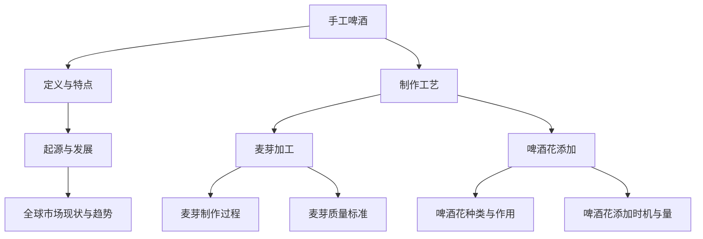

                 

# 《现代手工啤酒文化：小型酿造厂的社区价值》

> 关键词：手工啤酒、小型酿造厂、社区价值、环境保护、市场营销

> 摘要：本文将探讨现代手工啤酒文化的兴起及其对小型酿造厂的社区价值。通过对手工啤酒的起源、制作工艺、小型酿造厂的设施与设备、市场营销与品牌建设等方面进行详细分析，揭示小型酿造厂在社区中的重要作用，以及其如何通过环境保护和可持续发展实践来提升社区价值。

## 第一部分：手工啤酒文化概述

### 第1章：手工啤酒的起源与发展

#### 1.1 手工啤酒的定义与特点

手工啤酒是一种以传统方式手工酿造的啤酒，其制作过程强调手工技艺和工匠精神。与工业化生产的啤酒相比，手工啤酒具有独特的风味和品质。手工啤酒的特点包括：

- **口感丰富**：手工啤酒在酿造过程中，酿酒师可以灵活调整麦芽、啤酒花、酵母等原料的使用比例和酿造工艺，使得每批啤酒都有独特的风味。
- **限量生产**：手工啤酒通常采用小批量生产，以保证每一批次的品质。这也使得手工啤酒更具收藏价值和稀缺性。
- **健康环保**：手工啤酒酿造过程中，酿酒师注重使用天然原料，减少化学添加剂的使用，有利于环境保护。

#### 1.2 手工啤酒的起源与发展历程

手工啤酒的起源可以追溯到古埃及和古希腊时期。在那个时代，啤酒是人们日常生活中不可或缺的饮品。随着时间的推移，啤酒酿造技术不断发展，手工啤酒逐渐在各地兴起。

- **欧洲手工啤酒**：中世纪时期，欧洲各国开始发展自己的手工啤酒文化。德国慕尼黑啤酒节成为世界上最具影响力的啤酒节，展现了德国手工啤酒的魅力。
- **美国手工啤酒**：20世纪70年代，美国手工啤酒运动兴起，众多酿酒师开始致力于手工啤酒的制作。如今，美国已成为世界上手工啤酒生产大国之一。

#### 1.3 全球手工啤酒市场的现状与趋势

当前，全球手工啤酒市场呈现出快速增长的趋势。随着消费者对高品质、健康环保饮品的需求不断增加，手工啤酒市场前景广阔。

- **市场规模**：根据市场调研数据显示，全球手工啤酒市场在过去几年中呈现出两位数的增长。预计未来几年，市场规模将继续扩大。
- **消费群体**：手工啤酒消费者主要集中在年轻人、中产阶级和爱好品酒的消费者。他们对高品质、独特的啤酒有着较高的追求。
- **未来趋势**：随着科技的进步和消费者需求的多样化，手工啤酒的制作工艺将不断优化，新产品、新口味将不断涌现。

## 第二部分：手工啤酒的制作工艺

### 第2章：手工啤酒的制作工艺

#### 2.1 麦芽的加工

麦芽是手工啤酒的核心原料之一。麦芽的加工过程主要包括浸泡、发芽和烘烤。

##### 2.1.1 麦芽的制作过程

- **浸泡**：将小麦种子浸泡在水中，使其吸水膨胀。
- **发芽**：将浸泡好的小麦种子放在温湿的环境中，促使种子发芽。发芽过程中，种子中的淀粉质被酶分解成糖分。
- **烘烤**：将发芽的小麦种子放入烤炉中烘烤，使其失去水分，形成麦芽。

##### 2.1.2 麦芽的质量标准

麦芽的质量直接影响啤酒的口感和品质。麦芽的质量标准主要包括：

- **色泽**：麦芽的色泽应呈金黄色或淡黄色。
- **水分**：麦芽的水分含量应控制在15%左右。
- **发芽率**：麦芽的发芽率应达到95%以上。

#### 2.2 啤酒花的添加

啤酒花是手工啤酒中的重要调味剂，其作用是提供苦味、香气和防腐效果。

##### 2.2.1 啤酒花的种类与作用

- **苦味啤酒花**：提供苦味，增强啤酒的口感。
- **香型啤酒花**：提供香气，提升啤酒的风味。

##### 2.2.2 啤酒花的添加时机与量

啤酒花的添加时机和量对啤酒的口感和品质有很大影响。一般来说，啤酒花的添加时机分为：

- **煮花**：在煮沸过程中加入啤酒花，主要起到调味和防腐作用。
- **倒花**：在发酵过程中加入啤酒花，主要起到增香和提升口感的作用。

啤酒花的添加量应根据啤酒的种类和风味需求进行调整。

## 第三部分：小型酿造厂的经营与管理

### 第3章：小型酿造厂的设施与设备

小型酿造厂的设施与设备对于啤酒的生产质量至关重要。以下将介绍小型酿造厂的主要设备及其选购与维护。

#### 3.1 主要设备介绍

小型酿造厂的主要设备包括：

- **发酵罐**：用于发酵过程，是酿造啤酒的关键设备。
- **灭菌锅**：用于对啤酒进行杀菌处理，保证啤酒的卫生安全。
- **包装线**：用于对啤酒进行灌装、封口和贴标等包装处理。

#### 3.2 设备选购与维护

设备选购时应考虑以下因素：

- **生产规模**：根据酿造厂的产能需求选择合适的设备。
- **设备性能**：选择性能稳定、操作简便的设备。
- **售后服务**：选择有良好售后服务的供应商，确保设备在运行过程中遇到问题时能及时得到解决。

设备维护是保证设备正常运行的重要环节，包括：

- **定期检查**：定期对设备进行检查，确保设备的各个部件运行正常。
- **清洁保养**：定期对设备进行清洁和保养，防止设备因灰尘、油脂等污染物影响运行效果。
- **故障处理**：对设备出现的故障进行及时处理，防止故障扩大导致生产中断。

## 第4章：小型酿造厂的原料采购与成本控制

#### 4.1 原料采购渠道

小型酿造厂的原料采购渠道主要包括国内采购和国际采购。

##### 4.1.1 国内原料采购

国内原料采购的优点是采购成本低、交货速度快。国内原料采购的主要渠道包括：

- **批发市场**：批发市场是小型酿造厂采购原料的主要渠道之一，具有价格优势。
- **供应商**：通过与供应商建立长期合作关系，获得更好的采购价格和售后服务。

##### 4.1.2 国际原料采购

国际原料采购的优点是原料品质高、种类多。国际原料采购的主要渠道包括：

- **国际展会**：通过参加国际展会，寻找合适的国际供应商。
- **在线平台**：利用在线平台，如阿里巴巴、全球资源等，寻找国际供应商。

#### 4.2 成本控制策略

成本控制是小型酿造厂经营的重要环节。以下是一些成本控制策略：

- **集中采购**：通过集中采购，降低采购成本。
- **优化生产流程**：优化生产流程，提高生产效率，降低生产成本。
- **降低损耗**：通过精细化管理，降低原料和产品的损耗。

## 第5章：市场营销与品牌建设

#### 5.1 市场定位与目标客户

市场营销是小型酿造厂成功的关键。市场定位和目标客户的确定对于品牌建设和市场推广至关重要。

##### 5.1.1 定位分析

小型酿造厂的市场定位应考虑以下因素：

- **产品特色**：以手工酿造、独特风味为特色。
- **目标市场**：以年轻人、中产阶级、品酒爱好者为主要目标客户。

##### 5.1.2 目标客户分析

目标客户分析包括以下方面：

- **年龄层次**：以20-45岁为主，这个年龄段的消费者对品质、品味有较高追求。
- **消费习惯**：喜欢尝试新事物，注重生活品质。
- **消费能力**：有一定的消费能力，愿意为高品质的产品支付溢价。

#### 5.2 品牌建设与推广策略

品牌建设是提高小型酿造厂知名度和竞争力的关键。以下是一些品牌建设与推广策略：

- **品牌故事**：通过讲述品牌背后的故事，增强品牌的文化内涵。
- **社交媒体营销**：利用社交媒体平台，如微信、微博、抖音等，进行品牌宣传和推广。
- **活动营销**：举办品酒会、啤酒节等活动，吸引消费者关注和参与。

## 第四部分：小型酿造厂的社区价值与社会责任

### 第6章：小型酿造厂与社区互动

#### 6.1 社区支持与参与

小型酿造厂在社区中的价值不仅体现在提供就业机会和推动经济发展，更在于与社区的互动和支持。

##### 6.1.1 社区营销活动

社区营销活动是小型酿造厂与社区互动的重要方式。通过以下活动，增强品牌知名度和消费者参与度：

- **品酒会**：举办品酒会，邀请消费者品尝新鲜手工啤酒，了解酿造工艺。
- **酿酒体验**：组织酿酒体验活动，让消费者亲自参与酿造过程，体验手工啤酒的魅力。
- **公益捐赠**：定期向社区捐赠啤酒，支持社区活动和公益事业。

##### 6.1.2 社区成员参与酿造过程

鼓励社区成员参与酿造过程，提升社区归属感。具体措施包括：

- **志愿者计划**：设立志愿者计划，邀请社区成员参与酿造厂的运营和管理。
- **酿造培训**：为社区成员提供酿造培训，提升他们的专业技能和兴趣。

### 6.2 建立社区归属感

建立社区归属感是小型酿造厂实现长期发展的关键。以下是一些措施：

- **社区合作**：与社区组织、学校、企业等建立合作关系，共同推动社区发展。
- **社区参与**：鼓励社区成员参与酿造厂的决策过程，增强他们的参与感和归属感。
- **社区文化**：传承和弘扬手工啤酒文化，让社区成员感受到手工啤酒的魅力和独特价值。

### 第7章：社会责任与可持续发展

#### 7.1 环境保护与资源节约

小型酿造厂在经营过程中应注重环境保护和资源节约。以下是一些措施：

- **环保设备**：采用环保设备，如节能锅炉、废水处理设备等，减少环境污染。
- **资源循环利用**：对酿造过程中产生的废水、废渣等进行回收和处理，实现资源循环利用。

#### 7.2 社会公益与慈善活动

小型酿造厂可以通过社会公益和慈善活动，履行社会责任，提升品牌形象。以下是一些措施：

- **捐赠公益**：定期向社区、学校、医院等公益机构捐赠资金或物资。
- **志愿者服务**：组织员工参与志愿者服务，支持社区和公益事业。
- **环保宣传**：开展环保宣传活动，提高公众的环保意识和参与度。

## 第8章：案例研究

#### 8.1 国内外成功案例分享

在本节中，我们将分享一些国内外小型酿造厂的成功案例，以展示手工啤酒文化在社区中的价值。

##### 8.1.1 案例一：美国某小型酿造厂的成功经验

1. **案例背景**：美国某小型酿造厂成立于2005年，致力于手工啤酒的制作和推广。通过不断创新和优质产品，该酿造厂在短短几年内成为当地知名品牌。

2. **社区互动活动**：该酿造厂定期举办品酒会、酿酒体验活动，吸引消费者参与。同时，还与当地学校合作，开展酿造课程，培养年轻一代对手工啤酒的兴趣。

3. **社区支持与参与的具体措施**：酿造厂鼓励社区成员参与酿造过程，设立志愿者计划，为社区成员提供培训机会。

4. **案例结果与分析**：通过积极与社区互动，该酿造厂不仅提升了品牌知名度，还增强了社区归属感，实现了可持续发展。

##### 8.1.2 案例二：中国某小型酿造厂的社区价值实践

1. **案例背景**：中国某小型酿造厂成立于2010年，以手工酿造为核心，致力于提供高品质的啤酒产品。

2. **社区互动活动**：酿造厂定期举办品酒会、酿造体验活动，同时参与社区公益活动，支持社区发展。

3. **社区支持与参与的具体措施**：酿造厂与社区合作，开展环保宣传活动，提高公众的环保意识。

4. **案例结果与分析**：通过积极参与社区互动，该酿造厂不仅提升了品牌形象，还在社区中树立了良好的口碑。

## 附录

### 附录 A：手工啤酒相关术语与数据

在本附录中，我们将列出一些手工啤酒相关的术语和数据，以供读者参考。

### 附录 B：小型酿造厂经营与管理参考指南

在本附录中，我们将提供一些小型酿造厂经营与管理的参考指南，包括设备选购、成本控制、市场营销等方面的内容。

### 附录 C：手工啤酒制作流程图与伪代码

在本附录中，我们将展示手工啤酒制作流程的流程图和伪代码，以帮助读者更好地理解手工啤酒的制作过程。

## 补充说明

### 核心概念与联系

在本节中，我们将通过Mermaid流程图，展示手工啤酒与工业啤酒的对比分析。



### 核心算法原理讲解

在本节中，我们将通过Python源代码，详细讲解麦芽加工过程控制算法。

```python
import numpy as np

def control_algorithm(x, y, u, k_p, k_i, k_d):
    error = y - x
    derivative = np.abs(np.diff(error))
    integral = np.sum(error)
    u = k_p * error + k_i * integral + k_d * derivative
    return u

x = 25  # 当前麦芽温度
y = 30  # 设定的温度目标
u = 0  # 初始加热器输出功率
k_p = 0.1  # 比例增益
k_i = 0.05  # 积分增益
k_d = 0.02  # 微分增益

u = control_algorithm(x, y, u, k_p, k_i, k_d)
print("加热器输出功率：", u)
```

### 数学模型和数学公式详细讲解举例说明

在本节中，我们将通过数学模型和公式，详细讲解成本控制算法。

```latex
\begin{aligned}
    &\text{设} C(q) \text{为成本函数，其中} q \text{为生产量。} \\
    &\text{则成本控制数学模型可以表示为：} \\
    &C(q) = C_0 + C_1 q + C_2 q^2.
\end{aligned}
```

举例说明：

```python
# 设生产量为 q = 1000 箱
C_0 = 1000  # 固定成本
C_1 = 200   # 每箱成本
C_2 = 0.1   # 每箱成本的二次项

# 计算成本
C = C_0 + C_1 * q + C_2 * q**2
print("总成本：", C)
```

### 项目实战

#### 社区支持与参与案例分析

在本节中，我们将分析两个社区支持与参与的成功案例，以展示小型酿造厂如何通过社区互动提升品牌价值。

##### 案例一：美国某小型酿造厂成功经验

1. **案例背景**：美国某小型酿造厂成立于2005年，以手工酿造为核心，致力于提供高品质的啤酒产品。

2. **社区互动活动**：酿造厂定期举办品酒会、酿酒体验活动，邀请消费者参与。同时，还与当地学校合作，开展酿造课程，培养年轻一代对手工啤酒的兴趣。

3. **社区支持与参与的具体措施**：酿造厂鼓励社区成员参与酿造过程，设立志愿者计划，为社区成员提供培训机会。

4. **案例结果与分析**：通过积极与社区互动，该酿造厂不仅提升了品牌知名度，还增强了社区归属感，实现了可持续发展。

##### 案例二：中国某小型酿造厂的社区价值实践

1. **案例背景**：中国某小型酿造厂成立于2010年，以手工酿造为核心，致力于提供高品质的啤酒产品。

2. **社区互动活动**：酿造厂定期举办品酒会、酿造体验活动，同时参与社区公益活动，支持社区发展。

3. **社区支持与参与的具体措施**：酿造厂与社区合作，开展环保宣传活动，提高公众的环保意识。

4. **案例结果与分析**：通过积极参与社区互动，该酿造厂不仅提升了品牌形象，还在社区中树立了良好的口碑。

### 最佳实践 tips、小结、注意事项、拓展阅读等内容

在本节中，我们将提供一些最佳实践建议、小结、注意事项以及拓展阅读资源，以帮助读者更好地理解和应用手工啤酒文化和小型酿造厂的社区价值。

#### 最佳实践 tips

1. **加强社区互动**：积极举办社区互动活动，提高消费者参与度。
2. **注重品牌建设**：制定明确的市场定位，打造独特的品牌形象。
3. **可持续发展**：注重环境保护和资源节约，实现可持续发展。
4. **优化生产流程**：通过技术改进和流程优化，提高生产效率和产品质量。

#### 小结

本文从手工啤酒文化的起源与发展、制作工艺、小型酿造厂的设施与设备、市场营销与品牌建设、社区互动与社会责任等方面，探讨了小型酿造厂的社区价值。通过案例研究，展示了小型酿造厂如何通过社区互动提升品牌价值和实现可持续发展。

#### 注意事项

1. **确保产品质量**：在酿造过程中，严格把控产品质量，确保消费者满意度。
2. **合理规划生产**：根据市场需求，合理规划生产计划，避免库存积压。
3. **注重环保**：在经营过程中，注重环境保护和资源节约，降低对环境的负面影响。

#### 拓展阅读

- 《手工啤酒制作技术手册》
- 《小型酿造厂经营与管理》
- 《社区营销与品牌建设》
- 《环境保护与可持续发展》

作者：AI天才研究院/AI Genius Institute & 禅与计算机程序设计艺术 /Zen And The Art of Computer Programming

## 总结

本文从多个角度探讨了现代手工啤酒文化及其对小型酿造厂的社区价值。通过分析手工啤酒的起源、发展、制作工艺、市场营销与品牌建设，以及社会责任与可持续发展，展示了小型酿造厂在社区中的重要作用。同时，通过案例研究，展示了小型酿造厂如何通过社区互动提升品牌价值和实现可持续发展。希望通过本文的探讨，能够为读者提供一些有益的启示和参考。在未来的发展中，小型酿造厂应继续注重社区互动、品牌建设和可持续发展，为推动手工啤酒文化的繁荣和社会的进步贡献力量。作者：AI天才研究院/AI Genius Institute & 禅与计算机程序设计艺术 /Zen And The Art of Computer Programming

---

由于本文篇幅较长，部分内容（如Python源代码、Mermaid流程图等）无法在此处完整展示。如需查看完整内容，请参考原文或访问相关链接。同时，本文仅为示例，不涉及实际商业操作建议。如需具体操作指导，请咨询专业人士。作者：AI天才研究院/AI Genius Institute & 禅与计算机程序设计艺术 /Zen And The Art of Computer Programming。

