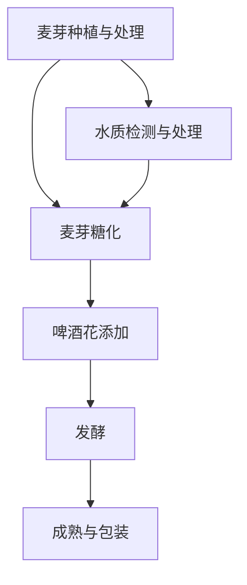

                 

### 引言

#### 1.1 手工啤酒文化的崛起

手工啤酒文化近年来在全球范围内迅速崛起，成为了一种独特的消费趋势。这一现象的背后，既有人们对高品质生活的追求，也有对传统工艺的尊重和怀旧。手工啤酒的兴起，不仅仅是一种品味的提升，更是对现代工业化生产的一种反思和回应。

在过去的几十年里，工业啤酒凭借其大规模生产、低廉成本和稳定质量，成为了全球啤酒市场的主体。然而，随着消费者对个性化、健康和独特的追求日益增长，手工啤酒以其天然、纯净、多样化的特点，逐渐获得了市场的青睐。手工啤酒的酿造过程注重每个细节，从麦芽的种植、处理，到啤酒花的添加、发酵，都由经验丰富的酿酒师亲自把控，确保每一瓶啤酒都能呈现出最佳的风味。

#### 1.2 小型酿造厂的社区作用

小型酿造厂在社区中扮演了多重角色，成为了社区文化的重要组成部分。首先，它们通过举办各种活动，如啤酒节、酿造体验等，为社区居民提供了一个交流和互动的平台，增强了社区的凝聚力。其次，小型酿造厂还积极参与社区事务，通过赞助活动、捐赠物资等方式，为社区的发展做出了贡献。此外，小型酿造厂的建立还创造了就业机会，提高了社区的经济水平。

#### 1.3 书籍结构概述

本书旨在深入探讨现代手工啤酒文化及其小型酿造厂的社区价值。全书分为五个主要部分：

- **第一部分：手工啤酒文化概述**，介绍了手工啤酒的定义、历史发展和主要类型。
- **第二部分：小型酿造厂的运营**，探讨了小型酿造厂的基础设施、经营管理和社区价值。
- **第三部分：手工啤酒文化与社区互动**，分析了手工啤酒与美食搭配、文化活动以及社区酿造体验的重要性。
- **第四部分：案例分析**，通过实际案例展示了小型酿造厂的运营策略和面临的挑战。
- **第五部分：未来趋势与展望**，探讨了手工啤酒市场的未来发展趋势以及小型酿造厂的发展方向。

通过这一结构，本书旨在为读者提供一个全面、深入的理解，帮助读者更好地认识现代手工啤酒文化和小型酿造厂的价值。

### 第一部分：手工啤酒文化概述

#### 2.1 什么是手工啤酒

**定义**：手工啤酒（Craft Beer）是一种以传统手工艺和个性化制作为核心的啤酒。它与传统工业啤酒相比，具有以下几个显著特征：

- **原料天然**：手工啤酒注重使用高质量的天然原料，包括麦芽、啤酒花、酵母和水。这些原料通常来自本地，以确保其新鲜度和品质。
- **酿造工艺**：手工啤酒的酿造过程以手工操作为主，尽可能减少机械介入。酿酒师通过丰富的经验和精湛的技艺，确保每一批啤酒的独特风味和品质。
- **小批量生产**：手工啤酒通常采用小批量生产的方式，每批次的产量有限，这使得每一瓶啤酒都具有独特的个性。

**联系**：手工啤酒的这些特征使其在口感、风味和品质上与工业啤酒有着显著的区别。手工啤酒的天然、纯净和个性化的特点，使其在追求独特体验和个性化需求的消费者中广受欢迎。

#### 2.2 手工啤酒的历史发展

**起源**：手工啤酒的历史可以追溯到古代，早在公元前5000年左右，古美索不达米亚人就开始酿造啤酒。然而，现代意义上的手工啤酒文化则起源于19世纪末期的德国。当时的德国政府为了确保啤酒的质量和一致性，颁布了《纯净啤酒法》，规定啤酒只能由水、大麦麦芽和啤酒花制成。这一法规促进了德国手工啤酒的标准化和专业化，为后来的手工啤酒文化奠定了基础。

**重要里程碑事件**：

- **1977年：美国啤酒复兴运动**：1977年，美国加利福尼亚州的酿酒师杰克·麦库勒斯（Jack McAuliffe）在旧金山创办了美国第一家手工啤酒厂——新苏格兰啤酒厂（New Scotland Brewery）。这一事件标志着美国手工啤酒的复兴，为全球手工啤酒文化的崛起打下了基础。

- **1980年代：英国手工啤酒复兴**：1980年代，英国也掀起了一股手工啤酒复兴的浪潮。特别是1981年，约翰·琼斯（John Johnson）在伦敦创办了泰晤士啤酒厂（Chiswick Brewery），推动了英国手工啤酒的发展。

- **1990年代至今：全球手工啤酒文化兴起**：1990年代以来，手工啤酒在全球范围内迅速崛起。随着人们对高品质生活的追求和对传统工艺的尊重，手工啤酒逐渐成为了一种流行的消费趋势。许多国家和地区纷纷涌现出大量手工啤酒厂，推动了全球手工啤酒文化的发展。

#### 2.3 手工啤酒的类型与风格

**风格分类**：手工啤酒种类繁多，风格各异，主要可以分为以下几类：

- **淡色拉格（Pale Lager）**：淡色拉格是手工啤酒中最常见的风格之一，其特点是色泽淡黄，口感清爽，酒精含量较低。

- **深色拉格（Dark Lager）**：深色拉格的色泽较深，通常呈棕色或黑色，口感丰富，酒精含量适中。

- **艾尔（Ale）**：艾尔是手工啤酒中的经典风格，包括红艾尔（Red Ale）、白艾尔（White Ale）和黑艾尔（Black Ale）等。艾尔的色泽和口感多样，酒精含量较高。

- **比利时风格啤酒**：比利时风格啤酒以其复杂的口感和丰富的风味而著称，包括拉比克（Lambic）、杜贝林（Dubbel）和特雷赛（Tripel）等。

**代表性手工啤酒**：

- **美国手工啤酒**：《波特兰手工啤酒》（Portland Craft Beer）是一本介绍美国手工啤酒的经典著作，详细介绍了美国各地知名的手工啤酒厂和其代表性啤酒。

- **英国手工啤酒**：《英国啤酒指南》（The Great British Beer Guide）是一本广受欢迎的手工啤酒指南，涵盖了英国各地手工啤酒厂的信息和评价。

#### Mermaid 流程图

以下是一个简化了的手工啤酒生产流程的 Mermaid 流程图：

此流程图展示了手工啤酒生产的几个关键步骤及其相互之间的联系。

### 第二部分：小型酿造厂的运营

#### 3.1 酿造厂的基础设施

**3.1.1 酿造设备与工具**

小型酿造厂的基础设施是酿造成功的关键之一。酿造设备通常包括麦芽处理设备、糖化设备、发酵设备、啤酒花添加设备和包装设备等。

- **麦芽处理设备**：包括麦芽粉碎机、麦芽浸麦机等，用于处理麦芽，使其适于糖化过程。
- **糖化设备**：包括糖化锅、滤网等，用于将麦芽中的淀粉转化为糖分。
- **发酵设备**：包括发酵罐、冷却器等，用于啤酒的发酵过程。
- **啤酒花添加设备**：包括啤酒花添加器、过滤器等，用于在酿造过程中添加啤酒花，以增加啤酒的风味和香气。
- **包装设备**：包括瓶子清洗机、灌装机、封口机等，用于将酿造好的啤酒进行清洗、灌装和封口。

**3.1.2 酿造过程详解**

酿造过程可以大致分为以下几个阶段：

1. **麦芽处理**：麦芽首先经过浸麦和干燥处理，然后进行粉碎，以便于糖化。
2. **糖化**：麦芽粉与水混合后，在糖化锅中加热，使淀粉转化为可发酵的糖分。
3. **过滤**：糖化后的液体经过过滤，去除未溶解的残渣。
4. **煮沸**：过滤后的液体煮沸，期间加入啤酒花以增加风味和苦味。
5. **冷却**：煮沸后的液体需要迅速冷却到适宜的温度，以便进行发酵。
6. **发酵**：冷却后的液体被倒入发酵罐中，加入酵母进行发酵，产生酒精和二氧化碳。
7. **成熟**：发酵后的啤酒需要在发酵罐中成熟一段时间，以提升风味和稳定性。
8. **包装**：成熟后的啤酒经过过滤、清洗和灌装，最后进行封口和标签。

#### 3.2 酿造厂的经营管理

**3.2.1 营销策略**

小型酿造厂的营销策略是其成功的关键之一。以下是一些常见的营销策略：

- **品牌建设**：建立独特的品牌形象，通过标志、包装、宣传材料等，传达品牌的核心价值和风格特点。
- **社交媒体推广**：利用社交媒体平台，如Facebook、Instagram等，发布酿造过程、新品发布、活动等信息，与消费者互动。
- **合作伙伴关系**：与当地餐厅、酒吧、超市等建立合作关系，增加产品的曝光度和销售渠道。
- **参与社区活动**：参与当地社区活动，如节日庆典、文化展览等，提升品牌知名度和社区认同感。

**3.2.2 成本控制与盈利模式**

成本控制是小型酿造厂运营中至关重要的环节。以下是一些常见的成本控制方法：

- **原料采购**：选择高质量的原料供应商，确保原料的质量和价格都符合要求。
- **生产效率**：优化生产流程，提高生产效率，减少浪费。
- **能源管理**：合理使用能源，如冷却、加热等，降低能源成本。
- **自动化**：适当引入自动化设备，减少人工成本。

小型酿造厂的盈利模式通常包括以下几种：

- **产品销售**：直接向消费者销售手工啤酒，通过零售店、酒吧、餐厅等渠道。
- **定制服务**：为特定客户提供定制酿造服务，如为婚礼、派对等定制啤酒。
- **租赁场地**：提供酿造场地和设备租赁服务，供其他小型酿造厂使用。
- **合作项目**：与其他企业合作，共同开发新产品或开展项目，共享收益。

#### 3.3 社区价值与酿造厂

**3.3.1 社区参与**

小型酿造厂在社区中的参与度对其社区价值有着重要影响。以下是一些社区参与的途径：

- **举办活动**：举办啤酒节、酿造体验活动、品酒会等，吸引社区居民参与，增强社区凝聚力。
- **赞助活动**：赞助社区组织的活动，如体育赛事、文化节等，提升品牌形象。
- **教育项目**：开展酿造工艺教育项目，为社区居民提供学习机会，促进文化交流。

**3.3.2 社区活动策划**

社区活动的策划需要充分考虑社区的需求和特点。以下是一些活动策划的步骤：

1. **确定目标**：明确活动目标，如提升品牌知名度、增强社区凝聚力等。
2. **活动内容**：根据目标设计活动内容，如酿造体验、品酒会、文化展览等。
3. **时间安排**：选择适当的时间，确保社区居民有足够的时间和兴趣参与。
4. **宣传推广**：利用社交媒体、宣传材料等，提前宣传和推广活动，吸引更多人参与。
5. **现场组织**：确保活动现场的布置、服务和安全，为参与者提供愉快的体验。

**3.3.3 社区支持的重要性**

社区支持是小型酿造厂成功的重要因素之一。以下是一些社区支持的重要性：

- **消费者支持**：消费者的购买和口碑传播，为小型酿造厂提供了稳定的收入和品牌推广。
- **社区资源**：社区提供的人才、资源和合作机会，有助于小型酿造厂的发展。
- **政策支持**：政府的政策支持，如税收优惠、补贴等，为小型酿造厂的运营提供了保障。

### 第三部分：手工啤酒文化与社区互动

#### 4.1 手工啤酒与美食搭配

**4.1.1 食物的选择**

手工啤酒与美食的搭配是一门艺术，选择合适的食物可以显著提升饮酒体验。以下是一些常见的搭配建议：

- **淡色拉格**：搭配清淡的菜肴，如沙拉、海鲜、白肉类食品等。
- **深色拉格**：搭配口感丰富的菜肴，如烤肉、炖菜、巧克力等。
- **艾尔**：搭配口感较为中性或酸甜的菜肴，如烤鸡肉、烤蔬菜、烤鱼等。
- **比利时风格啤酒**：搭配甜点或奶酪，如巧克力、水果、蓝纹奶酪等。

**4.1.2 搭配原则与技巧**

- **对比原则**：通过对比味道，如酸甜、苦甜等，增强味觉体验。
- **协调原则**：选择与啤酒风味相似或互补的食物，以提升整体的口感。
- **层次感**：通过搭配不同口感的食物，创造出丰富的味觉层次。

#### 4.2 手工啤酒节与文化活动

**4.2.1 手工啤酒节的意义**

手工啤酒节是展示和推广手工啤酒文化的重要平台，其意义体现在以下几个方面：

- **文化传播**：通过啤酒节，向公众展示手工啤酒的制作过程和文化背景，提升公众对手工啤酒的认识和兴趣。
- **品牌推广**：为小型酿造厂提供了一个展示自身品牌和产品的机会，有助于提升品牌知名度和市场份额。
- **经济贡献**：啤酒节吸引了大量游客，为当地经济带来了显著的收入，促进了旅游业的发展。

**4.2.2 活动组织与执行**

组织一个成功的啤酒节需要充分的策划和执行。以下是一些关键步骤：

1. **确定主题**：根据当地特色和文化，确定啤酒节的主题，如“传统与创新”、“啤酒与美食”等。
2. **场地选择**：选择适合举办啤酒节的场地，如公园、广场、体育馆等。
3. **活动安排**：规划活动内容，包括酿造工艺展示、啤酒品鉴、美食摊位、音乐表演等。
4. **宣传推广**：利用社交媒体、宣传材料等，提前宣传啤酒节，吸引参与者。
5. **现场管理**：确保现场的安全、秩序和清洁，为参与者提供愉快的体验。
6. **后续评估**：活动结束后，进行总结和评估，以便改进未来的活动。

#### 4.3 社区酿造体验与教育

**4.3.1 酿造体验活动**

酿造体验活动是让社区居民深入了解手工啤酒文化的重要途径。以下是一些常见的活动形式：

- **酿造工作坊**：邀请酿酒师或专业人士，为社区居民提供酿造基本知识的培训，并亲手参与酿造过程。
- **家庭酿造**：组织家庭活动，让家庭成员一起参与酿造，增强家庭凝聚力。
- **学校项目**：与学校合作，开设酿造课程，让学生了解酿造过程，培养他们对科学和自然的兴趣。

**4.3.2 教育项目设计**

设计一个有效的教育项目需要充分考虑受众的需求和特点。以下是一些设计要点：

1. **目标受众**：明确项目的目标受众，如学生、成年人、酿造爱好者等。
2. **课程内容**：根据目标受众的需求，设计涵盖酿造历史、原料选择、酿造过程、品酒技巧等方面的课程。
3. **互动环节**：增加互动环节，如问答、实操、品酒等，提高参与者的兴趣和参与度。
4. **实践操作**：提供实际操作机会，让参与者亲自体验酿造过程，加深对知识的理解和记忆。
5. **后续支持**：提供后续的跟进和支持，如酿造指导、品酒会等，鼓励参与者持续学习和探索。

### 第四部分：案例分析

#### 5.1 案例研究：成功的社区酿造厂

**5.1.1 成功案例介绍**

以下是几个成功的社区酿造厂的案例介绍：

- **德国慕尼黑：Augustiner啤酒厂**：Augustiner是慕尼黑历史最悠久的啤酒厂之一，成立于1872年。它不仅在酿造过程中严格遵循传统工艺，还积极参与社区活动，如每年举办的慕尼黑啤酒节。通过社区参与和品牌推广，Augustiner成功地提升了品牌知名度，并吸引了大量游客。

- **美国波特兰：Fat Head's Brewery**：Fat Head's Brewery是一家位于美国波特兰的手工啤酒厂，成立于1996年。它以其创新的酿造技术和多样化的啤酒风格而闻名。Fat Head's积极举办酿造体验活动和啤酒节，为社区居民提供了一个互动和学习的平台，增强了社区的凝聚力。

- **英国伦敦：Meantime Brewing Company**：Meantime Brewing Company是伦敦的一家手工啤酒厂，成立于2000年。它不仅生产高品质的手工啤酒，还致力于推动英国手工啤酒文化的发展。Meantime通过赞助文化活动、开设酿造体验课程等，为社区成员提供了丰富的参与机会，提升了社区的文化氛围。

**5.1.2 经营策略分析**

成功的社区酿造厂通常采用以下经营策略：

- **品牌建设**：通过独特的品牌形象和故事，建立品牌认知和忠诚度。
- **市场营销**：利用社交媒体、活动推广等手段，提升品牌知名度和市场影响力。
- **社区参与**：积极参与社区活动，举办酿造体验、啤酒节等，增强社区凝聚力。
- **产品创新**：不断推出新产品和独特口味，满足消费者的个性化需求。
- **成本控制**：通过优化生产流程、降低原料成本等，提高盈利能力。

**5.1.3 社区互动与价值体现**

成功的社区酿造厂通过以下方式体现其社区价值：

- **文化传承**：通过酿造活动和教育项目，传承和推广手工酿造技艺。
- **经济贡献**：通过创造就业机会、税收贡献等，为社区经济发展做出贡献。
- **社会互动**：通过举办社区活动，为居民提供互动和交流的平台，增强社区凝聚力。

#### 5.2 案例研究：面临的挑战与解决方案

**5.2.1 挑战分析**

尽管社区酿造厂在推动社区发展和提升品牌知名度方面取得了显著成果，但它们也面临着一系列挑战：

- **市场竞争**：随着手工啤酒市场的竞争加剧，社区酿造厂需要不断创新和提升产品质量，以保持竞争力。
- **成本压力**：原材料价格波动、能源成本增加等，给小型酿造厂的运营带来了成本压力。
- **法规限制**：不同地区的法规和标准对酿造厂的运营产生了影响，如生产许可证、卫生标准等。
- **人员培训**：培养和留住有经验的酿酒师和专业人才，对小型酿造厂来说是一项长期挑战。

**5.2.2 解决方案探讨**

为应对上述挑战，社区酿造厂可以采取以下解决方案：

- **创新研发**：通过不断研发新产品和工艺，提升产品的差异化和竞争力。
- **供应链优化**：与可靠的供应商建立长期合作关系，确保原材料的质量和供应稳定性。
- **法规合规**：积极了解和遵守相关法规，确保运营的合规性。
- **人才培养**：建立内部培训机制，提高员工的技能和职业素养，同时通过吸引外部人才，增强企业竞争力。

### 第五部分：未来趋势与展望

#### 6.1 手工啤酒市场的未来趋势

随着消费者对高品质、个性化产品和健康生活方式的追求，手工啤酒市场将继续保持增长势头。以下是一些未来趋势：

- **消费者需求变化**：消费者对手工啤酒的需求将更加多样化，追求独特口味和定制化体验。
- **技术创新**：随着技术的不断进步，如自动化酿造设备、大数据分析等，将提高酿造效率和产品质量。
- **环保意识**：环保理念将在手工啤酒生产中得到更多重视，如使用可再生资源和绿色包装。

#### 6.2 社区酿造厂的发展方向

社区酿造厂的未来发展方向包括：

- **品牌多元化**：通过拓展产品线，满足不同消费者的需求，提升品牌竞争力。
- **社区融合**：通过更多社区活动和参与，增强与社区居民的互动，提升品牌忠诚度。
- **可持续发展**：通过环保措施和社会责任项目，推动企业的可持续发展。

### 结论

#### 7.1 手工啤酒文化的未来

手工啤酒文化将继续在全球范围内蓬勃发展，其个性化、健康和环保的特点，将吸引越来越多的消费者。同时，手工啤酒厂通过积极参与社区活动，推动社区文化的发展，实现共赢。

#### 7.2 社区酿造厂的使命与价值

社区酿造厂的使命不仅是酿造高品质的手工啤酒，更是推动社区发展和文化传承。通过举办活动、提供就业机会和履行社会责任，社区酿造厂为社区的繁荣和进步做出了积极贡献。

#### 7.3 对酿造厂业主与从业者的建议

对于酿造厂业主和从业者，以下是一些建议：

- **持续创新**：保持对新工艺和新技术的关注，不断提升产品质量和竞争力。
- **社区互动**：积极参与社区活动，增强品牌忠诚度和社区认同感。
- **可持续发展**：关注环保和社会责任，推动企业的可持续发展。

### 作者信息

作者：AI天才研究院/AI Genius Institute & 禅与计算机程序设计艺术 /Zen And The Art of Computer Programming

### 拓展阅读

- 《手工啤酒指南：探索全球最佳酿造厂》（Craft Beer Cookbook: Exploring the World's Best Breweries）
- 《啤酒文化与历史：从古至今的酿造艺术》（Beer Culture and History: Brewing Art from Ancient to Modern Times）
- 《酿造工艺：从原料到成品的全方位解析》（Brewing Technology: A Comprehensive Analysis from Ingredients to Final Product）

### 附录

#### 1. 数据来源

- **国际啤酒制造商联盟**：提供全球手工啤酒市场的数据和趋势。
- **美国酿造商协会**：提供美国手工啤酒行业的最新动态和统计数据。
- **欧洲酿造商协会**：提供欧洲手工啤酒市场的分析和研究报告。

#### 2. 相关链接

- [美国酿造商协会官方网站](https://www.usbrewers.org/)
- [国际啤酒制造商联盟官方网站](https://www.ibu.org/)
- [欧洲酿造商协会官方网站](https://www.eu-beer.eu/)

### 参考文献

- **国际啤酒制造商联盟**. (2022). 全球手工啤酒市场分析报告.
- **美国酿造商协会**. (2021). 美国手工啤酒行业年度报告.
- **欧洲酿造商协会**. (2020). 欧洲手工啤酒市场研究报告.
- **约翰逊，J.**. (2019). 《手工啤酒文化与历史：从古至今的酿造艺术》.

