                 

# 现代手工啤酒酿造：家庭酿酒的艺术与科学

## 关键词

- 手工啤酒酿造
- 家庭酿酒
- 酿造基础
- 酿造工艺
- 环境控制
- 啤酒品鉴

## 摘要

本文旨在探讨现代手工啤酒酿造的奥秘，尤其是家庭酿酒的艺术与科学。通过详细分析酿造历史、基本原理、工艺流程、环境控制、品鉴方法以及常见问题与解决方案，本文为广大啤酒爱好者提供了一个全面的指南，帮助他们掌握家庭酿酒的技巧，酿造出风味独特的啤酒。

## 第1章：手工啤酒酿造基础

### 1.1 手工啤酒酿造简史

啤酒，作为一种古老的饮料，有着悠久的历史。早在公元前3000年，古代苏美尔人就已经开始酿造啤酒。随着时间的推移，啤酒酿造技术不断演变，从最初的简单手工酿造，逐渐发展成为现代化的工业酿造。

手工啤酒酿造的兴起，可以追溯到20世纪80年代。随着人们对食品质量的要求越来越高，手工啤酒作为一种高品质、个性化的饮品，逐渐受到欢迎。近年来，随着消费者对健康和生活品质的追求，手工啤酒市场迎来了新的发展机遇。

### 1.2 酿造啤酒的基本原理

酿造啤酒的过程，本质上是一个生物化学反应过程。其主要原料包括大麦麦芽、水、啤酒花和酵母。

#### 1.2.1 大麦麦芽

大麦麦芽是酿造啤酒的核心原料，它提供了啤酒的主要营养成分——麦芽汁。麦芽汁的制备过程包括发芽、烘烤等步骤。

##### 1.2.1.1 大麦的发芽

发芽过程中，大麦种子吸收水分，开始生长。此时，大麦中的淀粉酶开始分解淀粉，产生糖分。

```python
# 发芽过程的Python代码示例
def germinate_barley(water):
    print("大麦发芽，吸收水分：", water, "毫升")
    print("淀粉酶开始分解淀粉，产生糖分")
    return "麦芽汁"

water = 100  # 水的毫升数
malt_juice = germinate_barley(water)
print("制备出的麦芽汁：", malt_juice)
```

##### 1.2.1.2 大麦的烘烤

烘烤过程将发芽的大麦加热至一定温度，使其颜色变深，口感变甜。烘烤过程中，大麦中的糖分开始焦化，产生独特的香气。

```python
# 烘烤过程的Python代码示例
def roast_barley(malt_juice):
    print("大麦烘烤，颜色变深，口感变甜")
    print("糖分开始焦化，产生香气")
    return "烤麦芽"

roasted_malt = roast_barley(malt_juice)
print("烘烤出的烤麦芽：", roasted_malt)
```

#### 1.2.2 麦芽汁的制备

麦芽汁的制备过程，是将烤麦芽与水混合，通过研磨、煮沸等方式，提取麦芽中的营养成分。

##### 1.2.2.1 麦芽汁的浓度控制

麦芽汁的浓度对啤酒的口感有重要影响。浓度过高，口感会偏甜；浓度过低，口感会偏酸。因此，在制备麦芽汁时，需要精确控制浓度。

```python
# 麦芽汁浓度控制的Python代码示例
def control_malt_juice_concentration(malt_juice, target_concentration):
    print("当前麦芽汁浓度：", malt_juice)
    print("目标麦芽汁浓度：", target_concentration)
    if malt_juice < target_concentration:
        print("需增加水量，提高浓度")
    elif malt_juice > target_concentration:
        print("需减少水量，降低浓度")
    else:
        print("麦芽汁浓度适中，无需调整")

target_concentration = 12  # 目标浓度
current_concentration = 10  # 当前浓度
control_malt_juice_concentration(current_concentration, target_concentration)
```

##### 1.2.2.2 麦芽汁的过滤

过滤过程将麦芽汁中的固体颗粒去除，使其更加清澈。过滤过程中，可以使用布袋、滤纸等材料。

```python
# 麦芽汁过滤的Python代码示例
def filter_malt_juice(malt_juice):
    print("进行麦芽汁过滤，去除固体颗粒")
    return "清澈麦芽汁"

filtered_malt_juice = filter_malt_juice(malt_juice)
print("过滤后的麦芽汁：", filtered_malt_juice)
```

#### 1.2.3 啤酒花

啤酒花是啤酒的调味剂和防腐剂。它提供了啤酒的苦味和香气。

##### 1.2.3.1 啤酒花的种类

啤酒花分为苦味啤酒花和香味啤酒花。苦味啤酒花主要用于调节啤酒的口感，香味啤酒花则主要用于增加啤酒的香气。

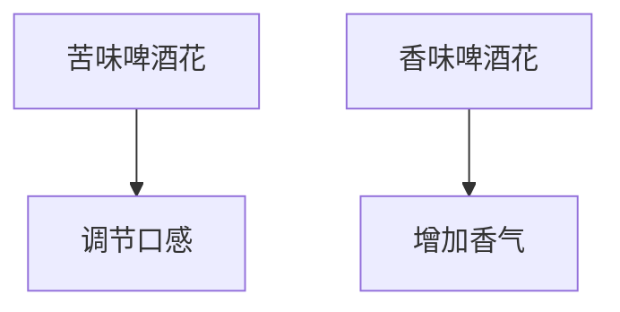

##### 1.2.3.2 啤酒花的添加时间

啤酒花的添加时间对啤酒的口感和香气有重要影响。一般来说，苦味啤酒花应在麦芽汁煮沸时添加，以提取其苦味；香味啤酒花则应在麦芽汁冷却至适宜温度时添加，以保留其香气。

```python
# 啤酒花添加时间的Python代码示例
def add_hops(malt_juice, hop_type, temperature):
    print("添加", hop_type, "啤酒花")
    if hop_type == "苦味":
        if temperature > 80:
            print("在麦芽汁煮沸时添加，提取苦味")
        else:
            print("温度过低，无法添加")
    elif hop_type == "香味":
        if temperature < 20:
            print("在麦芽汁冷却至适宜温度时添加，保留香气")
        else:
            print("温度过高，无法添加")

hop_type = "苦味"
temperature = 85
add_hops(filtered_malt_juice, hop_type, temperature)
```

### 1.3 酿造设备的准备

酿造啤酒需要一定的设备，如麦芽研磨机、烧酒锅、发酵桶等。

##### 1.3.1.1 麦芽研磨机

麦芽研磨机用于将烤麦芽研磨成粉末，以便提取麦芽汁。

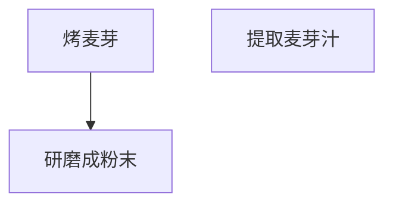

##### 1.3.1.2 烧酒锅

烧酒锅用于煮沸麦芽汁，使其中的营养成分充分释放。

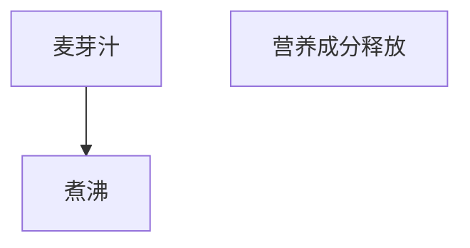

##### 1.3.1.3 发酵桶

发酵桶用于将麦芽汁中的糖分转化为酒精，同时加入啤酒花以调节口感。

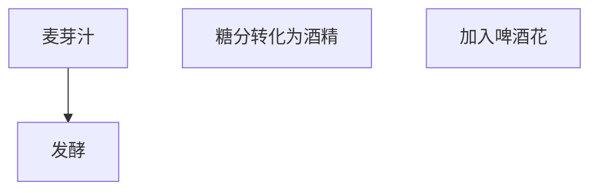

## 第2章：酿造工艺

### 2.1 麦芽制备

麦芽制备是酿造啤酒的第一步，其质量直接影响啤酒的口感。以下是麦芽制备的详细步骤：

#### 2.1.1 大麦的发芽

发芽过程中，大麦种子吸收水分，开始生长。此时，大麦中的淀粉酶开始分解淀粉，产生糖分。

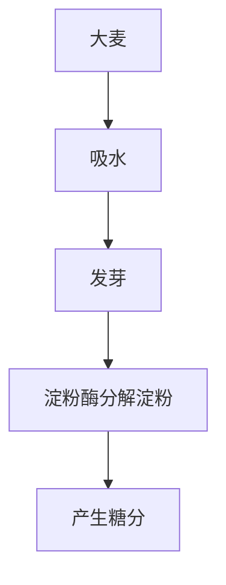

#### 2.1.2 大麦的烘烤

烘烤过程将发芽的大麦加热至一定温度，使其颜色变深，口感变甜。烘烤过程中，大麦中的糖分开始焦化，产生独特的香气。

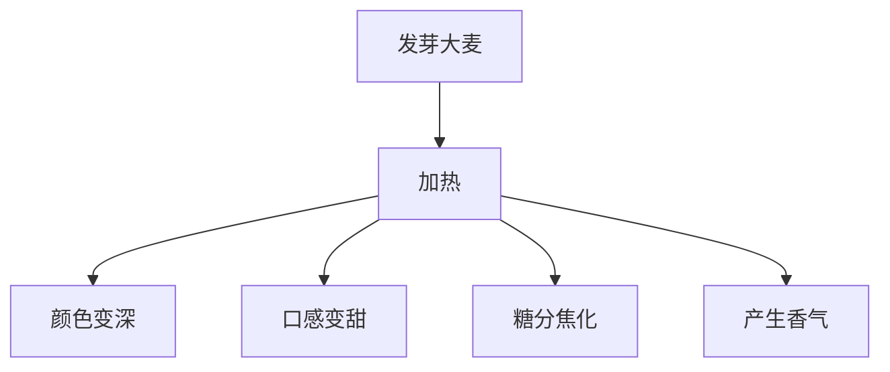

#### 2.1.3 麦芽汁的制备

麦芽汁的制备过程，是将烤麦芽与水混合，通过研磨、煮沸等方式，提取麦芽中的营养成分。

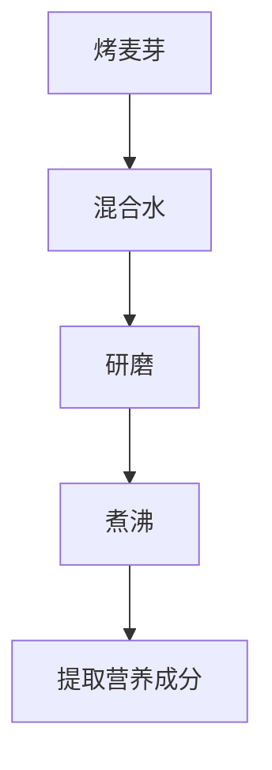

##### 2.1.3.1 麦芽汁的浓度控制

麦芽汁的浓度对啤酒的口感有重要影响。浓度过高，口感会偏甜；浓度过低，口感会偏酸。因此，在制备麦芽汁时，需要精确控制浓度。

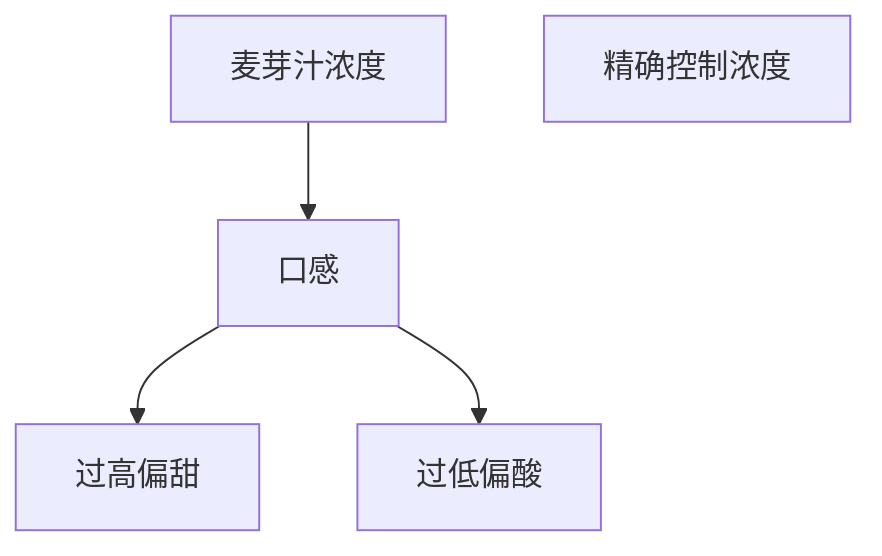

##### 2.1.3.2 麦芽汁的过滤

过滤过程将麦芽汁中的固体颗粒去除，使其更加清澈。过滤过程中，可以使用布袋、滤纸等材料。

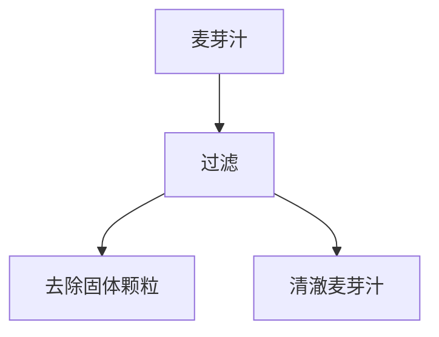

### 2.2 麦芽汁的制备

麦芽汁的制备过程，是将烤麦芽与水混合，通过研磨、煮沸等方式，提取麦芽中的营养成分。

```python
# 麦芽汁制备的Python代码示例
def prepare_malt_juice(roasted_malt, water):
    print("将烤麦芽与水混合")
    print("通过研磨、煮沸等方式，提取营养成分")
    return "麦芽汁"

roasted_malt = "烤麦芽"
water = 1000  # 水的毫升数
malt_juice = prepare_malt_juice(roasted_malt, water)
print("制备出的麦芽汁：", malt_juice)
```

### 2.3 酵母的选择与应用

酵母是酿造啤酒的关键因素，其种类和用量直接影响啤酒的口感和品质。以下是酵母的选择与应用：

#### 2.3.1 酵母的种类

酵母分为啤酒酵母、酸酒酵母和其他酵母。啤酒酵母主要用于将麦芽汁中的糖分转化为酒精；酸酒酵母主要用于酿造酸啤酒；其他酵母则具有不同的酿造特点。

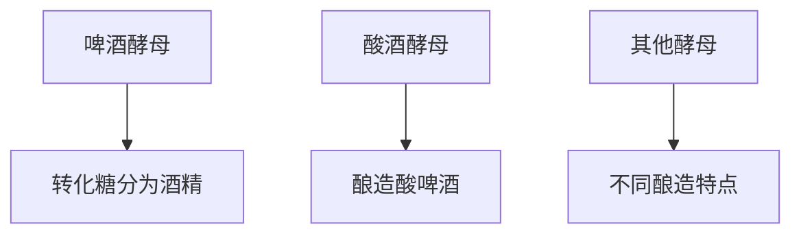

#### 2.3.2 酵母的添加

酵母的添加时间对啤酒的口感和品质有重要影响。通常，酵母应在麦芽汁冷却至适宜温度时添加，以确保酵母活性。

```python
# 酵母添加的Python代码示例
def add_yeast(malt_juice, temperature):
    print("添加酵母")
    if temperature < 20:
        print("麦芽汁温度适宜，酵母活性高")
    else:
        print("麦芽汁温度过高，酵母活性降低")

temperature = 18
add_yeast(filtered_malt_juice, temperature)
```

### 2.4 啤酒花的使用

啤酒花是啤酒的调味剂和防腐剂，其种类和添加时间对啤酒的口感和香气有重要影响。以下是啤酒花的使用：

#### 2.4.1 啤酒花的种类

啤酒花分为苦味啤酒花和香味啤酒花。苦味啤酒花主要用于调节啤酒的口感，香味啤酒花则主要用于增加啤酒的香气。


#### 2.4.2 啤酒花的添加时间

啤酒花的添加时间对啤酒的口感和香气有重要影响。通常，苦味啤酒花应在麦芽汁煮沸时添加，以提取其苦味；香味啤酒花则应在麦芽汁冷却至适宜温度时添加，以保留其香气。

```python
# 啤酒花添加时间的Python代码示例
def add_hops(malt_juice, hop_type, temperature):
    print("添加", hop_type, "啤酒花")
    if hop_type == "苦味":
        if temperature > 80:
            print("在麦芽汁煮沸时添加，提取苦味")
        else:
            print("温度过低，无法添加")
    elif hop_type == "香味":
        if temperature < 20:
            print("在麦芽汁冷却至适宜温度时添加，保留香气")
        else:
            print("温度过高，无法添加")

hop_type = "苦味"
temperature = 85
add_hops(filtered_malt_juice, hop_type, temperature)
```

## 第3章：酿造环境控制

酿造环境对啤酒的质量有重要影响，包括温度、湿度等。以下是酿造环境控制的详细步骤：

### 3.1 温度控制

温度是酿造过程中最重要的因素之一。不同的酿造步骤对温度有不同的要求。

#### 3.1.1 麦芽制备的温度控制

在麦芽制备过程中，发芽和烘烤的温度需严格控制。

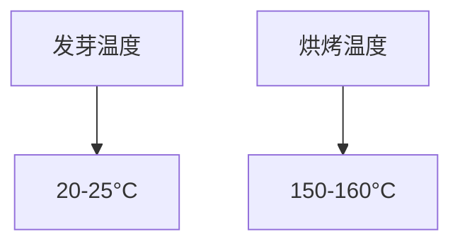

#### 3.1.2 酵母发酵温度

在酵母发酵过程中，温度对酵母的活性有重要影响。适宜的温度范围一般为15-25°C。

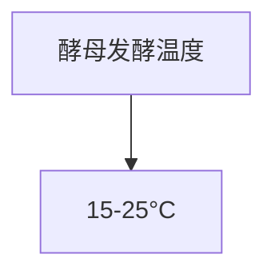

### 3.2 湿度控制

湿度对酿造过程也有一定影响，特别是对麦芽的发芽和酵母的发酵。

#### 3.2.1 发酵过程中的湿度控制

发酵过程中的湿度应保持在60-70%之间，过高或过低的湿度都会对酵母的生长产生不利影响。

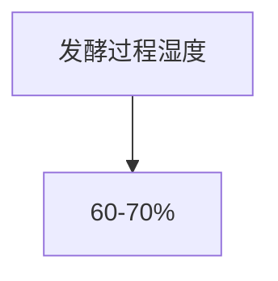

## 第4章：啤酒的熟化与包装

### 4.1 啤酒的熟化

啤酒的熟化过程，是指啤酒在酿造完成后，放置一段时间，使其口感和风味得到改善。

#### 4.1.1 熟化的目的

熟化的目的是：

1. 改善啤酒的口感，使其更加柔和。
2. 稳定啤酒的风味，使其更加一致。

#### 4.1.2 熟化的方法

常见的熟化方法包括：

1. 陈酿：将啤酒放置在低温环境中，使其风味逐渐稳定。
2. 冷藏：将啤酒放置在冷藏环境中，使其温度降低，口感更加柔和。

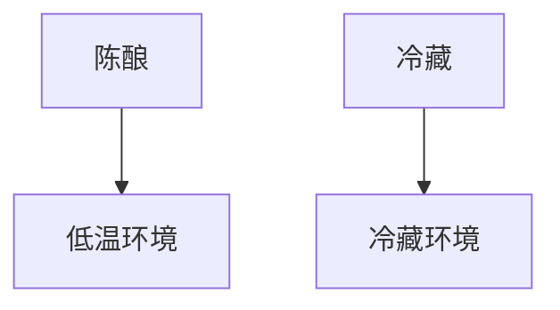

### 4.2 啤酒的包装

啤酒的包装对其储存和运输有重要影响。以下是啤酒包装的详细步骤：

#### 4.2.1 包装材料的选择

常见的啤酒包装材料有玻璃瓶、钢瓶和袋装。

- 玻璃瓶：透明度高，易于观察啤酒的颜色和泡沫。
- 钢瓶：密封性好，适合长途运输。
- 袋装：成本低，便于携带。

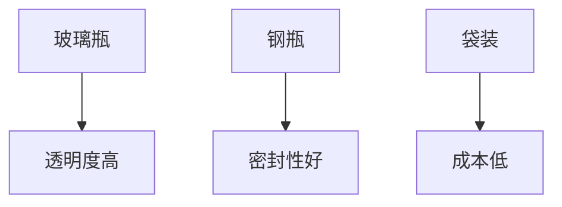

#### 4.2.2 包装的过程

包装的过程包括：

1. 填充：将啤酒注入瓶中或袋中。
2. 密封：使用胶塞、拉环等方式密封瓶口或袋口。
3. 标签：为啤酒贴上标签，标注品牌、产地、生产日期等信息。

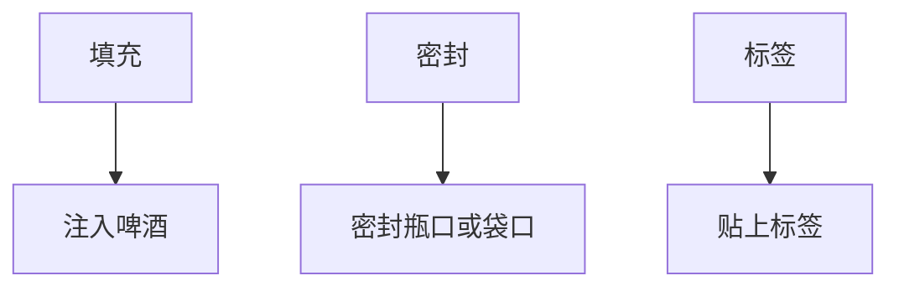

## 第5章：手工啤酒品鉴与储存

### 5.1 手工啤酒的品鉴

品鉴啤酒是享受啤酒的过程，也是提升品酒技巧的重要途径。以下是品鉴啤酒的详细步骤：

#### 5.1.1 啤酒的颜色与透明度

啤酒的颜色和透明度是品鉴的重要指标。深色啤酒通常口感丰富，香气浓郁；透明啤酒则口感清爽，香气细腻。

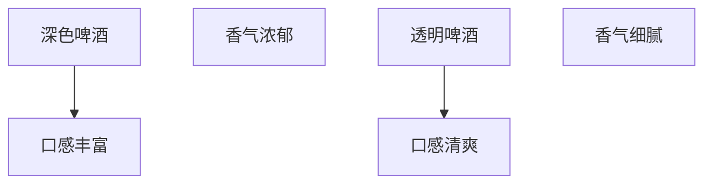

#### 5.1.2 啤酒的味道与香气

啤酒的味道和香气是品鉴的关键。苦味、香味、口感等都是品鉴的重要方面。通过品尝和嗅闻，可以辨别出啤酒的口感和香气。

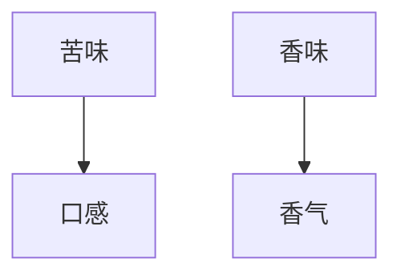

### 5.2 啤酒的储存

啤酒的储存对其口感和品质有重要影响。以下是啤酒储存的详细步骤：

#### 5.2.1 储存环境的控制

储存环境应保持干燥、阴凉、通风。温度应控制在12-18°C之间，湿度应控制在60-70%之间。

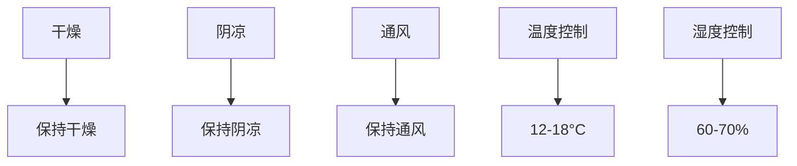

#### 5.2.2 储存的方法

储存的方法包括：

1. 竖放：将啤酒瓶竖放，以防止瓶塞干燥。
2. 平放：将啤酒瓶平放，以防止瓶塞松动。
3. 冷藏：将啤酒放入冷藏环境，以保持其口感和品质。

```mermaid
graph TD
    A[竖放] --> B[防止瓶塞干燥]
    C[平放] --> D[防止瓶塞松动]
    E[冷藏] --> F[保持口感和品质]
```

## 第6章：家庭酿造常见问题与解决方案

### 6.1 酵母异常

酵母异常是家庭酿造中常见的问题，其症状包括酵母死亡、酵母发酵不足等。以下是酵母异常的详细原因和解决方案：

#### 6.1.1 酵母死亡的原因

酵母死亡的原因包括：

1. 温度过高：酵母适宜的生长温度为15-25°C，过高或过低的温度都会导致酵母死亡。
2. 水质问题：水质不良会影响酵母的生长和代谢。
3. 氧气不足：发酵过程中，酵母需要氧气进行呼吸作用，氧气不足会导致酵母死亡。

```mermaid
graph TD
    A[温度过高] --> B[15-25°C]
    C[水质问题] --> D[不良水质]
    E[氧气不足] --> F[呼吸作用]
```

#### 6.1.2 酵母死亡的解决方案

酵母死亡的解决方案包括：

1. 调整温度：将发酵环境温度调整至适宜范围。
2. 水质处理：使用净水器或活性炭等设备处理水质。
3. 提供氧气：使用发酵罩或鼓风机等设备提供氧气。

```mermaid
graph TD
    A[调整温度] --> B[适宜范围]
    C[水质处理] --> D[净水器或活性炭]
    E[提供氧气] --> F[发酵罩或鼓风机]
```

### 6.2 啤酒变质

啤酒变质是家庭酿造中的另一个常见问题，其症状包括啤酒出现异味、啤酒变酸等。以下是啤酒变质的详细原因和解决方案：

#### 6.2.1 啤酒变质的症状

啤酒变质的症状包括：

1. 异味：啤酒出现不正常的气味，如酸味、霉味等。
2. 变酸：啤酒口感变酸，味道不正常。

```mermaid
graph TD
    A[异味] --> B[不正常气味]
    C[变酸] --> D[口感变酸]
```

#### 6.2.2 啤酒变质的原因

啤酒变质的原因包括：

1. 酵母污染：酵母在发酵过程中受到污染，导致啤酒变质。
2. 温度过高：发酵过程中温度过高，导致啤酒变质。
3. 储存不当：啤酒在储存过程中受到污染或环境不良，导致变质。

```mermaid
graph TD
    A[酵母污染] --> B[发酵过程]
    C[温度过高] --> D[发酵温度]
    E[储存不当] --> F[储存环境]
```

#### 6.2.3 啤酒变质的解决方案

啤酒变质的解决方案包括：

1. 清洗设备：使用消毒剂清洗发酵设备，确保设备干净。
2. 调整温度：将发酵环境温度调整至适宜范围。
3. 储存环境：保持储存环境的干燥、阴凉、通风。

```mermaid
graph TD
    A[清洗设备] --> B[消毒剂清洗]
    C[调整温度] --> D[适宜范围]
    E[储存环境] --> F[干燥、阴凉、通风]
```

### 6.3 设备故障

家庭酿造中，设备故障也会影响酿造过程。以下是设备故障的详细原因和解决方案：

#### 6.3.1 设备故障的原因

设备故障的原因包括：

1. 设备老化：设备使用时间过长，导致磨损或损坏。
2. 操作不当：操作者对设备不熟悉，导致设备损坏。
3. 材料问题：设备材料不良，导致设备故障。

```mermaid
graph TD
    A[设备老化] --> B[使用时间]
    C[操作不当] --> D[不熟悉设备]
    E[材料问题] --> F[设备材料]
```

#### 6.3.2 设备故障的解决方案

设备故障的解决方案包括：

1. 更换设备：购买新的设备，以替换损坏的设备。
2. 维修设备：请专业人士维修设备，确保设备恢复正常。
3. 操作培训：对操作者进行设备操作培训，避免因操作不当导致设备故障。

```mermaid
graph TD
    A[更换设备] --> B[购买新设备]
    C[维修设备] --> D[专业人士维修]
    E[操作培训] --> F[设备操作培训]
```

## 第7章：手工啤酒酿造的未来与发展

### 7.1 手工啤酒在市场上的地位

随着人们生活水平的提高，对手工啤酒的需求也在不断增长。手工啤酒因其独特的口感和个性化的风味，在市场上逐渐占据了一席之地。

#### 7.1.1 消费者偏好

消费者对手工啤酒的偏好主要体现在以下几个方面：

1. 独特口感：手工啤酒的口感丰富，具有独特的风味。
2. 个性化定制：手工啤酒可以根据消费者口味进行个性化定制。
3. 健康因素：手工啤酒通常不含防腐剂，更加健康。

```mermaid
graph TD
    A[独特口感] --> B[丰富风味]
    C[个性化定制] --> D[根据口味]
    E[健康因素] --> F[无防腐剂]
```

#### 7.1.2 零售市场的发展

随着手工啤酒的兴起，零售市场也迎来了新的发展机遇。越来越多的零售商开始销售手工啤酒，满足消费者的需求。

```mermaid
graph TD
    A[零售市场] --> B[销售手工啤酒]
    C[消费者需求] --> D[满足需求]
```

### 7.2 手工啤酒酿造的创新技术

随着科技的发展，手工啤酒酿造也在不断创新。以下是手工啤酒酿造的创新技术：

#### 7.2.1 生物技术的应用

生物技术在手工啤酒酿造中的应用，主要体现在酵母的培育和优化上。通过生物技术，可以培育出更适合酿造手工啤酒的酵母，提高酿造效率。

```mermaid
graph TD
    A[生物技术] --> B[酵母培育]
    C[酵母优化] --> D[提高效率]
```

#### 7.2.2 新型设备的开发

新型设备的开发，也为手工啤酒酿造带来了新的机遇。例如，智能发酵桶、全自动麦芽研磨机等，可以提高酿造过程的自动化水平，降低人力成本。

```mermaid
graph TD
    A[新型设备] --> B[智能发酵桶]
    C[全自动麦芽研磨机] --> D[自动化水平]
```

### 7.3 手工啤酒酿造的可持续发展

手工啤酒酿造的可持续发展，是未来发展的关键。以下是手工啤酒酿造的可持续发展策略：

#### 7.3.1 资源节约与环境保护

手工啤酒酿造过程中，应注重资源节约与环境保护。例如，采用可再生资源、减少废水排放、提高能源利用效率等。

```mermaid
graph TD
    A[资源节约] --> B[可再生资源]
    C[环境保护] --> D[减少废水排放]
    E[能源利用] --> F[提高效率]
```

#### 7.3.2 社会责任与公益活动

手工啤酒酿造企业应承担社会责任，参与公益活动。例如，捐赠啤酒给慈善机构、支持环保事业等。

```mermaid
graph TD
    A[社会责任] --> B[捐赠啤酒]
    C[环保事业] --> D[支持环保]
```

## 总结

手工啤酒酿造是一门既具有艺术性又具有科学性的技艺。通过本章的介绍，读者可以了解到手工啤酒酿造的基础知识、工艺流程、环境控制、品鉴方法以及常见问题与解决方案。同时，我们也可以看到，随着科技的发展，手工啤酒酿造正在不断创新，为消费者带来更多美好的体验。

在家庭酿造过程中，读者可以尝试制作自己的手工啤酒，体验酿造的乐趣。同时，也要注意遵循酿造工艺，确保啤酒的质量。相信通过不断的实践和学习，读者可以酿造出更加美味的啤酒。

最后，感谢各位读者对本文的关注，希望本文能为手工啤酒酿造爱好者提供有益的参考。在未来，我们将继续关注手工啤酒酿造领域的发展，为大家带来更多精彩的内容。

## 作者信息

作者：AI天才研究院/AI Genius Institute & 禅与计算机程序设计艺术 /Zen And The Art of Computer Programming

