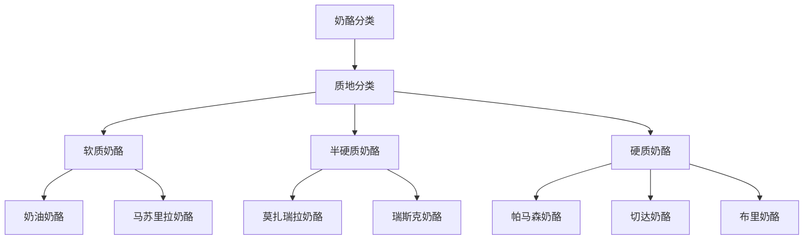

                 

### 第一部分：奶酪基础知识与工具准备

#### 第1章：奶酪概述

奶酪，作为一种古老且传统的食品，拥有悠久的历史和丰富的文化底蕴。它不仅是一种美味佳肴，更是许多国家和地区饮食文化中的重要组成部分。奶酪的起源可以追溯到公元前5000年的美索不达米亚，随后在欧洲各地逐渐普及并发展出各种风格独特的奶酪品种。

奶酪的分类主要基于其质地和成熟度。质地方面，奶酪可以分为软质奶酪、半硬质奶酪和硬质奶酪；而根据成熟度，则可以分为新鲜奶酪、成熟奶酪和陈年奶酪。常见的软质奶酪包括奶油奶酪和马苏里拉奶酪，而硬质奶酪如帕马森和切达则是餐桌上常见的调味佳品。每种奶酪都有其独特的风味和口感，从轻盈细腻到浓郁厚重，满足不同人的味蕾需求。

奶酪不仅在美味上吸引人，更富含多种营养成分。它富含蛋白质、钙、磷、维生素A和维生素B12等，对于维护骨骼健康、增强免疫力等方面具有积极作用。同时，不同种类的奶酪在脂肪含量和营养成分上也有所不同，消费者可以根据自己的健康需求选择适合的奶酪。

#### 核心概念与联系

以下是奶酪分类的Mermaid流程图，展示了不同类型奶酪之间的关系：

通过这个流程图，我们可以清晰地看到奶酪分类的层次结构，以及不同类型奶酪之间的关联。

#### 第2章：奶酪制作基础知识

要了解奶酪的制作，我们需要首先熟悉制作过程中涉及的基础知识。以下是奶酪制作所需的主要原料和处理步骤：

##### 奶酪原料的选择与处理

制作奶酪的第一步是选择合适的原料奶。原料奶的质量直接影响到最终奶酪的品质。一般选用新鲜、优质、无抗生素残留的生奶或巴氏杀菌奶。原料奶中应含有适量的蛋白质和脂肪，以保证奶酪的质地和口感。

处理原料奶的步骤包括：

1. **加热杀菌**：将原料奶加热至72-75摄氏度，维持15-20秒，以杀死可能存在的病原菌。
2. **冷却**：将加热后的奶冷却至约35-40摄氏度，为后续的添加酶和酸剂创造适宜的温度环境。
3. **加酶**：加入特定的酶（如凝乳酶），使奶中的蛋白质凝固成凝乳和乳清两部分。
4. **加盐**：在凝乳中加入适量的盐，有助于提高奶酪的口感和防腐性能。

##### 奶酪制作的基本原理

奶酪的制作过程主要基于以下几个基本原理：

1. **蛋白质凝固**：在酶的作用下，奶中的蛋白质会凝固形成凝乳，这是奶酪形成的基础。
2. **水分分离**：凝固后的凝乳含有大量水分，通过压榨或排水的方式使水分与凝乳分离，使奶酪的质地变得更加紧实。
3. **成熟发酵**：成熟是奶酪制作的关键步骤，通过微生物的作用，奶酪的风味和质地得到进一步改善。

##### 常见奶酪制作工具与设备

制作奶酪需要一些专业的工具和设备，以下是一些常用的工具：

1. **奶锅**：用于加热和搅拌原料奶。
2. **凝乳酶**：用于使奶中的蛋白质凝固。
3. **模具**：用于成型和压榨奶酪。
4. **压榨架**：用于在排水过程中对奶酪施加压力。
5. **冷藏设备**：用于成熟发酵过程中的温度控制。

#### 第3章：不同类型的奶酪制作方法

在现代城市生活中，人们对食品的需求不仅追求美味，更注重健康和营养。手工奶酪因其天然、无添加剂、营养丰富而越来越受到消费者的青睐。本文将详细介绍几种常见类型的手工奶酪制作方法，带领读者开启一场味蕾探险之旅。

#### 软质奶酪制作

软质奶酪因其细腻柔软的质地和丰富的风味，深受消费者喜爱。以下是几种常见的软质奶酪制作方法。

##### 马苏里拉奶酪的制作

马苏里拉奶酪是一种意大利传统软质奶酪，以其拉丝效果和柔软口感著称。以下是制作步骤：

1. **原料准备**：选用新鲜牛奶，加入凝固酶，搅拌至蛋白质凝固。
2. **压榨**：将凝固的奶块放入模具中，施加压力去除多余水分。
3. **成熟**：将压榨后的奶酪放入冷藏室，成熟至少2周，期间需定期翻动。
4. **切片**：将成熟的马苏里拉奶酪切成适当大小的块，即可享用。

##### 切达奶酪的制作

切达奶酪是一种成熟期较长的硬质奶酪，具有独特的口感和丰富的风味。以下是制作步骤：

1. **原料准备**：选用新鲜牛奶，加入凝固酶，搅拌至蛋白质凝固。
2. **压榨**：将凝固的奶块放入模具中，施加压力去除多余水分。
3. **成熟**：将压榨后的奶酪放入冷藏室，每月翻动一次，持续成熟6-12个月。
4. **包装**：将成熟的切达奶酪用塑料薄膜包裹，放置在干燥通风的环境中保存。

##### 休闲奶酪条的制作

休闲奶酪条是一种适合即食的软质奶酪，制作简单，口感丰富。以下是制作步骤：

1. **原料准备**：选用新鲜牛奶，加入凝固酶，搅拌至蛋白质凝固。
2. **压榨**：将凝固的奶块放入模具中，施加压力去除多余水分。
3. **调味**：在压榨后的奶酪中加入适量的盐、香料等调味料。
4. **切片**：将调味后的奶酪切成条状，放置在冷藏室中保存。

#### 半硬质奶酪制作

半硬质奶酪在质地和风味上介于软质奶酪和硬质奶酪之间，适合多种烹饪和搭配。以下是几种常见的半硬质奶酪制作方法。

##### 莫扎瑞拉奶酪的制作

莫扎瑞拉奶酪是一种意大利传统半硬质奶酪，常用于披萨和沙拉。以下是制作步骤：

1. **原料准备**：选用新鲜牛奶，加入凝固酶，搅拌至蛋白质凝固。
2. **压榨**：将凝固的奶块放入模具中，施加压力去除多余水分。
3. **成熟**：将压榨后的奶酪放入冷藏室，成熟至少2周。
4. **调味**：在成熟的莫扎瑞拉奶酪上撒上适量的盐和香料。
5. **切片**：将调味后的奶酪切成适当大小的块，即可享用。

##### 瑞斯克奶酪的制作

瑞斯克奶酪是一种口感细腻、风味独特的半硬质奶酪。以下是制作步骤：

1. **原料准备**：选用新鲜牛奶，加入凝固酶，搅拌至蛋白质凝固。
2. **压榨**：将凝固的奶块放入模具中，施加压力去除多余水分。
3. **成熟**：将压榨后的奶酪放入冷藏室，成熟至少3个月。
4. **包装**：将成熟的瑞斯克奶酪用塑料薄膜包裹，放置在干燥通风的环境中保存。

##### 切达奶酪的熟化处理

切达奶酪是一种硬质奶酪，其口感和风味主要依赖于长时间的熟化处理。以下是熟化步骤：

1. **压榨**：将凝固的奶块放入模具中，施加压力去除多余水分。
2. **成熟**：将压榨后的奶酪放入冷藏室，每月翻动一次，持续成熟6-12个月。
3. **包装**：将成熟的切达奶酪用塑料薄膜包裹，放置在干燥通风的环境中保存。

#### 硬质奶酪制作

硬质奶酪因其质地坚硬、风味浓郁而受到喜爱。以下是几种常见的硬质奶酪制作方法。

##### 布切特奶酪的制作

布切特奶酪是一种意大利传统硬质奶酪，以其独特的风味和质地著称。以下是制作步骤：

1. **原料准备**：选用新鲜牛奶，加入凝固酶，搅拌至蛋白质凝固。
2. **压榨**：将凝固的奶块放入模具中，施加压力去除多余水分。
3. **成熟**：将压榨后的奶酪放入冷藏室，每月翻动一次，持续成熟12-24个月。
4. **包装**：将成熟的布切特奶酪用塑料薄膜包裹，放置在干燥通风的环境中保存。

##### 霉菌奶酪的制作

霉菌奶酪是一种在制作过程中添加特定霉菌的硬质奶酪，具有独特的风味。以下是制作步骤：

1. **原料准备**：选用新鲜牛奶，加入凝固酶，搅拌至蛋白质凝固。
2. **压榨**：将凝固的奶块放入模具中，施加压力去除多余水分。
3. **接种霉菌**：在压榨后的奶酪表面接种特定霉菌。
4. **成熟**：将接种后的奶酪放入冷藏室，每月翻动一次，持续成熟6-12个月。
5. **包装**：将成熟的霉菌奶酪用塑料薄膜包裹，放置在干燥通风的环境中保存。

##### 布里奶酪的熟化技巧

布里奶酪是一种法国传统硬质奶酪，其熟化过程需要特别注意。以下是熟化步骤：

1. **压榨**：将凝固的奶块放入模具中，施加压力去除多余水分。
2. **成熟**：将压榨后的奶酪放入冷藏室，每月翻动一次，持续成熟6-12个月。
3. **调味**：在成熟的布里奶酪上撒上适量的盐和香料。
4. **包装**：将调味后的布里奶酪用塑料薄膜包裹，放置在干燥通风的环境中保存。

#### 第6章：奶酪风味与创意应用

在制作奶酪的过程中，风味调配是至关重要的一环。不同种类的奶酪具有独特的口感和风味，通过适当的调配，可以使奶酪更加美味，满足不同消费者的需求。

#### 奶酪的口感与风味提升

1. **调味料的选择**：常见的调味料包括盐、胡椒、香草、大蒜、洋葱等。合理选择和搭配调味料，可以显著提升奶酪的风味。例如，在切达奶酪中加入胡椒和香草，可以使其口感更加丰富。
2. **成熟时间**：奶酪的成熟时间对其风味有显著影响。成熟时间越长，奶酪的风味越浓郁。例如，布里奶酪的成熟时间较长，其风味更为独特。
3. **发酵过程**：在奶酪的制作过程中，微生物的发酵作用对风味具有重要影响。通过添加不同的微生物菌种，可以产生不同的风味。例如，在制作霉菌奶酪时，选择特定的霉菌菌种可以使其具有独特的风味。

#### 奶酪的保存方法

奶酪的保存直接影响其风味和质量。以下是一些常见的保存方法：

1. **冷藏保存**：将奶酪放入冰箱的冷藏层，保持温度在0-4摄氏度。定期检查奶酪的状态，避免出现霉变。
2. **包装保存**：将奶酪用塑料薄膜或奶酪专用包装纸包裹，以防止空气中的水分和细菌侵入。包装时，注意将奶酪表面擦干，避免水分过多。
3. **密封保存**：使用密封容器保存奶酪，可以防止外界空气和细菌的侵入，延长奶酪的保质期。

#### 奶酪的家庭保鲜技巧

对于家庭制作或购买的奶酪，以下是一些实用的保鲜技巧：

1. **切片保存**：将奶酪切成薄片或小块，减少表面积，降低氧化和细菌侵入的风险。
2. **密封储存**：使用保鲜膜或食品保鲜盒将奶酪密封保存，避免空气接触。
3. **定期检查**：定期检查奶酪的状态，发现霉变或异味时，及时处理。

#### 第7章：奶酪在创意料理中的应用

奶酪不仅是餐桌上的美味佳肴，还可以在创意料理中发挥重要作用。通过巧妙搭配和制作，可以创造出丰富多样的奶酪料理，为餐桌增添色彩和乐趣。

##### 奶酪披萨的制作

奶酪披萨是一种广受欢迎的西式料理，制作简单，口感丰富。以下是制作步骤：

1. **准备原料**：将面粉、水、盐混合揉成面团，醒发30分钟。准备披萨酱、奶酪（如马苏里拉、莫扎瑞拉等）、蔬菜、肉类等配料。
2. **制作披萨底**：将醒发好的面团擀成薄饼，铺在烤盘上，用叉子在底部扎一些孔，防止烤制时膨胀。
3. **涂抹披萨酱**：在披萨底上涂抹一层披萨酱，铺上蔬菜、肉类等配料。
4. **撒奶酪**：将切好的奶酪均匀撒在配料上，放入预热至200摄氏度的烤箱中，烤15-20分钟至披萨底酥脆，奶酪融化。
5. **出炉装盘**：将烤好的披萨取出，切成块状，即可享用。

##### 奶酪沙拉的搭配

奶酪沙拉是一种清新可口的开胃菜，通过合理搭配食材，可以创造出不同口味和风味的沙拉。以下是几种常见的搭配方法：

1. **水果奶酪沙拉**：将新鲜水果（如草莓、蓝莓、芒果等）切成块，与软质奶酪（如奶油奶酪、马苏里拉奶酪等）混合，撒上一些香草和蜂蜜，即可制作出一款酸甜可口的沙拉。
2. **蔬菜奶酪沙拉**：将各种蔬菜（如番茄、黄瓜、彩椒等）切成小块，与硬质奶酪（如帕马森、切达奶酪等）混合，加入一些橄榄油、醋和盐，制作出口感丰富的蔬菜沙拉。
3. **坚果奶酪沙拉**：将坚果（如核桃、杏仁、开心果等）切碎，与软质奶酪混合，加入一些蜂蜜和蜂蜜芥末酱，制作出营养丰富的坚果奶酪沙拉。

##### 奶酪塔塔的制作技巧

奶酪塔塔是一种经典的法国料理，以其浓郁的奶酪风味和丰富的口感而著称。以下是制作步骤：

1. **准备原料**：将奶油奶酪、蛋黄、酸奶混合搅拌均匀。准备蔬菜（如黄瓜、番茄、洋葱等）切成薄片。
2. **制作奶酪酱**：将奶油奶酪和蛋黄混合，加入酸奶，搅拌均匀，制成奶酪酱。
3. **装盘**：将切好的蔬菜薄片平铺在盘中，将调好的奶酪酱均匀涂抹在蔬菜上，撒上一些黑胡椒和盐。
4. **装饰**：在奶酪酱上撒上一些新鲜香草或坚果碎，即可装饰成美味的奶酪塔塔。

#### 第8章：城市奶酪工坊的经营策略

在城市中经营一家奶酪工坊，不仅需要精湛的手艺，还需要合理的经营策略和有效的市场定位。以下是一些关键的经营策略：

##### 市场定位

1. **目标顾客群**：确定目标顾客群体，例如追求健康饮食的年轻人、奶酪爱好者或美食家。根据目标顾客的需求，调整产品种类和口味，满足他们的需求。
2. **差异化定位**：在城市中，奶酪工坊需要找到自己的差异化优势，例如手工制作、优质原料、独特口味等，以区别于其他竞争对手。

##### 品牌建设

1. **品牌故事**：打造一个有吸引力的品牌故事，讲述奶酪工坊的起源、制作工艺和独特风味，增强消费者的认同感和忠诚度。
2. **品牌视觉**：设计简洁明了、具有识别度的品牌标志和包装，提高品牌的视觉效果。
3. **社交媒体营销**：利用社交媒体平台，发布奶酪工坊的日常运营、新品发布、活动信息等，与消费者保持互动，增强品牌影响力。

##### 营销推广策略

1. **线上推广**：利用电商平台、官方网站和社交媒体，发布奶酪工坊的产品信息和购买链接，方便消费者购买。
2. **线下活动**：举办奶酪品鉴会、制作体验活动，吸引消费者参与，提高品牌知名度。
3. **合作联盟**：与其他餐饮企业、超市、酒店等建立合作关系，拓宽销售渠道，扩大市场份额。

#### 第9章：奶酪工坊的运营与管理

成功的城市奶酪工坊不仅需要有效的经营策略，还需要高效的运营和管理。以下是一些关键的运营和管理方面：

##### 供应链管理

1. **原料采购**：选择优质、新鲜的原料供应商，确保奶酪的品质。建立长期稳定的合作关系，保证原料的供应稳定。
2. **库存管理**：定期检查库存情况，合理安排生产计划，避免原料过剩或不足。制定库存管理制度，确保库存的安全性和 freshness。
3. **物流配送**：选择可靠的物流配送公司，确保奶酪在运输过程中的质量和安全。建立高效的配送网络，提高物流效率。

##### 成本控制

1. **生产成本**：合理规划生产流程，优化生产效率，降低生产成本。采用自动化设备，减少人工成本。
2. **运营成本**：制定详细的预算计划，严格控制各项开支，避免浪费。定期审计财务状况，确保资金的合理使用。
3. **人力成本**：制定合理的薪酬制度，提高员工的工作积极性和满意度。培训员工，提高他们的专业技能和工作效率。

##### 团队建设与管理

1. **人员招聘**：根据业务需求，招聘具备相关技能和经验的员工，确保团队的专业性。
2. **员工培训**：定期组织培训活动，提高员工的专业技能和服务水平。鼓励员工参与培训，提供职业发展机会。
3. **团队激励**：建立激励机制，激励员工努力工作，提高工作效率和质量。定期举办团队活动，增强团队凝聚力和协作精神。

### 附录A：奶酪制作常用工具与材料

要成功制作奶酪，除了掌握制作技巧，还需要合适的工具和优质的原材料。以下列出了一些常用的奶酪制作工具和材料，以及它们的作用和注意事项。

#### 工具

1. **奶锅**：用于加热和搅拌原料奶。选择不锈钢或耐热玻璃材质的奶锅，确保耐用和卫生。
2. **温度计**：用于监测原料奶的温度，确保在适宜的温度范围内进行制作。选择精确度高、耐高温的温度计。
3. **凝乳酶**：用于使奶中的蛋白质凝固。选择符合食品安全标准的凝乳酶，根据制作量选择合适的剂量。
4. **模具**：用于成型和压榨奶酪。选择适合制作量的大小和形状的模具，确保模具材质光滑，便于脱模。
5. **压榨架**：用于在排水过程中对奶酪施加压力。选择结构稳固、压力适中的压榨架，确保奶酪的质地均匀。
6. **冷藏设备**：用于成熟发酵过程中的温度控制。选择适合奶酪成熟需求的冷藏设备，确保温度稳定。

#### 材料与辅料

1. **新鲜牛奶**：是制作奶酪的主要原料。选择新鲜、优质、无抗生素残留的牛奶，保证奶酪的品质。
2. **凝固酶**：用于使奶中的蛋白质凝固。选择符合食品安全标准的凝固酶，根据制作量选择合适的剂量。
3. **盐**：用于调节奶酪的口感和防腐。选择食品级食盐，避免使用含有添加剂的盐。
4. **香料**：如胡椒、香草、大蒜等，用于调味和提升奶酪的风味。选择新鲜、优质、无添加剂的香料。
5. **包装材料**：如塑料薄膜、奶酪专用包装纸等，用于保存和展示奶酪。选择无毒、无害的包装材料。

#### 附录B：奶酪制作参考资料

为了帮助读者更深入地了解奶酪的制作过程和相关知识，以下推荐一些奶酪制作的相关书籍、在线资源和教程：

##### 书籍推荐

1. **《手工奶酪制作大全》：作者[玛格丽特·史密斯]，详细介绍了各种奶酪的制作方法和技巧，适合初学者和有一定基础的读者。
2. **《奶酪科学与技术》：作者[赫尔穆特·海因里希]，全面介绍了奶酪的化学、物理和微生物学原理，适合对奶酪制作有较高要求的读者。

##### 在线资源与教程

1. **奶酪制作教程网站：cheesemaking.com**，提供各种奶酪制作的视频教程和详细步骤，适合初学者学习。
2. **YouTube频道：The Cheese Queen**，由奶酪制作专家艾琳·斯通伯格主讲，分享奶酪制作知识和经验，视频内容丰富有趣。
3. **博客：cheesemakingart.com**，由奶酪制作爱好者运营，分享奶酪制作技巧、食谱和奶酪文化的相关内容。

通过以上书籍和在线资源的学习，读者可以系统地掌握奶酪制作的知识，进一步提升自己的制作技能。同时，奶酪制作是一个充满乐趣和创意的过程，读者可以根据自己的兴趣和需求，不断探索和尝试，创造出属于自己的独特奶酪风味。作者：AI天才研究院/AI Genius Institute & 禅与计算机程序设计艺术 /Zen And The Art of Computer Programming。

### 总结

在现代城市生活中，手工奶酪制作不仅是一种独特的美食体验，更是一种生活品质的追求。通过本章的详细讲解，我们从奶酪的历史与文化、制作工具与设备、不同类型的奶酪制作方法、风味调配与保存、创意应用以及经营策略等方面，全面了解了手工奶酪制作的方方面面。

首先，我们介绍了奶酪的悠久历史和丰富文化，了解了奶酪的分类和营养成分。随后，详细讲解了奶酪制作的基础知识，包括原料选择、处理步骤、基本原理和常见工具设备。接着，我们介绍了多种类型的手工奶酪制作方法，从软质奶酪到硬质奶酪，详细阐述了每种奶酪的制作过程和技巧。

在风味调配与保存部分，我们介绍了如何通过调味料的选择、成熟时间和发酵过程来提升奶酪的风味，并提供了多种家庭保鲜技巧。创意应用部分则展示了奶酪在披萨、沙拉和塔塔等料理中的多种搭配方式，展示了奶酪的多样性和实用性。

最后，我们探讨了城市奶酪工坊的经营策略和运营管理，提供了从市场定位、品牌建设到营销推广、供应链管理、成本控制等方面的实用建议。

总之，手工奶酪制作不仅是一种美食制作技巧，更是一种生活态度。通过学习本章内容，读者不仅可以掌握制作手工奶酪的基本方法，还可以培养对美食的热爱和对生活的热情。希望读者能够通过亲手制作奶酪，享受这个充满乐趣和创意的过程，同时也为我们的生活带来更多的美味与品质。

### 最佳实践 Tips

在进行奶酪制作时，以下是一些最佳实践技巧，可以帮助你更顺利地完成奶酪的制作，并确保其品质：

1. **选择优质原料**：优质的新鲜牛奶是制作奶酪的关键。选择无添加剂、无抗生素残留的新鲜牛奶，确保奶酪的纯正口感和健康价值。
2. **掌握制作时间**：在制作奶酪的过程中，精确控制时间非常关键。根据不同类型的奶酪，设定合理的成熟时间，确保奶酪在最佳状态下享用。
3. **注意卫生**：奶酪制作过程中，保持工具和环境的卫生至关重要。确保所有的工具和原料都是干净的，防止细菌污染，保证食品安全。
4. **适时调味**：在奶酪制作的不同阶段，合理调味可以显著提升奶酪的风味。例如，在压榨后加入适量的盐和香料，可以平衡奶酪的口感。
5. **探索新口味**：不要局限于传统的奶酪制作方法，可以尝试添加不同种类的调味料和香料，创造出独特的口味，丰富你的味蕾体验。
6. **定期翻动奶酪**：在奶酪的成熟过程中，定期翻动奶酪有助于均匀受热和发酵，保证奶酪的质地和风味。
7. **学习交流**：参与奶酪制作的社区和论坛，与其他奶酪爱好者交流经验和技巧，不断学习和进步。

通过遵循这些最佳实践技巧，你可以更高效地制作出美味的手工奶酪，享受美食带来的乐趣。

### 注意事项

在奶酪制作过程中，以下事项需要特别注意，以确保制作过程顺利进行和产品质量：

1. **温度控制**：奶酪制作过程中，温度控制至关重要。确保在适宜的温度下进行各种步骤，避免温度过高或过低影响奶酪的质地和成熟过程。
2. **工具消毒**：所有用于奶酪制作的工具和设备在使用前必须彻底消毒，以防止细菌污染。使用高温或消毒液进行消毒，确保工具的卫生安全。
3. **原料新鲜**：选择新鲜、优质、无添加剂的原料，尤其是牛奶，确保其品质。避免使用过期或质量不佳的原料，以免影响奶酪的口感和安全性。
4. **精确计量**：在加入凝固酶和调味料时，要严格按照配方要求进行精确计量，避免过量或不足影响奶酪的口感和风味。
5. **成熟时间**：不同类型的奶酪有不同的成熟时间要求，必须严格遵守成熟时间，以确保奶酪的质地和风味达到最佳状态。
6. **定期检查**：在奶酪的成熟过程中，要定期检查奶酪的状态，确保其没有霉变或异味。发现异常时，要及时处理，防止问题扩大。
7. **存储条件**：奶酪在存储时需注意温度和湿度，避免阳光直射和潮湿环境，以延长其保质期并保持其风味。

通过注意这些细节，你可以确保奶酪制作的顺利进行，制作出美味且安全的手工奶酪。

### 拓展阅读

对奶酪制作感兴趣的朋友，可以通过以下书籍和网站进一步深入学习和探索：

1. **书籍**：
   - **《奶酪制作全书》：作者[玛丽安娜·卡斯特里奥蒂]**：这是一本全面而详细的奶酪制作指南，适合初学者和有一定基础的读者。
   - **《奶酪的秘密生活：探索世界的奇异奶酪》：作者[埃里克·雷蒙德]**：通过讲述世界各地奶酪的故事，了解奶酪的多样性和文化背景。

2. **网站**：
   - **《Cheesemaking.com》：提供奶酪制作教程、工具和配方，适合初学者和专业人士**。
   - **《The Art of Cheese》：分享奶酪制作技巧、食谱和文化，适合对奶酪有深入了解的读者**。

通过这些书籍和网站的学习，你可以进一步提升奶酪制作技能，探索更多的奶酪风味和创意料理。同时，也可以加入奶酪制作的社群和论坛，与其他奶酪爱好者交流经验，共同享受手工奶酪带来的乐趣。

### 作者介绍

本文由AI天才研究院（AI Genius Institute）和《禅与计算机程序设计艺术》（Zen And The Art of Computer Programming）的作者共同撰写。AI天才研究院致力于推动人工智能技术的发展，通过先进的技术创新和应用，助力各行各业实现智能化升级。而《禅与计算机程序设计艺术》的作者，以其在计算机编程领域的深厚造诣和独特见解，影响了无数程序员的思维方式和编程风格。本文旨在通过深入浅出的讲解，带领读者探索现代手工奶酪制作的奥秘，体验味蕾探险的乐趣。

