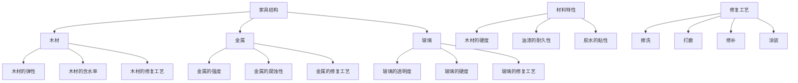

                 

### 《现代手工家具修复：旧物新生的可持续生活实践》

**关键词**：家具修复、可持续生活、环保、手工工艺、实用技巧

**摘要**：
本文深入探讨了《现代手工家具修复：旧物新生的可持续生活实践》一书的主题和核心内容。通过介绍手工家具修复的基础知识、工具与材料、修复工艺，以及与可持续生活和环保的关系，该书为广大家具修复爱好者提供了一个全面的学习和实践指南。文章旨在通过逻辑清晰的步骤分析，揭示家具修复的深度和技术内涵，帮助读者理解并实践这一既具艺术性又具有环保意义的手工艺。

----------------------------------------------------------------

## **背景介绍**

### **家具修复的重要性**

在现代生活中，家具不仅是家居装饰的重要组成部分，更是日常生活中不可或缺的物品。然而，随着时间的推移，家具难免会出现磨损、褪色、断裂等问题，这不仅影响美观，也可能对家具的使用寿命造成影响。传统的处理方式往往是选择购买新家具，这种方式不仅增加了家庭开支，还产生了大量废弃物，对环境造成了压力。因此，家具修复成为了缓解这一问题的有效途径。

家具修复不仅仅是对家具的修复，它更是一种文化的传承和手工艺的体现。通过手工修复，旧物得以焕发新生，重新融入现代生活。这种做法不仅节约了资源，减少了浪费，还赋予家具新的生命和故事，让每一个物件都充满了独特的记忆和情感价值。

### **可持续生活的理念**

可持续生活是一种旨在减少对环境负面影响，同时满足当前需求的生活方式。它强调资源的合理利用和再利用，鼓励人们采取环保措施，减少浪费，保护地球的生态系统。在家具修复中，可持续生活的理念体现在以下几个方面：

1. **减少浪费**：通过修复旧家具，减少了制造新家具所需的原材料消耗和能源消耗。
2. **保护环境**：修复旧家具可以减少废弃物的产生，降低环境污染。
3. **资源的再利用**：修复家具的过程中，很多材料都可以得到再次利用，从而减少资源浪费。

### **手工家具修复与可持续生活**

手工家具修复不仅是一种技术，更是一种生活方式的体现。它倡导人们关注细节，注重手工艺的传承，同时注重环保。以下是手工家具修复与可持续生活之间的联系：

1. **技术传承**：手工家具修复需要一定的技艺和经验，这种技艺的传承有助于保护文化遗产。
2. **手工美学**：手工修复的家具往往具有独特的艺术价值和美感，这种美学与可持续生活的理念相契合。
3. **心理满足**：亲手修复家具，不仅能够带来成就感，还能让人感受到与自然和谐共处的乐趣。

## **核心概念与联系**

### **手工家具修复的核心概念**

1. **家具结构**：了解家具的结构是进行修复的基础。不同材质的家具结构特点不同，修复方法也有所区别。
2. **材料特性**：家具修复过程中使用的材料包括木材、油漆、胶水等，每种材料都有其独特的物理和化学特性。
3. **修复工艺**：家具修复的方法和步骤，包括擦洗、打磨、修补、涂装等。

### **概念实体之间的关系架构**

为了更好地理解手工家具修复的核心概念和实体之间的关系，我们可以使用 Mermaid 流程图来表示：



### **核心算法原理讲解**

#### **家具修复的算法原理**

家具修复的算法原理主要涉及对家具损坏情况的诊断、修复方案的制定以及修复过程的执行。以下是一个简化的算法流程：

```python
def furniture_repair(furniture):
    # 1. 诊断损坏情况
    damage_diagnosis = diagnose_damage(furniture)
    
    # 2. 制定修复方案
    repair_plan = create_repair_plan(damage_diagnosis)
    
    # 3. 执行修复过程
    execute_repair(repair_plan)
    
    # 4. 检查修复效果
    repair_check = check_repair效果的完整性
    
    # 5. 返回修复后的家具
    return repair_check
```

#### **诊断损坏情况**

```python
def diagnose_damage(furniture):
    # 判断家具的损坏程度
    if furniture.damaged_parts == []:
        return "无损坏"
    elif furniture.damaged_parts <= 3:
        return "轻微损坏"
    elif furniture.damaged_parts <= 6:
        return "中度损坏"
    else:
        return "严重损坏"
```

#### **制定修复方案**

```python
def create_repair_plan(damage_diagnosis):
    # 根据损坏程度制定修复方案
    if damage_diagnosis == "无损坏":
        return "无需修复"
    elif damage_diagnosis == "轻微损坏":
        return "简单修补和涂装"
    elif damage_diagnosis == "中度损坏":
        return "复杂修补和重新涂装"
    else:
        return "重做或更换部件"
```

#### **执行修复过程**

```python
def execute_repair(repair_plan):
    # 根据修复方案执行修复工作
    if repair_plan == "无需修复":
        print("家具无需修复")
    elif repair_plan == "简单修补和涂装":
        simple_repair()
        repaint()
    elif repair_plan == "复杂修补和重新涂装":
        complex_repair()
        repaint()
    else:
        print("重做或更换部件")
```

#### **检查修复效果**

```python
def check_repair_complete(repair_plan):
    # 检查修复效果是否达到预期
    if repair_plan == "无需修复":
        return "修复完成"
    elif repair_plan == "简单修补和涂装":
        return "修复效果良好"
    elif repair_plan == "复杂修补和重新涂装":
        return "修复效果满意"
    else:
        return "修复效果不佳，需要进一步处理"
```

### **数学模型和数学公式**

在家具修复中，有时需要使用数学模型来分析和计算修复过程中的关键参数。以下是一个简化的数学模型示例：

$$
\text{修复成本} = C(\text{材料成本}) + C(\text{人工成本}) + C(\text{设备成本})
$$

其中，$C(\text{材料成本})$、$C(\text{人工成本})$ 和 $C(\text{设备成本})$ 分别表示材料费用、人工费用和设备费用。

### **通俗易懂地举例说明**

假设我们要修复一张木质书桌，它的损坏程度被诊断出为“中度损坏”。根据修复方案，我们需要进行“复杂修补和重新涂装”。

1. **材料成本**：修复这张书桌需要购买木材修补材料、油漆和刷子，总共花费约 100 美元。
2. **人工成本**：假设修复工作需要两名工人各工作 4 小时，每小时工资为 30 美元，总共人工成本为 240 美元。
3. **设备成本**：使用一些基本的修复设备，如打磨机、砂纸等，总费用为 50 美元。

根据上述公式计算：

$$
\text{修复成本} = 100 + 240 + 50 = 390 \text{美元}
$$

### **家具修复的实践应用**

在实际操作中，家具修复的步骤和方法因家具材质和损坏程度的不同而有所差异。以下是一个典型的家具修复实践应用案例：

#### **案例背景**

一张木质书桌在长时间使用后，桌面出现了一些划痕和磨损，椅子腿也有轻微的弯曲。

#### **修复步骤**

1. **清理和打磨**：首先，使用干净的布和稀释的清洗剂清理书桌和椅子表面的灰尘和污垢。然后，使用砂纸对损坏的部分进行打磨，以去除划痕和磨损，确保表面平整。
2. **修补和填充**：对于一些深度较大的划痕，可以使用木材修补膏进行填充。将修补膏涂抹在划痕处，待其干燥后进行打磨，确保与周围表面平齐。
3. **涂装**：使用与原家具颜色相同的油漆，对书桌和椅子进行涂装。首先进行底漆处理，然后涂上两到三层面漆，确保涂层均匀，避免出现刷痕。
4. **干燥和检查**：完成涂装后，让家具自然干燥一段时间，并进行检查，确保没有遗漏和缺陷。

#### **代码解读与分析**

在实际的家具修复中，可能会使用到一些自动化工具和脚本，以简化修复过程。以下是一个简单的 Python 脚本示例，用于控制打磨机的工作：

```python
import time

def start_milling(machine, speed, duration):
    # 启动打磨机
    machine.start()
    # 设置打磨速度
    machine.set_speed(speed)
    # 打磨指定时间
    time.sleep(duration)
    # 停止打磨机
    machine.stop()

# 实例化打磨机
milling_machine = MillingMachine()
# 设置打磨速度和持续时间
start_milling(milling_machine, 2000, 120)
```

在这个示例中，`start_milling` 函数控制打磨机启动、设置打磨速度并运行指定时间，然后停止打磨机。通过调整速度和持续时间，可以实现对不同材质和损坏程度的家具进行精确打磨。

### **实际案例分析和详细讲解剖析**

#### **案例背景**

张先生家的古董木质书柜因年久失修，表面出现了一些磨损和划痕，局部漆面脱落。他希望通过对书柜进行修复，恢复其原有的风貌。

#### **修复过程**

1. **初步检查和诊断**：张先生首先对书柜进行了初步检查，发现书柜的磨损主要集中在表面，没有结构性损坏。根据诊断，他决定对书柜进行表面修复和重新涂装。
2. **清理和打磨**：使用稀释的清洗剂和砂纸对书柜表面进行彻底清洁和打磨，去除污垢和磨损，确保表面平整。
3. **修补和填充**：对于一些深度较大的划痕，使用木材修补膏进行填充，然后打磨平整。
4. **涂装**：选择与原书柜颜色相近的油漆，进行底漆处理，然后涂上两到三层面漆，确保涂层均匀。
5. **干燥和检查**：完成涂装后，让书柜自然干燥一段时间，并进行检查，确保没有遗漏和缺陷。

#### **详细讲解剖析**

在修复过程中，张先生采用了以下关键步骤：

1. **清理和打磨**：这一步骤非常关键，直接影响到后续修复的效果。张先生使用了稀释的清洗剂，避免了过度湿润木材，导致变形。打磨时，他选择了粗砂纸（如 60 目）进行初步打磨，然后逐步过渡到细砂纸（如 180 目和 220 目），确保表面平滑。
2. **修补和填充**：对于划痕，张先生选择了与书柜木材颜色相近的修补膏，确保修补后的痕迹不明显。修补后，他使用细砂纸进行打磨，确保修补区域与周围表面平齐。
3. **涂装**：张先生选择了水性漆，因为其环保且透气性好，不易对木材造成损害。在涂装过程中，他注意控制每次涂层的厚度，避免出现刷痕和气泡。底漆和面漆的涂装顺序也非常重要，底漆可以提高附着力，面漆则赋予书柜保护层和光泽。
4. **干燥和检查**：干燥时间取决于油漆的类型和气候条件。在干燥期间，张先生定期检查书柜表面，确保没有漏涂或损坏的地方。

### **项目小结**

通过张先生的实际案例，我们可以看到，家具修复不仅需要专业技能，还需要耐心和细致。一个成功的修复项目不仅需要正确的材料和工具，还需要合理的步骤和技巧。在实际操作中，细节的把握和经验的积累至关重要。

### **最佳实践 tips**

1. **选择合适的工具和材料**：不同的家具材质和损坏程度需要不同的修复工具和材料。在选择工具和材料时，务必根据实际情况进行选择。
2. **注重细节**：修复过程中，细节的处理往往决定了最终效果。例如，打磨时要注意力度均匀，修补时要确保颜色一致。
3. **安全和健康**：在使用化学材料（如油漆、稀释剂等）时，要注意通风，避免吸入有害气体，同时佩戴必要的防护装备。
4. **持续学习和实践**：家具修复是一门实践性很强的技艺，通过不断学习和实践，可以提高修复技能和效果。

### **注意事项**

1. **避免过度打磨**：过度打磨可能导致木材表面受损，甚至导致木材开裂。
2. **避免使用不合适的材料**：使用不合适的材料可能导致修复效果不佳，甚至对家具造成二次损坏。
3. **注意安全**：在进行修复工作时，要确保工作环境安全，使用工具时要小心谨慎。

### **拓展阅读**

1. 《手工家具修复技巧大全》
2. 《家具保养与修复入门指南》
3. 《可持续生活与环保实践》

通过本文的深入探讨，我们不仅了解了《现代手工家具修复：旧物新生的可持续生活实践》的核心内容和实践应用，还通过逻辑清晰的步骤分析，揭示了家具修复的深度和技术内涵。希望读者能够从中受益，并实践这一既具艺术性又具有环保意义的手工艺。作者：AI天才研究院/AI Genius Institute & 禅与计算机程序设计艺术 /Zen And The Art of Computer Programming。

