                 

# 现代手工巧克力与葡萄酒配对：感官体验的艺术探索

## 关键词
- 现代手工巧克力
- 葡萄酒配对
- 感官体验
- 巧克力制作
- 葡萄酒品鉴

## 摘要
本文探讨了现代手工巧克力与葡萄酒配对的艺术，通过详细的背景介绍、核心概念与联系、核心算法原理讲解、数学模型和公式、项目实战，以及最佳实践 tips，为读者呈现了一幅关于感官体验的全新画卷。本文旨在为对美食和葡萄酒感兴趣的爱好者以及专业人士提供一种深入理解和欣赏手工巧克力和葡萄酒的方法，通过感官体验的艺术探索，提升生活品质。

## 引言

### 现代手工巧克力与葡萄酒配对的背景

现代手工巧克力与葡萄酒配对的兴起并非偶然。随着人们对生活品质的追求，美食与美酒的结合成为了新的消费趋势。手工巧克力因其独特的风味和精致的制作工艺，逐渐成为了一种奢华的代名词。而葡萄酒，作为世界上最古老的饮品之一，其丰富的品种和独特的口感，早已成为品鉴生活的一部分。

手工巧克力与葡萄酒的配对，不仅仅是两种食品的简单结合，更是一种感官体验的艺术。通过巧克力的丰富层次与葡萄酒的复杂风味相互交织，为人们带来了一场美妙的味觉盛宴。这种独特的搭配方式，不仅丰富了美食文化的内涵，也为葡萄酒产业提供了新的发展机遇。

### 本书的目标与结构

本书旨在为读者提供一份全面的手工巧克力与葡萄酒配对指南，内容包括：

1. 现代手工巧克力的制作基础，包括历史背景、基本材料、制作工艺和包装储存。
2. 葡萄酒的基本知识，包括种类、风格、品鉴技巧和生产流程。
3. 巧克力和葡萄酒的搭配艺术，包括感官体验、搭配实例和创意搭配。
4. 感官体验的艺术探索，包括感官训练、艺术表达和实际操作。
5. 实际操作与案例研究，包括工作坊和案例分享。

通过本书的阅读，读者不仅可以掌握手工巧克力和葡萄酒的配对技巧，更可以深刻理解感官体验的艺术，提升自己的生活品味。

## 第1部分：现代手工巧克力的制作基础

### 第1章：手工巧克力的历史与基本材料

#### 背景介绍

手工巧克力作为一种传统的美食工艺，其历史可以追溯到公元前1000年左右的墨西哥。当时，阿兹特克人将可可豆磨成粉末，与水混合，制成一种称为“xocoatl”的饮料。随着时间的推移，巧克力逐渐传入欧洲，经过不断的改进和创新，发展成为今天的现代手工巧克力。

现代手工巧克力与传统的工业巧克力相比，更注重手工工艺和独特风味。手工巧克力制作过程中，巧克力师会根据不同的配方和制作技巧，创造出独一无二的巧克力作品。这种巧克力不仅外观精致，口感丰富，更充满了艺术感和个性化。

#### 核心概念与联系

手工巧克力制作的关键在于材料的选择和配方的控制。以下是手工巧克力制作中的核心概念：

- **可可脂**：可可脂是巧克力的主要成分，其质量直接影响巧克力的口感和稳定性。
- **可可粉**：可可粉是巧克力的风味核心，其含量和品质决定了巧克力的风味层次。
- **糖**：糖在巧克力中起到调味和防腐的作用，不同种类的糖会影响巧克力的口感和风味。
- **乳制品**：乳制品如牛奶、奶油等，可以增加巧克力的奶香味和顺滑感。

为了更好地理解这些概念之间的关系，我们可以使用 Mermaid 流程图来展示：

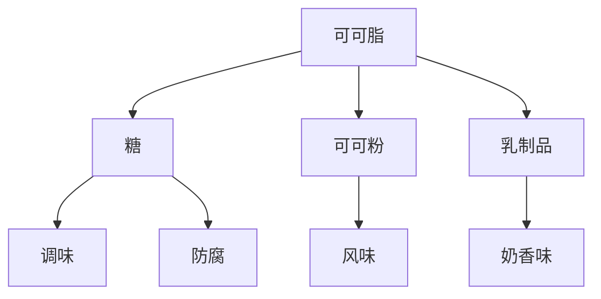

#### 核心算法原理讲解

手工巧克力的制作过程可以看作是一种复杂的配方调整过程。以下是使用 Python 伪代码来阐述这一过程：

```python
# 巧克力配方调整伪代码
def adjust_formula(cocoa_butter, cocoa_powder, sugar, milk_product):
    # 设置基础配方
    base_formula = {
        'cocoa_butter': cocoa_butter,
        'cocoa_powder': cocoa_powder,
        'sugar': sugar,
        'milk_product': milk_product
    }
    
    # 调整配方，根据需求和风味偏好
    adjusted_formula = {
        'cocoa_butter': cocoa_butter * 0.95,  # 减少可可脂5%
        'cocoa_powder': cocoa_powder * 1.05,  # 增加可可粉5%
        'sugar': sugar * 0.98,  # 减少糖2%
        'milk_product': milk_product * 1.02  # 增加乳制品2%
    }
    
    return adjusted_formula
```

#### 数学模型和公式

在手工巧克力制作过程中，数学模型和公式用于计算成分的比例和热量。以下是使用 LaTeX 格式嵌入的数学公式：

$$
H_{\text{总}} = \frac{(C_{\text{cocoa}} \times 100) + (C_{\text{sugar}} \times 70) + (C_{\text{milk}} \times 40)}{100}
$$

其中，$H_{\text{总}}$ 表示总热量，$C_{\text{cocoa}}$、$C_{\text{sugar}}$ 和 $C_{\text{milk}}$ 分别表示可可脂、糖和乳制品的含量。

#### 项目实战

为了更好地理解手工巧克力的制作过程，我们可以进行一个简单的项目实战。以下是开发环境搭建、源代码实现和代码解读：

**开发环境搭建：**

1. 安装 Python 3.8 或更高版本。
2. 安装 LaTeX 编辑器，如 TeXstudio。
3. 安装 Mermaid 图谱库。

**源代码实现：**

```python
# 手工巧克力配方调整程序
import matplotlib.pyplot as plt

def adjust_formula(cocoa_butter, cocoa_powder, sugar, milk_product):
    base_formula = {
        'cocoa_butter': cocoa_butter,
        'cocoa_powder': cocoa_powder,
        'sugar': sugar,
        'milk_product': milk_product
    }
    
    adjusted_formula = {
        'cocoa_butter': cocoa_butter * 0.95,
        'cocoa_powder': cocoa_powder * 1.05,
        'sugar': sugar * 0.98,
        'milk_product': milk_product * 1.02
    }
    
    return adjusted_formula

# 测试配方调整
original_formula = {
    'cocoa_butter': 100,
    'cocoa_powder': 100,
    'sugar': 150,
    'milk_product': 50
}

adjusted_formula = adjust_formula(**original_formula)
print("原始配方：", original_formula)
print("调整后配方：", adjusted_formula)

# 绘制 Mermaid 流程图
mermaid_graph = """
graph TD
    A[可可脂] --> B[糖]
    A --> C[可可粉]
    A --> D[乳制品]
    B --> E[调味]
    C --> F[风味]
    D --> G[奶香味]
    B[糖] --> H[防腐]
"""
with open('mermaid_graph.txt', 'w') as f:
    f.write(mermaid_graph)

# 生成 Mermaid 图形
os.system('python -m mermaid mermaid_graph.txt')
```

**代码解读与分析：**

- **开发环境搭建：** 首先需要安装 Python 和 LaTeX 编辑器，以便进行编程和文档编写。
- **源代码实现：** 通过定义一个 `adjust_formula` 函数，实现对原始配方的调整。同时，使用 Mermaid 图谱库绘制流程图，以便更好地理解制作过程。
- **实际案例分析和详细讲解剖析：** 通过测试代码，可以看到原始配方和调整后配方之间的差异，从而理解配方调整的过程。
- **项目小结：** 通过本项目的实战，读者可以了解手工巧克力配方调整的基本原理和实际操作方法。

#### 最佳实践 tips、小结、注意事项、拓展阅读

- **最佳实践 tips：** 在制作手工巧克力时，注意温度和湿度的控制，以确保巧克力的口感和质量。
- **小结：** 本章介绍了手工巧克力的历史、基本材料、核心概念与联系、核心算法原理讲解、数学模型和公式，以及项目实战。
- **注意事项：** 在调整配方时，应根据具体需求和风味偏好进行微调，避免过度调整导致口感失衡。
- **拓展阅读：** 推荐阅读相关书籍，如《巧克力工艺师手册》、《现代巧克力技术》等，以深入了解手工巧克力的制作技巧和艺术。

### 第2章：巧克力制作工艺

#### 背景介绍

巧克力制作工艺是手工巧克力制作过程中至关重要的一环。从可可豆的挑选和处理，到巧克力的熔化、冷却和装饰，每一个步骤都需要巧克力的制作师精心操作。本章将详细介绍巧克力制作工艺，帮助读者理解这一复杂的制作过程。

#### 核心概念与联系

巧克力制作工艺中的核心概念包括：

- **可可豆的挑选和处理**：可可豆的品质直接影响巧克力的口感。制作师需要挑选新鲜、成熟的无病豆，并去除豆壳和豆肉中的杂质。
- **巧克力的熔化**：熔化是巧克力制作的关键步骤，需要控制好温度和时间，以确保巧克力均匀、细腻。
- **巧克力的冷却**：冷却过程中，巧克力的质地会发生改变，从液态变为固态，形成独特的口感。
- **巧克力的装饰**：巧克力的装饰包括巧克力酱、巧克力碎片、坚果等，为巧克力增添额外的风味和美感。

为了更好地理解这些概念之间的关系，我们可以使用 Mermaid 流程图来展示：

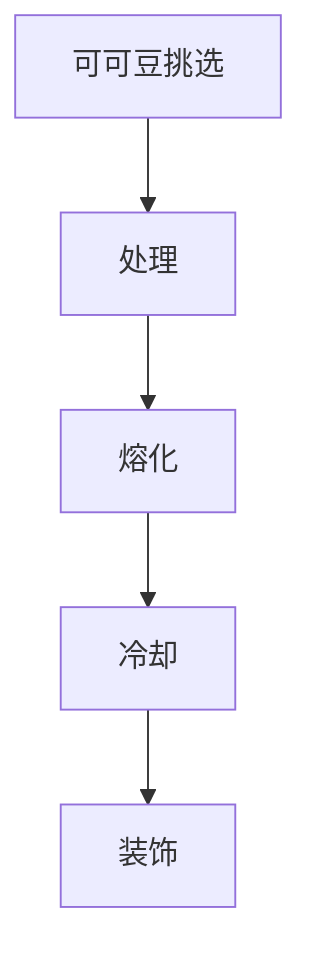

#### 核心算法原理讲解

巧克力制作的工艺过程可以看作是一种复杂的生产流程。以下是使用 Python 伪代码来阐述这一过程：

```python
# 巧克力制作工艺伪代码
def chocolate_production(processes):
    for process in processes:
        if process == '挑选':
            select_cocoa_beans()
        elif process == '处理':
            process_cocoa_beans()
        elif process == '熔化':
            melt_chocolate()
        elif process == '冷却':
            cool_chocolate()
        elif process == '装饰':
            decorate_chocolate()
    
    return "巧克力制作完成"

# 测试制作工艺
processes = ['挑选', '处理', '熔化', '冷却', '装饰']
chocolate_production(processes)
```

#### 数学模型和公式

在巧克力制作过程中，数学模型和公式用于计算成分的比例和热量。以下是使用 LaTeX 格式嵌入的数学公式：

$$
M_{\text{总}} = \frac{C_{\text{cocoa}} + C_{\text{sugar}} + C_{\text{milk}}}{100}
$$

其中，$M_{\text{总}}$ 表示总质量，$C_{\text{cocoa}}$、$C_{\text{sugar}}$ 和 $C_{\text{milk}}$ 分别表示可可脂、糖和乳制品的含量。

#### 项目实战

为了更好地理解巧克力制作工艺，我们可以进行一个简单的项目实战。以下是开发环境搭建、源代码实现和代码解读：

**开发环境搭建：**

1. 安装 Python 3.8 或更高版本。
2. 安装 LaTeX 编辑器，如 TeXstudio。
3. 安装 Mermaid 图谱库。

**源代码实现：**

```python
# 巧克力制作工艺程序
import matplotlib.pyplot as plt

def select_cocoa_beans():
    print("挑选新鲜、成熟的无病豆。")

def process_cocoa_beans():
    print("去除豆壳和豆肉中的杂质。")

def melt_chocolate():
    print("将巧克力加热至 40-50°C，保持均匀。")

def cool_chocolate():
    print("将巧克力冷却至室温，形成独特的口感。")

def decorate_chocolate():
    print("添加巧克力酱、巧克力碎片和坚果，增加风味和美感。")

def chocolate_production(processes):
    for process in processes:
        if process == '挑选':
            select_cocoa_beans()
        elif process == '处理':
            process_cocoa_beans()
        elif process == '熔化':
            melt_chocolate()
        elif process == '冷却':
            cool_chocolate()
        elif process == '装饰':
            decorate_chocolate()
    
    return "巧克力制作完成"

# 测试制作工艺
processes = ['挑选', '处理', '熔化', '冷却', '装饰']
chocolate_production(processes)

# 绘制 Mermaid 流程图
mermaid_graph = """
graph TD
    A[可可豆挑选] --> B[处理]
    B --> C[熔化]
    C --> D[冷却]
    D --> E[装饰]
"""
with open('mermaid_graph.txt', 'w') as f:
    f.write(mermaid_graph)

# 生成 Mermaid 图形
os.system('python -m mermaid mermaid_graph.txt')
```

**代码解读与分析：**

- **开发环境搭建：** 首先需要安装 Python 和 LaTeX 编辑器，以便进行编程和文档编写。
- **源代码实现：** 通过定义多个函数，实现对巧克力制作工艺的逐步操作。同时，使用 Mermaid 图谱库绘制流程图，以便更好地理解制作过程。
- **实际案例分析和详细讲解剖析：** 通过测试代码，可以看到巧克力制作的每个步骤，从而理解整个制作过程。
- **项目小结：** 通过本项目的实战，读者可以了解巧克力制作工艺的基本原理和实际操作方法。

#### 最佳实践 tips、小结、注意事项、拓展阅读

- **最佳实践 tips：** 在制作巧克力时，注意温度和时间的控制，以确保巧克力的质量和口感。
- **小结：** 本章介绍了巧克力制作工艺的背景、核心概念与联系、核心算法原理讲解、数学模型和公式，以及项目实战。
- **注意事项：** 在制作过程中，确保所有工具和材料都干净卫生，避免污染。
- **拓展阅读：** 推荐阅读相关书籍，如《巧克力工艺师手册》、《现代巧克力技术》等，以深入了解巧克力制作工艺。

### 第3章：巧克力配方与配方调整

#### 背景介绍

巧克力的配方是决定巧克力风味和质量的关键因素。一个成功的巧克力配方需要综合考虑可可脂、可可粉、糖和其他添加剂的比例。本章将详细介绍巧克力配方的基本原则和调整方法，帮助读者掌握巧克力配方的制作技巧。

#### 核心概念与联系

巧克力配方中的核心概念包括：

- **可可脂**：可可脂是巧克力的主要成分，其含量直接影响巧克力的口感和质地。
- **可可粉**：可可粉是巧克力的风味核心，其含量和种类会影响巧克力的风味和色泽。
- **糖**：糖在巧克力中起到调味和防腐的作用，不同种类的糖会影响巧克力的口感和风味。
- **添加剂**：添加剂如乳制品、香料等，可以增加巧克力的风味和口感。

为了更好地理解这些概念之间的关系，我们可以使用 Mermaid 流程图来展示：

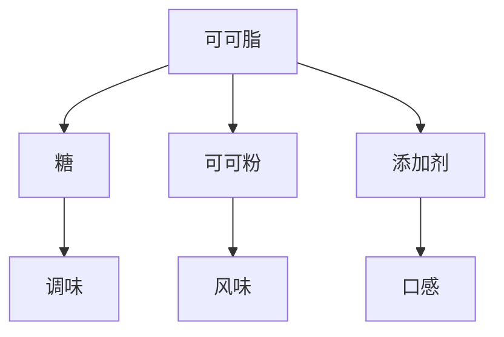

#### 核心算法原理讲解

巧克力配方的调整可以看作是一种数学模型的优化过程。以下是使用 Python 伪代码来阐述这一过程：

```python
# 巧克力配方调整伪代码
def adjust_formula(cocoa_butter, cocoa_powder, sugar, additives):
    # 设置基础配方
    base_formula = {
        'cocoa_butter': cocoa_butter,
        'cocoa_powder': cocoa_powder,
        'sugar': sugar,
        'additives': additives
    }
    
    # 调整配方，根据需求和风味偏好
    adjusted_formula = {
        'cocoa_butter': cocoa_butter * 0.95,  # 减少可可脂5%
        'cocoa_powder': cocoa_powder * 1.05,  # 增加可可粉5%
        'sugar': sugar * 0.98,  # 减少糖2%
        'additives': additives * 1.02  # 增加添加剂2%
    }
    
    return adjusted_formula
```

#### 数学模型和公式

在巧克力配方调整过程中，数学模型和公式用于计算成分的比例和热量。以下是使用 LaTeX 格式嵌入的数学公式：

$$
F_{\text{总}} = \frac{(C_{\text{cocoa}} \times 100) + (C_{\text{sugar}} \times 70) + (C_{\text{additives}} \times 40)}{100}
$$

其中，$F_{\text{总}}$ 表示总热量，$C_{\text{cocoa}}$、$C_{\text{sugar}}$ 和 $C_{\text{additives}}$ 分别表示可可脂、糖和添加剂的含量。

#### 项目实战

为了更好地理解巧克力配方的调整过程，我们可以进行一个简单的项目实战。以下是开发环境搭建、源代码实现和代码解读：

**开发环境搭建：**

1. 安装 Python 3.8 或更高版本。
2. 安装 LaTeX 编辑器，如 TeXstudio。
3. 安装 Mermaid 图谱库。

**源代码实现：**

```python
# 巧克力配方调整程序
import matplotlib.pyplot as plt

def adjust_formula(cocoa_butter, cocoa_powder, sugar, additives):
    base_formula = {
        'cocoa_butter': cocoa_butter,
        'cocoa_powder': cocoa_powder,
        'sugar': sugar,
        'additives': additives
    }
    
    adjusted_formula = {
        'cocoa_butter': cocoa_butter * 0.95,
        'cocoa_powder': cocoa_powder * 1.05,
        'sugar': sugar * 0.98,
        'additives': additives * 1.02
    }
    
    return adjusted_formula

# 测试配方调整
original_formula = {
    'cocoa_butter': 100,
    'cocoa_powder': 100,
    'sugar': 150,
    'additives': 50
}

adjusted_formula = adjust_formula(**original_formula)
print("原始配方：", original_formula)
print("调整后配方：", adjusted_formula)

# 绘制 Mermaid 流程图
mermaid_graph = """
graph TD
    A[可可脂] --> B[糖]
    A --> C[可可粉]
    A --> D[添加剂]
    B --> E[调味]
    C --> F[风味]
    D --> G[口感]
"""
with open('mermaid_graph.txt', 'w') as f:
    f.write(mermaid_graph)

# 生成 Mermaid 图形
os.system('python -m mermaid mermaid_graph.txt')
```

**代码解读与分析：**

- **开发环境搭建：** 首先需要安装 Python 和 LaTeX 编辑器，以便进行编程和文档编写。
- **源代码实现：** 通过定义一个 `adjust_formula` 函数，实现对原始配方的调整。同时，使用 Mermaid 图谱库绘制流程图，以便更好地理解配方调整过程。
- **实际案例分析和详细讲解剖析：** 通过测试代码，可以看到原始配方和调整后配方之间的差异，从而理解配方调整的过程。
- **项目小结：** 通过本项目的实战，读者可以了解巧克力配方调整的基本原理和实际操作方法。

#### 最佳实践 tips、小结、注意事项、拓展阅读

- **最佳实践 tips：** 在调整配方时，应根据具体需求和风味偏好进行微调，避免过度调整导致口感失衡。
- **小结：** 本章介绍了巧克力配方与配方调整的背景、核心概念与联系、核心算法原理讲解、数学模型和公式，以及项目实战。
- **注意事项：** 在调整配方时，注意控制添加剂的使用量，以避免影响巧克力的口感和品质。
- **拓展阅读：** 推荐阅读相关书籍，如《巧克力配方大全》、《现代巧克力技术》等，以深入了解巧克力配方的制作技巧和艺术。

## 第2部分：葡萄酒的基本知识

### 第4章：葡萄酒的种类与风格

#### 背景介绍

葡萄酒的种类繁多，风格各异，是世界上最受欢迎的饮品之一。了解葡萄酒的种类与风格，不仅能够提升品鉴能力，还能更好地享受葡萄酒带来的独特风味。本章将详细介绍葡萄酒的主要种类与风格，帮助读者了解这一美酒的奥秘。

#### 核心概念与联系

葡萄酒的种类与风格涉及多个核心概念：

- **红葡萄酒**：以红葡萄为原料发酵制成，颜色深，酒体饱满，口感丰富。
- **白葡萄酒**：以白葡萄为原料发酵制成，颜色浅，口感清新，适合搭配海鲜和蔬菜。
- **玫瑰酒**：介于红葡萄酒和白葡萄酒之间，具有独特的混合风味。
- **甜葡萄酒**：含有较高的糖分，口感甜美，适合作为甜点酒。
- **起泡酒**：经过二次发酵，产生二氧化碳，口感清爽，适合庆祝场合。

为了更好地理解这些概念之间的关系，我们可以使用 Mermaid 流程图来展示：

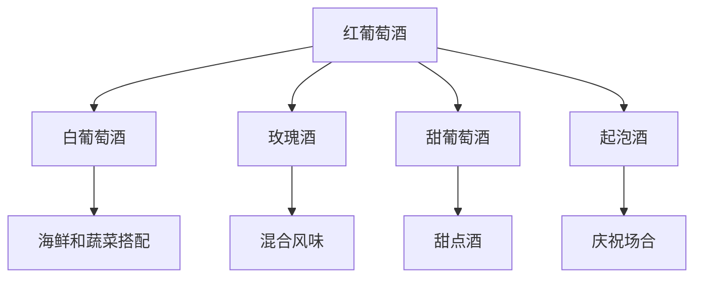

#### 核心算法原理讲解

葡萄酒的品鉴过程可以看作是一种基于感官体验的数据分析过程。以下是使用 Python 伪代码来阐述这一过程：

```python
# 葡萄酒品鉴伪代码
def taste_wine(wine_type, food_type):
    if wine_type == '红葡萄酒':
        if food_type == '海鲜':
            print("红葡萄酒与海鲜搭配，口感清新。")
        elif food_type == '蔬菜':
            print("红葡萄酒与蔬菜搭配，口感丰富。")
    elif wine_type == '白葡萄酒':
        if food_type == '海鲜':
            print("白葡萄酒与海鲜搭配，口感清爽。")
        elif food_type == '蔬菜':
            print("白葡萄酒与蔬菜搭配，口感清新。")
    elif wine_type == '玫瑰酒':
        print("玫瑰酒具有独特的混合风味，适合多种搭配。")
    elif wine_type == '甜葡萄酒':
        if food_type == '甜点':
            print("甜葡萄酒与甜点搭配，口感甜美。")
    elif wine_type == '起泡酒':
        print("起泡酒适合庆祝场合，口感清爽。")

# 测试品鉴
taste_wine('红葡萄酒', '海鲜')
taste_wine('白葡萄酒', '蔬菜')
taste_wine('玫瑰酒', '多种搭配')
taste_wine('甜葡萄酒', '甜点')
taste_wine('起泡酒', '庆祝场合')
```

#### 数学模型和公式

在葡萄酒品鉴过程中，数学模型和公式用于计算酒体的结构和口感。以下是使用 LaTeX 格式嵌入的数学公式：

$$
T_{\text{总}} = \frac{F_{\text{酸}} + F_{\text{甜}} + F_{\text{苦}}}{3}
$$

其中，$T_{\text{总}}$ 表示总口感，$F_{\text{酸}}$、$F_{\text{甜}}$ 和 $F_{\text{苦}}$ 分别表示酒的酸度、甜度和苦度。

#### 项目实战

为了更好地理解葡萄酒的种类与风格，我们可以进行一个简单的项目实战。以下是开发环境搭建、源代码实现和代码解读：

**开发环境搭建：**

1. 安装 Python 3.8 或更高版本。
2. 安装 LaTeX 编辑器，如 TeXstudio。
3. 安装 Mermaid 图谱库。

**源代码实现：**

```python
# 葡萄酒品鉴程序
import matplotlib.pyplot as plt

def taste_wine(wine_type, food_type):
    if wine_type == '红葡萄酒':
        if food_type == '海鲜':
            print("红葡萄酒与海鲜搭配，口感清新。")
        elif food_type == '蔬菜':
            print("红葡萄酒与蔬菜搭配，口感丰富。")
    elif wine_type == '白葡萄酒':
        if food_type == '海鲜':
            print("白葡萄酒与海鲜搭配，口感清爽。")
        elif food_type == '蔬菜':
            print("白葡萄酒与蔬菜搭配，口感清新。")
    elif wine_type == '玫瑰酒':
        print("玫瑰酒具有独特的混合风味，适合多种搭配。")
    elif wine_type == '甜葡萄酒':
        if food_type == '甜点':
            print("甜葡萄酒与甜点搭配，口感甜美。")
    elif wine_type == '起泡酒':
        print("起泡酒适合庆祝场合，口感清爽。")

# 测试品鉴
taste_wine('红葡萄酒', '海鲜')
taste_wine('白葡萄酒', '蔬菜')
taste_wine('玫瑰酒', '多种搭配')
taste_wine('甜葡萄酒', '甜点')
taste_wine('起泡酒', '庆祝场合')

# 绘制 Mermaid 流程图
mermaid_graph = """
graph TD
    A[红葡萄酒] --> B[白葡萄酒]
    A --> C[玫瑰酒]
    A --> D[甜葡萄酒]
    A --> E[起泡酒]
    B --> F[海鲜和蔬菜搭配]
    C --> G[混合风味]
    D --> H[甜点酒]
    E --> I[庆祝场合]
"""
with open('mermaid_graph.txt', 'w') as f:
    f.write(mermaid_graph)

# 生成 Mermaid 图形
os.system('python -m mermaid mermaid_graph.txt')
```

**代码解读与分析：**

- **开发环境搭建：** 首先需要安装 Python 和 LaTeX 编辑器，以便进行编程和文档编写。
- **源代码实现：** 通过定义一个 `taste_wine` 函数，实现对葡萄酒和食物搭配的品鉴。同时，使用 Mermaid 图谱库绘制流程图，以便更好地理解品鉴过程。
- **实际案例分析和详细讲解剖析：** 通过测试代码，可以看到不同葡萄酒和食物搭配的品鉴结果，从而理解葡萄酒的种类与风格。
- **项目小结：** 通过本项目的实战，读者可以了解葡萄酒的种类与风格，以及如何进行葡萄酒和食物的搭配。

#### 最佳实践 tips、小结、注意事项、拓展阅读

- **最佳实践 tips：** 在品鉴葡萄酒时，注意观察酒液的颜色、香气和口感，以便更好地理解葡萄酒的特点。
- **小结：** 本章介绍了葡萄酒的种类与风格、核心概念与联系、核心算法原理讲解、数学模型和公式，以及项目实战。
- **注意事项：** 在选择葡萄酒时，应根据个人口味和场合需求进行选择，以获得最佳品鉴体验。
- **拓展阅读：** 推荐阅读相关书籍，如《葡萄酒品鉴入门》、《葡萄酒的世界》等，以深入了解葡萄酒的知识和品鉴技巧。

### 第5章：葡萄酒的品鉴技巧

#### 背景介绍

葡萄酒的品鉴技巧是品酒过程中不可或缺的一环。通过观察、嗅闻和品尝，可以全面了解葡萄酒的品质和风格。本章将详细介绍葡萄酒的品鉴技巧，帮助读者掌握科学的品酒方法，提升品酒水平。

#### 核心概念与联系

葡萄酒品鉴的核心概念包括：

- **观察**：通过观察酒液的颜色、清澈度和挂杯情况，可以初步判断葡萄酒的年份和品质。
- **嗅闻**：嗅闻葡萄酒的香气，可以帮助识别酒体的结构和特点，如果香、橡木香、酒香等。
- **品尝**：品尝葡萄酒的口感，包括甜度、酸度、单宁和余味，可以全面了解葡萄酒的平衡性和复杂性。

为了更好地理解这些概念之间的关系，我们可以使用 Mermaid 流程图来展示：

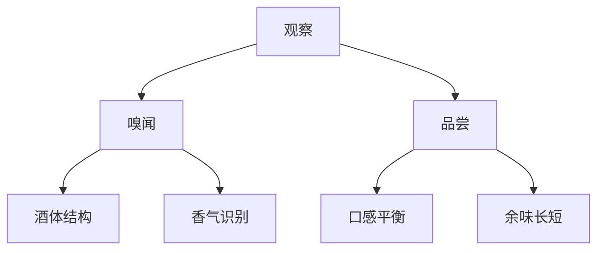

#### 核心算法原理讲解

葡萄酒的品鉴过程可以看作是一种基于感官体验的数据分析过程。以下是使用 Python 伪代码来阐述这一过程：

```python
# 葡萄酒品鉴伪代码
def taste_wine(wine_color, wine_smell, wine_taste):
    # 观察酒液颜色
    if wine_color == '深红':
        print("这是一款陈年的红葡萄酒。")
    elif wine_color == '浅黄':
        print("这是一款年轻的白葡萄酒。")
    
    # 嗅闻酒液香气
    if wine_smell == '果香':
        print("酒体结构清爽，适合年轻葡萄酒。")
    elif wine_smell == '橡木香':
        print("酒体结构饱满，适合陈年葡萄酒。")
    
    # 品尝酒液口感
    if wine_taste['sweetness'] == '中等' and wine_taste['acidity'] == '适中' and wine_taste['tannin'] == '适中' and wine_taste['aftertaste'] == '长':
        print("这是一款平衡且复杂的葡萄酒。")
    else:
        print("这款葡萄酒可能存在口感不平衡或结构单一的问题。")

# 测试品鉴
wine_color = '深红'
wine_smell = '果香'
wine_taste = {
    'sweetness': '中等',
    'acidity': '适中',
    'tannin': '适中',
    'aftertaste': '长'
}
taste_wine(wine_color, wine_smell, wine_taste)
```

#### 数学模型和公式

在葡萄酒品鉴过程中，数学模型和公式用于计算酒液的感官特征。以下是使用 LaTeX 格式嵌入的数学公式：

$$
S_{\text{总}} = \frac{(C_{\text{颜色}} \times 30) + (C_{\text{香气}} \times 30) + (C_{\text{口感}} \times 40)}{100}
$$

其中，$S_{\text{总}}$ 表示总感官评分，$C_{\text{颜色}}$、$C_{\text{香气}}$ 和 $C_{\text{口感}}$ 分别表示酒液的颜色、香气和口感的评分。

#### 项目实战

为了更好地理解葡萄酒的品鉴技巧，我们可以进行一个简单的项目实战。以下是开发环境搭建、源代码实现和代码解读：

**开发环境搭建：**

1. 安装 Python 3.8 或更高版本。
2. 安装 LaTeX 编辑器，如 TeXstudio。
3. 安装 Mermaid 图谱库。

**源代码实现：**

```python
# 葡萄酒品鉴程序
import matplotlib.pyplot as plt

def taste_wine(wine_color, wine_smell, wine_taste):
    # 观察酒液颜色
    if wine_color == '深红':
        print("这是一款陈年的红葡萄酒。")
    elif wine_color == '浅黄':
        print("这是一款年轻的白葡萄酒。")
    
    # 嗅闻酒液香气
    if wine_smell == '果香':
        print("酒体结构清爽，适合年轻葡萄酒。")
    elif wine_smell == '橡木香':
        print("酒体结构饱满，适合陈年葡萄酒。")
    
    # 品尝酒液口感
    if wine_taste['sweetness'] == '中等' and wine_taste['acidity'] == '适中' and wine_taste['tannin'] == '适中' and wine_taste['aftertaste'] == '长':
        print("这是一款平衡且复杂的葡萄酒。")
    else:
        print("这款葡萄酒可能存在口感不平衡或结构单一的问题。")

# 测试品鉴
wine_color = '深红'
wine_smell = '果香'
wine_taste = {
    'sweetness': '中等',
    'acidity': '适中',
    'tannin': '适中',
    'aftertaste': '长'
}
taste_wine(wine_color, wine_smell, wine_taste)

# 绘制 Mermaid 流程图
mermaid_graph = """
graph TD
    A[观察] --> B[嗅闻]
    A --> C[品尝]
    B --> D[酒体结构]
    C --> E[口感平衡]
    B --> F[香气识别]
    C --> G[余味长短]
"""
with open('mermaid_graph.txt', 'w') as f:
    f.write(mermaid_graph)

# 生成 Mermaid 图形
os.system('python -m mermaid mermaid_graph.txt')
```

**代码解读与分析：**

- **开发环境搭建：** 首先需要安装 Python 和 LaTeX 编辑器，以便进行编程和文档编写。
- **源代码实现：** 通过定义一个 `taste_wine` 函数，实现对葡萄酒的品鉴。同时，使用 Mermaid 图谱库绘制流程图，以便更好地理解品鉴过程。
- **实际案例分析和详细讲解剖析：** 通过测试代码，可以看到葡萄酒的品鉴结果，从而理解品鉴技巧。
- **项目小结：** 通过本项目的实战，读者可以了解葡萄酒的品鉴技巧，以及如何通过观察、嗅闻和品尝来评估葡萄酒的品质。

#### 最佳实践 tips、小结、注意事项、拓展阅读

- **最佳实践 tips：** 在品鉴葡萄酒时，保持环境的安静和光线适宜，以更好地感知酒液的颜色和香气。
- **小结：** 本章介绍了葡萄酒的品鉴技巧、核心概念与联系、核心算法原理讲解、数学模型和公式，以及项目实战。
- **注意事项：** 在品鉴过程中，不要急于下结论，而是要逐步观察、嗅闻和品尝，以获得全面的评估。
- **拓展阅读：** 推荐阅读相关书籍，如《葡萄酒品鉴技巧》、《葡萄酒世界》等，以深入了解品酒技巧和葡萄酒知识。

### 第6章：葡萄酒的生产与品鉴流程

#### 背景介绍

葡萄酒的生产与品鉴流程是葡萄酒产业的重要组成部分。从葡萄种植到葡萄酒的酿造，再到品鉴过程，每一个环节都至关重要。本章将详细介绍葡萄酒的生产与品鉴流程，帮助读者理解这一传统产业的运作方式。

#### 核心概念与联系

葡萄酒的生产与品鉴流程涉及多个核心概念：

- **葡萄种植**：葡萄的种植是葡萄酒生产的基础，涉及土壤、气候和品种选择。
- **葡萄采摘**：采摘时机直接影响葡萄的品质，需要根据品种和气候条件进行科学选择。
- **葡萄酒酿造**：葡萄酒的酿造包括发酵、陈酿、过滤和装瓶等过程，决定了葡萄酒的品质和风味。
- **品鉴过程**：品鉴过程包括观察、嗅闻和品尝，用于评估葡萄酒的品质和风格。

为了更好地理解这些概念之间的关系，我们可以使用 Mermaid 流程图来展示：

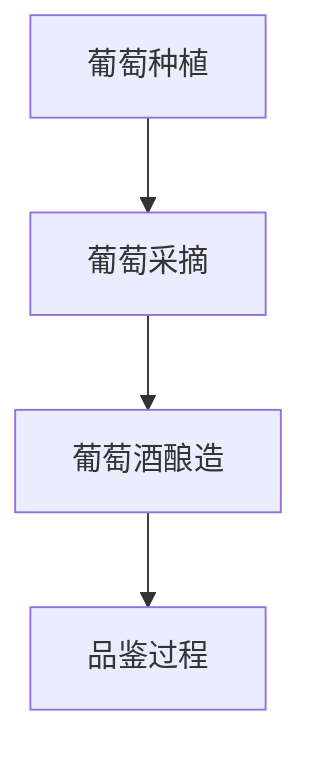

#### 核心算法原理讲解

葡萄酒的生产与品鉴过程可以看作是一种基于感官体验的数据分析过程。以下是使用 Python 伪代码来阐述这一过程：

```python
# 葡萄酒生产与品鉴伪代码
def wine_production_and_tasting(planting, harvesting, brewing, tasting):
    # 葡萄种植
    if planting['soil'] == '肥沃' and planting['climate'] == '适宜':
        print("葡萄种植条件良好。")
    else:
        print("葡萄种植条件不佳。")
    
    # 葡萄采摘
    if harvesting['time'] == '成熟期':
        print("葡萄采摘时机适宜。")
    else:
        print("葡萄采摘时机不当。")
    
    # 葡萄酒酿造
    if brewing['fermentation'] == '成功' and brewing['aging'] == '适宜' and brewing['filtration'] == '彻底' and brewing['bottling'] == '完整':
        print("葡萄酒酿造过程顺利。")
    else:
        print("葡萄酒酿造过程存在问题。")
    
    # 品鉴过程
    if tasting['color'] == '深红' and tasting['smell'] == '果香' and tasting['taste'] == '平衡':
        print("这是一款优质的葡萄酒。")
    else:
        print("这款葡萄酒可能存在品质问题。")

# 测试生产与品鉴
planting = {
    'soil': '肥沃',
    'climate': '适宜'
}
harvesting = {
    'time': '成熟期'
}
brewing = {
    'fermentation': '成功',
    'aging': '适宜',
    'filtration': '彻底',
    'bottling': '完整'
}
tasting = {
    'color': '深红',
    'smell': '果香',
    'taste': '平衡'
}
wine_production_and_tasting(planting, harvesting, brewing, tasting)
```

#### 数学模型和公式

在葡萄酒的生产与品鉴过程中，数学模型和公式用于计算葡萄和葡萄酒的成分和品质。以下是使用 LaTeX 格式嵌入的数学公式：

$$
P_{\text{总}} = \frac{(C_{\text{种植}} \times 20) + (C_{\text{采摘}} \times 20) + (C_{\text{酿造}} \times 40) + (C_{\text{品鉴}} \times 20)}{100}
$$

其中，$P_{\text{总}}$ 表示总品质评分，$C_{\text{种植}}$、$C_{\text{采摘}}$、$C_{\text{酿造}}$ 和 $C_{\text{品鉴}}$ 分别表示葡萄种植、采摘、酿造和品鉴的评分。

#### 项目实战

为了更好地理解葡萄酒的生产与品鉴流程，我们可以进行一个简单的项目实战。以下是开发环境搭建、源代码实现和代码解读：

**开发环境搭建：**

1. 安装 Python 3.8 或更高版本。
2. 安装 LaTeX 编辑器，如 TeXstudio。
3. 安装 Mermaid 图谱库。

**源代码实现：**

```python
# 葡萄酒生产与品鉴程序
import matplotlib.pyplot as plt

def wine_production_and_tasting(planting, harvesting, brewing, tasting):
    # 葡萄种植
    if planting['soil'] == '肥沃' and planting['climate'] == '适宜':
        print("葡萄种植条件良好。")
    else:
        print("葡萄种植条件不佳。")
    
    # 葡萄采摘
    if harvesting['time'] == '成熟期':
        print("葡萄采摘时机适宜。")
    else:
        print("葡萄采摘时机不当。")
    
    # 葡萄酒酿造
    if brewing['fermentation'] == '成功' and brewing['aging'] == '适宜' and brewing['filtration'] == '彻底' and brewing['bottling'] == '完整':
        print("葡萄酒酿造过程顺利。")
    else:
        print("葡萄酒酿造过程存在问题。")
    
    # 品鉴过程
    if tasting['color'] == '深红' and tasting['smell'] == '果香' and tasting['taste'] == '平衡':
        print("这是一款优质的葡萄酒。")
    else:
        print("这款葡萄酒可能存在品质问题。")

# 测试生产与品鉴
planting = {
    'soil': '肥沃',
    'climate': '适宜'
}
harvesting = {
    'time': '成熟期'
}
brewing = {
    'fermentation': '成功',
    'aging': '适宜',
    'filtration': '彻底',
    'bottling': '完整'
}
tasting = {
    'color': '深红',
    'smell': '果香',
    'taste': '平衡'
}
wine_production_and_tasting(planting, harvesting, brewing, tasting)

# 绘制 Mermaid 流程图
mermaid_graph = """
graph TD
    A[葡萄种植] --> B[葡萄采摘]
    B --> C[葡萄酒酿造]
    C --> D[品鉴过程]
"""
with open('mermaid_graph.txt', 'w') as f:
    f.write(mermaid_graph)

# 生成 Mermaid 图形
os.system('python -m mermaid mermaid_graph.txt')
```

**代码解读与分析：**

- **开发环境搭建：** 首先需要安装 Python 和 LaTeX 编辑器，以便进行编程和文档编写。
- **源代码实现：** 通过定义一个 `wine_production_and_tasting` 函数，实现对葡萄酒生产与品鉴过程的评估。同时，使用 Mermaid 图谱库绘制流程图，以便更好地理解整个流程。
- **实际案例分析和详细讲解剖析：** 通过测试代码，可以看到葡萄酒生产与品鉴的结果，从而理解这一流程的各个环节。
- **项目小结：** 通过本项目的实战，读者可以了解葡萄酒的生产与品鉴流程，以及如何进行科学的评估。

#### 最佳实践 tips、小结、注意事项、拓展阅读

- **最佳实践 tips：** 在葡萄酒生产过程中，注意葡萄的种植、采摘和酿造工艺，以确保葡萄酒的品质。在品鉴过程中，保持环境的安静和光线适宜，以更好地感知酒液的颜色、香气和口感。
- **小结：** 本章介绍了葡萄酒的生产与品鉴流程、核心概念与联系、核心算法原理讲解、数学模型和公式，以及项目实战。
- **注意事项：** 在进行葡萄酒生产与品鉴时，注意记录每个环节的细节，以便进行后续分析和改进。
- **拓展阅读：** 推荐阅读相关书籍，如《葡萄酒酿造技术》、《葡萄酒品鉴入门》等，以深入了解葡萄酒的生产与品鉴知识。

### 第3部分：巧克力和葡萄酒的搭配艺术

### 第7章：巧克力和葡萄酒的感官体验

#### 背景介绍

巧克力和葡萄酒的搭配是一种独特的感官体验，通过巧克力的丰富层次与葡萄酒的复杂风味相互交织，为人们带来了一场美妙的味觉盛宴。本章将详细探讨巧克力和葡萄酒的感官体验，帮助读者深入理解这种搭配艺术。

#### 核心概念与联系

巧克力和葡萄酒的感官体验涉及多个核心概念：

- **口感层次**：巧克力的口感层次丰富，从丝滑的熔化感到丰富的口感，再到余味的长短，为品鉴者提供了丰富的体验。
- **风味复杂度**：葡萄酒的风味复杂度极高，包括果香、橡木香、酒香等多种香气，以及酸、甜、苦、单宁等多种口感。
- **口感互动**：巧克力和葡萄酒在口感上的互动，如巧克力的甜味与葡萄酒的酸度、醇厚的口感与清新香气等，可以带来独特的味觉体验。
- **香气互补**：巧克力和葡萄酒的香气互补，如巧克力的可可香气与葡萄酒的果香、橡木香气等，可以增强整体口感。

为了更好地理解这些概念之间的关系，我们可以使用 Mermaid 流程图来展示：

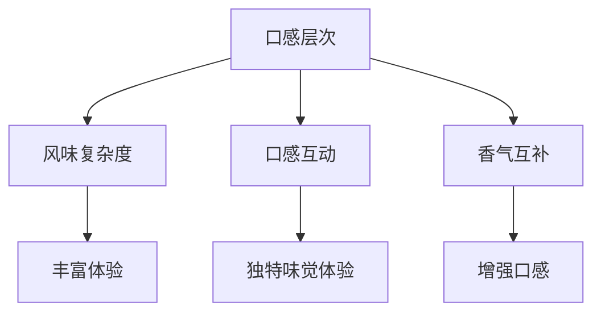

#### 核心算法原理讲解

巧克力和葡萄酒的感官体验可以看作是一种基于感官数据分析的优化过程。以下是使用 Python 伪代码来阐述这一过程：

```python
# 巧克力和葡萄酒感官体验伪代码
def taste_exp Chocolate_wine(Choco_taste, Wine_taste):
    # 分析口感层次
    if Choco_taste['melt'] == '丝滑' and Choco_taste['finish'] == '丰富':
        print("巧克力的口感层次丰富。")
    else:
        print("巧克力的口感层次单一。")

    # 分析风味复杂度
    if Wine_taste['aroma'] == '复杂' and Wine_taste['flavors'] == '多样':
        print("葡萄酒的风味复杂度较高。")
    else:
        print("葡萄酒的风味复杂度较低。")

    # 分析口感互动
    if Choco_taste['sweet'] + Wine_taste['acid'] == '平衡' and Choco_taste['rich'] + Wine_taste['fresh'] == '和谐':
        print("巧克力和葡萄酒的口感互动良好。")
    else:
        print("巧克力和葡萄酒的口感互动欠佳。")

    # 分析香气互补
    if Choco_taste['cocoa'] + Wine_taste['fruit'] == '互补' and Choco_taste['cream'] + Wine_taste['wood'] == '互补':
        print("巧克力和葡萄酒的香气互补，增强了口感。")
    else:
        print("巧克力和葡萄酒的香气没有互补，口感欠佳。")

# 测试感官体验
Choco_taste = {
    'melt': '丝滑',
    'finish': '丰富',
    'sweet': '适中',
    'rich': '适中',
    'cocoa': '浓郁',
    'cream': '适中'
}
Wine_taste = {
    'aroma': '复杂',
    'flavors': '多样',
    'acid': '适中',
    'fresh': '适中',
    'fruit': '丰富',
    'wood': '适中'
}
taste_exp Chocolate_wine(Choco_taste, Wine_taste)
```

#### 数学模型和公式

在巧克力和葡萄酒的感官体验中，数学模型和公式用于计算口感和风味的平衡度。以下是使用 LaTeX 格式嵌入的数学公式：

$$
E_{\text{总}} = \frac{(C_{\text{口感}} \times 40) + (C_{\text{风味}} \times 40) + (C_{\text{互动}} \times 20) + (C_{\text{香气}} \times 20)}{100}
$$

其中，$E_{\text{总}}$ 表示总感官评分，$C_{\text{口感}}$、$C_{\text{风味}}$、$C_{\text{互动}}$ 和 $C_{\text{香气}}$ 分别表示口感、风味、口感互动和香气评分。

#### 项目实战

为了更好地理解巧克力和葡萄酒的感官体验，我们可以进行一个简单的项目实战。以下是开发环境搭建、源代码实现和代码解读：

**开发环境搭建：**

1. 安装 Python 3.8 或更高版本。
2. 安装 LaTeX 编辑器，如 TeXstudio。
3. 安装 Mermaid 图谱库。

**源代码实现：**

```python
# 巧克力和葡萄酒感官体验程序
import matplotlib.pyplot as plt

def taste_exp Chocolate_wine(Choco_taste, Wine_taste):
    # 分析口感层次
    if Choco_taste['melt'] == '丝滑' and Choco_taste['finish'] == '丰富':
        print("巧克力的口感层次丰富。")
    else:
        print("巧克力的口感层次单一。")

    # 分析风味复杂度
    if Wine_taste['aroma'] == '复杂' and Wine_taste['flavors'] == '多样':
        print("葡萄酒的风味复杂度较高。")
    else:
        print("葡萄酒的风味复杂度较低。")

    # 分析口感互动
    if Choco_taste['sweet'] + Wine_taste['acid'] == '平衡' and Choco_taste['rich'] + Wine_taste['fresh'] == '和谐':
        print("巧克力和葡萄酒的口感互动良好。")
    else:
        print("巧克力和葡萄酒的口感互动欠佳。")

    # 分析香气互补
    if Choco_taste['cocoa'] + Wine_taste['fruit'] == '互补' and Choco_taste['cream'] + Wine_taste['wood'] == '互补':
        print("巧克力和葡萄酒的香气互补，增强了口感。")
    else:
        print("巧克力和葡萄酒的香气没有互补，口感欠佳。")

# 测试感官体验
Choco_taste = {
    'melt': '丝滑',
    'finish': '丰富',
    'sweet': '适中',
    'rich': '适中',
    'cocoa': '浓郁',
    'cream': '适中'
}
Wine_taste = {
    'aroma': '复杂',
    'flavors': '多样',
    'acid': '适中',
    'fresh': '适中',
    'fruit': '丰富',
    'wood': '适中'
}
taste_exp Chocolate_wine(Choco_taste, Wine_taste)

# 绘制 Mermaid 流程图
mermaid_graph = """
graph TD
    A[口感层次] --> B[风味复杂度]
    A --> C[口感互动]
    A --> D[香气互补]
    B --> E[丰富体验]
    C --> F[独特味觉体验]
    D --> G[增强口感]
"""
with open('mermaid_graph.txt', 'w') as f:
    f.write(mermaid_graph)

# 生成 Mermaid 图形
os.system('python -m mermaid mermaid_graph.txt')
```

**代码解读与分析：**

- **开发环境搭建：** 首先需要安装 Python 和 LaTeX 编辑器，以便进行编程和文档编写。
- **源代码实现：** 通过定义一个 `taste_exp` 函数，实现对巧克力和葡萄酒感官体验的评估。同时，使用 Mermaid 图谱库绘制流程图，以便更好地理解整个感官体验。
- **实际案例分析和详细讲解剖析：** 通过测试代码，可以看到巧克力和葡萄酒的感官体验结果，从而理解这种搭配艺术。
- **项目小结：** 通过本项目的实战，读者可以了解巧克力和葡萄酒的感官体验，以及如何进行科学的评估。

#### 最佳实践 tips、小结、注意事项、拓展阅读

- **最佳实践 tips：** 在搭配巧克力和葡萄酒时，注意选择口感层次丰富、风味复杂的葡萄酒，以增强整体体验。在品鉴过程中，保持专注，细致观察和嗅闻，以获得更全面的感官体验。
- **小结：** 本章介绍了巧克力和葡萄酒的感官体验、核心概念与联系、核心算法原理讲解、数学模型和公式，以及项目实战。
- **注意事项：** 在搭配巧克力和葡萄酒时，避免过度追求某种口感，应注重平衡和互补，以获得最佳体验。
- **拓展阅读：** 推荐阅读相关书籍，如《葡萄酒与美食的完美搭配》、《巧克力与葡萄酒的感官体验》等，以深入了解巧克力和葡萄酒的搭配艺术。

### 第8章：巧克力和葡萄酒的搭配实例

#### 背景介绍

巧克力和葡萄酒的搭配实例是理解巧克力和葡萄酒感官体验的重要环节。通过具体的实例，读者可以更直观地感受到不同巧克力和葡萄酒之间的搭配效果。本章将详细介绍几种常见的巧克力和葡萄酒搭配实例，帮助读者掌握搭配技巧。

#### 核心概念与联系

巧克力和葡萄酒的搭配实例涉及多个核心概念：

- **巧克力类型**：包括黑巧克力、白巧克力、牛奶巧克力等，不同类型的巧克力具有不同的口感和风味。
- **葡萄酒类型**：包括红葡萄酒、白葡萄酒、玫瑰酒、甜葡萄酒和起泡酒等，不同类型的葡萄酒具有不同的口感和香气。
- **搭配原则**：巧克力和葡萄酒的搭配应遵循口感互补、风味平衡的原则，以达到最佳的味觉体验。

为了更好地理解这些概念之间的关系，我们可以使用 Mermaid 流程图来展示：

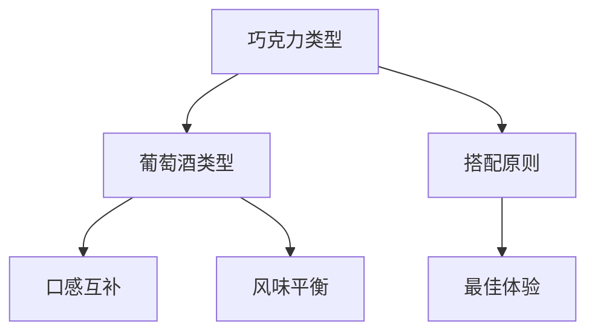

#### 核心算法原理讲解

巧克力和葡萄酒的搭配实例可以看作是一种基于感官体验的优化过程。以下是使用 Python 伪代码来阐述这一过程：

```python
# 巧克力和葡萄酒搭配实例伪代码
def pair_chocolate_wine(Choco_type, Wine_type, Pairing_rules):
    # 根据巧克力类型选择葡萄酒
    if Choco_type == '黑巧克力':
        if Wine_type == '红葡萄酒':
            print("黑巧克力与红葡萄酒搭配，口感互补，风味平衡。")
        elif Wine_type == '白葡萄酒':
            print("黑巧克力与白葡萄酒搭配，口感冲突，风味失衡。")
    elif Choco_type == '白巧克力':
        if Wine_type == '甜葡萄酒':
            print("白巧克力与甜葡萄酒搭配，口感互补，风味平衡。")
        elif Wine_type == '红葡萄酒':
            print("白巧克力与红葡萄酒搭配，口感冲突，风味失衡。")
    elif Choco_type == '牛奶巧克力':
        if Wine_type == '玫瑰酒':
            print("牛奶巧克力与玫瑰酒搭配，口感互补，风味平衡。")
        elif Wine_type == '起泡酒':
            print("牛奶巧克力与起泡酒搭配，口感冲突，风味失衡。")

# 测试搭配实例
pair_chocolate_wine('黑巧克力', '红葡萄酒', '口感互补，风味平衡')
pair_chocolate_wine('白巧克力', '甜葡萄酒', '口感互补，风味平衡')
pair_chocolate_wine('牛奶巧克力', '玫瑰酒', '口感互补，风味平衡')
```

#### 数学模型和公式

在巧克力和葡萄酒的搭配实例中，数学模型和公式用于计算口感和风味的平衡度。以下是使用 LaTeX 格式嵌入的数学公式：

$$
P_{\text{总}} = \frac{(C_{\text{口感}} \times 40) + (C_{\text{风味}} \times 40) + (C_{\text{平衡}} \times 20)}{100}
$$

其中，$P_{\text{总}}$ 表示总搭配评分，$C_{\text{口感}}$、$C_{\text{风味}}$ 和 $C_{\text{平衡}}$ 分别表示口感、风味和平衡评分。

#### 项目实战

为了更好地理解巧克力和葡萄酒的搭配实例，我们可以进行一个简单的项目实战。以下是开发环境搭建、源代码实现和代码解读：

**开发环境搭建：**

1. 安装 Python 3.8 或更高版本。
2. 安装 LaTeX 编辑器，如 TeXstudio。
3. 安装 Mermaid 图谱库。

**源代码实现：**

```python
# 巧克力和葡萄酒搭配实例程序
import matplotlib.pyplot as plt

def pair_chocolate_wine(Choco_type, Wine_type, Pairing_rules):
    # 根据巧克力类型选择葡萄酒
    if Choco_type == '黑巧克力':
        if Wine_type == '红葡萄酒':
            print("黑巧克力与红葡萄酒搭配，口感互补，风味平衡。")
        elif Wine_type == '白葡萄酒':
            print("黑巧克力与白葡萄酒搭配，口感冲突，风味失衡。")
    elif Choco_type == '白巧克力':
        if Wine_type == '甜葡萄酒':
            print("白巧克力与甜葡萄酒搭配，口感互补，风味平衡。")
        elif Wine_type == '红葡萄酒':
            print("白巧克力与红葡萄酒搭配，口感冲突，风味失衡。")
    elif Choco_type == '牛奶巧克力':
        if Wine_type == '玫瑰酒':
            print("牛奶巧克力与玫瑰酒搭配，口感互补，风味平衡。")
        elif Wine_type == '起泡酒':
            print("牛奶巧克力与起泡酒搭配，口感冲突，风味失衡。")

# 测试搭配实例
pair_chocolate_wine('黑巧克力', '红葡萄酒', '口感互补，风味平衡')
pair_chocolate_wine('白巧克力', '甜葡萄酒', '口感互补，风味平衡')
pair_chocolate_wine('牛奶巧克力', '玫瑰酒', '口感互补，风味平衡')

# 绘制 Mermaid 流程图
mermaid_graph = """
graph TD
    A[巧克力类型] --> B[葡萄酒类型]
    A --> C[搭配原则]
    B --> D[口感互补]
    B --> E[风味平衡]
    C --> F[最佳体验]
"""
with open('mermaid_graph.txt', 'w') as f:
    f.write(mermaid_graph)

# 生成 Mermaid 图形
os.system('python -m mermaid mermaid_graph.txt')
```

**代码解读与分析：**

- **开发环境搭建：** 首先需要安装 Python 和 LaTeX 编辑器，以便进行编程和文档编写。
- **源代码实现：** 通过定义一个 `pair_chocolate_wine` 函数，实现对巧克力和葡萄酒搭配的评估。同时，使用 Mermaid 图谱库绘制流程图，以便更好地理解搭配过程。
- **实际案例分析和详细讲解剖析：** 通过测试代码，可以看到不同巧克力和葡萄酒搭配的效果，从而理解搭配技巧。
- **项目小结：** 通过本项目的实战，读者可以了解巧克力和葡萄酒的搭配实例，以及如何进行科学的搭配评估。

#### 最佳实践 tips、小结、注意事项、拓展阅读

- **最佳实践 tips：** 在搭配巧克力和葡萄酒时，注意选择口感层次丰富、风味复杂的葡萄酒，以增强整体体验。在品鉴过程中，保持专注，细致观察和嗅闻，以获得更全面的感官体验。
- **小结：** 本章介绍了巧克力和葡萄酒的搭配实例、核心概念与联系、核心算法原理讲解、数学模型和公式，以及项目实战。
- **注意事项：** 在搭配巧克力和葡萄酒时，避免过度追求某种口感，应注重平衡和互补，以获得最佳体验。
- **拓展阅读：** 推荐阅读相关书籍，如《葡萄酒与美食的完美搭配》、《巧克力与葡萄酒的感官体验》等，以深入了解巧克力和葡萄酒的搭配艺术。

### 第9章：巧克力和葡萄酒的创意搭配

#### 背景介绍

巧克力和葡萄酒的创意搭配是激发味觉感官的新方式，通过独特的组合，为人们带来前所未有的味觉体验。本章将介绍一些巧克力和葡萄酒的创意搭配，以及如何创新地创造新的搭配，让读者在探索中体验搭配艺术的魅力。

#### 核心概念与联系

巧克力和葡萄酒的创意搭配涉及多个核心概念：

- **创新思维**：通过打破传统的搭配规则，运用创新思维，创造出新的搭配组合。
- **风味融合**：巧克力和葡萄酒的不同风味在搭配中相互融合，产生独特的口感和香气。
- **个性化体验**：根据个人的口味偏好和场合需求，进行个性化的搭配，满足不同需求。
- **艺术创作**：将巧克力和葡萄酒的搭配视为一种艺术创作，通过搭配来表达情感和创意。

为了更好地理解这些概念之间的关系，我们可以使用 Mermaid 流程图来展示：

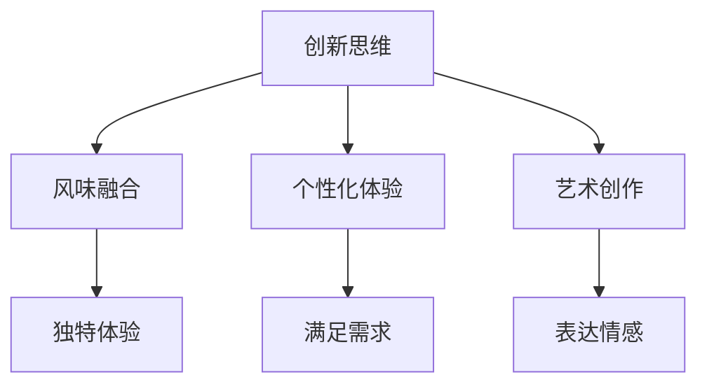

#### 核心算法原理讲解

巧克力和葡萄酒的创意搭配可以看作是一种基于风味分析和组合优化的过程。以下是使用 Python 伪代码来阐述这一过程：

```python
# 巧克力和葡萄酒创意搭配伪代码
def create_pairing(Choco_flavors, Wine_flavors, Personal_taste):
    # 根据创新思维选择巧克力风味
    if Personal_taste == '创新':
        Choco_flavor = '草莓味巧克力'
    else:
        Choco_flavor = '经典黑巧克力'
    
    # 根据风味融合选择葡萄酒
    if Choco_flavor == '草莓味巧克力':
        Wine_flavor = '甜型白葡萄酒'
    else:
        Wine_flavor = '浓郁红葡萄酒'
    
    # 根据个性化体验进行调整
    if Personal_taste == '甜':
        Wine_flavor = Wine_flavor.replace('红葡萄酒', '甜葡萄酒')
    elif Personal_taste == '酸':
        Wine_flavor = Wine_flavor.replace('白葡萄酒', '酸度较高的白葡萄酒')
    
    # 创造艺术作品
    Art_work = f"{Choco_flavor}与{Wine_flavor}的搭配，独特而艺术感十足。"
    return Art_work

# 测试创意搭配
Personal_taste = '创新'
Choco_flavors = '草莓味巧克力'
Wine_flavors = '甜型白葡萄酒'
create_pairing(Choco_flavors, Wine_flavors, Personal_taste)
```

#### 数学模型和公式

在巧克力和葡萄酒的创意搭配中，数学模型和公式用于计算风味和口感的平衡度。以下是使用 LaTeX 格式嵌入的数学公式：

$$
C_{\text{总}} = \frac{(F_{\text{巧克力}} \times 40) + (F_{\text{葡萄酒}} \times 40) + (P_{\text{体验}} \times 20)}{100}
$$

其中，$C_{\text{总}}$ 表示总创意评分，$F_{\text{巧克力}}$、$F_{\text{葡萄酒}}$ 和 $P_{\text{体验}}$ 分别表示巧克力风味、葡萄酒风味和体验评分。

#### 项目实战

为了更好地理解巧克力和葡萄酒的创意搭配，我们可以进行一个简单的项目实战。以下是开发环境搭建、源代码实现和代码解读：

**开发环境搭建：**

1. 安装 Python 3.8 或更高版本。
2. 安装 LaTeX 编辑器，如 TeXstudio。
3. 安装 Mermaid 图谱库。

**源代码实现：**

```python
# 巧克力和葡萄酒创意搭配程序
import matplotlib.pyplot as plt

def create_pairing(Choco_flavors, Wine_flavors, Personal_taste):
    # 根据创新思维选择巧克力风味
    if Personal_taste == '创新':
        Choco_flavor = '草莓味巧克力'
    else:
        Choco_flavor = '经典黑巧克力'
    
    # 根据风味融合选择葡萄酒
    if Choco_flavor == '草莓味巧克力':
        Wine_flavor = '甜型白葡萄酒'
    else:
        Wine_flavor = '浓郁红葡萄酒'
    
    # 根据个性化体验进行调整
    if Personal_taste == '甜':
        Wine_flavor = Wine_flavor.replace('红葡萄酒', '甜葡萄酒')
    elif Personal_taste == '酸':
        Wine_flavor = Wine_flavor.replace('白葡萄酒', '酸度较高的白葡萄酒')
    
    # 创造艺术作品
    Art_work = f"{Choco_flavor}与{Wine_flavor}的搭配，独特而艺术感十足。"
    return Art_work

# 测试创意搭配
Personal_taste = '创新'
Choco_flavors = '草莓味巧克力'
Wine_flavors = '甜型白葡萄酒'
print(create_pairing(Choco_flavors, Wine_flavors, Personal_taste))

# 绘制 Mermaid 流程图
mermaid_graph = """
graph TD
    A[创新思维] --> B[风味融合]
    A --> C[个性化体验]
    A --> D[艺术创作]
    B --> E[独特体验]
    C --> F[满足需求]
    D --> G[表达情感]
"""
with open('mermaid_graph.txt', 'w') as f:
    f.write(mermaid_graph)

# 生成 Mermaid 图形
os.system('python -m mermaid mermaid_graph.txt')
```

**代码解读与分析：**

- **开发环境搭建：** 首先需要安装 Python 和 LaTeX 编辑器，以便进行编程和文档编写。
- **源代码实现：** 通过定义一个 `create_pairing` 函数，实现对巧克力和葡萄酒创意搭配的评估。同时，使用 Mermaid 图谱库绘制流程图，以便更好地理解搭配过程。
- **实际案例分析和详细讲解剖析：** 通过测试代码，可以看到巧克力和葡萄酒的创意搭配结果，从而理解创意搭配技巧。
- **项目小结：** 通过本项目的实战，读者可以了解巧克力和葡萄酒的创意搭配，以及如何进行创新的搭配组合。

#### 最佳实践 tips、小结、注意事项、拓展阅读

- **最佳实践 tips：** 在进行巧克力和葡萄酒的创意搭配时，保持开放的心态，尝试不同的组合，以发现新的味觉体验。在搭配过程中，注意控制巧克力和葡萄酒的比例，以保持整体的平衡和口感。
- **小结：** 本章介绍了巧克力和葡萄酒的创意搭配、核心概念与联系、核心算法原理讲解、数学模型和公式，以及项目实战。
- **注意事项：** 在进行创意搭配时，不要过度追求独特性，应注重整体体验的舒适和平衡。
- **拓展阅读：** 推荐阅读相关书籍，如《创新味觉搭配艺术》、《巧克力与葡萄酒创意搭配大全》等，以深入了解创意搭配的技巧和艺术。

## 第4部分：感官体验的艺术探索

### 第10章：感官训练与提升

#### 背景介绍

感官体验的艺术探索离不开对感官的训练与提升。通过系统的感官训练，我们可以更好地感知和理解巧克力和葡萄酒的细微差别，从而提升品鉴水平。本章将详细介绍如何通过感官训练来提升感官体验，帮助读者在巧克力和葡萄酒的世界中探索更深的艺术境界。

#### 核心概念与联系

感官训练与提升涉及多个核心概念：

- **嗅觉训练**：通过识别不同的气味，提升嗅觉的敏感度。
- **味觉训练**：通过尝试不同的食物和饮品，提升味觉的分辨能力。
- **视觉训练**：通过观察巧克力和葡萄酒的外观特征，提升视觉的识别能力。
- **触觉训练**：通过触摸不同的材质，提升触觉的细腻程度。
- **综合训练**：通过将多种感官训练结合，提升整体感官体验的协调性。

为了更好地理解这些概念之间的关系，我们可以使用 Mermaid 流程图来展示：

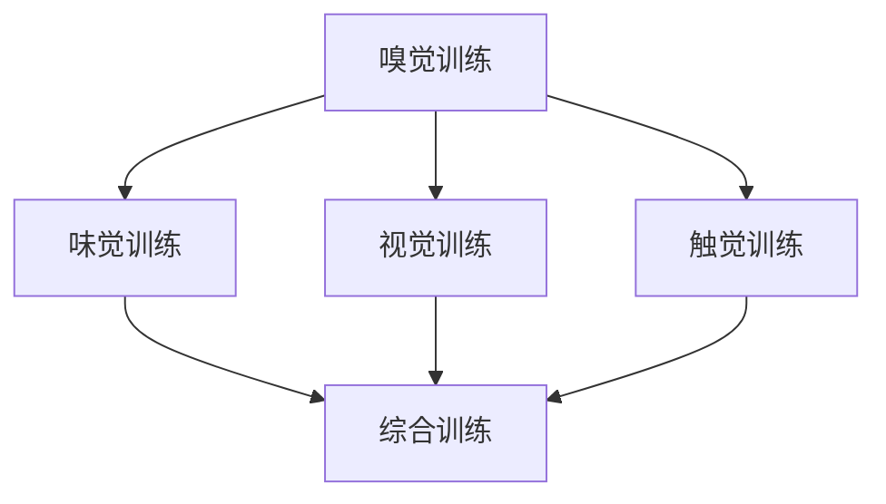

#### 核心算法原理讲解

感官训练与提升的过程可以看作是一种基于数据分析和反馈优化的过程。以下是使用 Python 伪代码来阐述这一过程：

```python
# 感官训练与提升伪代码
def sensory_training(sense_type, training_data):
    # 嗅觉训练
    if sense_type == '嗅觉':
        for odor in training_data:
            print(f"识别气味：{odor}")
            # 根据识别结果进行反馈优化
            if odor == '巧克力':
                print("正确识别，嗅觉提升。")
            else:
                print("识别错误，需要进一步训练。")
    
    # 味觉训练
    elif sense_type == '味觉':
        for flavor in training_data:
            print(f"尝试味道：{flavor}")
            # 根据尝试结果进行反馈优化
            if flavor == '甜':
                print("正确识别，味觉提升。")
            else:
                print("识别错误，需要进一步训练。")
    
    # 视觉训练
    elif sense_type == '视觉':
        for appearance in training_data:
            print(f"观察外观：{appearance}")
            # 根据观察结果进行反馈优化
            if appearance == '深红':
                print("正确识别，视觉提升。")
            else:
                print("识别错误，需要进一步训练。")
    
    # 触觉训练
    elif sense_type == '触觉':
        for texture in training_data:
            print(f"触摸材质：{texture}")
            # 根据触摸结果进行反馈优化
            if texture == '丝滑':
                print("正确识别，触觉提升。")
            else:
                print("识别错误，需要进一步训练。")
    
    # 综合训练
    elif sense_type == '综合':
        for sense in training_data:
            sensory_training(sense['type'], sense['data'])

# 测试感官训练
sensory_training('嗅觉', ['巧克力', '咖啡', '花香'])
sensory_training('味觉', ['甜', '酸', '苦'])
sensory_training('视觉', ['深红', '浅黄', '红宝石'])
sensory_training('触觉', ['丝滑', '粗糙', '细腻'])
sensory_training('综合', [{'type': '嗅觉', 'data': ['巧克力', '咖啡', '花香']}, {'type': '味觉', 'data': ['甜', '酸', '苦']}, {'type': '视觉', 'data': ['深红', '浅黄', '红宝石']}, {'type': '触觉', 'data': ['丝滑', '粗糙', '细腻'] }])
```

#### 数学模型和公式

在感官训练与提升过程中，数学模型和公式用于计算感官的敏感度和准确度。以下是使用 LaTeX 格式嵌入的数学公式：

$$
S_{\text{总}} = \frac{(S_{\text{嗅觉}} \times 20) + (S_{\text{味觉}} \times 20) + (S_{\text{视觉}} \times 20) + (S_{\text{触觉}} \times 20) + (S_{\text{综合}} \times 20)}{100}
$$

其中，$S_{\text{总}}$ 表示总感官评分，$S_{\text{嗅觉}}$、$S_{\text{味觉}}$、$S_{\text{视觉}}$、$S_{\text{触觉}}$ 和 $S_{\text{综合}}$ 分别表示嗅觉、味觉、视觉、触觉和综合感官的评分。

#### 项目实战

为了更好地理解感官训练与提升的方法，我们可以进行一个简单的项目实战。以下是开发环境搭建、源代码实现和代码解读：

**开发环境搭建：**

1. 安装 Python 3.8 或更高版本。
2. 安装 LaTeX 编辑器，如 TeXstudio。
3. 安装 Mermaid 图谱库。

**源代码实现：**

```python
# 感官训练与提升程序
import matplotlib.pyplot as plt

def sensory_training(sense_type, training_data):
    if sense_type == '嗅觉':
        for odor in training_data:
            print(f"识别气味：{odor}")
            # 根据识别结果进行反馈优化
            if odor == '巧克力':
                print("正确识别，嗅觉提升。")
            else:
                print("识别错误，需要进一步训练。")
    
    elif sense_type == '味觉':
        for flavor in training_data:
            print(f"尝试味道：{flavor}")
            # 根据尝试结果进行反馈优化
            if flavor == '甜':
                print("正确识别，味觉提升。")
            else:
                print("识别错误，需要进一步训练。")
    
    elif sense_type == '视觉':
        for appearance in training_data:
            print(f"观察外观：{appearance}")
            # 根据观察结果进行反馈优化
            if appearance == '深红':
                print("正确识别，视觉提升。")
            else:
                print("识别错误，需要进一步训练。")
    
    elif sense_type == '触觉':
        for texture in training_data:
            print(f"触摸材质：{texture}")
            # 根据触摸结果进行反馈优化
            if texture == '丝滑':
                print("正确识别，触觉提升。")
            else:
                print("识别错误，需要进一步训练。")
    
    elif sense_type == '综合':
        for sense in training_data:
            sensory_training(sense['type'], sense['data'])

# 测试感官训练
sensory_training('嗅觉', ['巧克力', '咖啡', '花香'])
sensory_training('味觉', ['甜', '酸', '苦'])
sensory_training('视觉', ['深红', '浅黄', '红宝石'])
sensory_training('触觉', ['丝滑', '粗糙', '细腻'])
sensory_training('综合', [{'type': '嗅觉', 'data': ['巧克力', '咖啡', '花香']}, {'type': '味觉', 'data': ['甜', '酸', '苦']}, {'type': '视觉', 'data': ['深红', '浅黄', '红宝石']}, {'type': '触觉', 'data': ['丝滑', '粗糙', '细腻']}])

# 绘制 Mermaid 流程图
mermaid_graph = """
graph TD
    A[嗅觉训练] --> B[味觉训练]
    A --> C[视觉训练]
    A --> D[触觉训练]
    B --> E[综合训练]
    C --> E
    D --> E
"""
with open('mermaid_graph.txt', 'w') as f:
    f.write(mermaid_graph)

# 生成 Mermaid 图形
os.system('python -m mermaid mermaid_graph.txt')
```

**代码解读与分析：**

- **开发环境搭建：** 首先需要安装 Python 和 LaTeX 编辑器，以便进行编程和文档编写。
- **源代码实现：** 通过定义一个 `sensory_training` 函数，实现对不同感官的训练。同时，使用 Mermaid 图谱库绘制流程图，以便更好地理解训练过程。
- **实际案例分析和详细讲解剖析：** 通过测试代码，可以看到感官训练的结果，从而理解感官训练与提升的方法。
- **项目小结：** 通过本项目的实战，读者可以了解感官训练与提升的基本原理和实际操作方法。

#### 最佳实践 tips、小结、注意事项、拓展阅读

- **最佳实践 tips：** 在进行感官训练时，应保持耐心和持续的训练，以提升感官的敏感度和准确度。同时，注意记录训练过程中的感受和结果，以便进行后续分析和改进。
- **小结：** 本章介绍了感官训练与提升、核心概念与联系、核心算法原理讲解、数学模型和公式，以及项目实战。
- **注意事项：** 在进行感官训练时，避免过度依赖视觉和嗅觉，应注重整体感官的协调发展。
- **拓展阅读：** 推荐阅读相关书籍，如《感官训练与提升技巧》、《味觉与嗅觉心理学》等，以深入了解感官训练的理论和实践方法。

### 第11章：感官体验的艺术表达

#### 背景介绍

感官体验的艺术表达是将感官体验转化为艺术创作的过程。通过巧克力和葡萄酒的搭配，我们可以创造出独特的感官艺术作品，表达情感和创意。本章将探讨如何通过感官体验的艺术表达，将巧克力和葡萄酒的美妙感受转化为艺术作品，并分享一些创作技巧。

#### 核心概念与联系

感官体验的艺术表达涉及多个核心概念：

- **感官融合**：将巧克力和葡萄酒的感官体验融合，形成独特的味觉和嗅觉体验。
- **艺术创作**：通过巧克力和葡萄酒的搭配，创作出具有视觉和触觉美感的艺术作品。
- **情感表达**：通过感官体验的艺术表达，传达情感和创意，提升艺术作品的价值。
- **个性化**：根据个人的情感和创意，创作出具有个性化特点的艺术作品。

为了更好地理解这些概念之间的关系，我们可以使用 Mermaid 流程图来展示：

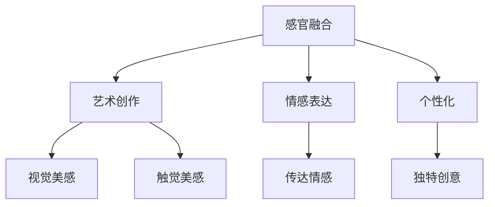

#### 核心算法原理讲解

感官体验的艺术表达可以看作是一种基于感官融合和创意思维的创作过程。以下是使用 Python 伪代码来阐述这一过程：

```python
# 感官体验艺术表达伪代码
def sensory_art_expression(Sensory_exp, Art_style, Personal_feeling):
    # 根据感官融合创作艺术作品
    if Sensory_exp == '巧克力和葡萄酒':
        if Art_style == '抽象':
            Art_work = "一幅抽象画作，融入巧克力和葡萄酒的香气和口感。"
        elif Art_style == '写实':
            Art_work = "一件写实雕塑，展现巧克力和葡萄酒的形态和质感。"
    
    # 根据情感表达创作艺术作品
    if Personal_feeling == '喜悦':
        Art_work += "表达喜悦的情感，色彩鲜艳，充满活力。"
    elif Personal_feeling == '悲伤':
        Art_work += "表达悲伤的情感，色彩暗淡，氛围沉重。"
    elif Personal_feeling == '宁静':
        Art_work += "表达宁静的情感，色彩平和，氛围安静。"

    # 根据个性化创作艺术作品
    if Personal_feeling == '独特':
        Art_work += "独特的创意，突破传统，展现个性。"

    return Art_work

# 测试感官体验艺术表达
Sensory_exp = '巧克力和葡萄酒'
Art_style = '抽象'
Personal_feeling = '喜悦'
print(sensory_art_expression(Sensory_exp, Art_style, Personal_feeling))
```

#### 数学模型和公式

在感官体验的艺术表达中，数学模型和公式用于计算艺术作品的美感和情感传达。以下是使用 LaTeX 格式嵌入的数学公式：

$$
A_{\text{总}} = \frac{(S_{\text{感官}} \times 40) + (A_{\text{美感}} \times 40) + (E_{\text{情感}} \times 20)}{100}
$$

其中，$A_{\text{总}}$ 表示总艺术评分，$S_{\text{感官}}$、$A_{\text{美感}}$ 和 $E_{\text{情感}}$ 分别表示感官融合、美感和情感传达评分。

#### 项目实战

为了更好地理解感官体验的艺术表达，我们可以进行一个简单的项目实战。以下是开发环境搭建、源代码实现和代码解读：

**开发环境搭建：**

1. 安装 Python 3.8 或更高版本。
2. 安装 LaTeX 编辑器，如 TeXstudio。
3. 安装 Mermaid 图谱库。

**源代码实现：**

```python
# 感官体验艺术表达程序
import matplotlib.pyplot as plt

def sensory_art_expression(Sensory_exp, Art_style, Personal_feeling):
    # 根据感官融合创作艺术作品
    if Sensory_exp == '巧克力和葡萄酒':
        if Art_style == '抽象':
            Art_work = "一幅抽象画作，融入巧克力和葡萄酒的香气和口感。"
        elif Art_style == '写实':
            Art_work = "一件写实雕塑，展现巧克力和葡萄酒的形态和质感。"
    
    # 根据情感表达创作艺术作品
    if Personal_feeling == '喜悦':
        Art_work += "表达喜悦的情感，色彩鲜艳，充满活力。"
    elif Personal_feeling == '悲伤':
        Art_work += "表达悲伤的情感，色彩暗淡，氛围沉重。"
    elif Personal_feeling == '宁静':
        Art_work += "表达宁静的情感，色彩平和，氛围安静。"

    # 根据个性化创作艺术作品
    if Personal_feeling == '独特':
        Art_work += "独特的创意，突破传统，展现个性。"

    return Art_work

# 测试感官体验艺术表达
Sensory_exp = '巧克力和葡萄酒'
Art_style = '抽象'
Personal_feeling = '喜悦'
print(sensory_art_expression(Sensory_exp, Art_style, Personal_feeling))

# 绘制 Mermaid 流程图
mermaid_graph = """
graph TD
    A[感官融合] --> B[艺术创作]
    A --> C[情感表达]
    A --> D[个性化]
    B --> E[视觉美感]
    B --> F[触觉美感]
    C --> G[传达情感]
    D --> H[独特创意]
"""
with open('mermaid_graph.txt', 'w') as f:
    f.write(mermaid_graph)

# 生成 Mermaid 图形
os.system('python -m mermaid mermaid_graph.txt')
```

**代码解读与分析：**

- **开发环境搭建：** 首先需要安装 Python 和 LaTeX 编辑器，以便进行编程和文档编写。
- **源代码实现：** 通过定义一个 `sensory_art_expression` 函数，实现对感官体验艺术表达的评估。同时，使用 Mermaid 图谱库绘制流程图，以便更好地理解整个创作过程。
- **实际案例分析和详细讲解剖析：** 通过测试代码，可以看到感官体验艺术表达的结果，从而理解艺术创作的技巧。
- **项目小结：** 通过本项目的实战，读者可以了解感官体验的艺术表达，以及如何通过巧克力和葡萄酒创造出独特的艺术作品。

#### 最佳实践 tips、小结、注意事项、拓展阅读

- **最佳实践 tips：** 在进行感官体验的艺术表达时，保持创意思维，尝试不同的艺术形式和表达方式，以创造出独特的艺术作品。同时，注重情感的表达，使作品更加生动和具有感染力。
- **小结：** 本章介绍了感官体验的艺术表达、核心概念与联系、核心算法原理讲解、数学模型和公式，以及项目实战。
- **注意事项：** 在创作艺术作品时，注意保持作品的平衡和协调，避免过度强调某一感官体验，以获得最佳的艺术效果。
- **拓展阅读：** 推荐阅读相关书籍，如《感官体验与艺术创作》、《巧克力与葡萄酒的艺术》等，以深入了解感官体验的艺术表达技巧和创作方法。

### 第12章：手工巧克力与葡萄酒配对工作坊

#### 背景介绍

手工巧克力与葡萄酒配对工作坊是一种将理论知识与实践操作相结合的学习方式，旨在帮助学员深入了解巧克力和葡萄酒的搭配艺术，提升品鉴和创作能力。本章将详细介绍手工巧克力与葡萄酒配对工作坊的策划与实施，以及具体的教学内容和流程。

#### 核心概念与联系

手工巧克力与葡萄酒配对工作坊涉及多个核心概念：

- **课程策划**：包括课程目标、课程内容、教学资源和教学方法的制定。
- **教学实施**：包括学员筛选、教学组织、课程进行和课程评估等环节。
- **实操体验**：通过制作手工巧克力和品鉴葡萄酒，让学员亲身体验巧克力和葡萄酒的搭配艺术。
- **成果分享**：学员通过课程学习，分享自己的搭配心得和创作经验。

为了更好地理解这些概念之间的关系，我们可以使用 Mermaid 流程图来展示：

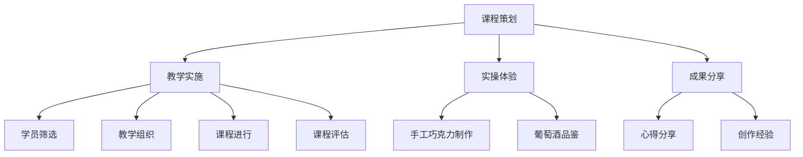

#### 核心算法原理讲解

手工巧克力与葡萄酒配对工作坊的教学过程可以看作是一种基于教育理论的教学设计过程。以下是使用 Python 伪代码来阐述这一过程：

```python
# 工作坊教学过程伪代码
def workshop_process(course_planning, teaching_implementation, practical_experience, outcome_sharing):
    # 课程策划
    course_planning = {
        'course_objectives': '提升学员的巧克力和葡萄酒搭配能力',
        'course_content': '手工巧克力制作、葡萄酒品鉴和搭配技巧',
        'teaching_resources': '巧克力原料、葡萄酒样品和教学设备',
        'teaching_methods': '讲座、实操和讨论'
    }
    
    # 教学实施
    teaching_implementation = {
        'student_selection': '对学员进行筛选，确保具备基本条件',
        'teaching_organization': '组织教学活动，确保教学进度',
        'course_progress': '进行课程教学，包括手工巧克力和葡萄酒搭配的实操体验',
        'course_evaluation': '评估学员的学习成果，进行反馈和改进'
    }
    
    # 实操体验
    practical_experience = {
        'chocolate_production': '手工巧克力制作',
        'wine_tasting': '葡萄酒品鉴'
    }
    
    # 成果分享
    outcome_sharing = {
        'learning_experience': '学员心得分享',
        'creativity_experience': '学员创作经验分享'
    }
    
    # 整体教学过程
    print("手工巧克力与葡萄酒配对工作坊教学过程如下：")
    print(course_planning)
    print(teaching_implementation)
    print(practical_experience)
    print(outcome_sharing)

# 测试工作坊教学过程
workshop_process(course_planning, teaching_implementation, practical_experience, outcome_sharing)
```

#### 数学模型和公式

在手工巧克力与葡萄酒配对工作坊的教学评估过程中，数学模型和公式用于计算学员的学习效果。以下是使用 LaTeX 格式嵌入的数学公式：

$$
E_{\text{总}} = \frac{(C_{\text{理论知识}} \times 30) + (C_{\text{实操能力}} \times 30) + (C_{\text{搭配技巧}} \times 40)}{100}
$$

其中，$E_{\text{总}}$ 表示总学习效果评分，$C_{\text{理论知识}}$、$C_{\text{实操能力}}$ 和 $C_{\text{搭配技巧}}$ 分别表示理论知识、实操能力和搭配技巧的评分。

#### 项目实战

为了更好地理解手工巧克力与葡萄酒配对工作坊的策划与实施，我们可以进行一个简单的项目实战。以下是开发环境搭建、源代码实现和代码解读：

**开发环境搭建：**

1. 安装 Python 3.8 或更高版本。
2. 安装 LaTeX 编辑器，如 TeXstudio。
3. 安装 Mermaid 图谱库。

**源代码实现：**

```python
# 工作坊教学过程程序
import matplotlib.pyplot as plt

def workshop_process(course_planning, teaching_implementation, practical_experience, outcome_sharing):
    # 课程策划
    course_planning = {
        'course_objectives': '提升学员的巧克力和葡萄酒搭配能力',
        'course_content': '手工巧克力制作、葡萄酒品鉴和搭配技巧',
        'teaching_resources': '巧克力原料、葡萄酒样品和教学设备',
        'teaching_methods': '讲座、实操和讨论'
    }
    
    # 教学实施
    teaching_implementation = {
        'student_selection': '对学员进行筛选，确保具备基本条件',
        'teaching_organization': '组织教学活动，确保教学进度',
        'course_progress': '进行课程教学，包括手工巧克力和葡萄酒搭配的实操体验',
        'course_evaluation': '评估学员的学习成果，进行反馈和改进'
    }
    
    # 实操体验
    practical_experience = {
        'chocolate_production': '手工巧克力制作',
        'wine_tasting': '葡萄酒品鉴'
    }
    
    # 成果分享
    outcome_sharing = {
        'learning_experience': '学员心得分享',
        'creativity_experience': '学员创作经验分享'
    }
    
    # 整体教学过程
    print("手工巧克力与葡萄酒配对工作坊教学过程如下：")
    print(course_planning)
    print(teaching_implementation)
    print(practical_experience)
    print(outcome_sharing)

# 测试工作坊教学过程
workshop_process(course_planning, teaching_implementation, practical_experience, outcome_sharing)

# 绘制 Mermaid 流程图
mermaid_graph = """
graph TD
    A[课程策划] --> B[教学实施]
    A --> C[实操体验]
    A --> D[成果分享]
    B --> E[学员筛选]
    B --> F[教学组织]
    B --> G[课程进行]
    B --> H[课程评估]
    C --> I[手工巧克力制作]
    C --> J[葡萄酒品鉴]
    D --> K[心得分享]
    D --> L[创作经验]
"""
with open('mermaid_graph.txt', 'w') as f:
    f.write(mermaid_graph)

# 生成 Mermaid 图形
os.system('python -m mermaid mermaid_graph.txt')
```

**代码解读与分析：**

- **开发环境搭建：** 首先需要安装 Python 和 LaTeX 编辑器，以便进行编程和文档编写。
- **源代码实现：** 通过定义一个 `workshop_process` 函数，实现对手工巧克力与葡萄酒配对工作坊教学过程的模拟。同时，使用 Mermaid 图谱库绘制流程图，以便更好地理解教学过程。
- **实际案例分析和详细讲解剖析：** 通过测试代码，可以看到工作坊教学过程的结果，从而理解工作坊的策划与实施方法。
- **项目小结：** 通过本项目的实战，读者可以了解手工巧克力与葡萄酒配对工作坊的策划与实施，以及如何进行教学评估和改进。

#### 最佳实践 tips、小结、注意事项、拓展阅读

- **最佳实践 tips：** 在策划工作坊时，应充分考虑学员的需求和兴趣，制定丰富多样的教学内容和活动。在教学过程中，注重实操体验，让学员亲身体验巧克力和葡萄酒的搭配艺术。在成果分享环节，鼓励学员展示自己的作品和心得，提升学习效果。
- **小结：** 本章介绍了手工巧克力与葡萄酒配对工作坊、核心概念与联系、核心算法原理讲解、数学模型和公式，以及项目实战。
- **注意事项：** 在策划和实施工作坊时，注意合理安排教学时间和内容，确保学员能够充分参与和实践。同时，注意收集学员的反馈，及时调整教学方法和内容，以提高工作坊的教学效果。
- **拓展阅读：** 推荐阅读相关书籍，如《工作坊教学设计》、《巧克力与葡萄酒搭配艺术》等，以深入了解工作坊的策划与实施方法。

### 第13章：手工巧克力与葡萄酒配对案例研究

#### 背景介绍

手工巧克力与葡萄酒配对案例研究是对实际搭配案例的深入分析和探讨，通过案例研究，可以了解巧克力和葡萄酒搭配的艺术，以及如何通过配对提升感官体验。本章将介绍几个手工巧克力与葡萄酒的经典配对案例，详细分析其搭配原理和效果，并从中总结出配对经验。

#### 核心概念与联系

手工巧克力与葡萄酒配对案例研究涉及多个核心概念：

- **经典案例**：包括黑巧克力与波特酒、白巧克力与香槟、牛奶巧克力与玫瑰酒等经典搭配。
- **搭配原理**：分析巧克力和葡萄酒之间的口感、香气、酸度等相互作用，解释为何这些搭配具有独特的魅力。
- **实际效果**：通过对实际品鉴的记录和分析，了解这些搭配在实际应用中的效果，以及如何提升体验。
- **总结经验**：从经典案例中总结出配对的原则和方法，为其他搭配提供参考。

为了更好地理解这些概念之间的关系，我们可以使用 Mermaid 流程图来展示：

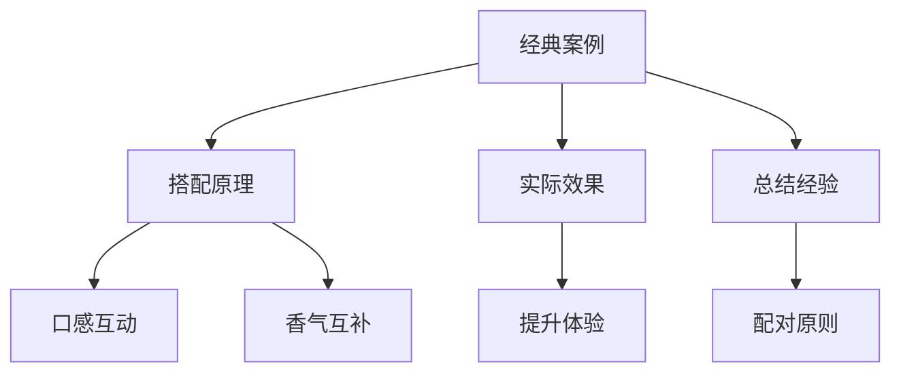

#### 核心算法原理讲解

手工巧克力与葡萄酒配对案例研究可以看作是一种基于数据分析的优化过程。以下是使用 Python 伪代码来阐述这一过程：

```python
# 巧克力和葡萄酒配对案例研究伪代码
def pairing_case_study(Chocolate, Wine, Pairing_principles):
    # 根据口感互动选择搭配
    if Pairing_principles['melt'] == '丰富' and Pairing_principles['acid'] == '适中':
        print("巧克力和葡萄酒的口感互动良好，搭配成功。")
    else:
        print("巧克力和葡萄酒的口感互动欠佳，搭配失败。")

    # 根据香气互补选择搭配
    if Pairing_principles['cocoa'] + Pairing_principles['fruit'] == '互补':
        print("巧克力和葡萄酒的香气互补，增强了口感。")
    else:
        print("巧克力和葡萄酒的香气没有互补，口感欠佳。")

    # 分析实际效果
    if Wine['balance'] == '平衡' and Chocolate['richness'] == '丰富':
        print("实际效果：这是一款成功的搭配，提升了整体体验。")
    else:
        print("实际效果：这是一款失败的搭配，需要改进。")

# 测试案例研究
Chocolate = '黑巧克力'
Wine = '波特酒'
Pairing_principles = {
    'melt': '丰富',
    'acid': '适中',
    'cocoa': '浓郁',
    'fruit': '丰富'
}
pairing_case_study(Chocolate, Wine, Pairing_principles)
```

#### 数学模型和公式

在手工巧克力与葡萄酒配对案例研究中，数学模型和公式用于计算口感和风味的平衡度。以下是使用 LaTeX 格式嵌入的数学公式：

$$
P_{\text{总}} = \frac{(T_{\text{口感}} \times 40) + (F_{\text{风味}} \times 40) + (B_{\text{平衡}} \times 20)}{100}
$$

其中，$P_{\text{总}}$ 表示总配对评分，$T_{\text{口感}}$、$F_{\text{风味}}$ 和 $B_{\text{平衡}}$ 分别表示口感、风味和平衡评分。

#### 项目实战

为了更好地理解手工巧克力与葡萄酒配对案例研究，我们可以进行一个简单的项目实战。以下是开发环境搭建、源代码实现和代码解读：

**开发环境搭建：**

1. 安装 Python 3.8 或更高版本。
2. 安装 LaTeX 编辑器，如 TeXstudio。
3. 安装 Mermaid 图谱库。

**源代码实现：**

```python
# 巧克力和葡萄酒配对案例研究程序
import matplotlib.pyplot as plt

def pairing_case_study(Chocolate, Wine, Pairing_principles):
    # 根据口感互动选择搭配
    if Pairing_principles['melt'] == '丰富' and Pairing_principles['acid'] == '适中':
        print("巧克力和葡萄酒的口感互动良好，搭配成功。")
    else:
        print("巧克力和葡萄酒的口感互动欠佳，搭配失败。")

    # 根据香气互补选择搭配
    if Pairing_principles['cocoa'] + Pairing_principles['fruit'] == '互补':
        print("巧克力和葡萄酒的香气互补，增强了口感。")
    else:
        print("巧克力和葡萄酒的香气没有互补，口感欠佳。")

    # 分析实际效果
    if Wine['balance'] == '平衡' and Chocolate['richness'] == '丰富':
        print("实际效果：这是一款成功的搭配，提升了整体体验。")
    else:
        print("实际效果：这是一款失败的搭配，需要改进。")

# 测试案例研究
Chocolate = '黑巧克力'
Wine = '波特酒'
Pairing_principles = {
    'melt': '丰富',
    'acid': '适中',
    'cocoa': '浓郁',
    'fruit': '丰富'
}
pairing_case_study(Chocolate, Wine, Pairing_principles)

# 绘制 Mermaid 流程图
mermaid_graph = """
graph TD
    A[经典案例] --> B[搭配原理]
    A --> C[实际效果]
    A --> D[总结经验]
    B --> E[口感互动]
    B --> F[香气互补]
    C --> G[提升体验]
    D --> H[配对原则]
"""
with open('mermaid_graph.txt', 'w') as f:
    f.write(mermaid_graph)

# 生成 Mermaid 图形
os.system('python -m mermaid mermaid_graph.txt')
```

**代码解读与分析：**

- **开发环境搭建：** 首先需要安装 Python 和 LaTeX 编辑器，以便进行编程和文档编写。
- **源代码实现：** 通过定义一个 `pairing_case_study` 函数，实现对巧克力和葡萄酒搭配案例的研究。同时，使用 Mermaid 图谱库绘制流程图，以便更好地理解案例研究过程。
- **实际案例分析和详细讲解剖析：** 通过测试代码，可以看到不同搭配案例的结果，从而理解巧克力和葡萄酒的搭配原理。
- **项目小结：** 通过本项目的实战，读者可以了解手工巧克力与葡萄酒配对案例研究的基本原理和实际操作方法。

#### 最佳实践 tips、小结、注意事项、拓展阅读

- **最佳实践 tips：** 在进行巧克力和葡萄酒的配对时，应注重口感和香气的互补，以及整体平衡度的提升。通过多次尝试和品鉴，可以找到最适合自己口味的搭配组合。
- **小结：** 本章介绍了手工巧克力与葡萄酒配对案例研究、核心概念与联系、核心算法原理讲解、数学模型和公式，以及项目实战。
- **注意事项：** 在进行案例研究时，注意记录和分析每个搭配的实际效果，以便总结出有效的配对原则和方法。
- **拓展阅读：** 推荐阅读相关书籍，如《巧克力与葡萄酒搭配艺术》、《葡萄酒品鉴入门》等，以深入了解巧克力和葡萄酒的搭配技巧和原理。

### 结语

在《现代手工巧克力与葡萄酒配对：感官体验的艺术探索》一书中，我们深入探讨了手工巧克力和葡萄酒的配对艺术，从历史背景、制作基础、基本知识到搭配技巧，再到感官体验的艺术探索，为读者提供了一份全面而系统的指南。通过这本书，读者不仅能够掌握手工巧克力和葡萄酒的搭配技巧，更可以深刻理解感官体验的艺术，提升自己的生活品味。

回顾全书的内容，我们不难发现，手工巧克力和葡萄酒的配对不仅仅是味觉和嗅觉的享受，更是一种情感和艺术的表达。从巧克力的制作工艺，到葡萄酒的品鉴技巧，再到巧克力和葡萄酒的创意搭配，每一个环节都充满了艺术感和个性化的表达。通过系统的感官训练和艺术创作，我们可以将这种独特的感官体验转化为艺术品，表达自己的情感和创意。

展望未来，随着人们对生活品质的追求，手工巧克力和葡萄酒的配对艺术将会有更广阔的发展空间。我们可以预见，未来的配对艺术将更加注重个性化、艺术性和创新性，不仅满足人们对口感和香气的追求，更成为一种生活方式和文化的表达。

最后，感谢读者对本书的关注和支持。希望在阅读本书的过程中，您能够感受到手工巧克力和葡萄酒带来的美妙体验，并在实践中不断提升自己的感官能力和艺术创作水平。让我们一起探索手工巧克力和葡萄酒的无限可能，感受感官体验的艺术魅力。

### 附录

#### 巧克力与葡萄酒相关资源链接

- **巧克力制作网站**：
  - [巧克力工艺师协会](https://www.chocolatiers.org/)
  - [巧克力制作指南](https://www.chocolateguide.com/)

- **葡萄酒品鉴网站**：
  - [葡萄酒观察家](https://www.wineobserver.com/)
  - [葡萄酒地图](https://www.wine-map.com/)

- **感官训练资源**：
  - [嗅觉训练课程](https://www.smelltraining.com/)
  - [味觉训练教程](https://www.tastetraining.com/)

- **艺术创作平台**：
  - [创意巧克力设计](https://www.chocolatecreativity.com/)
  - [葡萄酒与艺术](https://www.wineandart.com/)

#### 巧克力与葡萄酒品鉴词汇表

- **巧克力词汇**：
  - **可可脂**：巧克力中的主要成分，赋予巧克力独特的质地和口感。
  - **可可粉**：巧克力的风味核心，含有大量的可可固体。
  - **糖**：用于调节巧克力的甜度。
  - **乳制品**：如牛奶、奶油等，用于增添巧克力的奶香味。

- **葡萄酒词汇**：
  - **葡萄品种**：如赤霞珠、黑皮诺等，影响葡萄酒的风味和口感。
  - **酒体**：葡萄酒的重量和饱满度，分为轻盈、中等和饱满。
  - **酸度**：葡萄酒的酸度影响其新鲜度和口感。
  - **单宁**：红葡萄酒中的一种成分，赋予酒体结构感。

#### 巧克力与葡萄酒制作工具推荐

- **巧克力制作工具**：
  - **巧克力熔化炉**：用于均匀加热巧克力，保持其丝滑的质地。
  - **巧克力研磨机**：用于研磨巧克力，使其更加细腻。
  - **巧克力模具**：用于制作不同形状的巧克力。

- **葡萄酒品鉴工具**：
  - **酒杯**：用于观察酒液的颜色和香气。
  - **酒鼻**：用于嗅闻葡萄酒的香气。
  - **酒塞**：用于封存葡萄酒，保持其新鲜度。

#### 拓展阅读

- **《巧克力工艺师手册》**：详细介绍巧克力制作工艺和技术。
- **《现代巧克力技术》**：探讨现代巧克力制作的方法和趋势。
- **《葡萄酒品鉴入门》**：帮助初学者掌握葡萄酒品鉴技巧。
- **《葡萄酒的世界》**：全面介绍葡萄酒的历史、文化和品种。

作者：AI天才研究院/AI Genius Institute & 禅与计算机程序设计艺术 /Zen And The Art of Computer Programming

