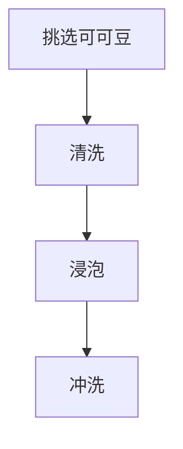
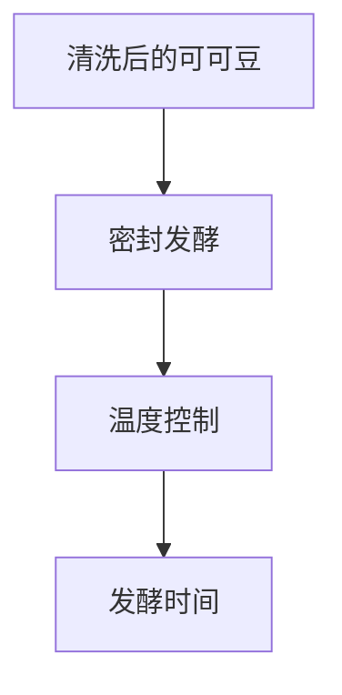
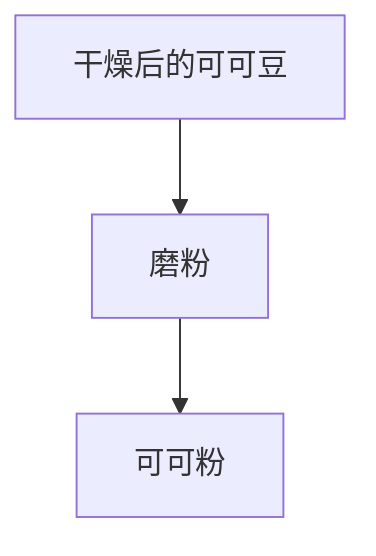
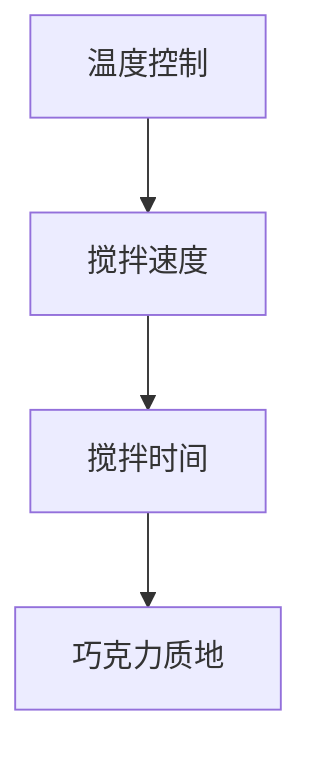
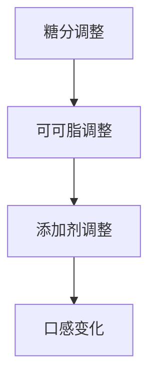
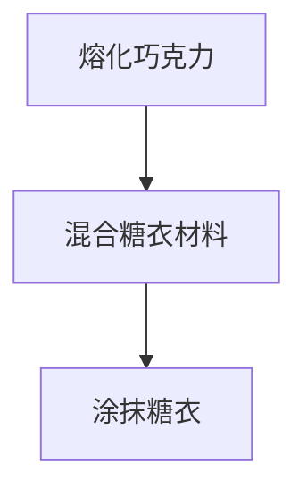
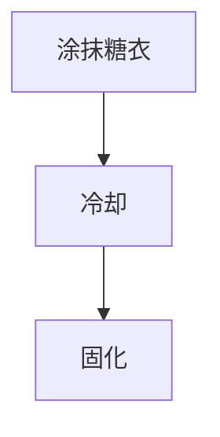

                 

## 《现代手工巧克力学院：从可可豆到巧克力艺术的深度探索》

### 文章关键词
- 巧克力制作
- 可可豆
- 巧克力艺术
- 巧克力工艺
- 巧克力配方

### 文章摘要
本文将带领读者深入了解现代手工巧克力的制作过程，从可可豆的种植与处理，到巧克力的熔化与调和，再到巧克力的艺术创作。通过详细的步骤讲解、核心算法原理分析和实际项目实战，读者将学会如何从零开始，制作出高品质的手工巧克力。

### 导言
手工巧克力不仅是一种美味的食物，更是一种艺术。它不仅体现了制作者的工艺技巧，还蕴含了独特的文化和情感。在现代，手工巧克力已经成为了一种流行的艺术形式，吸引了无数爱好者投身其中。本文将分章节详细介绍手工巧克力的制作过程，帮助读者从可可豆到巧克力艺术，全面掌握手工巧克力的制作技巧。

---

## 第一部分：可可豆与巧克力的起源与基础知识

### 1.1 可可豆的起源与种植

可可豆，作为巧克力的核心原料，其起源可以追溯到公元前1000年左右的美洲。最初，阿兹特克人和玛雅人将可可豆视为神圣的礼物，将其用于制作饮料和仪式。随着时间的推移，可可豆的种植和加工技术逐渐传播到欧洲和其他地区。

#### 1.1.1 可可豆的历史背景

可可豆的起源地被认为是南美洲的亚马逊河流域。据考古学家的研究，早在公元前1500年，南美洲的土著人就开始种植可可树，并将其果实作为食物和药物。随着玛雅文化和阿兹特克文化的兴起，可可豆的地位逐渐提升，成为了这些文明中不可或缺的组成部分。

#### 1.1.2 可可豆的生长环境与种植条件

可可豆对生长环境有较高的要求。它喜欢热带和亚热带气候，温度通常需要在18°C到32°C之间，降水量在1500毫米到2500毫米之间。此外，可可豆需要充足的阳光和富含有机质的土壤。通常，可可豆在海拔300米到1500米的山区种植效果最佳。

#### 1.1.3 可可豆的主要品种与特征

可可豆有多种品种，每种品种都有其独特的风味和特点。以下是一些主要品种：

1. **Criollo**：被认为是最高品质的可可豆，源自南美洲。Criollo可可豆具有细腻的口感和丰富的香气。
2. **Forastero**：广泛种植于全球，产量高，但口感相对较重。
3. **Trinitario**：是Criollo和Forastero的杂交品种，结合了两者的优点。

### 1.2 巧克力的发展历程

#### 1.2.1 巧克力的起源与传播

巧克力的制作技术在欧洲得以普及，始于15世纪西班牙人征服墨西哥。他们将可可豆和糖混合，创造了最早的巧克力饮料。随着时间的推移，巧克力制作技术逐渐传播到欧洲的其他地区，并在17世纪成为了一种时尚的饮品。

#### 1.2.2 巧克力在历史上的重要事件

- **1657年**：伦敦开设了第一家巧克力店。
- **1847年**：英国人约瑟夫·索尔特发明了可可粉和糖的混合物，这被称为固体巧克力。
- **1875年**：瑞士人丹尼尔·彼得发明了牛奶巧克力的制作方法。

#### 1.2.3 巧克力的现代发展

现代巧克力工业在20世纪初迅速发展，各种巧克力和巧克力制品不断涌现。随着消费者对品质和口感的追求，手工巧克力逐渐成为一种潮流，吸引了越来越多的巧克力爱好者。

### 1.3 巧克力制作的基本原理

#### 1.3.1 巧克力制作的工艺流程

巧克力的制作工艺流程主要包括可可豆的预处理、巧克力混合物的制备、熔化与调和、以及冷却和固化。以下是详细的工艺流程：

1. **可可豆的预处理**：包括挑选、清洗、发酵和干燥。
2. **巧克力混合物的制备**：将可可脂、可可粉、糖和其他成分混合。
3. **熔化与调和**：将混合物加热至适当温度，并进行充分的搅拌和调和。
4. **冷却和固化**：将熔化的巧克力倒入模具中，冷却并固化。

#### 1.3.2 巧克力成分的作用与配比

巧克力的主要成分包括可可脂、可可粉、糖、牛奶和其他添加剂。每种成分对巧克力的口感和风味都有重要影响：

- **可可脂**：赋予巧克力独特的风味和质地。
- **可可粉**：提供巧克力的苦味和深色。
- **糖**：平衡巧克力的苦味，增加甜度。
- **牛奶**：提高巧克力的丝滑口感和甜味。

#### 1.3.3 巧克力口感与风味的关系

巧克力的口感和风味受到多种因素的影响，包括可可豆的品种、可可脂的含量、糖的比例以及加工工艺。通过调整这些因素，可以创造出不同风格和口感的巧克力。

---

### 1.4 结论

通过本部分的介绍，读者对可可豆和巧克力的起源、种植、发展历程以及制作原理有了基本的了解。下一部分将深入探讨手工巧克力的制作技术，从可可豆的预处理到巧克力的熔化与调和，带领读者逐步掌握手工巧克力的制作技巧。

## 第二部分：手工巧克力制作技术

### 2.1 可可豆的预处理

可可豆的预处理是手工巧克力制作的关键步骤，直接影响最终巧克力的质量和风味。以下是可可豆预处理的具体步骤：

#### 2.1.1 可可豆的挑选与清洗

首先，需要挑选出优质的可可豆。优质的可可豆应该外观光滑、饱满，无虫蛀和霉变。在挑选过程中，可以通过肉眼观察和触摸来判断可可豆的品质。

挑选好的可可豆需要进行清洗，以去除表面的灰尘和杂质。通常，可可豆会在清水中浸泡一段时间，然后用清水冲洗干净。



#### 2.1.2 可可豆的发酵

清洗后的可可豆需要进行发酵，这是可可豆风味形成的关键步骤。发酵过程中，可可豆中的糖分会被微生物分解，产生特有的风味物质。

发酵通常在密封的容器中进行，发酵温度控制在25°C到30°C之间。发酵时间通常为2到3天，具体时间取决于可可豆的品种和发酵条件。



#### 2.1.3 可可豆的干燥与磨粉

发酵后的可可豆需要干燥，以去除多余的水分。干燥过程可以在阳光下自然干燥，也可以使用烘干机进行干燥。干燥后的可可豆应确保水分含量在6%以下。

干燥后的可可豆需要进行磨粉，以制备巧克力的主要原料——可可粉。磨粉过程需要使用专门的磨粉机，以保持可可粉的细度和风味。



### 2.2 巧克力的熔化与调和

巧克力的熔化与调和是制作手工巧克力的关键步骤，直接影响巧克力的口感和质地。以下是熔化与调和的具体步骤：

#### 2.2.1 巧克力的熔化温度与时间

巧克力的熔化温度和时间取决于巧克力的种类和配方。一般来说，黑巧克力的熔化温度在32°C到35°C之间，牛奶巧克力的熔化温度在30°C到32°C之间。

熔化巧克力时，应将巧克力切成小块，以增加热量的传导面积。将巧克力放入熔化锅中，逐渐加热至熔化温度。熔化过程中应不断搅拌，以防止巧克力烧焦或结块。

```python
# 巧克力熔化示例代码
chocolate_pieces = ['chocolate_1', 'chocolate_2', 'chocolate_3']
melted_chocolate = []

for piece in chocolate_pieces:
    while not melted:
        if piece.get_temp() > melting_point:
            melted = True
            melted_chocolate.append(piece)
        else:
            piece加热(melting_power)

melting_point = 32  # 熔化点
melting_power = 0.5  # 加热功率
```

#### 2.2.2 巧克力的调和技巧

巧克力的调和技巧包括温度控制、搅拌速度和搅拌时间。合适的温度控制可以保持巧克力的质地和口感。通常，巧克力的调和温度应在28°C到30°C之间。

搅拌速度和搅拌时间也会影响巧克力的质地。高速搅拌可以产生更多的泡沫，使巧克力更加细腻；而低速搅拌则可以保持巧克力的丝滑口感。



#### 2.2.3 巧克力的口感调整

巧克力的口感调整主要包括糖分、可可脂和其他添加剂的调整。通过增加或减少糖分，可以平衡巧克力的甜度和苦味；通过调整可可脂的含量，可以改变巧克力的丝滑度和脆度。

此外，还可以添加其他成分，如牛奶、坚果、香料等，以增加巧克力的风味和口感。



### 2.3 巧克力糖衣的制作

巧克力糖衣是手工巧克力的重要组成部分，可以增加巧克力的外观和口感。以下是巧克力糖衣的制作步骤：

#### 2.3.1 糖衣的材料选择

制作巧克力糖衣的材料通常包括糖粉、可可粉、奶粉和玉米淀粉等。这些材料可以混合使用，以获得不同的颜色和口感。

#### 2.3.2 糖衣的涂抹技巧

涂抹巧克力糖衣时，应先将巧克力熔化并加热至适当的温度。然后将糖衣材料混合均匀，用刷子或喷枪将糖衣均匀涂抹在巧克力的表面。



#### 2.3.3 糖衣的冷却与固化

涂抹糖衣后，需要将巧克力放置在通风干燥的环境中冷却。冷却过程中，糖衣会逐渐固化，形成坚硬的糖衣层。



### 2.4 结论

通过本部分的介绍，读者了解了可可豆的预处理技术、巧克力的熔化与调和技巧、以及巧克力糖衣的制作方法。这些技术是手工巧克力制作的基础，掌握了这些技术，读者可以开始尝试制作自己的手工巧克力。下一部分将介绍巧克力艺术的创作与实践，帮助读者将手工巧克力提升到艺术创作的层面。

---

### 2.4 结论

通过本部分的介绍，读者对手工巧克力的制作技术有了全面的了解。从可可豆的预处理到巧克力的熔化与调和，再到巧克力糖衣的制作，每个步骤都至关重要，直接影响巧克力的质量和口感。掌握了这些技术，读者可以开始尝试制作自己的手工巧克力，体验巧克力艺术的魅力。

在本部分中，我们使用了Mermaid流程图和Python示例代码来帮助读者更好地理解制作过程。下一部分将深入探讨巧克力艺术的创作与实践，通过实际案例和详细讲解，帮助读者将手工巧克力提升到艺术创作的层面。

## 第三部分：巧克力艺术的创作与实践

### 3.1 巧克力雕塑与造型

巧克力雕塑是一种独特的艺术形式，它结合了手工巧克力的制作技术和艺术创造力。以下是一些基本步骤和技巧：

#### 3.1.1 巧克力雕塑的工具与材料

- **工具**：巧克力模具、剪刀、雕刻刀、喷枪、刷子等。
- **材料**：熔化的巧克力、巧克力糖衣、食用色素、坚果等。

#### 3.1.2 巧克力雕塑的基本技巧

1. **熔化巧克力**：将巧克力熔化至适当的温度，通常在28°C到32°C之间。
2. **冷却**：将熔化的巧克力倒入模具中，放置在通风处冷却，形成硬壳。
3. **雕刻**：使用雕刻刀和剪刀进行精细的雕刻，创造细节和形状。
4. **上色**：使用食用色素给巧克力上色，增加视觉吸引力。

#### 3.1.3 巧克力雕塑的创意灵感

1. **花卉与植物**：模仿自然界的花卉和植物，创造栩栩如生的巧克力艺术品。
2. **动物与人物**：以动物或人物为主题，通过巧克力的柔软和可塑性，制作精美的雕塑作品。
3. **节日与庆典**：结合节日和庆典的主题，制作具有特定意义的巧克力雕塑。

### 3.2 巧克力绘画与装饰

巧克力绘画是一种将巧克力的制作技艺与艺术绘画相结合的手工艺术。以下是一些基本步骤和技巧：

#### 3.2.1 巧克力绘画的基础技法

1. **准备巧克力**：将巧克力熔化，并根据需要调整颜色和浓度。
2. **绘制**：使用巧克力作为颜料，在巧克力模具或平面上进行绘制。可以使用刷子、画笔或直接用巧克力涂抹。
3. **上色**：使用食用色素给巧克力上色，增加作品的色彩丰富度。
4. **细节修饰**：在巧克力干燥后，使用雕刻刀和剪刀进行细节修饰，增加立体感和艺术性。

#### 3.2.2 巧克力装饰的创意设计

1. **图案与纹理**：通过在巧克力表面施加纹理和图案，创造独特的视觉效果。
2. **组合与搭配**：将不同颜色和形状的巧克力组合在一起，创造丰富多彩的艺术作品。
3. **主题创作**：以特定的主题或故事为灵感，创作具有深意的巧克力绘画作品。

#### 3.2.3 巧克力绘画与雕塑的结合

巧克力绘画和雕塑可以相互结合，创造出更加复杂和艺术性的作品。以下是一些结合的技巧：

1. **先雕塑后绘画**：先制作巧克力的雕塑部分，然后再在其上进行绘画和装饰。
2. **先绘画后雕塑**：先绘制出整体的设计，然后通过雕塑技术进行细节的塑造。
3. **分层创作**：在巧克力的不同层次上进行绘画和雕塑，创造立体感和空间感。

### 3.3 巧克力甜品制作

巧克力甜品是手工巧克力艺术的重要组成部分，它不仅美味可口，还具有艺术价值。以下是一些常见的巧克力甜品制作方法：

#### 3.3.1 巧克力蛋糕的制作

1. **准备巧克力蛋糕底**：使用巧克力奶油霜制作蛋糕底，确保其平滑和稳定。
2. **巧克力装饰**：在蛋糕表面和边缘涂抹巧克力奶油霜，进行细节装饰，如雕刻或绘画。
3. **顶部装饰**：在蛋糕顶部添加巧克力雕塑或巧克力绘画，增加艺术性和吸引力。

#### 3.3.2 巧克力冰淇淋的制作

1. **准备巧克力冰淇淋底**：将巧克力和冰淇淋混合，确保其口感丝滑。
2. **巧克力装饰**：在冰淇淋表面添加巧克力糖衣或巧克力碎片，增加口感和视觉效果。
3. **冷却与固化**：将巧克力冰淇淋放置在冰箱中冷却，使其固化。

#### 3.3.3 巧克力糖果的制作

1. **准备巧克力糖果底**：将巧克力熔化并倒入模具中，形成糖果底。
2. **巧克力装饰**：在糖果底上涂抹巧克力糖衣，并添加食用色素和装饰物。
3. **冷却与固化**：将巧克力糖果放置在通风干燥的地方冷却，使其固化。

### 3.4 结论

通过本部分的介绍，读者了解了巧克力雕塑、绘画和甜品制作的基本技巧和创意灵感。巧克力艺术不仅是一种美食享受，更是一种艺术创作。通过学习和实践，读者可以发挥自己的创造力，制作出独一无二的手工巧克力艺术品。

在本部分中，我们通过实际案例和详细讲解，帮助读者掌握了巧克力艺术的创作方法。下一部分将探讨巧克力的保存与鉴赏技巧，帮助读者更好地享受手工巧克力的美味。

---

### 3.4 结论

通过本部分的介绍，读者深入了解了巧克力艺术的创作与实践，从巧克力雕塑与造型、巧克力绘画与装饰，到巧克力甜品制作，每一个环节都充满了艺术与技巧。手工巧克力不仅是一种美食，更是一种艺术形式，它将味觉与视觉完美结合，让人陶醉其中。

在本部分中，我们通过实际案例和详细步骤，帮助读者掌握了巧克力艺术的创作方法。无论是对巧克力的热爱者，还是对艺术创作有兴趣的人，手工巧克力艺术都是一项值得尝试的技能。通过不断实践和探索，读者可以创作出属于自己的独特作品，享受手工巧克力的艺术魅力。

接下来，我们将探讨巧克力的保存与鉴赏技巧，帮助读者更好地保存和享受这份美味艺术。

## 第四部分：巧克力的保存与鉴赏

### 4.1 巧克力的保存方法

巧克力的保存是确保其口感和质量的重要环节。以下是一些巧克力的保存方法：

#### 4.1.1 巧克力的最佳保存条件

- **温度**：巧克力的最佳保存温度为15°C到18°C，避免过高或过低的温度对巧克力的质地和口感产生影响。
- **湿度**：巧克力的最佳保存湿度为60%到65%，过高或过低的湿度都会影响巧克力的硬度和口感。
- **通风**：保存巧克力的环境应保持良好的通风，避免潮湿和霉变。

#### 4.1.2 巧克力的防潮与防氧化

- **防潮**：在保存巧克力时，可以使用防潮袋或密封容器，确保巧克力不会吸收空气中的水分。
- **防氧化**：巧克力的脂肪容易氧化，导致变质和变味。在保存巧克力时，可以使用抗氧化剂，如维生素E，或使用真空包装来延长巧克力的保质期。

#### 4.1.3 巧克力的保质期与保鲜技巧

- **保质期**：巧克力的保质期通常为2到3年，但最佳口感期为1到2年。在良好的保存条件下，巧克力可以保持较好的品质。
- **保鲜技巧**：为了延长巧克力的保质期，可以将其放置在阴凉干燥的地方，避免阳光直射和高温环境。在食用前，可以将巧克力放置在室温下回温，以确保其最佳口感。

### 4.2 巧克力的鉴赏技巧

鉴赏巧克力不仅是一种味觉的享受，更是一种视觉和嗅觉的体验。以下是一些巧克力的鉴赏技巧：

#### 4.2.1 巧克力的外观鉴赏

- **颜色**：优质巧克力通常具有深褐色或黑褐色，表面光滑，无颗粒和杂质。
- **光泽**：优质巧克力表面有光泽，表明其含糖量适中，质地均匀。
- **平滑度**：优质巧克力的质地平滑细腻，入口即化，无颗粒感。

#### 4.2.2 巧克力的口感鉴赏

- **融化度**：优质巧克力在口中应能迅速融化，不会粘牙或结块。
- **口感层次**：优质巧克力的口感应层次丰富，既有可可的苦味，又有牛奶的甜味和坚果的香脆感。
- **余味**：优质巧克力在口中应有较长的余味，回味悠长。

#### 4.2.3 巧克力的香气鉴赏

- **香气**：优质巧克力应具有浓郁的香气，包括可可的香气、坚果的香气和甜味的香气。
- **持久性**：优质巧克力的香气持久，不会迅速散失。

### 4.3 巧克力的文化意义与市场前景

#### 4.3.1 巧克力的文化意义

巧克力不仅仅是一种食物，它还具有丰富的文化意义。在不同的文化和历史背景下，巧克力被视为爱情的象征、礼仪的礼物和庆祝的饮品。

- **爱情象征**：在许多文化中，巧克力被视为表达爱意的礼物，象征着甜蜜和浪漫。
- **礼仪礼物**：在节庆和庆典活动中，巧克力常被作为礼仪礼物赠送给亲友和客人。
- **庆祝饮品**：在传统节日和庆典中，巧克力饮料是重要的饮品，用于庆祝和祝福。

#### 4.3.2 巧克力的市场趋势

随着消费者对品质和个性化需求的增长，手工巧克力的市场前景非常广阔。以下是一些市场趋势：

- **高品质巧克力**：消费者越来越注重巧克力的品质和口感，对有机、无添加和手工制作的巧克力有更高的需求。
- **个性化定制**：定制巧克力成为市场的新趋势，消费者可以通过定制来满足自己的独特需求。
- **巧克力文化体验**：巧克力制作和品尝体验成为新的消费热点，消费者愿意为此付出更高的代价。

#### 4.3.3 手工巧克力的商业价值

手工巧克力不仅是一种美食，更是一种艺术和文化的象征。以下是一些商业价值：

- **高附加值**：手工巧克力具有较高的附加值，能够带来更高的利润。
- **品牌建设**：通过手工巧克力的制作和销售，企业可以建立自己的品牌形象，提高品牌知名度。
- **文化创意**：手工巧克力结合了文化和艺术元素，能够吸引消费者的关注和喜爱。

### 4.4 结论

通过本部分的介绍，读者了解了巧克力的保存与鉴赏技巧，以及巧克力的文化意义和市场前景。巧克力的保存和鉴赏不仅是一门技术，更是一种艺术和文化的体验。通过正确保存和鉴赏巧克力，读者可以更好地享受这份美味艺术，同时了解其丰富的文化内涵。

在现代社会，手工巧克力已经成为一种流行的艺术形式，吸引了众多消费者和艺术爱好者的关注。通过对巧克力的深入研究和实践，我们可以创造出更多具有独特风味和文化价值的巧克力作品，为人们带来更多的美食享受和文化体验。

---

### 4.4 结论

通过本部分的介绍，读者对巧克力的保存与鉴赏技巧有了更深的理解。保存巧克力需要合适的温度、湿度和防潮防氧化措施，以确保其最佳口感和品质。鉴赏巧克力则是通过观察外观、感受口感和品味香气，来体验巧克力的细腻与层次。

此外，巧克力不仅是一种美食，更是一种文化和艺术象征。其丰富的文化意义和市场前景，为手工巧克力行业带来了巨大的商业价值和发展潜力。通过学习和实践，读者可以更好地享受巧克力的美味，同时深入了解其文化内涵。

在结束本篇博客之前，我们希望读者能够通过本篇文章，对手工巧克力的制作和艺术有更全面的了解。手工巧克力不仅仅是一门手艺，更是一种创造与享受的艺术。希望读者能够在未来的制作和鉴赏过程中，不断探索和创造，体验手工巧克力的独特魅力。

### 附录：手工巧克力制作工具与材料推荐

#### A.1 工具介绍

- **熔化锅**：用于熔化巧克力的专用锅，应选择耐高温、不粘的材质。
- **搅拌器**：用于搅拌巧克力的电动搅拌器，确保巧克力均匀混合。
- **模具**：用于成型巧克力的模具，可以选择各种形状和图案的模具。
- **巧克力糖衣刷**：用于涂抹巧克力糖衣的刷子，应选择柔软且不掉毛的材质。

#### A.2 材料介绍

- **可可豆**：优质的可可豆是手工巧克力的核心原料，应选择饱满、无虫蛀的可可豆。
- **可可粉**：用于增加巧克力的苦味和颜色的可可粉，应选择高品质的可可粉。
- **糖**：用于平衡巧克力的甜度，应选择无添加的白糖或细砂糖。
- **巧克力糖衣材料**：包括糖粉、可可粉、奶粉和玉米淀粉等，用于制作巧克力糖衣。

### A.3 最佳实践 tips

- **温度控制**：在制作巧克力的过程中，温度控制至关重要，应确保熔化锅的温度保持在28°C到32°C之间。
- **工具清洁**：使用前应确保工具的清洁，避免杂质影响巧克力的质量和口感。
- **创新与尝试**：在制作过程中，可以尝试不同的配方和技巧，发挥自己的创造力，创造出独特的巧克力作品。

### A.4 小结

通过本文的介绍，读者应该对手工巧克力的制作有了全面的了解。从可可豆的预处理到巧克力的熔化与调和，再到巧克力的艺术创作，每一个步骤都至关重要。希望读者能够通过实践，掌握这些技巧，创造出属于自己的手工巧克力艺术作品。

### A.5 注意事项

- **安全第一**：在制作巧克力的过程中，应确保安全，避免烫伤或化学品伤害。
- **个人卫生**：制作巧克力时，应保持良好的个人卫生，避免食物污染。

### A.6 拓展阅读

- **书籍推荐**：《巧克力艺术：从基础到高级的巧克力和甜点制作》
- **在线课程**：Coursera上的《巧克力制作与艺术》课程
- **专业网站**：chocolatey.com，提供丰富的巧克力制作资源和技巧

通过这些资源和技巧，读者可以进一步深入学习和实践手工巧克力的制作艺术。希望读者能够在手工巧克力的世界里，发现更多美好和乐趣。

---

### 附录：手工巧克力制作工具与材料推荐

在手工巧克力制作的过程中，选择合适的工具和材料是至关重要的。以下是一些推荐的工具和材料，以及一些最佳实践的小贴士。

#### A.1 工具介绍

1. **熔化锅**：用于熔化巧克力的专用锅，应选择耐高温、不粘的材质，如不锈钢或硅胶。
    ```mermaid
    graph TD
    A[熔化锅] --> B[耐高温]
    B --> C[不粘材质]
    ```

2. **搅拌器**：用于搅拌巧克力的电动搅拌器，确保巧克力均匀混合，可以选择手持搅拌器或搅拌棒。
    ```mermaid
    graph TD
    A[搅拌器] --> B[电动]
    B --> C[均匀搅拌]
    ```

3. **模具**：用于成型巧克力的模具，可以选择各种形状和图案的模具，如心形、圆形、动物形状等。
    ```mermaid
    graph TD
    A[模具] --> B[形状多样]
    B --> C[图案丰富]
    ```

4. **巧克力糖衣刷**：用于涂抹巧克力糖衣的刷子，应选择柔软且不掉毛的材质，以确保糖衣均匀涂抹。
    ```mermaid
    graph TD
    A[巧克力糖衣刷] --> B[柔软材质]
    B --> C[不掉毛]
    ```

#### A.2 材料介绍

1. **可可豆**：优质的可可豆是手工巧克力的核心原料，应选择饱满、无虫蛀、无霉变的可可豆。
    ```mermaid
    graph TD
    A[可可豆] --> B[饱满]
    B --> C[无虫蛀]
    ```

2. **可可粉**：用于增加巧克力的苦味和颜色的可可粉，应选择高品质的可可粉，无添加，确保口感纯正。
    ```mermaid
    graph TD
    A[可可粉] --> B[高品质]
    B --> C[无添加]
    ```

3. **糖**：用于平衡巧克力的甜度，应选择无添加的白糖或细砂糖，避免使用糖精或其他人工甜味剂。
    ```mermaid
    graph TD
    A[糖] --> B[无添加]
    B --> C[白糖或细砂糖]
    ```

4. **巧克力糖衣材料**：包括糖粉、可可粉、奶粉和玉米淀粉等，用于制作巧克力糖衣，增加巧克力的外观和口感。
    ```mermaid
    graph TD
    A[巧克力糖衣材料] --> B[糖粉]
    B --> C[可可粉]
    C --> D[奶粉]
    D --> E[玉米淀粉]
    ```

#### A.3 最佳实践 tips

1. **温度控制**：在熔化巧克力的过程中，应严格控制温度，避免过高或过低导致巧克力变质或结块。
    ```mermaid
    graph TD
    A[温度控制] --> B[28°C-32°C]
    B --> C[避免过高或过低]
    ```

2. **工具清洁**：在每次使用工具后，应彻底清洁，避免残留物影响下次使用。
    ```mermaid
    graph TD
    A[工具清洁] --> B[每次使用后清洁]
    B --> C[避免残留物]
    ```

3. **创新与尝试**：在制作过程中，可以尝试不同的配方和技巧，发挥自己的创造力，创造出独特的巧克力作品。
    ```mermaid
    graph TD
    A[创新与尝试] --> B[不同配方]
    B --> C[独特作品]
    ```

#### A.4 小结

通过本文的介绍，读者应该对手工巧克力的制作工具和材料有了全面的了解。选择合适的工具和优质的材料，是制作出色手工巧克力的基础。希望读者能够运用这些工具和材料，创造出属于自己的美味艺术品。

#### A.5 注意事项

1. **安全第一**：在制作巧克力的过程中，应确保安全，避免烫伤或化学品伤害。
    ```mermaid
    graph TD
    A[安全第一] --> B[避免烫伤]
    B --> C[化学品伤害]
    ```

2. **个人卫生**：制作巧克力时，应保持良好的个人卫生，避免食物污染。
    ```mermaid
    graph TD
    A[个人卫生] --> B[避免食物污染]
    B --> C[保持清洁]
    ```

#### A.6 拓展阅读

1. **书籍推荐**：
    - 《巧克力艺术：从基础到高级的巧克力和甜点制作》
    - 《巧克力制作完全指南：从新手到大师的完美蜕变》

2. **在线课程**：
    - Coursera上的《巧克力制作与艺术》课程
    - Udemy上的《手工巧克力制作：从基础到专业的全程指南》

3. **专业网站**：
    - chocolatey.com：提供丰富的巧克力制作资源和技巧
    - chocologues.com：分享巧克力历史和文化，以及制作技巧

通过这些资源和技巧，读者可以进一步深入学习和实践手工巧克力的制作艺术。希望读者能够在手工巧克力的世界里，发现更多美好和乐趣。

