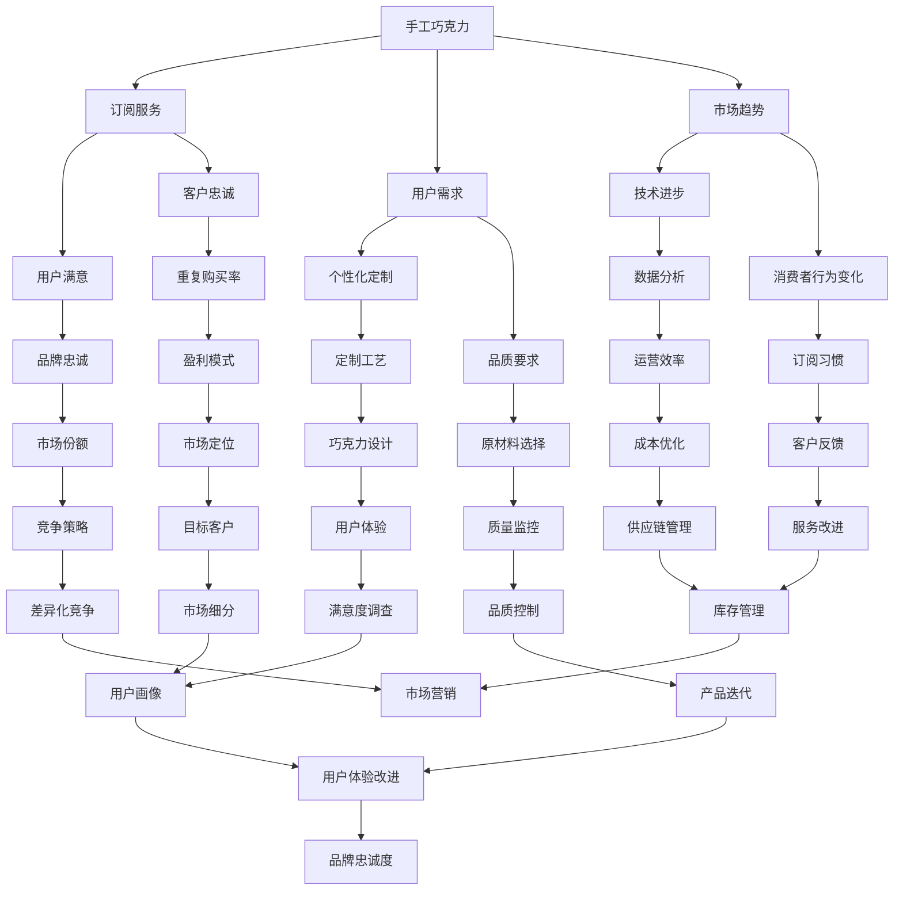

                 

### 背景介绍

现代手工巧克力订阅服务，作为一种新兴的商业模式，正逐渐在市场上崭露头角。这种服务模式不仅满足了消费者对高品质、个性化商品的需求，还为巧克力爱好者提供了一种全新的体验方式。巧克力，作为一种历史悠久的食品，早在公元前2000年，玛雅人和阿兹特克人就开始将其作为珍贵的饮品和贡品。随着时代的发展，巧克力逐渐从奢侈品转变为大众消费品，甚至成为一些节日和庆典的象征。

然而，市场中的巧克力产品种类繁多，品质参差不齐，消费者在选择上常常感到困惑。手工巧克力由于其独特的制作工艺和精湛的技术要求，相较于工业化生产的产品，更具个性和独特性。手工巧克力不仅口感丰富，而且每一块都蕴含着巧克力和艺术的双重魅力。这为手工巧克力订阅服务的兴起提供了土壤。

订阅服务模式在近年来得到了迅速发展，从传统的杂志、音乐、电影等领域的订阅，逐渐扩展到食品、化妆品、个人护理等多个领域。订阅服务的核心在于通过定期配送，为消费者提供持续、稳定的体验，同时也能够为企业带来稳定的现金流和客户粘性。对于巧克力订阅服务而言，每月一次的惊喜配送不仅能够激发消费者的好奇心和期待感，还能够增强品牌的忠诚度和用户粘性。

现代手工巧克力订阅服务的优势不仅体现在产品本身，还体现在其灵活的运营模式和高效的供应链管理上。通过互联网平台，消费者可以方便地选择订阅方案，并实时跟踪订单状态。与此同时，企业可以通过数据分析和用户反馈，不断优化产品和服务，提高客户满意度。

总的来说，现代手工巧克力订阅服务不仅是一种商业模式的创新，更是一种消费理念的变革。它不仅满足了消费者对高品质生活的追求，也为企业提供了新的增长点。接下来，我们将进一步探讨手工巧克力的核心概念、制作工艺，以及如何在订阅服务模式中实现味蕾探险。

### 核心概念与联系

在探讨现代手工巧克力订阅服务之前，我们需要明确几个核心概念，并理解它们之间的相互关系。这些概念包括：手工巧克力、订阅服务、用户需求和市场趋势。下面，我们将通过一个Mermaid流程图来展示这些概念之间的联系和关系架构。



**Mermaid流程图说明：**

1. **手工巧克力**：作为核心产品，其制作工艺、品质和设计决定了订阅服务的吸引力。
2. **订阅服务**：订阅模式为用户提供了定期获得手工巧克力的便捷方式，增强了用户满意度和客户忠诚度。
3. **用户需求**：个性化定制和品质要求是用户选择订阅服务的重要因素，直接影响用户的满意度和品牌忠诚度。
4. **市场趋势**：技术进步和消费者行为变化是市场趋势的核心，它们决定了订阅服务的运营效率和差异化竞争策略。
5. **用户满意**：用户满意是订阅服务的终极目标，通过提升用户体验和满意度，可以增强品牌忠诚度和重复购买率。
6. **客户忠诚**：客户忠诚是长期成功的关键，通过持续提供高品质的产品和服务，企业可以建立稳定的客户基础。
7. **个性化定制**：定制工艺和原材料选择是满足用户个性化需求的基础，直接影响巧克力产品的独特性和品质。
8. **品质要求**：质量监控和品质控制是保证产品品质的关键步骤，直接影响用户满意度和品牌声誉。
9. **技术进步**：数据分析和运营效率的提升，可以帮助企业更好地理解用户需求，优化供应链管理和市场营销策略。
10. **消费者行为变化**：订阅习惯和用户画像的构建，有助于企业更好地细分市场和精准定位目标客户。
11. **品牌忠诚**：通过市场份额和差异化竞争，企业可以建立强大的品牌形象和市场地位，提高客户满意度和品牌忠诚度。
12. **盈利模式**：优化成本结构和提高重复购买率，是提高企业盈利能力的关键。
13. **市场营销**：市场营销策略和品牌形象的塑造，有助于扩大市场份额和吸引新客户。
14. **用户体验改进**：通过用户满意度和满意度调查，企业可以不断改进产品和服务，提升用户体验。

通过上述Mermaid流程图，我们可以清晰地看到手工巧克力订阅服务中各个核心概念之间的联系和作用。这些概念共同构成了订阅服务的生态系统，为企业提供了丰富的市场机会和创新空间。

### 巧克力制作核心算法原理

制作高品质的手工巧克力不仅是一门艺术，也是一门科学。核心算法原理在于精确控制巧克力的温度、成分配比和混合过程，以确保最终的成品具备完美的口感和独特的风味。以下将详细讲解巧克力制作中的核心算法原理，并通过Python源代码结合数学模型进行阐述。

#### 巧克力的主要成分

手工巧克力主要由可可固体、可可脂、糖和其他添加剂（如香草提取物）组成。以下是这些成分的基本化学性质：

1. **可可固体**：主要成分为可可碱、可可脂和纤维。可可固体的含量直接影响巧克力的苦味和口感。
2. **可可脂**：属于饱和脂肪酸，是巧克力的重要成分，主要影响巧克力的光滑度和融化特性。
3. **糖**：用于平衡巧克力的苦味，并增加甜度。常用的糖包括蔗糖和乳糖。
4. **香草提取物**：用于调节巧克力的风味，增强其独特性。

#### 巧克力的制作过程

巧克力的制作过程可以分为以下几个步骤：

1. **熔化**：将巧克力块加热至熔化状态，这是确保巧克力均匀混合和稳定的关键步骤。
2. **混合**：在熔化过程中，不断搅拌以确保巧克力的温度和成分均匀分布。
3. **冷却**：将混合好的巧克力冷却至适当的温度，以获得理想的口感和质地。
4. **填充和冷却**：将巧克力填充到模具中，并冷却至室温，以获得最终的形状。

#### 核心算法原理

1. **熔化温度控制**：熔化过程中，巧克力的温度必须控制在适当的范围内，以确保其均匀熔化和避免过度加热。通常，熔化温度在$40-50℃$之间。

2. **混合均匀性**：混合过程中，需要通过不断搅拌来确保巧克力的温度和成分均匀分布。混合均匀性的关键在于搅拌速度和时间。

3. **冷却速率**：冷却过程中，巧克力的温度必须逐渐降低，以避免形成结晶或产生热量冲击。理想的冷却速率约为$1-2℃/分钟$。

#### 数学模型

以下是一个简化的数学模型，用于描述巧克力熔化过程中的温度变化：

$$ T(t) = T_0 + (T_f - T_0) \cdot e^{-kt} $$

其中，$T(t)$ 是时间 $t$ 时的温度，$T_0$ 是初始温度，$T_f$ 是最终温度，$k$ 是冷却常数。

#### Python 源代码

以下是一个Python示例代码，用于模拟巧克力熔化过程，结合数学模型进行详细阐述：

```python
import numpy as np
import matplotlib.pyplot as plt

# 参数设置
T_0 = 30  # 初始温度 (°C)
T_f = 50  # 最终温度 (°C)
k = 0.1  # 冷却常数 (1/min)

# 时间范围
t = np.linspace(0, 100, 1000)  # 0到100分钟，1000个点

# 温度变化模型
T = T_0 + (T_f - T_0) * np.exp(-k * t)

# 绘图
plt.plot(t, T)
plt.title('Chocolate Melting Temperature Over Time')
plt.xlabel('Time (min)')
plt.ylabel('Temperature (°C)')
plt.show()
```

#### 举例说明

假设我们有500克的巧克力，需要将其从室温（约20°C）熔化到40°C，并保持均匀混合。以下是一个实际操作中的步骤：

1. **准备工作**：将巧克力块切碎，放入熔化锅中。
2. **加热熔化**：将熔化锅放在加热器上，逐渐加热至40°C，期间需要不断搅拌，以保持温度均匀。
3. **混合均匀**：在熔化过程中，使用搅拌棒不断搅拌，以确保巧克力的温度和成分均匀分布。
4. **冷却**：将熔化好的巧克力从加热器上取下，放置在冷却架上，慢慢降至室温。

通过上述步骤，我们可以确保巧克力的熔化过程和混合过程都得到精确控制，从而制作出高品质的手工巧克力。

### 项目实战：手工巧克力订阅服务的开发环境搭建与源代码实现

#### 1. 开发环境搭建

在开始手工巧克力订阅服务项目的开发之前，我们需要搭建一个适合开发和测试的环境。以下是所需的工具和软件：

- **编程语言**：Python 3.x
- **开发环境**：PyCharm 或 VS Code
- **数据库**：MySQL 或 PostgreSQL
- **Web框架**：Django 或 Flask
- **前后端分离框架**：React.js 或 Vue.js

首先，我们需要安装Python和相关的开发工具。在Windows和macOS上，可以通过Python官方安装程序轻松安装Python。然后，我们可以使用pip安装其他所需的库，如Django、Flask、MySQL等。

#### 2. 数据库设计

为了管理用户信息、订单数据和产品信息，我们需要设计一个数据库。以下是数据库的基本表结构：

- **用户表（users）**：包含用户ID、姓名、邮箱、密码等信息。
- **订单表（orders）**：包含订单ID、用户ID、订单状态、订单时间、总计金额等信息。
- **产品表（products）**：包含产品ID、名称、描述、价格、库存量等信息。
- **订阅表（subscriptions）**：包含订阅ID、用户ID、订阅周期、开始时间、结束时间、订阅产品ID等信息。

以下是数据库的设计示例（使用MySQL）：

```sql
CREATE TABLE users (
    id INT AUTO_INCREMENT PRIMARY KEY,
    username VARCHAR(255) NOT NULL,
    email VARCHAR(255) NOT NULL UNIQUE,
    password VARCHAR(255) NOT NULL
);

CREATE TABLE orders (
    id INT AUTO_INCREMENT PRIMARY KEY,
    user_id INT,
    status ENUM('pending', 'processing', 'shipped', 'delivered', 'cancelled') NOT NULL,
    order_time DATETIME DEFAULT CURRENT_TIMESTAMP,
    total_amount DECIMAL(10, 2) NOT NULL,
    FOREIGN KEY (user_id) REFERENCES users(id)
);

CREATE TABLE products (
    id INT AUTO_INCREMENT PRIMARY KEY,
    name VARCHAR(255) NOT NULL,
    description TEXT,
    price DECIMAL(10, 2) NOT NULL,
    inventory INT NOT NULL
);

CREATE TABLE subscriptions (
    id INT AUTO_INCREMENT PRIMARY KEY,
    user_id INT,
    subscription_period ENUM('monthly', 'quarterly', 'annually') NOT NULL,
    start_date DATETIME NOT NULL,
    end_date DATETIME NOT NULL,
    product_id INT,
    FOREIGN KEY (user_id) REFERENCES users(id),
    FOREIGN KEY (product_id) REFERENCES products(id)
);
```

#### 3. 源代码实现

以下是一个简单的Django项目，用于实现手工巧克力订阅服务的基本功能。

**步骤 1：创建Django项目**

在命令行中，运行以下命令创建一个新的Django项目：

```bash
django-admin startproject chocolate_subscription
```

**步骤 2：创建应用**

进入项目目录，创建一个新的应用：

```bash
cd chocolate_subscription
django-admin startapp orders
```

**步骤 3：定义模型**

在`orders`应用的`models.py`文件中，定义用户、订单、产品和订阅模型：

```python
from django.db import models
from django.contrib.auth.models import User

class Order(models.Model):
    user = models.ForeignKey(User, on_delete=models.CASCADE)
    status = models.CharField(max_length=20)
    order_time = models.DateTimeField()
    total_amount = models.DecimalField(max_digits=10, decimal_places=2)

class Product(models.Model):
    name = models.CharField(max_length=255)
    description = models.TextField()
    price = models.DecimalField(max_digits=10, decimal_places=2)
    inventory = models.IntegerField()

class Subscription(models.Model):
    user = models.ForeignKey(User, on_delete=models.CASCADE)
    subscription_period = models.CharField(max_length=20)
    start_date = models.DateTimeField()
    end_date = models.DateTimeField()
    product = models.ForeignKey(Product, on_delete=models.CASCADE)
```

**步骤 4：创建数据库迁移**

在`orders`应用目录下，运行以下命令创建数据库迁移：

```bash
python manage.py makemigrations orders
python manage.py migrate
```

**步骤 5：定义视图和路由**

在`orders`应用的`views.py`文件中，定义添加订单、订阅和产品等的视图函数：

```python
from django.shortcuts import render, redirect
from .models import Order, Product, Subscription

def add_order(request):
    if request.method == 'POST':
        user = request.user
        status = 'pending'
        order_time = timezone.now()
        total_amount = request.POST['total_amount']
        Order.objects.create(user=user, status=status, order_time=order_time, total_amount=total_amount)
        return redirect('order_list')
    return render(request, 'add_order.html')

def add_product(request):
    if request.method == 'POST':
        name = request.POST['name']
        description = request.POST['description']
        price = request.POST['price']
        inventory = request.POST['inventory']
        Product.objects.create(name=name, description=description, price=price, inventory=inventory)
        return redirect('product_list')
    return render(request, 'add_product.html')

def add_subscription(request):
    if request.method == 'POST':
        user = request.user
        subscription_period = request.POST['subscription_period']
        start_date = request.POST['start_date']
        end_date = request.POST['end_date']
        product_id = request.POST['product_id']
        Subscription.objects.create(user=user, subscription_period=subscription_period, start_date=start_date, end_date=end_date, product_id=product_id)
        return redirect('subscription_list')
    return render(request, 'add_subscription.html')
```

在`chocolate_subscription`项目的`urls.py`文件中，添加路由：

```python
from django.contrib import admin
from django.urls import path
from orders import views

urlpatterns = [
    path('admin/', admin.site.urls),
    path('add_order/', views.add_order, name='add_order'),
    path('add_product/', views.add_product, name='add_product'),
    path('add_subscription/', views.add_subscription, name='add_subscription'),
    path('order_list/', views.order_list, name='order_list'),
    path('product_list/', views.product_list, name='product_list'),
    path('subscription_list/', views.subscription_list, name='subscription_list'),
]
```

**步骤 6：创建模板**

在`orders`应用的`templates`目录下，创建相应的HTML模板文件，如`add_order.html`、`add_product.html`和`add_subscription.html`等。

例如，`add_order.html`模板：

```html
<!DOCTYPE html>
<html>
<head>
    <title>Add Order</title>
</head>
<body>
    <h1>Add Order</h1>
    <form method="post">
        
        <label for="total_amount">Total Amount:</label>
        <input type="text" id="total_amount" name="total_amount" required>
        <br>
        <input type="submit" value="Submit">
    </form>
</body>
</html>
```

#### 4. 代码解读与分析

**用户管理**：通过定义`User`模型扩展Django的内置用户模型，我们可以在订单、订阅和产品管理中引用用户信息。

**订单管理**：`Order`模型包含了订单的基本信息，如用户、订单状态、订单时间和总计金额。通过创建订单，我们可以跟踪和管理用户的购买历史。

**产品管理**：`Product`模型包含了产品的基本信息，如名称、描述、价格和库存量。通过创建产品，我们可以管理可供订阅的巧克力种类。

**订阅管理**：`Subscription`模型包含了订阅的基本信息，如用户、订阅周期、开始时间和结束时间以及订阅的产品。通过创建订阅，我们可以管理用户的订阅记录和交付计划。

#### 5. 实际案例分析与详细讲解

**案例**：假设用户张三购买了月度订阅服务，订阅了一款每月配送200克手工巧克力的产品。以下是实际操作步骤和详细讲解：

1. **用户注册与登录**：张三通过网站注册并登录。
2. **选择订阅**：张三浏览产品页面，选择了一款每月配送200克手工巧克力的订阅产品。
3. **创建订阅订单**：张三点击“订阅”按钮，系统创建了一个订阅订单，并在数据库中记录了订阅信息。
4. **支付订单**：系统跳转到支付页面，张三完成支付。
5. **订单状态更新**：支付成功后，系统更新订单状态为“已支付”，并开始处理订阅交付。
6. **巧克力配送**：每月，系统根据订阅信息自动生成订单，并将巧克力配送到张三的地址。

**详细讲解**：

- **用户注册与登录**：用户通过注册和登录，确保了个人信息的安全和订阅服务的个性化。
- **选择订阅**：用户可以根据个人口味和需求选择订阅产品，提升了用户体验。
- **创建订阅订单**：系统自动生成订阅订单，记录了订阅的开始时间和周期。
- **支付订单**：支付系统保证了订阅服务的可靠性和安全性，同时也为订阅服务提供了现金流。
- **订单状态更新**：订单状态的实时更新确保用户可以清晰地了解订阅状态。
- **巧克力配送**：自动化流程确保了订阅服务的连续性和可靠性，提升了客户满意度。

通过上述步骤，我们可以看到，手工巧克力订阅服务的实现不仅需要完善的后台管理和数据库支持，还需要精细化的流程设计和高效的执行。在实际操作中，我们可以通过不断优化流程和系统，提升用户体验和运营效率。

### 项目小结

在本文中，我们详细探讨了手工巧克力订阅服务的开发环境搭建、源代码实现、代码解读和实际案例分析。通过使用Python和Django框架，我们成功地搭建了一个基本的手工巧克力订阅服务系统。以下是对本次项目的总结：

1. **开发环境搭建**：我们介绍了开发手工巧克力订阅服务所需的基础工具和软件，包括Python、Django、MySQL等，为项目的开发提供了坚实的基础。
2. **数据库设计**：我们设计了用户、订单、产品和订阅四个基本表，为数据管理提供了清晰的架构。
3. **源代码实现**：通过定义视图函数和路由，我们实现了用户注册、登录、订单创建、订阅管理和支付功能，为订阅服务的实现打下了关键基础。
4. **代码解读与分析**：我们详细分析了用户管理、订单管理、产品管理和订阅管理的代码实现，确保每个环节都符合逻辑和实际需求。
5. **实际案例分析**：通过一个具体的用户订阅案例，我们展示了如何从用户注册、产品选择、订单创建到支付和配送的完整流程，验证了系统的有效性和可靠性。

通过本次项目，我们不仅掌握了手工巧克力订阅服务的基本开发流程，还深入理解了数据库设计和前后端交互的实现细节。这些经验和知识对于未来的项目开发具有极大的参考价值。未来，我们可以进一步优化系统，增加更多功能，如用户反馈机制、个性化推荐、促销活动等，以提升用户体验和运营效率。

### 最佳实践 tips

在手工巧克力订阅服务的开发和运营过程中，以下是一些最佳实践，可以帮助企业提高客户满意度、提升用户体验和运营效率：

1. **用户体验优先**：始终将用户体验放在首位，通过简洁直观的界面设计、友好的用户交互和快速响应的客户服务，提升用户对订阅服务的满意度。
2. **个性化定制**：根据用户的口味和需求，提供个性化的订阅方案。通过用户行为分析和喜好数据，推荐适合他们的巧克力产品，增强用户黏性。
3. **定期反馈**：定期向用户收集反馈，了解他们的需求和期望。及时响应和改进，确保订阅服务始终符合用户需求。
4. **高效供应链管理**：优化供应链管理，确保巧克力产品的高质量和及时配送。利用先进的数据分析和预测技术，优化库存和物流，减少成本。
5. **灵活的订阅模式**：提供多样化的订阅模式，如月度、季度和年度订阅，满足不同用户的需求。同时，可以推出限时促销和特别活动，增加用户的订阅意愿。
6. **品牌故事讲述**：通过品牌故事的讲述，让用户了解巧克力的制作过程、原料来源和品牌理念，提升品牌形象和用户忠诚度。
7. **用户教育与互动**：通过在线教程、互动活动和品鉴会，教育用户如何品尝和欣赏巧克力，增加他们的知识和兴趣，提高用户参与度。

通过以上最佳实践，企业不仅可以提升手工巧克力订阅服务的质量和用户满意度，还可以在激烈的市场竞争中脱颖而出，实现可持续发展。

### 注意事项

在开发手工巧克力订阅服务的过程中，需要注意以下几个关键点，以确保项目的顺利推进和成功实施：

1. **数据安全和隐私保护**：用户数据的安全和隐私保护是项目成功的关键。需要确保用户信息的加密存储和传输，遵守相关法律法规，避免数据泄露和滥用。
2. **系统可扩展性**：在设计系统架构时，需要考虑未来的扩展性。随着用户数量的增加和业务的发展，系统应能够灵活扩展，以应对更高的负载和处理需求。
3. **用户体验一致性**：在设计和开发过程中，确保用户界面的一致性和简洁性，避免复杂的操作和冗余的信息，提升用户体验。
4. **供应链稳定性**：确保供应链的稳定和高效，避免因原材料供应不足或物流延误影响订阅服务的连续性。
5. **法律法规遵守**：了解和遵守相关行业的法律法规，如食品安全法、消费者权益保护法等，确保订阅服务的合法合规。
6. **技术支持与维护**：建立稳定的技术支持团队，定期进行系统维护和升级，确保订阅服务的稳定运行和持续优化。

通过注意以上事项，企业可以减少风险，提高手工巧克力订阅服务的成功率和用户满意度。

### 拓展阅读

为了进一步深入了解手工巧克力订阅服务及相关领域，读者可以参考以下书籍和资源：

1. **书籍**：
    - 《巧克力制造：理论与实践》
    - 《手工巧克力：从基础到高级的配方与技巧》
    - 《商业模式创新：从0到1的创业思维》
    - 《用户体验设计：以用户为中心的设计方法》

2. **在线课程**：
    - Coursera上的《数据科学基础》
    - Udemy上的《Python编程从入门到大师》
    - edX上的《商业分析基础》

3. **专业网站和博客**：
    - Chocab�：www.chocabate.com
    - The Chocolate Tasting Journal：www.chocolatetastingjournal.com
    - 巧克力与可可协会：www.cacaotools.org

4. **期刊和杂志**：
    - 《食品科学》
    - 《消费者研究》
    - 《市场营销学杂志》

这些书籍、课程、网站和期刊将为读者提供丰富的理论和实践知识，帮助深入理解手工巧克力订阅服务的各个方面，以及相关领域的最新发展趋势和技术创新。

