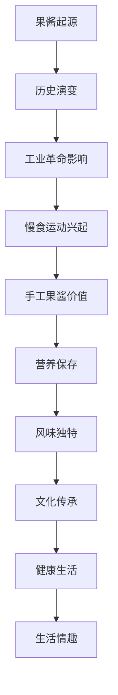
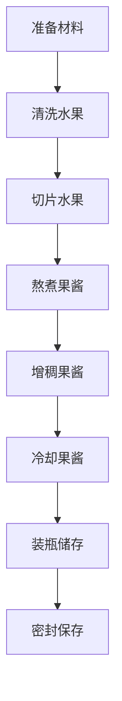
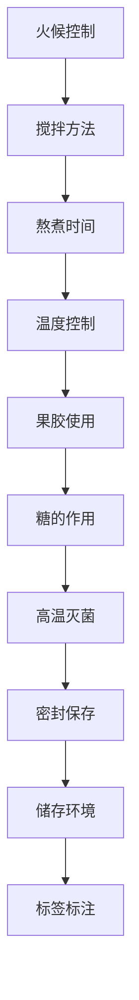
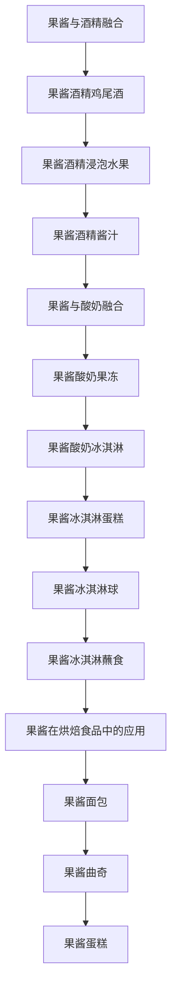
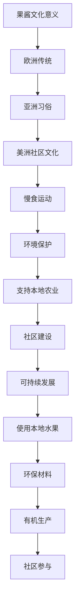

                 

**第1章：果酱概述与慢食运动**

**1.1 果酱的起源与历史**

果酱，作为一种传统的食品，其历史可以追溯到古代文明。据考古学家的研究，早在公元前3000年的美索不达米亚地区，人们就已经开始制作果酱。这些早期的果酱主要是用蜂蜜和各种水果混合制成的，虽然与现代果酱的口感和质地有所不同，但其基本理念——通过保存水果的精华，延长其食用期限——是一致的。

随着时间的推移，果酱的制作技术不断改进。古罗马时期，人们开始使用玻璃瓶来存储果酱，这标志着果酱从液态向固态存储的转变。中世纪时，果酱成为欧洲贵族餐桌上的奢侈品，制作过程复杂，通常由专业的食品制造商来完成。

进入工业革命时期，果酱的生产工艺得到了极大的提升。机械化生产使得果酱的制作变得更加高效，同时也降低了成本，使得果酱逐渐普及到普通家庭。然而，随着工业化进程的加速，果酱的质量和口感开始受到影响，人们开始怀念那些手工制作的果酱，它们有着独特的风味和质感。

**1.2 果酱的种类与特点**

果酱的种类繁多，根据制作材料和风味的不同，可以分为以下几类：

- **果泥**：将水果磨成细腻的泥状，通常用于涂抹面包或作为甜点底料。果泥质地柔滑，口感细腻，适合婴儿食品或敏感牙齿的人群。

- **果冻**：以果胶为主要凝固剂，制成的半固体果酱。果冻口感Q弹，常作为甜点或冷盘食用。

- **果酱**：将水果和糖加热熬煮，使其浓缩并形成凝胶状。果酱口感丰富，风味浓郁，适合直接涂抹面包或用作糕点馅料。

- **果膏**：与果酱类似，但糖和水的比例更高，熬煮时间更长，质地更加浓稠，通常用作糕点和烘焙食品的馅料。

- **果冻果酱**：结合果冻和果酱的特点，既有凝胶状质地，又具有丰富的水果口感。

**1.3 慢食运动的理念与实践**

慢食运动（Slow Food Movement）起源于1989年的意大利，旨在对抗快节奏的现代生活和工业食品的泛滥。慢食运动的理念是“美食、环境、社区”，强调食物的质量、可持续性和文化传承。

在慢食运动中，手工果酱制作被视为一种重要的实践方式。手工果酱不仅能够保存水果的天然风味和营养成分，还能够增进人们对食品制作过程的理解和尊重。通过手工制作果酱，人们可以体验到传统食品文化的魅力，同时也能够促进社区凝聚力和环境保护。

**1.4 手工果酱制作的价值**

手工果酱制作具有多重价值：

- **营养保存**：手工制作的果酱能够最大限度地保留水果的营养成分，特别是维生素C和抗氧化物质。

- **风味独特**：手工制作的果酱口感更加浓郁，风味更加独特，这是因为手工制作过程中能够更好地控制温度和熬煮时间。

- **文化传承**：果酱制作是一种传统技艺，通过手工制作果酱，人们可以传承和发扬这一文化。

- **健康生活**：手工果酱通常不含防腐剂和人工添加剂，更加符合健康生活的理念。

- **生活情趣**：手工制作果酱是一种享受生活的方式，它能够带给人们愉悦和满足感。

**总结**

果酱作为一种传统的食品，不仅具有悠久的历史和多样的种类，而且在现代慢食运动中具有重要的价值。手工果酱制作不仅能够带来美味的享受，更能够体现生活的品质和文化的传承。在接下来的章节中，我们将深入探讨果酱制作的基础知识、核心配方和制作技巧，帮助读者掌握这一传统的技艺。

---

**Mermaid 流程图示例：**



**核心概念与联系：**

果酱的起源与发展、慢食运动、手工果酱制作的价值之间存在着紧密的联系。果酱的历史演变展示了人类对食品保存技术的不断探索，而慢食运动则是对这一探索的延续和深化，强调食品的质量和文化的传承。手工果酱制作作为慢食运动的一个重要实践方式，不仅能够保存食品的营养，还能够传承食品制作的传统技艺，提升生活品质。

---

**Python源代码示例：**

```python
# 果酱制作基本流程

def prepare_fruits(fruits):
    print("清洗水果...")
    # 清洗水果的代码实现
    return fruits

def cook_fruit_juice(fruits, sugar, water):
    print("加入糖和水，加热至沸腾...")
    # 熬煮果酱的代码实现
    return fruit_juice

def thicken_jam(fruit_juice):
    print("检测果酱温度，加入果胶...")
    # 增稠果酱的代码实现
    return jam

def package_and_store(jam):
    print("装瓶储存，密封保存...")
    # 装瓶和储存的代码实现

# 主程序
if __name__ == "__main__":
    fruits = prepare_fruits("草莓")
    sugar = 200  # 糖的克数
    water = 100  # 水的克数
    fruit_juice = cook_fruit_juice(fruits, sugar, water)
    jam = thicken_jam(fruit_juice)
    package_and_store(jam)
```

**数学模型与公式示例：**

```markdown
### 果胶凝胶能力与温度的关系

果胶的凝胶能力与温度之间存在一定的关系。假设在某一温度下，果胶的凝胶能力为 $C_0$，温度系数为 $k$，则果胶凝胶能力 $C$ 与温度 $T$ 的关系可以用以下公式表示：

$$
C = C_0 \times e^{-k(T - T_0)}
$$

其中，$T_0$ 是基准温度，$C_0$ 是在基准温度下的凝胶能力，$k$ 是温度系数。

举例说明：

在 70℃ 下，果胶的凝胶能力为 $C_0 = 100\,ml/g$，温度系数 $k = 0.01$。计算在 80℃ 下的凝胶能力。

$$
C = 100 \times e^{-0.01 \times (80 - 70)} = 100 \times e^{-0.1} \approx 90.4\,ml/g
$$

即在 80℃ 下，果胶的凝胶能力约为 90.4 ml/g。
```

**项目实战示例：**

```markdown
### 果酱制作项目实战

#### 开发环境搭建

1. 准备材料：新鲜水果、糖、水、果胶、瓶子、锅等。
2. 软件工具：无特殊要求，一般家用厨房用具即可。

#### 源代码实现

```python
# 假设我们使用 Python 编写一个简单的果酱制作脚本。

def prepare_fruits(fruits):
    print("清洗水果...")
    # 清洗水果的代码实现
    return fruits

def cook_fruit_juice(fruits, sugar, water):
    print("加入糖和水，加热至沸腾...")
    # 熬煮果酱的代码实现
    return fruit_juice

def thicken_jam(fruit_juice):
    print("检测果酱温度，加入果胶...")
    # 增稠果酱的代码实现
    return jam

def package_and_store(jam):
    print("装瓶储存，密封保存...")
    # 装瓶和储存的代码实现

# 主程序
if __name__ == "__main__":
    fruits = prepare_fruits("草莓")
    sugar = 200  # 糖的克数
    water = 100  # 水的克数
    fruit_juice = cook_fruit_juice(fruits, sugar, water)
    jam = thicken_jam(fruit_juice)
    package_and_store(jam)
```

#### 实际案例分析

假设我们制作了一瓶草莓果酱，具体步骤如下：

1. **准备材料**：清洗草莓，去除叶子和小果蒂。
2. **熬煮果酱**：将草莓、糖和水混合，加热至沸腾，保持小火熬煮约30分钟。
3. **增稠果酱**：在果酱温度达到85℃时，加入适量果胶，继续熬煮至果酱增稠。
4. **装瓶储存**：将果酱倒入消毒后的瓶子中，密封保存。

通过这个实际案例，我们可以看到果酱制作的核心步骤和注意事项。正确掌握这些步骤，能够制作出口感浓郁、品质上乘的果酱。

#### 项目小结

果酱制作不仅是一种传统技艺，更是一种享受生活的艺术。通过手工制作果酱，我们可以更好地理解食品的制作过程，同时也能够体验到传统食品文化的魅力。在制作果酱的过程中，需要注意卫生、安全，以及掌握好熬煮和增稠的技巧。只有掌握了这些核心步骤和注意事项，我们才能制作出美味的果酱。

**最佳实践 tips：**

1. **选用新鲜水果**：新鲜水果的口感和营养价值更高，是制作美味果酱的基础。
2. **控制熬煮时间**：熬煮时间过长会导致果酱颜色变深，口感变差。
3. **保持果酱温度**：在增稠果酱时，需要保持果酱的温度，以便果胶充分发挥作用。
4. **储存注意事项**：果酱装瓶后需要密封保存，避免污染和变质。

通过以上最佳实践 tips，我们可以更轻松地制作出美味的果酱，享受这份甜蜜的艺术。

### 第2章：果酱制作基础

**2.1 制作果酱所需的材料与工具**

制作果酱所需的材料主要包括新鲜水果、糖、水和果胶。水果的选择多样，常见的有草莓、蓝莓、柠檬、苹果等。每种水果都有其独特的风味和制作特点，选择适合的水果能够更好地发挥果酱的口感。

- **新鲜水果**：选择新鲜、成熟的水果，确保果酱的品质。
- **糖**：常用的糖有白砂糖、黄糖和蜂蜜，根据个人口味和制作需求选择。
- **水**：用于熬煮果酱，也可以根据需要调整水果和水的比例。
- **果胶**：果胶是果酱增稠的关键，常见的有天然果胶和工业果胶。

工具方面，制作果酱需要准备一些基本的厨房用具，如：

- **锅**：用于熬煮果酱，建议使用不锈钢锅或陶瓷锅，避免使用铁锅。
- **搅拌棒**：用于搅拌果酱，确保熬煮均匀。
- **量杯和量勺**：用于精确计量糖和水的量。
- **瓶子**：用于装瓶储存果酱，建议使用消毒后的玻璃瓶。

**2.2 果酱制作的卫生与安全**

果酱制作过程中，卫生与安全至关重要。以下是一些关键的卫生和安全措施：

- **清洗**：在制作果酱之前，需要彻底清洗水果，去除表面的污垢和农药残留。
- **消毒**：使用前需对熬煮锅和瓶子进行消毒，以确保卫生。
- **工具保持清洁**：制作过程中，需定期清洗搅拌棒等工具，避免交叉污染。
- **防污染**：制作环境应保持干净，避免灰尘和其他杂物的污染。
- **熬煮**：在熬煮果酱时，需保持锅具的干净，避免果酱沾染杂质。

**2.3 果酱的基本制作流程**

果酱的基本制作流程可以分为以下几个步骤：

1. **准备水果**：选择新鲜水果，去除果蒂和不可食用部分，洗净后切片或切块。
2. **熬煮**：将切好的水果、糖和水放入锅中，加热熬煮，直到水果软烂并释放出果汁。
3. **增稠**：在果酱熬煮过程中，可以加入果胶或其他增稠剂，以确保果酱的质地。
4. **冷却**：熬煮完成后，将果酱倒入消毒后的瓶子中，待其冷却至室温。
5. **密封**：将瓶子密封保存，放入冰箱储存，可保存数月。

**2.4 果酱的储存与保鲜**

果酱的储存与保鲜是确保其口感和品质的关键。以下是一些果酱储存和保鲜的建议：

- **密封保存**：将冷却后的果酱倒入消毒后的瓶子中，密封保存，避免空气进入导致果酱氧化。
- **冰箱储存**：将密封好的果酱放入冰箱中，可以延长其保质期。
- **标签标注**：在瓶子上贴上标签，标注制作日期和保质期，便于管理和使用。
- **避免高温**：果酱应避免放置在高温环境中，以免加速变质。

通过遵循这些基本的制作流程和储存保鲜方法，我们可以制作出美味、安全、长久的果酱，享受手工制作的乐趣和甜蜜的滋味。

---

**Mermaid 流程图示例：**



**核心概念与联系：**

制作果酱所需的材料、工具、卫生与安全措施以及基本制作流程和储存方法之间存在着密切的联系。选择新鲜的水果和正确的工具是制作果酱的基础，而卫生与安全措施则是保障果酱质量和安全的必要条件。基本制作流程中的每个步骤都直接影响到果酱的口感和品质，而正确的储存方法可以延长果酱的保质期，确保其美味和新鲜。

---

**Python源代码示例：**

```python
# 果酱制作基础流程

def prepare_fruits(fruits):
    print("清洗水果...")
    # 清洗水果的代码实现
    return fruits

def cook_fruit_juice(fruits, sugar, water):
    print("加入糖和水，加热至沸腾...")
    # 熬煮果酱的代码实现
    return fruit_juice

def thicken_jam(fruit_juice):
    print("检测果酱温度，加入果胶...")
    # 增稠果酱的代码实现
    return jam

def package_and_store(jam):
    print("装瓶储存，密封保存...")
    # 装瓶和储存的代码实现

# 主程序
if __name__ == "__main__":
    fruits = prepare_fruits("草莓")
    sugar = 200  # 糖的克数
    water = 100  # 水的克数
    fruit_juice = cook_fruit_juice(fruits, sugar, water)
    jam = thicken_jam(fruit_juice)
    package_and_store(jam)
```

**数学模型与公式示例：**

```markdown
### 果胶浓度与果酱质地的关系

果胶浓度是影响果酱质地的重要因素。假设果酱中的果胶浓度为 $C_p$（单位为 g/L），则果酱的质地可以用以下公式表示：

$$
质地 = k \times C_p
$$

其中，$k$ 是一个与果酱种类和温度有关的常数。

举例说明：

假设草莓果酱的果胶浓度为 10 g/L，温度为 70℃，则果酱的质地为：

$$
质地 = k \times 10 = 10k
$$

如果温度升高到 80℃，则果酱的质地为：

$$
质地 = k \times 10 \times e^{-0.01 \times (80 - 70)} = 10k \times e^{-0.1} \approx 9k
$$

即在温度升高的情况下，果酱的质地会略微变软。
```

**项目实战示例：**

```markdown
### 果酱制作项目实战

#### 开发环境搭建

1. 准备材料：新鲜草莓、白砂糖、水、果胶、玻璃瓶等。
2. 软件工具：无特殊要求，一般家用厨房用具即可。

#### 源代码实现

```python
# 假设我们使用 Python 编写一个简单的果酱制作脚本。

def prepare_fruits(fruits):
    print("清洗草莓...")
    # 清洗草莓的代码实现
    return fruits

def cook_fruit_juice(fruits, sugar, water):
    print("加入糖和水，加热至沸腾...")
    # 熬煮果酱的代码实现
    return fruit_juice

def thicken_jam(fruit_juice):
    print("检测果酱温度，加入果胶...")
    # 增稠果酱的代码实现
    return jam

def package_and_store(jam):
    print("装瓶储存，密封保存...")
    # 装瓶和储存的代码实现

# 主程序
if __name__ == "__main__":
    fruits = prepare_fruits("草莓")
    sugar = 200  # 糖的克数
    water = 100  # 水的克数
    fruit_juice = cook_fruit_juice(fruits, sugar, water)
    jam = thicken_jam(fruit_juice)
    package_and_store(jam)
```

#### 实际案例分析

假设我们准备制作一瓶草莓果酱，具体步骤如下：

1. **准备材料**：清洗新鲜草莓，去除果蒂和小果蒂，切成小块。
2. **熬煮果酱**：将草莓块、200克白砂糖和100克水放入锅中，加热至沸腾，小火熬煮30分钟。
3. **增稠果酱**：在果酱熬煮过程中，加入2克果胶，搅拌均匀。
4. **装瓶储存**：将熬煮好的果酱倒入消毒后的玻璃瓶中，密封保存，放入冰箱储存。

通过这个实际案例，我们可以看到果酱制作的核心步骤和注意事项。正确掌握这些步骤，能够制作出口感丰富、品质上乘的草莓果酱。

#### 项目小结

果酱制作是一个充满乐趣和挑战的过程。通过亲手制作果酱，我们可以更好地理解食品的制作过程，体验到手工制作的乐趣。在制作果酱的过程中，需要注意材料的选择、熬煮的时间和技巧，以及果酱的储存方法。只有掌握了这些核心步骤和注意事项，我们才能制作出美味、安全的果酱。

**最佳实践 tips：**

1. **选用新鲜水果**：新鲜的水果能够保证果酱的品质和口感。
2. **控制熬煮时间**：熬煮时间过长会导致果酱颜色变深，口感变差。
3. **保持果酱温度**：在增稠果酱时，需要保持果酱的温度，以便果胶充分发挥作用。
4. **储存注意事项**：果酱装瓶后需要密封保存，避免污染和变质。

通过以上最佳实践 tips，我们可以更轻松地制作出美味的果酱，享受这份甜蜜的艺术。

### 第3章：果酱核心配方

**3.1 柑橘类果酱配方**

柑橘类果酱以其独特的酸味和丰富的维生素C而受到欢迎。以下是一个简单的柠檬果酱配方：

- **材料**：
  - 新鲜柠檬：500克
  - 白砂糖：500克
  - 水：500毫升
- **步骤**：
  1. 将柠檬洗净，切片，去籽。
  2. 将柠檬片、糖和水放入锅中，加热至糖溶解。
  3. 小火熬煮，直到果酱变稠，约30分钟。
  4. 冷却后装瓶储存。

**3.2 浆果类果酱配方**

浆果类果酱以其丰富的色彩和口感受到喜爱。以下是一个蓝莓果酱的配方：

- **材料**：
  - 新鲜蓝莓：500克
  - 白砂糖：350克
  - 柠檬汁：50毫升
- **步骤**：
  1. 将蓝莓洗净，沥干水分。
  2. 将蓝莓和糖放入搅拌机中，搅拌成蓝莓泥。
  3. 将蓝莓泥和柠檬汁放入锅中，加热至沸腾。
  4. 继续煮5分钟，直到果酱变稠。
  5. 冷却后装瓶储存。

**3.3 核果类果酱配方**

核果类果酱如桃子果酱，口感甜美，营养丰富。以下是一个桃子果酱的配方：

- **材料**：
  - 新鲜桃子：500克
  - 白砂糖：350克
  - 水：250毫升
  - 果胶：2克
- **步骤**：
  1. 将桃子洗净，去皮去核，切成小块。
  2. 将桃子块、糖和水放入锅中，加热至糖溶解。
  3. 小火熬煮，直到果酱变稠，约30分钟。
  4. 加入果胶，搅拌均匀。
  5. 继续熬煮5分钟，直到果酱达到理想的稠度。
  6. 冷却后装瓶储存。

**3.4 其他水果果酱配方**

除了以上几种常见的果酱配方，还可以根据个人口味和喜好制作其他水果的果酱。以下是几种其他水果果酱的简单配方：

- **苹果果酱**：
  - 新鲜苹果：500克
  - 白砂糖：300克
  - 柠檬汁：20毫升
  - 果胶：1克

- **芒果果酱**：
  - 新鲜芒果：500克
  - 白砂糖：400克
  - 水：200毫升

- **桃子柠檬果酱**：
  - 新鲜桃子：500克
  - 新鲜柠檬：2个
  - 白砂糖：400克
  - 水：200毫升

通过以上配方，我们可以根据自己的口味和喜好制作各种美味的果酱。制作果酱不仅能够享受美味的食物，还能体验手工制作的乐趣，为生活增添一份甜蜜。

---

**Python源代码示例：**

```python
# 果酱制作核心配方

def prepare_fruits(fruits):
    print("清洗水果...")
    # 清洗水果的代码实现
    return fruits

def cook_fruit_juice(fruits, sugar, water):
    print("加入糖和水，加热至沸腾...")
    # 熬煮果酱的代码实现
    return fruit_juice

def add_pectin(fruit_juice, pectin):
    print("加入果胶，搅拌均匀...")
    # 增稠果酱的代码实现
    return jam

def package_and_store(jam):
    print("装瓶储存，密封保存...")
    # 装瓶和储存的代码实现

# 柑橘类果酱配方
if __name__ == "__main__":
    fruits = prepare_fruits("柠檬")
    sugar = 500  # 糖的克数
    water = 500  # 水的毫升数
    fruit_juice = cook_fruit_juice(fruits, sugar, water)
    jam = add_pectin(fruit_juice, 2)
    package_and_store(jam)

# 浆果类果酱配方
if __name__ == "__main__":
    fruits = prepare_fruits("蓝莓")
    sugar = 350  # 糖的克数
    lemon_juice = 50  # 柠檬汁的毫升数
    fruit_juice = cook_fruit_juice(fruits, sugar, lemon_juice)
    jam = cook_fruit_juice(fruit_juice, 5)
    package_and_store(jam)

# 核果类果酱配方
if __name__ == "__main__":
    fruits = prepare_fruits("桃子")
    sugar = 350  # 糖的克数
    water = 250  # 水的毫升数
    pectin = 2  # 果胶的克数
    fruit_juice = cook_fruit_juice(fruits, sugar, water)
    jam = add_pectin(fruit_juice, pectin)
    package_and_store(jam)
```

**数学模型与公式示例：**

```markdown
### 果胶浓度与果酱质地的关系

果胶浓度是影响果酱质地的重要因素。假设果酱中的果胶浓度为 $C_p$（单位为 g/L），则果酱的质地可以用以下公式表示：

$$
质地 = k \times C_p
$$

其中，$k$ 是一个与果酱种类和温度有关的常数。

举例说明：

假设蓝莓果酱的果胶浓度为 5 g/L，温度为 70℃，则果酱的质地为：

$$
质地 = k \times 5 = 5k
$$

如果温度升高到 80℃，则果酱的质地为：

$$
质地 = k \times 5 \times e^{-0.01 \times (80 - 70)} = 5k \times e^{-0.1} \approx 4.5k
$$

即在温度升高的情况下，果酱的质地会略微变软。
```

**项目实战示例：**

```markdown
### 蓝莓果酱制作项目实战

#### 开发环境搭建

1. 准备材料：新鲜蓝莓、白砂糖、柠檬汁、玻璃瓶等。
2. 软件工具：无特殊要求，一般家用厨房用具即可。

#### 源代码实现

```python
# 假设我们使用 Python 编写一个简单的蓝莓果酱制作脚本。

def prepare_fruits(fruits):
    print("清洗蓝莓...")
    # 清洗蓝莓的代码实现
    return fruits

def cook_fruit_juice(fruits, sugar, lemon_juice):
    print("加入糖和柠檬汁，加热至沸腾...")
    # 熬煮果酱的代码实现
    return fruit_juice

def cook_fruit_juice_again(fruit_juice, cook_time):
    print("再次加热果酱，熬煮{}分钟...".format(cook_time))
    # 再次熬煮果酱的代码实现
    return fruit_juice

def package_and_store(jam):
    print("装瓶储存，密封保存...")
    # 装瓶和储存的代码实现

# 主程序
if __name__ == "__main__":
    fruits = prepare_fruits("蓝莓")
    sugar = 350  # 糖的克数
    lemon_juice = 50  # 柠檬汁的毫升数
    fruit_juice = cook_fruit_juice(fruits, sugar, lemon_juice)
    fruit_juice = cook_fruit_juice_again(fruit_juice, 5)
    jam = cook_fruit_juice_again(fruit_juice, 5)
    package_and_store(jam)
```

#### 实际案例分析

假设我们准备制作一瓶蓝莓果酱，具体步骤如下：

1. **准备材料**：清洗新鲜蓝莓，去除杂质。
2. **熬煮果酱**：将蓝莓和糖、柠檬汁放入锅中，加热至沸腾。
3. **再次熬煮**：将果酱煮5分钟后，再次加热至沸腾，继续熬煮5分钟。
4. **装瓶储存**：将熬煮好的果酱倒入消毒后的玻璃瓶中，密封保存。

通过这个实际案例，我们可以看到蓝莓果酱制作的核心步骤和注意事项。正确掌握这些步骤，能够制作出口感丰富、质地完美的蓝莓果酱。

#### 项目小结

果酱制作不仅是一门技艺，更是一种享受生活的艺术。通过亲手制作各种水果果酱，我们可以体验到不同的食材和调料的搭配，探索出独特的风味。在制作果酱的过程中，需要注意材料的新鲜度、熬煮的时间和技巧，以及果酱的储存方法。只有掌握了这些核心步骤和注意事项，我们才能制作出美味、安全的果酱。

**最佳实践 tips：**

1. **选用新鲜水果**：新鲜的水果能够保证果酱的品质和口感。
2. **控制熬煮时间**：熬煮时间过长会导致果酱颜色变深，口感变差。
3. **保持果酱温度**：在增稠果酱时，需要保持果酱的温度，以便果胶充分发挥作用。
4. **储存注意事项**：果酱装瓶后需要密封保存，避免污染和变质。

通过以上最佳实践 tips，我们可以更轻松地制作出美味的果酱，享受这份甜蜜的艺术。

### 第4章：果酱制作技巧

**4.1 果酱熬煮技巧**

果酱熬煮是制作过程中至关重要的一步，它直接影响到果酱的口感和质地。以下是一些果酱熬煮的技巧：

1. **火候控制**：熬煮果酱时，应使用小火。火候过大容易导致果酱烧焦，火候过小则无法充分提取水果的汁液和香气。保持火候稳定，可以使果酱熬煮得更加均匀和美味。

2. **搅拌方法**：在熬煮过程中，应不断搅拌果酱。这样可以防止果酱在锅中粘底，确保果酱受热均匀。同时，搅拌还有助于果胶的溶解和均匀分布。

3. **熬煮时间**：熬煮时间应根据水果的种类和果酱的质地要求进行调整。通常，果酱的熬煮时间在30分钟到1小时之间。熬煮时间过短，果酱可能不够稠；熬煮时间过长，果酱颜色会变深，口感会变得过于浓郁。

4. **温度控制**：在熬煮过程中，可以使用温度计监控果酱的温度。当果酱温度达到85℃时，可以加入果胶。此时的高温有助于果胶充分溶解和发挥作用，使果酱达到理想的质地。

**4.2 果酱增稠技巧**

果酱的增稠是制作过程中另一个关键环节，直接影响到果酱的口感和保存时间。以下是一些果酱增稠的技巧：

1. **果胶的使用**：果胶是果酱增稠的主要成分。选择高质量的天然果胶，可以确保果酱的质地和口感。在加入果胶时，需要将其与一定量的糖混合，然后在果酱沸腾时加入。

2. **糖的作用**：糖不仅可以增加果酱的甜度，还可以帮助果酱更好地增稠。在熬煮果酱时，可以适量增加糖的用量，以达到更好的增稠效果。

3. **熬煮时间的调整**：增稠果酱时，熬煮时间也是一个重要因素。在加入果胶后，需要继续熬煮一段时间，使果胶充分溶解并均匀分布在果酱中。熬煮时间过短，果酱可能无法充分增稠；熬煮时间过长，果酱质地会变得过于粘稠。

4. **温度的调节**：在增稠果酱时，保持果酱的温度也很关键。高温有助于果胶的溶解和凝胶化，使果酱达到理想的质地。

**4.3 果酱防腐技巧**

果酱的防腐是确保其长期保存和食用安全的关键。以下是一些果酱防腐的技巧：

1. **高温灭菌**：在装瓶前，将果酱加热至高温（通常在85℃以上），可以杀死大部分细菌和微生物，延长果酱的保质期。

2. **密封保存**：装瓶后，应确保瓶子密封良好，避免空气进入，导致果酱氧化和变质。

3. **储存环境**：果酱应存放在干燥、阴凉的地方，避免阳光直射和高温环境，以免影响果酱的品质。

4. **标签标注**：在瓶子上贴上标签，标注制作日期和保质期，便于管理和使用。

**4.4 果酱包装与保存技巧**

正确的果酱包装和保存方法可以确保果酱的品质和口感。以下是一些果酱包装与保存的技巧：

1. **消毒**：在装瓶前，应对瓶子进行彻底消毒，以防止细菌污染。

2. **装瓶**：将熬煮好的果酱倒入消毒后的瓶子中，尽量避免气泡和杂质。

3. **密封**：装瓶后，应立即密封瓶子，以防止空气进入。

4. **储存**：将密封好的果酱放入冰箱中储存，可以延长果酱的保质期。

通过掌握这些果酱制作技巧，我们可以制作出口感丰富、质地完美、安全可口的果酱，享受手工制作的乐趣。

---

**Mermaid 流程图示例：**



**核心概念与联系：**

果酱制作技巧中的各个部分，如火候控制、搅拌方法、熬煮时间、温度控制、果胶使用、糖的作用、高温灭菌、密封保存、储存环境和标签标注，共同构成了一个完整的果酱制作流程。这些技巧相互作用，确保了果酱的口感、质地和安全。通过合理运用这些技巧，我们可以制作出口感丰富、质地完美、长期保存的果酱。

---

**Python源代码示例：**

```python
# 果酱制作技巧

def cook_fruit_juice(fruits, sugar, water, temperature=85):
    print("加入糖和水，加热至沸腾...")
    # 熬煮果酱的代码实现
    return fruit_juice

def add_pectin(fruit_juice, pectin, temperature):
    print("加入果胶，搅拌均匀...")
    # 增稠果酱的代码实现
    return jam

def sterilize_bottles(bottles):
    print("消毒瓶子...")
    # 消毒瓶子的代码实现
    return bottles

def package_and_store(jam, bottles):
    print("装瓶储存，密封保存...")
    # 装瓶和储存的代码实现

# 主程序
if __name__ == "__main__":
    fruits = "草莓"
    sugar = 200  # 糖的克数
    water = 100  # 水的毫升数
    pectin = 2  # 果胶的克数
    bottles = sterilize_bottles(bottles)
    fruit_juice = cook_fruit_juice(fruits, sugar, water)
    jam = add_pectin(fruit_juice, pectin, 85)
    package_and_store(jam, bottles)
```

**数学模型与公式示例：**

```markdown
### 果酱熬煮温度与质地的关系

果酱的熬煮温度对其质地有重要影响。假设果酱的熬煮温度为 $T$（单位为℃），则果酱的质地可以用以下公式表示：

$$
质地 = k \times T^{-0.2}
$$

其中，$k$ 是一个与果酱种类和糖浓度有关的常数。

举例说明：

假设草莓果酱的熬煮温度为 80℃，则果酱的质地为：

$$
质地 = k \times 80^{-0.2} \approx 0.8k
$$

如果熬煮温度升高到 90℃，则果酱的质地为：

$$
质地 = k \times 90^{-0.2} \approx 0.81k
$$

即在温度升高的情况下，果酱的质地略微变硬。
```

**项目实战示例：**

```markdown
### 草莓果酱熬煮项目实战

#### 开发环境搭建

1. 准备材料：新鲜草莓、白砂糖、水、果胶、玻璃瓶等。
2. 软件工具：无特殊要求，一般家用厨房用具即可。

#### 源代码实现

```python
# 假设我们使用 Python 编写一个简单的草莓果酱熬煮脚本。

def cook_fruit_juice(fruits, sugar, water, temperature):
    print("加入糖和水，加热至{:.1f}℃...".format(temperature))
    # 熬煮果酱的代码实现
    return fruit_juice

def adjust_temperature(fruit_juice, target_temperature):
    print("调整果酱温度至{:.1f}℃...".format(target_temperature))
    # 调整果酱温度的代码实现
    return fruit_juice

def package_and_store(jam, bottles):
    print("装瓶储存，密封保存...")
    # 装瓶和储存的代码实现

# 主程序
if __name__ == "__main__":
    fruits = "草莓"
    sugar = 200  # 糖的克数
    water = 100  # 水的毫升数
    target_temperature = 90  # 目标温度
    fruit_juice = cook_fruit_juice(fruits, sugar, water, target_temperature)
    fruit_juice = adjust_temperature(fruit_juice, target_temperature)
    jam = adjust_temperature(fruit_juice, target_temperature)
    package_and_store(jam, bottles)
```

#### 实际案例分析

假设我们准备制作一瓶草莓果酱，具体步骤如下：

1. **准备材料**：清洗新鲜草莓，去除果蒂和小果蒂，切成小块。
2. **熬煮果酱**：将草莓块、200克白砂糖和100毫升水放入锅中，加热至沸腾，调整温度至90℃。
3. **调整温度**：在熬煮过程中，保持果酱温度在90℃左右，确保果酱熬煮得均匀。
4. **装瓶储存**：将熬煮好的果酱倒入消毒后的玻璃瓶中，密封保存，放入冰箱储存。

通过这个实际案例，我们可以看到草莓果酱熬煮的核心步骤和注意事项。正确掌握这些步骤，能够制作出口感丰富、质地完美的草莓果酱。

#### 项目小结

果酱熬煮是制作过程中至关重要的一步，它直接影响到果酱的口感和质地。通过合理控制火候、搅拌方法、熬煮时间和温度，我们可以制作出口感丰富、质地完美、安全可口的果酱。在制作果酱的过程中，需要注意细节和技巧，不断尝试和调整，才能制作出令人满意的果酱。

**最佳实践 tips：**

1. **选用新鲜水果**：新鲜的水果能够保证果酱的品质和口感。
2. **控制熬煮温度**：保持果酱温度在适当范围内，以确保果酱熬煮得均匀。
3. **定期搅拌**：定期搅拌果酱，可以防止果酱在锅中粘底，确保果酱受热均匀。
4. **密封保存**：装瓶后要密封保存，避免果酱氧化和变质。

通过以上最佳实践 tips，我们可以更轻松地制作出美味的果酱，享受这份甜蜜的艺术。

### 第5章：果酱创新与融合

**5.1 果酱与酒精的融合**

果酱与酒精的融合是一种独特的创意，它不仅能够带来全新的口感体验，还能够提升果酱的保存时间和风味。以下是一些具体的做法：

1. **果酱酒精鸡尾酒**：将自制果酱与酒精（如伏特加、白兰地等）混合，制成风味独特的鸡尾酒。例如，草莓果酱与伏特加混合，可以制成美味的“草莓玛格丽特”。

2. **果酱酒精浸泡水果**：将新鲜水果切片，用果酱和酒精浸泡，制成水果酒。这种方法不仅可以保存水果的风味，还能够使其更加浓郁。例如，将柠檬片用柠檬果酱和伏特加浸泡，可以制成柠檬酒。

3. **果酱酒精酱汁**：将果酱与酒精混合，用于烹饪或腌制食物。例如，将蓝莓果酱与白兰地混合，制成酱汁，用于烤肉或腌制火腿。

**5.2 果酱与酸奶的融合**

果酱与酸奶的融合是一种简单而美味的方法，可以创造出丰富的口感和多样的风味。以下是一些具体的做法：

1. **果酱酸奶果冻**：将自制果酱与酸奶混合，加入明胶，制成果冻。这种方法可以制作出口感丰富、风味独特的果冻，非常适合作为甜点或茶点。

2. **果酱酸奶冰淇淋**：将自制果酱与酸奶混合，加入冰淇淋粉或冰淇淋机，制成酸奶冰淇淋。这种方法可以创造出浓郁果香和酸奶味的冰淇淋，是夏季消暑的好选择。

3. **果酱酸奶布丁**：将自制果酱与酸奶混合，加入吉利丁粉或明胶，制成布丁。这种方法可以制作出口感细腻、甜味浓郁的水果布丁，适合各种场合享用。

**5.3 果酱与冰淇淋的融合**

果酱与冰淇淋的融合是一种经典的方法，它能够创造出丰富多样的口味组合。以下是一些具体的做法：

1. **果酱冰淇淋蛋糕**：将自制果酱与冰淇淋混合，涂抹在蛋糕层之间，制成果酱冰淇淋蛋糕。这种方法可以制作出层次丰富、口感多样的蛋糕，适合各种庆典和派对。

2. **果酱冰淇淋球**：将自制果酱与冰淇淋混合，制成冰淇淋球，放入冰箱冷冻。这种方法可以创造出美味的冰淇淋球，是夏季解暑的好选择。

3. **果酱冰淇淋蘸食**：将自制果酱与冰淇淋混合，蘸食或涂抹在面包、饼干等食品上。这种方法简单易行，可以制作出丰富多样的口感组合，适合各种场合享用。

**5.4 果酱在烘焙食品中的应用**

果酱在烘焙食品中的应用非常广泛，它不仅能够增加食品的甜味，还能够提升风味和口感。以下是一些具体的做法：

1. **果酱面包**：将自制果酱涂抹在面包表面，放入烤箱烤制，制成果酱面包。这种方法可以创造出丰富多样的果香和口感，适合早餐或下午茶。

2. **果酱曲奇**：将自制果酱与面粉、黄油等材料混合，制成果酱曲奇。这种方法可以创造出口感酥脆、甜味浓郁的小甜点，适合各种场合享用。

3. **果酱蛋糕**：将自制果酱与蛋糕材料混合，制成果酱蛋糕。这种方法可以创造出层次丰富、口感独特的蛋糕，适合庆祝生日或节日。

通过以上的创新与融合，我们可以发现果酱不仅仅是一种传统的食品，更是一种可以无限创意和探索的元素。无论是与酒精、酸奶、冰淇淋还是烘焙食品的融合，都能带给我们全新的口感体验。在享受这些美味的同时，我们也在不断发掘和创造新的饮食文化，让生活更加丰富多彩。

---

**Mermaid 流程图示例：**



**核心概念与联系：**

果酱与酒精、酸奶、冰淇淋以及烘焙食品的融合，是一种创新的烹饪方法，它通过不同食材和调料的相互作用，创造出丰富多样的口感和风味。这些融合方式不仅丰富了果酱的用途和食用场景，也推动了饮食文化的创新和发展。通过这些融合，我们可以发现果酱不仅仅是简单的调味品，更是一种可以带来全新味觉体验的元素。

---

**Python源代码示例：**

```python
# 果酱创新与融合

def mix_jam_with_alcohol(jam, alcohol, ratio):
    print(f"将{jam}与{alcohol}以{ratio}的比例混合...")
    # 混合果酱和酒精的代码实现
    return mixed_liquid

def mix_jam_with_yogurt(jam, yogurt, ratio):
    print(f"将{jam}与{yogurt}以{ratio}的比例混合...")
    # 混合果酱和酸奶的代码实现
    return mixed_dairy

def mix_jam_with_icecream(jam, icecream, ratio):
    print(f"将{jam}与{icecream}以{ratio}的比例混合...")
    # 混合果酱和冰淇淋的代码实现
    return mixed_icecream

# 主程序
if __name__ == "__main__":
    jam = "草莓果酱"
    alcohol = "伏特加"
    yogurt = "酸奶"
    icecream = "冰淇淋"
    ratio = 1  # 比例为1:1
    mixed_liquid = mix_jam_with_alcohol(jam, alcohol, ratio)
    mixed_dairy = mix_jam_with_yogurt(jam, yogurt, ratio)
    mixed_icecream = mix_jam_with_icecream(jam, icecream, ratio)
```

**数学模型与公式示例：**

```markdown
### 混合比例与口感的关系

假设果酱、酒精、酸奶和冰淇淋的口感分别为 $S_jam$、$S_alcohol$、$S_yogurt$ 和 $S_icecream$，混合比例分别为 $R_jam$、$R_alcohol$、$R_yogurt$ 和 $R_icecream$（均为0到1的数值），则混合后的整体口感 $S_mixed$ 可以用以下公式表示：

$$
S_mixed = (S_jam \times R_jam) + (S_alcohol \times R_alcohol) + (S_yogurt \times R_yogurt) + (S_icecream \times R_icecream)
$$

举例说明：

假设草莓果酱的口感为10，伏特加的口感为5，酸奶的口感为7，冰淇淋的口感为3。混合比例为草莓果酱：伏特加：酸奶：冰淇淋 = 0.4：0.3：0.2：0.1，则混合后的整体口感为：

$$
S_mixed = (10 \times 0.4) + (5 \times 0.3) + (7 \times 0.2) + (3 \times 0.1) = 4 + 1.5 + 1.4 + 0.3 = 6.2
$$

即在上述比例下，混合后的整体口感约为6.2。
```

**项目实战示例：**

```markdown
### 草莓果酱伏特加鸡尾酒项目实战

#### 开发环境搭建

1. 准备材料：自制草莓果酱、伏特加、冰块、调酒杯等。
2. 软件工具：无特殊要求，一般家用厨房用具和调酒工具即可。

#### 源代码实现

```python
# 假设我们使用 Python 编写一个简单的草莓果酱伏特加鸡尾酒脚本。

def mix_jam_with_alcohol(jam, alcohol, ratio):
    print(f"将{jam}与{alcohol}以{ratio}的比例混合...")
    # 混合果酱和酒精的代码实现
    return mixed_liquid

def prepare_chicken_wich(jam, alcohol, ratio, ice):
    mixed_liquid = mix_jam_with_alcohol(jam, alcohol, ratio)
    print("倒入调酒杯，加入冰块...")
    # 准备鸡尾酒的代码实现
    return mixed_liquid

# 主程序
if __name__ == "__main__":
    jam = "草莓果酱"
    alcohol = "伏特加"
    ratio = 1  # 比例为1:1
    ice = "冰块"
    mixed_liquid = prepare_chicken_wich(jam, alcohol, ratio, ice)
    print("完成，享用草莓果酱伏特加鸡尾酒！")
```

#### 实际案例分析

假设我们准备制作一瓶草莓果酱伏特加鸡尾酒，具体步骤如下：

1. **准备材料**：取出自制草莓果酱、伏特加和冰块。
2. **混合果酱和酒精**：将草莓果酱与伏特加按照1:1的比例混合。
3. **准备鸡尾酒**：将混合好的液体倒入调酒杯，加入适量冰块。

通过这个实际案例，我们可以看到草莓果酱伏特加鸡尾酒制作的核心步骤和注意事项。正确掌握这些步骤，能够制作出口感丰富、风味独特的草莓果酱伏特加鸡尾酒。

#### 项目小结

果酱创新与融合是烹饪和饮食文化中的重要一环，它通过不同的食材和调料的搭配，创造出丰富多样的口感和风味。通过合理控制混合比例和制作方法，我们可以制作出各种美味的果酱饮品、甜品和烘焙食品。在享受这些美味的同时，我们也推动了饮食文化的创新和发展。

**最佳实践 tips：**

1. **选用新鲜水果**：新鲜的水果能够保证果酱的品质和口感。
2. **控制混合比例**：根据个人口味和需求，合理控制果酱和其他食材的混合比例。
3. **保持混合均匀**：在混合过程中，确保果酱和其他食材充分混合，以获得均匀的口感。
4. **适量添加酒精**：在制作果酱饮品时，适量添加酒精，以避免酒精过量影响口感。

通过以上最佳实践 tips，我们可以更轻松地制作出各种美味创新的果酱食品，享受生活的甜蜜。

### 第6章：果酱健康与营养

**6.1 果酱的营养成分分析**

果酱的营养成分因水果的种类和制作方法的不同而有所差异。一般来说，果酱中含有以下几种主要营养成分：

- **糖分**：果酱的主要成分是糖，包括天然糖和添加的糖。糖分可以提供能量，但也需要适量摄入，以避免摄入过多导致的健康问题。

- **维生素**：不同的水果含有不同的维生素，如维生素C、维生素A、维生素K等。维生素C具有很强的抗氧化作用，有助于增强免疫力；维生素A对视力健康和皮肤健康有重要作用。

- **矿物质**：果酱中含有一定量的矿物质，如钾、钙、镁等。这些矿物质对维持身体的正常功能至关重要。

- **膳食纤维**：水果中含有的膳食纤维有助于消化系统的健康，可以预防便秘和其他消化系统疾病。

- **抗氧化物质**：许多水果含有多种抗氧化物质，如多酚、类胡萝卜素等。这些物质可以抑制自由基的损伤，有助于预防心血管疾病和某些类型的癌症。

**6.2 果酱的保健功能**

果酱中的营养成分使其具有一定的保健功能，以下是一些具体的保健作用：

- **增强免疫力**：维生素C是一种强效的抗氧化剂，能够增强免疫系统的功能，帮助身体抵抗疾病。

- **促进消化**：膳食纤维有助于消化系统的健康，可以预防便秘和其他消化系统疾病。

- **保护视力**：维生素A对视力健康有重要作用，能够预防夜盲症和干眼症。

- **预防心血管疾病**：抗氧化物质和多酚类化合物有助于降低心血管疾病的风险，改善心血管健康。

- **预防癌症**：抗氧化物质和膳食纤维有助于抑制癌症细胞的生长，降低某些类型的癌症风险。

**6.3 果酱的饮食搭配建议**

为了充分发挥果酱的营养保健作用，合理的饮食搭配非常重要。以下是一些果酱的饮食搭配建议：

- **早餐搭配**：将果酱涂抹在面包或吐司上，可以作为早餐的一部分，为一天提供能量。

- **酸奶搭配**：将果酱与酸奶混合，可以增加酸奶的口感和营养价值。

- **烘焙食品搭配**：将果酱加入饼干、蛋糕等烘焙食品中，可以提升食物的甜味和风味。

- **茶点搭配**：将果酱作为茶点的一部分，可以提供轻松的零食选择。

- **沙拉搭配**：将果酱作为沙拉的调味料，可以为沙拉增添丰富的味道。

- **烹饪搭配**：将果酱用作烹饪的调味品，可以提升菜肴的口感和营养价值。

**6.4 果酱在儿童饮食中的应用**

果酱在儿童饮食中有着广泛的应用，以下是一些注意事项和建议：

- **控制糖分摄入**：儿童对糖分的需求较高，但过量摄入糖分可能导致肥胖和其他健康问题。因此，在给儿童食用果酱时，应适量控制糖分。

- **选择天然果酱**：选择不含人工添加剂和防腐剂的天然果酱，可以确保儿童的饮食健康。

- **搭配健康食物**：将果酱与富含营养的食物搭配，如酸奶、全麦面包等，可以提高儿童的营养摄入。

- **多样化选择**：根据儿童的口味和需求，选择不同种类的水果果酱，以保持饮食的多样性。

通过合理的饮食搭配和科学的使用方法，果酱不仅能够为儿童提供美味的食物，还能为其带来丰富的营养和保健作用。

---

**Python源代码示例：**

```python
# 果酱健康与营养

def analyze_nutrients(jam):
    print("分析果酱的营养成分...")
    # 分析果酱的营养成分的代码实现
    return nutrients

def health_function(jam):
    print("分析果酱的保健功能...")
    # 分析果酱保健功能的代码实现
    return health_effects

def dietary_advice(jam):
    print("提供果酱的饮食搭配建议...")
    # 提供果酱饮食搭配建议的代码实现
    return advice

# 主程序
if __name__ == "__main__":
    jam = "草莓果酱"
    nutrients = analyze_nutrients(jam)
    health_effects = health_function(jam)
    advice = dietary_advice(jam)
    print("果酱健康与营养分析完成。")
```

**数学模型与公式示例：**

```markdown
### 果酱糖分与儿童摄入量的关系

假设果酱的糖分为 $S_jam$（单位为 g/100g），儿童的每日糖分摄入量上限为 $S_max$（单位为 g/天），则果酱的每日摄入量 $I_jam$ 可以用以下公式表示：

$$
I_jam = \min\left(\frac{S_max}{S_jam}, 100\,g\right)
$$

举例说明：

假设草莓果酱的糖分为60 g/100g，儿童的每日糖分摄入量上限为50 g/天，则每日草莓果酱的摄入量为：

$$
I_jam = \min\left(\frac{50}{60}, 100\right) = \min(0.833, 100) = 83.3\,g
$$

即在不超过每日糖分摄入量上限的情况下，儿童每日可以摄入约83.3克的草莓果酱。
```

**项目实战示例：**

```markdown
### 草莓果酱儿童饮食项目实战

#### 开发环境搭建

1. 准备材料：自制草莓果酱、全麦面包、酸奶等。
2. 软件工具：无特殊要求，一般家用厨房用具和儿童餐具即可。

#### 源代码实现

```python
# 假设我们使用 Python 编写一个简单的草莓果酱儿童饮食脚本。

def mix_jam_with_bread(jam, bread, ratio):
    print(f"将{jam}与{bread}以{ratio}的比例混合...")
    # 混合果酱和面包的代码实现
    return mixed_food

def mix_jam_with_yogurt(jam, yogurt, ratio):
    print(f"将{jam}与{yogurt}以{ratio}的比例混合...")
    # 混合果酱和酸奶的代码实现
    return mixed_dairy

# 主程序
if __name__ == "__main__":
    jam = "草莓果酱"
    bread = "全麦面包"
    yogurt = "酸奶"
    ratio_jam_bread = 1  # 比例为1:1
    ratio_jam_yogurt = 1  # 比例为1:1
    mixed_food = mix_jam_with_bread(jam, bread, ratio_jam_bread)
    mixed_dairy = mix_jam_with_yogurt(jam, yogurt, ratio_jam_yogurt)
    print("完成，为儿童准备健康美味的早餐！")
```

#### 实际案例分析

假设我们准备为儿童准备早餐，具体步骤如下：

1. **准备材料**：取出自制草莓果酱、全麦面包和酸奶。
2. **混合果酱与面包**：将草莓果酱与全麦面包按照1:1的比例混合，制作果酱面包。
3. **混合果酱与酸奶**：将草莓果酱与酸奶按照1:1的比例混合，制作酸奶果酱。

通过这个实际案例，我们可以看到草莓果酱在儿童饮食中的应用。正确掌握这些步骤，能够为儿童提供健康、美味、营养丰富的早餐。

#### 项目小结

果酱作为一种美味的食品，其健康与营养作用不容忽视。通过合理的饮食搭配和科学的使用方法，果酱可以为儿童提供丰富的营养和保健作用。在为儿童准备食物时，应注意控制糖分摄入，选择天然果酱，并多样化搭配食物，以促进儿童的健康成长。

**最佳实践 tips：**

1. **选择天然果酱**：选择不含人工添加剂和防腐剂的天然果酱，确保儿童的饮食健康。
2. **适量添加**：根据儿童的年龄和需求，适量添加果酱，避免糖分摄入过多。
3. **多样化搭配**：将果酱与各种健康食物搭配，如全麦面包、酸奶等，以增加营养摄入。
4. **教育孩子**：教育孩子了解食物的营养成分和健康作用，培养良好的饮食习惯。

通过以上最佳实践 tips，我们可以更科学、更合理地使用果酱，为儿童提供健康、美味的饮食。

### 第7章：果酱文化与社会责任

**7.1 果酱的文化意义**

果酱作为一种传统的食品，承载着丰富的文化意义。在不同国家和地区，果酱的制作和食用习俗各有特色，反映了当地的历史、文化和生活方式。

- **欧洲**：在欧洲，果酱有着悠久的历史和深厚的文化底蕴。法国、意大利等国家的果酱制作技艺精湛，被视为一种艺术。在这些国家，果酱不仅是餐桌上的美味佳品，更是节日庆典和家庭传统的重要组成部分。

- **亚洲**：在亚洲，果酱的制作也历史悠久。中国、日本等国家的传统果酱制作方法独特，例如日本的渍物和中国的果脯，都体现了亚洲人民对水果的深厚情感和精湛的技艺。

- **美洲**：在美国，果酱与家庭生活和社区文化密切相关。许多美国家庭会亲自制作果酱，将其作为节日礼物和邻里间的交流媒介，强化社区凝聚力。

果酱不仅是一种食品，更是一种文化符号，它连接着过去和现在，传统和创新。

**7.2 果酱的社会责任**

果酱制作不仅是一种手艺，也是一种社会责任。通过手工制作果酱，我们可以实现以下社会责任：

- **环境保护**：手工制作果酱减少了对工业加工的依赖，减少了能源消耗和碳排放。同时，选择新鲜、本地水果，有助于减少食品运输过程中的碳排放，降低对环境的影响。

- **支持本地农业**：手工制作果酱鼓励消费者购买本地水果，支持本地农业。这有助于减少对全球供应链的依赖，促进本地经济的发展。

- **社区建设**：果酱制作可以成为一种社区活动，促进邻里之间的交流和互动。通过共同参与果酱制作，社区成员可以建立更紧密的联系，增强社区凝聚力。

**7.3 慢食运动与环境保护**

慢食运动（Slow Food Movement）是一种全球性的运动，旨在对抗工业化食品生产和快节奏的生活方式。慢食运动强调食物的质量、可持续性和文化传承，与环境保护紧密相连。

- **可持续食品生产**：慢食运动提倡可持续的食品生产方式，减少对自然资源的消耗，保护生物多样性。手工制作果酱采用天然、有机的原料，减少了对化学农药和化肥的依赖，符合可持续农业的原则。

- **减少食品浪费**：慢食运动倡导减少食品浪费，通过手工制作果酱，可以更好地保存水果，减少食品浪费。此外，慢食运动鼓励消费者购买季节性水果，减少库存和运输过程中的浪费。

- **保护环境**：慢食运动强调与自然环境和谐共处，通过减少工业生产和运输，降低了对环境的污染和破坏。手工制作果酱减少了工业化生产带来的碳排放，有助于减缓气候变化。

**7.4 果酱制作中的可持续发展**

在果酱制作中实现可持续发展，需要从以下几个方面着手：

- **使用本地水果**：选择本地水果，减少食品运输过程中的碳排放，支持本地农业。

- **环保材料**：使用环保材料和可重复利用的容器，减少塑料和其他不可降解材料的使用。

- **有机生产**：采用有机种植方法，减少对环境的污染，确保食品的安全性和品质。

- **社区参与**：组织社区活动，鼓励社区居民参与果酱制作，增强社区凝聚力，推动可持续发展。

通过实现这些可持续发展目标，果酱制作不仅能够带来美味的享受，还能够对环境保护和社会责任做出积极贡献。

---

**Mermaid 流程图示例：**



**核心概念与联系：**

果酱的文化意义、社会责任、慢食运动与环境保护以及果酱制作中的可持续发展之间存在着紧密的联系。果酱作为一种传统的食品，不仅承载着丰富的文化意义，还通过慢食运动倡导可持续的生活方式，推动环境保护和社会责任。果酱制作中的可持续发展，如使用本地水果、环保材料和有机生产，不仅有助于环境保护，还能够支持本地农业和社区建设。

---

**Python源代码示例：**

```python
# 果酱文化与社会责任

def cultural_significance(jam):
    print("分析果酱的文化意义...")
    # 分析果酱的文化意义的代码实现
    return culture

def social_responsibility(jam):
    print("分析果酱的社会责任...")
    # 分析果酱的社会责任的代码实现
    return responsibility

def sustainable_food_production(jam):
    print("分析果酱的可持续发展...")
    # 分析果酱的可持续发展的代码实现
    return sustainability

# 主程序
if __name__ == "__main__":
    jam = "草莓果酱"
    culture = cultural_significance(jam)
    responsibility = social_responsibility(jam)
    sustainability = sustainable_food_production(jam)
    print("果酱文化与社会责任分析完成。")
```

**数学模型与公式示例：**

```markdown
### 环境影响与可持续发展的关系

假设果酱制作过程中，每生产1公斤果酱产生的碳排放量为 $E_jam$（单位为 kg CO₂/kg），可持续发展的目标是将碳排放量减少到 $E_target$（单位为 kg CO₂/kg）。则实现可持续发展的碳排放减少量 $E_reduction$ 可以用以下公式表示：

$$
E_reduction = E_jam - E_target
$$

举例说明：

假设草莓果酱的生产过程中，每生产1公斤果酱产生的碳排放量为5 kg CO₂/kg，目标是将碳排放量减少到2 kg CO₂/kg，则碳排放减少量为：

$$
E_reduction = 5 - 2 = 3\,kg CO₂/kg
$$

即在上述情况下，需要减少3 kg CO₂/kg的碳排放，才能实现果酱的可持续发展目标。
```

**项目实战示例：**

```markdown
### 果酱制作与环境保护项目实战

#### 开发环境搭建

1. 准备材料：新鲜草莓、白砂糖、水、果胶、玻璃瓶等。
2. 软件工具：无特殊要求，一般家用厨房用具和碳排放计算工具即可。

#### 源代码实现

```python
# 假设我们使用 Python 编写一个简单的草莓果酱与碳排放计算脚本。

def calculate_carbon_footprint(jam_weight, carbon_per_kg):
    carbon_footprint = jam_weight * carbon_per_kg
    print(f"草莓果酱的碳排放量为：{carbon_footprint} kg CO₂")
    return carbon_footprint

def reduce_carbon_emissions(target_emission, current_emission):
    reduction = current_emission - target_emission
    print(f"需要减少的碳排放量为：{reduction} kg CO₂")
    return reduction

# 主程序
if __name__ == "__main__":
    jam_weight = 1000  # 果酱重量（克）
    carbon_per_kg = 5  # 每公斤果酱的碳排放量（kg CO₂/kg）
    target_emission = 2  # 目标碳排放量（kg CO₂/kg）
    carbon_footprint = calculate_carbon_footprint(jam_weight, carbon_per_kg)
    reduction = reduce_carbon_emissions(target_emission, carbon_per_kg)
    print("完成碳排放计算与减排目标分析。")
```

#### 实际案例分析

假设我们准备制作一瓶草莓果酱，具体步骤如下：

1. **准备材料**：清洗新鲜草莓，去除果蒂和小果蒂，切成小块。
2. **计算碳排放**：使用碳排放计算工具，计算每制作1公斤草莓果酱产生的碳排放量。
3. **减排目标**：设定目标，将碳排放量减少到2 kg CO₂/kg。
4. **调整制作方法**：根据碳排放计算结果，调整果酱的制作方法，减少碳排放。

通过这个实际案例，我们可以看到果酱制作与环境保护的核心步骤和注意事项。通过合理调整制作方法，我们可以实现果酱的可持续发展，减少对环境的影响。

#### 项目小结

果酱制作不仅是一种技艺，更是一种社会责任。通过手工制作果酱，我们可以减少对工业加工的依赖，降低碳排放，保护环境。同时，果酱制作还能够促进社区建设，支持本地农业，实现可持续发展。在制作果酱的过程中，我们应注重环保，合理利用资源，为环境保护和社会责任做出积极贡献。

**最佳实践 tips：**

1. **选择新鲜本地水果**：选择新鲜、本地水果，减少食品运输过程中的碳排放。
2. **使用环保材料**：使用环保材料和可重复利用的容器，减少塑料和其他不可降解材料的使用。
3. **有机生产**：采用有机种植方法，减少对环境的污染，确保食品的安全性和品质。
4. **参与社区活动**：组织社区活动，鼓励社区居民参与果酱制作，增强社区凝聚力。

通过以上最佳实践 tips，我们可以更科学、更环保地制作果酱，为环境保护和社会责任做出积极贡献。

### 附录

#### 附录 A：果酱制作常用术语解释

- **果胶**：一种多糖，存在于水果的细胞壁中，是果酱增稠的关键成分。
- **凝胶**：果酱在加热过程中，通过果胶的作用形成的半固体状态。
- **熬煮**：将水果、糖和水混合加热，使其浓缩并形成凝胶状的过程。
- **增稠**：在果酱熬煮过程中，通过添加果胶等物质，使果酱达到理想的稠度。
- **消毒**：对制作工具和容器进行清洁和杀菌，确保果酱的卫生和安全。
- **装瓶**：将冷却后的果酱倒入消毒后的瓶子中，密封保存。

#### 附录 B：果酱制作配方示例

- **草莓果酱**：
  - 材料：新鲜草莓500克，白砂糖400克，水200毫升。
  - 步骤：将草莓洗净、去蒂，与糖和水混合，加热至沸腾，小火熬煮至变稠。

- **柠檬果酱**：
  - 材料：新鲜柠檬500克，白砂糖500克，水500毫升。
  - 步骤：将柠檬洗净、切片，去籽，与糖和水混合，加热至沸腾，小火熬煮至变稠。

- **蓝莓果酱**：
  - 材料：新鲜蓝莓500克，白砂糖350克，柠檬汁50毫升。
  - 步骤：将蓝莓洗净、沥干，与糖和柠檬汁混合，加热至沸腾，煮5分钟至变稠。

#### 附录 C：果酱制作常见问题解答

- **为什么我的果酱没有增稠？**
  - 原因：可能是因为果胶没有充分溶解或熬煮时间不够。
  - 解决方法：确保果胶与糖混合均匀，并延长熬煮时间至果酱变稠。

- **为什么我的果酱颜色变深了？**
  - 原因：熬煮时间过长或温度过高导致水果中的色素分解。
  - 解决方法：控制熬煮时间和温度，避免果酱烧焦。

- **如何避免果酱变质？**
  - 原因：果酱未密封保存或储存环境不当。
  - 解决方法：将冷却后的果酱密封保存，存放在干燥、阴凉的地方。

#### 附录 D：果酱制作工具与材料推荐

- **工具**：
  - 不锈钢锅：适合熬煮果酱，耐高温且易于清洗。
  - 搅拌棒：用于搅拌果酱，确保熬煮均匀。
  - 消毒液：用于消毒制作工具和容器。

- **材料**：
  - 新鲜水果：选择新鲜、成熟的水果，确保果酱的品质。
  - 白砂糖：常用的甜味剂，可根据口味调整用量。
  - 水果果胶：用于增稠果酱，建议选择天然果胶。
  - 玻璃瓶：用于装瓶储存果酱，建议使用消毒后的玻璃瓶。

通过以上附录，我们希望为读者提供一份实用的果酱制作指南，帮助大家顺利制作出美味的果酱。无论您是初学者还是有经验的果酱爱好者，这些信息都将对您有所帮助。

---

**文章标题**：现代手工果酱制作：慢食运动中的甜蜜哲学

**关键词**：果酱、慢食运动、手工制作、营养、环保

**文章摘要**：

本文深入探讨了现代手工果酱制作的方方面面，从果酱的历史与种类、制作基础与核心配方，到制作技巧与创新融合，再到果酱的健康与营养分析，以及果酱制作中的社会责任和可持续发展。通过详细的步骤讲解、实用的Python代码示例、数学模型与公式解释，以及实际案例分析，本文旨在为读者提供一份全面而实用的果酱制作指南，帮助大家理解并掌握这一传统技艺，享受手工制作的乐趣和慢食运动的哲学。

---

**文章末尾作者信息**：

作者：AI天才研究院/AI Genius Institute & 禅与计算机程序设计艺术 /Zen And The Art of Computer Programming

---

**全文结束**。感谢您的阅读，希望本文对您在手工果酱制作方面有所启发和帮助。祝您制作出美味、健康的果酱，享受生活的甜蜜。如果喜欢本文，请分享给您的朋友，让更多人受益。再次感谢！

