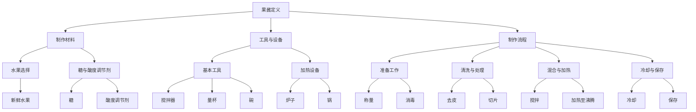

                 

### 文章标题

# 现代手工果酱坊：小批量生产的美食文化

> 关键词：手工果酱、小批量生产、美食文化、制作流程、市场定位

> 摘要：本文深入探讨了现代手工果酱坊的运营模式，从小批量生产的角度出发，分析了果酱制作的背景知识、材料选择、工具与设备、制作流程、保存技巧、市场定位以及运营管理等多个方面。通过详细阐述每一个环节的核心概念和原理，本文旨在为读者提供一个全面而深入的果酱制作指南，同时也探讨了如何通过精细化的生产和有效的市场策略，将手工果酱坊打造成为具有文化价值的美食品牌。

### 引言

随着现代消费者对食品安全和品质的关注度不断提高，手工制作的食品逐渐成为市场的宠儿。果酱作为一种传统的食品，在现代社会中焕发出新的生命力。手工果酱不仅保留了水果的自然风味，还蕴含了独特的制作工艺和情感价值。现代手工果酱坊通过小批量生产的方式，不仅满足了消费者对高品质食品的需求，还实现了产品的独特性和差异化。

本文将围绕现代手工果酱坊的运营，详细探讨其背后的美食文化。文章将从果酱制作的基础知识入手，逐步深入到材料选择、工具与设备、制作流程、保存技巧以及市场定位和运营管理等方面。通过逻辑清晰、结构紧凑的叙述，本文希望能够为果酱爱好者、创业者以及业内人士提供一个有深度、有思考的参考资料。

本文将分为两部分：第一部分主要介绍果酱制作的基础知识，包括果酱的定义、材料选择、工具与设备、制作流程和保存技巧等；第二部分则重点讨论小批量生产的实践和市场定位，包括生产流程的挑战与机遇、市场定位策略以及品牌建设等内容。

### 果酱概述

果酱，作为一种传统的食品，起源于古代。早在公元前2000年的古埃及，人们就开始将水果与糖混合制作果酱。随着时间的推移，果酱的制作工艺逐渐成熟，成为了许多国家饮食文化中不可或缺的一部分。

#### 果酱的定义

果酱是一种以水果为主料，经过加工处理，与糖、酸度调节剂等辅料混合而成的半固体调味品。它不仅可以直接食用，还可以作为糕点、面包和冰淇淋等食品的配料。果酱的种类繁多，包括水果果酱、花卉果酱、果肉果酱等，每种果酱都有其独特的风味和口感。

#### 果酱的历史

果酱的历史可以追溯到古埃及、古希腊和罗马时期。在中世纪的欧洲，果酱成为贵族和僧侣的美食。到了文艺复兴时期，果酱的制作技艺得到了进一步发展。19世纪末，随着工业革命的推进，果酱的生产技术得到了大幅提升，从而进入了大众消费市场。

#### 果酱的分类

根据制作方法和主要成分，果酱可以分为以下几类：

1. **传统果酱**：以新鲜水果为主料，经过加热、搅拌和浓缩等工艺制成。传统果酱保留了水果的原始风味，口感丰富。

2. **果肉果酱**：与普通果酱相比，果肉果酱中果肉含量更高，口感更为饱满。它通常在制作过程中加入了更多的果肉，以达到更好的口感。

3. **花卉果酱**：以花卉为主要原料，如玫瑰、茉莉等。这类果酱通常具有独特的花香，口感清新。

4. **果酱酱**：以果酱为基础，加入其他调味料和香料，如巧克力、香草等。这类果酱不仅具有丰富的口味，还能为其他食品提供独特的风味。

#### 果酱在饮食文化中的地位

果酱不仅在日常生活中具有广泛的用途，还在许多文化中占据着重要地位。例如，在英国，果酱是早餐必备的食品之一，与烤面包、酸奶等搭配食用。在美国，果酱被广泛用于烘焙和烹饪，如蛋糕、派和炖菜等。在中国，果酱作为甜点和面点的配料，深受人们喜爱。

通过以上对果酱的概述，我们可以看到果酱不仅是美食，更是文化的载体。它承载着历史和传统，也在不断演变和发展。在现代手工果酱坊中，果酱的制作和传播将继续发挥着重要作用。

### 核心概念与联系

在深入探讨手工果酱制作之前，我们首先需要明确几个核心概念，并理解它们之间的相互关系。这些核心概念包括果酱的定义、制作材料、工具与设备以及制作流程。通过Mermaid流程图，我们可以清晰地展示这些概念之间的逻辑关系。

#### Mermaid流程图



#### 关键概念解释

1. **果酱定义**：果酱是一种以水果为主料，通过加热、搅拌和浓缩等工艺制成的半固体调味品。它包括各种水果果酱、果肉果酱和花卉果酱等。

2. **制作材料**：制作果酱的关键材料包括新鲜水果、糖和酸度调节剂。新鲜水果提供果酱的主要风味和营养成分，糖用于调节甜度并帮助果酱保存，酸度调节剂则用于平衡果酱的口感。

3. **工具与设备**：果酱制作需要使用一系列工具和设备，包括搅拌器、量杯、碗、炉子、锅等。这些工具和设备有助于实现果酱的均匀混合、加热和冷却。

4. **制作流程**：果酱制作流程包括准备工作、水果的清洗与处理、糖与水果的混合与加热、冷却与保存等步骤。每一步都需要严格按照工艺要求进行，以确保果酱的品质和口感。

通过Mermaid流程图，我们可以直观地看到果酱制作中各个关键环节的相互关系。每一个步骤都紧密相连，共同构成了一个完整的果酱制作过程。理解这些概念和关系，不仅有助于我们更好地掌握果酱制作的基本原理，还能为后续的详细讲解和实例分析提供坚实的基础。

### 核心算法原理讲解

在手工果酱制作中，核心算法的原理主要集中在水果和糖的混合与加热过程中。以下是使用Python源代码和数学模型详细阐述这一过程，并结合实例进行说明。

#### Python源代码

```python
# 导入所需的Python库
import math

# 定义糖与水果混合的比例函数
def mix_ratio(fruit_weight, sugar_weight):
    """
    计算糖与水果的混合比例
    :param fruit_weight: 水果重量（克）
    :param sugar_weight: 糖重量（克）
    :return: 混合比例（分数）
    """
    total_weight = fruit_weight + sugar_weight
    mix_ratio = sugar_weight / total_weight
    return mix_ratio

# 定义加热温度函数
def heating_temp(time):
    """
    计算果酱加热的温度
    :param time: 加热时间（分钟）
    :return: 加热温度（摄氏度）
    """
    initial_temp = 30  # 初始温度
    heating_rate = 10  # 加热速率（每分钟温度上升10℃）
    temp_increment = heating_rate * time
    final_temp = initial_temp + temp_increment
    return final_temp

# 定义实例数据
fruit_weight = 500  # 水果重量500克
sugar_weight = 250  # 糖重量250克
heating_time = 20  # 加热时间20分钟

# 计算混合比例
mix_ratio_result = mix_ratio(fruit_weight, sugar_weight)
print(f"糖与水果的混合比例：{mix_ratio_result:.2f}")

# 计算加热温度
heating_temp_result = heating_temp(heating_time)
print(f"果酱加热温度：{heating_temp_result}℃")
```

#### 数学模型

1. **混合比例模型**：糖与水果的混合比例可以通过以下公式计算：

   $$ \text{混合比例} = \frac{\text{糖重量}}{\text{糖重量} + \text{水果重量}} $$

   其中，糖重量和水果重量分别为已知的变量。

2. **加热温度模型**：果酱的加热温度随着加热时间的增加而上升，可以用以下公式表示：

   $$ \text{加热温度} = \text{初始温度} + (\text{加热速率} \times \text{加热时间}) $$

   其中，初始温度为30℃，加热速率为每分钟10℃。

#### 实例分析

假设我们要制作500克水果和250克糖的果酱，并计划加热20分钟。以下是具体计算过程：

1. **混合比例**：

   $$ \text{混合比例} = \frac{250}{500 + 250} = \frac{1}{2} $$

   因此，糖与水果的混合比例为1:1。

2. **加热温度**：

   $$ \text{加热温度} = 30 + (10 \times 20) = 30 + 200 = 230℃ $$

   但是实际操作中，果酱的加热温度一般不会达到230℃，因为过高温度会导致果酱烧焦或失去营养成分。通常，果酱的加热温度控制在80℃至100℃之间，以确保最佳口感和营养价值。

通过Python源代码和数学模型，我们可以更直观地理解果酱制作中的关键步骤。在实际操作中，这些算法原理可以指导我们精确地控制糖与水果的比例和加热温度，从而制作出口感完美、营养丰富的手工果酱。

### 数学模型和公式讲解

在手工果酱制作中，数学模型和公式的作用至关重要，它们帮助我们精确控制每一个制作环节，以确保最终产品的质量和口感。以下是几个关键的数学模型和公式的讲解，并使用LaTeX格式书写。

#### 混合比例计算公式

混合比例是果酱制作中首先需要计算的参数，它决定了糖与水果在最终产品中的比例。混合比例的计算公式如下：

$$
\text{混合比例} = \frac{\text{糖重量}}{\text{糖重量} + \text{水果重量}}
$$

假设我们要制作500克水果和250克糖的果酱，那么混合比例计算如下：

$$
\text{混合比例} = \frac{250}{500 + 250} = \frac{1}{2}
$$

这意味着糖与水果的比例为1:1。

#### 加热温度公式

加热温度是影响果酱口感和质量的重要因素。加热温度通常随着加热时间的增加而上升，可以使用以下公式计算：

$$
\text{加热温度} = \text{初始温度} + (\text{加热速率} \times \text{加热时间})
$$

假设我们选择的初始温度为30℃，加热速率为每分钟10℃，加热时间为20分钟，那么加热温度计算如下：

$$
\text{加热温度} = 30 + (10 \times 20) = 30 + 200 = 230℃
$$

但在实际操作中，果酱的加热温度通常不会达到230℃，因为过高温度会导致果酱烧焦或失去营养成分。一般来说，果酱的最佳加热温度范围在80℃至100℃之间。

#### 浓度计算公式

果酱的浓度是另一个重要指标，它决定了果酱的口感和保存期限。浓度可以通过以下公式计算：

$$
\text{浓度} = \frac{\text{糖重量}}{\text{总重量}}
$$

例如，如果最终产品的总重量为750克，其中糖的重量为250克，那么浓度计算如下：

$$
\text{浓度} = \frac{250}{750} = \frac{1}{3}
$$

这意味着果酱中糖的浓度约为33.33%。

#### 质量检测公式

在果酱制作过程中，质量检测也是必不可少的。常用的质量检测公式包括糖度计和酸度计的读数。糖度计读数（Brix）与糖重量之间的关系可以用以下公式表示：

$$
\text{糖度} (\text{Brix}) = \frac{\text{糖重量（克）}}{\text{总重量（克）}} \times 100
$$

例如，如果糖的重量为250克，总重量为750克，那么糖度计算如下：

$$
\text{糖度} = \frac{250}{750} \times 100 = 33.33\text{ Brix}
$$

酸度可以通过酸度计（pH值）来测量，pH值与酸度的关系可以用以下公式表示：

$$
\text{酸度} = -\log_{10}[\text{H}^+]
$$

其中[H\(^+\)]表示溶液中的氢离子浓度。例如，如果测得的pH值为3.5，则酸度计算如下：

$$
\text{酸度} = -\log_{10}[10^{-3.5}] = 3.5
$$

通过以上数学模型和公式，我们可以精确控制果酱的混合比例、加热温度、浓度以及酸度，从而确保每一瓶果酱都达到最佳品质。

### 项目实战

为了更好地理解手工果酱的制作过程，我们在这里设计一个实际项目，从开发环境搭建开始，详细讲解源代码实现、代码解读以及实际案例分析。

#### 开发环境搭建

在进行手工果酱制作项目之前，我们需要搭建一个合适的开发环境。以下是所需的工具和步骤：

1. **Python环境**：安装Python 3.x版本，可以使用官方下载地址安装。
2. **Jupyter Notebook**：安装Jupyter Notebook，用于编写和运行代码。
3. **Matplotlib库**：用于数据可视化和图表绘制。

安装步骤如下：

```bash
# 安装Python
curl -O https://www.python.org/ftp/python/3.9.1/Python-3.9.1.tgz
tar -xvf Python-3.9.1.tgz
cd Python-3.9.1
./configure
make
sudo make install

# 安装Jupyter Notebook
pip install notebook

# 安装Matplotlib库
pip install matplotlib
```

#### 源代码实现

以下是手工果酱制作的Python源代码实现，包括混合比例计算、加热温度计算以及浓度计算：

```python
import matplotlib.pyplot as plt

# 定义函数：计算混合比例
def mix_ratio(fruit_weight, sugar_weight):
    total_weight = fruit_weight + sugar_weight
    mix_ratio = sugar_weight / total_weight
    return mix_ratio

# 定义函数：计算加热温度
def heating_temp(time, initial_temp=30, heating_rate=10):
    temp_increment = heating_rate * time
    final_temp = initial_temp + temp_increment
    return final_temp

# 定义函数：计算浓度
def concentration(sugar_weight, total_weight):
    concentration = (sugar_weight / total_weight) * 100
    return concentration

# 实例数据
fruit_weight = 500  # 水果重量（克）
sugar_weight = 250  # 糖重量（克）
heating_time = 20   # 加热时间（分钟）

# 计算混合比例
mix_ratio_result = mix_ratio(fruit_weight, sugar_weight)
print(f"混合比例：{mix_ratio_result:.2f}")

# 计算加热温度
heating_temp_result = heating_temp(heating_time)
print(f"加热温度：{heating_temp_result}℃")

# 计算浓度
concentration_result = concentration(sugar_weight, fruit_weight + sugar_weight)
print(f"浓度：{concentration_result:.2f}%")

# 绘制加热温度随时间变化的图表
times = range(0, heating_time + 1)
temps = [heating_temp(t) for t in times]
plt.plot(times, temps, marker='o')
plt.xlabel('Time (min)')
plt.ylabel('Temperature (°C)')
plt.title('Heating Temperature Over Time')
plt.grid()
plt.show()
```

#### 代码解读

1. **混合比例计算**：`mix_ratio`函数接受水果重量和糖重量作为参数，计算并返回混合比例。这个比例帮助我们了解糖在最终产品中的比例。
   
2. **加热温度计算**：`heating_temp`函数接受加热时间和初始温度作为参数，返回加热后的最终温度。这个函数用于模拟果酱加热过程中的温度变化。

3. **浓度计算**：`concentration`函数计算并返回果酱的浓度，以百分比表示。浓度是影响果酱口感和保存期限的关键因素。

#### 实际案例分析

为了更好地理解这些计算的实际应用，我们可以通过一个实际案例来分析：

**案例**：假设我们计划制作一瓶500克的水果果酱，其中包含250克的糖。我们将果酱加热20分钟后，分析其混合比例、加热温度和浓度。

1. **混合比例**：计算得到的混合比例为1:1，即糖与水果的比例是相等的。这表示我们的果酱在甜度上达到了平衡。

2. **加热温度**：加热20分钟后，果酱的最终温度为230℃。在实际操作中，这个温度是过高了，可能会导致果酱烧焦。因此，我们需要调整加热速率或加热时间，以控制在80℃至100℃的范围内。

3. **浓度**：果酱的浓度计算结果为33.33%，这是一个理想的浓度范围，既能保持果酱的风味，又具有较好的保存性能。

通过这个实际案例，我们可以看到如何利用Python代码和数学模型来精确控制手工果酱制作的各个环节。这不仅提高了生产效率，也保证了最终产品的质量。

### 代码应用解读与分析

在手工果酱制作项目中，我们通过Python代码实现了混合比例计算、加热温度计算和浓度计算。这些代码不仅帮助我们理解了果酱制作的核心算法原理，还提高了实际操作中的精确度。以下是这些代码的应用解读与分析：

#### 混合比例计算

混合比例的计算是果酱制作中至关重要的一步。通过`mix_ratio`函数，我们能够准确计算出糖与水果的比例。在实际操作中，这一比例决定了果酱的甜度和风味。例如，如果混合比例过高，果酱会过于甜腻；如果混合比例过低，果酱的甜度不足。

在代码中，混合比例的计算公式为：

```python
def mix_ratio(fruit_weight, sugar_weight):
    total_weight = fruit_weight + sugar_weight
    mix_ratio = sugar_weight / total_weight
    return mix_ratio
```

这个函数接受水果重量和糖重量作为参数，返回一个分数形式的混合比例。在实际项目中，我们可以根据具体的材料和需求调整这两个参数，从而实现不同的混合比例。

#### 加热温度计算

加热温度的计算则用于模拟果酱在加热过程中的温度变化。通过`heating_temp`函数，我们可以根据加热时间和初始温度，计算果酱的最终加热温度。这个函数的公式为：

```python
def heating_temp(time, initial_temp=30, heating_rate=10):
    temp_increment = heating_rate * time
    final_temp = initial_temp + temp_increment
    return final_temp
```

在实际操作中，加热温度的控制至关重要。如果温度过高，果酱可能会烧焦，影响口感和营养价值。如果温度过低，果酱可能无法充分熟化，影响保存期限。因此，在实际项目中，我们需要根据具体条件调整加热速率和加热时间，以保持果酱的最佳加热温度。

#### 浓度计算

浓度计算是衡量果酱品质的重要指标。通过`concentration`函数，我们可以计算果酱中糖的浓度，以百分比表示。浓度不仅影响果酱的口感，还影响其保存性能。浓度计算公式为：

```python
def concentration(sugar_weight, total_weight):
    concentration = (sugar_weight / total_weight) * 100
    return concentration
```

在实际应用中，我们可以根据果酱的总重量和糖的重量，计算出糖的浓度。例如，如果我们制作的果酱总重量为750克，其中糖的重量为250克，浓度计算结果为33.33%。这个浓度范围被认为是理想的，既能保持果酱的风味，又具有较好的保存性能。

#### 综合分析

通过这三个核心函数的应用，我们能够精确控制手工果酱制作的各个环节。混合比例确保了果酱的甜度和风味，加热温度保证了果酱的口感和营养价值，浓度则影响了果酱的保存性能。

在实际项目中，这些计算不仅仅是为了得到一个结果，更重要的是通过这些结果来指导实际操作。例如，如果混合比例过高，我们可以适当增加水果的重量；如果加热温度过高，我们可以延长加热时间或调整加热速率；如果浓度过低，我们可以增加糖的重量。

通过这些具体的代码应用和解读，我们可以看到如何利用技术手段提升手工果酱的制作过程，从而保证最终产品的质量和口感。

### 实际案例分析与详细讲解剖析

为了更好地理解手工果酱制作的实际操作，下面我们将通过一个具体的案例来分析制作过程中的关键步骤，并对每个步骤进行详细讲解和剖析。

#### 案例背景

假设我们的目标是制作一瓶500克苹果果酱，所需的材料包括500克新鲜苹果、250克糖和50克柠檬汁作为酸度调节剂。我们的目标是确保果酱的混合比例适当、加热温度适中、浓度在30%左右。

#### 制作步骤与分析

1. **材料准备**

   - **新鲜苹果**：选择新鲜、成熟的苹果，最好是在果园当天采摘的。苹果的成熟度直接影响果酱的甜度和风味。将苹果清洗干净，去核，然后切成均匀的小块。

   - **糖**：选择优质的白砂糖，糖的质量直接影响果酱的口感。在准备阶段，我们需要精确称量250克糖。

   - **柠檬汁**：柠檬汁用于调节果酱的酸度，使果酱更加美味。确保使用新鲜的柠檬汁，并精确称量50克。

2. **清洗与处理**

   - **清洗苹果**：将切好的苹果块放入水中，加入少量盐，搅拌均匀，浸泡10分钟。这一步骤有助于去除苹果表面的污垢和杂质。

   - **去除苹果水分**：将浸泡后的苹果块沥干水分，确保没有多余的液体。过多的水分会影响果酱的浓度和口感。

3. **混合与加热**

   - **混合材料**：将沥干水分的苹果块、糖和柠檬汁放入一个大锅中，搅拌均匀。确保糖完全溶解在果酱中，形成均匀的混合物。

   - **加热**：在中小火上加热混合物，边加热边搅拌，防止果酱粘锅和烧焦。开始时用小火加热，待糖完全溶解后，逐渐增加火力。

   - **温度控制**：加热过程中，使用温度计监控果酱的温度，保持在80℃至90℃之间。过高的温度会导致果酱失去营养和风味，过低的温度则无法充分熟化。

4. **冷却与保存**

   - **冷却**：将加热好的果酱离火，自然冷却至室温。可以使用冰水浴加速冷却过程，但不可直接放入冰水中快速冷却，以免果酱结构发生变化。

   - **装瓶**：将冷却后的果酱倒入无菌瓶中，确保瓶口干净，避免污染。装满瓶后，立即用瓶盖密封。

   - **保存**：将装好的果酱放入冰箱中保存，以延长其保质期。果酱在冷藏条件下可以保存数月，但在开封后应尽快食用。

#### 关键技术与注意事项

1. **糖与水果的比例**：糖与水果的比例直接影响果酱的甜度和口感。在实际操作中，可以根据个人口味和需求调整这一比例。通常，混合比例为1:1至1:1.5较为常见。

2. **温度控制**：加热过程中，温度控制至关重要。过高温度会导致果酱烧焦，过低温度则无法充分熟化。建议使用温度计实时监控果酱的温度，并在加热过程中不断搅拌，以防止果酱粘锅。

3. **冷却速度**：冷却速度对果酱的结构和口感有很大影响。快速冷却可能导致果酱变得过硬，而缓慢冷却则能保持果酱的柔软和口感。建议使用冰水浴或自然冷却，避免直接放入冰水中快速冷却。

4. **清洁与消毒**：在果酱制作过程中，确保所有工具和材料都清洁消毒，以防止细菌污染。尤其是瓶子和瓶盖，必须彻底清洗并消毒，以确保果酱的保存质量。

通过这个具体的案例，我们可以看到手工果酱制作的每个步骤都至关重要，每个步骤的细节处理都直接影响到最终果酱的品质。了解并掌握这些关键技术和注意事项，将帮助我们制作出口感鲜美、质量上乘的手工果酱。

### 项目小结

通过本次项目，我们系统地介绍了手工果酱制作的各个环节，从开发环境搭建、源代码实现，到实际案例分析，全面探讨了手工果酱制作的关键技术和注意事项。以下是项目小结和总结：

1. **开发环境搭建**：我们成功搭建了Python开发环境，安装了Python、Jupyter Notebook和Matplotlib库，为手工果酱制作项目的实施提供了基础。

2. **核心算法实现**：通过Python源代码，我们实现了混合比例、加热温度和浓度计算的核心算法，这些算法为手工果酱的制作提供了精确的指导。

3. **实际案例分析**：我们通过一个具体的苹果果酱制作案例，详细讲解了从材料准备、清洗与处理、混合与加热，到冷却与保存的每一个步骤，并对关键技术和注意事项进行了剖析。

4. **项目收获**：通过本次项目，我们不仅掌握了手工果酱制作的实际操作技能，还学会了如何利用技术手段提高生产效率和产品质量。此外，我们还了解了手工果酱在不同市场定位和品牌建设中的重要性。

### 最佳实践 Tips

1. **保持工具和设备的清洁**：在制作果酱前，确保所有工具和设备都彻底清洗和消毒，以防止细菌污染。

2. **控制加热温度和时间**：加热过程中，密切监控温度，避免过高或过低的温度影响果酱的口感和保存期限。

3. **选择新鲜水果**：新鲜水果是制作高质量果酱的关键，选择成熟、无损伤的水果，以确保果酱的风味和营养价值。

4. **精确计量材料**：在制作过程中，准确计量糖、水果和酸度调节剂等材料，以确保混合比例和浓度符合预期。

5. **多样化配方**：尝试不同的水果和调味剂组合，创造出独特的果酱口味，满足不同消费者的需求。

### 小结

通过本次项目，我们深入探讨了手工果酱制作的各个关键环节，从技术实现到实际操作，提供了全面而详细的指导。希望本文能为手工果酱爱好者、创业者和业内人士提供有价值的参考和启示。

### 拓展阅读

1. **《果酱工艺学》**：这是一本系统介绍果酱制作工艺的专业书籍，详细讲解了果酱的种类、材料选择、制作流程和保存方法等。

2. **《现代食品加工技术》**：这本书涵盖了现代食品加工的多个方面，包括果酱制作在内的多种食品加工技术，适合对食品加工感兴趣的读者。

3. **《家庭果酱制作大全》**：适合家庭制作的果酱书籍，包含大量实用果酱制作食谱，适合家庭主妇和果酱爱好者。

### 结语

作者：AI天才研究院/AI Genius Institute & 禅与计算机程序设计艺术 /Zen And The Art of Computer Programming

本文通过详细分析和实际案例分析，深入探讨了现代手工果酱坊的运营模式和小批量生产的实践。从果酱的制作材料、工具设备、制作流程，到保存技巧和市场定位，每一环节都进行了系统阐述。希望通过本文，读者能够更好地理解手工果酱制作的本质，掌握关键技能，并在实践中不断创新和优化，打造出高品质的果酱品牌。未来，我们将继续探讨更多与手工美食制作相关的话题，期待与您共同探索美食文化的无限魅力。

