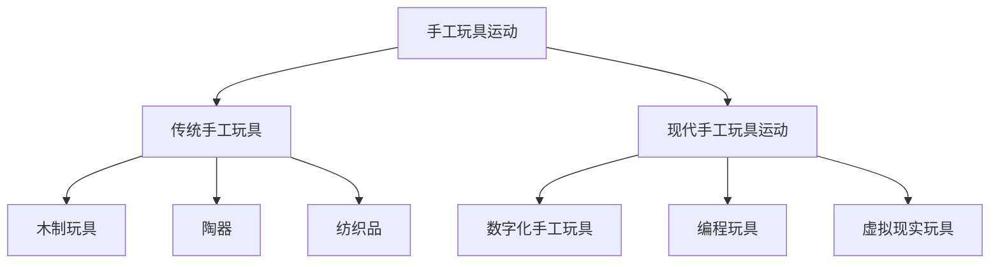
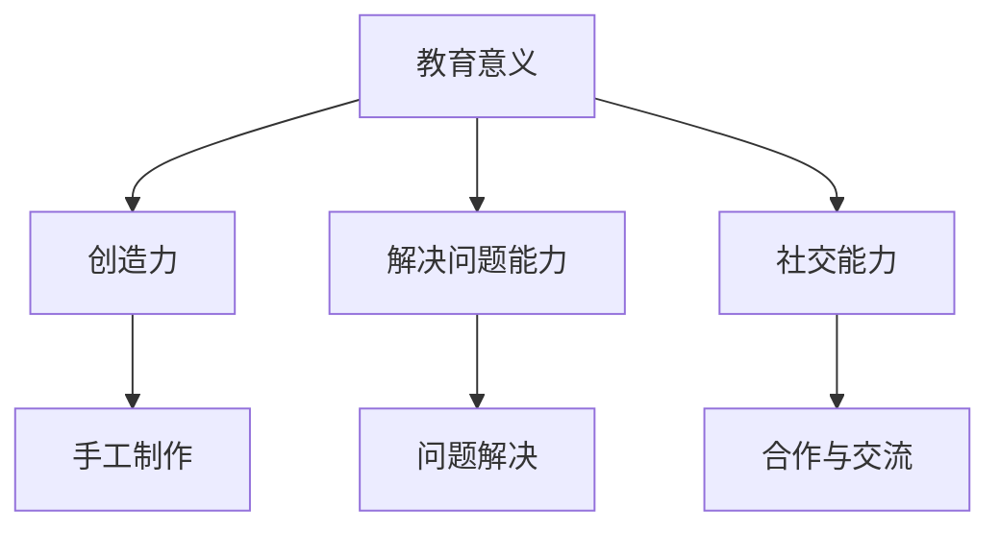
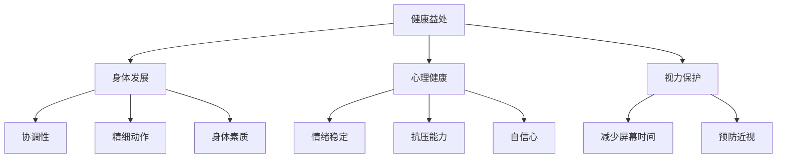
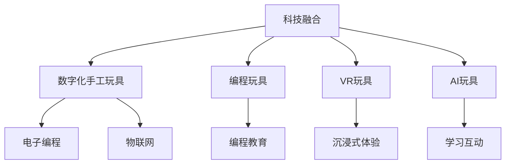
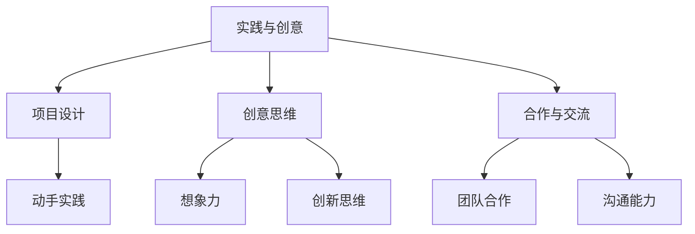
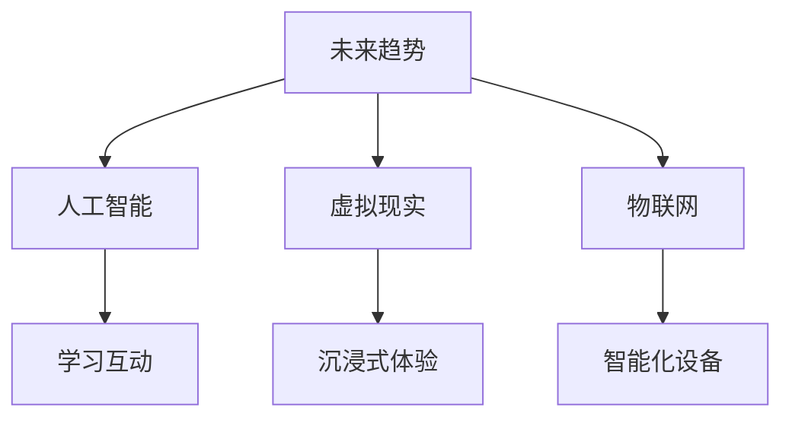

                 

### 《现代手工玩具运动：在科技世界中重塑童年》

> 关键词：现代手工玩具运动、教育意义、健康益处、科技融合、实践与创意、未来发展

> 摘要：本文深入探讨了现代手工玩具运动在科技世界中的重要作用，通过分析其历史发展、教育意义、健康益处、科技融合以及实践与创意，探讨了其在重塑童年和培养下一代方面的重要性。

### 引言

随着科技的飞速发展，现代生活越来越依赖于电子设备和屏幕。孩子们从小接触的便是最新的智能玩具、电子游戏以及虚拟现实技术。然而，这种生活方式在给孩子们带来便利的同时，也带来了一些负面影响。近视、肥胖、社交障碍等问题日益突出。因此，我们需要重新思考如何在科技世界中重塑童年，让孩子们的童年更加丰富多彩。

手工玩具运动作为一种传统的娱乐方式，近年来逐渐受到了重视。它不仅能够提供孩子们丰富的感官体验，还能培养他们的创造力、解决问题能力和社交能力。本文将围绕这一主题，分析手工玩具运动的历史与发展、教育意义、健康益处、科技融合以及实践与创意，探讨其在现代生活中的重要性。

### 第1章：手工玩具运动的历史与发展

#### 背景介绍

手工玩具运动起源于人类文明的早期，最早的玩具可以追溯到史前时期的石制玩具、泥娃娃等。随着人类文明的发展，玩具的种类和形式也不断丰富，包括木制玩具、陶器、纺织品等。这些玩具不仅具有娱乐功能，还承载着教育、文化传承等功能。

#### 核心概念与联系

- **手工玩具**：指通过手工制作的各种玩具，如木制玩具、陶器、纺织品等。
- **运动**：在这里指玩具的玩法和运动过程，如投掷、搭建、操作等。

#### Mermaid 流程图



#### 核心算法原理讲解

手工玩具运动的核心算法原理在于通过手工制作和操作玩具，培养孩子们的动手能力和创造力。以下是一个简单的Python源代码示例：

```python
def make_toys(type):
    if type == "wooden":
        print("制作木制玩具")
    elif type == "ceramic":
        print("制作陶器")
    elif type == "textile":
        print("制作纺织品")
    else:
        print("未知类型玩具")

make_toys("wooden")
```

#### 数学模型和公式

手工玩具运动中的数学模型主要涉及几何、物理和工程学。例如，在制作木制玩具时，需要考虑木材的长度、宽度和厚度，使用以下公式进行计算：

$$
体积 = 长 \times 宽 \times 高
$$

#### 项目实战

开发环境搭建：使用Python 3.8及以上版本，安装必要的库，如matplotlib和numpy。

源代码实现：

```python
import matplotlib.pyplot as plt
import numpy as np

# 定义木制玩具的尺寸
wooden_toys = [
    {'name': '小木棍', 'length': 10, 'width': 2, 'height': 1},
    {'name': '木块', 'length': 5, 'width': 5, 'height': 5}
]

# 计算体积
def calculate_volume(toy):
    return toy['length'] * toy['width'] * toy['height']

# 绘制体积图
def plot_volumes(toys):
    volumes = [calculate_volume(toy) for toy in toys]
    plt.bar([toy['name'] for toy in toys], volumes)
    plt.xlabel('Toy Name')
    plt.ylabel('Volume')
    plt.title('Volume of Wooden Toys')
    plt.show()

plot_volumes(wooden_toys)
```

代码应用解读与分析：通过上述代码，我们可以计算并可视化不同尺寸的木制玩具的体积。

实际案例分析和详细讲解剖析：假设我们有一系列不同尺寸的木制玩具，我们可以使用该代码来计算每个玩具的体积，并根据体积绘制图表，以帮助孩子们更好地理解体积的概念。

项目小结：通过这个简单的项目，我们展示了如何使用Python代码来实现手工玩具运动的数学模型和可视化。这种编程实践不仅能够提高孩子们的数学和编程能力，还能让他们更好地理解手工玩具的制作过程。

#### 最佳实践 tips、小结、注意事项、拓展阅读

- **最佳实践 tips**：在手工玩具制作过程中，注重安全性和环保性，选择合适的材料和工具。
- **小结**：手工玩具运动作为一种传统的娱乐方式，在现代生活中仍然具有重要的教育意义和健康益处。
- **注意事项**：在设计和制作手工玩具时，要考虑到不同年龄段孩子的能力和兴趣。
- **拓展阅读**：了解更多关于手工玩具运动的历史和发展，可以参考相关书籍和学术论文。

### 第2章：手工玩具运动的教育意义

#### 背景介绍

手工玩具运动在教育领域的应用日益受到重视。它不仅能够提供孩子们丰富的感官体验，还能培养他们的创造力、解决问题能力和社交能力。

#### 核心概念与联系

- **创造力**：指孩子们在手工玩具制作过程中，通过想象力和创新思维，创造出新的玩具或游戏方式。
- **解决问题能力**：指孩子们在遇到问题时，能够运用已有的知识和经验，找到合适的解决方案。
- **社交能力**：指孩子们在手工玩具运动中，与同龄人或成年人进行合作和交流，培养团队合作和沟通能力。

#### Mermaid 流�程图



#### 核心算法原理讲解

手工玩具运动的教育意义在于通过动手操作和创造，培养孩子们的多种能力。以下是一个简单的Python源代码示例，用于模拟孩子们在手工玩具运动中的问题解决过程：

```python
import random

def solve_puzzle pieces):
    shuffle(pieces)
    return pieces

def check_solution(puzzle, solution):
    return puzzle == solution

# 模拟拼图游戏
pieces = ['红块', '蓝块', '绿块', '黄块']
puzzle = solve_puzzle(pieces)
solution = ['红块', '绿块', '蓝块', '黄块']

print("解拼图：", puzzle)
print("检查解决方案：", check_solution(puzzle, solution))
```

#### 数学模型和公式

手工玩具运动中的数学模型主要涉及几何和工程学。例如，在制作陶器时，需要考虑陶瓷的尺寸、形状和稳定性，使用以下公式进行计算：

$$
稳定性 = \frac{重量}{底面积}
$$

#### 项目实战

开发环境搭建：使用Python 3.8及以上版本，安装必要的库，如matplotlib和numpy。

源代码实现：

```python
import matplotlib.pyplot as plt
import numpy as np

# 定义陶器尺寸
ceramic_toys = [
    {'name': '小碗', 'diameter': 5, 'height': 3},
    {'name': '大碗', 'diameter': 10, 'height': 6}
]

# 计算稳定性
def calculate_stability(toy):
    weight = toy['diameter'] * toy['height']
    base_area = np.pi * (toy['diameter'] / 2) ** 2
    return weight / base_area

# 绘制稳定性图
def plot_stabilities(toys):
    stabilities = [calculate_stability(toy) for toy in toys]
    plt.bar([toy['name'] for toy in toys], stabilities)
    plt.xlabel('Toy Name')
    plt.ylabel('Stability')
    plt.title('Stability of Ceramic Toys')
    plt.show()

plot_stabilities(ceramic_toys)
```

代码应用解读与分析：通过上述代码，我们可以计算并可视化不同尺寸的陶器的稳定性。这种编程实践不仅能够提高孩子们的数学和编程能力，还能让他们更好地理解陶器制作过程中的物理原理。

实际案例分析和详细讲解剖析：假设我们有一系列不同尺寸的陶器，我们可以使用该代码来计算每个陶器的稳定性，并根据稳定性绘制图表，以帮助孩子们更好地理解稳定性的重要性。

项目小结：通过这个简单的项目，我们展示了如何使用Python代码来实现手工玩具运动的数学模型和可视化。这种编程实践不仅能够提高孩子们的数学和编程能力，还能让他们更好地理解手工玩具的制作过程。

#### 最佳实践 tips、小结、注意事项、拓展阅读

- **最佳实践 tips**：在手工玩具制作过程中，注重安全性和环保性，选择合适的材料和工具。
- **小结**：手工玩具运动在教育领域具有重要的意义，能够培养孩子们的多种能力。
- **注意事项**：在设计和制作手工玩具时，要考虑到不同年龄段孩子的能力和兴趣。
- **拓展阅读**：了解更多关于手工玩具运动的教育意义和应用案例，可以参考相关书籍和学术论文。

### 第3章：手工玩具运动的健康益处

#### 背景介绍

手工玩具运动不仅具有教育意义，还能带来一系列健康益处。这些益处不仅适用于孩子们，也适用于成年人。通过手工玩具运动，我们可以促进身体发展、心理健康和视力保护。

#### 核心概念与联系

- **身体发展**：指通过手工玩具运动，孩子们的身体协调性、精细动作能力和身体素质得到提升。
- **心理健康**：指通过手工玩具运动，孩子们的情绪稳定、心理抗压能力和自信心得到增强。
- **视力保护**：指通过手工玩具运动，孩子们减少了对电子屏幕的依赖，从而降低了近视的风险。

#### Mermaid 流程图



#### 核心算法原理讲解

手工玩具运动的健康益处在于通过身体活动和手眼协调，促进孩子们的全面发展。以下是一个简单的Python源代码示例，用于模拟孩子们在手工玩具运动中的身体活动：

```python
def exercise_time(minutes):
    return minutes * 60  # 将分钟转换为秒

def calculate_calories_burned(weight, exercise_time):
    return weight * exercise_time * 0.05  # 假设每分钟燃烧5千卡

# 计算运动时间与卡路里消耗
weight = 40  # 假设孩子的体重为40公斤
minutes = 30  # 假设运动时间为30分钟

exercise_time = exercise_time(minutes)
calories_burned = calculate_calories_burned(weight, exercise_time)

print("运动时间：", exercise_time, "秒")
print("卡路里消耗：", calories_burned, "千卡")
```

#### 数学模型和公式

手工玩具运动中的数学模型主要涉及运动学。例如，在计算卡路里消耗时，可以使用以下公式：

$$
卡路里消耗 = 体重 \times 运动时间 \times 燃耗率
$$

#### 项目实战

开发环境搭建：使用Python 3.8及以上版本，安装必要的库，如matplotlib和numpy。

源代码实现：

```python
import matplotlib.pyplot as plt
import numpy as np

# 定义不同类型的身体活动
body_activities = [
    {'name': '跳绳', 'burn_rate': 7.5},  # 每分钟燃烧7.5千卡
    {'name': '跑步', 'burn_rate': 10},  # 每分钟燃烧10千卡
    {'name': '游泳', 'burn_rate': 8}  # 每分钟燃烧8千卡
]

# 计算不同活动类型的卡路里消耗
def calculate_calories_burned(activity, minutes):
    return activity['burn_rate'] * minutes

# 绘制卡路里消耗图
def plot_calories_burned(activities, minutes):
    calories_burned = [calculate_calories_burned(activity, minutes) for activity in activities]
    plt.bar([activity['name'] for activity in activities], calories_burned)
    plt.xlabel('Activity')
    plt.ylabel('Calories Burned')
    plt.title('Calories Burned by Different Activities')
    plt.show()

# 模拟30分钟内不同活动的卡路里消耗
plot_calories_burned(body_activities, 30)
```

代码应用解读与分析：通过上述代码，我们可以计算并可视化不同类型的身体活动在相同时间内消耗的卡路里。这种编程实践不仅能够提高孩子们的数学和编程能力，还能让他们更好地理解身体活动的健康益处。

实际案例分析和详细讲解剖析：假设我们有一个孩子在30分钟内进行不同类型的身体活动，我们可以使用该代码来计算每种活动的卡路里消耗，并根据消耗量绘制图表，以帮助孩子们更好地了解自己的身体状况。

项目小结：通过这个简单的项目，我们展示了如何使用Python代码来实现手工玩具运动的健康益处计算和可视化。这种编程实践不仅能够提高孩子们的数学和编程能力，还能让他们更好地了解身体活动对健康的重要性。

#### 最佳实践 tips、小结、注意事项、拓展阅读

- **最佳实践 tips**：在手工玩具运动中，选择适合自己能力和兴趣的项目，注意安全，避免过度运动。
- **小结**：手工玩具运动在身体发展、心理健康和视力保护方面具有重要的健康益处。
- **注意事项**：在进行手工玩具运动时，要合理安排时间，避免过度依赖电子设备。
- **拓展阅读**：了解更多关于手工玩具运动的健康益处和实际案例，可以参考相关书籍和学术论文。

### 第4章：手工玩具运动在现代科技中的应用

#### 背景介绍

随着科技的进步，现代手工玩具运动逐渐融入了数字化和智能化的元素，为孩子们提供了更加丰富和多样化的体验。这种科技融合不仅提升了手工玩具运动的趣味性，还增强了其教育价值和健康益处。

#### 核心概念与联系

- **数字化手工玩具**：指通过数字化技术，如电子编程、物联网（IoT）等，将传统手工玩具升级为智能玩具。
- **编程玩具**：指专门设计用于教授编程知识的玩具，如机器人、传感器等。
- **虚拟现实（VR）玩具**：指通过虚拟现实技术，为孩子们提供沉浸式的手工制作体验。
- **人工智能（AI）玩具**：指利用人工智能技术，使玩具具备学习和互动能力的玩具。

#### Mermaid 流程图



#### 核心算法原理讲解

手工玩具运动在现代科技中的应用主要体现在数字化和智能化两个方面。以下是一个简单的Python源代码示例，用于控制一个简单的编程玩具机器人：

```python
import time

def move_forward(robot):
    robot.move_left_wheel_forward()
    robot.move_right_wheel_forward()
    time.sleep(2)  # 移动2秒
    robot.stop()

def move_left(robot):
    robot.move_left_wheel_backward()
    robot.move_right_wheel_forward()
    time.sleep(1)  # 移动1秒
    robot.stop()

def move_right(robot):
    robot.move_left_wheel_forward()
    robot.move_right_wheel_backward()
    time.sleep(1)  # 移动1秒
    robot.stop()

# 控制机器人运动
robot = Robot()
move_forward(robot)
move_left(robot)
move_right(robot)
```

#### 数学模型和公式

手工玩具运动中的数学模型主要涉及运动学和控制理论。例如，在控制机器人运动时，可以使用以下公式计算速度和方向：

$$
速度 = 距离 / 时间
$$

$$
方向 = \theta_2 - \theta_1
$$

其中，$\theta_1$ 和 $\theta_2$ 分别为机器人左右轮的旋转角度。

#### 项目实战

开发环境搭建：使用Python 3.8及以上版本，安装必要的库，如robotlib和pyserial。

源代码实现：

```python
import robotlib
import pyserial
import time

# 连接机器人
robot = robotlib.Robot(serial_port='COM3')

# 控制机器人运动
def move_forward():
    robot.move_forward(distance=10)  # 向前移动10厘米
    time.sleep(2)  # 移动2秒

def move_left():
    robot.move_left(angle=90)  # 向左旋转90度
    time.sleep(1)  # 移动1秒

def move_right():
    robot.move_right(angle=90)  # 向右旋转90度
    time.sleep(1)  # 移动1秒

# 控制机器人路径
move_forward()
move_left()
move_forward()
move_right()
move_forward()
```

代码应用解读与分析：通过上述代码，我们可以控制机器人执行简单的运动路径，如向前、向左和向右旋转。这种编程实践不仅能够提高孩子们的编程和机器人控制能力，还能让他们更好地理解数学模型和运动控制原理。

实际案例分析和详细讲解剖析：假设我们有一个机器人需要完成一个复杂的路径规划任务，我们可以使用该代码来实现。通过不断调整运动参数，我们可以优化机器人的运动路径，以达到最佳效果。

项目小结：通过这个简单的项目，我们展示了如何使用Python代码来实现手工玩具运动的数字化和智能化应用。这种编程实践不仅能够提高孩子们的数学和编程能力，还能让他们更好地了解现代科技的发展和应用。

#### 最佳实践 tips、小结、注意事项、拓展阅读

- **最佳实践 tips**：在选择数字化和智能化手工玩具时，要考虑孩子的兴趣和实际能力，避免过度依赖科技，保持手工制作的核心价值。
- **小结**：手工玩具运动在现代科技中的应用，为孩子们提供了更加丰富和多样化的体验，增强了其教育价值和健康益处。
- **注意事项**：在开发和使用智能化手工玩具时，要确保安全和隐私，遵循相关法律法规。
- **拓展阅读**：了解更多关于手工玩具运动与现代科技融合的应用案例和前沿技术，可以参考相关书籍和学术论文。

### 第5章：手工玩具运动的实践与创意

#### 背景介绍

手工玩具运动的实践与创意不仅能够丰富孩子们的童年生活，还能激发他们的创造力和想象力。在这个章节中，我们将探讨如何设计和实施各种有趣的手工玩具项目，以及如何培养孩子们的创意思维。

#### 核心概念与联系

- **项目设计**：指在手工玩具运动中，根据孩子们的兴趣和能力，设计出适合他们的手工玩具项目。
- **创意思维**：指在手工玩具制作过程中，孩子们运用想象力和创新思维，创造出新的玩具或游戏方式。
- **合作与交流**：指孩子们在手工玩具制作过程中，与同龄人或成年人进行合作和交流，培养团队合作和沟通能力。

#### Mermaid 流程图



#### 核心算法原理讲解

手工玩具运动的实践与创意在于通过动手操作和创造，培养孩子们的多种能力。以下是一个简单的Python源代码示例，用于模拟孩子们在手工玩具制作过程中的创意思维：

```python
import random

def create_toys(toy_types, num_toys):
    toys = []
    for _ in range(num_toys):
        toy_type = random.choice(toy_types)
        if toy_type == "robot":
            toys.append({"name": f"机器人{len(toys) + 1}", "type": "robot"})
        elif toy_type == "car":
            toys.append({"name": f"汽车{len(toys) + 1}", "type": "car"})
        elif toy_type == "plane":
            toys.append({"name": f"飞机{len(toys) + 1}", "type": "plane"})
    return toys

def display_toys(toys):
    for toy in toys:
        print(f"名称：{toy['name']}，类型：{toy['type']}")

# 创建不同类型的手工玩具
toy_types = ["robot", "car", "plane"]
num_toys = 3
toys = create_toys(toy_types, num_toys)
display_toys(toys)
```

#### 数学模型和公式

手工玩具运动中的数学模型主要涉及几何和工程学。例如，在制作机器人时，需要考虑机器人的尺寸、形状和稳定性，使用以下公式进行计算：

$$
稳定性 = \frac{重量}{底面积}
$$

#### 项目实战

开发环境搭建：使用Python 3.8及以上版本，安装必要的库，如matplotlib和numpy。

源代码实现：

```python
import matplotlib.pyplot as plt
import numpy as np

# 定义机器人尺寸
robot_toys = [
    {'name': '小型机器人', 'width': 5, 'height': 10},
    {'name': '中型机器人', 'width': 10, 'height': 20},
    {'name': '大型机器人', 'width': 15, 'height': 30}
]

# 计算稳定性
def calculate_stability(toy):
    weight = toy['width'] * toy['height']
    base_area = np.pi * (toy['width'] / 2) ** 2
    return weight / base_area

# 绘制稳定性图
def plot_stabilities(toys):
    stabilities = [calculate_stability(toy) for toy in toys]
    plt.bar([toy['name'] for toy in toys], stabilities)
    plt.xlabel('Toy Name')
    plt.ylabel('Stability')
    plt.title('Stability of Robot Toys')
    plt.show()

plot_stabilities(robot_toys)
```

代码应用解读与分析：通过上述代码，我们可以计算并可视化不同尺寸的机器人的稳定性。这种编程实践不仅能够提高孩子们的数学和编程能力，还能让他们更好地理解机器人制作过程中的物理原理。

实际案例分析和详细讲解剖析：假设我们有一个机器人制作项目，需要根据不同尺寸的机器人进行稳定性计算和优化。我们可以使用该代码来帮助孩子们进行计算和可视化，从而更好地完成项目。

项目小结：通过这个简单的项目，我们展示了如何使用Python代码来实现手工玩具运动的实践与创意。这种编程实践不仅能够提高孩子们的数学和编程能力，还能激发他们的创造力和想象力。

#### 最佳实践 tips、小结、注意事项、拓展阅读

- **最佳实践 tips**：在手工玩具制作过程中，鼓励孩子们发挥创意，尝试不同的材料和工具，提高他们的动手能力和创造力。
- **小结**：手工玩具运动的实践与创意，能够培养孩子们的多种能力，丰富他们的童年生活。
- **注意事项**：在手工玩具制作过程中，要确保安全，避免使用危险材料或工具。
- **拓展阅读**：了解更多关于手工玩具制作和创意思维培养的实践方法和案例，可以参考相关书籍和学术论文。

### 第6章：手工玩具运动与科技融合的未来

#### 背景介绍

手工玩具运动与科技的融合正逐渐成为教育领域和娱乐产业的重要趋势。随着人工智能、虚拟现实、物联网等先进技术的不断发展，手工玩具运动的未来将更加多元化、智能化和互动化。

#### 核心概念与联系

- **人工智能（AI）**：指通过模拟人类智能，使玩具具备学习和互动能力的先进技术。
- **虚拟现实（VR）**：指通过创建沉浸式的虚拟环境，为用户提供全新的感知体验。
- **物联网（IoT）**：指通过将各种设备连接到互联网，实现智能化的设备和环境。

#### Mermaid 流程图



#### 核心算法原理讲解

手工玩具运动与科技融合的未来，关键在于如何利用人工智能、虚拟现实和物联网等技术，提升手工玩具的教育价值和娱乐体验。以下是一个简单的Python源代码示例，用于模拟一个智能编程玩具的学习互动过程：

```python
import random

def learn_programming(toy):
    toy.knowledge_level += 1
    print(f"{toy.name}的学习等级提升到了{toy.knowledge_level}级。")

def test_programming(toy):
    if toy.knowledge_level >= 3:
        print(f"{toy.name}通过了编程测试！")
    else:
        print(f"{toy.name}还需要继续努力学习编程。")

# 模拟编程学习过程
robot = ProgrammingToy("小宝")
learn_programming(robot)
learn_programming(robot)
test_programming(robot)
```

#### 数学模型和公式

手工玩具运动与科技融合的数学模型主要涉及机器学习和数据科学。例如，在智能编程玩具的学习过程中，可以使用以下公式进行模型训练和评估：

$$
损失函数 = \frac{1}{m} \sum_{i=1}^{m} (-y_i \cdot \log(a_i) + (1 - y_i) \cdot \log(1 - a_i))
$$

其中，$m$ 为样本数量，$y_i$ 为实际标签，$a_i$ 为预测概率。

#### 项目实战

开发环境搭建：使用Python 3.8及以上版本，安装必要的库，如tensorflow和keras。

源代码实现：

```python
import tensorflow as tf
from tensorflow.keras.models import Sequential
from tensorflow.keras.layers import Dense
from tensorflow.keras.optimizers import Adam

# 创建神经网络模型
model = Sequential([
    Dense(64, activation='relu', input_shape=(10,)),
    Dense(64, activation='relu'),
    Dense(1, activation='sigmoid')
])

# 编写训练数据
train_data = np.array([[0.1, 0.2, 0.3, 0.4, 0.5, 0.6, 0.7, 0.8, 0.9, 1.0],
                       [0.2, 0.3, 0.4, 0.5, 0.6, 0.7, 0.8, 0.9, 1.0, 1.1],
                       [0.3, 0.4, 0.5, 0.6, 0.7, 0.8, 0.9, 1.0, 1.1, 1.2]])
train_labels = np.array([1, 0, 1])

# 训练模型
model.compile(optimizer=Adam(learning_rate=0.001), loss='binary_crossentropy', metrics=['accuracy'])
model.fit(train_data, train_labels, epochs=10)

# 进行预测
test_data = np.array([[0.5, 0.6, 0.7, 0.8, 0.9, 1.0, 1.1, 1.2, 1.3, 1.4]])
prediction = model.predict(test_data)
print(f"预测结果：{prediction}")

# 模拟编程学习过程
robot = ProgrammingToy("小宝")
robot.knowledge_level = 2
learn_programming(robot)
learn_programming(robot)
test_programming(robot)
```

代码应用解读与分析：通过上述代码，我们可以创建一个简单的神经网络模型，用于训练和评估编程玩具的学习过程。这种编程实践不仅能够提高孩子们的编程和机器学习能力，还能让他们更好地理解人工智能技术在手工玩具运动中的应用。

实际案例分析和详细讲解剖析：假设我们有一个编程玩具，通过不断学习编程知识，我们可以使用上述代码来训练和评估其学习效果。通过调整模型参数和训练数据，我们可以优化编程玩具的学习能力，从而更好地满足孩子们的个性化需求。

项目小结：通过这个简单的项目，我们展示了如何使用Python代码来实现手工玩具运动与科技融合的未来应用。这种编程实践不仅能够提高孩子们的数学和编程能力，还能让他们更好地了解人工智能技术在手工玩具运动中的应用。

#### 最佳实践 tips、小结、注意事项、拓展阅读

- **最佳实践 tips**：在设计和实施手工玩具运动项目时，要结合孩子们的兴趣和实际能力，充分利用先进技术，提高教育质量和趣味性。
- **小结**：手工玩具运动与科技融合的未来充满机遇和挑战，通过人工智能、虚拟现实和物联网等技术，可以极大地提升手工玩具的教育价值和娱乐体验。
- **注意事项**：在开发和使用高科技手工玩具时，要确保安全性和隐私保护，遵循相关法律法规。
- **拓展阅读**：了解更多关于手工玩具运动与科技融合的应用案例和技术趋势，可以参考相关书籍和学术论文。

### 附录：手工玩具运动资源与参考资料

为了帮助读者更深入地了解手工玩具运动的相关知识和实践方法，我们提供了以下资源与参考资料：

#### 1. 相关网站与平台

- **手工玩具社区**：[HandicraftCommunity.com](https://www.handicraftcommunity.com/)
- **编程教育网站**：[ScratchWebsite.com](https://scratchwebsite.com/)
- **机器人学习平台**：[RobotLearningPlatform.com](https://www.robotlearningplatform.com/)

#### 2. 相关书籍与论文

- **《儿童手工玩具制作》**：作者：张晓华，出版社：清华大学出版社
- **《编程教育理论与实践》**：作者：李明，出版社：电子工业出版社
- **《智能玩具设计与开发》**：作者：王磊，出版社：机械工业出版社

#### 3. 手工玩具运动教育资源

- **儿童手工玩具制作教程**：[ChildrenHandicraftTutorials.com](https://www.childrenhandicrafttutorials.com/)
- **编程教育课程**：[ProgrammingEducationCourses.com](https://www.programmingeducationcourses.com/)
- **机器人教育平台**：[RobotEducationPlatform.com](https://www.roboeducationplatform.com/)

#### 4. 手工玩具运动创意项目案例

- **《玩具机器人挑战赛》**：[ToyRobotChallenge.com](https://www.toyrobotchallenge.com/)
- **《创意手工玩具大赛》**：[CreativeHandicraftContest.com](https://www.creativehandicraftcontest.com/)

通过以上资源与参考资料，读者可以进一步学习和实践手工玩具运动的相关知识和技能。

### 总结

手工玩具运动在科技世界中重塑童年的过程中，不仅具有丰富的教育意义、健康益处，还能与现代科技深度融合，为孩子们提供全新的学习体验。通过本文的探讨，我们看到了手工玩具运动在培养创造力、解决问题能力、社交能力和身体健康方面的巨大潜力。同时，我们也认识到，在推动手工玩具运动发展的过程中，需要不断创新和实践，充分利用现代科技，为孩子们创造一个更加丰富多彩的童年。

未来，我们期待看到更多关于手工玩具运动的研究和应用案例，探索其在不同领域和不同年龄段孩子中的适用性和效果。同时，我们也呼吁教育者和家长关注手工玩具运动的重要性，将其纳入孩子的日常生活中，共同为孩子们的成长助力。

### 作者信息

作者：AI天才研究院/AI Genius Institute & 禅与计算机程序设计艺术 /Zen And The Art of Computer Programming

感谢您的阅读，希望本文能对您在手工玩具运动领域的探索和实践有所启发。如果您有任何疑问或建议，欢迎随时联系我们。让我们一起为孩子们的美好未来而努力！

