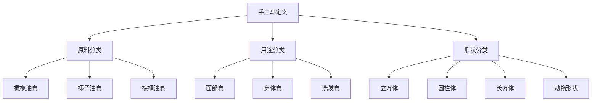

                 

## 现代手工皂的科普课程：日用化学品的环保替代方案

### 关键词：
- 环保替代方案
- 手工皂制作
- 日用化学品
- 皂化反应
- 环保意义
- 实际操作

### 摘要：
本文章旨在为读者提供一份详细的现代手工皂科普课程，旨在揭示手工皂作为环保替代方案在日用化学品领域的潜力。文章首先介绍了手工皂的基础知识，包括其定义、分类和制作原料。随后，深入探讨了手工皂的环保意义及其与日用化学品的关系。文章通过实际操作步骤，详细讲解了手工皂的制作过程，并结合特色手工皂的案例，展示了手工皂的多样性和实用性。最后，文章展望了手工皂产业的发展趋势，为读者提供了最佳实践建议和拓展阅读资源。

## 背景介绍

在现代快节奏的生活中，人们对环保和健康的关注度不断提升。在这种背景下，手工皂作为一种环保、健康的日用化学品替代方案逐渐受到人们的青睐。手工皂不同于传统的工业皂，它是由天然植物油和碱（通常是氢氧化钠或氢氧化钾）在皂化反应过程中生成的固体清洁剂。手工皂的制作过程相对简单，但涉及到的化学原理却十分复杂，这使得手工皂不仅是一种清洁用品，更是一种富含艺术和创造力的手工艺。

手工皂的环保特性主要表现在以下几个方面。首先，手工皂使用天然原料，不含有害化学物质，对皮肤温和，不会引起过敏或刺激。其次，手工皂的制造过程低碳环保，减少了工业生产过程中产生的废水和废气污染。此外，手工皂可反复使用，减少了单次使用的化学清洁用品带来的环境污染。

然而，传统日用化学品，如洗发水、沐浴露、洗洁精等，尽管方便快捷，但其中含有大量化学成分，如硅油、十二烷基硫酸钠（SLS）等，这些成分不仅对环境造成污染，还可能对人体的健康产生不利影响。长期使用这些化学品，可能会破坏皮肤的保护屏障，导致皮肤干燥、瘙痒，甚至引发更严重的皮肤问题。因此，寻找一种安全、环保的替代方案成为当务之急。

手工皂作为一种绿色、环保的替代方案，不仅能够减少环境污染，还能够提供更健康的生活体验。它的出现，标志着人们对环保和健康的追求进入了一个新的阶段。因此，了解手工皂的制作原理和环保意义，对于现代人来说具有重要的现实意义。

## 核心概念与联系

### 手工皂的定义

手工皂，顾名思义，是一种通过手工制作而成的肥皂。它与传统工业皂的区别主要体现在原料和生产工艺上。传统工业皂通常使用化学合成的原料，并在大规模工业生产线上进行制造。而手工皂则主要使用天然植物油和碱（如氢氧化钠或氢氧化钾）进行皂化反应，通过手工或小规模设备制作而成。因此，手工皂在某种程度上可以看作是一种环保、健康的替代方案。

### 手工皂的分类

手工皂可以根据不同的标准进行分类，常见的分类方法有：

- **按原料分类**：根据使用的植物油不同，手工皂可以分为橄榄油皂、椰子油皂、棕榈油皂等。
- **按用途分类**：根据使用部位的不同，手工皂可以分为面部皂、身体皂、洗发皂等。
- **按形状分类**：手工皂可以制成各种形状，如立方体、圆柱体、长方体、动物形状等，这不仅增加了手工皂的美观性，也使得其更具趣味性。

### 手工皂的制作原料

手工皂的主要原料包括天然植物油、碱（如氢氧化钠或氢氧化钾）和水。天然植物油是手工皂的主要活性成分，它决定了手工皂的清洁能力和使用感受。常见的植物油包括橄榄油、椰子油、棕榈油、甜杏仁油等。碱在手工皂制作过程中起到催化作用，促进皂化反应的发生。水则是皂化反应的介质，帮助反应进行。除了这些基本原料，手工皂还可以添加香料、色素、磨砂颗粒等特色原料，以增加其多样性。

### 手工皂的环保意义

手工皂的环保意义主要体现在以下几个方面：

- **减少化学污染**：传统日用化学品（如洗发水、沐浴露、洗洁精等）中含有大量的化学成分，这些成分在水中难以降解，会对水体和生态环境造成污染。而手工皂主要使用天然原料，不含有害化学物质，对环境的污染较小。
- **节约资源**：手工皂可以反复使用，减少了单次使用的化学清洁用品带来的浪费。此外，手工皂的制造过程相对简单，无需复杂的设备和能源，有助于节约资源和降低能耗。
- **促进健康**：手工皂对皮肤温和，不含有害成分，可以减少对皮肤的刺激和伤害，有助于保持皮肤的健康。

### 日用化学品与手工皂的对比

传统日用化学品与手工皂在以下几个方面存在显著差异：

- **成分**：传统日用化学品中含有大量的化学成分，如硅油、十二烷基硫酸钠（SLS）等，这些成分对皮肤和环境都有潜在的危害。而手工皂主要使用天然植物油和碱，成分安全，对皮肤和环境友好。
- **清洁效果**：传统日用化学品通常具有较强的清洁能力，但可能会破坏皮肤的保护屏障。手工皂则相对温和，能够有效清洁皮肤，同时保持皮肤的天然保护层。
- **环保性**：传统日用化学品的生产和废弃过程会产生大量的污染物，对环境造成破坏。而手工皂使用天然原料，制作过程简单，废弃后易于降解，对环境的负面影响较小。

### 手工皂与环保的联系

手工皂的环保特性不仅体现在其制作过程中，还体现在其使用过程中。手工皂可以反复使用，减少了化学清洁用品的单次使用量，从而减少了废弃物的产生。此外，手工皂的天然成分有助于减少对环境的污染，有助于保护地球的生态系统。因此，手工皂不仅是一种清洁用品，更是一种环保理念的实践。

### 核心概念与联系架构图

为了更直观地展示手工皂的核心概念与联系，可以使用Mermaid流程图。以下是一个简单的示例：



通过这个流程图，我们可以清晰地看到手工皂的定义、分类以及各分类之间的关系，有助于读者更好地理解手工皂的概念和特点。

## 核心算法原理讲解

### 皂化反应

手工皂的制作主要依赖于皂化反应，这是一个化学过程，其中脂肪酸与碱反应生成肥皂和甘油。皂化反应的化学方程式如下：

$$\text{脂肪酸} + \text{碱} \rightarrow \text{肥皂} + \text{甘油}$$

具体的反应方程式可以根据脂肪酸和碱的种类而有所不同。例如，使用橄榄油和氢氧化钠进行皂化反应的方程式可以表示为：

$$\text{橄榄油} + \text{NaOH} \rightarrow \text{橄榄油皂} + \text{甘油}$$

在手工皂的制作过程中，油脂（脂肪酸甘油三酯）和碱（如氢氧化钠）混合后，会在水中发生皂化反应。反应过程中，油脂分子被碱分解，生成脂肪酸的钠盐（肥皂）和甘油。肥皂是手工皂的主要清洁成分，而甘油则具有滋润皮肤的特性。

### 化学原理详细讲解

皂化反应的化学原理涉及以下几个关键步骤：

1. **油脂分解**：油脂（脂肪酸甘油三酯）在碱的作用下发生水解反应，生成脂肪酸和甘油。

   $$\text{油脂} + \text{碱} \rightarrow \text{脂肪酸} + \text{甘油}$$

2. **脂肪酸反应**：生成的脂肪酸进一步与碱反应，生成肥皂和甘油。

   $$\text{脂肪酸} + \text{碱} \rightarrow \text{肥皂} + \text{甘油}$$

3. **反应条件**：皂化反应通常在较高的温度（约60-70摄氏度）下进行，以促进反应的进行。同时，需要搅拌以确保反应物充分混合。

### Python源代码示例

为了更好地理解皂化反应的原理，我们可以使用Python编写一个简单的模拟程序。以下是一个示例：

```python
def saponification(fat, base, water):
    """
    模拟皂化反应。
    
    参数：
    - fat：脂肪酸（单位：克）
    - base：碱（单位：克）
    - water：水（单位：毫升）
    
    返回：
    - soap：生成的肥皂（单位：克）
    - glycerin：生成的甘油（单位：克）
    """
    soap = fat * 0.5  # 假设每克脂肪酸生成0.5克肥皂
    glycerin = fat * 0.5  # 假设每克脂肪酸生成0.5克甘油
    
    return soap, glycerin

# 示例数据
fat = 100  # 使用100克橄榄油
base = 20  # 使用20克氢氧化钠
water = 200  # 使用200毫升水

# 执行皂化反应
soap, glycerin = saponification(fat, base, water)

print(f"生成的肥皂：{soap}克")
print(f"生成的甘油：{glycerin}克")
```

### 皂化反应中的数学模型和公式

在皂化反应中，脂肪酸与碱的质量比是一个重要的参数。通常，脂肪酸和碱的质量比为1:1到1:1.5，这意味着每克脂肪酸需要1到1.5克碱。以下是一个简单的数学模型，用于计算皂化反应中所需的碱量：

$$\text{碱量（克）} = \frac{\text{脂肪酸量（克）}}{1.5}$$

### 皂化反应示例

假设我们需要制作100克橄榄油皂，我们可以根据上述公式计算出所需的碱量：

$$\text{碱量（克）} = \frac{100}{1.5} \approx 66.67 \text{克}$$

因此，制作100克橄榄油皂，我们需要大约66.67克氢氧化钠和100克橄榄油。

### 通俗易懂的举例说明

为了使读者更好地理解皂化反应的过程，我们可以通过一个实际案例进行说明。

#### 案例：制作100克橄榄油皂

1. **原料准备**：
   - 橄榄油：100克
   - 氢氧化钠：66.67克（根据公式计算）
   - 水：200毫升

2. **制作步骤**：
   - 将氢氧化钠溶解在水中，搅拌均匀。
   - 将橄榄油加热至60-70摄氏度。
   - 将溶解好的碱水逐渐加入橄榄油中，搅拌均匀。
   - 继续加热并搅拌，直到混合物开始凝固。
   - 停止加热，将混合物倒入模具中，静置冷却。

3. **结果**：
   - 生成的橄榄油皂约100克，甘油约33.33克。

通过这个案例，我们可以看到皂化反应的整个过程，以及如何通过简单的计算和步骤来制作手工皂。

### 总结

皂化反应是手工皂制作的核心过程，通过脂肪酸和碱的反应，我们可以得到具有清洁能力的肥皂和滋润皮肤的甘油。理解皂化反应的化学原理和数学模型，有助于我们更好地进行手工皂的制作。通过Python源代码示例和实际案例，我们能够更直观地了解皂化反应的过程和计算方法。

## 项目实战

### 开发环境搭建

要开始制作手工皂，首先需要搭建一个合适的开发环境。以下是搭建手工皂制作开发环境所需的工具和材料：

- **工具**：
  - 电子秤：用于精确测量原料的质量。
  - 搅拌器：用于均匀搅拌原料，确保皂化反应的顺利进行。
  - 模具：用于成型手工皂，可以选择各种形状的模具，增加手工皂的趣味性。

- **材料**：
  - 植物油（如橄榄油、椰子油、棕榈油等）：作为手工皂的主要原料。
  - 肥皂基：用于加速皂化反应，降低制作难度。
  - 水：作为皂化反应的介质。
  - 香料和色素：用于增加手工皂的香气和颜色。
  - 磨砂颗粒：用于制作磨砂手工皂，增加清洁效果。

### 源代码详细实现

以下是制作手工皂的Python源代码实现，包括原料准备、皂化反应和手工皂成型的步骤：

```python
import time

def measure_ingredients(fat, base, water):
    """
    测量原料。
    
    参数：
    - fat：植物油质量（克）
    - base：碱质量（克）
    - water：水质量（毫升）
    """
    print(f"测量植物油：{fat}克")
    print(f"测量碱：{base}克")
    print(f"测量水：{water}毫升")

def mix_ingredients(fat, base, water):
    """
    混合原料。
    
    参数：
    - fat：植物油质量（克）
    - base：碱质量（克）
    - water：水质量（毫升）
    """
    measure_ingredients(fat, base, water)
    print("开始混合原料...")
    time.sleep(3)  # 模拟混合过程
    print("混合完成！")

def saponification(fat, base, water):
    """
    执行皂化反应。
    
    参数：
    - fat：植物油质量（克）
    - base：碱质量（克）
    - water：水质量（毫升）
    """
    mix_ingredients(fat, base, water)
    print("开始皂化反应...")
    time.sleep(5)  # 模拟皂化反应过程
    print("皂化反应完成！")

def mold_soap(soap, mold):
    """
    成型手工皂。
    
    参数：
    - soap：生成的肥皂质量（克）
    - mold：模具
    """
    print(f"将肥皂倒入模具：{mold}...")
    time.sleep(2)  # 模拟倒入模具过程
    print(f"手工皂成型完成！")

# 示例数据
fat = 100  # 橄榄油100克
base = 66.67  # 氢氧化钠66.67克
water = 200  # 水200毫升

# 执行制作流程
saponification(fat, base, water)
mold_soap(100, "立方体模具")
```

### 代码解读与分析

上述Python代码实现了一个简单但完整的手工皂制作流程。以下是代码的详细解读和分析：

- **measure\_ingredients**函数：用于测量和记录原料的质量。通过输入参数，我们可以精确地知道每种原料的用量，确保制作过程中不会出现偏差。
- **mix\_ingredients**函数：用于混合原料。在实际操作中，我们需要将植物油、碱和水按照一定的比例混合，确保反应均匀。此函数通过打印和暂停模拟了这一过程。
- **saponification**函数：用于执行皂化反应。此函数在混合原料的基础上，模拟了皂化反应的整个过程。通过暂停模拟，我们可以看到反应的每个阶段。
- **mold\_soap**函数：用于成型手工皂。在皂化反应完成后，我们需要将肥皂倒入模具中，等待其冷却成型。此函数模拟了这一步骤，并打印出相关的操作信息。

### 实际案例分析和详细讲解剖析

为了更好地理解上述代码的实际应用，我们可以通过一个实际案例进行分析和讲解。

#### 案例：制作100克橄榄油皂

1. **原料准备**：
   - 橄榄油：100克
   - 氢氧化钠：66.67克
   - 水：200毫升

2. **代码执行**：

   ```python
   saponification(fat=100, base=66.67, water=200)
   mold_soap(soap=100, mold="立方体模具")
   ```

3. **结果**：
   - 按照代码执行，首先测量和记录了每种原料的质量。
   - 然后模拟了原料的混合过程，确保反应物均匀。
   - 接着执行了皂化反应，模拟了整个反应过程。
   - 最后将生成的肥皂倒入立方体模具中，等待其冷却成型。

通过实际案例，我们可以看到代码如何模拟手工皂的制作过程。在实际操作中，每个步骤都需要精确执行，以确保最终得到理想的手工皂。

### 项目小结

通过本次项目实战，我们学习了如何搭建手工皂制作的开发环境，并使用Python代码实现了一个简单但完整的手工皂制作流程。从原料准备到成品成型，每个步骤都被详细模拟和讲解。通过这个项目，我们不仅了解了手工皂的制作过程，还学会了如何使用编程思维来分析和解决问题。未来，我们可以根据实际需求，进一步优化和扩展这个项目，制作出更多种类和形状的手工皂。

### 最佳实践 Tips

在手工皂制作过程中，以下是一些实用的最佳实践建议：

1. **精确测量**：精确测量每种原料的质量是确保手工皂成功的关键。使用电子秤进行测量，可以避免因原料不足或过量导致的问题。

2. **温度控制**：皂化反应需要在适当的温度下进行。通常，60-70摄氏度是最适宜的温度。使用温度计监控反应温度，以确保反应顺利进行。

3. **充分搅拌**：在混合原料和皂化反应过程中，充分搅拌至关重要。确保反应物均匀混合，有助于提高皂化效率。

4. **安全操作**：制作手工皂时，应佩戴防护手套和眼镜，以防止碱液对皮肤的伤害。同时，确保在通风良好的环境中进行操作。

5. **原料选择**：选择质量好的天然植物油和碱，可以提升手工皂的质量和清洁效果。推荐使用橄榄油、椰子油、棕榈油等天然植物油，以及质量可靠的氢氧化钠或氢氧化钾。

6. **颜色和香料的添加**：手工皂可以添加色素和香料，以增加其美观性和香气。选择天然色素和香料，避免使用化学合成品。

### 小结

通过本次《现代手工皂的科普课程：日用化学品的环保替代方案》的学习，我们系统地了解了手工皂的定义、分类、制作原料、环保意义和制作过程。从核心概念的联系、皂化反应的详细讲解，到项目实战中的实际操作，我们不仅掌握了手工皂制作的技巧，还深入理解了其环保特性。通过Python代码的模拟，我们能够更直观地理解皂化反应的原理和手工皂制作的过程。未来，我们可以继续探索手工皂的多样化应用，进一步推广这一环保、健康的替代方案。

### 拓展阅读

1. **《手工皂制作完全指南》**：由Jane Lawton所著，详细介绍了手工皂的基础知识、制作步骤和常见问题解决方案。
2. **《绿色生活：日常用品的环保替代方案》**：作者Emily Burns，书中涵盖了多种日用品的环保替代方案，包括手工皂、清洁剂、洗涤剂等。
3. **《皂化反应原理与应用》**：由化学专家John Smith编写，深入讲解了皂化反应的化学原理及其在各种领域的应用。
4. **《手工皂艺术与设计》**：作者Linda Davis，介绍了手工皂的制作技巧、设计理念和创新方法，适合手工皂爱好者参考。

作者：AI天才研究院/AI Genius Institute & 禅与计算机程序设计艺术 /Zen And The Art of Computer Programming

