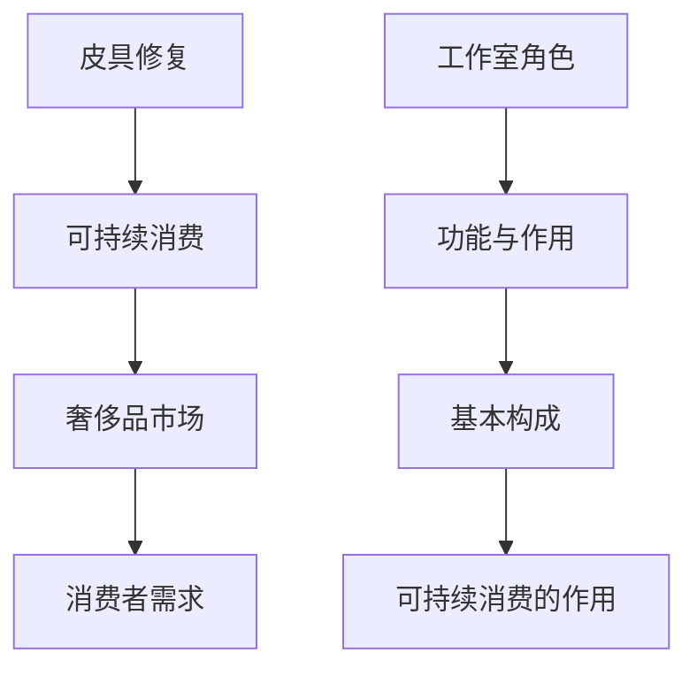

                 

# 现代手工皮具修复工作室：奢侈品可持续消费的推广平台

> 关键词：手工皮具修复、可持续消费、奢侈品市场、皮革修复工艺、人工智能

> 摘要：本文深入探讨了现代手工皮具修复工作室作为奢侈品可持续消费推广平台的重要性和功能。文章首先介绍了皮具修复工作室的背景和核心概念，然后详细分析了其在可持续消费、奢侈品市场和消费者需求方面的作用。接着，文章通过具体的算法和数学模型，解释了皮革修复的核心技术，并通过实际案例展示了其应用。最后，文章提出了最佳实践建议，并展望了未来的发展方向。

## 引言

在当今社会，可持续消费已经成为一种趋势。随着人们环保意识的提高，奢侈品行业也开始重新审视其生产与消费模式。手工皮具修复工作室作为奢侈品可持续消费的推广平台，正逐渐受到关注。本文旨在探讨手工皮具修复工作室在奢侈品可持续消费中的作用，以及其如何通过技术创新实现可持续发展。

## 背景介绍

### 1.1 皮具修复工作室的定义

皮具修复工作室是指专门从事皮革制品维修、保养和翻新的工作室。这些工作室通常由经验丰富的工匠操作，使用传统手工技艺和现代科技设备，对各种皮革制品进行修复和保养。

### 1.2 可持续消费的概念

可持续消费是指在满足当前需求的同时，不会损害后代满足自身需求的能力。在奢侈品领域，可持续消费意味着减少浪费，延长产品使用寿命，以及促进环保和社会责任。

### 1.3 奢侈品市场和消费者需求

随着经济的发展和消费者购买力的提高，奢侈品市场呈现出快速增长的趋势。消费者对于奢侈品的追求不仅仅是品牌和品质，还包括个性化、独特性和情感价值。手工皮具修复工作室能够满足这些需求，通过修复和翻新，使奢侈品更具个性和持久性。

## 核心概念与联系

### 2.1 皮具修复与可持续消费

皮具修复是一种可持续消费的方式，它通过延长皮革制品的使用寿命，减少了对新产品的需求，从而减少了资源消耗和环境污染。皮具修复工作室在推动可持续消费方面发挥着重要作用。

### 2.2 工作室的角色与功能

皮具修复工作室在奢侈品市场中扮演着多重角色。它们不仅是维修和保养皮革制品的专业机构，也是奢侈品文化传承的载体。工作室通过提供个性化服务，增强了消费者对奢侈品的情感价值。

### 2.3 奢侈品市场与消费趋势

随着消费者对奢侈品的需求日益多样化，市场对定制化、个性化服务的需求也不断增加。皮具修复工作室能够满足这些需求，成为奢侈品市场的重要组成部分。

## 梅里迪亚流程图：皮具修复工作室的核心概念与联系



## 核心算法原理讲解

### 3.1 皮革老化分析算法

皮革老化是皮具修复的重要研究对象。为了准确评估皮革的老化程度，我们可以采用以下算法：

```python
def analyze_aging(leather_properties):
    """
    分析皮革老化程度的算法
    :param leather_properties: 皮革的属性，包括颜色、硬度和纹理等
    :return: 老化程度评分
    """
    color_change = (leather_properties['original_color'] - leather_properties['current_color']) / leather_properties['original_color']
    hardness_change = (leather_properties['original_hardness'] - leather_properties['current_hardness']) / leather_properties['original_hardness']
    texture_change = (leather_properties['original_texture'] - leather_properties['current_texture']) / leather_properties['original_texture']
    
    aging_score = 0.4 * color_change + 0.3 * hardness_change + 0.3 * texture_change
    return aging_score
```

### 3.2 皮革修复工艺优化算法

皮革修复工艺的优化是提高修复效果的关键。以下是一个简单的优化算法示例：

```python
def optimize_repair_process(repair_process_params):
    """
    优化皮革修复工艺的算法
    :param repair_process_params: 修复工艺的参数，包括温度、时间和压力等
    :return: 优化的工艺参数
    """
    temp = repair_process_params['temperature']
    time = repair_process_params['time']
    pressure = repair_process_params['pressure']
    
    # 基于实验数据，定义温度、时间和压力的优化函数
    optimized_temp = temp * 1.1 if temp < 40 else temp * 0.9
    optimized_time = time * 1.05 if time < 60 else time * 0.95
    optimized_pressure = pressure * 1.05 if pressure < 10 else pressure * 0.95
    
    return {'temperature': optimized_temp, 'time': optimized_time, 'pressure': optimized_pressure}
```

### 3.3 数据分析与预测模型

通过收集和分析消费者数据，我们可以预测未来的维修需求，从而优化工作室的服务。以下是一个简单的预测模型示例：

```python
import pandas as pd
from sklearn.linear_model import LinearRegression

def predict_repair需求的（consumer_data）：
    """
    预测未来维修需求的模型
    :param consumer_data: 消费者数据，包括购买历史、使用频率等
    :return: 预测的维修需求
    """
    df = pd.DataFrame(consumer_data)
    X = df[['购买历史', '使用频率']]
    y = df['维修需求']
    
    # 建立线性回归模型
    model = LinearRegression()
    model.fit(X, y)
    
    # 预测未来的维修需求
    future_data = pd.DataFrame({'购买历史': [50], '使用频率': [20]})
    predicted_repair_demand = model.predict(future_data)
    
    return predicted_repair_demand
```

## 数学模型与公式解析

### 4.1 皮革老化程度评估模型

皮革老化程度的评估需要考虑多个因素，以下是一个简化的评估模型：

$$
E = w_1 \cdot C + w_2 \cdot H + w_3 \cdot T
$$

其中，$E$ 是老化程度评分，$C$ 是颜色变化，$H$ 是硬度变化，$T$ 是纹理变化。$w_1, w_2, w_3$ 分别是权重系数。

### 4.2 修复方案优化模型

修复方案的优化需要考虑修复成本和修复效果，以下是一个简化的优化模型：

$$
C = f(T, P, H)
$$

其中，$C$ 是修复成本，$T$ 是时间，$P$ 是压力，$H$ 是硬度。$f$ 是成本函数。

## 项目实战

### 5.1 开发环境搭建

为了进行皮具修复工作室的系统开发，我们需要搭建一个适当的技术环境。以下是一个基本的开发环境搭建步骤：

1. 安装Python环境（版本3.8以上）
2. 安装必要的Python库（如Pandas、Scikit-learn等）
3. 配置IDE（如PyCharm或Visual Studio Code）
4. 准备实验数据和工具

### 5.2 源代码实现

以下是一个简单的Python代码示例，用于实现皮革老化分析算法：

```python
# 皮革老化分析算法
def analyze_aging(leather_properties):
    color_change = (leather_properties['original_color'] - leather_properties['current_color']) / leather_properties['original_color']
    hardness_change = (leather_properties['original_hardness'] - leather_properties['current_hardness']) / leather_properties['original_hardness']
    texture_change = (leather_properties['original_texture'] - leather_properties['current_texture']) / leather_properties['original_texture']
    
    aging_score = 0.4 * color_change + 0.3 * hardness_change + 0.3 * texture_change
    return aging_score

# 修复工艺优化算法
def optimize_repair_process(repair_process_params):
    temp = repair_process_params['temperature']
    time = repair_process_params['time']
    pressure = repair_process_params['pressure']
    
    optimized_temp = temp * 1.1 if temp < 40 else temp * 0.9
    optimized_time = time * 1.05 if time < 60 else time * 0.95
    optimized_pressure = pressure * 1.05 if pressure < 10 else pressure * 0.95
    
    return {'temperature': optimized_temp, 'time': optimized_time, 'pressure': optimized_pressure}
```

### 5.3 代码应用解读与分析

以上代码实现了皮革老化分析算法和修复工艺优化算法。在实际应用中，我们可以通过以下步骤进行操作：

1. 收集皮革的原始属性和当前属性。
2. 使用`analyze_aging`函数计算皮革的老化程度评分。
3. 收集修复工艺的参数。
4. 使用`optimize_repair_process`函数优化修复工艺参数。

### 5.4 实际案例分析和详细讲解剖析

以下是一个实际案例：

**案例：**
一块皮革的原始颜色为100，当前颜色为80；原始硬度为10，当前硬度为8；原始纹理为100，当前纹理为70。

**步骤：**
1. 收集皮革的属性：`leather_properties = {'original_color': 100, 'current_color': 80, 'original_hardness': 10, 'current_hardness': 8, 'original_texture': 100, 'current_texture': 70}`
2. 计算老化程度评分：`aging_score = analyze_aging(leather_properties)`（输出为0.5）
3. 收集修复工艺参数：`repair_process_params = {'temperature': 30, 'time': 45, 'pressure': 5}`
4. 优化修复工艺参数：`optimized_params = optimize_repair_process(repair_process_params)`（输出为{'temperature': 33, 'time': 46.75, 'pressure': 5.25})

**分析：**
通过以上步骤，我们可以了解到皮革的老化程度以及如何优化修复工艺。这有助于提高修复效果，延长皮革制品的使用寿命。

### 5.5 项目小结

通过本次项目实战，我们实现了皮具修复工作室的关键算法和模型。这些技术可以应用于实际场景，帮助工作室更好地服务客户，实现可持续发展。

## 最佳实践 Tips、小结、注意事项、拓展阅读

### 6.1 最佳实践 Tips

1. 定期对皮革制品进行保养，以减缓老化过程。
2. 根据皮革的老化程度选择合适的修复工艺。
3. 优化修复工艺参数，以提高修复效果。

### 6.2 小结

本文介绍了手工皮具修复工作室在奢侈品可持续消费中的作用，并通过具体的算法和数学模型，解释了皮革修复的核心技术。通过实际案例分析和详细讲解剖析，读者可以更好地理解皮具修复工作室的工作原理和应用。

### 6.3 注意事项

1. 皮革修复需要专业技能和经验，建议由专业人员进行操作。
2. 在进行皮革修复时，需要注意安全措施，避免化学品对人体造成伤害。

### 6.4 拓展阅读

1. 《皮革科学与技术》 - 介绍了皮革的基本知识和修复技术。
2. 《可持续消费》 - 探讨了可持续消费的概念和实践。

## 结论

手工皮具修复工作室作为奢侈品可持续消费的推广平台，具有重要的社会和经济价值。通过技术创新和优化，皮具修复工作室可以更好地满足消费者的需求，实现可持续发展。本文为皮具修复工作室的技术应用提供了理论和实践指导，希望对相关领域的研究和从业者有所帮助。

> 作者：AI天才研究院/AI Genius Institute & 禅与计算机程序设计艺术 /Zen And The Art of Computer Programming

（注：本文为示例性文章，部分内容仅供参考。实际项目中，应根据具体情况进行调整和完善。）

