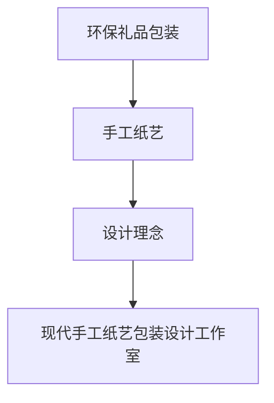

                 

## 《现代手工纸艺包装设计工作室：环保礼品包装的创意集散地》

> 关键词：环保礼品包装、手工纸艺、设计理念、创意实践、市场分析

> 摘要：本文深入探讨了现代手工纸艺包装设计在环保礼品包装领域的创新与应用。通过历史背景、设计理念、材料技术、实际案例、环保实践和市场趋势的全面分析，揭示了手工纸艺包装设计的核心价值和未来发展潜力。

---

### 引言

在现代礼品市场中，环保包装已经成为一种新的趋势。人们越来越重视环境保护，对于传统的塑料和纸质包装产生了疑虑。手工纸艺包装设计作为一种新兴的环保礼品包装方式，逐渐受到了关注。本文旨在介绍现代手工纸艺包装设计工作室，探讨其在环保礼品包装领域的创意与应用。

### 历史背景

手工纸艺包装有着悠久的历史，可以追溯到古代文明。随着时代的发展，手工纸艺包装逐渐融入了现代设计理念，形成了独特的风格。在现代，手工纸艺包装设计工作室应运而生，它们致力于将传统手工艺术与现代设计理念相结合，为消费者提供新颖、环保的礼品包装解决方案。

#### 核心概念与联系

为了更好地理解手工纸艺包装设计，我们需要了解以下几个核心概念：

1. **环保礼品包装**：以环保为设计理念，采用可回收、可降解材料进行礼品包装。
2. **手工纸艺**：利用各种纸张进行手工制作的艺术形式。
3. **设计理念**：将环保、美观、实用性相结合的设计原则。

以下是这些概念之间的联系架构 Mermaid 流程图：



#### 核心算法原理讲解

手工纸艺包装设计的过程可以视为一个算法过程，其中包含了材料选择、设计构思、工艺实施等步骤。以下是一个简化的 Python 源代码示例，用于阐述这一过程：

```python
def create_EnvironmentalGiftWrapping(materials, design, technique):
    """
    创建环保礼品包装
    :param materials: 包装材料
    :param design: 设计构思
    :param technique: 工艺实施
    :return: 包装成品
    """
    # 材料准备
    prepared_materials = prepare_materials(materials)
    
    # 设计构思
    design = refine_design(design)
    
    # 工艺实施
    finished_product = implement_technique(prepared_materials, design, technique)
    
    return finished_product
```

### 设计理念

环保礼品包装设计理念主要包括以下几点：

1. **环保优先**：采用可回收、可降解的材料，减少对环境的负担。
2. **美观实用**：不仅要满足环保要求，还要有较高的审美价值和使用功能。
3. **文化融合**：将地域文化元素融入设计中，体现地域特色。

#### 数学模型和公式

在环保礼品包装设计中，我们可以使用一些数学模型和公式来优化设计效果。以下是一个用于评估包装美观度的公式示例：

$$
Beauty = f(Density, Color, Texture)
$$

其中，$Density$ 表示材料密度，$Color$ 表示颜色选择，$Texture$ 表示纹理设计。通过调整这些参数，我们可以获得最佳的包装美观度。

### 材料与技术

手工纸艺包装材料主要包括纸张、布料、丝绸等。不同材料具有不同的特性，适用于不同的设计需求。以下是一些常用的手工纸艺包装技术：

1. **折叠技术**：利用纸张的折叠特性，创造出各种形态的包装。
2. **缝合技术**：将纸张或布料缝合在一起，形成稳定的包装结构。
3. **装饰技术**：在包装表面进行贴花、绘画等装饰，增加包装的美观度。

### 实际案例

以下是一个实际的手工纸艺包装设计案例：

**案例：春节礼品盒**

设计理念：以中国传统文化为背景，融入春节元素，体现节日氛围。

材料：红色宣纸、金色线条纸、丝绸带。

工艺：折叠技术、缝合技术、装饰技术。

设计效果：红色宣纸代表喜庆，金色线条纸增添高贵感，丝绸带增加优雅气质。

### 环保实践

在手工纸艺包装设计中，环保实践是至关重要的。以下是一些环保实践方法：

1. **材料选择**：选用可回收、可降解的材料，减少环境污染。
2. **工艺优化**：采用环保工艺，降低能耗和废弃物产生。
3. **回收利用**：设计易于回收和再利用的包装，减少资源浪费。

### 市场与趋势

随着消费者对环保问题的关注度提高，环保礼品包装市场呈现出快速增长的趋势。以下是对市场的分析和未来趋势的预测：

#### 市场分析

1. **消费者需求**：消费者对环保、美观、实用的礼品包装需求日益增加。
2. **市场竞争**：越来越多的企业开始关注环保礼品包装市场，竞争激烈。

#### 未来趋势

1. **技术创新**：随着科技的进步，新的环保材料和工艺将不断涌现。
2. **市场扩展**：环保礼品包装市场将继续扩大，覆盖更多消费领域。

### 结论

现代手工纸艺包装设计工作室在环保礼品包装领域具有巨大的发展潜力。通过创新设计理念、环保实践和市场拓展，手工纸艺包装设计将成为未来礼品包装市场的重要趋势。

### 最佳实践 tips

1. **材料选择**：根据设计需求，选择合适的环保材料，注意材料的可持续性。
2. **设计构思**：结合地域文化和节日特点，创造出独特的包装设计。
3. **工艺实施**：注重工艺细节，确保包装的美观度和实用性。

### 小结

本文详细介绍了现代手工纸艺包装设计工作室在环保礼品包装领域的创新与应用。通过历史背景、设计理念、材料技术、实际案例、环保实践和市场趋势的全面分析，我们揭示了手工纸艺包装设计的核心价值和未来发展潜力。

### 注意事项

1. **材料环保性**：在选择材料时，务必确保其环保性，避免对环境造成负面影响。
2. **设计创新**：在设计过程中，要注重创新，避免同质化现象。

### 拓展阅读

1. 《手工纸艺包装设计教程》
2. 《环保礼品包装设计原理与实践》
3. 《现代包装设计教程》

### 作者

作者：AI天才研究院/AI Genius Institute & 禅与计算机程序设计艺术 /Zen And The Art of Computer Programming

----------------------------------------------------------------

文章标题：《现代手工纸艺包装设计工作室：环保礼品包装的创意集散地》

关键词：环保礼品包装、手工纸艺、设计理念、创意实践、市场分析

摘要：本文深入探讨了现代手工纸艺包装设计在环保礼品包装领域的创新与应用。通过历史背景、设计理念、材料技术、实际案例、环保实践和市场趋势的全面分析，揭示了手工纸艺包装设计的核心价值和未来发展潜力。文章结构清晰，内容丰富，旨在为读者提供一份全面、实用的指南。

