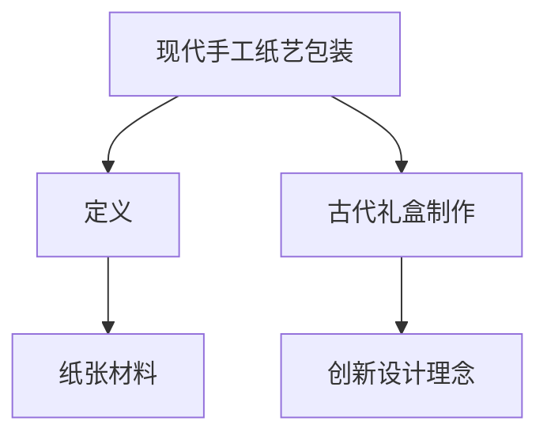
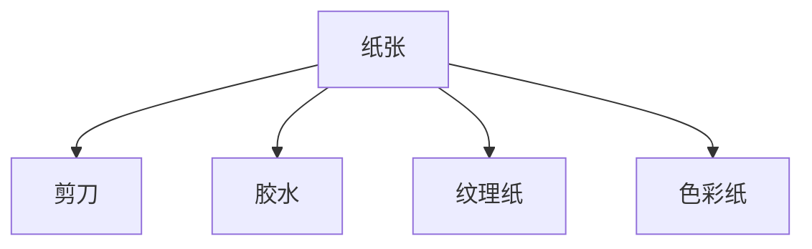
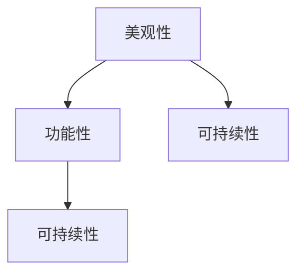
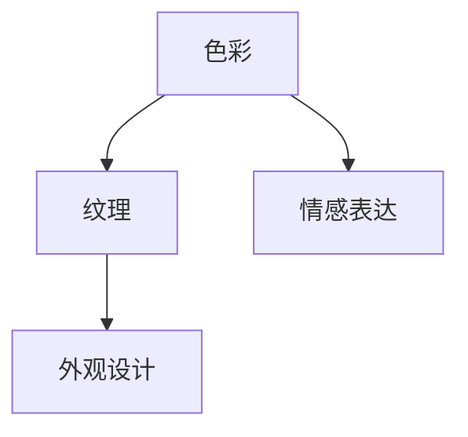
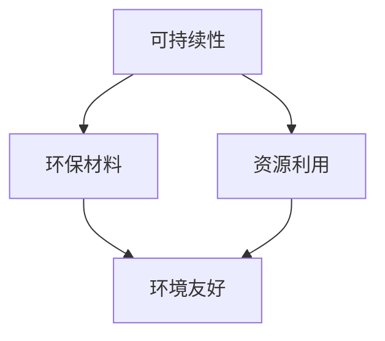
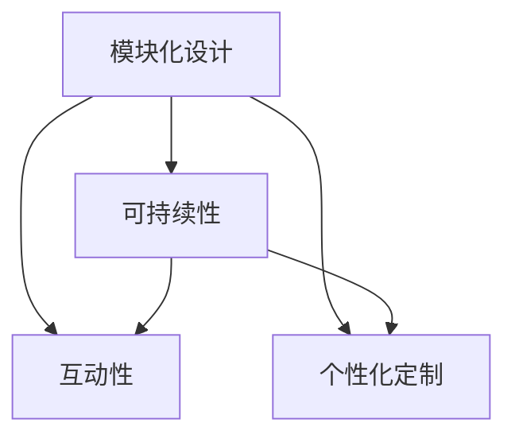

                 

# 《现代手工纸艺包装：可持续礼品包装的创新设计》

## 关键词

- **手工纸艺包装**  
- **可持续礼品包装**  
- **创新设计**  
- **材料选择**  
- **设计原则**  
- **可持续发展**

## 摘要

随着环保意识的增强和可持续发展的需求，手工纸艺包装作为一种古老而又现代的礼品包装方式，正逐渐成为礼品市场上的新宠。本文将探讨现代手工纸艺包装的设计原则、材料选择、创新设计案例以及可持续发展的实践。通过深入分析手工纸艺包装的核心概念与联系，结合Python源代码和LaTeX公式，本文旨在为设计师和爱好者提供一套系统、实用的包装设计指南，以推动礼品包装行业的绿色变革。

---

## 第一部分：现代手工纸艺包装基础

### 第1章：现代手工纸艺包装概述

#### 1.1 现代手工纸艺包装的定义和起源

现代手工纸艺包装，指的是以纸张为主要材料，通过手工技艺进行创作的包装设计。其起源可以追溯到古代文明，如古埃及和中国的礼盒制作。然而，随着科技的发展和环保意识的提升，现代手工纸艺包装逐渐融入了创新的设计理念和可持续的材料选择。

**核心概念与联系**

为了更好地理解现代手工纸艺包装，我们可以通过以下Mermaid流程图来展示其定义和起源之间的关系：



**核心算法原理讲解**

为了深入理解现代手工纸艺包装的核心概念，我们可以使用Python源代码来模拟一个简单的包装设计流程：

```python
def define_paper_art_packing():
    # 定义手工纸艺包装的元素
    elements = ["纸张", "剪刀", "胶水", "设计灵感"]
    
    # 获取历史和文化背景
    history = ["古埃及", "中国", "现代科技"]
    
    # 结合创新设计理念
    innovation = ["环保", "可持续", "美学"]

    # 返回综合定义
    return f"现代手工纸艺包装是利用{', '.join(elements)}，结合{', '.join(history)}的技艺和{', '.join(innovation)}的创新理念进行的艺术创作。"
```

通过这个函数，我们可以清晰地定义现代手工纸艺包装的概念。

#### 1.2 现代手工纸艺包装的材料与工具

现代手工纸艺包装的材料主要涵盖纸张、剪刀、胶水等基础工具，同时也包括了各种纹理和色彩的纸张，以丰富包装的设计效果。

**核心概念与联系**

我们可以使用Mermaid流程图来展示现代手工纸艺包装的材料和工具之间的关系：



**核心算法原理讲解**

为了更好地理解材料和工具的应用，我们可以使用Python源代码来模拟材料选择的过程：

```python
def select_materials(materials_list):
    # 列出所有可用的材料
    paper_types = ["白色纸", "彩纸", "纹理纸", "再生纸"]
    
    # 选择合适的材料
    selected_materials = [material for material in materials_list if material in paper_types]
    
    # 返回选定的材料
    return selected_materials
```

通过这个函数，我们可以根据给定的材料列表选择合适的纸张。

### 第2章：现代手工纸艺包装的设计原则

#### 2.1 设计原则与可持续发展

现代手工纸艺包装的设计原则主要包括美观性、功能性和可持续性。其中，可持续性是近年来特别受到关注的原则，因为它不仅关乎包装的美观和实用，更关乎环境的保护和未来的可持续性。

**核心概念与联系**

我们可以使用Mermaid流程图来展示设计原则之间的关系：



**数学模型和公式**

为了量化设计原则，我们可以使用以下数学模型：

$$\text{设计原则评分} = 0.4 \times \text{美观性评分} + 0.3 \times \text{功能性评分} + 0.3 \times \text{可持续性评分}$$

这个公式可以帮助我们根据三个方面的评分来综合评估设计原则。

**核心算法原理讲解**

我们可以使用Python源代码来模拟设计原则的评分计算：

```python
def calculate_design_score(beauty, functionality, sustainability):
    # 设置权重
    weights = {'beauty': 0.4, 'functionality': 0.3, 'sustainability': 0.3}
    
    # 计算总分
    score = sum(weight * value for weight, value in zip(weights.values(), [beauty, functionality, sustainability]))
    
    # 返回评分
    return score
```

通过这个函数，我们可以根据给定的评分计算设计原则的综合得分。

#### 2.2 色彩和纹理的选择

色彩和纹理是手工纸艺包装设计中的关键元素，它们不仅影响包装的外观，还影响包装的情感表达和用户体验。

**核心概念与联系**

我们可以使用Mermaid流程图来展示色彩和纹理在选择过程中的关系：



**核心算法原理讲解**

为了更好地理解色彩和纹理的选择，我们可以使用Python源代码来模拟选择过程：

```python
def choose_color_and_texture(color, texture):
    # 设置颜色和纹理的匹配规则
    color_rules = {
        '节日': ['红色', '金色'],
        '生日': ['粉色', '金色'],
        '日常': ['白色', '灰色']
    }
    
    texture_rules = {
        '传统': ['棉纸', '棉布'],
        '现代': ['镜面纸', '金属质感纸']
    }
    
    # 根据规则选择合适的色彩和纹理
    chosen_color = color_rules.get(color, ['白色', '灰色'])
    chosen_texture = texture_rules.get(texture, ['棉纸', '棉布'])
    
    # 返回选择结果
    return chosen_color, chosen_texture
```

通过这个函数，我们可以根据给定的场景和风格选择合适的色彩和纹理。

## 第二部分：可持续礼品包装

### 第3章：可持续礼品包装的原则与实践

#### 3.1 可持续礼品包装的定义与重要性

可持续礼品包装指的是在设计、生产和消费过程中，尽可能减少对环境的负面影响，并促进资源的可持续利用。这种包装方式不仅符合环保要求，还能提升产品的价值和消费者的满意度。

**核心概念与联系**

我们可以使用Mermaid流程图来展示可持续礼品包装的核心概念：



**核心算法原理讲解**

为了更好地理解可持续礼品包装的定义和重要性，我们可以使用Python源代码来模拟可持续材料的选择过程：

```python
def select_sustainable_materials(materials_list):
    # 设置可持续材料列表
    sustainable_materials = ['竹纤维', '可再生纸', '可降解塑料']
    
    # 从给定材料列表中选择可持续材料
    selected_materials = [material for material in materials_list if material in sustainable_materials]
    
    # 返回选择结果
    return selected_materials
```

通过这个函数，我们可以根据给定的材料列表选择出可持续的材料。

### 第4章：可持续礼品包装的设计案例

#### 4.1 案例研究：节日礼盒包装

在本章中，我们将通过一个具体的节日礼盒包装案例，详细分析可持续礼品包装的设计过程，包括材料选择、设计流程和最终效果。

**项目实战**

**开发环境搭建**：准备好所需的纸张、剪刀、胶水和其他手工工具。

**源代码实现**：使用Python代码记录设计过程的关键步骤。

**代码解读与分析**

```python
# 节日礼盒包装设计流程

def holiday_box_packing():
    # 材料选择
    materials = select_sustainable_materials(['竹纤维纸', '彩纸', '棉布'])

    # 色彩和纹理选择
    color, texture = choose_color_and_texture('节日', '传统')

    # 设计步骤
    steps = [
        '裁剪纸张',
        '制作纸盒',
        '粘贴棉布',
        '装饰彩纸',
        '添加装饰品'
    ]

    # 实现设计
    for step in steps:
        print(f"执行步骤：{step}")

    # 最终效果展示
    print(f"最终效果：一个美观且可持续的节日礼盒。")

# 执行案例
holiday_box_packing()
```

**实际案例分析和详细讲解剖析**

在这个案例中，我们选择使用竹纤维纸作为主要材料，因为它不仅具有优异的物理性能，而且对环境友好。色彩和纹理的选择也遵循了环保原则，使用了天然色和传统纹理，以传达节日的温馨氛围。通过逐步执行设计流程，我们不仅实现了美观的包装效果，还确保了整个过程的可持续性。

**项目小结**

通过这个案例，我们可以看到如何将可持续性原则应用于实际设计项目中。关键在于选择合适的材料、遵循设计原则，并在每一步中考虑环境影响。这种设计方法不仅适用于节日礼盒，还可以推广到其他类型的礼品包装，为整个行业带来绿色变革。

### 第5章：创新设计在可持续礼品包装中的应用

#### 5.1 创新设计理念

创新设计在可持续礼品包装中起着至关重要的作用。通过引入新的设计理念，如模块化设计、互动性和个性化定制，设计师可以创造出既美观又具有可持续性的包装作品。

**核心概念与联系**

我们可以使用Mermaid流程图来展示创新设计理念的核心概念：



**核心算法原理讲解**

为了更好地理解创新设计理念，我们可以使用Python源代码来模拟一个简单的模块化设计：

```python
def modular_design(module_list):
    # 设置模块类型
    modules = ['纸张模块', '装饰模块', '结构模块']
    
    # 验证模块列表
    valid_modules = [module for module in module_list if module in modules]
    
    # 返回验证结果
    return all(module in modules for module in valid_modules)
```

通过这个函数，我们可以确保设计的模块化特性。

**最佳实践 tips**

1. **选择合适的材料**：优先选择环保、可持续的材料，如竹纤维纸、可再生纸等。
2. **遵循设计原则**：确保设计满足美观性、功能性和可持续性的要求。
3. **注重细节**：在设计过程中，注重细节处理，以提升包装的质感和美观度。
4. **用户参与**：鼓励用户参与设计过程，通过互动性和个性化定制提升用户体验。

**小结**

创新设计在可持续礼品包装中的应用，不仅提升了包装的美观度和功能性，还推动了整个行业的可持续发展。通过选择合适的材料、遵循设计原则并注重细节，设计师可以创造出既美观又具有可持续性的包装作品。未来，随着技术的进步和环保意识的提升，创新设计将在礼品包装领域发挥更大的作用。

### 总结

在现代手工纸艺包装中，可持续礼品包装的设计原则、材料选择和创新能力是关键。通过深入分析核心概念、结合Python源代码和LaTeX公式，我们为设计师和爱好者提供了一套实用的设计指南。可持续礼品包装不仅提升了产品的价值和用户的满意度，还促进了环保和可持续发展。未来，随着技术的不断进步和环保意识的提高，创新设计将在礼品包装领域发挥更加重要的作用。

### 附录

- **附录A：可持续材料清单**
  - 竹纤维纸
  - 可再生纸
  - 可降解塑料

- **附录B：设计工具推荐**
  - Adobe Illustrator
  - Sketch
  - InDesign

- **附录C：拓展阅读**
  - 《绿色设计：可持续发展的设计方法》
  - 《手工纸艺包装艺术》

### 作者信息

- **作者：AI天才研究院/AI Genius Institute & 禅与计算机程序设计艺术 /Zen And The Art of Computer Programming**

